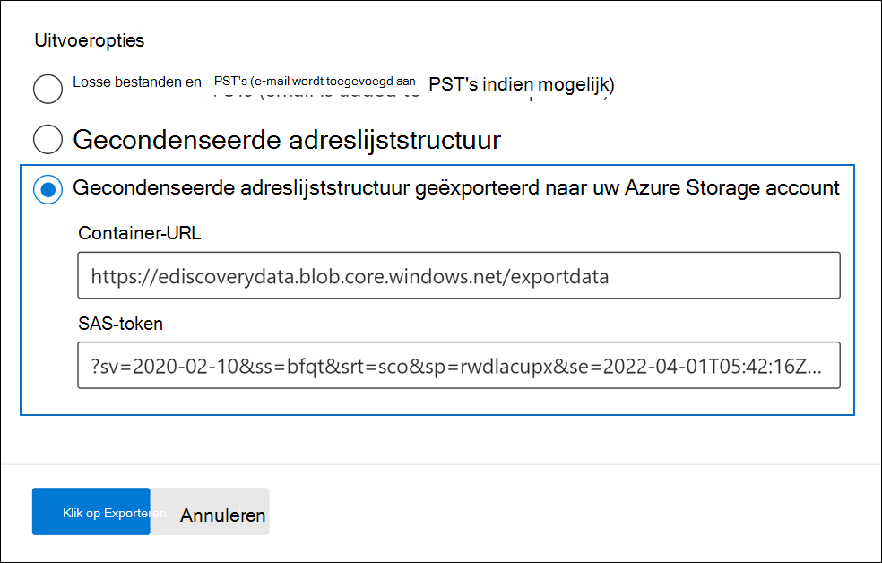
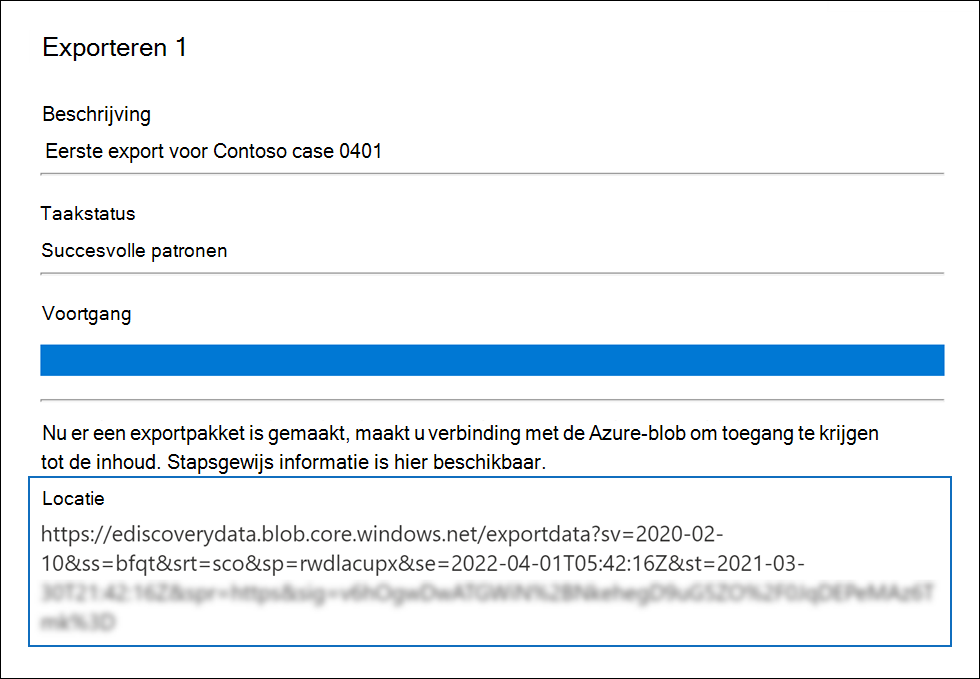
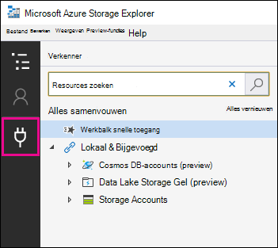
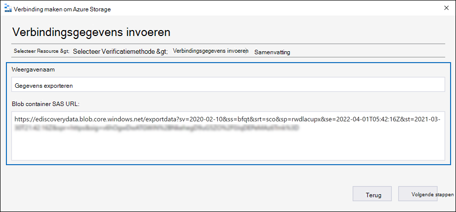
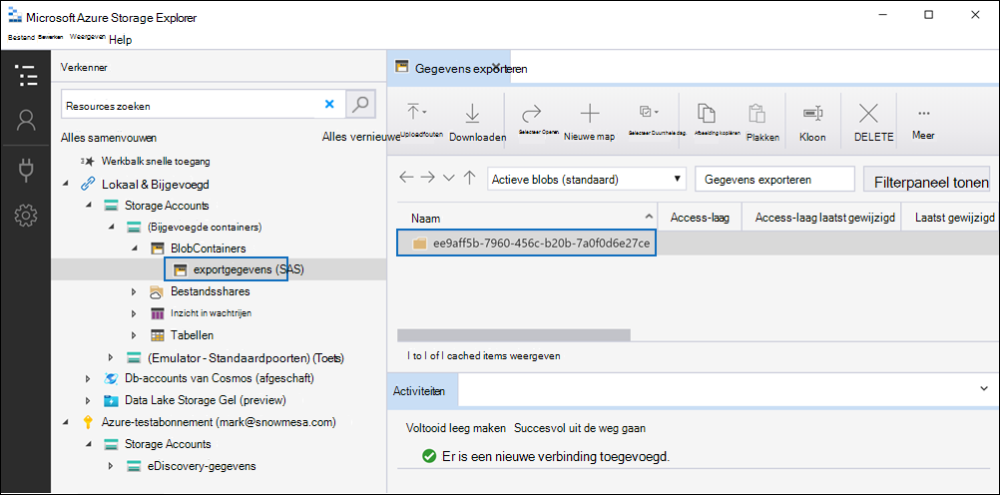
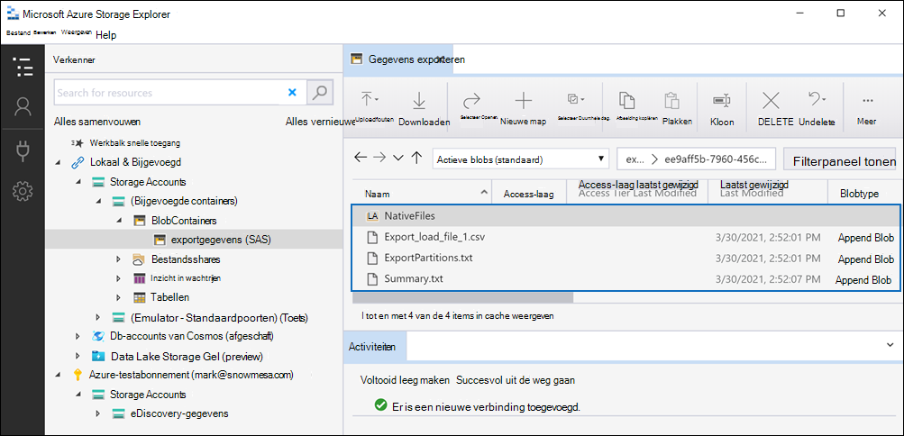

# Documenten in een revisieset exporteren naar een Azure Storage accountExport documents in a review set to an Azure Storage account

Wanneer u documenten exporteert uit een revisieset in een Advanced eDiscovery, hebt u de optie om ze te exporteren naar een Azure Storage account dat door uw organisatie wordt beheerd.When you export documents from a review set in an Advanced eDiscovery case, you have the option to export them to an Azure Storage account managed by your organization. Als u deze optie hebt gebruikt, worden de documenten geüpload naar uw Azure Storage locatie.If you used this option, the documents are uploaded to your Azure Storage location. Nadat ze zijn geëxporteerd, kunt u de documenten openen (en downloaden naar een lokale computer of andere locatie) met behulp van de Azure Storage Explorer.After they are exported, you can access the documents (and download them to a local computer or other location) by using the Azure Storage Explorer. In dit artikel vindt u instructies voor het exporteren van documenten naar uw Azure Storage-account en het gebruik van de Azure Storage Explorer om verbinding te maken met een Azure Storage locatie om de geëxporteerde documenten te downloaden.This article provides instructions for how to export documents to your Azure Storage account and the use the Azure Storage Explorer to connect to an Azure Storage location to download the exported documents. Zie Gebruik Azure Storage Explorer voor [meer Azure Storage Explorer.](/azure/storage/blobs/storage-quickstart-blobs-storage-explorer)For more information about Azure Storage Explorer, see [Use Azure Storage Explorer](/azure/storage/blobs/storage-quickstart-blobs-storage-explorer).

## Voordat u documenten exporteert uit een revisiesetBefore you export documents from a review set

- U moet een SAS-token (Shared Access Signature) opgeven voor uw Azure Storage-account en de URL voor een specifieke container in het opslagaccount om documenten uit een revisieset te exporteren.You need to provide a shared access signature (SAS) token for your Azure Storage account and the URL for a specific container in the storage account to export documents from a review set. Zorg ervoor dat u deze bij de hand hebt (bijvoorbeeld gekopieerd naar een tekstbestand) wanneer u stap 2 uit te voerenBe sure to have these at hand (for example, copied to a text file) when you perform Step 2

  - **SAS-token:** Zorg ervoor dat u het SAS-token krijgt voor uw Azure Storage account (en niet voor de container).**SAS token**: Be sure to get the SAS token is for your Azure Storage account (and not for the container). U kunt een SAS-token voor uw account genereren in Azure Storage.You can generate an SAS token for your account in Azure Storage. Hiervoor gaat u naar het Azure Storage account en selecteert u  **Toegangshandtekening** delen onder de Instellingen instellingen in het opslagaccountblad.To do this, go to the Azure Storage account, and select **Share access signature** under the **Settings** settings in the storage account blade. Gebruik de standaardinstellingen en sta alle resourcetypen toe wanneer u het SAS-token genereert.Use the default settings and allow all resource types when you generate the SAS token.

  - **Container-URL:** u moet een container maken om de documenten van de revisieset te uploaden naar en vervolgens een kopie van de URL voor de container krijgen. `https://ediscoverydata.blob.core.windows.net/exportdata`bijvoorbeeld.**Container URL**: You need to create a container to upload the review set documents to, and then get a copy of the URL for the container; for example, `https://ediscoverydata.blob.core.windows.net/exportdata`. Als u de URL wilt krijgen, gaat u naar de container in Azure Storage en **selecteert** u Eigenschappen onder de **Instellingen** sectie in het containerblad.To get the URL, go to the container in Azure Storage, and select **Properties** under the **Settings** section in the container blade.

- Download en installeer de Azure Storage Explorer.Download and install the Azure Storage Explorer. Zie het Azure Storage Explorer [voor instructies.](https://go.microsoft.com/fwlink/p/?LinkId=544842)For instructions, see [Azure Storage Explorer tool](https://go.microsoft.com/fwlink/p/?LinkId=544842). U gebruikt dit hulpprogramma om verbinding te maken met de container in Azure Storage account en de documenten te downloaden die u hebt geëxporteerd in stap 1.You use this tool to connect to the container in your Azure Storage account and download the documents that you exported in Step 1.

## Stap 1: De documenten exporteren uit een revisiesetStep 1: Export the documents from a review set

De eerste stap is het maken van een exportklus om documenten uit een revisieset te exporteren.The first step is to create an export job to export documents out of a review set. Zie Documenten exporteren uit een revisieset voor meer gedetailleerde instructies over alle [exportopties.](export-documents-from-review-set.md)For more detailed instructions about all the export options, see [Export documents from a review set](export-documents-from-review-set.md). In de volgende procedure worden de instellingen belicht voor het exporteren van documenten naar het account Azure Storage uw organisatie.The following procedure highlights the settings to export documents to your organization's Azure Storage account.

1. Open in Microsoft 365 compliancecentrum het hoofd- Advanced eDiscovery, selecteer  het tabblad Revisiesets en selecteer vervolgens de revisieset die u wilt exporteren.In the Microsoft 365 compliance center, open the Advanced eDiscovery case, select the **Review sets** tab, and then select the review set that you want to export.

2. Klik in de revisieset op **Actie**  >  **exporteren.**In the review set, click **Action** > **Export**.

3. Typ op **de flyoutpagina** Exportopties een naam (vereist) en beschrijving (optioneel) voor de export.On the **Export options** flyout page, type a name (required) and description (optional) for the export.

4. Configureer de instellingen in de secties documenten, metagegevens, inhoud en opties.Configure the settings in the documents, metadata, content, and options sections. Zie Documenten exporteren uit een revisieset voor meer informatie over [deze instellingen.](export-documents-from-review-set.md)For more information about these settings, see [Export documents from a review set](export-documents-from-review-set.md).

5. Selecteer in **de sectie Uitvoeropties** de **optie Gecondenseerde** adreslijststructuur die naar uw Azure Storage account wordt geëxporteerd.In the **Output options** section, select the **Condensed directory structure exported to your Azure Storage account** option.

6. Plak de container-URL en het SAS-token voor uw opslagaccount in de bijbehorende velden.Paste the container URL and the SAS token for your storage account in the corresponding fields.

   

7. Klik **op Exporteren** om de exportklus te maken.Click **Export** to create the export job.

## Stap 2: De SAS-URL van de exportklus verkrijgenStep 2: Obtain the SAS URL from the export job

De volgende stap is het verkrijgen van de SAS-URL die wordt gegenereerd nadat u de exportklus hebt gemaakt in stap 1.The next step is to obtain the SAS URL that's generated after you create the export job in Step 1. U gebruikt de SAS-URL om verbinding te maken met de container in uw Azure Storage account waar u de revisiesetdocumenten naar hebt geëxporteerd.You use the SAS URL to connect to the container in your Azure Storage account that you exported the review set documents to.

1. Ga op **Advanced eDiscovery** pagina naar de zaak en klik vervolgens op **het tabblad** Exporteren.On the **Advanced eDiscovery** page, go to the case, and then click the **Exports** tab.

2. Klik op **het** tabblad Export op de exportklus die u wilt downloaden.On the **Exports** tab, click the export job that you want to download. Dit is de exportklus die u hebt gemaakt in stap 1.This is the export job that you created in Step 1.

3. Kopieer op de flyoutpagina onder **Locaties** de SAS-URL die wordt weergegeven.On the flyout page, under **Locations**, copy the SAS URL that's displayed. Zo nodig kunt u het bestand opslaan in een tekstbestand, zodat u het in stap 3 kunt openen.If necessary, you can save it to a text file so you can access it in Step 3.

   

   > [!TIP]
   > De SAS-URL die wordt weergegeven in de exportklus is een samenvoeging van de CONTAINER-URL en het SAS-token voor uw Azure Storage account.The SAS URL that's displayed in the export job is a concatenation of the container URL and the SAS token for your Azure Storage account. U kunt deze kopiëren vanuit de exportklus of zelf maken door de URL en het SAS-token te combineren.You can copy it from the export job or create it yourself by combining the URL and the SAS token.

## Stap 3: Verbinding maken naar de Azure Storage containerStep 3: Connect to the Azure Storage container

De laatste stap is om de Azure Storage Explorer en de SAS-URL te gebruiken om verbinding te maken met de container in uw Azure Storage-account en de geëxporteerde documenten naar een lokale computer te downloaden.The final step is to use the Azure Storage Explorer and the SAS URL to connect to the container in your Azure Storage account and download the exported documents to a local computer.

1. Start de Azure Storage Explorer die u hebt gedownload en geïnstalleerd.Start the Azure Storage Explorer that you downloaded and installed.

2. Klik op **het pictogram Verbinding maken dialoogvenster** openen.Click the **Open Connect Dialog** icon.

   

3. Klik op **Verbinding maken pagina Azure Storage** op Blob **container.**On the **Connect to Azure Storage** page, click **Blob container**.

4. Selecteer op **de pagina Verificatiemethode** selecteren de optie **Sas (Shared Access signature)** en klik vervolgens op **Volgende**.On the **Select Authentication Method** page, select the **Shared access signature (SAS)** option and then click **Next**.

5. Plak op **de pagina Verbindingsgegevens** invoeren de SAS-URL (die u hebt verkregen in de exportklus in stap 2) in het vak **Blob Container SAS URL.**On the **Enter Connection Info** page, paste the SAS URL (that you obtained in the export job in Step 2) in the **Blob Container SAS URL** box.

    

    U ziet dat de containernaam wordt weergegeven in het **vak Weergavenaam.**Notice that the container name is displayed in the **Display name** box. U kunt deze naam bewerken.You can edit this name.

6. Klik **op Volgende** om de **overzichtspagina weer te** geven en klik vervolgens op **Verbinding maken.**Click **Next** to display the **summary** page and then click **Connect**.

    Het **knooppunt blobcontainers** **(onder Storage Accounts**  >  **(Bijgevoegde containers)** wordt \> geopend.The **Blob containers** node (under **Storage Accounts** > **(Attached Containers)** \> is opened.

    

    De container bevat een container met de weergavenaam uit stap 5.It contains a container named with the display name from step 5. Deze container bevat een map voor elke exportklus die u hebt gedownload naar de container in uw Azure Storage account.This container contains a folder for each export job that you've downloaded to the container in your Azure Storage account. Deze mappen worden benoemd met een id die overeenkomt met de id van de exportklus.These folders are named with an ID that corresponds to the ID of the export job. U kunt deze export-ID's (en de  naam van de export) vinden onder Ondersteuningsinformatie op  de flyoutpagina voor elke voorbereiding van gegevens voor **exporttaken** die worden weergegeven op het tabblad Taken in het Advanced eDiscovery geval.You can find these export IDs (and the name of the export) under **Support information** on the flyout page for each **Preparing data for export** job listed on the **Jobs** tab in the Advanced eDiscovery case.

7. Dubbelklik op de exportmap om deze te openen.Double-click the export job folder to open it.

   Er wordt een lijst met mappen en exportrapporten weergegeven.A list of folders and export reports is displayed.

    

8. Als u alle inhoud van de  exportklus wilt exporteren, klikt u op de pijl-omhoog om terug te gaan naar de map Exportklus en klikt u vervolgens op **Downloaden.**To export all contents from the export job, click the **Up** arrow to go back to the export job folder, and then click **Download**.

9. Geef de locatie op waar u de geëxporteerde bestanden wilt downloaden en klik vervolgens op Map selecteren.Specify the location where you want to download the exported files, and then click Select folder.

    Met Azure Storage Explorer start u het downloadproces.The Azure Storage Explorer starts the download process. De status van het downloaden van de geëxporteerde items wordt weergegeven in het **deelvenster** Activiteiten.The status of the downloading the exported items is displayed in the **Activities** pane. Er wordt een bericht weergegeven wanneer de download is voltooid.A message is displayed when the download is complete.

> [!NOTE]
> In plaats van de hele exportklus in Azure Storage Explorer downloaden, kunt u specifieke items selecteren die u wilt downloaden en weergeven.Instead of downloading the entire export job in Azure Storage Explorer, you can select specific items to download and view.

## Meer informatieMore information

- De map Taak exporteren bevat de volgende items.The export job folder contains the following items. De werkelijke items in de exportmap worden bepaald door de exportopties die zijn geconfigureerd toen de exportklus werd gemaakt.The actual items in the export folder are determined by the export options configured when the export job was created. Zie Documenten exporteren uit een revisieset voor meer informatie over [deze opties.](export-documents-from-review-set.md)For more information about these options, see [Export documents from a review set](export-documents-from-review-set.md).

  - Export_load_file.csv: Dit CSV-bestand is een detailexportrapport met informatie over elk geëxporteerd document.Export_load_file.csv: This CSV file is a detail export report that contains information about each exported document. Het bestand bestaat uit een kolom voor elke eigenschap metagegevens voor een document.The file consists of a column for each metadata property for a document. Zie de kolom Geëxporteerde veldnaam in de tabel  in documentmetagegevensvelden in Advanced eDiscovery voor een lijst en beschrijving van de metagegevens die in dit [rapport zijn opgenomen.](document-metadata-fields-in-advanced-ediscovery.md)For a list and description of the metadata that's included in this report, see the **Exported field name** column in the table in [Document metadata fields in Advanced eDiscovery](document-metadata-fields-in-advanced-ediscovery.md).

  - Summary.txt: Een tekstbestand met een overzicht van de export, inclusief exportstatistieken.Summary.txt: A text file that contains a summary of the export including export statistics.

  - Extracted_text_files: Deze map bevat een tekstbestandsversie van elk geëxporteerd document.Extracted_text_files: This folder contains a text file version of each exported document.

  - NativeFiles: Deze map bevat een oorspronkelijke bestandsversie van elk geëxporteerd document.NativeFiles: This folder contains a native file version of each exported document.

  - Error_files: Deze map bevat de volgende items wanneer de exportklus foutbestanden bevat:Error_files: This folder includes the following items when the export job contains any error files:

    - ExtractionError.csv: Dit CSV-bestand bevat de beschikbare metagegevens voor bestanden die niet correct zijn geëxtraheerd uit het bovenliggende item.ExtractionError.csv: This CSV file contains the available metadata for files that weren't properly extracted from their parent item.

    - ProcessingError: Deze map bevat documenten met verwerkingsfouten.ProcessingError: This folder contains documents with processing errors. Deze inhoud is op itemniveau, wat betekent dat als een bijlage een verwerkingsfout heeft, het document met de bijlage ook in deze map wordt opgenomen.This content is at an item level, which means if an attachment had a processing error, the document that contains the attachment will also be included in this folder.
