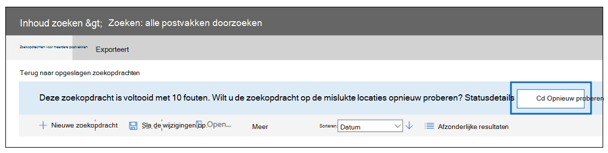

# <a name="investigate-troubleshoot-and-resolve-common-ediscovery-issues"></a>Veelvoorkomende eDiscovery-problemen onderzoeken, oplossen en oplossen

Dit onderwerp gaat over eenvoudige stappen voor het oplossen van problemen die u kunt ondernemen om problemen te identificeren en op te lossen die u tijdens een eDiscovery-zoekopdracht of elders in het eDiscovery-proces kunt tegenkomen. Voor het oplossen van een aantal van deze scenario's is hulp nodig van Microsoft Support. Informatie over wanneer u contact op wilt nemen met Microsoft Support, wordt opgenomen in de stappen voor de oplossing.

## <a name="errorissue-ambiguous-location"></a>Fout/probleem: onduidelijke locatie

Als u de postvaklocatie van de gebruiker probeert toe te voegen om te zoeken en er dubbele of conflicterende objecten met dezelfde gebruikers-id in de EOP-adreslijst (Exchange Online Protection) staan, krijgt u deze foutmelding: `The compliance search contains the following invalid location(s):useralias@contoso.com. The location "useralias@contoso.com" is ambiguous` .

### <a name="resolution"></a>Oplossing

Controleer op dubbele gebruikers of distributielijst met dezelfde gebruikers-id.

1. Verbinding maken [naar Security & Compliance Center PowerShell](/powershell/exchange/connect-to-scc-powershell).

2. Voer de volgende opdracht uit om alle exemplaren van de gebruikersnaam op te halen:

    ```powershell
    Get-Recipient <username>
    ```

   De uitvoer voor 'useralias@contoso.com' lijkt op het volgende:

   > 
   > |Naam|RecipientType|
   > |---|---|
   > |Alias, gebruiker|MailUser|
   > |Alias, gebruiker|Gebruiker|

3. Als meerdere gebruikers worden geretourneerd, zoekt u het conflicterende object en lost u het op.

## <a name="errorissue-search-fails-on-specific-locations"></a>Fout/probleem: Zoeken mislukt op specifieke locaties

Een eDiscovery- of inhoudszoekactie kan de volgende fout opleveren: `This search completed with (#) errors.  Would you like to retry the search on the failed locations?`



### <a name="resolution"></a>Oplossing

Als u deze foutmelding krijgt, raden we u aan de locaties te controleren die niet zijn gevonden in de zoekopdracht en de zoekopdracht vervolgens alleen op de mislukte locaties opnieuw uit te proberen.

1. Verbinding maken [naar Security & Compliance Center PowerShell](/powershell/exchange/connect-to-scc-powershell) en voer vervolgens de volgende opdracht uit:

   ```powershell
   Get-ComplianceSearch <searchname> | FL
   ```

2. Bekijk vanuit de PowerShell-uitvoer de mislukte locaties in het foutenveld of van de statusdetails in de fout uit de zoekuitvoer.

3. U kunt de eDiscovery-zoekopdracht alleen op de mislukte locaties opnieuw proberen.

4. Zie Mislukte locaties opnieuw proberen [](/Office365/SecurityCompliance/retry-failed-content-search) voor meer stappen voor het oplossen van problemen als u deze fouten blijft ontvangen.

## <a name="errorissue-file-not-found"></a>Fout/probleem: Bestand niet gevonden

Bij het uitvoeren van een eDiscovery-zoekopdracht met SharePoint Online- en One Drive For Business-locaties, ontvangt u mogelijk de fout, hoewel het bestand zich `File Not Found` op de site bevindt. Deze fout wordt weergegeven in de exportwaarschuwingen en errors.csv of overgeslagen items.csv. Dit kan optreden als het bestand niet kan worden gevonden op de site of als de index verouderd is. Hier is de tekst van een werkelijke fout (met nadruk toegevoegd).

> 28.06.2019 10:02:19_FailedToExportItem_Failed om inhoud te downloaden. Aanvullende diagnostische informatie: Microsoft. Office. Compliance.EDiscovery.ExportWorker.Exceptions.ContentDownloadTemporaryFailure: Kan niet worden gedownload van inhoud 6ea52149-91cd-4965-b5bb-82ca6a3ec9be van het type Document. Correlatie-id: 3bd84722-937b-4c23-b61b-08d6fba9ec32. ServerErrorCode: -2147024894 ---> Microsoft. SharePoint. Client.ServerException: ***Bestand niet gevonden.*** bij Microsoft. SharePoint. Client.ClientRequest.ProcessResponseStream(Stream responseStream) bij Microsoft. SharePoint. Client.ClientRequest.ProcessResponse() --- End of inner exception stack trace ---

### <a name="resolution"></a>Oplossing

1. Controleer de locatie die is geïdentificeerd in de zoekopdracht om ervoor te zorgen dat de locatie van het bestand juist is en toegevoegd aan de zoeklocaties.

2. Gebruik de procedures bij [Handmatig aanvragen voor het crawlen](/sharepoint/crawl-site-content) en opnieuw indexeren van een site, bibliotheek of lijst om de site opnieuw te indexeren.

## <a name="errorissue-this-file-wasnt-exported-because-it-doesnt-exist-anymore-the-file-was-included-in-the-count-of-estimated-search-results-because-its-still-listed-in-the-index-the-file-will-eventually-be-removed-from-the-index-and-wont-cause-an-error-in-the-future"></a>Fout/probleem: Dit bestand is niet geëxporteerd omdat het niet meer bestaat. Het bestand is opgenomen in het aantal geschatte zoekresultaten omdat het nog steeds in de index wordt vermeld. Het bestand wordt uiteindelijk uit de index verwijderd en veroorzaakt in de toekomst geen fout.

Mogelijk ziet u deze fout bij het uitvoeren van een eDiscovery-zoekopdracht met SharePoint Online en One Drive For Business-locaties. eDiscovery is afhankelijk van de SPO-index om de bestandslocaties te identificeren. Als het bestand is verwijderd, maar de SPO-index nog niet is bijgewerkt, kan deze fout optreden.

### <a name="resolution"></a>Oplossing 
Open de SPO-locatie en controleer of dit bestand er inderdaad niet is.
Voorgestelde oplossing is om de site handmatig opnieuw te indexeren of te wachten totdat de site opnieuw wordt geïndexeerd door het automatische achtergrondproces.


## <a name="errorissue-this-search-result-was-not-downloaded-as-it-is-a-folder-or-other-artefact-that-cant-be-downloaded-by-itself-any-items-inside-the-folder-or-library-will-be-downloaded"></a>Fout/probleem: Dit zoekresultaat is niet gedownload omdat het een map of ander artefact is dat niet zelf kan worden gedownload, items in de map of bibliotheek worden gedownload.

Mogelijk ziet u deze fout bij het uitvoeren van een eDiscovery-zoekopdracht met SharePoint Online en One Drive For Business-locaties. Het betekent dat we het item dat in de index is gerapporteerd, zouden proberen te exporteren, maar het bleek een map te zijn, zodat we het niet hebben geëxporteerd. Zoals in de fout wordt vermeld, exporteren we geen mapitems, maar exporteren we wel de inhoud ervan.


## <a name="errorissue-search-fails-because-recipient-is-not-found"></a>Fout/probleem: Zoeken mislukt omdat geadresseerde niet wordt gevonden

Een eDiscovery-zoekopdracht mislukt met de fout de `recipient not found` . Deze fout kan optreden als het gebruikersobject niet kan worden gevonden in Exchange Online Protection (EOP) omdat het object niet is gesynchroniseerd.

### <a name="resolution"></a>Oplossing

1. Verbinding maken [powershell Exchange Online gebruiken.](/powershell/exchange/connect-to-exchange-online-powershell)

2. Voer de volgende opdracht uit om te controleren of de gebruiker is gesynchroniseerd met Exchange Online Protection:

   ```powershell
   Get-Recipient <userId> | FL
   ```

3. Er moet een e-mailgebruikersobject zijn voor de gebruikersvraag. Als er niets wordt geretourneerd, onderzoekt u het gebruikersobject. Neem contact op met Microsoft Support als het object niet kan worden gesynchroniseerd.

## <a name="errorissue-exporting-search-results-is-slow"></a>Fout/probleem: Het exporteren van zoekresultaten is traag

Wanneer u zoekresultaten exporteert vanuit eDiscovery of Inhoud zoeken in het beveiligings- en compliancecentrum, duurt de download langer dan verwacht.  U kunt controleren hoeveel gegevens moeten worden gedownload en de exportsnelheid mogelijk verhogen.

### <a name="resolution"></a>Oplossing

1. Verbinding maken [naar Security & Compliance Center PowerShell](/powershell/exchange/connect-to-scc-powershell) en voer vervolgens de volgende opdracht uit:

   ```powershell
   Get-ComplianceSearch <searchname> | FL
   ```

2. Zoek de hoeveelheid gegevens die moet worden gedownload in de parameters SearchResults en SearchStatistics.

3. Voer de volgende opdracht uit:

   ```powershell
   Get-ComplianceSearchAction | FL
   ```

4. Zoek in het veld Resultaten de gegevens die zijn geëxporteerd en bekijk eventuele fouten die zijn aangetroffen.

5. Controleer het trace.log-bestand in de adreslijst waar u de inhoud naar hebt geëxporteerd op eventuele fouten.

6. Als u nog steeds problemen hebt, kunt u zoekopdrachten die een grote reeks resultaten retourneren, verdelen in kleinere zoekopdrachten. U kunt bijvoorbeeld datumbereiken in zoekquery's gebruiken om een kleinere reeks resultaten te retourneren die sneller kunnen worden gedownload.

## <a name="errorissue-internal-server-error-500-occurred"></a>Fout/probleem: 'Interne serverfout (500) is opgetreden'

Bij het uitvoeren van een eDiscovery-zoekopdracht, als de zoekopdracht voortdurend mislukt met een fout die lijkt op 'Interne serverfout (500) is opgetreden', moet u de zoekopdracht mogelijk alleen opnieuw uitvoeren op specifieke postvaklocaties.


### <a name="resolution"></a>Oplossing

1. Deel de zoekopdracht op in kleinere zoekopdrachten en voer de zoekopdracht opnieuw uit.  Probeer een kleiner datumbereik te gebruiken of beperk het aantal locaties dat wordt gezocht.

2. Verbinding maken [naar Security & Compliance Center PowerShell](/powershell/exchange/connect-to-scc-powershell) en voer vervolgens de volgende opdracht uit:

   ```powershell Set-CaseHoldPolicy <policyname> -RetryDistribution
   Get-ComplianceSearch <searchname> | FL
   ```

3. Bekijk de uitvoer op resultaten en fouten.

4. Bekijk het trace.log-bestand. De map bevindt zich in dezelfde map waar u de zoekresultaten naar hebt geëxporteerd.

5. Contact Microsoft Support.

## <a name="errorissue-holds-dont-sync"></a>Fout/probleem: de synchronisatie van de in-en-uit-standen wordt niet gesynchroniseerd

eDiscovery Case Hold Policy Sync Distribution error. De fout leest:

> 'Resources: het implementeren van het beleid duurt langer dan verwacht. Het kan nog twee uur duren voordat de uiteindelijke implementatiestatus is bijgewerkt, dus kijk over een paar uur terug.

### <a name="resolution"></a>Oplossing

1. Verbinding maken naar [Security & Compliance Center PowerShell en](/powershell/exchange/connect-to-scc-powershell) voer vervolgens de volgende opdracht uit voor een eDiscovery-case hold:

   ```powershell
   Get-CaseHoldPolicy <policyname> - DistributionDetail | FL
   ```

    Voer voor een bewaarbeleid de volgende opdracht uit:

   ```powershell
   Get-RetentionCompliancePolicy <policyname> - DistributionDetail | FL
   ```

2. Bekijk de waarde in de parameter DistributionDetail op fouten als volgt:

   > Fout: Resources: het implementeren van het beleid duurt langer dan verwacht. Het kan nog twee uur duren voordat de uiteindelijke implementatiestatus is bijgewerkt, dus kijk over een paar uur terug.

3. Probeer de parameter RetryDistribution uit te voeren op het beleid in kwestie:

   Voor eDiscovery geldt het volgende:

   ```powershell
   Set-CaseHoldPolicy <policyname> -RetryDistribution
   ```

   Voor bewaarbeleid:

   ```powershell
   Set-RetentionCompliancePolicy <policyname> -RetryDistribution
   ```

4. Contact Microsoft Support.

## <a name="error-the-condition-specified-using-http-conditional-headers-is-not-met"></a>Fout: 'Aan de voorwaarde die is opgegeven met behulp van HTTP-voorwaardelijke kopteksten wordt niet voldaan'

Wanneer u zoekresultaten downloadt met het eDiscovery-exporthulpmiddel, is het mogelijk dat u de volgende foutmelding ontvangt: Dit is een tijdelijke fout, die meestal optreedt op de Azure Storage `System.Net.WebException: The remote server returned an error: (412) The condition specified using HTTP conditional header(s) is not met.` locatie.

### <a name="resolution"></a>Oplossing

Als u dit probleem wilt oplossen, [downloadt](export-search-results.md#step-2-download-the-search-results)u de zoekresultaten opnieuw, waarmee het eDiscovery-exporthulpmiddel opnieuw wordt gestart.

## <a name="errorissue-downloaded-export-shows-no-results"></a>Fout/probleem: Gedownloade export toont geen resultaten

Na een geslaagde export toont de voltooide download via het exporthulpmiddel nul bestanden in de resultaten.

### <a name="resolution"></a>Oplossing

Dit is een probleem aan de clientzijde en probeer de volgende stappen om het probleem te verhelpen:

1. Probeer een andere client/computer te downloaden.

2. Verwijder oude zoekopdrachten die niet meer nodig zijn met [de cmdlet Remove-ComplianceSearch.](/powershell/module/exchange/remove-compliancesearch)

3. Zorg ervoor dat u downloadt naar een lokaal station.

4. Zorg ervoor dat de virusscanner niet wordt uitgevoerd.

5. Zorg ervoor dat er geen andere export wordt gedownload naar dezelfde map of een bovenliggende map.

6. Als de vorige stappen niet werken, schakelt u het omkeren en de duplicatie uit.

7. Als dit werkt, is het probleem het gevolg van een lokale virusscanner of een schijfprobleem.
