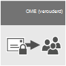

# E-mailversleuteling

Dit artikel vergelijkt Microsoft 365-versleutelingsopties inclusief Office 365 Message Encryption (OME), S/MIME, Information Rights Management (IRM), en introduceert Transport Layer Security (TLS).
  
Microsoft 365 biedt meerdere versleutelingsopties om u te helpen voldoen aan de behoeften van uw bedrijf op het gebied van e-mailbeveiliging. In dit artikel worden drie manieren beschreven waarop u e-mail in Office 365 kunt versleutelen. Als u meer wilt weten over alle beveiligingsfuncties in Office 365, gaat u naar [het Office 365 Vertrouwenscentrum](https://go.microsoft.com/fwlink/p/?LinkID=282470). In dit artikel worden de drie typen versleuteling beschreven die Microsoft 365-beheerders kunnen gebruiken om e-mail in Office 365 te beveiligen:
  
- Office-berichtversleuteling (OME).

- S/MIME (Secure/Multipurpose Internet Mail Extensions).

- IRM (Information Rights Management).

## Hoe Microsoft 365 e-mailversleuteling gebruikt

Versleuteling is het proces waarbij informatie wordt gecodeerd, zodat alleen een geautoriseerde geadresseerde de informatie kan decoderen en gebruiken. Microsoft 365 gebruikt versleuteling op twee manieren: in de service en als een klantbesturingselement. In de service wordt versleuteling standaard gebruikt in Microsoft 365; u hoeft niets te configureren. Zo maakt Microsoft 365 gebruik van TLS (Transport Layer Security) om de verbinding of sessie tussen twee servers te versleutelen. 
  
Gewoonlijk werkt e-mailversleuteling als volgt:
  
- Een bericht wordt versleuteld of van tekst omgezet in onleesbare versleutelde tekst, op de computer van de afzender of door een centrale server terwijl het bericht onderweg is.

- Het bericht blijft versleutelde tekst terwijl het onderweg is, om te voorkomen dat het wordt gelezen wanneer het wordt onderschept.

- Nadat het bericht is ontvangen door de geadresseerde, wordt het op twee manieren weer omgezet in leesbare tekst:

  - De computer van de ontvanger gebruikt een sleutel om het bericht te ontsleutelen, of

  - Een centrale server ontsleutelt het bericht namens de geadresseerde, na validatie van de identiteit van de geadresseerde.

Zie [Hoe TLS door Exchange Online wordt gebruikt om e-mailverbindingen in Office 365 te beveiligen](exchange-online-uses-tls-to-secure-email-connections.md) voor meer informatie over hoe Microsoft 365 de communicatie tussen servers beveiligt, zoals tussen organisaties binnen Microsoft 365 of tussen Microsoft 365 en een vertrouwde zakenpartner buiten Microsoft 365.
  
Bekijk deze video voor een inleiding tot [Versleuteling in Office 365](https://www.youtube.com/watch?v=KmfxCd5ublI).
  
## Vergelijking van opties voor e-mailversleuteling die beschikbaar zijn in Office 365

|Technologie voor e-mailversleuteling||||
|:-----|:-----|:-----|:-----|
|Wat is het?|Office 365 Message Encryption (OME) is een service die is gebaseerd op Azure Rights Management (Azure RMS) waarmee u versleutelde e-mail kunt verzenden naar personen binnen of buiten uw organisatie, ongeacht het doel-e-mailadres (Gmail, Yahoo! Mail, Outlook.com, enz.).   Als beheerder kunt u transportregels instellen die de voorwaarden voor versleuteling definiëren. Wanneer een gebruiker een bericht verzendt dat overeenkomt met een regel, wordt versleuteling automatisch toegepast.   Als u versleutelde berichten wilt weergeven, kunnen geadresseerden een eenmalige wachtwoordcode krijgen, zich aanmelden met een Microsoft-account of zich aanmelden met een werk- of schoolaccount dat is gekoppeld aan Office 365. Geadresseerden kunnen ook versleutelde antwoorden verzenden. Ze hebben geen Microsoft 365-abonnement nodig om versleutelde berichten te bekijken of versleutelde antwoorden te verzenden.|IRM is een versleutelingsoplossing die ook gebruiksbeperkingen op e-mailberichten toepast. Hiermee kan worden voorkomen dat vertrouwelijke gegevens door onbevoegden worden afgedrukt, doorgestuurd of gekopieerd.   IRM-mogelijkheden in Microsoft 365 maken gebruik van Azure Rights Management (Azure RMS).|S/MIME is een versleutelingsoplossing op basis van certificaten waarmee u een bericht zowel kunt versleutelen als digitaal ondertekenen. De berichtversleuteling zorgt ervoor dat alleen de beoogde ontvanger het bericht kan openen en lezen. Met een digitale handtekening kan de geadresseerde de identiteit van de afzender valideren.   Digitale handtekeningen en berichtversleuteling worden mogelijk gemaakt door gebruik te maken van unieke digitale certificaten die de sleutels bevatten voor het verifiëren van digitale handtekeningen en het versleutelen of ontsleutelen van berichten.   Als u S/MIME wilt gebruiken, moeten er openbare sleutels voor elke geadresseerde zijn opgeslagen. Geadresseerden moeten hun eigen persoonlijke sleutels onderhouden, die veilig moeten blijven. Als de privésleutels van een geadresseerde in gevaar komen, moet de geadresseerde een nieuwe persoonlijke sleutel verkrijgen en opnieuw openbare sleutels distribueren aan alle potentiële afzenders.|
|Wat doet het?|OME:   Versleutelt berichten die naar interne of externe geadresseerden worden verzonden.    Hiermee kunnen gebruikers versleutelde berichten verzenden naar elk e-mailadres, waaronder Outlook.com, Yahoo! Mail en Gmail.    Hiermee kunt u als beheerder de portal voor het bekijken van e-mail aanpassen om het merk van uw organisatie te weerspiegelen.   Microsoft beheert en slaat de sleutels veilig op, zodat u dat zelf niet hoeft te doen.   Er is geen speciale software aan de clientkant nodig, zolang het versleutelde bericht (verzonden als een HTML-bijlage) kan worden geopend in een browser.|IRM:   Gebruikt versleuteling en beperkingen voor gebruik om e-mailberichten en bijlagen online en offline te beveiligen.   Hiermee kunt u, als beheerder, transportregels of Outlook-beveiligingsregels instellen om automatisch IRM toe te passen op bepaalde berichten.   Hiermee kunnen gebruikers handmatig sjablonen toepassen in Outlook of de webversie van Outlook (voorheen Outlook Web App).|S/MIME verwerkt verificatie van afzenders met digitale handtekeningen en vertrouwelijkheid van berichten met versleuteling.|
|Wat doet het niet?|OME laat u geen gebruiksbeperkingen toepassen op berichten. U kunt het bijvoorbeeld niet gebruiken om te voorkomen dat een ontvanger een versleuteld bericht doorstuurt of afdrukt.|Sommige toepassingen ondersteunen IRM-e-mailberichten misschien niet op alle apparaten. Zie voor meer informatie over deze en andere producten die ondersteuning bieden voor IRM-e-mail [Mogelijkheden voor clientapparaten](/azure/information-protection/requirements#BKMK_ClientCapabilities).|Met S/MIME kunnen versleutelde berichten niet worden gescand op malware, spam of beleid.|
|Aanbevelingen en voorbeeldscenario's|Het is raadzaam OME te gebruiken wanneer u vertrouwelijke bedrijfsgegevens wilt verzenden naar personen buiten uw organisatie, ongeacht of het consumenten of andere bedrijven zijn. Bijvoorbeeld:     Een bankmedewerker die creditcardafschriften naar klanten verstuurt     Een arts die medische gegevens naar een patiënt stuurt     Een advocaat die vertrouwelijke juridische informatie naar een andere advocaat stuurt|Het is raadzaam IRM te gebruiken wanneer u zowel gebruiksbeperkingen als versleuteling wilt toepassen. Bijvoorbeeld:     Een manager die vertrouwelijke gegevens over een nieuw product naar haar team stuurt, past de optie Niet doorsturen toe.     Een manager moet een offerte delen met een ander bedrijf, die een bijlage bevat van een partner die Office 365 gebruikt. Zowel het e-mailbericht als de bijlage moeten worden beveiligd.|Het is raadzaam S/MIME te gebruiken als voor uw organisatie of de organisatie van de ontvanger echte peer-to-peerversleuteling is vereist.     S/MIME wordt het meest gebruikt in de volgende scenario's:     Overheidsinstellingen communiceren met andere overheidsinstellingen     Een bedrijf dat communiceert met een overheidsinstantie|
||

## Welke versleutelingsopties zijn beschikbaar voor mijn Microsoft 365-abonnement?

Voor meer informatie over opties voor e-mailversleuteling voor uw Microsoft 365-abonnement raadpleegt u de [beschrijving van de Exchange Online-service](/office365/servicedescriptions/exchange-online-service-description/exchange-online-service-description). Hier vindt u informatie over de volgende versleutelingsfuncties:
  
- Azure RMS, inclusief IRM-mogelijkheden en OME

- S/MIME

- TLS

- Versleuteling van data-at-rest (via BitLocker)

U kunt ook versleutelingshulpprogramma's van derden gebruiken met Microsoft 365, bijvoorbeeld PGP (Pretty Good Privacy). Microsoft 365 biedt geen ondersteuning voor PGP/MIME en u kunt alleen PGP/Inline gebruiken voor het verzenden en ontvangen van met PGP versleutelde e-mailberichten.

## Hoe zit het met versleuteling voor data-at-rest?

'Data-at-rest' verwijst naar gegevens die niet actief in transit zijn. In Microsoft 365 worden e-mailgegevens-at-rest versleuteld met BitLocker Drive Encryption. BitLocker versleutelt de harde schijven in Microsoft-datacenters om te zorgen voor verbeterde beveiliging tegen toegang door onbevoegden. Zie voor meer informatie [Overzicht van BitLocker](/previous-versions/windows/it-pro/windows-server-2012-R2-and-2012/hh831713(v=ws.11)).
  
## Meer informatie over opties voor e-mailversleuteling

Zie de volgende artikelen voor meer informatie over de opties voor e-mailversleuteling in dit artikel en TLS:
  
**OME**
  
[Office 365-berichtversleuteling (OME)](ome.md)
  
**IRM**
  
[Information Rights Management in Exchange Online](./information-rights-management-in-exchange-online.md)
  
[Wat is Azure Rights Management?](/azure/information-protection/what-is-azure-rms)
  
**S/MIME**
  
[S/MIME voor het ondertekenen en versleutelen van berichten](/Exchange/policy-and-compliance/smime/smime)
  
[S/MIME beter begrijpen](/previous-versions/tn-archive/aa995740(v=exchg.65))
  
[Public Key Cryptography beter begrijpen](/previous-versions/tn-archive/aa998077(v=exchg.65))
  
**TLS**
  
[Aangepaste e-mailstroom configureren met connectors](/exchange/mail-flow-best-practices/use-connectors-to-configure-mail-flow/use-connectors-to-configure-mail-flow)