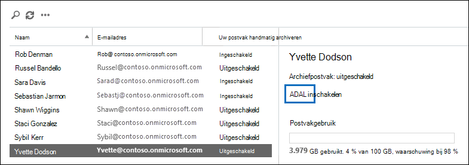

# <a name="enable-archive-mailboxes-in-the-compliance-center"></a><span data-ttu-id="93495-103">Archiefpostvakken inschakelen in het compliancecentrum</span><span class="sxs-lookup"><span data-stu-id="93495-103">Enable archive mailboxes in the compliance center</span></span>

<span data-ttu-id="93495-104">Archiveren in Microsoft 365 (ook wel *In-place archivering* genoemd) biedt gebruikers extra opslagruimte voor postvakken.</span><span class="sxs-lookup"><span data-stu-id="93495-104">Archiving in Microsoft 365 (also called *In-Place Archiving*) provides users with additional mailbox storage space.</span></span> <span data-ttu-id="93495-105">Nadat u archiefpostvakken hebt ingeslagen, kunnen gebruikers berichten in hun archiefpostvakken openen en opslaan met behulp van Microsoft Outlook en de webversie van Outlook (voorheen Outlook Web App).</span><span class="sxs-lookup"><span data-stu-id="93495-105">After you turn on archive mailboxes, users can access and store messages in their archive mailboxes by using Microsoft Outlook and Outlook on the web (formerly known as Outlook Web App).</span></span> <span data-ttu-id="93495-106">Gebruikers kunnen ook berichten verplaatsen of kopiëren tussen hun primaire postvak en hun archiefpostvak.</span><span class="sxs-lookup"><span data-stu-id="93495-106">Users can also move or copy messages between their primary mailbox and their archive mailbox.</span></span> <span data-ttu-id="93495-107">Ze kunnen ook verwijderde items uit de map Herstelbare items in het archiefpostvak herstellen met behulp van het hulpmiddel Verwijderde items herstellen.</span><span class="sxs-lookup"><span data-stu-id="93495-107">They can also recover deleted items from the Recoverable Items folder in their archive mailbox by using the Recover Deleted Items tool.</span></span>

> [!NOTE]
> <span data-ttu-id="93495-108">De functie voor automatische uitbreiding van archivering in Microsoft 365 biedt extra opslag in archiefpostvakken.</span><span class="sxs-lookup"><span data-stu-id="93495-108">The auto-expanding archiving feature in Microsoft 365 provides additional storage in archive mailboxes.</span></span> <span data-ttu-id="93495-109">Als automatisch uitbreidende archivering is ingeschakeld en het oorspronkelijke opslagquotum van het archiefpostvak van een gebruiker wordt bereikt, wordt automatisch extra opslagruimte toegevoegd in Microsoft 365.</span><span class="sxs-lookup"><span data-stu-id="93495-109">When auto-expanding  archiving is turned on, and then the initial storage quota in a user's archive mailbox is reached, Microsoft 365 automatically adds additional storage space.</span></span> <span data-ttu-id="93495-110">Dit betekent dat gebruikers geen opslagruimte meer hebben voor postvakken en u niets hoeft te beheren nadat u het archiefpostvak in eerste instantie hebt ingeschakeld en archivering met automatisch uitvijven voor uw organisatie hebt ingeschakeld.</span><span class="sxs-lookup"><span data-stu-id="93495-110">This means that users won't run out of mailbox storage space and you won't have to manage anything after you initially enable the archive mailbox and turn on auto-expanding archiving for your organization.</span></span> <span data-ttu-id="93495-111">Zie [Overview of unlimited archiving](unlimited-archiving.md) (Overzicht van onbeperkt archiveren in Office 365) voor meer informatie.</span><span class="sxs-lookup"><span data-stu-id="93495-111">For more information, see [Overview of unlimited archiving](unlimited-archiving.md).</span></span>

## <a name="get-the-necessary-permissions"></a><span data-ttu-id="93495-112">Verkrijg de benodigde machtigingen</span><span class="sxs-lookup"><span data-stu-id="93495-112">Get the necessary permissions</span></span>

<span data-ttu-id="93495-113">De rol van e-mailgeadresseerde moet aan u zijn toegewezen in Exchange Online om archiefpostvakken in- of uit te schakelen.</span><span class="sxs-lookup"><span data-stu-id="93495-113">You have to be assigned the Mail Recipients role in Exchange Online to enable or disable archive mailboxes.</span></span> <span data-ttu-id="93495-114">Deze rol is standaard toegewezen aan de rollengroepen Ontvangersbeheer en Organisatiebeheer op de pagina **Machtigingen** in het Exchange-beheercentrum.</span><span class="sxs-lookup"><span data-stu-id="93495-114">By default, this role is assigned to the Recipient Management and Organization Management role groups on the **Permissions** page in the Exchange admin center.</span></span> <span data-ttu-id="93495-115">Als u de pagina **Archief** in het Beveiligings- en compliancecentrum niet ziet, vraagt u de beheerder om u de benodigde machtigingen toe te wijzen.</span><span class="sxs-lookup"><span data-stu-id="93495-115">If you don't see the **Archive** page in the Security & Compliance Center, ask your administrator to assign you the necessary permissions.</span></span>

## <a name="enable-an-archive-mailbox"></a><span data-ttu-id="93495-116">Schakel een archiefpostvak in</span><span class="sxs-lookup"><span data-stu-id="93495-116">Enable an archive mailbox</span></span>

1. <span data-ttu-id="93495-117">Ga naar <https://compliance.microsoft.com> en meld u aan.</span><span class="sxs-lookup"><span data-stu-id="93495-117">Go to <https://compliance.microsoft.com> and sign in.</span></span>

2. <span data-ttu-id="93495-118">Klik in het linkerdeelvenster van het Microsoft365-compliancecentrum op **Informatiebeheer** en vervolgens op het **Archief**-tabblad.</span><span class="sxs-lookup"><span data-stu-id="93495-118">In the left pane of the Microsoft 365 compliance center, click **Information governance**, and then click the **Archive** tab.</span></span>

   <span data-ttu-id="93495-119">Er wordt een pagina **Archief** weergegeven.</span><span class="sxs-lookup"><span data-stu-id="93495-119">The **Archive** page is displayed.</span></span> <span data-ttu-id="93495-120">De **Archiefpostvak** geeft aan of een archiefpostvak voor elke gebruiker is ingeschakeld of uitgeschakeld.</span><span class="sxs-lookup"><span data-stu-id="93495-120">The **Archive mailbox** column indicates whether an archive mailbox is enabled or disabled for each user.</span></span>

   > [!NOTE]
   > <span data-ttu-id="93495-121">Op de pagina **Archief** kunnen maximaal 500 gebruikers worden weergegeven.</span><span class="sxs-lookup"><span data-stu-id="93495-121">The **Archive** page shows a maximum of 500 users.</span></span>

4. <span data-ttu-id="93495-122">Selecteer in de lijst met postvakken de gebruiker voor wie u het archiefpostvak wilt inschakelen.</span><span class="sxs-lookup"><span data-stu-id="93495-122">In the list of mailboxes, select the user that you want to enable the archive mailbox for.</span></span>

   

5. <span data-ttu-id="93495-124">Klik in het detailvenster voor de geselecteerde gebruiker op **Inschakelen**.</span><span class="sxs-lookup"><span data-stu-id="93495-124">In the details pane for the selected user, click **Enable**.</span></span>

   <span data-ttu-id="93495-125">Er wordt een waarschuwing weergegeven waarin wordt weergegeven dat items in het postvak van de gebruiker die ouder zijn dan het archiveringsbeleid dat aan het postvak is toegewezen, worden verplaatst naar het nieuwe archiefpostvak als u het archiefpostvak inschakelen.</span><span class="sxs-lookup"><span data-stu-id="93495-125">A warning is displayed saying that if you enable the archive mailbox, items in the user's mailbox that are older than the archiving policy assigned to the mailbox will be moved to the new archive mailbox.</span></span> <span data-ttu-id="93495-126">Twee jaar na de datum waarop het item in het postvak is bezorgd of door de gebruiker is gemaakt, worden items naar het archiefpostvak verplaatst met het standaardarchiefbeleid dat deel uitmaakt van het bewaarbeleid dat is toegewezen aan Exchange Online-postvakken.</span><span class="sxs-lookup"><span data-stu-id="93495-126">The default archive policy that is part of the retention policy assigned to Exchange Online mailboxes moves items to the archive mailbox two years after the date the item was delivered to the mailbox or created by the user.</span></span> <span data-ttu-id="93495-127">Zie de sectie **Meer ifnormatie** in dit artikel voor meer informatie.</span><span class="sxs-lookup"><span data-stu-id="93495-127">For more information, see the **More info** section in this article.</span></span>

6. <span data-ttu-id="93495-128">Klik **Ja** om archiefpostvak in teschakelen.</span><span class="sxs-lookup"><span data-stu-id="93495-128">Click **Yes** to enable the archive mailbox.</span></span>

   <span data-ttu-id="93495-129">Het kan even duren voordat het archiefpostvak is aangemaakt.</span><span class="sxs-lookup"><span data-stu-id="93495-129">It might take a few moments to create the archive mailbox.</span></span> <span data-ttu-id="93495-130">Wanneer het postvak is gemaakt, wordt **Archiefpostvak: ingeschakeld** weergegeven in het detailvenster voor de geselecteerde gebruiker.</span><span class="sxs-lookup"><span data-stu-id="93495-130">When it's created, **Archive mailbox: enabled** is displayed in the details pane for the selected user.</span></span> <span data-ttu-id="93495-131">Mogelijk moet u op **Vernieuwen**  klikken om de informatie in het detailvenster bij te werken.</span><span class="sxs-lookup"><span data-stu-id="93495-131">You might have to click **Refresh**  to update the information in the details pane.</span></span>

> [!TIP]
> <span data-ttu-id="93495-132">U kunt ook bulksgewijs archiefpostvakken inschakelen door meerdere gebruikers te selecteren met uitgeschakelde archiefpostvakken (gebruik de Shift- of CTRL-toets).</span><span class="sxs-lookup"><span data-stu-id="93495-132">You can also bulk-enable archive mailboxes by selecting multiple users with disabled archive mailboxes (use the Shift or Ctrl keys).</span></span> <span data-ttu-id="93495-133">Nadat u meerdere postvakken hebt geselecteerd, klikt u **Inschakelen** in het detailvenster.</span><span class="sxs-lookup"><span data-stu-id="93495-133">After selecting multiple mailboxes, click **Enable** in the details pane.</span></span>

## <a name="disable-an-archive-mailbox"></a><span data-ttu-id="93495-134">Een archiefpostvak uitschakelen</span><span class="sxs-lookup"><span data-stu-id="93495-134">Disable an archive mailbox</span></span>

<span data-ttu-id="93495-135">U kunt ook de pagina **Archiveren** in het  Beveiligings- en compliancecentrum gebruiken om het archiefpostvak van een gebruiker uit te schakelen.</span><span class="sxs-lookup"><span data-stu-id="93495-135">You can also use the **Archive** page in the Security & Compliance Center to disable a user's archive mailbox.</span></span> <span data-ttu-id="93495-136">Nadat u een archiefpostvak hebt uitgeschakeld, kunt u dit binnen 30 dagen na het uitschakelen opnieuw verbinden met het primaire postvak van de gebruiker.</span><span class="sxs-lookup"><span data-stu-id="93495-136">After you disable an archive mailbox, you can reconnect it to the user's primary mailbox within 30 days of disabling it.</span></span> <span data-ttu-id="93495-137">In dit geval wordt de oorspronkelijke inhoud van het archiefpostvak hersteld.</span><span class="sxs-lookup"><span data-stu-id="93495-137">In this case, the original contents of the archive mailbox are restored.</span></span> <span data-ttu-id="93495-138">Na 30 dagen wordt de inhoud van het oorspronkelijke archiefpostvak definitief verwijderd en kan deze niet meer worden hersteld.</span><span class="sxs-lookup"><span data-stu-id="93495-138">After 30 days, the contents of the original archive mailbox are permanently deleted and can't be recovered.</span></span> <span data-ttu-id="93495-139">Dus als u het archief meer dan 30 dagen na het uitschakelen weer inschakelen, wordt er een nieuw archiefpostvak gemaakt.</span><span class="sxs-lookup"><span data-stu-id="93495-139">So if you re-enable the archive more than 30 days after disabling it, a new archive mailbox is created.</span></span>

<span data-ttu-id="93495-140">Twee jaar na de datum waarop een bericht in het postvak van gebruikers wordt bezorgd, worden items naar het archiefpostvak verplaatst door het standaardbeleid voor archiveren dat is toegewezen.</span><span class="sxs-lookup"><span data-stu-id="93495-140">The default archive policy assigned to users' mailboxes moves items to the archive mailbox two years after the date the item is delivered.</span></span> <span data-ttu-id="93495-141">Als u het archiefpostvak van een gebruiker uitschakelt wordt er geen actie ondernomen op postvakitems en blijven deze in het primaire postvak van de gebruiker staan.</span><span class="sxs-lookup"><span data-stu-id="93495-141">If you disable a user's archive mailbox, no action will be taken on mailbox items and they will remain in the user's primary mailbox.</span></span>

<span data-ttu-id="93495-142">Een archiefpostvak uitschakelen:</span><span class="sxs-lookup"><span data-stu-id="93495-142">To disable an archive mailbox:</span></span>

1. <span data-ttu-id="93495-143">Ga naar <https://compliance.microsoft.com> en meld u aan.</span><span class="sxs-lookup"><span data-stu-id="93495-143">Go to <https://compliance.microsoft.com> and sign in.</span></span>

2. <span data-ttu-id="93495-144">Klik in het linkerdeelvenster van het Microsoft365-compliancecentrum op **Informatiebeheer** en vervolgens op het **Archief**-tabblad.</span><span class="sxs-lookup"><span data-stu-id="93495-144">In the left pane of the Microsoft 365 compliance center, click **Information governance**, and then click the **Archive** tab.</span></span>

   <span data-ttu-id="93495-145">Er wordt een pagina **Archief** weergegeven.</span><span class="sxs-lookup"><span data-stu-id="93495-145">The **Archive** page is displayed.</span></span> <span data-ttu-id="93495-146">De **Archiefpostvak** geeft aan of een archiefpostvak voor elke gebruiker is ingeschakeld of uitgeschakeld.</span><span class="sxs-lookup"><span data-stu-id="93495-146">The **Archive mailbox** column indicates whether an archive mailbox is enabled or disabled for each user.</span></span>

   > [!NOTE]
   > <span data-ttu-id="93495-147">Op de pagina **Archief** kunnen maximaal 500 gebruikers worden weergegeven.</span><span class="sxs-lookup"><span data-stu-id="93495-147">The **Archive** page shows a maximum of 500 users.</span></span>

3. <span data-ttu-id="93495-148">Selecteer in de lijst met postvakken de gebruiker voor wie u het archiefpostvak wilt uitschakelen.</span><span class="sxs-lookup"><span data-stu-id="93495-148">In the list of mailboxes, select the user that you want to disable the archive mailbox for.</span></span>

4. <span data-ttu-id="93495-149">Klik in het detailvenster op **Uitschakelen**.</span><span class="sxs-lookup"><span data-stu-id="93495-149">In the details pane, click **Disable**.</span></span>

   <span data-ttu-id="93495-150">Er wordt een waarschuwingsbericht weergegeven met de tekst dat u 30 dagen de tijd hebt om het archiefpostvak opnieuw in te stellen. Na 30 dagen worden alle gegevens in het archief definitief verwijderd.</span><span class="sxs-lookup"><span data-stu-id="93495-150">A warning message is displayed saying that you'll have 30 days to re-enable the archive mailbox, and that after 30 days, all information in the archive will be permanently deleted.</span></span>

5. <span data-ttu-id="93495-151">Klik **Ja** om archiefpostvak uit te schakelen.</span><span class="sxs-lookup"><span data-stu-id="93495-151">Click **Yes** to disable the archive mailbox.</span></span>

   <span data-ttu-id="93495-152">Het kan even duren voordat het archiefpostvak is uitgeschakeld.</span><span class="sxs-lookup"><span data-stu-id="93495-152">It might take a few moments to disable the archive mailbox.</span></span> <span data-ttu-id="93495-153">Wanneer het postvak is uitgeschakeld, wordt **Archiefpostvak: uitgeschakeld** weergegeven in het detailvenster voor de geselecteerde gebruiker.</span><span class="sxs-lookup"><span data-stu-id="93495-153">When it's disabled, **Archive mailbox: disabled** is displayed in the details pane for the selected user.</span></span> <span data-ttu-id="93495-154">Mogelijk moet u op **Vernieuwen**  klikken om de informatie in het detailvenster bij te werken.</span><span class="sxs-lookup"><span data-stu-id="93495-154">You might have to click **Refresh**  to update the information in the details pane.</span></span>

> [!TIP]
> <span data-ttu-id="93495-155">U kunt ook bulksgewijs archiefpostvakken uitschakelen door meerdere gebruikers te selecteren met ingeschakelde archiefpostvakken (gebruik de Shift- of CTRL-toets).</span><span class="sxs-lookup"><span data-stu-id="93495-155">You can also bulk-disable archive mailboxes by selecting multiple users with enabled archive mailboxes (use the Shift or Ctrl keys).</span></span> <span data-ttu-id="93495-156">Nadat u meerdere postvakken hebt geselecteerd, klikt u **Uitschakelen** in het detailvenster.</span><span class="sxs-lookup"><span data-stu-id="93495-156">After selecting multiple mailboxes, click **Disable** in the details pane.</span></span>

## <a name="use-exchange-online-powershell-to-enable-or-disable-archive-mailboxes"></a><span data-ttu-id="93495-157">Exchange Online PowerShell gebruiken om archiefpostvakken in of uit te schakelen</span><span class="sxs-lookup"><span data-stu-id="93495-157">Use Exchange Online PowerShell to enable or disable archive mailboxes</span></span>

<span data-ttu-id="93495-158">U kunt ook Exchange Online PowerShell gebruiken om archiefpostvakken in te schakelen.</span><span class="sxs-lookup"><span data-stu-id="93495-158">You can also use Exchange Online PowerShell to enable archive mailboxes.</span></span> <span data-ttu-id="93495-159">De belangrijkste reden om PowerShell te gebruiken, is dat u het archiefpostvak snel kunt inschakelen voor alle gebruikers in uw organisatie.</span><span class="sxs-lookup"><span data-stu-id="93495-159">The primary reason to use PowerShell is that you can quickly enable the archive mailbox for all users in your organization.</span></span>

<span data-ttu-id="93495-160">De eerste stap is verbinding maken met Exchange Online PowerShell.</span><span class="sxs-lookup"><span data-stu-id="93495-160">The first step is to connect to Exchange Online PowerShell.</span></span> <span data-ttu-id="93495-161">Zie [Connect to Exchange Online PowerShell](/powershell/exchange/connect-to-exchange-online-powershell) (Verbinding maken met Exchange Online PowerShell) voor instructies.</span><span class="sxs-lookup"><span data-stu-id="93495-161">For instructions, see [Connect to Exchange Online PowerShell](/powershell/exchange/connect-to-exchange-online-powershell).</span></span>

<span data-ttu-id="93495-162">Nadat u verbinding hebt met Exchange Online, kunt u de opdrachten in de volgende secties uitvoeren om archiefpostvakken in of uit te schakelen.</span><span class="sxs-lookup"><span data-stu-id="93495-162">After you're connected to Exchange Online, you can run the commands in the following sections to enable or disable archive mailboxes.</span></span>

### <a name="enable-archive-mailboxes"></a><span data-ttu-id="93495-163">Archiveren van postvakken inschakelen</span><span class="sxs-lookup"><span data-stu-id="93495-163">Enable archive mailboxes</span></span>

<span data-ttu-id="93495-164">Voer de volgende opdracht uit als u het archiefpostvak voor één gebruiker wilt inschakelen.</span><span class="sxs-lookup"><span data-stu-id="93495-164">Run the following command to enable the archive mailbox for a single user.</span></span>

```powershell
Enable-Mailbox -Identity <username> -Archive
```

<span data-ttu-id="93495-165">Voer de volgende opdracht uit om het archiefpostvak in teschakelen voor alle gebruikers in uw organisatie (waarvan het archiefpostvak momenteel niet is ingeschakeld).</span><span class="sxs-lookup"><span data-stu-id="93495-165">Run the following command to enable the archive mailbox for all users in your organization (whose archive mailbox is currently not enabled).</span></span>

```powershell
Get-Mailbox -Filter {ArchiveGuid -Eq "00000000-0000-0000-0000-000000000000" -AND RecipientTypeDetails -Eq "UserMailbox"} | Enable-Mailbox -Archive
```

### <a name="disable-archive-mailboxes"></a><span data-ttu-id="93495-166">Archiveren van postvakken uitschakelen</span><span class="sxs-lookup"><span data-stu-id="93495-166">Disable archive mailboxes</span></span>

<span data-ttu-id="93495-167">Voer de volgende opdracht uit om het archiefpostvak voor één gebruiker uit te schakelen.</span><span class="sxs-lookup"><span data-stu-id="93495-167">Run the following command to disable the archive mailbox for a single user.</span></span>

```powershell
Disable-Mailbox -Identity <username> -Archive
```

<span data-ttu-id="93495-168">Voer de volgende opdracht uit om het archiefpostvak uit te schakelen voor alle gebruikers in uw organisatie (waarvan het archiefpostvak momenteel is ingeschakeld).</span><span class="sxs-lookup"><span data-stu-id="93495-168">Run the following command to disable the archive mailbox for all users in your organization (whose archive mailbox is currently enabled).</span></span>

```powershell
Get-Mailbox -Filter {ArchiveGuid -Ne "00000000-0000-0000-0000-000000000000" -AND RecipientTypeDetails -Eq "UserMailbox"} | Disable-Mailbox -Archive
```

## <a name="more-information"></a><span data-ttu-id="93495-169">Meer informatie</span><span class="sxs-lookup"><span data-stu-id="93495-169">More information</span></span>

- <span data-ttu-id="93495-170">Wanneer een archiefpostvak is ingeschakeld, kunnen gebruikers berichten opslaan in hun archiefpostvak.</span><span class="sxs-lookup"><span data-stu-id="93495-170">When an archive mailbox is enabled, users can store messages in their archive mailbox.</span></span> <span data-ttu-id="93495-171">Gebruikers hebben toegang tot hun archiefpostvakken via Microsoft Outlook en de webversie van Outlook.</span><span class="sxs-lookup"><span data-stu-id="93495-171">Users can access their archive mailboxes by using Microsoft Outlook and Outlook on the web.</span></span> <span data-ttu-id="93495-172">Met een van deze clienttoepassingen kunnen gebruikers berichten in hun archiefpostvak bekijken en berichten verplaatsen of kopiëren tussen hun primaire postvak en hun archiefpostvak.</span><span class="sxs-lookup"><span data-stu-id="93495-172">Using either of these client applications, users can view messages in their archive mailbox and move or copy messages between their primary mailbox and their archive mailbox.</span></span> <span data-ttu-id="93495-173">Gebruikers kunnen ook verwijderde items uit de map Herstelbare items in het archiefpostvak herstellen met behulp van het hulpmiddel Verwijderde items herstellen.</span><span class="sxs-lookup"><span data-stu-id="93495-173">Users can also recover deleted items from the Recoverable Items folder in their archive mailbox by using the Recover Deleted Items tool.</span></span>

  <span data-ttu-id="93495-174">Zie [Outlook-licentievereisten voor Exchange-functies](https://support.microsoft.com/office/46b6b7c5-c3ca-43e5-8424-1e2807917c99) voor een lijst met Outlook-licenties die In-Place-archivering ondersteunen.</span><span class="sxs-lookup"><span data-stu-id="93495-174">For a list of Outlook licenses that support In-Place Archiving, see [Outlook license requirements for Exchange features](https://support.microsoft.com/office/46b6b7c5-c3ca-43e5-8424-1e2807917c99).</span></span>

- <span data-ttu-id="93495-175">Met archiefpostvakken kunnen u en uw gebruikers voldoen aan de vereisten voor bewaren, eDiscovery en bewaring van uw organisatie.</span><span class="sxs-lookup"><span data-stu-id="93495-175">Archive mailboxes help you and your users to meet your organization's retention, eDiscovery, and hold requirements.</span></span> <span data-ttu-id="93495-176">U kunt bijvoorbeeld het Exchange-bewaarbeleid van uw organisatie gebruiken om inhoud van postvakken te verplaatsen naar het archiefpostvak van gebruikers.</span><span class="sxs-lookup"><span data-stu-id="93495-176">For example, you can use your organization's Exchange retention policy to move mailbox content to users' archive mailbox.</span></span> <span data-ttu-id="93495-177">Wanneer u het hulpmiddel Inhoud zoeken in het beveiligings- en compliancecentrum gebruikt om in het postvak van een gebruiker te zoeken naar specifieke inhoud, wordt ook naar het archiefpostvak van de gebruiker gezocht.</span><span class="sxs-lookup"><span data-stu-id="93495-177">When you use the Content Search tool in the Security & Compliance Center to search a user's mailbox for specific content, the user's archive mailbox will also be searched.</span></span> <span data-ttu-id="93495-178">En wanneer u een bewaring van postvakgegevens uit juridische procedure aanhoudt of een bewaarbeleid op het postvak van een gebruiker toe past, blijven de items in het archiefpostvak ook behouden.</span><span class="sxs-lookup"><span data-stu-id="93495-178">And, when you place a Litigation Hold or apply a retention policy to a user's mailbox, items in the archive mailbox are also retained.</span></span>

- <span data-ttu-id="93495-179">Nadat archiefpostvakken zijn ingeschakeld, kan uw organisatie profiteren van het standaard bewaarbeleid van Exchange (ook wel berichtenrecordbeheer of MRM-beleid genoemd) dat automatisch aan elk postvak wordt toegewezen.</span><span class="sxs-lookup"><span data-stu-id="93495-179">After archive mailboxes are enabled, your organization can take advantage of the default Exchange retention policy (also called Messaging Records Management or MRM policy) that is automatically assigned to every mailbox.</span></span> <span data-ttu-id="93495-180">Wanneer een archiefpostvak is ingeschakeld, doet het standaardbewaardebeleid van Exchange automatisch het volgende:</span><span class="sxs-lookup"><span data-stu-id="93495-180">When an archive mailbox is enabled, the default Exchange retention policy automatically does the following:</span></span>

  - <span data-ttu-id="93495-181">Items die twee jaar of ouder zijn, worden vanuit het primaire postvak van een gebruiker naar het archiefpostvak verplaatst.</span><span class="sxs-lookup"><span data-stu-id="93495-181">Moves items that are two years or older from a user's primary mailbox to their archive mailbox.</span></span>

  - <span data-ttu-id="93495-182">Verplaatst items van 14 dagen of ouder uit de map Herstelbare items in het primaire postvak naar de map Herstelbare items in het archiefpostvak.</span><span class="sxs-lookup"><span data-stu-id="93495-182">Moves items that are 14 days or older from the Recoverable Items folder in the user's primary mailbox to the Recoverable Items folder in their archive mailbox.</span></span>

- <span data-ttu-id="93495-183">Zie voor meer informatie over archiefpostvakken en exchange-bewaarbeleid:</span><span class="sxs-lookup"><span data-stu-id="93495-183">For more information about archive mailboxes and Exchange retention policies, see:</span></span>

  - [<span data-ttu-id="93495-184"> Bewaarlabels en bewaarbeleid in Exchange Online</span><span class="sxs-lookup"><span data-stu-id="93495-184">Retention tags and retention policies in Exchange Online</span></span>](/exchange/security-and-compliance/messaging-records-management/retention-tags-and-policies)

  - [<span data-ttu-id="93495-185">Een bewaarbeleid maken in Exchange Online</span><span class="sxs-lookup"><span data-stu-id="93495-185">Default Retention Policy in Exchange Online</span></span>](/exchange/security-and-compliance/messaging-records-management/default-retention-policy)

  - [<span data-ttu-id="93495-186">Een archief en een verwijderingsbeleid instellen voor postvakken in uw organisatie</span><span class="sxs-lookup"><span data-stu-id="93495-186">Set up an archive and deletion policy for mailboxes in your organization</span></span>](set-up-an-archive-and-deletion-policy-for-mailboxes.md)