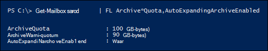

# <a name="enable-unlimited-archiving---admin-help"></a><span data-ttu-id="4c4b0-104">Onbeperkt archiveren inschakelen - Help voor beheerders</span><span class="sxs-lookup"><span data-stu-id="4c4b0-104">Enable unlimited archiving - Admin Help</span></span>

<span data-ttu-id="4c4b0-105">U kunt de functie Exchange Online archiveren automatisch uitbreiden gebruiken om onbeperkte opslagruimte in te stellen voor archiefpostvakken.</span><span class="sxs-lookup"><span data-stu-id="4c4b0-105">You can use the Exchange Online auto-expanding archiving feature to enable unlimited storage space for archive mailboxes.</span></span> <span data-ttu-id="4c4b0-106">Wanneer automatisch archiveren is ingeschakeld, wordt automatisch extra opslagruimte toegevoegd aan het archiefpostvak van een gebruiker wanneer de opslaglimiet wordt bereikt.</span><span class="sxs-lookup"><span data-stu-id="4c4b0-106">When auto-expanding archiving is turned on, additional storage space is automatically added to a user's archive mailbox when it approaches the storage limit.</span></span> <span data-ttu-id="4c4b0-107">Het resultaat is een onbeperkte postvakopslagcapaciteit.</span><span class="sxs-lookup"><span data-stu-id="4c4b0-107">The result is unlimited mailbox storage capacity.</span></span> <span data-ttu-id="4c4b0-108">U kunt archivering automatisch uitbreiden in te zetten voor iedereen in uw organisatie of alleen voor specifieke gebruikers.</span><span class="sxs-lookup"><span data-stu-id="4c4b0-108">You can turn on auto-expanding archiving for everyone in your organization or just for specific users.</span></span> <span data-ttu-id="4c4b0-109">Zie Overzicht van onbeperkt archiveren in Office 365 voor meer informatie over het automatisch uitbreiden [van archivering.](unlimited-archiving.md)</span><span class="sxs-lookup"><span data-stu-id="4c4b0-109">For more information about auto-expanding archiving, see [Overview of unlimited archiving in Office 365](unlimited-archiving.md).</span></span>

## <a name="before-you-enable-auto-expanding-archiving"></a><span data-ttu-id="4c4b0-110">Voordat u automatisch archiveren inschakelen</span><span class="sxs-lookup"><span data-stu-id="4c4b0-110">Before you enable auto-expanding archiving</span></span>

- <span data-ttu-id="4c4b0-111">U moet een globale beheerder in uw organisatie of lid zijn van de rollengroep Organisatiebeheer in uw Exchange Online-organisatie om automatisch uit te breiden archivering in te stellen voor uw hele organisatie of voor specifieke gebruikers.</span><span class="sxs-lookup"><span data-stu-id="4c4b0-111">You have to be a global administrator in your organization or a member of the Organization Management role group in your Exchange Online organization to enable auto-expanding archiving for your entire organization or for specific users.</span></span> <span data-ttu-id="4c4b0-112">U moet ook lid zijn van een rollengroep die de rol E-mailontvangers heeft toegewezen om het automatisch uitbreiden van archivering voor specifieke gebruikers mogelijk te maken.</span><span class="sxs-lookup"><span data-stu-id="4c4b0-112">Alternately, you have to be a member of a role group that's assigned the Mail Recipients role to enable auto-expanding archiving for specific users.</span></span>

- <span data-ttu-id="4c4b0-113">Het archiefpostvak van een gebruiker moet zijn ingeschakeld voordat u het automatisch uitbreiden van archivering kunt inschakelen.</span><span class="sxs-lookup"><span data-stu-id="4c4b0-113">A user's archive mailbox has to be enabled before you can enable auto-expanding archiving.</span></span> <span data-ttu-id="4c4b0-114">Aan een gebruiker moet een licentie Exchange Online abonnement 2 worden toegewezen om het archiefpostvak in te stellen.</span><span class="sxs-lookup"><span data-stu-id="4c4b0-114">A user must be assigned an Exchange Online Plan 2 license to enable the archive mailbox.</span></span> <span data-ttu-id="4c4b0-115">Als aan een gebruiker een licentie Exchange Online abonnement 1 is toegewezen, moet u deze een afzonderlijke Exchange Online Archiving toewijzen om het archiefpostvak in te stellen.</span><span class="sxs-lookup"><span data-stu-id="4c4b0-115">If a user is assigned an Exchange Online Plan 1 license, you would have to assign them a separate Exchange Online Archiving license to enable their archive mailbox.</span></span> <span data-ttu-id="4c4b0-116">Zie [Archiefpostvakken inschakelen in het Beveiligings- & Compliancecentrum](enable-archive-mailboxes.md).</span><span class="sxs-lookup"><span data-stu-id="4c4b0-116">See [Enable archive mailboxes in the Security & Compliance Center](enable-archive-mailboxes.md).</span></span>

- <span data-ttu-id="4c4b0-117">U kunt PowerShell ook gebruiken om archiefpostvakken in te stellen.</span><span class="sxs-lookup"><span data-stu-id="4c4b0-117">You can also use PowerShell to enable archive mailboxes.</span></span> <span data-ttu-id="4c4b0-118">Zie de [sectie Meer informatie](#more-information) voor een voorbeeld van de PowerShell-opdracht die u kunt gebruiken om archiefpostvakken in te stellen voor alle gebruikers in uw organisatie.</span><span class="sxs-lookup"><span data-stu-id="4c4b0-118">See the [More information](#more-information) section for an example of the PowerShell command that you can use to enable archive mailboxes for all users in your organization.</span></span>

- <span data-ttu-id="4c4b0-119">Het automatisch uitbreiden van archivering ondersteunt ook gedeelde postvakken.</span><span class="sxs-lookup"><span data-stu-id="4c4b0-119">Auto-expanding archiving also supports shared mailboxes.</span></span> <span data-ttu-id="4c4b0-120">Als u het archief voor een gedeeld postvak wilt inschakelen, is een Exchange Online Abonnement 2-licentie of een Exchange Online Abonnement 1-licentie met een Exchange Online Archiving licentie vereist.</span><span class="sxs-lookup"><span data-stu-id="4c4b0-120">To enable the archive for a shared mailbox, an Exchange Online Plan 2 license or an Exchange Online Plan 1 license with an Exchange Online Archiving license is required.</span></span>

- <span data-ttu-id="4c4b0-121">Door archivering automatisch uit te breiden, voorkomt u dat u een [inactief postvak herstelt of herstelt.](inactive-mailboxes-in-office-365.md#what-are-inactive-mailboxes)</span><span class="sxs-lookup"><span data-stu-id="4c4b0-121">Auto-expanding archiving prevents you from recovering or restoring an [inactive mailbox](inactive-mailboxes-in-office-365.md#what-are-inactive-mailboxes).</span></span> <span data-ttu-id="4c4b0-122">Dit betekent dat als u automatisch uit te breiden archivering inschakelen voor een postvak en het postvak op een later tijdstip inactief wordt gemaakt, u het [inactieve](recover-an-inactive-mailbox.md) postvak niet kunt herstellen (door het te converteren naar een actief postvak) of te herstellen [(door](restore-an-inactive-mailbox.md) de inhoud samen te voegen in een bestaand postvak).</span><span class="sxs-lookup"><span data-stu-id="4c4b0-122">That means if you enable auto-expanding archiving for a mailbox and the mailbox is made inactive at a later date, you won't be able to [recover the inactive mailbox](recover-an-inactive-mailbox.md) (by converting it to an active mailbox) or [restore it](restore-an-inactive-mailbox.md) (by merging the contents to an existing mailbox).</span></span> <span data-ttu-id="4c4b0-123">Als automatisch uitbreiden van archivering is ingeschakeld in een inactief postvak, kunt u alleen gegevens herstellen met behulp van het zoekprogramma Inhoud in het Microsoft 365-compliancecentrum om de gegevens uit het postvak te exporteren en te importeren naar een ander postvak.</span><span class="sxs-lookup"><span data-stu-id="4c4b0-123">If auto-expanding archiving is enabled on an inactive mailbox, the only way to recover data is by using the Content search tool in the Microsoft 365 compliance center to export the data from the mailbox and import to another mailbox.</span></span> <span data-ttu-id="4c4b0-124">Zie de sectie 'Inactieve postvakken en automatisch uitbreidende archieven' in [Overzicht van inactieve postvakken](inactive-mailboxes-in-office-365.md#inactive-mailboxes-and-auto-expanding-archives)voor meer informatie.</span><span class="sxs-lookup"><span data-stu-id="4c4b0-124">For more information, see the "Inactive mailboxes and auto-expanding archives" section in [Overview of inactive mailboxes](inactive-mailboxes-in-office-365.md#inactive-mailboxes-and-auto-expanding-archives).</span></span>

- <span data-ttu-id="4c4b0-125">U kunt het beheercentrum Exchange beveiligingscentrum & compliancecentrum niet gebruiken om automatisch uit te breiden archiveren.</span><span class="sxs-lookup"><span data-stu-id="4c4b0-125">You can't use the Exchange admin center or the Security & Compliance Center to enable auto-expanding archiving.</span></span> <span data-ttu-id="4c4b0-126">U moet powershell Exchange Online gebruiken.</span><span class="sxs-lookup"><span data-stu-id="4c4b0-126">You have to use Exchange Online PowerShell.</span></span> <span data-ttu-id="4c4b0-127">Als u verbinding wilt maken met uw Exchange Online met behulp van externe PowerShell, Verbinding maken [powershell Exchange Online maken.](/powershell/exchange/connect-to-exchange-online-powershell)</span><span class="sxs-lookup"><span data-stu-id="4c4b0-127">To connect to your Exchange Online organization using remote PowerShell, see [Connect to Exchange Online PowerShell](/powershell/exchange/connect-to-exchange-online-powershell).</span></span>

## <a name="enable-auto-expanding-archiving-for-your-entire-organization"></a><span data-ttu-id="4c4b0-128">Automatisch uitbreiden van archivering inschakelen voor uw hele organisatie</span><span class="sxs-lookup"><span data-stu-id="4c4b0-128">Enable auto-expanding archiving for your entire organization</span></span>

<span data-ttu-id="4c4b0-129">U kunt automatisch uitbreidende archivering inschakelen voor uw hele organisatie.</span><span class="sxs-lookup"><span data-stu-id="4c4b0-129">You can enable auto-expanding archiving for your entire organization.</span></span> <span data-ttu-id="4c4b0-130">Nadat u deze hebt ingeschakeld, wordt automatisch archiveren ingeschakeld voor bestaande gebruikerspostvakken en voor nieuwe gebruikerspostvakken die worden gemaakt.</span><span class="sxs-lookup"><span data-stu-id="4c4b0-130">After you turn it on, auto-expanding archiving will be enabled for existing user mailboxes and for new user mailboxes that are created.</span></span> <span data-ttu-id="4c4b0-131">Wanneer u gebruikerspostvakken maakt, moet u het hoofdarchiefpostvak van de gebruiker inschakelen, zodat de functie voor automatisch uitvijven voor het nieuwe gebruikerspostvak werkt.</span><span class="sxs-lookup"><span data-stu-id="4c4b0-131">When you create user mailboxes, be sure to enable the user's main archive mailbox so the auto-expanding archiving feature works for the new user mailbox.</span></span>
  
1. [<span data-ttu-id="4c4b0-132">Verbinding maken powershell Exchange Online gebruiken</span><span class="sxs-lookup"><span data-stu-id="4c4b0-132">Connect to Exchange Online PowerShell</span></span>](/powershell/exchange/connect-to-exchange-online-powershell)

2. <span data-ttu-id="4c4b0-133">Voer de volgende opdracht uit in Exchange Online PowerShell om automatisch uit te breiden archivering voor uw hele organisatie in te stellen.</span><span class="sxs-lookup"><span data-stu-id="4c4b0-133">Run the following command in Exchange Online PowerShell to enable auto-expanding archiving for your entire organization.</span></span>

    ```powershell
    Set-OrganizationConfig -AutoExpandingArchive
    ```

## <a name="enable-auto-expanding-archiving-for-specific-users"></a><span data-ttu-id="4c4b0-134">Archivering automatisch uitbreiden voor specifieke gebruikers inschakelen</span><span class="sxs-lookup"><span data-stu-id="4c4b0-134">Enable auto-expanding archiving for specific users</span></span>

<span data-ttu-id="4c4b0-135">In plaats van het automatisch uitbreiden van archivering in te stellen voor elke gebruiker in uw organisatie, kunt u het alleen inschakelen voor specifieke gebruikers.</span><span class="sxs-lookup"><span data-stu-id="4c4b0-135">Instead of enabling auto-expanding archiving for every user in your organization, you can enable it only for specific users.</span></span> <span data-ttu-id="4c4b0-136">U kunt dit doen omdat alleen sommige gebruikers behoefte hebben aan een grote archiefopslagcapaciteit.</span><span class="sxs-lookup"><span data-stu-id="4c4b0-136">You might do this because only some users might have a need for a large archive storage capacity.</span></span>
  
<span data-ttu-id="4c4b0-137">Wanneer u automatisch uitbreidende archivering inschakelen voor een specifieke gebruiker en het postvak van de gebruiker in bewaring of toegewezen aan een bewaarbeleid, worden de volgende twee configuraties gewijzigd:</span><span class="sxs-lookup"><span data-stu-id="4c4b0-137">When you enable auto-expanding archiving for a specific user and the user's mailbox in on hold or assigned to a retention policy, the following two configurations changes are made:</span></span>
  
- <span data-ttu-id="4c4b0-138">Het opslagquotum voor het primaire archiefpostvak van de gebruiker wordt verhoogd met 10 GB (van 100 GB naar 110 GB).</span><span class="sxs-lookup"><span data-stu-id="4c4b0-138">The storage quota for the user's primary archive mailbox is increased by 10 GB (from 100 GB to 110 GB).</span></span> <span data-ttu-id="4c4b0-139">Het waarschuwingsquotum voor het archief wordt ook verhoogd met 10 GB (van 90 GB naar 100 GB).</span><span class="sxs-lookup"><span data-stu-id="4c4b0-139">The archive warning quota is also increased by 10 GB (from 90 GB to 100 GB).</span></span>

- <span data-ttu-id="4c4b0-140">Het opslagquotum voor de map Herstelbare items in het primaire postvak van de gebruiker wordt verhoogd met 10 GB (ook van 100 GB naar 110 GB).</span><span class="sxs-lookup"><span data-stu-id="4c4b0-140">The storage quota for the Recoverable Items folder in the user's primary mailbox is increased by 10 GB (also from 100 GB to 110 GB).</span></span> <span data-ttu-id="4c4b0-141">Het waarschuwingsquotum Herstelbare items wordt ook verhoogd met 10 GB (van 90 GB naar 100 GB).</span><span class="sxs-lookup"><span data-stu-id="4c4b0-141">The Recoverable Items warning quota is also increased by 10 GB (from 90 GB to 100 GB).</span></span> <span data-ttu-id="4c4b0-142">Deze wijzigingen zijn alleen van toepassing als het postvak in bewaring staat of is toegewezen aan een bewaarbeleid.</span><span class="sxs-lookup"><span data-stu-id="4c4b0-142">These changes are applicable only if the mailbox in on hold or assigned to a retention policy.</span></span>

<span data-ttu-id="4c4b0-143">Deze extra ruimte wordt toegevoegd om te voorkomen dat er opslagproblemen optreden voordat het automatisch uitbreidende archief is ingericht.</span><span class="sxs-lookup"><span data-stu-id="4c4b0-143">This additional space is added to prevent any storage issues that may occur before the auto-expanding archive is provisioned.</span></span> <span data-ttu-id="4c4b0-144">Extra opslagruimte  *wordt niet toegevoegd*  wanneer u automatisch uitbreidende archivering inschakelen voor uw hele organisatie, zoals wordt beschreven in de vorige sectie.</span><span class="sxs-lookup"><span data-stu-id="4c4b0-144">Additional storage space  *is not*  added when you enable auto-expanding archiving for your entire organization, as described in the previous section.</span></span>
  
1. [<span data-ttu-id="4c4b0-145">Verbinding maken powershell Exchange Online gebruiken</span><span class="sxs-lookup"><span data-stu-id="4c4b0-145">Connect to Exchange Online PowerShell</span></span>](/powershell/exchange/connect-to-exchange-online-powershell)

2. <span data-ttu-id="4c4b0-146">Voer de volgende opdracht uit in Exchange Online PowerShell om automatisch uit te breiden archiveren voor een specifieke gebruiker.</span><span class="sxs-lookup"><span data-stu-id="4c4b0-146">Run the following command in Exchange Online PowerShell to enable auto-expanding archiving for a specific user.</span></span> <span data-ttu-id="4c4b0-147">Zoals eerder is uitgelegd, moet het archiefpostvak (hoofdarchief) van de gebruiker zijn ingeschakeld voordat u het automatisch uitbreiden van archivering voor die gebruiker kunt inschakelen.</span><span class="sxs-lookup"><span data-stu-id="4c4b0-147">As previously explained, the user's archive mailbox (main archive) must be enabled before you can turn on auto-expanding archiving for that user.</span></span>

    ```powershell
    Enable-Mailbox <user mailbox> -AutoExpandingArchive
    ```

> [!IMPORTANT]
> <span data-ttu-id="4c4b0-148">In een Exchange hybride implementatie kunt u de opdracht **Enable-Mailbox -AutoExpandingArchiveren** niet gebruiken om automatisch uitbreidende archivering in te stellen voor een specifieke gebruiker van wie het primaire postvak on-premises is en waarvan het archiefpostvak cloudgebaseerd is.</span><span class="sxs-lookup"><span data-stu-id="4c4b0-148">In an Exchange hybrid deployment, you can't use the **Enable-Mailbox -AutoExpandingArchive** command to enable auto-expanding archiving for a specific user whose primary mailbox is on-premises and whose archive mailbox is cloud-based.</span></span> <span data-ttu-id="4c4b0-149">Als u automatisch uitbreidende archivering wilt inschakelen voor archiefpostvakken in de cloud in een hybride implementatie van Exchange, moet u de opdracht **Set-OrganizationConfig -AutoExpandingArchiveren** uitvoeren in Exchange Online PowerShell om automatisch uitbreidende archivering voor de hele organisatie mogelijk te maken.</span><span class="sxs-lookup"><span data-stu-id="4c4b0-149">To enable auto-expanding archiving for cloud-based archive mailboxes in an Exchange hybrid deployment, you have to run the **Set-OrganizationConfig -AutoExpandingArchive** command in Exchange Online PowerShell to enable auto-expanding archiving for the entire organization.</span></span> <span data-ttu-id="4c4b0-150">Als de primaire postvakken en archiefpostvakken van een gebruiker zowel cloudgebaseerd zijn, kunt u de opdracht Postvak inschakelen **-AutoExpandingArchiveren** gebruiken om het automatisch uitbreiden van archivering voor die specifieke gebruiker in te stellen.</span><span class="sxs-lookup"><span data-stu-id="4c4b0-150">If a user's primary and archive mailboxes are both cloud-based, then you can use the **Enable-Mailbox -AutoExpandingArchive** command to enable auto-expanding archiving for that specific user.</span></span>
  
## <a name="verify-that-auto-expanding-archiving-is-enabled"></a><span data-ttu-id="4c4b0-151">Controleren of archivering automatisch uit te breiden is ingeschakeld</span><span class="sxs-lookup"><span data-stu-id="4c4b0-151">Verify that auto-expanding archiving is enabled</span></span>

<span data-ttu-id="4c4b0-152">Als u wilt controleren of het automatisch uitbreiden van archivering is ingeschakeld voor uw organisatie, moet u de volgende opdracht uitvoeren in Exchange Online PowerShell.</span><span class="sxs-lookup"><span data-stu-id="4c4b0-152">To verify that auto-expanding archiving is enabled for your organization, run the following command in Exchange Online PowerShell.</span></span>

```powershell
Get-OrganizationConfig | FL AutoExpandingArchiveEnabled
```

<span data-ttu-id="4c4b0-153">Een waarde van  `True` geeft aan dat automatisch uitbreidende archivering is ingeschakeld voor de organisatie.</span><span class="sxs-lookup"><span data-stu-id="4c4b0-153">A value of  `True` indicates that auto-expanding archiving is enabled for the organization.</span></span> 
  
<span data-ttu-id="4c4b0-154">Als u wilt controleren of het automatisch uitbreiden van archivering is ingeschakeld voor een specifieke gebruiker, moet u de volgende opdracht uitvoeren in Exchange Online PowerShell.</span><span class="sxs-lookup"><span data-stu-id="4c4b0-154">To verify that auto-expanding archiving is enabled for a specific user, run the following command in Exchange Online PowerShell.</span></span>
  
```powershell
Get-Mailbox <user mailbox> | FL AutoExpandingArchiveEnabled
```

<span data-ttu-id="4c4b0-155">Een waarde van  `True` geeft aan dat automatisch uitbreidende archivering is ingeschakeld voor de gebruiker.</span><span class="sxs-lookup"><span data-stu-id="4c4b0-155">A value of  `True` indicates that auto-expanding archiving is enabled for the user.</span></span>
  
<span data-ttu-id="4c4b0-156">Als u wilt bepalen of het automatisch uitbreiden van archivering is ingeschakeld voor inactieve postvakken, moet u de volgende opdracht uitvoeren in Exchange Online PowerShell.</span><span class="sxs-lookup"><span data-stu-id="4c4b0-156">To determine if auto-expanding archiving is enabled for inactive mailboxes, run the following command in Exchange Online PowerShell.</span></span>
  
```powershell
Get-Mailbox -InactiveMailboxOnly | FL UserPrincipalName,AutoExpandingArchiveEnabled
```

<span data-ttu-id="4c4b0-157">Een waarde van  `True` geeft aan dat automatisch uitbreidende archivering is ingeschakeld voor het inactieve postvak.</span><span class="sxs-lookup"><span data-stu-id="4c4b0-157">A value of  `True` indicates that auto-expanding archiving is enabled for the inactive mailbox.</span></span> <span data-ttu-id="4c4b0-158">Een waarde van geeft aan dat het automatisch uitbreiden van `False` archivering niet is ingeschakeld.</span><span class="sxs-lookup"><span data-stu-id="4c4b0-158">A value of `False` indicates that auto-expanding archiving isn't enabled.</span></span>

<span data-ttu-id="4c4b0-159">Houd rekening met de volgende dingen nadat u het automatisch uitbreiden van archivering hebt ingeschakeld:</span><span class="sxs-lookup"><span data-stu-id="4c4b0-159">Keep the following things in mind after you enable auto-expanding archiving:</span></span>
  
- <span data-ttu-id="4c4b0-160">Als u de opdracht **Set-OrganizationConfig -AutoExpandingArchiveren** uitzet om automatisch uitbreidende archivering voor uw organisatie in te stellen, hoeft u de opdracht **Enable-Mailbox -AutoExpandingArchiveren** niet uit te voeren op afzonderlijke postvakken.</span><span class="sxs-lookup"><span data-stu-id="4c4b0-160">If you run the **Set-OrganizationConfig -AutoExpandingArchive** command to enable auto-expanding archiving for your organization, you don't have to run the **Enable-Mailbox -AutoExpandingArchive** on individual mailboxes.</span></span> <span data-ttu-id="4c4b0-161">Als u de cmdlet **Set-OrganizationConfig** voor het automatisch uitbreiden van archivering voor uw organisatie inschakelen, wordt de eigenschap  *AutoExpandingArchiveEnabled*  in gebruikerspostvakken niet gewijzigd in `True` .</span><span class="sxs-lookup"><span data-stu-id="4c4b0-161">Running the **Set-OrganizationConfig** cmdlet to enable auto-expanding archiving for your organization doesn't change the  *AutoExpandingArchiveEnabled*  property on user mailboxes to `True`.</span></span>

- <span data-ttu-id="4c4b0-162">Op dezelfde manier worden de waarden voor de eigenschappen  *ArchiveQuota*  en  *ArchiveWarningQuota niet*  gewijzigd wanneer u automatisch archiveren inschakelen.</span><span class="sxs-lookup"><span data-stu-id="4c4b0-162">Similarly, the values for the  *ArchiveQuota*  and  *ArchiveWarningQuota*  mailbox properties aren't changed when you enable auto-expanding archiving.</span></span> <span data-ttu-id="4c4b0-163">Wanneer u automatisch uitbreidende archivering inschakelen voor een gebruikerspostvak en de eigenschap  *AutoExpandingArchiveEnabled*  is ingesteld op , worden de eigenschappen  `True`  *ArchiveQuota*  en  *ArchiveWarningQuota*  genegeerd.</span><span class="sxs-lookup"><span data-stu-id="4c4b0-163">In fact, when you enable auto-expanding archiving for a user mailbox and the  *AutoExpandingArchiveEnabled*  property is set to  `True`, the  *ArchiveQuota*  and  *ArchiveWarningQuota*  properties are ignored.</span></span> <span data-ttu-id="4c4b0-164">Hier volgen een voorbeeld van deze postvakeigenschappen nadat automatisch archiveren is ingeschakeld voor het postvak van een gebruiker.</span><span class="sxs-lookup"><span data-stu-id="4c4b0-164">Here's an example of these mailbox properties after auto-expanding archiving is enabled for a user's mailbox.</span></span> 

    

## <a name="more-information"></a><span data-ttu-id="4c4b0-166">Meer informatie</span><span class="sxs-lookup"><span data-stu-id="4c4b0-166">More information</span></span>

- <span data-ttu-id="4c4b0-167">U kunt PowerShell ook gebruiken om archiefpostvakken in te stellen.</span><span class="sxs-lookup"><span data-stu-id="4c4b0-167">You can also use PowerShell to enable archive mailboxes.</span></span> <span data-ttu-id="4c4b0-168">U kunt bijvoorbeeld de volgende opdracht uitvoeren in Exchange Online PowerShell om archiefpostvakken in te stellen voor alle gebruikers van wie het archiefpostvak nog niet is ingeschakeld.</span><span class="sxs-lookup"><span data-stu-id="4c4b0-168">For example, you can run the following command in Exchange Online PowerShell to enable archive mailboxes for all users whose archive mailbox isn't already enabled.</span></span>

    ```powershell
    Get-Mailbox -Filter {ArchiveStatus -Eq "None" -AND RecipientTypeDetails -eq "UserMailbox"} | Enable-Mailbox -Archive
    ```

- <span data-ttu-id="4c4b0-169">Nadat u archivering automatisch uitbreidt voor uw organisatie of voor een specifieke gebruiker, wordt een archiefpostvak geconverteerd naar een automatisch uitvijvend archief wanneer het archiefpostvak (inclusief de map Herstelbare items) 90 GB bereikt.</span><span class="sxs-lookup"><span data-stu-id="4c4b0-169">After you turn on auto-expanding archiving for your organization or for a specific user, an archive mailbox is converted to an auto-expanding archive when the archive mailbox (including the Recoverable Items folder) reaches 90 GB.</span></span> <span data-ttu-id="4c4b0-170">Het kan tot 30 dagen duren voordat de extra opslagruimte is ingericht.</span><span class="sxs-lookup"><span data-stu-id="4c4b0-170">It can take up to 30 days for the additional storage space to be provisioned.</span></span>

- <span data-ttu-id="4c4b0-171">Nadat u archivering automatisch uit te breiden hebt ingeschakeld, kan het niet worden uitgeschakeld.</span><span class="sxs-lookup"><span data-stu-id="4c4b0-171">After you turn on auto-expanding archiving, it can't be turned off.</span></span> <span data-ttu-id="4c4b0-172">Bovendien kunnen beheerders het opslagquotum voor het automatisch uitbreiden van archivering niet aanpassen.</span><span class="sxs-lookup"><span data-stu-id="4c4b0-172">Additionally, administrators can't adjust the storage quota for auto-expanding archiving.</span></span>

- <span data-ttu-id="4c4b0-173">Automatisch uitbreiden van archivering wordt ondersteund voor archiefpostvakken in de cloud in een Exchange hybride implementatie voor gebruikers die een on-premises primair postvak hebben.</span><span class="sxs-lookup"><span data-stu-id="4c4b0-173">Auto-expanding archiving is supported for cloud-based archive mailboxes in an Exchange hybrid deployment for users who have an on-premises primary mailbox.</span></span> <span data-ttu-id="4c4b0-174">Nadat automatisch uitbreiden van archivering is ingeschakeld voor een archiefpostvak in de cloud, kunt u dat archiefpostvak echter niet terug naar de on-premises Exchange organisatie.</span><span class="sxs-lookup"><span data-stu-id="4c4b0-174">However, after auto-expanding archiving is enabled for a cloud-based archive mailbox, you can't off-board that archive mailbox back to the on-premises Exchange organization.</span></span> <span data-ttu-id="4c4b0-175">Automatisch archiveren wordt niet ondersteund voor on-premises postvakken in een versie van Exchange Server.</span><span class="sxs-lookup"><span data-stu-id="4c4b0-175">Auto-expanding archiving isn't supported for on-premises mailboxes in any version of Exchange Server.</span></span>

- <span data-ttu-id="4c4b0-176">Zie de sectie 'Outlook requirements for accessing items in an auto-expanded archive' in [Overview of unlimited archiving](unlimited-archiving.md#outlook-requirements-for-accessing-items-in-an-auto-expanded-archive)(Overzicht van onbeperkt archiveren) voor een lijst met Outlook-clients die gebruikers kunnen gebruiken om toegang te krijgen tot items in het extra opslaggebied in hun archiefpostvak.</span><span class="sxs-lookup"><span data-stu-id="4c4b0-176">For a list of Outlook clients that users can use to access items in the additional storage area in their archive mailbox, see the "Outlook requirements for accessing items in an auto-expanded archive" section in [Overview of unlimited archiving](unlimited-archiving.md#outlook-requirements-for-accessing-items-in-an-auto-expanded-archive).</span></span>

- <span data-ttu-id="4c4b0-177">Zoals eerder uitgelegd, wordt 10 GB toegevoegd aan het opslagquotum van het primaire archiefpostvak van de gebruiker (en aan de map Herstelbare items als het postvak in de wacht staat) wanneer u de opdracht **Inschakelen-Postvak -AutoExpandingArchiveren** uitwerkt.</span><span class="sxs-lookup"><span data-stu-id="4c4b0-177">As previously explained, 10 GB is added to the storage quota of the user's primary archive mailbox (and to the Recoverable Items folder if the mailbox is on hold) when you run the **Enable-Mailbox -AutoExpandingArchive** command.</span></span> <span data-ttu-id="4c4b0-178">Dit biedt extra opslagruimte totdat de automatisch uitveerde opslagruimte is ingericht (wat tot 30 dagen kan duren).</span><span class="sxs-lookup"><span data-stu-id="4c4b0-178">This provides additional storage until the auto-expanded storage space is provisioned (which can take up to 30 days).</span></span> <span data-ttu-id="4c4b0-179">Deze extra opslagruimte wordt niet toegevoegd wanneer u **Set-OrganizationConfig -AutoExpandingArchiveren** gebruikt om automatisch uitvijven van archivering in te stellen voor alle postvakken in uw organisatie.</span><span class="sxs-lookup"><span data-stu-id="4c4b0-179">This additional storage space isn't added when you run the **Set-OrganizationConfig -AutoExpandingArchive** to enable auto-expanding archiving for all mailboxes in your organization.</span></span> <span data-ttu-id="4c4b0-180">Als u het automatisch uitbreiden van archivering voor de hele organisatie hebt ingeschakeld, maar de extra 10 GB opslagruimte voor een specifieke gebruiker moet toevoegen, kunt u de opdracht **Enable-Mailbox -AutoExpandingArchiveren** uitvoeren op dat postvak.</span><span class="sxs-lookup"><span data-stu-id="4c4b0-180">If you enabled auto-expanding archiving for the entire organization, but need to add the additional 10 GB of storage space for a specific user, you can run the **Enable-Mailbox -AutoExpandingArchive** command on that mailbox.</span></span> <span data-ttu-id="4c4b0-181">Er wordt een foutmelding weergegeven dat het automatisch uitbreiden van archivering al is ingeschakeld, maar dat de extra opslagruimte aan het postvak wordt toegevoegd.</span><span class="sxs-lookup"><span data-stu-id="4c4b0-181">You will receive an error saying that auto-expanding archiving has already been enabled, but the additional storage space will be added to the mailbox.</span></span>

> [!IMPORTANT]
> <span data-ttu-id="4c4b0-182">Het automatisch uitbreiden van archivering wordt alleen ondersteund voor postvakken die worden gebruikt voor individuele gebruikers of gedeelde postvakken met een groeipercentage dat niet groter is dan 1 GB per dag.</span><span class="sxs-lookup"><span data-stu-id="4c4b0-182">Auto-expanding archiving is only supported for mailboxes used for individual users or shared mailboxes with a growth rate that doesn't exceed 1 GB per day.</span></span> <span data-ttu-id="4c4b0-183">Het is niet toegestaan logboekregels, transportregels of regels voor automatisch doorsturen te gebruiken om berichten te kopiëren naar een archiefpostvak voor archivering.</span><span class="sxs-lookup"><span data-stu-id="4c4b0-183">Using journaling, transport rules, or auto-forwarding rules to copy messages to an archive mailbox for the purposes of archiving is not permitted.</span></span> <span data-ttu-id="4c4b0-184">Het archiefpostvak van een gebruiker is alleen bedoeld voor die gebruiker.</span><span class="sxs-lookup"><span data-stu-id="4c4b0-184">A user's archive mailbox is intended for just that user.</span></span> <span data-ttu-id="4c4b0-185">Microsoft behoudt zich het recht voor om onbeperkt archiveren te weigeren in gevallen waarin het archiefpostvak van een gebruiker wordt gebruikt voor het opslaan van archiefgegevens voor andere gebruikers of in andere gevallen van ongepast gebruik.</span><span class="sxs-lookup"><span data-stu-id="4c4b0-185">Microsoft reserves the right to deny unlimited archiving in instances where a user's archive mailbox is used to store archive data for other users or in other cases of inappropriate use.</span></span>