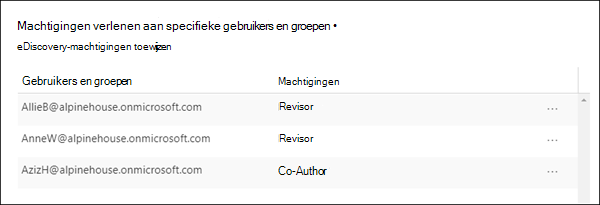
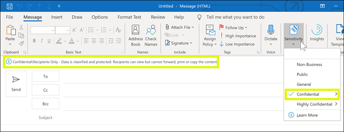

# Toegang tot inhoud beperken door versleuteling toe te passen met vertrouwelijkheidslabels

>*[Richtlijnen voor Microsoft 365-licenties voor beveiliging en compliance](/office365/servicedescriptions/microsoft-365-service-descriptions/microsoft-365-tenantlevel-services-licensing-guidance/microsoft-365-security-compliance-licensing-guidance).*

Wanneer u een vertrouwelijkheidslabel maakt, kunt u de toegang beperken tot inhoud waarop het label wordt toegepast. Met de versleutelingsinstellingen voor een vertrouwelijkheidslabel kunt u bijvoorbeeld inhoud beveiligen zodat:

- Alleen gebruikers binnen uw organisatie een vertrouwelijk document of e-mailbericht kunnen openen;
- Alleen gebruikers van de marketingafdeling het document of het e-mailbericht voor promotieaankondiging kunnen bewerken en afdrukken, terwijl alle overige gebruikers in uw organisatie het alleen kunnen lezen;
- Gebruikers geen e-mailberichten kunnen doorsturen of er gegevens van kopiëren die nieuws over een interne organisatie bevatten;
- De huidige prijslijst die naar zakenpartners wordt verzonden, niet kan worden geopend na een opgegeven datum.

Wanneer een document of e-mailbericht is versleuteld, wordt de toegang tot de inhoud beperkt, zodat het:

- Alleen kan worden ontsleuteld door gebruikers die zijn geautoriseerd door de versleutelingsinstellingen van het label;
- Het versleuteld blijft, ongeacht waar het zich bevindt, binnen of buiten uw organisatie, ook als de naam van het bestand is gewijzigd;
- Zowel at rest (bijvoorbeeld in een OneDrive-account) als tijdens het verzenden is versleuteld (bijvoorbeeld e-mail tijdens de reis via internet).

Ten slotte kunt u, als beheerder, bij het configureren van een vertrouwelijkheidslabel voor het toepassen van versleuteling een van de volgende keuzes maken:

- **Nu machtigingen toewijzen**, zodat u precies kunt bepalen welke gebruikers welke machtigingen voor inhoud met dat label krijgen.
- **Gebruikers machtigingen laten toewijzen** wanneer ze het label op inhoud toepassen. Op deze manier kunt u personen in uw organisatie enige flexibiliteit bieden die ze mogelijk nodig hebben om samen te werken en hun werk af te krijgen.

De versleutelingsinstellingen zijn beschikbaar wanneer u [een vertrouwelijkheidslabel maakt](create-sensitivity-labels.md) in het Microsoft 365-compliancecentrum. U kunt ook de oudere portal gebruiken, het beveiligings- en compliancecentrum.

## Inzicht in versleuteling

Versleuteling maakt gebruik van de Azure Rights Management-service (Azure RMS) van Azure Information Protection. Deze beveiligingsoplossing maakt gebruik van versleutelings-, identiteits- en autorisatiebeleid. Zie [Wat is Azure Rights Management?](/azure/information-protection/what-is-azure-rms) in de documentatie van Azure Information Protection voor meer informatie. 

Wanneer u deze versleutelingsoplossing gebruikt, zorgt de functie **supergebruiker** ervoor dat geautoriseerde personen en services altijd de gegevens kunnen lezen en controleren die voor uw organisatie zijn versleuteld. De versleuteling kan vervolgens eventueel worden verwijderd of gewijzigd. Zie [Supergebruikers configureren voor Azure Information Protection en discoveryservices of gegevensherstel](/azure/information-protection/configure-super-users) voor meer informatie.

## Een label configureren voor versleuteling

1. Volg de algemene instructies om [een vertrouwelijkheidslabel te maken of te bewerken](create-sensitivity-labels.md#create-and-configure-sensitivity-labels) en zorg ervoor dat u **Bestanden en e-mailberichten** selecteert voor het bereik van het label: 
    
    

2. Selecteer vervolgens op de pagina **Beveiligingsinstellingen voor bestanden en e-mailberichten kiezen** de optie **Bestanden en e-mailberichten versleutelen**.
    
    

4.  Selecteer een van volgende opties de pagina **Versleuteling** van de wizard:
    
    - **Versleuteling verwijderen als het bestand is versleuteld**: deze optie wordt alleen ondersteund door de geïntegreerde labelclient van Azure Information Protection. Wanneer u deze optie selecteert en ingebouwde labeling gebruikt, wordt het label mogelijk niet weergegeven in apps of wordt het label niet weergegeven en worden er geen versleutelingswijzigingen aangebracht.
        
        Zie voor meer informatie over dit scenario de sectie [Wat gebeurt er met bestaande versleuteling wanneer een label wordt toegepast](#what-happens-to-existing-encryption-when-a-labels-applied). Het is belangrijk om te weten dat deze instelling ertoe kan leiden dat een vertrouwelijkheidslabel mogelijk niet meer kan worden toegepast wanneer een gebruiker over onvoldoende machtigingen beschikt.
    
    - **Versleutelingsinstellingen configureren**: hiermee schakelt u versleuteling in en worden de versleutelingsinstellingen zichtbaar:
        
        
        
        Instructies voor deze instellingen staan in de volgende sectie: [Versleutelingsinstellingen configureren](#configure-encryption-settings).

### Wat gebeurt er met de bestaande versleuteling wanneer er een label wordt toegepast?

Als een vertrouwelijkheidslabel wordt toegepast op niet-versleutelde inhoud, spreekt het vanzelf wat het resultaat is van de versleutelingsopties die u kunt selecteren. Als u bijvoorbeeld **Bestanden en e-mailberichten versleutel** niet hebt geselecteerd, blijft de inhoud onversleuteld.

Het is echter mogelijk dat de inhoud al is versleuteld. Een andere gebruiker kan bijvoorbeeld het volgende hebben toegepast:

- Zijn of haar eigen machtigingen, waaronder door de gebruiker gedefinieerde machtigingen wanneer hierom voor een label wordt verzocht, aangepaste machtigingen door de Azure Information Protection-client en de documentbeveiliging **Beperkte toegang** vanuit een Office-app;
- Een Azure Rights Management-beveiligingssjabloon die de inhoud onafhankelijk van een label versleutelt. Deze categorie bevat regels voor de e-mailstroom die versleuteling toepassen met behulp van rechtenbescherming.
- Een label dat versleuteling toepast met machtigingen die door de beheerder zijn toegewezen.

In de volgende tabel wordt aangegeven wat er gebeurt met bestaande versleuteling wanneer een vertrouwelijkheidslabel op die inhoud wordt toegepast:

| | Versleuteling: niet geselecteerd | Versleuteling: geconfigureerd | Versleuteling: verwijderen \* |
|:-----|:-----|:-----|:-----|
|**Door een gebruiker opgegeven machtigingen**|Oorspronkelijke versleuteling blijft behouden|Er wordt nieuwe labelversleuteling toegepast|Oorspronkelijke versleuteling wordt verwijderd|
|**Beveiligingssjabloon**|Oorspronkelijke versleuteling blijft behouden|Er wordt nieuwe labelversleuteling toegepast|Oorspronkelijke versleuteling wordt verwijderd|
|**Label met door een beheerder gedefinieerde machtigingen**|Oorspronkelijke versleuteling wordt verwijderd|Er wordt nieuwe labelversleuteling toegepast|Oorspronkelijke versleuteling wordt verwijderd|

**Voetnoot:**

\* Ondersteund door de geïntegreerde labelclient van Azure Information Protection.

Houd er rekening mee dat wanneer de nieuwe labelversleuteling wordt toegepast of de oorspronkelijke versleuteling wordt verwijderd, dit alleen gebeurt als de gebruiker die het label toepast, een gebruiksrecht of rol heeft waarmee deze actie wordt ondersteund:

- Het [gebruiksrecht](/azure/information-protection/configure-usage-rights#usage-rights-and-descriptions) Exporteren of Volledig beheer.
- De rol [Rights Management-uitgever of Rights Management-eigenaar](/azure/information-protection/configure-usage-rights#rights-management-issuer-and-rights-management-owner) of [supergebruiker](/azure/information-protection/configure-super-users).

Als de gebruiker een van deze rechten of rollen niet heeft, kan het label niet worden toegepast en blijft de oorspronkelijke versleuteling dus behouden. De gebruiker ziet het volgende bericht: **U bent niet gemachtigd deze wijziging aan het vertrouwelijkheidslabel aan te brengen. Neem contact op met de eigenaar van de inhoud.**

Bijvoorbeeld: de persoon die Niet doorsturen op een e-mailbericht toepast, kan de thread opnieuw labelen om de versleuteling te vervangen of te verwijderen, omdat deze persoon het beheer van rechten voor het e-mailbericht heeft. Maar met uitzondering van supergebruikers kunnen geadresseerden van dit e-mailbericht dit niet opnieuw labelen omdat ze niet over de vereiste gebruiksrechten beschikken.

#### E-mailbijlagen voor versleutelde e-mailberichten

Wanneer een e-mailbericht door een willekeurige methode wordt versleuteld, nemen niet-versleutelde Office-documenten die aan het e-mailbericht zijn gekoppeld, automatisch dezelfde versleutelingsinstellingen over.

Documenten die al zijn versleuteld en vervolgens als bijlage worden toegevoegd, behouden altijd de oorspronkelijke versleuteling.

## Versleutelingsinstellingen configureren

Wanneer u op de pagina **Encryption** van de wizard **Versleutelingsinstellingen configureren** selecteert om een vertrouwelijkheidslabel te maken of te bewerken, kiest u een van de volgende opties:

- **Nu machtigingen toewijzen**, zodat u precies kunt bepalen welke gebruikers welke machtigingen krijgen voor inhoud waarop dat label is toegepast. Zie de volgende sectie, [Nu machtigingen toewijzen](#assign-permissions-now), voor meer informatie.
- **Gebruikers machtigingen laten toewijzen** wanneer de gebruikers het label op inhoud toepassen. Met deze optie kunt u personen in uw organisatie enige flexibiliteit bieden die ze mogelijk nodig hebben om samen te werken en hun werk af te krijgen. Zie de sectie [Gebruikers machtigingen laten toewijzen](#let-users-assign-permissions) op deze pagina voor meer informatie.

Als u bijvoorbeeld een vertrouwelijkheidslabel met de naam **Zeer vertrouwelijk** hebt, dat wordt toegepast op de meest gevoelige inhoud, wilt u mogelijk nu beslissen wie welk type machtigingen voor die inhoud krijgt.

Maar als u een vertrouwelijkheidslabel hebt met de naam **Zakelijke contracten** en de werkstroom van uw organisatie vereist dat uw personen op ad-hocbasis met verschillende personen aan deze inhoud samenwerken, wilt u uw gebruikers mogelijk laten bepalen wie machtigingen krijgt wanneer ze het label toewijzen. Deze flexibiliteit bevordert de productiviteit van uw gebruikers en vermindert de verzoeken bij uw beheerders om voor specifieke scenario's nieuwe vertrouwelijkheidslabels bij te werken of te maken.

Kiezen of u nu machtigingen wilt toewijzen of gebruikers machtigingen wilt laten toewijzen:

## Nu machtigingen toewijzen

Gebruik de volgende opties om te bepalen wie toegang heeft tot e-mail of documenten waarop dit label wordt toegepast. U kunt:

- **Toegang tot gelabelde inhoud laten verlopen**, op een bepaalde datum of na een bepaald aantal dagen nadat het label is toegepast. Na deze periode kunnen gebruikers het gelabelde item niet meer openen. Als u een datum opgeeft, wordt deze van kracht op die datum om twaalf uur 's nachts in uw huidige tijdzone. (Houd er rekening mee dat sommige e-mailclients geen vervaldatum afdwingen en e-mailberichten ook na de vervaldatum tonen als gevolg van de wijze waarop caching is ingesteld.)

- **Offlinetoegang toestaan**: nooit, altijd of op een bepaald aantal dagen nadat het label is toegepast. Als u offlinetoegang altijd of voor een aantal dagen beperkt, moeten gebruikers opnieuw worden aangemeld wanneer deze drempelwaarde is bereikt, en wordt hun toegang geregistreerd. Zie de volgende sectie over de gebruikslicentie voor Rights Management voor meer informatie.

Instellingen voor toegangsbeheer voor versleutelde inhoud:

### Rights Management-gebruikslicentie voor offlinetoegang

Wanneer een gebruiker een document of e-mailbericht opent dat is beveiligd met versleuteling door de Azure Rights Management-service, wordt een Azure Rights Management-gebruikslicentie voor die inhoud aan de gebruiker verleend. Deze gebruikslicentie is een certificaat dat de gebruiksrechten van de gebruiker voor het document of e-mailbericht bevat. De licentie bevat tevens de versleutelingssleutel die is gebruikt om de inhoud te versleutelen. Voor de gebruikslicentie kan ook een vervaldatum worden ingesteld en de periode gedurende welke de gebruikslicentie geldig is.

Als er geen vervaldatum voor de gebruikslicentie is ingesteld, bedraagt de standaardtermijn voor een tenant dertig dagen. Voor de duur van de gebruikslicentie wordt de gebruiker niet opnieuw voor de inhoud geverifieerd of geautoriseerd. Hierdoor kan de gebruiker het beveiligde document of e-mailbericht zonder internetverbinding gedurende die periode openen. Wanneer de geldigheidsperiode van de gebruikslicentie verloopt, moet de gebruiker de volgende keer dat de hij of zij het beveiligde document of e-mailbericht opent, opnieuw worden geverifieerd en geautoriseerd.

Naast de herauthenticatie, de versleutelingsinstellingen en het abonnement voor de gebruikersgroep worden opnieuw geëvalueerd. Dit betekent dat voor gebruikers verschillende manieren van toegang kunnen gelden voor hetzelfde document of dezelfde e-mail als de versleutelingsinstellingen of het groepslidmaatschap zijn gewijzigd vanaf het moment dat ze de inhoud voor het laatst hebben gebruikt.

Zie [Rights Management-gebruikslicentie](/azure/information-protection/configure-usage-rights#rights-management-use-license) voor informatie over het wijzigen van de standaardinstelling van dertig dagen.

### Machtigingen toewijzen aan specifieke gebruikers en groepen

U kunt machtigingen verlenen aan bepaalde personen, zodat alleen zij met de gelabelde inhoud kunnen werken:

1. Voeg eerst gebruikers of groepen toe die machtigingen toegewezen krijgen voor de gelabelde inhoud.

2. Kies vervolgens welke machtigingen deze gebruikers voor de gelabelde inhoud moeten hebben.

Machtigingen toewijzen:

#### Gebruikers of groepen toevoegen

Wanneer u machtigingen toewijst, kunt u kiezen uit de volgende opties:

- Iedereen in uw organisatie (alle tenantleden). Met deze instelling worden gastaccounts uitgesloten.

- Alle geverifieerde gebruikers. Zorg ervoor dat u de [vereisten en beperkingen](#requirements-and-limitations-for-add-any-authenticated-users) van deze instelling begrijpt voordat u deze selecteert.

- Elke specifieke gebruikers- of door e-mail ingeschakelde beveiligingsgroep, distributiegroep of Microsoft 365-groep ([voorheen Office 365-groep](https://techcommunity.microsoft.com/t5/microsoft-365-blog/office-365-groups-will-become-microsoft-365-groups/ba-p/1303601)) in Azure AD. De Microsoft 365-groep kan een statisch of [dynamische lidmaatschap](/azure/active-directory/users-groups-roles/groups-create-rule) hebben. Houd er rekening mee dat u geen [dynamische distributiegroep van Exchange](/Exchange/recipients/dynamic-distribution-groups/dynamic-distribution-groups) kunt gebruiken omdat dit groepstype niet wordt gesynchroniseerd met Azure AD en u geen beveiligingsgroep kunt gebruiken die niet door e-mail is ingeschakeld.

- Een willekeurig e-mailadres of domein. Gebruik deze optie om alle gebruikers in een andere organisatie die van Azure AD gebruikmaken, op te geven door een domeinnaam uit die organisatie in te voeren. U kunt deze optie ook gebruiken voor sociale providers door de domeinnaam ervan in te voeren, bijvoorbeeld **gmail.com**, **hotmail.com** of **outlook.com**.

    > [!NOTE]
    > Als u een domein opgeeft van een organisatie die gebruikmaakt van Azure AD, kunt u de toegang tot dat specifieke domein niet beperken. In plaats daarvan worden alle geverifieerde domeinen in Azure AD automatisch opgenomen voor de tenant die eigenaar is van de domeinnaam die u opgeeft.

Wanneer u alle gebruikers en groepen in uw organisatie kiest of door de adreslijst bladert, moeten de gebruikers of groepen een e-mailadres hebben.

U kunt het beste groepen gebruiken in plaats van gebruikers. Met deze strategie houdt u de configuratie eenvoudiger.

##### Vereisten en limieten voor Geverifieerde gebruikers toevoegen

Deze instelling beperkt niet wie toegang heeft tot de inhoud die door het label wordt versleuteld. De inhoud wordt nog wel versleuteld en u hebt opties waarmee u kunt beperken hoe de inhoud kan worden gebruikt (machtigingen) en geopend (met vervaldatum en offlinetoegang). De toepassing waarmee de versleutelde inhoud wordt geopend, moet echter wel ondersteuning bieden voor de gebruikte wijze van verificatie. Vandaar dat federatieve sociale providers, zoals Google en eenmalige wachtwoordverificatie, alleen voor e-mail werken en alleen wanneer u Exchange Online gebruikt. Microsoft-accounts kunnen worden gebruikt met Office 365-apps en de [Azure Information Protection-viewer](https://portal.azurerms.com/#/download).

> [!NOTE]
> U kunt deze instelling gebruiken met [SharePoint- en OneDrive-integratie met Azure AD B2B](/sharepoint/sharepoint-azureb2b-integration-preview) wanneer vertrouwelijkheidslabels zijn [ingeschakeld voor Office-bestanden in SharePoint en OneDrive](sensitivity-labels-sharepoint-onedrive-files.md).

Enkele gebruikelijke scenario's voor de instelling Alle geverifieerde gebruikers:

- Het maakt niet uit wie de inhoud bekijkt, maar u wilt beperken hoe deze wordt gebruikt. U wilt bijvoorbeeld niet dat de inhoud wordt bewerkt, gekopieerd of afgedrukt.
- U hoeft niet te beperken wie toegang heeft tot de inhoud, maar u wilt wel kunnen bevestigen wie de inhoud opent.
- U hebt een vereiste dat de inhoud at rest en tijdens het verzenden moet zijn versleuteld, maar dat er geen toegangscontroles nodig zijn.

#### Machtigingen kiezen

Wanneer u kiest welke machtigingen u wilt toestaan voor deze gebruikers of groepen, kunt u een van de volgende opties selecteren:

- Een [vooraf gedefinieerd machtigingsniveau](/azure/information-protection/configure-usage-rights#rights-included-in-permissions-levels) met een vooraf ingestelde groep rechten, zoals Cocreatie of Revisor.
- Aangepaste machtigingen, waarbij u een of meer gebruiksrechten kiest.

Zie [Gebruiksrechten en beschrijvingen](/azure/information-protection/configure-usage-rights#usage-rights-and-descriptions) voor meer informatie om de juiste machtigingen te selecteren.  

Houd er rekening mee dat met hetzelfde label verschillende machtigingen aan verschillende gebruikers kunnen worden verleend. Met één label kunnen bepaalde gebruikers bijvoorbeeld worden toegewezen als revisor en een andere gebruiker als medeauteur, zoals weergegeven in de volgende schermafbeelding.

U doet dit door gebruikers of groepen toe te voegen, ze machtigingen toe te wijzen en deze instellingen op te slaan. Herhaal deze stappen door elke keer gebruikers toe te voegen en machtigingen toe te wijzen en de instellingen op te slaan. U kunt deze configuratie zo vaak als nodig herhalen om verschillende machtigingen voor verschillende gebruikers te definiëren.

#### De Rights Management-uitgever (gebruiker die het vertrouwelijkheidslabel toepast) heeft altijd Volledig beheer

Versleuteling voor een vertrouwelijkheidslabel maakt gebruik van de Azure Rights Management-service van Azure Information Protection. Wanneer een gebruiker een vertrouwelijkheidslabel gebruikt om een document of e-mailbericht met versleuteling te beveiligen, wordt die gebruiker de Rights Management-uitgever voor die inhoud.

De Rights Management-uitgever worden altijd machtigingen verleend voor volledig beheer voor het document of e-mailbericht, en daarnaast:

- Als de versleutelingsinstellingen een vervaldatum bevatten, kan de Rights Management-uitgever het document of e-mailbericht na die datum nog steeds openen en bewerken.
- De Rights Management-uitgever heeft altijd offlinetoegang tot het document of het e-mailbericht.
- De Rights Management-uitgever kan een document openen ook nadat het is ingetrokken.

Zie [Rights Management-uitgever en Rights Management-eigenaar](/azure/information-protection/configure-usage-rights#rights-management-issuer-and-rights-management-owner) voor meer informatie.

### Dubbele sleutelcodering

> [!NOTE]
> Deze functie wordt momenteel alleen ondersteund door de geïntegreerde Azure Information Protection-labelclient.

Selecteer deze optie pas nadat u de dubbele sleutelcoderingsservice hebt geconfigureerd en u deze dubbele sleutelversleuteling wilt gebruiken voor bestanden waar dit label op wordt toegepast.

Zie [Dubbele sleutelcodering (DKE)](double-key-encryption.md) voor meer informatie, vereisten en configuratie-instructies.

## Gebruikers machtigingen laten toewijzen

> [!IMPORTANT]
> Niet alle labelclients ondersteunen alle opties die gebruikers in staat stellen hun eigen machtigingen toe te wijzen. Raadpleeg deze sectie voor meer informatie.

U kunt de volgende opties gebruiken om gebruikers machtigingen te laten toewijzen wanneer ze handmatig een vertrouwelijkheidslabel op inhoud toepassen:

- In Outlook kan een gebruiker beperkingen selecteren die vergelijkbaar zijn met de optie [Niet doorsturen](/azure/information-protection/configure-usage-rights#do-not-forward-option-for-emails) of [Alleen-versleutelen](/azure/information-protection/configure-usage-rights#encrypt-only-option-for-emails) voor de gekozen geadresseerden.
    
    De optie Niet doorsturen wordt ondersteund door alle e-mailclients die vertrouwelijkheidslabels ondersteunen. Het toepassen van de optie **Alleen-versleutelen** met een gevoeligheidslabel is echter een recente versie die alleen wordt ondersteund door ingebouwd labelen en niet door de geïntegreerde Azure Information Protection-labelclient. Voor e-mailclients die deze mogelijkheid niet ondersteunen, is het label niet zichtbaar.
    
    Als u de minimale versies van Outlook-apps wilt controleren die gebruikmaken van ingebouwd labelen ter ondersteuning van de optie Alleen versleutelen in combinatie met een vertrouwelijkheidslabel, gebruikt u de [tabel met mogelijkheden voor Outlook](sensitivity-labels-office-apps.md#sensitivity-label-capabilities-in-outlook) en de rij **Gebruikers machtigingen laten toewijzen: - Alleen-versleutelen**.

- In Word, PowerPoint en Excel wordt een gebruiker gevraagd om zijn of haar eigen machtigingen te selecteren voor specifieke gebruikers, groepen of organisaties.

    Deze optie wordt ondersteund door de geïntegreerde Azure Information Protection-labelclient en door sommige apps die gebruikmaken van ingebouwd labelen. Voor apps die deze mogelijkheid niet ondersteunen, is het label niet zichtbaar voor gebruikers of is het label zichtbaar voor consistentie, maar kan het niet met een verklaring voor gebruikers worden toegepast.
    
    Als u wilt controleren welke apps die gebruikmaken van ingebouwd labelen deze optie ondersteunen, gebruikt u de [tabel met mogelijkheden voor Word, Excel en PowerPoint](sensitivity-labels-office-apps.md#sensitivity-label-capabilities-in-word-excel-and-powerpoint) en de rij **Gebruikers machtigingen laten toewijzen: - Gebruikers vragen**.

Wanneer de opties worden ondersteund, gebruikt u de volgende tabel om te erachter te komen wanneer gebruikers het gevoeligheidslabel zien:

|Instelling |Label zichtbaar in Outlook|Label zichtbaar in Word, Excel, PowerPoint|
|:-----|:-----|:-----|:-----|
|**In Outlook beperkingen afdwingen met de optie Niet doorsturen of Alleen-versleutelen**|Ja |Nee |
|**In Word, PowerPoint en Excel gebruikers vragen om machtigingen op te geven**|Nee |Ja|

Als beide instellingen zijn geselecteerd, is het label dus zichtbaar in zowel Outlook als Word, Excel en PowerPoint.

Een vertrouwelijkheidslabel waarmee gebruikers machtigingen kunnen toewijzen, moet handmatig door gebruikers op inhoud worden toegepast. Het kan niet automatisch worden toegepast of gebruikt als een aanbevolen label.

De door de gebruiker toegewezen machtigingen configureren:

### Outlook-beperkingen

Wanneer een gebruiker in Outlook een vertrouwelijkheidslabel toewijst waarmee machtigingen aan een bericht kunnen worden toegewezen, kunt u de optie **Niet doorsturen** of **Alleen-versleutelen** kiezen. De gebruiker ziet de naam en beschrijving van het label boven aan het bericht, wat erop wijst dat de inhoud wordt beveiligd. In tegenstelling tot in Word, PowerPoint en Excel (zie [volgende sectie](#word-powerpoint-and-excel-permissions)), wordt gebruikers niet gevraagd om specifieke machtigingen te selecteren.

Wanneer een van deze opties op een e-mailbericht wordt toegepast, wordt het bericht versleuteld en moeten geadresseerden worden geverifieerd. De geadresseerden hebben vervolgens automatisch rechten voor beperkt gebruik:

- **Niet doorsturen**: geadresseerden kunnen het e-mailbericht niet doorsturen, afdrukken of kopiëren. In de Outlook-client is bijvoorbeeld de knop Doorsturen niet beschikbaar, zijn de menuopties Opslaan als en Afdrukken niet beschikbaar en kunt u geen geadresseerden toevoegen aan of wijzigen in de vakken Aan, CC of BCC.
    
    Zie [Optie Niet doorsturen voor e-mailberichten](/azure/information-protection/configure-usage-rights#do-not-forward-option-for-emails) voor meer informatie over hoe deze optie werkt.

- **Alleen-versleutelen**: geadresseerden hebben alle gebruiksrechten, behalve Opslaan als, Exporteren en Volledig beheer. Deze combinatie van gebruiksrechten betekent dat de geadresseerden geen beperkingen hebben, behalve dat ze de beveiliging niet kunnen verwijderen. Een geadresseerde kan bijvoorbeeld kopiëren uit het e-mailbericht, het bericht afdrukken en doorsturen.
    
    Zie [Optie Alleen-versleutelen voor e-mailberichten](/azure/information-protection/configure-usage-rights#encrypt-only-option-for-emails) voor meer informatie over hoe deze optie werkt.

Niet-versleutelde Office-documenten die aan het e-mailbericht zijn bijgevoegd, nemen automatisch dezelfde beperkingen over. Voor Niet doorsturen zijn de gebruiksrechten die op deze documenten worden toegepast: Inhoud bewerken, Bewerken, Opslaan, Weergeven, Openen, Lezen en Macro's toestaan. Als de gebruiker andere gebruiksrechten voor een bijlage wil hebben of als de bijlage geen Office-document is dat deze overgenomen beveiliging ondersteunt, moet de gebruiker het bestand versleutelen voordat het aan het e-mailbericht wordt toegevoegd.

### Machtigingen voor Word, PowerPoint en Excel

Wanneer een gebruiker in Word, PowerPoint of Excel een vertrouwelijkheidslabel toewijst waarmee de gebruiker machtigingen aan een document kan toewijzen, wordt hem of haar naar de keuze voor de gebruikers en machtigingen gevraagd wanneer de versleuteling wordt toegepast.

Voor bijvoorbeeld de geïntegreerde Azure Information Protection-labelclient kunnen gebruikers het volgende doen:

- Een machtigingsniveau selecteren, bijvoorbeeld Viewer (waarmee de machtiging Alleen weergeven wordt toegewezen) of Cocreatie (waarmee de machtigingen Weergeven, Bewerken, Kopiëren en Afdrukken worden toegewezen).
- Selecteer gebruikers, groepen of organisaties. Dit kunnen personen binnen of buiten uw organisatie zijn.
- Stel een vervaldatum in, waarna de geselecteerde gebruikers geen toegang tot de inhoud hebben. Zie de bovenstaande sectie, [Rights Management-gebruikerslicentie voor offlinetoegang](#rights-management-use-license-for-offline-access) voor meer informatie.

Voor ingebouwd labelen zien gebruikers hetzelfde dialoogvenster als ze het volgende selecteren:

- Windows: tabblad **Bestand** > **Info** > **Document beveiligen** > **Toegang beperken** > **Beperkte toegang**

- macOS: tabblad **Controle** > **Bescherming** > **Machtigingen** > **Beperkte toegang**

## Voorbeeldconfiguraties voor de versleutelingsinstellingen

Voor elk voorbeeld dat volgt, voert u de configuratie uit op de pagina **Versleuteling** van de wizard wanneer **Versleutelingsinstellingen configureren** is geselecteerd:

### Voorbeeld 1: label dat Niet doorsturen toepast om een versleuteld e-mailbericht naar een Gmail-account te verzenden

Dit label wordt alleen weergegeven in Outlook en de webversie van Outlook, en u moet Exchange Online gebruiken. Laat gebruikers dit label selecteren wanneer ze een versleuteld e-mailbericht willen verzenden naar personen met een Gmail-account (of een ander e-mailaccount buiten uw organisatie).

De gebruikers typen het Gmail-adres in het vak **Aan**.  Vervolgens selecteren ze het label en wordt de optie Niet doorsturen automatisch toegevoegd aan het e-mailbericht. Het resultaat daarvan is dat geadresseerden het e-mailbericht niet kunnen doorsturen of afdrukken, er niet uit kunnen kopiëren of buiten hun postvak kunnen opslaan met behulp van de optie **Opslaan als**.

1. Op de pagina **Versleuteling**: voor **Machtigingen nu toewijzen of gebruikers laten beslissen?** selecteert u **Gebruikers machtigingen laten toewijzen wanneer ze het label toepassen**.

2. Schakel het selectievakje **In Outlook beperkingen afdwingen die vergelijkbaar zijn met de optie Niet doorsturen** in.

3. Indien geselecteerd, schakelt u het selectievakje **In Word, PowerPoint en Excel gebruikers vragen om machtigingen op te geven** in.

4. Selecteer **Volgende** en voltooi de wizard.

### Voorbeeld 2: label dat alleen-lezenmachtigingen beperkt voor alle gebruikers in een andere organisatie

Dit label is geschikt voor het delen van zeer gevoelige documenten als alleen-lezen, en de documenten hebben altijd een internetverbinding nodig om ze te bekijken.

Dit label is niet geschikt voor e-mailberichten.

1. Op de pagina **Versleuteling**: voor **Machtigingen nu toewijzen of gebruikers laten beslissen?** selecteert u **Machtigingen nu toewijzen**.

2. Voor **Offlinetoegang toestaan** selecteert u **Nooit**.

3. Selecteer **Machtigingen toewijzen**.

4. In het deelvenster **Machtigingen toewijzen** selecteert u **Specifieke e-mailadressen of domeinen toevoegen**.

5. Voer in het tekstvak de naam in van een domein van de andere organisatie, bijvoorbeeld **fabrikam.com**. Selecteer vervolgens **Toevoegen**.

6. Selecteer **Machtigingen kiezen**.

7. In het deelvenster **Machtigingen kiezen** selecteert u de vervolgkeuzelijst, vervolgens **Viewer** en **Opslaan**.

8. Terug in het deelvenster **Machtigingen toewijzen** selecteert u **Opslaan**.

9. Op de pagina **Versleuteling** selecteert u **Volgende** en voltooit u de wizard.

### Voorbeeld 3: externe gebruikers toevoegen aan een bestaand label waarmee inhoud wordt versleuteld

De nieuwe gebruikers die u toevoegt, kunnen documenten en e-mailberichten openen die al met dit label zijn beveiligd. De machtigingen die u aan deze gebruikers verleent, kunnen verschillen van de machtigingen die de bestaande gebruikers hebben.

1. Op de pagina **Versleuteling**: voor **Machtigingen nu toewijzen of gebruikers laten beslissen?** controleert u of **Machtigingen nu toewijzen** is geselecteerd.

2. Selecteer **Machtigingen toewijzen**.

3. In het deelvenster **Machtigingen toewijzen** selecteert u **Specifieke e-mailadressen of domeinen toevoegen**.

4. Voer in het tekstvak het e-mailadres in van de eerste gebruiker (of groep) die u wilt toevoegen en selecteer vervolgens **Toevoegen**.

5. Selecteer **Machtigingen kiezen**.

6. In het deelvenster **Machtigingen kiezen** selecteert u de machtigingen voor deze gebruiker (of groep) en selecteert u vervolgens **Opslaan**.

7. Terug in het deelvenster **Machtigingen toewijzen** herhaalt u stap 3 tot en met 6 voor elke gebruiker (of groep) die u aan dit label wilt toevoegen. Klik vervolgens op **Opslaan**.

8. Op de pagina **Versleuteling** selecteert u **Volgende** en voltooit u de wizard.

### Voorbeeld 4: label waarmee inhoud wordt versleuteld, maar dat niet beperkt wie er toegang toe heeft

Deze configuratie heeft het voordeel dat u geen gebruikers, groepen of domeinen hoeft op te geven om een e-mailbericht of document te versleutelen. De inhoud blijft versleuteld en u kunt nog steeds gebruiksrechten, een vervaldatum en offlinetoegang opgeven.

Gebruik deze configuratie alleen als u niet wilt beperken wie het beveiligde document of e-mailbericht kan openen. [Meer informatie over deze instelling](#requirements-and-limitations-for-add-any-authenticated-users)

1. Op de pagina **Versleuteling**: voor **Machtigingen nu toewijzen of gebruikers laten beslissen?** controleert u of **Machtigingen nu toewijzen** is geselecteerd.

2. Configureer instellingen voor **Gebruikerstoegang tot inhoud verloopt** en **Offlinetoegang toestaan**, zoals vereist.

3. Selecteer **Machtigingen toewijzen**.

4. In het deelvenster **Machtigingen toewijzen** selecteert u **Geverifieerde gebruikers toevoegen**.

    Voor **Gebruikers en groepen** ziet u dat **Geverifieerde gebruikers** automatisch wordt toegevoegd. U kunt deze waarde niet wijzigen, alleen verwijderen. Hierdoor wordt de waarde **Geverifieerde gebruikers toevoegen** geannuleerd.

5. Selecteer **Machtigingen kiezen**.

6. In het deelvenster **Machtigingen kiezen** selecteert u de vervolgkeuzelijst, vervolgens de gewenste machtigingen en **Opslaan**.

7. Terug in het deelvenster **Machtigingen toewijzen** selecteert u **Opslaan**.

8. Op de pagina **Versleuteling** selecteert u **Volgende** en voltooit u de wizard.

## Aandachtspunten voor versleutelde inhoud

Als u uw gevoeligste documenten en e-mailberichten versleutelt, krijgen alleen geautoriseerde personen toegang tot deze gegevens. Er zijn echter enkele aandachtspunten om rekening mee te houden:

- Als uw organisatie geen [vertrouwelijkheidslabels heeft ingeschakeld voor Office-bestanden in SharePoint en OneDrive](sensitivity-labels-sharepoint-onedrive-files.md):

  - Zoeken, eDiscovery en Delve werken niet bij versleutelde bestanden.
  - DLP-beleid werkt bij de metagegevens van deze versleutelde bestanden (inclusief informatie over retentielabels), maar niet bij de inhoud van deze bestanden (zoals creditcardnummers in bestanden).
  - Gebruikers kunnen geen versleutelde bestanden openen met de webversie van Office. Wanneer vertrouwelijkheidslabels voor Office-bestanden in SharePoint en OneDrive zijn ingeschakeld, kunnen gebruikers de versleutelde bestanden openen in de webversie van Office. Hiervoor bestaan enkele [beperkingen](sensitivity-labels-sharepoint-onedrive-files.md#limitations), waaronder versleuteling die is toegepast met een on-premises sleutel (de zogenaamde 'hold your own key' of HYOK), [, dubbele sleutelcodering](#double-key-encryption) en versleuteling die onafhankelijk van een vertrouwelijkheidslabel is toegepast.

- Als u versleutelde documenten deelt met personen buiten uw organisatie, moet u mogelijk gastaccounts maken en het beleid voor voorwaardelijke toegang wijzigen. Zie [Versleutelde documenten delen met externe gebruikers](sensitivity-labels-office-apps.md#support-for-external-users-and-labeled-content) voor meer informatie.

- Als meerdere gebruikers een versleuteld bestand tegelijkertijd willen bewerken, moeten ze allemaal gebruikmaken van de webversie van Office. Als dit niet het geval is en het bestand al is geopend:

  - In Office-apps (Windows, Mac, Android en iOS) zien gebruikers het bericht **Bestand in gebruik** met de naam van de persoon die het bestand heeft uitgecheckt. Ze kunnen vervolgens een alleen-lezenkopie bekijken of een kopie van het bestand opslaan en bewerken, en een melding ontvangen wanneer het bestand beschikbaar is.
  - In de webversie van Office zien gebruikers een foutbericht dat ze het document niet samen met anderen kunnen bewerken. Ze kunnen vervolgens **Openen in leesweergave** selecteren.

- De functionaliteit [Automatisch opslaan](https://support.office.com/article/what-is-autosave-6d6bd723-ebfd-4e40-b5f6-ae6e8088f7a5) in Office-apps (Windows, Mac, Android en iOS) is uitgeschakeld voor versleutelde bestanden. Gebruikers zien een bericht dat voor het bestand beperkende machtigingen gelden die moeten worden verwijderd voordat Automatisch opslaan kan worden ingeschakeld.

- Het kan langer duren om versleutelde bestanden te openen in Office-apps (Windows, Mac, Android en iOS).

- Als een label waarmee versleuteling wordt toegepast, wordt toegevoegd door middel van een Office-app wanneer het document [in SharePoint wordt uitgecheckt](https://support.microsoft.com/office/check-out-check-in-or-discard-changes-to-files-in-a-library-7e2c12a9-a874-4393-9511-1378a700f6de) en de gebruiker vervolgens het uitgecheckte document negeert, blijft het document gelabeld en versleuteld.

- De volgende acties voor versleutelde bestanden worden niet ondersteund in Office-apps (Windows, Mac, Android en iOS). Gebruikers zien een foutbericht waarin wordt gemeld dat er iets is misgegaan. SharePoint kan echter als alternatief worden gebruikt:

  - Bekijk eerdere versies, herstel deze en sla ze op. Als alternatief kunnen gebruikers deze acties uitvoeren met de webversie van Office wanneer u [versiebeheer voor een lijst of bibliotheek inschakelt en configureert](https://support.office.com/article/enable-and-configure-versioning-for-a-list-or-library-1555d642-23ee-446a-990a-bcab618c7a37).
  - Wijzig de naam of locatie van bestanden. Als alternatief kunnen gebruikers in SharePoint [de naam van een bestand, map of koppeling in een documentbibliotheek wijzigen](https://support.microsoft.com/office/rename-a-file-folder-or-link-in-a-document-library-bc493c1a-921f-4bc1-a7f6-985ce11bb185).

Voor de beste samenwerkingservaring voor bestanden die zijn versleuteld met een vertrouwelijkheidslabel, wordt u aangeraden [vertrouwelijkheidslabels te gebruiken voor Office-bestanden in SharePoint en OneDrive](sensitivity-labels-sharepoint-onedrive-files.md) en de webversie van Office.

## Belangrijke vereisten

Voordat u versleuteling kunt gebruiken, moet u mogelijk enkele configuratietaken uitvoeren.

- Beveiliging activeren vanuit Azure Information Protection
    
    Als u met vertrouwelijkheidslabels versleuteling wilt toepassen, moet de beveiligingsservice (Azure Rights Management) van Azure Information Protection voor uw tenant worden geactiveerd. In nieuwere tenants is dit de standaardinstelling, maar mogelijk moet u de service handmatig activeren. Zie [Beveiligingsservice activeren vanuit Azure Information Protection](/azure/information-protection/activate-service) voor meer informatie.

- Exchange voor Azure Information Protection configureren
    
    Exchange hoeft niet te worden geconfigureerd voor Azure Information Protection voordat gebruikers labels in Outlook kunnen toepassen om hun e-mailberichten te versleutelen. Totdat Exchange is geconfigureerd voor Azure Information Protection, beschikt u echter niet over de volledige functionaliteit van het gebruik van Azure Rights Management Protection voor Exchange.
    
    Gebruikers kunnen bijvoorbeeld geen versleutelde e-mailberichten bekijken op mobiele telefoons of met de webversie van Outlook. Versleutelde e-mailberichten kunnen niet worden geïndexeerd voor zoekopdrachten en u kunt Exchange Online DLP niet configureren voor Azure Rights Management Protection. 
    
    Zie de volgende informatie om ervoor te zorgen dat Exchange ondersteuning biedt voor deze aanvullende scenario's:
    
    - Voor Exchange Online bekijkt u de instructies voor [Exchange Online: IRM-configuratie](/azure/information-protection/configure-office365#exchangeonline-irm-configuration).
    - Voor on-premises Exchange moet u de [RMS-connector en uw Exchange-servers configureren](/azure/information-protection/deploy-rms-connector). 

## Volgende stappen

Wilt u uw gelabelde en versleutelde documenten delen met personen buiten uw organisatie?  Zie [Versleutelde documenten delen met externe gebruikers](sensitivity-labels-office-apps.md#sharing-encrypted-documents-with-external-users).