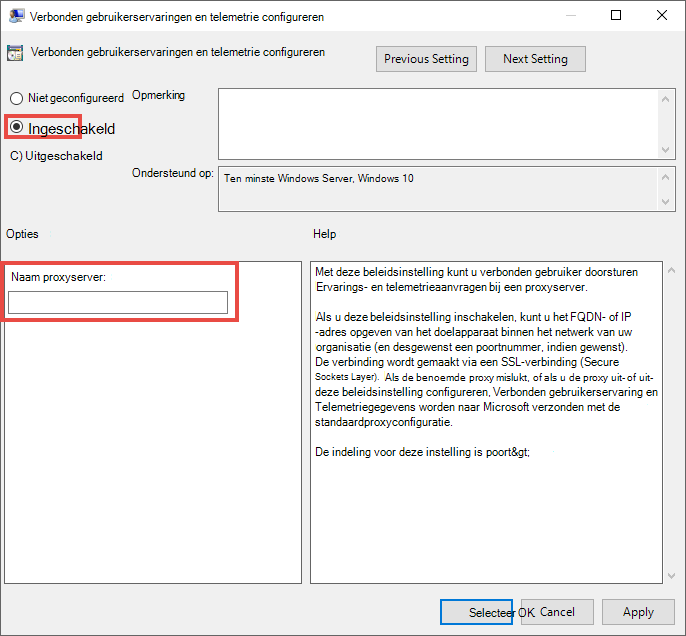

# Apparaat-proxy en instellingen voor internetverbinding voor Endpoint DLP configureren.

Microsoft Endpoint DLP gebruikt Microsoft Windows HTTP (WinHTTP) om gegevens te rapporteren en te communiceren met de cloudservice voor Microsoft-eindpunten. De ingesloten Endpoint DLP wordt in de systeemcontext uitgevoerd met het LocalSystem-account.

> [!TIP]
> Organisaties die forward proxy's gebruiken als gateway voor internet, kunt netwerkbeveiliging gebruiken om een proxy te onderzoeken. Zie [Verbindingsgebeurtenissen achter forward proxy's onderzoeken](/windows/security/threat-protection/microsoft-defender-atp/investigate-behind-proxy) voor meer informatie.

De configuratie-instelling WinHTTP is onafhankelijk van de internetbrowserproxy-instellingen voor Windows Internet (WinINet) en kan alleen een proxyserver vinden met behulp van de volgende methoden voor automatische detectie:

- Transparante proxy
- WPAD (Web Proxy Auto Discovery Protocol)

> [!NOTE]
> Als u transparante proxy of WPAD gebruikt in uw netwerktopologie, hebt u geen speciale configuratie-instellingen nodig. Zie [Enable access to Endpoint DLP cloud service URLLs in the proxy server](#enable-access-to-endpoint-dlp-cloud-service-urls-in-the-proxy-server)(Toegang tot URL's van DLP-cloudservice voor eindpunten in de proxyserver inschakelen) voor meer informatie over uitsluitingen van URL's van Defender voor eindpunten in de proxyserver.

- Hnadmatige statische proxyconfiguratie
    - Configuratie op basis van register
    - WinHTTP geconfigureerd met de Netsh-opdracht– Alleen geschikt voor desktops in een stabiele topologie (bijvoorbeeld: een bureaublad in een bedrijfsnetwerk achter dezelfde proxy)

## De proxyserver handmatig configureren met een statische proxy op basis van het register

Voor eindpuntapparaten die geen verbinding mogen maken met internet, moet u een statische proxy op basis van het register configureren. U moet dit zo configureren dat alleen Microsoft Endpoint DLP diagnostische gegevens kan rapporteren en kan communiceren met de cloudservice van Microsoft-eindpunt.

De statische proxy kan worden geconfigureerd via Group Policy (GP). U vindt het groepsbeleid onder:

1. Open **Veheersjablonen > Windows Components > Gegevensverzameling en Voorbeeldversies > Geverifieerd proxygebruik configureren voor de verbonden gebruikerservaring en telemetrieservice**

2. Stel deze in op **ingeschakelde** selecteer **Het gebruik van geverifieerde proxy uitschakelen**: 

 
3. Open **Veheersjablonen > Windows Components > Gegevensverzameling en Voorbeeldversies > Verbonden gebruikerservaringen en telemetrie configureren**:

 De peoxy configureren

Met het beleid worden twee registerwaarden `TelemetryProxyServer` als REG_SZ ingesteld en wordt `DisableEnterpriseAuthProxy` als REG_DWORD ingesteld onder de registersleutel `HKLM\Software\Policies\Microsoft\Windows\DataCollection`.

De registerwaarde TelemetryProxyServer heeft deze indeling \<server name or ip\>:\<port\>. Bijvoorbeeld: **10.0.0.6:8080**

De registerwaarde `DisableEnterpriseAuthProxy` moet worden ingesteld op 1.

## De proxyserver handmatig configureren met de opdracht 'Netsh'

Gebruik netsh om een statische proxy voor het hele systeem te configureren.

> [!NOTE]
> Dit is van invloed op alle toepassingen, inclusief Windows-services die WinHTTP met standaardproxy gebruiken. - Laptops die van topologie veranderen (bijvoorbeeld van kantoor naar thuis) werken niet goed met netsh. Gebruik de statische proxyconfiguratie op basis van het register.

1. Open een opdrachtpromptregel met verhoogde bevoegdheid.
    1. Go to **Start** and type **cmd**
    1. Klik met de rechtermuisknop op **Opdrachtprompt** en selecteer **Als beheerder uitvoeren**.
2.  Voer de volgende opdracht in en druk op **Enter**:

    `netsh winhttp set proxy <proxy>:<port>`

    Bijvoorbeeld: **netsh winhttp set proxy 10.0.0.6:8080**

3. Voer de volgende opdracht in en druk op **Enter** om de winhttp proxy opnieuw in te stellen:

     `netsh winhttp reset proxy`

Zie [Syntaxis, contexten en opmaak van Netsh](/windows-server/networking/technologies/netsh/netsh-contexts) meer informatie.

## Toegang tot URL's van de DLP-cloudservice voor eindpunten inschakelen op de proxyserver

Als door een proxy of firewall standaard al het verkeer wordt geblokkeerd en alleen bepaalde domeinen worden toegestaan, voegt u de domeinen die worden vermeld in het downloadbare blad toe aan de lijst met toegestane domeinen.

Dit [downloadbare werkblad](https://download.microsoft.com/download/8/a/5/8a51eee5-cd02-431c-9d78-a58b7f77c070/mde-urls.xlsx) bevat services en de bijbehorende URL's waar uw netwerk verbinding mee moet kunnen maken. Zorg ervoor dat er geen firewall- of netwerkfilterregels zijn die toegang tot deze URL's weigeren of u moet mogelijk een specifieke toegangsregel maken.

Als https-scannen (SSL-controle) is ingeschakeld voor een proxy of firewall, moet u de domeinen in de bovenstaande tabel uitsluiten van HTTPS-scannen.
Als een proxy of firewall anoniem verkeer blokkeert, aangezien Eindpunt DLP verbinding maakt vanuit de systeemcontext, zorg er dan voor dat anoniem verkeer is toegestaan in de eerder vermelde URL's.

## Clientconnectiviteit met URL's voor Microsoft-cloudservices verifiëren

Controleer of de proxyconfiguratie is voltooid, of WinHTTP de proxyserver in uw omgeving kan vinden en communiceren, en of via de proxyserver verkeer wordt toegestaan naar de URL's van de Defender for Endpoint-service.

1. Download het hulpprogramma [MDATP Client Analyzer](https://aka.ms/mdatpanalyzer) naar de pc waarop Endpoint DLP wordt uitgevoerd.
2. Pak de inhoud van MDATPClientAnalyzer.zip uit op het apparaat.
3. Open een opdrachtpromptregel met verhoogde bevoegdheid:
    1. Go to **Start** and type **cmd**.
    1. Klik met de rechtermuisknop op **Opdrachtprompt** en selecteer **Als beheerder uitvoeren**.
4.  Voer de volgende opdracht in en druk op **Enter**:
    
`HardDrivePath\MDATPClientAnalyzer.cmd`

Vervang *HardDrivePath* door het pad waar bijvoorbeeld het hulpprogramma MDATPClientAnalyzer is gedownload
    
**C:\Work\tools\MDATPClientAnalyzer\MDATPClientAnalyzer.cmd**

5.  Pak het bestand **MDATPClientAnalyzerResult.zip** dat is aangemaakt door de tool in de map die gebruikt wordt in de _HardDrivePath*.

6.  Open **MDATPClientAnalyzerResult.txt** en controleer of u de configuratiestappen voor de proxy hebt uitgevoerd om serverdetectie en toegang tot de service-URL's in te stellen.  Het hulpprogramma controleert de verbindingen van URL's van Defender voor Endpoint-service die voor Defender voor Endpoint-client zijn geconfigureerd voor interactie. Vervolgens worden de resultaten afgedrukt in het bestand **MDATPClientAnalyzerResult.txt** voor elke URL die mogelijk kan worden gebruikt voor communicatie met Defender voor Endpoint-services. Bijvoorbeeld:

    **Test-URL: https://xxx.microsoft.com/xxx   1 - standaardproxy: Geslaagd (200)   2 - Proxy Auto Discovery (WPAD): Geslaagd (200)  3 - Proxy uitgeschakeld: Geslaagd (200)  4 - Benoemde proxy: bestaat niet  5 - Opdrachtregelproxy: bestaat niet** 

Als minimaal één van de connectiviteitsopties een status (200) retourneert, kan de Defender voor Endpoint-client met deze connectiviteitsmethode correct communiceren met de geteste URL. 

Als de resultaten van de connectiviteitscontrole echter aangeven dat er een fout is, wordt een HTTP-fout weergegeven (zie HTTP-statuscodes). Vervolgens kunt u de URL's gebruiken in de tabel die wordt weergegeven in [Toegang tot URL's van de service voor DLP-cloudservices voor eindpunten inschakelen in de proxyserver](#enable-access-to-endpoint-dlp-cloud-service-urls-in-the-proxy-server). De URL's die u gebruikt, zijn afhankelijk van de regio die is geselecteerd tijdens de onboardingprocedure.
[!NOTE] Het hulpprogramma Connectivity Analyzer is niet compatibel met ASR-regel [Creaties van proces afkomstig van de PSExec- en WMI-opdrachten blokkeren](/windows/security/threat-protection/windows-defender-exploit-guard/attack-surface-reduction#attack-surface-reduction-rules). U moet deze regel tijdelijk uitschakelen om het hulpprogramma voor connectiviteit uit te voeren.

[!NOTE] Wanneer de TelemetryProxyServer is ingesteld, in het register of via groepsbeleid, valt Defender for Endpoint terug naar direct als het geen toegang heeft tot de gedefinieerde proxy.
Verwante onderwerpen • Windows 10-apparaten in onboarden • Problemen met de onboarding van Microsoft Endpoint DLP oplossen

## Zie ook

- [Meer informatie over Preventie van gegevensverlies voor eindpunten](endpoint-dlp-learn-about.md)
- [Preventie van gegevensverlies voor eindpunten gebruiken](endpoint-dlp-using.md)
- [Meer informatie over preventie van gegevensverlies](dlp-learn-about-dlp.md)
- [Een DLP-beleid maken, testen en afstemmen](create-test-tune-dlp-policy.md)
- [Aan de slag met Activity Explorer](data-classification-activity-explorer.md)
- [Microsoft Defender voor Eindpoint](/windows/security/threat-protection/)
- [Hulpmiddelen en methoden voor het onboarden van Windows 10-apparaten](/windows/security/threat-protection/microsoft-defender-atp/configure-endpoints)
- [Microsoft 365-abonnement](https://www.microsoft.com/microsoft-365/compare-microsoft-365-enterprise-plans?rtc=1)
- [Azure AD-gekoppelde apparaten](/azure/active-directory/devices/concept-azure-ad-join)
- [De nieuwe Microsoft Edge op basis van Chromium downloaden](https://support.microsoft.com/help/4501095/download-the-new-microsoft-edge-based-on-chromium)