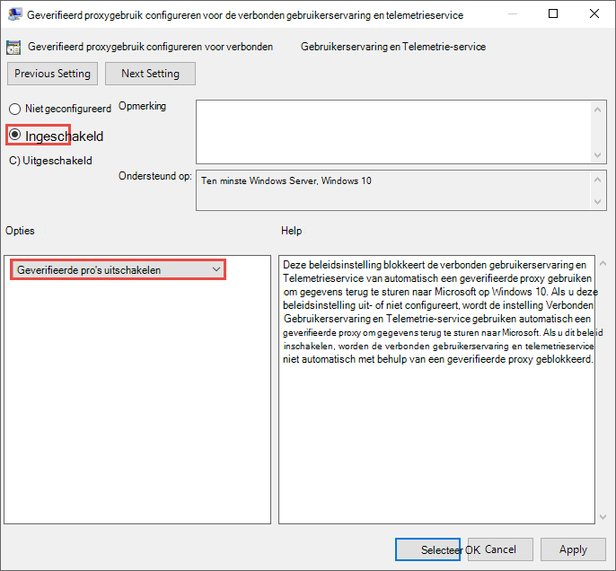

# Apparaat-proxy en instellingen voor internetverbinding voor Endpoint DLP configureren.Configure device proxy and internet connection settings for Endpoint DLP

Microsoft Endpoint DLP gebruikt Microsoft Windows HTTP (WinHTTP) om gegevens te rapporteren en te communiceren met de cloudservice voor Microsoft-eindpunten.Microsoft Endpoint DLP uses Microsoft Windows HTTP (WinHTTP) to report data and communicate with the Microsoft endpoint cloud service. De ingesloten Endpoint DLP wordt in de systeemcontext uitgevoerd met het LocalSystem-account.The embedded Endpoint DLP runs in system context using the LocalSystem account.

> [!TIP]
> Organisaties die forward proxy's gebruiken als gateway voor internet, kunt netwerkbeveiliging gebruiken om een proxy te onderzoeken.For organizations that use forward proxies as a gateway to the Internet, you can use network protection to investigate behind a proxy. Zie [Verbindingsgebeurtenissen achter forward proxy's onderzoeken](/windows/security/threat-protection/microsoft-defender-atp/investigate-behind-proxy) voor meer informatie.For more information, see [Investigate connection events that occur behind forward proxies](/windows/security/threat-protection/microsoft-defender-atp/investigate-behind-proxy).

De configuratie-instelling WinHTTP is onafhankelijk van de internetbrowserproxy-instellingen voor Windows Internet (WinINet) en kan alleen een proxyserver vinden met behulp van de volgende methoden voor automatische detectie:The WinHTTP configuration setting is independent of the Windows Internet (WinINet) Internet browsing proxy settings and can only discover a proxy server by using the following auto discovery methods:

- Transparante proxyTransparent proxy
- WPAD (Web Proxy Auto Discovery Protocol)Web Proxy Auto-discovery Protocol (WPAD)

> [!NOTE]
> Als u transparante proxy of WPAD gebruikt in uw netwerktopologie, hebt u geen speciale configuratie-instellingen nodig.If you’re using Transparent proxy or WPAD in your network topology, you don’t need special configuration settings. Zie [Enable access to Endpoint DLP cloud service URLLs in the proxy server](#enable-access-to-endpoint-dlp-cloud-service-urls-in-the-proxy-server)(Toegang tot URL's van DLP-cloudservice voor eindpunten in de proxyserver inschakelen) voor meer informatie over uitsluitingen van URL's van Defender voor eindpunten in de proxyserver.For more information on Defender for Endpoint URL exclusions in the proxy, see [Enable access to Endpoint DLP cloud service URLs in the proxy server](#enable-access-to-endpoint-dlp-cloud-service-urls-in-the-proxy-server).

- Hnadmatige statische proxyconfiguratieManual static proxy configuration:
    - Configuratie op basis van registerRegistry-based configuration
    - WinHTTP geconfigureerd met de Netsh-opdracht– Alleen geschikt voor desktops in een stabiele topologie (bijvoorbeeld: een bureaublad in een bedrijfsnetwerk achter dezelfde proxy)WinHTTP configured using netsh command – Suitable only for desktops in a stable topology (for example: a desktop in a corporate network behind the same proxy)

## De proxyserver handmatig configureren met een statische proxy op basis van het registerConfigure the proxy server manually using a registry-based static proxy

Voor eindpuntapparaten die geen verbinding mogen maken met internet, moet u een statische proxy op basis van het register configureren.For endpoint devices that aren't permitted to connect to the Internet, you need to configure a registry-based static proxy. U moet dit zo configureren dat alleen Microsoft Endpoint DLP diagnostische gegevens kan rapporteren en kan communiceren met de cloudservice van Microsoft-eindpunt.You need to configure this to allow only Microsoft Endpoint DLP to report diagnostic data and communicate with Microsoft endpoint cloud service.

De statische proxy kan worden geconfigureerd via Group Policy (GP).The static proxy is configurable through Group Policy (GP). U vindt het groepsbeleid onder:The group policy can be found under:

1. Open **Veheersjablonen > Windows Components > Gegevensverzameling en Voorbeeldversies > Geverifieerd proxygebruik configureren voor de verbonden gebruikerservaring en telemetrieservice**Open **Administrative Templates > Windows Components > Data Collection and Preview Builds > Configure Authenticated Proxy usage for the Connected User Experience and Telemetry Service**

2. Stel deze in op **ingeschakelde** selecteer **Het gebruik van geverifieerde proxy uitschakelen**:Set it to **Enabled** and select **Disable Authenticated Proxy usage**: 

 
3. Open **Veheersjablonen > Windows Components > Gegevensverzameling en Voorbeeldversies > Verbonden gebruikerservaringen en telemetrie configureren**:Open **Administrative Templates > Windows Components > Data Collection and Preview Builds > Configure connected user experiences and telemetry**:

 De peoxy configurerenConfigure the proxy

Met het beleid worden twee registerwaarden `TelemetryProxyServer` als REG_SZ ingesteld en wordt `DisableEnterpriseAuthProxy` als REG_DWORD ingesteld onder de registersleutel `HKLM\Software\Policies\Microsoft\Windows\DataCollection`.The policy sets two registry values `TelemetryProxyServer` as REG_SZ and `DisableEnterpriseAuthProxy` as REG_DWORD under the registry key `HKLM\Software\Policies\Microsoft\Windows\DataCollection`.

De registerwaarde TelemetryProxyServer heeft deze indeling \<server name or ip\>:\<port\>.The registry value TelemetryProxyServer is in this format \<server name or ip\>:\<port\>. Bijvoorbeeld: **10.0.0.6:8080**For example: **10.0.0.6:8080**

De registerwaarde `DisableEnterpriseAuthProxy` moet worden ingesteld op 1.The registry value `DisableEnterpriseAuthProxy` should be set to 1.

## De proxyserver handmatig configureren met de opdracht 'Netsh'Configure the proxy server manually using "netsh" command

Gebruik netsh om een statische proxy voor het hele systeem te configureren.Use netsh to configure a system-wide static proxy.

> [!NOTE]
> Dit is van invloed op alle toepassingen, inclusief Windows-services die WinHTTP met standaardproxy gebruiken.This will affect all applications including Windows services which use WinHTTP with default proxy. - Laptops die van topologie veranderen (bijvoorbeeld van kantoor naar thuis) werken niet goed met netsh.- Laptops that are changing topology (for example: from office to home) will malfunction with netsh. Gebruik de statische proxyconfiguratie op basis van het register.Use the registry-based static proxy configuration.

1. Open een opdrachtpromptregel met verhoogde bevoegdheid.Open an elevated command line:
    1. Go to **Start** and type **cmd**Go to **Start** and type **cmd**
    1. Klik met de rechtermuisknop op **Opdrachtprompt** en selecteer **Als beheerder uitvoeren**.Right-click **Command prompt** and select **Run as administrator**.
2.  Voer de volgende opdracht in en druk op **Enter**:Enter the following command and press **Enter**:

    `netsh winhttp set proxy <proxy>:<port>`

    Bijvoorbeeld: **netsh winhttp set proxy 10.0.0.6:8080**For example: **netsh winhttp set proxy 10.0.0.6:8080**

3. Voer de volgende opdracht in en druk op **Enter** om de winhttp proxy opnieuw in te stellen:To reset the winhttp proxy, enter the following command and press **Enter**:

     `netsh winhttp reset proxy`

Zie [Syntaxis, contexten en opmaak van Netsh](/windows-server/networking/technologies/netsh/netsh-contexts) meer informatie.See [Netsh Command Syntax, Contexts, and Formatting](/windows-server/networking/technologies/netsh/netsh-contexts) to learn more.

## Toegang tot URL's van de DLP-cloudservice voor eindpunten inschakelen op de proxyserverEnable access to Endpoint DLP cloud service URLs in the proxy server

Als door een proxy of firewall standaard al het verkeer wordt geblokkeerd en alleen bepaalde domeinen worden toegestaan, voegt u de domeinen die worden vermeld in het downloadbare blad toe aan de lijst met toegestane domeinen.If a proxy or firewall is blocking all traffic by default and allowing only specific domains through, add the domains listed in the downloadable sheet to the allowed domains list.

Dit [downloadbare werkblad](https://download.microsoft.com/download/8/a/5/8a51eee5-cd02-431c-9d78-a58b7f77c070/mde-urls.xlsx) bevat services en de bijbehorende URL's waar uw netwerk verbinding mee moet kunnen maken.This [downloadable spreadsheet](https://download.microsoft.com/download/8/a/5/8a51eee5-cd02-431c-9d78-a58b7f77c070/mde-urls.xlsx) lists the services and their associated URLs that your network must be able to connect to. Zorg ervoor dat er geen firewall- of netwerkfilterregels zijn die toegang tot deze URL's weigeren of u moet mogelijk een specifieke toegangsregel maken.You should ensure that there are no firewall or network filtering rules that would deny access to these URLs, or you may need to create an allow rule specifically for them.

Als https-scannen (SSL-controle) is ingeschakeld voor een proxy of firewall, moet u de domeinen in de bovenstaande tabel uitsluiten van HTTPS-scannen.If a proxy or firewall has HTTPS scanning (SSL inspection) enabled, exclude the domains listed in the above table from HTTPS scanning.
Als een proxy of firewall anoniem verkeer blokkeert, aangezien Eindpunt DLP verbinding maakt vanuit de systeemcontext, zorg er dan voor dat anoniem verkeer is toegestaan in de eerder vermelde URL's.If a proxy or firewall is blocking anonymous traffic, as Endpoint DLP is connecting from system context, make sure anonymous traffic is permitted in the previously listed URLs.

## Clientconnectiviteit met URL's voor Microsoft-cloudservices verifiërenVerify client connectivity to Microsoft cloud service URLs

Controleer of de proxyconfiguratie is voltooid, of WinHTTP de proxyserver in uw omgeving kan vinden en communiceren, en of via de proxyserver verkeer wordt toegestaan naar de URL's van de Defender for Endpoint-service.Verify the proxy configuration completed successfully, that WinHTTP can discover and communicate through the proxy server in your environment, and that the proxy server allows traffic to the Defender for Endpoint service URLs.

1. Download het hulpprogramma [MDATP Client Analyzer](https://aka.ms/mdatpanalyzer) naar de pc waarop Endpoint DLP wordt uitgevoerd.Download the [MDATP Client Analyzer tool](https://aka.ms/mdatpanalyzer) to the PC where Endpoint DLP is running on.
2. Pak de inhoud van MDATPClientAnalyzer.zip uit op het apparaat.Extract the contents of MDATPClientAnalyzer.zip on the device.
3. Open een opdrachtpromptregel met verhoogde bevoegdheid:Open an elevated command line:
    1. Go to **Start** and type **cmd**.Go to **Start** and type **cmd**.
    1. Klik met de rechtermuisknop op **Opdrachtprompt** en selecteer **Als beheerder uitvoeren**.Right-click **Command prompt** and select **Run as administrator**.
4.  Voer de volgende opdracht in en druk op **Enter**:Enter the following command and press **Enter**:
    
`HardDrivePath\MDATPClientAnalyzer.cmd`

Vervang *HardDrivePath* door het pad waar bijvoorbeeld het hulpprogramma MDATPClientAnalyzer is gedownloadReplace *HardDrivePath* with the path where the MDATPClientAnalyzer tool was downloaded to, for example
    
**C:\Work\tools\MDATPClientAnalyzer\MDATPClientAnalyzer.cmd****C:\Work\tools\MDATPClientAnalyzer\MDATPClientAnalyzer.cmd**

5.  Pak het bestand **MDATPClientAnalyzerResult.zip** dat is aangemaakt door de tool in de map die gebruikt wordt in de _HardDrivePath\*.Extract the **MDATPClientAnalyzerResult.zip** _ file created by tool in the folder used in the _HardDrivePath\*.

6.  Open **MDATPClientAnalyzerResult.txt** en controleer of u de configuratiestappen voor de proxy hebt uitgevoerd om serverdetectie en toegang tot de service-URL's in te stellen.Open **MDATPClientAnalyzerResult.txt** and verify that you have performed the proxy configuration steps to enable server discovery and access to the service URLs.  Het hulpprogramma controleert de verbindingen van URL's van Defender voor Endpoint-service die voor Defender voor Endpoint-client zijn geconfigureerd voor interactie.The tool checks the connectivity of Defender for Endpoint service URLs that Defender for Endpoint client is configured to interact with. Vervolgens worden de resultaten afgedrukt in het bestand **MDATPClientAnalyzerResult.txt** voor elke URL die mogelijk kan worden gebruikt voor communicatie met Defender voor Endpoint-services.It then prints the results into the **MDATPClientAnalyzerResult.txt** file for each URL that can potentially be used to communicate with the Defender for Endpoint services. Bijvoorbeeld:For example:

    **Test-URL: https://xxx.microsoft.com/xxx   1 - standaardproxy: Geslaagd (200)   2 - Proxy Auto Discovery (WPAD): Geslaagd (200)  3 - Proxy uitgeschakeld: Geslaagd (200)  4 - Benoemde proxy: bestaat niet  5 - Opdrachtregelproxy: bestaat niet****Testing URL: https://xxx.microsoft.com/xxx   1 - Default proxy: Succeeded (200)   2 - Proxy auto discovery (WPAD): Succeeded (200)  3 - Proxy disabled: Succeeded (200)  4 - Named proxy: Doesn't exist  5 - Command-line proxy: Doesn't exist** 

Als minimaal één van de connectiviteitsopties een status (200) retourneert, kan de Defender voor Endpoint-client met deze connectiviteitsmethode correct communiceren met de geteste URL.If at least one of the connectivity options returns a (200) status, then the Defender for Endpoint client can communicate with the tested URL properly using this connectivity method. 

Als de resultaten van de connectiviteitscontrole echter aangeven dat er een fout is, wordt een HTTP-fout weergegeven (zie HTTP-statuscodes).However, if the connectivity check results indicate a failure, an HTTP error is displayed (see HTTP Status Codes). Vervolgens kunt u de URL's gebruiken in de tabel die wordt weergegeven in [Toegang tot URL's van de service voor DLP-cloudservices voor eindpunten inschakelen in de proxyserver](#enable-access-to-endpoint-dlp-cloud-service-urls-in-the-proxy-server).You can then use the URLs in the table shown in [Enable access to Endpoint DLP cloud service URLs in the proxy server](#enable-access-to-endpoint-dlp-cloud-service-urls-in-the-proxy-server). De URL's die u gebruikt, zijn afhankelijk van de regio die is geselecteerd tijdens de onboardingprocedure.The URLs you’ll use will depend on the region selected during the onboarding procedure.
[!NOTE] Het hulpprogramma Connectivity Analyzer is niet compatibel met ASR-regel [Creaties van proces afkomstig van de PSExec- en WMI-opdrachten blokkeren](/windows/security/threat-protection/windows-defender-exploit-guard/attack-surface-reduction#attack-surface-reduction-rules). The Connectivity Analyzer tool is not compatible with ASR rule [Block process creations originating from PSExec and WMI commands](/windows/security/threat-protection/windows-defender-exploit-guard/attack-surface-reduction#attack-surface-reduction-rules). U moet deze regel tijdelijk uitschakelen om het hulpprogramma voor connectiviteit uit te voeren.You will need to temporarily disable this rule to run the connectivity tool.

[!NOTE] Wanneer de TelemetryProxyServer is ingesteld, in het register of via groepsbeleid, valt Defender for Endpoint terug naar direct als het geen toegang heeft tot de gedefinieerde proxy.When the TelemetryProxyServer is set, in Registry or via Group Policy, Defender for Endpoint will fall back to direct if it can’t access the defined proxy.
Verwante onderwerpen • Windows 10-apparaten in onboarden • Problemen met de onboarding van Microsoft Endpoint DLP oplossenRelated topics •   Onboard Windows 10 devices •   Troubleshoot Microsoft Endpoint DLP onboarding issues

## Zie ookSee also

- [Meer informatie over Preventie van gegevensverlies voor eindpuntenLearn about Endpoint data loss prevention ](endpoint-dlp-learn-about.md)
- [Preventie van gegevensverlies voor eindpunten gebruikenUsing Endpoint data loss prevention ](endpoint-dlp-using.md)
- [Meer informatie over preventie van gegevensverliesLearn about data loss prevention](dlp-learn-about-dlp.md)
- [Een DLP-beleid maken, testen en afstemmenCreate, test, and tune a DLP policy](create-test-tune-dlp-policy.md)
- [Aan de slag met de activiteitenverkennerGet started with Activity explorer](data-classification-activity-explorer.md)
- [Microsoft Defender voor EindpuntMicrosoft Defender for Endpoint](/windows/security/threat-protection/)
- [Hulpmiddelen en methoden onboarden voor Windows 10-apparatenOnboarding tools and methods for Windows 10 machines](/windows/security/threat-protection/microsoft-defender-atp/configure-endpoints)
- [Microsoft 365-abonnementMicrosoft 365 subscription](https://www.microsoft.com/microsoft-365/compare-microsoft-365-enterprise-plans?rtc=1)
- [Azure AD-gekoppelde apparatenAzure AD joined devices](/azure/active-directory/devices/concept-azure-ad-join)
- [De nieuwe Microsoft Edge op basis van Chromium downloadenDownload the new Microsoft Edge based on Chromium](https://support.microsoft.com/help/4501095/download-the-new-microsoft-edge-based-on-chromium)