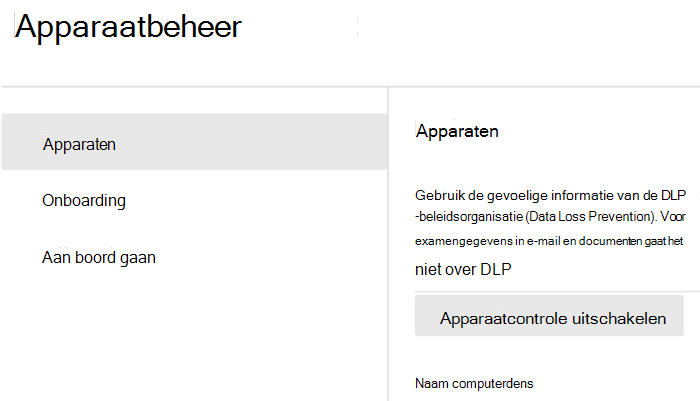

# Aan de slag met Preventie van gegevensverlies voor eindpunten

Microsoft Preventie van gegevensverlies voor eindpunten (DLP voor eindpunten) maakt deel uit van het Microsoft 365-programmapakket voor preventie van gegevensverlies (DLP) met functies die u kunt gebruiken voor het zoeken en beveiligen van gevoelige items in Microsoft 365-services. Zie voor meer informatie over alle DLP-aanbiedingen van Microsoft [Meer informatie over preventie van gegevensverlies](dlp-learn-about-dlp.md). Zie voor meer informatie over DLP voor eindpunten [Meer informatie over preventie van gegevensverlies voor eindpunten](endpoint-dlp-learn-about.md)

Met Microsoft DLP voor eindpunten kunt u Windows 10-apparaten controleren en detecteren wanneer gevoelige items worden gebruikt en gedeeld. Dit geeft u de zichtbaarheid en controle die u nodig hebt om ervoor te zorgen dat ze goed worden gebruikt en beveiligd, en om risicogedrag te voorkomen dat dergelijke gevoelige items in gevaar kan brengen.

## Voordat u begint

### SKU/abonnementenlicenties

Voordat u aan de slag gaat met DLP voor eindpunten, moet u uw [abonnement op Microsoft 365](https://www.microsoft.com/microsoft-365/compare-microsoft-365-enterprise-plans?rtc=1) en eventuele invoegtoepassingen bevestigen. Als u DLP-functionaliteit voor eindpunten wilt openen en gebruiken, moet u een van deze abonnementen of invoegtoepassingen hebben.

- Microsoft 365 E5
- Microsoft 365 A5 (EDU)
- Microsoft 365 E5 Compliance
- Microsoft 365 A5 Compliance
- Microsoft 365 E5 Information Protection en governance
- Microsoft 365 A5 Information Protection en governance

### Machtigingen

Als u apparaatbeheer wilt inschakelen, moet het account dat u gebruikt lid zijn van een van deze rollen:

- Bedrijfsbeheerder
- Beveiligingsbeheerder
- Compliancebeheerder

Als u een aangepast account wilt gebruiken om de instellingen voor apparaatbeheer te bekijken, moet dit een van deze rollen hebben:

- Bedrijfsbeheerder
- Compliancebeheerder
- Beheerder van compliancegegevens
- Globale lezer

Als u een aangepast account wilt gebruiken voor toegang tot de onboarding-/offboarding-pagina, moet dit een van deze rollen hebben:

- Bedrijfsbeheerder
- Compliancebeheerder

Als u een aangepast account wilt gebruiken om Apparaatcontrole in te schakelen of uit te schakelen, moet dit een van deze rollen hebben:

- Bedrijfsbeheerder
- Compliancebeheerder

Gegevens uit DLP voor eindpunten kunnen worden weergegeven in [Activiteitenverkenner](data-classification-activity-explorer.md). Er zijn vier rollen die machtigingen verlenen aan Activiteitenverkenner. Het account dat u gebruikt voor het openen van de gegevens, moet lid zijn van een van deze rollen.

- Bedrijfsbeheerder
- Beheerder voor naleving
- Beveiligingsbeheerder
- Gegevensbeheerder voor naleving

### Uw eindpunten voorbereiden

Zorg ervoor dat de Windows 10-apparaten die u van plan bent in DLP voor eindpunten te implementeren aan deze vereisten voldoen.

1. Moet Windows 10 x64 build 1809 of hoger hebben.

2. Antimalware-clientversie is 4.18.2009.7 of hoger. Controleer uw huidige versie door de Windows-beveiligingsapp te openen, selecteer het pictogram Instellingen en selecteer vervolgens Info. Het versienummer wordt weergegeven onder Antimalware-clientversie. Werk bij naar de nieuwste Antimalware-clientversie door Windows Update KB4052623 te installeren.

   > [!NOTE]
   > Geen van de Windows-beveiligingsonderdelen hoeft actief te zijn, u kunt DLP voor eindpunten uitvoeren onafhankelijk van de Windows-beveiligingsstatus, maar de [Realtime-beveiliging- en gedragscontrole](/windows/security/threat-protection/microsoft-defender-antivirus/configure-real-time-protection-microsoft-defender-antivirus)) moet zijn ingeschakeld.

3. De volgende Windows-updates zijn geïnstalleerd.

   > [!NOTE]
   > Deze updates zijn niet vereist voor het onboarden van een apparaat naar DLP voor eindpunten, maar bevatten oplossingen voor belangrijke problemen die dus moeten worden geïnstalleerd voordat u het product gebruikt.

   - Voor Windows 10 1809 - KB4559003, KB4577069, KB4580390
   - Voor Windows 10 1903 or 1909 - KB4559004, KB4577062, KB4580386
   - Voor Windows 10 2004 - KB4568831, KB4577063
   - Voor apparaten met Office 2016 (en geen andere Office-versie) - KB4577063

4. Alle apparaten moeten tot een van de volgende behoren:

   - [Azure Active Directory (Azure AD)-gekoppeld](/azure/active-directory/devices/concept-azure-ad-join)
   - [Hybride Azure AD-gekoppeld](/azure/active-directory/devices/concept-azure-ad-join-hybrid)
   - [AAD-geregistreerd](/azure/active-directory/user-help/user-help-register-device-on-network)

5. Installeer de browser Microsoft Chromium Edge op het eindpuntapparaat om beleidsacties af te dwingen voor het uploaden naar cloudactiviteit. Zie [Nieuwe Microsoft Edge op basis van Chromium downloaden](https://support.microsoft.com/help/4501095/download-the-new-microsoft-edge-based-on-chromium).

6. Als u werkt met het Maandelijks ondernemingskanaal van Microsoft 365-apps (versie 2004-2008) is er een bekend probleem met de DLP-classificatie van Office-inhoud voor eindpunten en moet u bijwerken naar versie 2009 of hoger. Zie [Geschiedenis van updates voor Microsoft 365-apps (weergegeven op datum)](/officeupdates/update-history-microsoft365-apps-by-date)voor huidige versies. Voor meer informatie over dit probleem, zie de sectie van het Office-programmapakket [Releaseopmerkingen voor huidige kanaalreleases in 2020](/officeupdates/current-channel#version-2010-october-27).

7. Als u eindpunten hebt die een apparaatproxy gebruiken om verbinding te maken met internet, volgt u de procedures in [Apparaatproxy- en internetverbindingsinstellingen configureren voor DLP voor eindpunten](endpoint-dlp-configure-proxy.md).

## Zie Onboarding van apparaten in apparaatbeheer

U moet apparaatcontrole en onboarding van uw eindpunten inschakelen voordat u gevoelige items op een apparaat kunt controleren en beveiligen. Beide acties worden uitgevoerd in het Complianceportal van Microsoft 365.

Wanneer u apparaten wilt gebruiken die nog niet zijn onboarded, downloadt u het juiste script en implementeert u het op die apparaten. Volg de [Procedure voor de onboarding van apparaten](endpoint-dlp-getting-started.md#onboarding-devices).

Als u al apparaten hebt die zijn toegevoegd aan [Microsoft Defender voor Eindpunt](/windows/security/threat-protection/), worden deze al weergegeven in de lijst met beheerde apparaten. Volg de [procedure Met apparaten die onboarded zijn in Microsoft Defender voor Eindpunt](?source=docs&view=o365-worldwide#with-devices-onboarded-into-microsoft-defender-for-endpoint).

### Onboarding van apparaten

In dit implementatiescenario onboardt u apparaten die nog niet zijn onboarded en wilt u alleen gevoelige items controleren en beveiligen tegen onbedoeld delen op Windows 10-apparaten.

1. Open het [Microsoft-compliancecentrum](https://compliance.microsoft.com).

2. Open de instellingenpagina voor het Compliancecentrum en kies **Apparaten onboarden**.

   > [!div class="mx-imgBorder"]
   > 

   > [!NOTE]
   > Het duurt gewoonlijk ongeveer 60 seconden voordat onboarding voor apparaten is ingeschakeld. Wacht 30 minuten voordat u contact opneemt met Microsoft-ondersteuning.

3. Kies **Apparaatbeheer** om de lijst **Apparaten** te openen. De lijst is leeg totdat u apparaten onboardt.

4. Kies **Onboarding** om het onboardingproces te starten.

5. Kies de manier waarop u wilt implementeren op deze andere apparaten in de lijst **implementatiemethode** en vervolgens **pakket downloaden**.

   > [!div class="mx-imgBorder"]
   > 

6. Volg de juiste procedures in [Onboarding-hulpprogramma's en -methoden voor Windows 10-computers](/windows/security/threat-protection/microsoft-defender-atp/configure-endpoints). Via deze koppeling gaat u naar een landingspagina waar u toegang hebt tot procedures voor Microsoft Defender voor Eindpunt die overeenkomen met het installatiepakket dat u in stap 5 hebt geselecteerd:

    - Windows 10-computers onboarden met groepsbeleid
    - Windows-apparaten onboarden met behulp van Microsoft Endpoint Configuration Manager
    - Windows 10-apparaten onboarden met hulpmiddelen voor Mobiel Apparaatbeheer
    - Windows 10-apparaten onboarden met een lokaal script
    - Niet-permanente virtuele desktopinfrastructuur (VDI)-apparaten onboardenin een scenario met één sessie

Wanneer dit is gedaan en het eindpunt is onboarded, moet dit zichtbaar zijn in de lijst met apparaten en moet u ook auditactiviteitslogboeken rapporteren aan Activiteitenverkenner.

> [!NOTE]
> Deze ervaring valt onder het afdwingen van licenties. Zonder de vereiste licentie zijn de gegevens niet zichtbaar of toegankelijk.

### Met apparaten die onboarded zijn in Microsoft Defender voor Eindpunt.

In dit scenario is Microsoft Defender voor Eindpunt al geïmplementeerd en zijn er rapportage-eindpunten. Al deze eindpunten worden weergegeven in de lijst met beheerde apparaten. U kunt nieuwe apparaten blijven gebruiken voor DLP voor eindpunten om de dekking uit te breiden met behulp van de [procedure voor het onboarden van apparaten](endpoint-dlp-getting-started.md#onboarding-devices).

1. Open het [Microsoft-compliancecentrum](https://compliance.microsoft.com).

2. Open de instellingenpagina voor het Compliancecentrum en kies **Apparaatcontrole inschakelen**.

3. Kies **Apparaatbeheer** om de lijst **Apparaten** te openen. U ziet nu de lijst met apparaten die al zijn opgenomen in Microsoft Defender voor Eindpunt.

   > [!div class="mx-imgBorder"]
   > 

4. Kies **Onboarding** als u extra apparaten wilt onboarden.

5. Kies de manier waarop u wilt implementeren op deze extra apparaten in de lijst **Implementatiemethode** en vervolgens **Pakket downloaden**.

6. Volg de juiste procedures in [Onboarding-hulpprogramma's en -methoden voor Windows 10-computers](/windows/security/threat-protection/microsoft-defender-atp/configure-endpoints). Via deze koppeling gaat u naar een landingspagina waar u toegang hebt tot procedures voor Microsoft Defender voor Eindpunt die overeenkomen met het installatiepakket dat u in stap 5 hebt geselecteerd:
    - Windows 10-computers onboarden met groepsbeleid
    - Windows-apparaten onboarden met behulp van Microsoft Endpoint Configuration Manager
    - Windows 10-apparaten onboarden met hulpmiddelen voor Mobiel Apparaatbeheer
    - Windows 10-apparaten onboarden met een lokaal script
    - Niet-permanente virtuele desktopinfrastructuur (VDI)-apparaten onboarden.

Wanneer dit is gedaan en het eindpunt is onboarded, moet dit zichtbaar zijn in de tabel **Apparaten** en moet u ook auditactiviteitslogboeken rapporteren aan **Activiteitenverkenner**.

> [!NOTE]
>Deze ervaring valt onder het afdwingen van licenties. Zonder de vereiste licentie zijn de gegevens niet zichtbaar of toegankelijk.

### DLP-waarschuwingen voor eindpunten weergeven in het dashboard DLP-waarschuwingenbeheer

1. Ga in het Microsoft 365-compliancecentrum naar de pagina Preventie van gegevensverlies en kies Waarschuwingen.

2. Raadpleeg de procedures in [Informatie over het configureren en weergeven van waarschuwingen voor uw DLP-beleid](dlp-configure-view-alerts-policies.md) om waarschuwingen voor uw DLP-beleid voor eindpunten weer te geven.

### DLP-gegevens van eindpunten weergeven in Activiteitenverkenner

1. Open de [pagina Gegevensclassificatie voor](https://compliance.microsoft.com/dataclassification?viewid=overview) uw domein in het Microsoft 365-compliancecentrum en kies Activiteitenverkenner.

2. Raadpleeg de procedures in [Aan de slag met Activiteitenverkenner](data-classification-activity-explorer.md) om alle gegevens voor uw eindpuntapparaten weer te geven en te filteren.

   > [!div class="mx-imgBorder"]
   > 

## Volgende stappen

Nu u onboarded-apparaten hebt en de activiteitsgegevens kunt bekijken in Activiteitenverkenner, kunt u verder gaan met de volgende stap, waarin u DLP-beleid maakt voor het beveiligen van uw gevoelige items.

- [Preventie van gegevensverlies van eindpunten gebruiken](endpoint-dlp-using.md)

## Zie ook

- [Meer informatie over preventie van gegevensverlies van eindpunten](endpoint-dlp-learn-about.md)
- [Preventie van gegevensverlies voor eindpunten gebruiken](endpoint-dlp-using.md)
- [Meer informatie over preventie van gegevensverlies](dlp-learn-about-dlp.md)
- [Een DLP-beleid maken, testen en afstemmen](create-test-tune-dlp-policy.md)
- [Aan de slag met Activity Explorer](data-classification-activity-explorer.md)
- [Microsoft Defender voor Eindpunt](/windows/security/threat-protection/)
- [Hulpmiddelen en methoden onboarden voor Windows 10-apparaten](/windows/security/threat-protection/microsoft-defender-atp/configure-endpoints)
- [Microsoft 365-abonnement](https://www.microsoft.com/microsoft-365/compare-microsoft-365-enterprise-plans?rtc=1)
- [Azure AD-gekoppelde apparaten](/azure/active-directory/devices/concept-azure-ad-join)
- [De nieuwe Microsoft Edge op basis van Chromium downloaden](https://support.microsoft.com/help/4501095/download-the-new-microsoft-edge-based-on-chromium)
