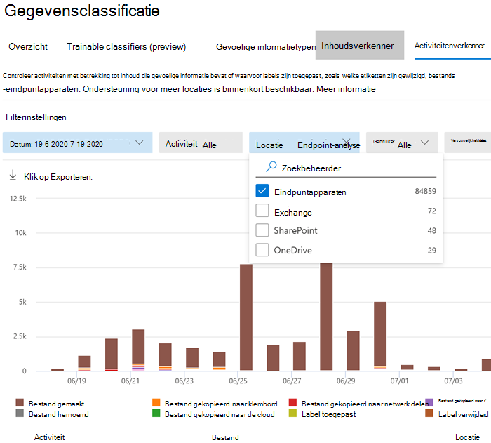

# Aan de slag met Preventie van gegevensverlies voor eindpuntenGet started with Endpoint data loss prevention

Microsoft Preventie van gegevensverlies voor eindpunten (DLP voor eindpunten) maakt deel uit van het Microsoft 365-programmapakket voor preventie van gegevensverlies (DLP) met functies die u kunt gebruiken voor het zoeken en beveiligen van gevoelige items in Microsoft 365-services.Microsoft Endpoint data loss prevention (Endpoint DLP) is part of the Microsoft 365 data loss prevention (DLP) suite of features you can use to discover and protect sensitive items across Microsoft 365 services. Zie voor meer informatie over alle DLP-aanbiedingen van Microsoft [Meer informatie over preventie van gegevensverlies](dlp-learn-about-dlp.md).For more information about all of Microsoft’s DLP offerings, see [Learn about data loss prevention](dlp-learn-about-dlp.md). Zie voor meer informatie over DLP voor eindpunten [Meer informatie over preventie van gegevensverlies voor eindpunten](endpoint-dlp-learn-about.md)To learn more about Endpoint DLP, see [Learn about Endpoint data loss prevention](endpoint-dlp-learn-about.md)

Met Microsoft DLP voor eindpunten kunt u Windows 10-apparaten controleren en detecteren wanneer gevoelige items worden gebruikt en gedeeld.Microsoft Endpoint DLP allows you to monitor Windows 10 devices and detect when sensitive items are used and shared. Dit geeft u de zichtbaarheid en controle die u nodig hebt om ervoor te zorgen dat ze goed worden gebruikt en beveiligd, en om risicogedrag te voorkomen dat dergelijke gevoelige items in gevaar kan brengen.This gives you the visibility and control you need to ensure that they are used and protected properly, and to help prevent risky behavior that might compromise them.

## Voordat u begintBefore you begin

### SKU/abonnementenlicentiesSKU/subscriptions licensing

Voordat u aan de slag gaat met DLP voor eindpunten, moet u uw [abonnement op Microsoft 365](https://www.microsoft.com/microsoft-365/compare-microsoft-365-enterprise-plans?rtc=1) en eventuele invoegtoepassingen bevestigen.Before you get started with Endpoint DLP, you should confirm your [Microsoft 365 subscription](https://www.microsoft.com/microsoft-365/compare-microsoft-365-enterprise-plans?rtc=1) and any add-ons. Als u DLP-functionaliteit voor eindpunten wilt openen en gebruiken, moet u een van deze abonnementen of invoegtoepassingen hebben.To access and use Endpoint DLP functionality, you must have one of these subscriptions or add-ons.

- Microsoft 365 E5Microsoft 365 E5
- Microsoft 365 A5 (EDU)Microsoft 365 A5 (EDU)
- Microsoft 365 E5 ComplianceMicrosoft 365 E5 compliance
- Microsoft 365 A5 ComplianceMicrosoft 365 A5 compliance
- Microsoft 365 E5 Information Protection en governanceMicrosoft 365 E5 information protection and governance
- Microsoft 365 A5 Information Protection en governanceMicrosoft 365 A5 information protection and governance

### MachtigingenPermissions

Als u apparaatbeheer wilt inschakelen, moet het account dat u gebruikt lid zijn van een van deze rollen:To enable device management, the account you use must be a member of any one of these roles:

- BedrijfsbeheerderGlobal admin
- BeveiligingsbeheerderSecurity admin
- CompliancebeheerderCompliance admin

Als u een aangepast account wilt gebruiken om de instellingen voor apparaatbeheer te bekijken, moet dit een van deze rollen hebben:If you want to use a custom account to view the device management settings, it must be in one of these roles:

- BedrijfsbeheerderGlobal admin
- CompliancebeheerderCompliance admin
- Beheerder van compliancegegevensCompliance data admin
- Globale lezerGlobal reader

Als u een aangepast account wilt gebruiken voor toegang tot de onboarding-/offboarding-pagina, moet dit een van deze rollen hebben:If you want to use a custom account to access the onboarding/offboarding page, it must be in one of these roles:

- BedrijfsbeheerderGlobal admin
- CompliancebeheerderCompliance admin

Als u een aangepast account wilt gebruiken om Apparaatcontrole in te schakelen of uit te schakelen, moet dit een van deze rollen hebben:If you want to use a custom account to turn on/off device monitoring, it must be in one of these roles:

- BedrijfsbeheerderGlobal admin
- CompliancebeheerderCompliance admin

Gegevens uit DLP voor eindpunten kunnen worden weergegeven in [Activiteitenverkenner](data-classification-activity-explorer.md).Data from Endpoint DLP can be viewed in [Activity explorer](data-classification-activity-explorer.md). Er zijn vier rollen die machtigingen verlenen aan Activiteitenverkenner. Het account dat u gebruikt voor het openen van de gegevens, moet lid zijn van een van deze rollen.There are four roles that grant permission to activity explorer, the account you use for accessing the data must be a member of any one of them.

- BedrijfsbeheerderGlobal admin
- Beheerder voor nalevingCompliance admin
- BeveiligingsbeheerderSecurity admin
- Gegevensbeheerder voor nalevingCompliance data admin
- Algemene lezerGlobal reader
- BeveiligingslezerSecurity reader
- RapportenlezerReports reader

### Uw eindpunten voorbereidenPrepare your endpoints

Zorg ervoor dat de Windows 10-apparaten die u van plan bent in DLP voor eindpunten te implementeren aan deze vereisten voldoen.Make sure that the Windows 10 devices that you plan on deploying Endpoint DLP to meet these requirements.

1. Moet Windows 10 x64 build 1809 of hoger hebben.Must be running Windows 10 x64 build 1809 or later.

2. Antimalware-clientversie is 4.18.2009.7 of hoger.Antimalware Client Version is 4.18.2009.7 or newer. Controleer uw huidige versie door de Windows-beveiligingsapp te openen, selecteer het pictogram Instellingen en selecteer vervolgens Info.Check your current version by opening Windows Security app, select the Settings icon, and then select About. Het versienummer wordt weergegeven onder Antimalware-clientversie.The version number is listed under Antimalware Client Version. Werk bij naar de nieuwste Antimalware-clientversie door Windows Update KB4052623 te installeren.Update to the latest Antimalware Client Version by installing Windows Update KB4052623. 

   > [!NOTE]
   > Geen van de Windows-beveiligingsonderdelen hoeft actief te zijn, u kunt DLP voor eindpunten uitvoeren onafhankelijk van de Windows-beveiligingsstatus, maar de [Realtime-beveiliging- en gedragscontrole](/windows/security/threat-protection/microsoft-defender-antivirus/configure-real-time-protection-microsoft-defender-antivirus)) moet zijn ingeschakeld.None of Windows Security components need to be active, you can run Endpoint DLP independent of Windows Security status, but the [Real-time protection and Behavior monitor](/windows/security/threat-protection/microsoft-defender-antivirus/configure-real-time-protection-microsoft-defender-antivirus)) must be enabled.
 
3. De volgende Windows-updates zijn geïnstalleerd.The following Windows Updates are installed. 
 
   > [!NOTE]
   > Deze updates zijn niet vereist voor het onboarden van een apparaat naar DLP voor eindpunten, maar bevatten oplossingen voor belangrijke problemen die dus moeten worden geïnstalleerd voordat u het product gebruikt.These updates are not a pre-requisite to onboard a device to Endpoint DLP, but contain fixes for important issues thus must be installed before using the product.

    - Voor Windows 10 1809 - KB4559003, KB4577069, KB4580390For Windows 10 1809 - KB4559003, KB4577069, KB4580390
    - Voor Windows 10 1903 or 1909 - KB4559004, KB4577062, KB4580386For Windows 10 1903 or 1909 - KB4559004, KB4577062, KB4580386
    - Voor Windows 10 2004 - KB4568831, KB4577063For Windows 10 2004 - KB4568831, KB4577063
    - Voor apparaten met Office 2016 (en geen andere Office-versie) - KB4577063For devices running Office 2016 (and not any other Office version) - KB4577063 

4. Alle apparaten moeten tot een van de volgende behoren:All devices must be one of these:
- [Azure Active Directory (Azure AD)-gekoppeldAzure Active Directory (Azure AD) joined](/azure/active-directory/devices/concept-azure-ad-join)
- AD-gekoppeldAD joined
- [Hybride Azure AD-gekoppeldHybrid Azure AD joined](/azure/active-directory/devices/concept-azure-ad-join-hybrid)
- [AAD-geregistreerdAAD registered](/azure/active-directory/user-help/user-help-register-device-on-network)

5. Installeer de browser Microsoft Chromium Edge op het eindpuntapparaat om beleidsacties af te dwingen voor het uploaden naar cloudactiviteit.Install Microsoft Chromium Edge browser on the endpoint device to enforce policy actions for the upload to cloud activity. Zie [Nieuwe Microsoft Edge op basis van Chromium downloaden](https://support.microsoft.com/help/4501095/download-the-new-microsoft-edge-based-on-chromium).See, [Download the new Microsoft Edge based on Chromium](https://support.microsoft.com/help/4501095/download-the-new-microsoft-edge-based-on-chromium).

6. Als u werkt met het Maandelijks ondernemingskanaal van Microsoft 365-apps (versie 2004-2008) is er een bekend probleem met de DLP-classificatie van Office-inhoud voor eindpunten en moet u bijwerken naar versie 2009 of hoger.If you are on Monthly Enterprise Channel of Microsoft 365 Apps versions 2004-2008, there is a known issue with Endpoint DLP classifying Office content and you need to update to version 2009 or later. Zie [Geschiedenis van updates voor Microsoft 365-apps (weergegeven op datum)](/officeupdates/update-history-microsoft365-apps-by-date)voor huidige versies.See [Update history for Microsoft 365 Apps (listed by date)](/officeupdates/update-history-microsoft365-apps-by-date) for current versions. Voor meer informatie over dit probleem, zie de sectie van het Office-programmapakket [Releaseopmerkingen voor huidige kanaalreleases in 2020](/officeupdates/current-channel#version-2010-october-27).To learn more about this issue, see the Office Suite section of [Release notes for Current Channel releases in 2020](/officeupdates/current-channel#version-2010-october-27).

7. Als u eindpunten hebt die een apparaatproxy gebruiken om verbinding te maken met internet, volgt u de procedures in [Apparaatproxy- en internetverbindingsinstellingen configureren voor DLP voor eindpunten](endpoint-dlp-configure-proxy.md).If you have endpoints that use a device proxy to connect to the internet, follow the procedures in [Configure device proxy and internet connection settings for Endpoint DLP](endpoint-dlp-configure-proxy.md).

## Zie Onboarding van apparaten in apparaatbeheerOnboarding devices into device management

U moet apparaatcontrole en onboarding van uw eindpunten inschakelen voordat u gevoelige items op een apparaat kunt controleren en beveiligen.You must enable device monitoring and onboard your endpoints before you can monitor and protect sensitive items on a device. Beide acties worden uitgevoerd in het Complianceportal van Microsoft 365.Both of these actions are done in the Microsoft 365 Compliance portal.

Wanneer u apparaten wilt gebruiken die nog niet zijn onboarded, downloadt u het juiste script en implementeert u het op die apparaten.When you want to onboard devices that haven't been onboarded yet, you'll download the appropriate script and deploy it to those devices. Volg de [Procedure voor de onboarding van apparaten](endpoint-dlp-getting-started.md#onboarding-devices).Follow the [Onboarding devices procedure](endpoint-dlp-getting-started.md#onboarding-devices).

Als u al apparaten hebt die zijn toegevoegd aan [Microsoft Defender voor Eindpunt](/windows/security/threat-protection/), worden deze al weergegeven in de lijst met beheerde apparaten.If you already have devices onboarded into [Microsoft Defender for Endpoint](/windows/security/threat-protection/), they will already appear in the managed devices list. Volg de [procedure Met apparaten die onboarded zijn in Microsoft Defender voor Eindpunt](?source=docs&view=o365-worldwide#with-devices-onboarded-into-microsoft-defender-for-endpoint).Follow the [With devices onboarded into Microsoft Defender for Endpoint procedure](?source=docs&view=o365-worldwide#with-devices-onboarded-into-microsoft-defender-for-endpoint).

### Onboarding van apparatenOnboarding devices

In dit implementatiescenario onboardt u apparaten die nog niet zijn onboarded en wilt u alleen gevoelige items controleren en beveiligen tegen onbedoeld delen op Windows 10-apparaten.In this deployment scenario, you'll onboard devices that have not been onboarded yet, and you just want to monitor and protect sensitive items from unintentional sharing on Windows 10 devices.

1. Open het [Microsoft-compliancecentrum](https://compliance.microsoft.com).Open the [Microsoft compliance center](https://compliance.microsoft.com).

2. Open de instellingenpagina voor het Compliancecentrum en kies **Apparaten onboarden**.Open the Compliance Center settings page and choose **Onboard devices**. 

   > [!div class="mx-imgBorder"]
   > 

   > [!NOTE]
   > Het duurt gewoonlijk ongeveer 60 seconden voordat onboarding voor apparaten is ingeschakeld. Wacht 30 minuten voordat u contact opneemt met Microsoft-ondersteuning.While it usually takes about 60 seconds for device onboarding to be enabled, please allow up to 30 minutes before engaging with Microsoft support.

3. Kies **Apparaatbeheer** om de lijst **Apparaten** te openen.Choose **Device management** to open the **Devices** list. De lijst is leeg totdat u apparaten onboardt.The list will be empty until you onboard devices.

4. Kies **Onboarding** om het onboardingproces te starten.Choose **Onboarding** to begin the onboarding process.

5. Kies de manier waarop u wilt implementeren op deze andere apparaten in de lijst **implementatiemethode** en vervolgens **pakket downloaden**.Choose the way you want to deploy to these additional devices from the **Deployment method** list and then **download package**.

   > [!div class="mx-imgBorder"]
   > 
   
6. Volg de juiste procedures in [Onboarding-hulpprogramma's en -methoden voor Windows 10-computers](/windows/security/threat-protection/microsoft-defender-atp/configure-endpoints).Follow the appropriate procedures in [Onboarding tools and methods for Windows 10 machines](/windows/security/threat-protection/microsoft-defender-atp/configure-endpoints). Via deze koppeling gaat u naar een landingspagina waar u toegang hebt tot procedures voor Microsoft Defender voor Eindpunt die overeenkomen met het installatiepakket dat u in stap 5 hebt geselecteerd:This link takes you to a landing page where you can access Microsoft Defender for Endpoint procedures that match the deployment package you selected in step 5:

    - Windows 10-computers onboarden met groepsbeleidOnboard Windows 10 machines using Group Policy
    - Windows-apparaten onboarden met behulp van Microsoft Endpoint Configuration ManagerOnboard Windows machines using Microsoft Endpoint Configuration Manager
    - Windows 10-apparaten onboarden met hulpmiddelen voor Mobiel ApparaatbeheerOnboard Windows 10 machines using Mobile Device Management tools
    - Windows 10-apparaten onboarden met een lokaal scriptOnboard Windows 10 machines using a local script
    - Niet-permanente virtuele desktopinfrastructuur (VDI)-apparaten onboardenin een scenario met één sessieOnboard non-persistent virtual desktop infrastructure (VDI) machines in single-session scenarios

Wanneer dit is gedaan en het eindpunt is onboarded, moet dit zichtbaar zijn in de lijst met apparaten en moet u ook auditactiviteitslogboeken rapporteren aan Activiteitenverkenner.Once done and endpoint is onboarded, it should be visible in the devices list and also start reporting audit activity logs to Activity explorer.

> [!NOTE]
> Deze ervaring valt onder het afdwingen van licenties.This experience is under license enforcement. Zonder de vereiste licentie zijn de gegevens niet zichtbaar of toegankelijk.Without the required license, data will not be visible or accessible.

### Met apparaten die onboarded zijn in Microsoft Defender voor Eindpunt.With devices onboarded into Microsoft Defender for Endpoint

In dit scenario is Microsoft Defender voor Eindpunt al geïmplementeerd en zijn er rapportage-eindpunten.In this scenario, Microsoft Defender for Endpoint is already deployed and there are endpoints reporting in. Al deze eindpunten worden weergegeven in de lijst met beheerde apparaten.All these endpoints will appear in the managed devices list. U kunt nieuwe apparaten blijven gebruiken voor DLP voor eindpunten om de dekking uit te breiden met behulp van de [procedure voor het onboarden van apparaten](endpoint-dlp-getting-started.md#onboarding-devices).You can continue to onboard new devices into Endpoint DLP to expand coverage by using the [Onboarding devices procedure](endpoint-dlp-getting-started.md#onboarding-devices).

1. Open het [Microsoft-compliancecentrum](https://compliance.microsoft.com).Open the [Microsoft compliance center](https://compliance.microsoft.com).

2. Open de instellingenpagina voor het Compliancecentrum en kies **Apparaatcontrole inschakelen**.Open the Compliance Center settings page and choose **Enable device monitoring**.

3. Kies **Apparaatbeheer** om de lijst **Apparaten** te openen.Choose **Device management** to open the **Devices** list. U ziet nu de lijst met apparaten die al zijn opgenomen in Microsoft Defender voor Eindpunt.You should see the list of devices that are already reporting in to Microsoft Defender for Endpoint.

   > [!div class="mx-imgBorder"]
   > 
   
4. Kies **Onboarding** als u extra apparaten wilt onboarden.Choose **Onboarding** if you need to onboard additional devices.

5. Kies de manier waarop u wilt implementeren op deze extra apparaten in de lijst **Implementatiemethode** en vervolgens **Pakket downloaden**.Choose the way you want to deploy to these additional devices from the **Deployment method** list and then **Download package**.

6. Volg de juiste procedures in [Onboarding-hulpprogramma's en -methoden voor Windows 10-computers](/windows/security/threat-protection/microsoft-defender-atp/configure-endpoints).Follow the appropriate procedures in [Onboarding tools and methods for Windows 10 machines](/windows/security/threat-protection/microsoft-defender-atp/configure-endpoints). Via deze koppeling gaat u naar een landingspagina waar u toegang hebt tot procedures voor Microsoft Defender voor Eindpunt die overeenkomen met het installatiepakket dat u in stap 5 hebt geselecteerd:This link takes you to a landing page where you can access Microsoft Defender for Endpoint procedures that match the deployment package you selected in step 5:

    - Windows 10-computers onboarden met groepsbeleidOnboard Windows 10 machines using Group Policy
    - Windows-apparaten onboarden met behulp van Microsoft Endpoint Configuration ManagerOnboard Windows machines using Microsoft Endpoint Configuration Manager
    - Windows 10-apparaten onboarden met hulpmiddelen voor Mobiel ApparaatbeheerOnboard Windows 10 machines using Mobile Device Management tools
    - Windows 10-apparaten onboarden met een lokaal scriptOnboard Windows 10 machines using a local script
    - Niet-permanente virtuele desktopinfrastructuur (VDI)-apparaten onboarden.Onboard non-persistent virtual desktop infrastructure (VDI) machines.

Wanneer dit is gedaan en het eindpunt is onboarded, moet dit zichtbaar zijn in de tabel **Apparaten** en moet u ook auditactiviteitslogboeken rapporteren aan **Activiteitenverkenner**.Once done and endpoint is onboarded, it should be visible under the **Devices** table and also start reporting audit logs to the **Activity Explorer**.

> [!NOTE]
>Deze ervaring valt onder het afdwingen van licenties.This experience is under license enforcement. Zonder de vereiste licentie zijn de gegevens niet zichtbaar of toegankelijk.Without the required license, data will not be visible or accessible.

### DLP-waarschuwingen voor eindpunten weergeven in het dashboard DLP-waarschuwingenbeheerViewing Endpoint DLP alerts in DLP Alerts Management dashboard

1. Ga in het Microsoft 365-compliancecentrum naar de pagina Preventie van gegevensverlies en kies Waarschuwingen.Open the Data loss prevention page in the Microsoft 365 Compliance center and choose Alerts.

2. Raadpleeg de procedures in [Informatie over het configureren en weergeven van waarschuwingen voor uw DLP-beleid](dlp-configure-view-alerts-policies.md) om waarschuwingen voor uw DLP-beleid voor eindpunten weer te geven.Refer to the procedures in [How to configure and view alerts for your DLP policies](dlp-configure-view-alerts-policies.md) to view alerts for your Endpoint DLP policies.

### DLP-gegevens van eindpunten weergeven in ActiviteitenverkennerViewing Endpoint DLP data in activity explorer

1. Open de [pagina Gegevensclassificatie voor](https://compliance.microsoft.com/dataclassification?viewid=overview) uw domein in het Microsoft 365-compliancecentrum en kies Activiteitenverkenner.Open the [Data classification page](https://compliance.microsoft.com/dataclassification?viewid=overview) for your domain in the Microsoft 365 Compliance center and choose Activity explorer.

2. Raadpleeg de procedures in [Aan de slag met Activiteitenverkenner](data-classification-activity-explorer.md) om alle gegevens voor uw eindpuntapparaten weer te geven en te filteren.Refer to the procedures in [Get started with Activity explorer](data-classification-activity-explorer.md) to access and filter all the data for your Endpoint devices.

   > [!div class="mx-imgBorder"]
   > 

## Volgende stappenNext steps
Nu u onboarded-apparaten hebt en de activiteitsgegevens kunt bekijken in Activiteitenverkenner, kunt u verder gaan met de volgende stap, waarin u DLP-beleid maakt voor het beveiligen van uw gevoelige items.Now that you have onboarded devices and can view the activity data in Activity explorer, you are ready to move on to your next step where you create DLP policies that protect your sensitive items.

- [Preventie van gegevensverlies van eindpunten gebruikenUsing Endpoint data loss prevention](endpoint-dlp-using.md)

## Zie ookSee also

- [Meer informatie over Preventie van gegevensverlies voor eindpuntenLearn about Endpoint data loss prevention ](endpoint-dlp-learn-about.md)
- [Preventie van gegevensverlies voor eindpunten gebruikenUsing Endpoint data loss prevention ](endpoint-dlp-using.md)
- [Meer informatie over preventie van gegevensverliesLearn about data loss prevention](dlp-learn-about-dlp.md)
- [Een DLP-beleid maken, testen en afstemmenCreate, test, and tune a DLP policy](create-test-tune-dlp-policy.md)
- [Aan de slag met Activity ExplorerGet started with Activity explorer](data-classification-activity-explorer.md)
- [Microsoft Defender voor EindpuntMicrosoft Defender for Endpoint](/windows/security/threat-protection/)
- [Hulpmiddelen en methoden onboarden voor Windows 10-apparatenOnboarding tools and methods for Windows 10 machines](/windows/security/threat-protection/microsoft-defender-atp/configure-endpoints)
- [Microsoft 365-abonnementMicrosoft 365 subscription](https://www.microsoft.com/microsoft-365/compare-microsoft-365-enterprise-plans?rtc=1)
- [Azure AD-gekoppelde apparatenAzure AD joined devices](/azure/active-directory/devices/concept-azure-ad-join)
- [De nieuwe Microsoft Edge op basis van Chromium downloadenDownload the new Microsoft Edge based on Chromium](https://support.microsoft.com/help/4501095/download-the-new-microsoft-edge-based-on-chromium)
