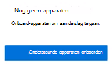
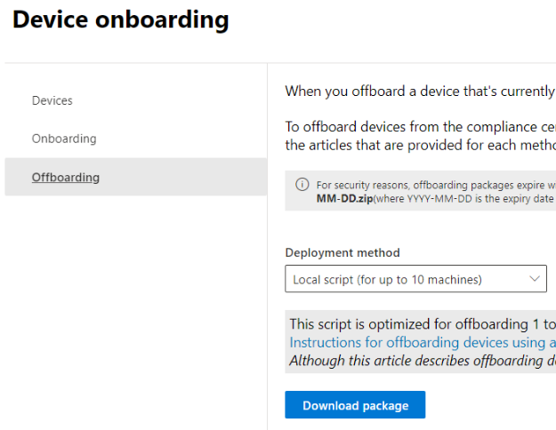
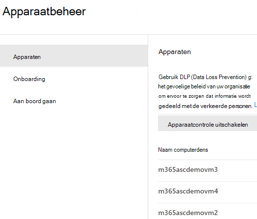
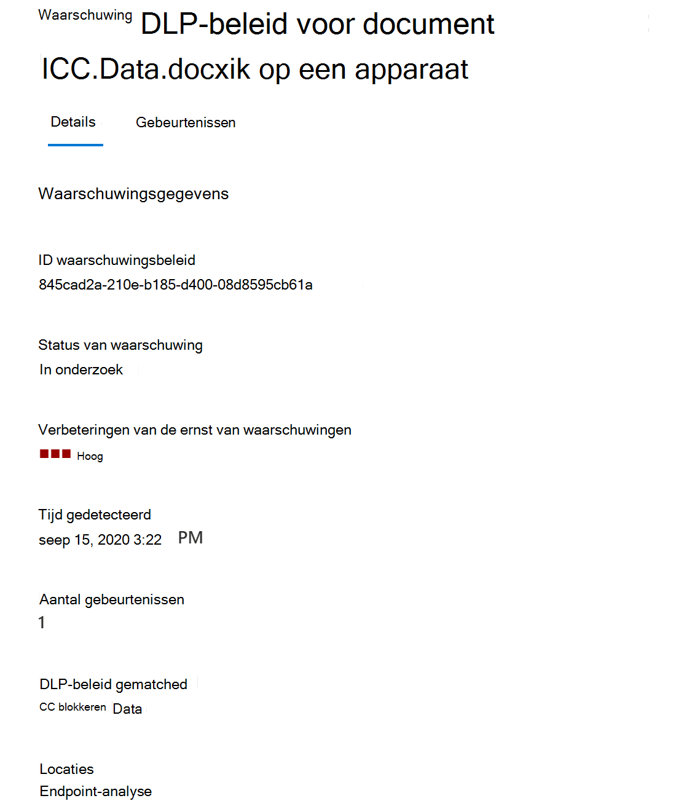
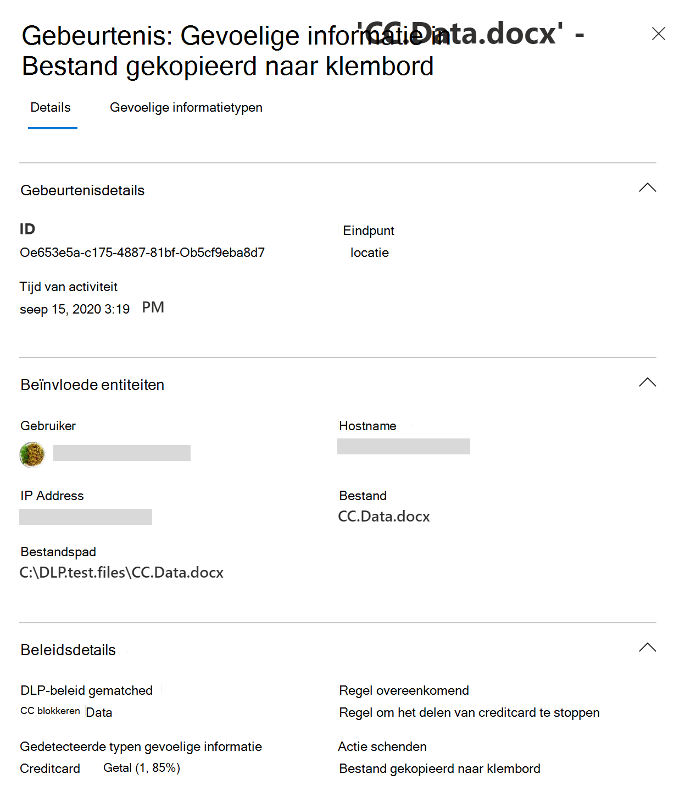
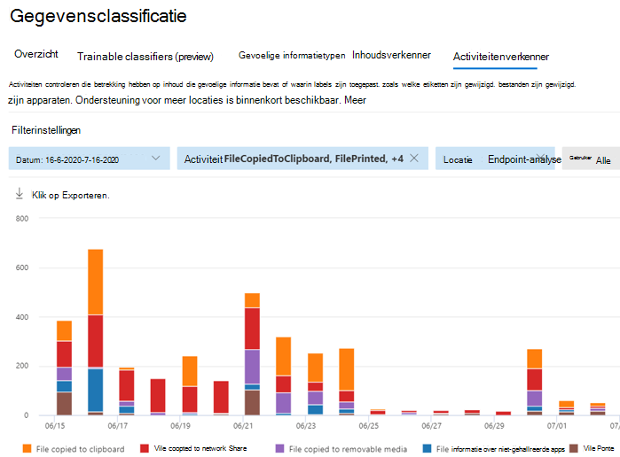
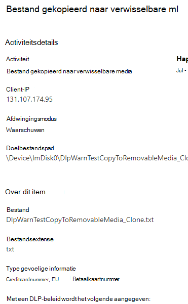

# Meer informatie over Microsoft 365 Eindpunt-DLPLearn about Microsoft 365 Endpoint data loss prevention

U kunt preventie van gegevensverlies van Microsoft 365 (DLP) gebruiken om te controleren welke acties worden ondernomen op items die u vertrouwelijk vindt en om te voorkomen dat deze items per ongeluk worden gedeeld.You can use Microsoft 365 data loss prevention (DLP) to monitor the actions that are being taken on items you've determined to be sensitive and to help prevent the unintentional sharing of those items. Zie voor meer informatie over DLP [Meer informatie over preventie van gegevensverlies](dlp-learn-about-dlp.md).For more information on DLP, see [Learn about data loss prevention](dlp-learn-about-dlp.md).

**Preventie van gegevensverlies voor eindpunten)** (Eindpunt-DLP) is een uitbreiding voor de activiteitencontrole en beveiligingsmogelijkheden van DLP voor vertrouwelijke items op Windows 10-apparaten.**Endpoint data loss prevention** (Endpoint DLP) extends the activity monitoring and protection capabilities of DLP to sensitive items that are on Windows 10 devices. Zodra apparaten zijn geregistreerd bij de Microsoft 365-complianceoplossingen, wordt de informatie over wat gebruikers met gevoelige items doen, zichtbaar in [Activiteitenverkenner](data-classification-activity-explorer.md) en kunt u beschermende maatregelen voor deze items afdwingen via [DLP-beleid](create-test-tune-dlp-policy.md).Once devices are onboarded into the Microsoft 365 compliance solutions, the information about what users are doing with sensitive items is made visible in [activity explorer](data-classification-activity-explorer.md) and you can enforce protective actions on those items via [DLP policies](create-test-tune-dlp-policy.md).

## EIndpuntactiviteiten die u kunt controleren en waarvoor u maatregelen kunt nemenEndpoint activities you can monitor and take action on

Met Microsoft Endpoint DLP kunt u de typen activiteiten die gebruikers uitvoeren op vertrouwelijke items, controleren en beheren op apparaten met Windows 10.Microsoft Endpoint DLP enables you to audit and manage the following types of activities users take on sensitive items on devices running Windows 10. 

|ActiviteitActivity |OmschrijvingDescription  | Controleerbaar/beperkbaarAuditable/restictable|
|---------|---------|---------|
|Naar cloudservice uploaden of openen via niet-toegestane browsersupload to cloud service, or access by unallowed browsers    | Hiermee wordt gedetecteerd wanneer een gebruiker probeert om een item te uploaden naar een beperkt servicedomein of een item via een browser probeert te openen.Detects when a user attempts to upload an item to a restricted service domain or access an item through a browser.  Als ze een browser gebruiken die in DLP is opgenomen als een niet-toegestaan browser, wordt de uploadactiviteit geblokkeerd en wordt de gebruiker omgeleid naar Edge Chromium.If they are using a browser that is listed in DLP as an being an unallowed browser, the upload activity will be blocked and the user is redirected to use Edge Chromium. Edge Chromium staat vervolgens het uploaden of de toegang toe of blokkeert het op basis van de configuratie van het DLP-beleid.Edge Chromium will then either allow or block the upload or access based on the DLP policy configuration         |controleerbaar en beperkbaarauditable and restrictable|
|kopiëren naar andere appcopy to other app    |Hiermee wordt gedetecteerd wanneer een gebruiker informatie uit een beveiligd item probeert te kopiëren en vervolgens te plakken in een andere app, of in een ander proces of item.Detects when a user attempts to copy information from a protected item and then paste it into another app, process or item. Het kopiëren en plakken van gegevens binnen dezelfde app, hetzelfde proces of item wordt niet gedetecteerd door deze activiteit.Copying and pasting information within the same app, process, or item is not detected by this activity.         | controleerbaar en beperkbaarauditable and restrictable|
|kopiëren naar verwisselbare USB-mediacopy to USB removable media |Detecteert wanneer een gebruiker een item of gegevens probeert te kopiëren naar een verwisselbaar medium of USB-apparaat.Detects when a user attempts to copy an item or information to removable media or USB device.         | controleerbaar en beperkbaarauditable and restrictable|
|kopiëren naar een netwerksharecopy to a network share    |Detecteert wanneer een gebruiker een item probeert te kopiëren naar een netwerkshare of een netwerkstationDetects when a user attempts to copy an item to a network share or mapped network drive         |controleerbaar en beperkbaarauditable and restrictable|
|een document afdrukkenprint a document    |Detecteert wanneer een gebruiker een beveiligd item probeert af te drukken op een lokale printer of netwerkprinter.Detects when a user attempts to print a protected item to a local or network printer.| controleerbaar en beperkbaarauditable and restrictable         |
|kopiëren naar een externe sessiecopy to a remote session|Detecteert wanneer een gebruiker een item naar een sessie op het extern bureaublad probeert te kopiërenDetects when a user attempts to copy an item to a remote desktop session |  controleerbaar en beperkbaarauditable and restrictable|
|kopiëren naar een Bluetooth-apparaatcopy to a Bluetooth device|Detecteert wanneer een gebruiker een item naar een niet-toegestane Bluetooth-app probeert te kopiëren (zoals gedefinieerd in de lijst met niet-toegestane Bluetooth-apps in de instellingen voor DLP Endpoint).Detects when a user attempts to copy an item to an unallowed Bluetooth app (as defined in the list of unallowed Bluetooth aps in Endpoint DLP settings).| controleerbaar en beperkbaarauditable and restrictable|
|een item aanmakencreate an item|Detecteert wanneer een gebruiker een item maaktDetects when a user creates an item| controleerbaarauditable|
|een item hernoemenrename an item|Detecteert wanneer een gebruiker de naam van een item wijzigtDetects when a user renames an item| controleerbaarauditable|

 ## Bewaakte bestandenMonitored files

Endpoint DLP ondersteunt de controle van deze bestandstypen:Endpoint DLP supports monitoring of these file types:

- Word-bestandenWord files
- PowerPoint-bestandenPowerPoint files
- Excel-bestandenExcel files
- PDF-bestandenPDF files
- .csv-bestand.csv files
- .tsv-bestanden.tsv files
- .txt-bestanden.txt files
- .rtf-bestanden.rtf files
- .c-bestanden.c files
- .class-bestanden.class files
- .cpp-bestanden.cpp files
- .cs-bestanden.cs files
- .h-bestanden.h files
- .java-bestanden.java files
 
Standaard worden de activiteiten voor deze bestandstypen door Endpoint DLP gecontroleerd, zelfs als er geen overeenkomstig beleid is.By default, endpoint DLP audits the activities for these file types, even if there isn't a policy match. Als u enkel de gegevens wilt controleren waarvoor overeenkomstig beleid bestaat, kunt u **Bestandsactiviteit altijd controleren voor apparaten** uitschakelen in de globale instellingen voor Endpoint DLP.If you only want monitoring data from policy matches, you can turn off the **Always audit file activity for devices** in the endpoint DLP global settings. Als deze instelling is ingeschakeld, worden activiteiten met alle Word-, PowerPoint-, Excel-, PDF- en CSV-bestanden altijd gecontroleerd, zelfs als het apparaat niet aan een beleid is onderworpen.If this setting is on, activities on any Word, PowerPoint, Excel, PDF, and .csv file are always audited even if the device is not targeted by any policy.

Endpoint DLP bewaakt activiteit op basis van MIME-type, zodat er zelfs activiteiten worden vastgelegd als de bestandsextensie wordt gewijzigd.Endpoint DLP monitors activity-based on MIME type, so activities will be captured even if the file extension is changed. 

## Wat is er nieuw in Endpoint DLPWhat's different in Endpoint DLP

Er zijn enkele extra concepten waar u rekening mee moet houden voordat u Endpoint DLP in gebruik gaat nemen.There are a few extra concepts that you need to be aware of before you dig into Endpoint DLP.

### Apparaatbeheer inschakelenEnabling Device management

Apparaatbeheer is de functie waarmee telemetrieverzamelingen van apparaten kunnen worden gebruikt en die beschikbaar wordt in nalevingsoplossingen van Microsoft 365, zoals Endpoint DLP en [Risicobeheer voor Insiders](insider-risk-management.md).Device management is the functionality that enables the collection of telemetry from devices and brings it into Microsoft 365 compliance solutions like Endpoint DLP and [Insider Risk management](insider-risk-management.md). U moet alle apparaten die u wilt gebruiken als locaties in het DLP-beleid onboarden.You'll need to onboard all devices you want to use as locations in DLP policies.

> [!div class="mx-imgBorder"]
> 

Onboarding en offboarding worden verwerkt via scripts die u downloadt in het Apparaatbeheercentrum.Onboarding and offboarding are handled via scripts you download from the Device management center. Het centrum heeft aangepaste scripts voor elk van deze implementatiemethoden:The center has custom scripts for each of these deployment methods:

- lokaal script (maximaal 10 computers)local script (up to 10 machines)
- GroepsbeleidGroup policy
- System Center Configuration Manager (versie 1610 of later)System Center Configuration Manager (version 1610 or later)
- Mobile Device Management/Microsoft IntuneMobile Device Management/Microsoft Intune
- Scripts voor VDI-onboarding voor niet-permanente computersVDI onboarding scripts for non-persistent machines

> [!div class="mx-imgBorder"]
> 

 Gebruik de procedures in [Aan de slag met Microsoft 365 Endpoint DLP](endpoint-dlp-getting-started.md) om apparaten te onboarden.Use the procedures in [Getting started with Microsoft 365 Endpoint DLP](endpoint-dlp-getting-started.md) to onboard devices.

Als u apparaten heeft geïmplementeerd via [Microsoft Defender for Endpoint](/windows/security/threat-protection/), dan worden deze apparaten automatisch weergegeven in de lijst met apparaten.If you have onboarded devices through [Microsoft Defender for Endpoint](/windows/security/threat-protection/), those devices will automatically show up in the list of devices.

> [!div class="mx-imgBorder"]
> 

### Endpoint DLP-gegevens weergevenViewing Endpoint DLP data

U kunt waarschuwingen weergeven die zijn gerelateerd aan DLP-beleid afgedwongen op eindpuntapparaten. Ga daarvoor naar het [Dashboard DLP-waarschuwingenbeheer](dlp-configure-view-alerts-policies.md).You can view alerts related to DLP policies enforced on endpoint devices by going to the [DLP Alerts Management Dashboard](dlp-configure-view-alerts-policies.md).

> [!div class="mx-imgBorder"]
> 

U kunt ook details van de bijbehorende gebeurtenis met uitgebreide metagegevens in hetzelfde dashboard bekijkenYou can also view details of the associated event with rich metadata in the same dashboard

> [!div class="mx-imgBorder"]
> 

Zodra een apparaat is geïmplementeerd, wordt informatie over gecontroleerde activiteiten in Activity Explorer overgezet voordat u DLP-beleidsregels met apparaten als locatie configureert en implementeert.Once a device is onboarded, information about audited activities flows into Activity explorer even before you configure and deploy any DLP policies that have devices as a location.

> [!div class="mx-imgBorder"]
> 

Endpoint DLP verzamelt uitgebreide informatie over gecontroleerde activiteiten.Endpoint DLP collects extensive information on audited activity.

Als een bestand bijvoorbeeld is gekopieerd naar een verwisselbaar USB-medium, ziet u deze kenmerken in de activiteitsdetails:For example, if a file is copied to removable USB media, you'd see these attributes in the activity details:

- activiteitstypeactivity type
- client-IPclient IP
- pad naar doelbestandtarget file path
- timestamp gebeurtenishappened timestamp
- bestandsnaamfile name
- gebruikeruser
- bestandsextensiefile extension
- bestandsgroottefile size
- type vertrouwelijke informatie (indien van toepassing)sensitive information type (if applicable)
- sha1-waardesha1 value
- sha256-waardesha256 value
- vorige bestandsnaamprevious file name
- locatielocation
- bovenliggendparent
- bestandspadfilepath
- type bronlocatiesource location type
- platformplatform
- apparaatnaamdevice name
- type doellocatiedestination location type
- toepassing die de kopie heeft uitgevoerdapplication that performed the copy
- Apparaat-id voor Microsoft Defender voor EndpointMicrosoft Defender for Endpoint device ID (if applicable)
- fabrikant van verwisselbaar media-apparaatremovable media device manufacturer
- model van verwisselbaar media-apparaatremovable media device model
- serienummer van verwisselbaar media-apparaatremovable media device serial number

> [!div class="mx-imgBorder"]
> 

## Volgende stappenNext steps

Nu u meer weet over Endpoint DLP, gaat u als volgt te werk:Now that you've learned about Endpoint DLP, your next steps are:

1) [Aan de slag met preventie van gegevensverlies in Microsoft Endpoint Getting started with Microsoft Endpoint data loss prevention ](endpoint-dlp-getting-started.md)
2) [Eindpunt-DLP gebruikenUsing Microsoft Endpoint data loss prevention](endpoint-dlp-using.md)

## Zie ookSee also

- [Aan de slag met Microsoft Eindpunt-DLPGetting started with Microsoft Endpoint data loss prevention](endpoint-dlp-getting-started.md)
- [Eindpunt-DLP gebruikenUsing Microsoft Endpoint data loss prevention](endpoint-dlp-using.md)
- [Meer informatie over preventie van gegevensverliesLearn about data loss prevention](dlp-learn-about-dlp.md)
- [Een DLP-beleid maken, testen en afstemmenCreate, test, and tune a DLP policy](create-test-tune-dlp-policy.md)
- [Aan de slag met Activity ExplorerGet started with Activity explorer](data-classification-activity-explorer.md)
- [Microsoft Defender voor EindpuntMicrosoft Defender for Endpoint](/windows/security/threat-protection/)
- [Insider Risk-beheerInsider Risk management](insider-risk-management.md)