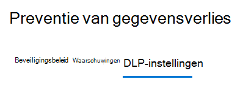
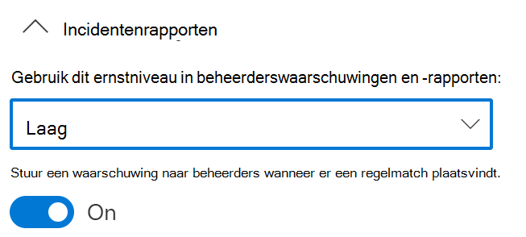
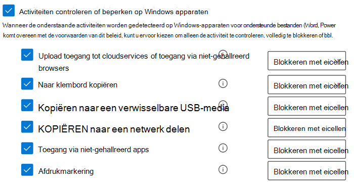
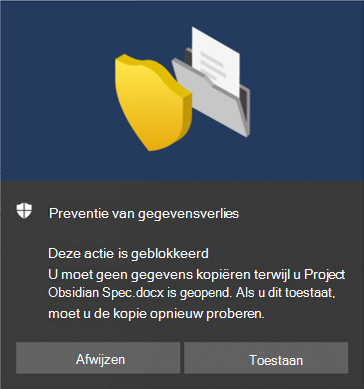

# Preventie van gegevensverlies van eindpunten gebruiken

In dit artikel worden drie scenario's beschreven waarin u een DLP-beleid maakt en wijzigt waarin apparaten als locatie worden gebruikt.

## DLP-instellingen

Voordat u begint, moet u de DLP-instellingen instellen die worden toegepast op alle DLP-beleidsregels voor apparaten. U moet deze configureren als u beleid wilt maken dat het volgende afdwingt:

- cloud-uitgangsbeperkingen
- Beperkingen voor niet-verschuldigde apps

Of

- Als u bestandspaden met veel ruis wilt uitsluiten van de controle

  > [!div class="mx-imgBorder"]
  > 

### Bestandspaduitsluitingen

Mogelijk wilt u bepaalde paden uitsluiten van DLP-controle, DLP-waarschuwingen en DLP-beleid afdwingen op uw apparaten, omdat deze te veel worden gebruikt of geen bestanden bevatten waarin u geïnteresseerd bent. Bestanden op deze locaties worden niet gecontroleerd en bestanden die op deze locaties zijn gemaakt of gewijzigd, kunnen niet worden afdwingen met DLP-beleid. U kunt uitsluitingen voor pad in DLP-instellingen configureren.

U kunt deze logica gebruiken om uw uitsluitingspaden te maken:

- Geldig bestandspad dat eindigt op '\', wat betekent enkel bestanden die direct onder die map vallen.  Bijvoorbeeld C:\Temp\

- Geldig bestandspad dat eindigt op '\*', wat betekent enkel bestanden onder submappen, alsook bestanden die direct onder die map vallen.  Bijvoorbeeld C:\Temp\*

- Geldig bestandspad dat niet eindigt op '\'of '\*', wat betekent enkel bestanden die direct onder die map en alle submappen vallen.  Bijvoorbeeld C:\Temp

- Een pad met een jokerteken tussen '\' aan beide kanten.  Bijvoorbeeld: C:\Gebruikers\*\Desktop\

- Een pad met een jokerteken tussen '\' aan beide kanten en met '(getal)' om het exacte aantal submappen op te geven.  Bijvoorbeeld: C:\Gebruikers\*(1)\Downloads\

- Een pad met omgevingsvariabelen voor SYSTEEM.  Bijvoorbeeld: %SystemDrive%\Test\*

- Een combinatie van alle bovenstaande.  Bijvoorbeeld: %SystemDrive%\Users\*\Documents\*(2)\Sub\

### Niet-toegestane apps

Wanneer de beleidsinstelling **Toegang door niet-toegestane apps en browsers** is ingeschakeld en gebruikers proberen deze apps te gebruiken om toegang te krijgen tot een beveiligd bestand, wordt de activiteit toegestaan, geblokkeerd of geblokkeerd, maar kunnen gebruikers de beperking opheffen. Alle activiteiten worden gecontroleerd en kunnen worden bekeken in activiteitenverkenner.

> [!IMPORTANT]
> Neem het pad naar het uitvoerbare bestand niet op, maar alleen de uitvoerbare naam (zoals browser.exe).

### Niet-toegestane Bluetooth-apps

Voorkom dat personen bestanden die zijn beveiligd op basis van uw beleid, overbrengen via specifieke Bluetooth-apps.

### Browser- en domeinbeperkingen
Beperken dat vertrouwelijke bestanden die overeenkomen met uw beleid, worden gedeeld met beperkte cloudservicedomeinen.

#### Servicedomeinen

U kunt bepalen of vertrouwelijke bestanden die door uw beleid zijn beveiligd, vanuit Microsoft Edge kunnen worden geüpload naar specifieke servicedomeinen.

Als de lijstmodus is ingesteld op **Blokkeren**, kan de gebruiker geen vertrouwelijke items uploaden naar die domeinen. Wanneer een uploadactie wordt geblokkeerd omdat een item overeenkomt met een DLP-beleid, genereert DLP een waarschuwing of blokkeert u de upload van het gevoelige item.

Als de lijstmodus is ingesteld op **Toestaan**, kunnen gebruikers gevoelige items **_enkel_** uploaden naar deze domeinen en is uploaden naar alle andere domeinen niet toegestaan.

> [!IMPORTANT]
> Wanneer de servicebeperkingsmodus is ingesteld op Toestaan, moet er ten minste één servicedomein zijn geconfigureerd voordat de beperkingen worden afgedwongen.

#### Niet-toegestane browsers

U voegt browsers toe die zijn geïdentificeerd met de uitvoerbare namen, en die worden geblokkeerd voor toegang tot bestanden die voldoen aan de voorwaarden van een afgedwongen DLP-beleid waarbij de beperking voor het uploaden naar cloudservices is ingesteld op blokkeren of blokkering overschrijven. Wanneer deze browsers geen toegang meer hebben tot een bestand, krijgen de eindgebruikers een pop-upmelding te zien waarin ze worden gevraagd het bestand te openen via Edge Chromium.

### Zakelijke redenen in beleidstips

U kunt bepalen hoe gebruikers werken met de optie voor zakelijke rechtvaardigingsopties in meldingen van DLP-beleidstips. Deze optie wordt weergegeven wanneer gebruikers een activiteit uitvoeren die is beveiligd door de instelling **Blokkeren met overschrijven** in een DLP-beleid. U kunt een van de volgende opties kiezen:

- Gebruikers kunnen standaard een ingebouwde reden kiezen of hun eigen tekst invoeren.
- Gebruikers kunnen alleen een ingebouwde reden selecteren.
- Gebruikers kunnen alleen hun eigen reden invoeren.

### Bestandsactiviteiten voor apparaten altijd controleren

Wanneer apparaten zijn geregistreerd, worden activiteiten voor Office-, PDF- en CSV-bestanden standaard automatisch gecontroleerd en beschikbaar voor beoordeling in Activiteitenverkenner. Schakel deze functie uit als u wilt dat deze activiteit alleen wordt gecontroleerd wanneer geregistreerde apparaten worden opgenomen in een actief beleid.

Bestandsactiviteiten worden altijd gecontroleerd op geregistreerde apparaten, ongeacht of ze zijn opgenomen in een actief beleid.

## DLP-instellingen samenhangen

Met de webbrowser Endpoint DLP en Edge Chromium kunt u het onbedoeld delen van gevoelige items beperken tot niet-toegestane cloud-apps en -services. Edge Chromium begrijpt wanneer een item wordt beperkt door DLP-beleid voor eindpunten en dwingt toegangsbeperkingen af.

Wanneer u Endpoint DLP gebruikt als locatie in een correct geconfigureerd DLP-beleid en de Edge Ium-browser, hebben de niet-verschuldigde browsers die u hebt gedefinieerd in deze instellingen geen toegang tot de gevoelige items die overeenkomen met uw DLP-beleidsbesturingselementen. In plaats daarvan worden gebruikers omgeleid voor het gebruik van Edge Chromium en Edge Chromium, vanwege het inzicht in de door DLP opgelegde beperkingen, om activiteiten te blokkeren of te beperken wanneer aan de voorwaarden in het DLP-beleid wordt voldaan.

Als u deze beperking wilt gebruiken, moet u drie belangrijke onderdelen configureren:

1. Geef de locaties (services, domeinen en IP-adressen) op met wie u wilt voorkomen dat gevoelige items worden gedeeld.

2. Voeg de browsers toe die geen toegang hebben tot bepaalde gevoelige items wanneer er een DLP-beleidsmatch plaatsvindt.

3. Configureer DLP-beleid voor het definiëren van de soorten gevoelige items waarvoor uploaden moet worden beperkt tot deze locaties door **Uploaden naar cloudservices** en **Access in te stellen vanuit een niet-toegestaan browser**.

U kunt nieuwe services, apps en beleidsregels blijven toevoegen om uw beperkingen uit te breiden en aan te passen aan uw bedrijfsbehoeften en gevoelige gegevens te beschermen. 

Deze configuratie zorgt ervoor dat uw gegevens veilig blijven en vermijdt ook onnodige beperkingen die voorkomen dat gebruikers niet-vertrouwelijke items kunnen openen en delen.

## DLP-beleidsscenario's voor eindpunten

Om u vertrouwd te maken met de on-premises functies van Endpoint DLP en hoe deze worden gebruikt in DLP-beleid, hebben we enkele scenario's opgesteld die u kunt volgen.

> [!IMPORTANT]
> Deze on-premises Endpoint DLP-scenario's zijn niet de officiële procedures voor het maken en afstemmen van DLP-beleid. Raadpleeg de onderstaande onderwerpen wanneer u in het algemeen met DLP-beleid moet werken:

>- [Meer informatie over preventie van gegevensverlies](dlp-learn-about-dlp.md)
>- [Aan de slag met het standaard DLP-beleid](get-started-with-the-default-dlp-policy.md)
>- [Een DLP-beleid maken vanuit een sjabloon](create-a-dlp-policy-from-a-template.md)
>- [Een DLP-beleid maken, testen en afstemmen](create-test-tune-dlp-policy.md)

### Scenario 1: Een beleid maken op basis van een sjabloon, alleen audit

Voor deze scenario's moeten apparaten a geïmplementeerd zijn en rapporteren in Activity Explorer. Als u nog geen onboarded apparaten hebt, gaat u naar [Aan de slag met preventie van gegevensverlies in eindpunten](endpoint-dlp-getting-started.md).

1. Open de [pagina Preventie van gegevensverlies](https://compliance.microsoft.com/datalossprevention?viewid=policies).

2. Kies **Beleid maken**.

3. In dit scenario kiest u **Privacy** en vervolgens **U.S. PII-gegevens (Persoonlijk identificeerbare informatie)** en kiest u **Volgende**.

4. U kunt het veld **Status** uitschakelen voor alle locaties, behalve **Apparaten**. Kies **Volgende**.

5. Accepteer de standaardinstellingen **Instellingen uit de sjabloonselectie** en pas deze aan en kies **Volgende**.

6. Accepteer de standaardacties **beschermingsacties** waarden en kies **Volgende**.

7. Selecteer **Activiteiten controleren of beperken op Windows-apparaten** en laat de acties ingesteld op **Enkel audit**. Kies **Volgende**.

8. Accepteer de standaardinstellingen **Ik deze eerst wil testen** en kies **Beleidstips in de testmodus weergeven**. Kies **Volgende**.

9. Controleer uw instellingen en kies **Verzenden**.

10. Het nieuwe DLP-beleid wordt weergegeven in de beleidslijst.

11. Controleer Activiteitenverkenner op gegevens van de bewaakte eindpunten. Stel het locatiefilter in voor apparaten en voeg het beleid toe. Filter vervolgens op de naam van het beleid om de gevolgen van dit beleid te bekijken. ZIe [Aan de slag met activiteitenverkenner](data-classification-activity-explorer.md) voor meer informatie.

12. Probeer een test te delen die inhoud bevat die de Amerikaanse PII-gegevensvoorwaarde (Persoonlijk identificeerbare informatie) activeert met iemand buiten uw organisatie. Dit activeert het beleid.

13. Controleer Activiteitenverkenner op de gebeurtenis.

### Scenario 2: Het bestaande beleid wijzigen, een waarschuwing instellen

1. Open de [pagina Preventie van gegevensverlies](https://compliance.microsoft.com/datalossprevention?viewid=policies).

2. Kies het **PII-gegevens (Persoonlijk identificeerbare informatie)** die u hebt gemaakt in scenario 1.

3. Kies **Profiel bewerken**.

4. Ga naar de pagina **Geavanceerde DLP-regels** en bewerk het **lage volume aan gevonden inhoud in de Verenigde Staten. Persoonlijk identificeerbare informatie**.

5. Scroll omlaag naar de sectie **Incidentrapporten** en stel **Een waarschuwing verzenden naar beheerders wanneer er een regelmatch plaatsvindt** in op **Aan**. E-mailwaarschuwingen worden automatisch verzonden naar de beheerder en iedereen die u toevoegt aan de lijst met geadresseerden. 

   > [!div class="mx-imgBorder"]
   > 
   
6. In dit scenario kiest u **Waarschuwing verzenden wanneer een activiteit overeenkomt met de regel**.

7. Selecteer **Opslaan**.

8. Behoud alle vorige instellingen door **Volgende** te kiezen en vervolgens de beleidswijzigingen te **Verzenden**.

9. Probeer een test te delen die inhoud bevat die de Amerikaanse PII-gegevensvoorwaarde (Persoonlijk identificeerbare informatie) activeert met iemand buiten uw organisatie. Dit activeert het beleid.

10. Controleer Activiteitenverkenner op de gebeurtenis.

### Scenario 3: Het bestaande beleid wijzigen, de actie blokkeren met toestemming om te vervangen

1. Open de [pagina Preventie van gegevensverlies](https://compliance.microsoft.com/datalossprevention?viewid=policies).

2. Kies het **PII-gegevens (Persoonlijk identificeerbare informatie)** die u hebt gemaakt in scenario 1.

3. Kies **Profiel bewerken**.

4. Ga naar de pagina **Geavanceerde DLP-regels** en bewerk het **lage volume aan gevonden inhoud in de Verenigde Staten. Persoonlijk identificeerbare informatie**.

5. Schuif omlaag naar de sectie **Activiteiten controleren of beperken op Windows-apparaat** en stel voor elke activiteit de bijbehorende actie in op **Blokkeren met overschrijven**.

   > [!div class="mx-imgBorder"]
   > 
   
6. Selecteer **Opslaan**.

7. Herhaal stap 4-7 voor het **grote hoeveelheid inhoud die in de Verenigde Staten is gedetecteerd. Persoonlijk identificeerbare informatie**.

8. Behoud alle vorige instellingen door **Volgende** te kiezen en vervolgens de beleidswijzigingen te **Verzenden**.

9. Probeer een test te delen die inhoud bevat die de Amerikaanse PII-gegevensvoorwaarde (Persoonlijk identificeerbare informatie) activeert met iemand buiten uw organisatie. Dit activeert het beleid.

   U ziet een pop-up zoals deze op het clientapparaat:

   > [!div class="mx-imgBorder"]
   > 

10. Controleer Activiteitenverkenner op de gebeurtenis.

## Zie ook

- [Meer informatie over preventie van gegevensverlies van eindpunten](endpoint-dlp-learn-about.md)
- [Aan de slag met Eindpunt-DLP (gegevensverlies voor eindpunten)](endpoint-dlp-getting-started.md)
- [Meer informatie over preventie van gegevensverlies](dlp-learn-about-dlp.md)
- [Een DLP-beleid maken, testen en afstemmen](create-test-tune-dlp-policy.md)
- [Aan de slag met Activity Explorer](data-classification-activity-explorer.md)
- [Microsoft Defender voor Eindpunt](/windows/security/threat-protection/)
- [Hulpmiddelen en methoden onboarden voor Windows 10-apparaten](/microsoft-365/compliance/dlp-configure-endpoints)
- [Microsoft 365-abonnement](https://www.microsoft.com/microsoft-365/compare-microsoft-365-enterprise-plans?rtc=1)
- [gekoppeld met Azure Active Directory (AD)](/azure/active-directory/devices/concept-azure-ad-join)
- [De nieuwe Microsoft Edge op basis van Chromium downloaden](https://support.microsoft.com/help/4501095/download-the-new-microsoft-edge-based-on-chromium)
- [Aan de slag met het standaard DLP-beleid](get-started-with-the-default-dlp-policy.md)
- [Een DLP-beleid maken vanuit een sjabloon](create-a-dlp-policy-from-a-template.md)
