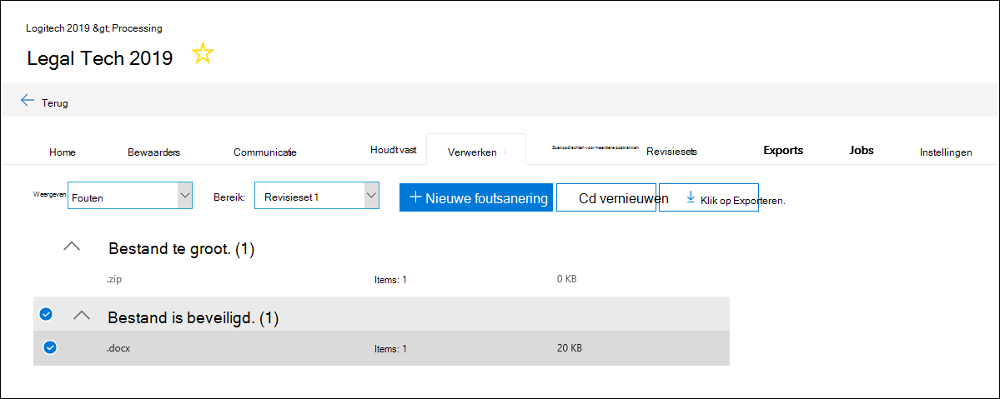
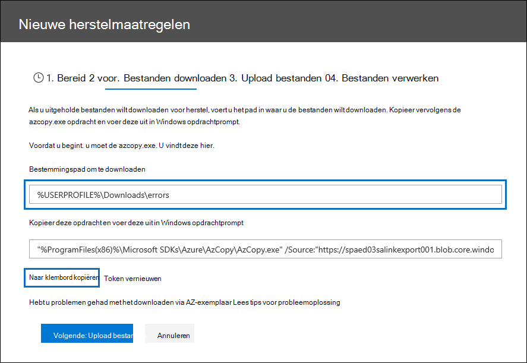
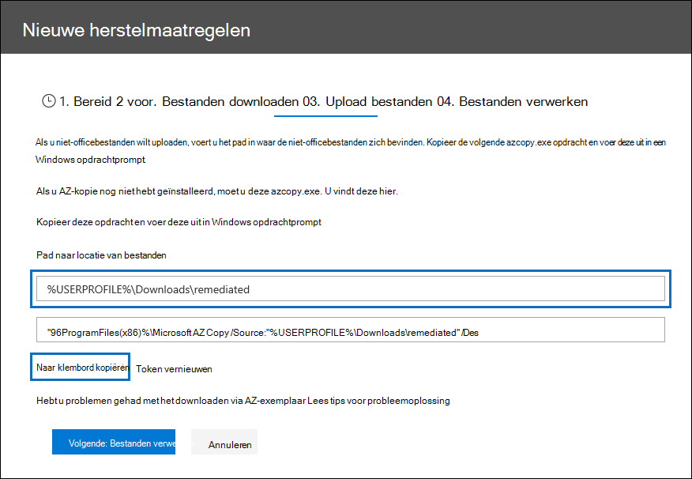
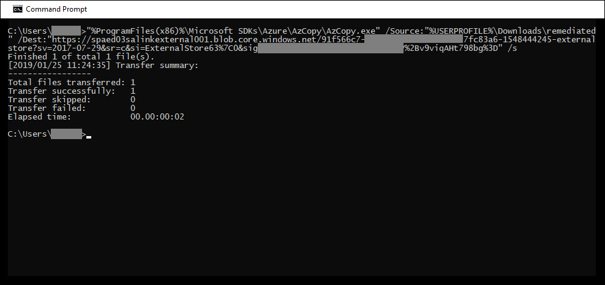

# Foutherstel bij het verwerken van gegevensError remediation when processing data

Met foutremediatie kunnen eDiscovery-beheerders gegevensproblemen verhelpen waardoor Advanced eDiscovery inhoud niet correct verwerkt.Error remediation allows eDiscovery administrators the ability to rectify data issues that prevent Advanced eDiscovery from properly processing the content. Bestanden die met een wachtwoord zijn beveiligd, kunnen bijvoorbeeld niet worden verwerkt omdat de bestanden zijn vergrendeld of versleuteld.For example, files that are password protected can't be processed since the files are locked or encrypted. Met behulp van foutremediatie kunnen eDiscovery-beheerders bestanden met dergelijke fouten downloaden, de wachtwoordbeveiliging verwijderen en vervolgens de herstelbestanden uploaden.Using error remediation, eDiscovery administrators can download files with such errors, remove the password protection, and then upload the remediated files.

Gebruik de volgende werkstroom om bestanden te corrigeren met fouten in Advanced eDiscovery gevallen.Use the following workflow to remediate files with errors in Advanced eDiscovery cases.

## Een foutsaneringssessie maken om bestanden te corrigeren met verwerkingsfoutenCreate an error remediation session to remediate files with processing errors

>[!NOTE]
>Als de wizard Herstel van fout op elk moment tijdens de volgende procedure is gesloten,  kunt u terugkeren naar de  foutremediatiesessie op het tabblad Verwerking door **Herstelbewerkingen** te selecteren in de vervolgkeuzelijst Weergave.If the the error remediation wizard is closed at any time during the following procedure, you can return to the error remediation session from the **Processing** tab by selecting **Remediations** in the **View** drop-down menu.

1. Selecteer op **het** tabblad Verwerking in het  Advanced eDiscovery  in de vervolgkeuzelijst Weergave de optie Fouten en selecteer vervolgens een revisieset of de hele zaak in de **vervolgkeuzelijst** Bereik.On the **Processing** tab in the Advanced eDiscovery case, select **Errors** in the **View** drop-down menu and then select a review set or the entire case in the **Scope** drop-down menu. In deze sectie worden alle fouten uit de zaak of fout uit een specifieke revisieset weergegeven.This section displays all errors from the case or error from a specific review set.

   

2. Selecteer de fouten die u wilt corrigeren door op de radioknop naast het fouttype of het bestandstype te klikken.Select the errors you want to remediate by clicking the radio button next to either the error type or file type.  In het volgende voorbeeld wordt een bestand met een wachtwoord beveiligd.In the following example, we're remediating a password protected file.

3. Klik **op Nieuwe foutsanering**.Click **New error remediation**.

    De werkstroom voor het herstellen van fouten begint met een voorbereidingsfase waarin de bestanden met fouten worden gekopieerd naar een door Microsoft verstrekte Azure Storage-locatie, zodat u ze kunt downloaden naar uw lokale computer om ze te herstellen.The error remediation workflow starts with a preparation stage where the files with errors are copied to a Microsoft-provided Azure Storage location so that you can download them to your local computer to remediate.

    

4. Nadat de voorbereiding is voltooid, klikt u op **Volgende: Bestanden downloaden** om verder te gaan met downloaden.After the preparation is complete, click **Next: Download files** to proceed with download.

    

5. Als u bestanden wilt downloaden, geeft u het **pad Doel op dat u wilt downloaden.**To download files, specify the **Destination path for download**. Dit is een pad naar de bovenliggende map op uw lokale computer waar het bestand wordt gedownload.This is a path to the parent folder on your local computer where the file will be downloaded.  Het standaardpad , %USERPROFILE%\Downloads\errors, wijst naar de downloadmap van de aangemelde gebruiker.The default path, %USERPROFILE%\Downloads\errors, points to the logged-in user's downloads folder. U kunt dit pad desgewenst wijzigen.You can change this path if desired. Als u dit wijzigt, raden we u aan een lokaal bestandspad te gebruiken voor de beste prestaties.If you do change it, we recommend that you use a local file path for the best performance. Gebruik geen extern netwerkpad.Don't use a remote network path. U kunt bijvoorbeeld het pad **C:\Herstel gebruiken.**For example, you could use the path **C:\Remediation**. 

   Het pad naar de bovenliggende map wordt automatisch toegevoegd aan de opdracht AzCopy (als de waarde van de **parameter /Dest).**The path to the parent folder is automatically added to AzCopy command (as the value of the **/Dest** parameter).

6. Kopieer de vooraf gedefinieerde opdracht door op Kopiëren naar **klembord te klikken.**Copy the predefined command by clicking **Copy to clipboard**. Open een Windows opdrachtprompt, plak de opdracht AzCopy en druk vervolgens op **Enter**.Open a Windows Command Prompt, paste the AzCopy command, and then press **Enter**.  

        

    > [!NOTE]
    > U moet AzCopy v8.1 gebruiken om de opdracht te kunnen gebruiken die is opgegeven op de **pagina Bestanden** downloaden.You must use AzCopy v8.1 to successfully use the command that's provided on the **Download files** page. U moet ook AzCopy v8.1 gebruiken om de bestanden te uploaden in stap 10.You also must use AzCopy v8.1 to upload the files in step 10. Zie Gegevens overbrengen met de [AzCopy v8.1](/previous-versions/azure/storage/storage-use-azcopy)op Windows .To install this version of AzCopy, see [Transfer data with the AzCopy v8.1 on Windows](/previous-versions/azure/storage/storage-use-azcopy). Als de opgegeven Opdracht AzCopy mislukt, raadpleegt u [AzCopy](troubleshooting-azcopy.md)oplossen in Advanced eDiscovery.If the supplied AzCopy command fails, please see [Troubleshoot AzCopy in Advanced eDiscovery](troubleshooting-azcopy.md).

    De bestanden die u hebt geselecteerd, worden gedownload naar de locatie die u hebt opgegeven in stap 5.The files that you selected are downloaded to the location that you specified in step 5. In de bovenliggende map (bijvoorbeeld **C:\Herstel)** wordt automatisch de volgende submapstructuur gemaakt:In the parent folder (for example, **C:\Remediation**), the following subfolder structure is automatically created:

    `<Parent folder>\Subfolder 1\Subfolder 2\<file>`

    - *Submap 1* wordt benoemd met de id voor de zaak of de revisieset, afhankelijk van het bereik dat u hebt geselecteerd in stap 1.*Subfolder 1* is named with the ID for the case or the review set, depending on the scope that you selected in step 1.

    - *Submap 2* wordt benoemd met de bestands-id van het gedownloade bestand*Subfolder 2* is named with the file ID of the downloaded file

    - Het gedownloade bestand bevindt zich in *Submap 2* en wordt ook benoemd met de bestands-id.The downloaded file is located in *Subfolder 2* and is also named with the file ID.

    Hier is een voorbeeld van het mappad en de naam van het foutbestand dat wordt gemaakt wanneer items worden gedownload naar de bovenliggende map **C:\Herstel:**Here's an example of the folder path and error file name that's created when items are downloaded to the **C:\Remediation** parent folder:

    `C:\Remediation\232f8b7e-089c-4781-88c6-210da0615d32\d1459499146268a096ea20202cd029857d64087706e6d6ca2a224970ae3b8938\d1459499146268a096ea20202cd029857d64087706e6d6ca2a224970ae3b8938.docx`

    Als er meerdere bestanden worden gedownload, wordt elke bestandsmap gedownload naar een submap met de naam van de bestands-id.If multiple files are downloaded, each one is downloaded to a subfolder that's named with the file ID.

    > [!IMPORTANT]
    > Wanneer u bestanden uploadt in stap 9 en stap 10, moeten de herstelbestanden dezelfde bestandsnaam hebben en zich in dezelfde submapstructuur bevinden.When you upload files in step 9 and step 10, the remediated files must have that same filename and be located in the same subfolder structure. De submap en bestandsnamen worden gebruikt om het gesaneerd bestand aan het oorspronkelijke foutbestand te gekoppeld.The subfolder and file names are used to associated the remediated file with the original error file. Als de mapstructuur of bestandsnamen worden gewijzigd, krijgt u de volgende foutmelding: `Cannot apply Error Remediation to the current Workingset` .If the folder structure or file names are changed, you'll receive the following error: `Cannot apply Error Remediation to the current Workingset`. Als u problemen wilt voorkomen, raden we u aan de herstelbestanden in dezelfde bovenliggende map en submapstructuur te bewaren.To prevent any issues, we recommend that keep the remediated files in the same parent folder and subfolder structure.

7. Nadat u de bestanden hebt gedownload, kunt u deze herstellen met een geschikt hulpmiddel.After downloading the files, you can remediate them with an appropriate tool. Voor met een wachtwoord beveiligde bestanden zijn er verschillende hulpprogramma's voor het kraken van wachtwoorden die u kunt gebruiken.For password-protected files, there are several password cracking tools you can use. Als u de wachtwoorden voor de bestanden kent, kunt u deze openen en de wachtwoordbeveiliging verwijderen.If you know the passwords for the files, you can open them and remove the password protection.

8. Ga terug naar Advanced eDiscovery en de wizard Fout herstellen en klik vervolgens op **Volgende: Upload bestanden.**Return to Advanced eDiscovery and the error remediation wizard and then click **Next: Upload files**.  Hiermee gaat u naar de volgende pagina waar u de bestanden nu kunt uploaden.This moves to the next page where you can now upload the files.

    

9. Geef de bovenliggende map op waar de herstelbestanden zich bevinden in het tekstvak **Pad naar locatie van** bestanden.Specify the parent folder where the remediated files are located in the **Path to location of files** text box. Nogmaals, de bovenliggende map moet dezelfde submapstructuur hebben die is gemaakt toen u de bestanden downloadde.Again, the parent folder must have the same subfolder structure that was created when you downloaded the files.

    Het pad naar de bovenliggende map wordt automatisch toegevoegd aan de opdracht AzCopy (als de waarde van de **parameter /Bron).**The path to the parent folder is automatically added to AzCopy command (as the value of the **/Source** parameter).

10. Kopieer de vooraf gedefinieerde opdracht door op Kopiëren naar **klembord te klikken.**Copy the predefined command by clicking **Copy to clipboard**. Open een Windows opdrachtprompt, plak de opdracht AzCopy en druk vervolgens op **Enter**.Open a Windows Command Prompt, paste the AzCopy command, and then press **Enter**. de bestanden uploaden.upload the files.

    

11. Nadat u de opdracht AzCopy hebt uitgevoerd, klikt u op **Volgende: Bestanden verwerken.**After you run the AzCopy command, click **Next: Process files**.

    Wanneer de verwerking is voltooid, kunt u naar de set van de bestanden gaan en de herstelbestanden bekijken.When processing is complete, you can go to review set and view the remediated files. 

## Fouten in containerbestanden herstellenRemediating errors in container files

In situaties waarin de inhoud van een containerbestand (zoals een .zip-bestand) niet kan worden geëxtraheerd door Advanced eDiscovery, kunnen de containers worden gedownload en de inhoud wordt uitgebreid naar dezelfde map waarin de oorspronkelijke container zich bevindt.In situations when the contents of a container file (such as a .zip file) can't be extracted by Advanced eDiscovery, the containers can be downloaded and the contents expanded into the same folder in which the original container resides. De uitvoede bestanden worden toegeschreven aan de bovenliggende container alsof deze oorspronkelijk met een Advanced eDiscovery.The expanded files will be attributed to the parent container as if it was originally expanded by Advanced eDiscovery. Het proces werkt zoals hierboven beschreven, behalve voor het uploaden van één bestand als vervangend bestand.The process works as described as above except for uploading a single file as the replacement file.  Wanneer u herstelbestanden uploadt, moet u het oorspronkelijke containerbestand niet opnemen.When you upload remediated files, don't include the original container file.

## Fouten herstellen door de uitgepakte tekst te uploadenRemediating errors by uploading the extracted text

Soms is het niet mogelijk om een bestand te herstellen naar de oorspronkelijke indeling die Advanced eDiscovery kan interpreteren.Sometimes it's not possible to remediate a file to native format that Advanced eDiscovery can interpret. Maar u kunt het oorspronkelijke bestand vervangen door een tekstbestand dat de oorspronkelijke tekst van het oorspronkelijke bestand bevat (in een proces dat *tekst overlay wordt genoemd).*But you can replace the original file with a text file that contains the original text of the native file (in a process called *text overlay*). Hiervoor volgt u de stappen die in dit artikel worden beschreven, maar in plaats van het oorspronkelijke bestand in de oorspronkelijke indeling te corrigeren, maakt u een tekstbestand dat de geëxtraheerde tekst uit het oorspronkelijke bestand bevat en uploadt u het tekstbestand met de oorspronkelijke bestandsnaam die is toegevoegd met een .txt-achtervoegsel.To do this, follow the steps described in this article but instead of remediating the original file in the native format, you would create a text file that contains the extracted text from the original file, and then upload the text file using the original filename appended with a .txt suffix. U downloadt bijvoorbeeld een bestand tijdens foutsanering met de bestandsnaam 335850cc-6602-4af0-acfa-1d14d9128ca2.abc.For example, you download a file during error remediation with the filename 335850cc-6602-4af0-acfa-1d14d9128ca2.abc. U opent het bestand in de oorspronkelijke toepassing, kopieert de tekst en plakt het in een nieuw bestand met de naam 335850cc-6602-4af0-acfa-1d14d9128ca2.abc.txt.You open the file in the native application, copy the text, and then paste it into a new file named 335850cc-6602-4af0-acfa-1d14d9128ca2.abc.txt. Wanneer u dit doet, moet u het oorspronkelijke bestand in de oorspronkelijke indeling verwijderen van de locatie van het gesaneerd bestand op uw lokale computer voordat u het gesaneerde tekstbestand uploadt naar Advanced eDiscovery.When you do this, be sure to remove the original file in the native format from the remediated file location on your local computer before uploading the remediated text file to Advanced eDiscovery.

## Wat gebeurt er wanneer bestanden worden gesaneerdWhat happens when files are remediated

Wanneer herstelbestanden worden geüpload, blijven de oorspronkelijke metagegevens behouden, behalve de volgende velden:When remediated files are uploaded, the original metadata is preserved except for the following fields: 

- ExtractedTextSizeExtractedTextSize
- HasTextHasText
- IsErrorRemediateIsErrorRemediate
- LoadIdLoadId
- ProcessingErrorMessageProcessingErrorMessage
- ProcessingStatusProcessingStatus
- TekstText
- WordCountWordCount
- WorkingsetIdWorkingsetId

Zie Metagegevensvelden van documenten voor een definitie van alle metagegevensvelden in [Advanced eDiscovery.](document-metadata-fields-in-advanced-ediscovery.md)For a definition of all metadata fields in Advanced eDiscovery, see [Document metadata fields](document-metadata-fields-in-advanced-ediscovery.md).