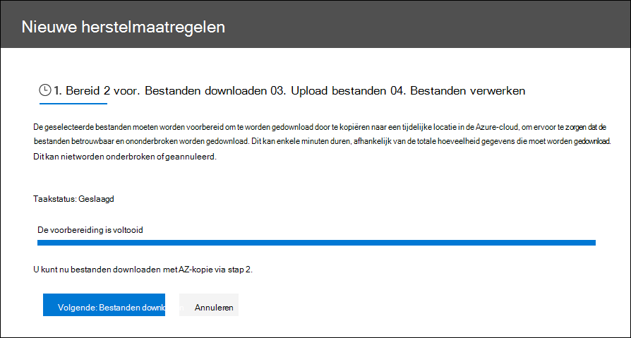

# Foutherstel bij het verwerken van gegevens

Met foutremediatie kunnen eDiscovery-beheerders gegevensproblemen verhelpen waardoor Advanced eDiscovery inhoud niet correct verwerkt. Bestanden die met een wachtwoord zijn beveiligd, kunnen bijvoorbeeld niet worden verwerkt omdat de bestanden zijn vergrendeld of versleuteld. Met behulp van foutremediatie kunnen eDiscovery-beheerders bestanden met dergelijke fouten downloaden, de wachtwoordbeveiliging verwijderen en vervolgens de herstelbestanden uploaden.

Gebruik de volgende werkstroom om bestanden te corrigeren met fouten in Advanced eDiscovery gevallen.

## Een foutsaneringssessie maken om bestanden te corrigeren met verwerkingsfouten

> [!NOTE]
> Als de wizard Herstel van fout op elk moment tijdens de volgende procedure is gesloten,  kunt u terugkeren naar de  foutremediatiesessie op het tabblad Verwerking door **Herstelbewerkingen** te selecteren in de vervolgkeuzelijst Weergave.

1. Selecteer op **het** tabblad Verwerking in het  Advanced eDiscovery  in de vervolgkeuzelijst Weergave de optie Fouten en selecteer vervolgens een revisieset of de hele zaak in de **vervolgkeuzelijst** Bereik. In deze sectie worden alle fouten uit de zaak of fout uit een specifieke revisieset weergegeven.

   

2. Selecteer de fouten die u wilt corrigeren door op de radioknop naast het fouttype of het bestandstype te klikken.  In het volgende voorbeeld wordt een bestand met een wachtwoord beveiligd.

3. Klik **op Nieuwe foutsanering**.

    De werkstroom voor het herstellen van fouten begint met een voorbereidingsfase waarin de bestanden met fouten worden gekopieerd naar een door Microsoft verstrekte Azure Storage-locatie, zodat u ze kunt downloaden naar uw lokale computer om ze te herstellen.

    

4. Nadat de voorbereiding is voltooid, klikt u op **Volgende: Bestanden downloaden** om verder te gaan met downloaden.

    

5. Als u bestanden wilt downloaden, geeft u het **pad Doel op dat u wilt downloaden.** Dit is een pad naar de bovenliggende map op uw lokale computer waar het bestand wordt gedownload.  Het standaardpad , %USERPROFILE%\Downloads\errors, wijst naar de downloadmap van de aangemelde gebruiker. U kunt dit pad desgewenst wijzigen. Als u dit wijzigt, raden we u aan een lokaal bestandspad te gebruiken voor de beste prestaties. Gebruik geen extern netwerkpad. U kunt bijvoorbeeld het pad **C:\Herstel gebruiken.**

   Het pad naar de bovenliggende map wordt automatisch toegevoegd aan de opdracht AzCopy (als de waarde van de **parameter /Dest).**

6. Kopieer de vooraf gedefinieerde opdracht door op Kopiëren naar **klembord te klikken.** Open een Windows opdrachtprompt, plak de opdracht AzCopy en druk vervolgens op **Enter**.

    

    > [!NOTE]
    > U moet AzCopy v8.1 gebruiken om de opdracht te kunnen gebruiken die is opgegeven op de **pagina Bestanden** downloaden. U moet ook AzCopy v8.1 gebruiken om de bestanden te uploaden in stap 10. Zie Gegevens overbrengen met de [AzCopy v8.1](/previous-versions/azure/storage/storage-use-azcopy)op Windows . Als de opgegeven Opdracht AzCopy mislukt, raadpleegt u [AzCopy](troubleshooting-azcopy.md)oplossen in Advanced eDiscovery.

    De bestanden die u hebt geselecteerd, worden gedownload naar de locatie die u hebt opgegeven in stap 5. In de bovenliggende map (bijvoorbeeld **C:\Herstel)** wordt automatisch de volgende submapstructuur gemaakt:

    `<Parent folder>\Subfolder 1\Subfolder 2\<file>`

    - *Submap 1* wordt benoemd met de id voor de zaak of de revisieset, afhankelijk van het bereik dat u hebt geselecteerd in stap 1.

    - *Submap 2* wordt benoemd met de bestands-id van het gedownloade bestand

    - Het gedownloade bestand bevindt zich in *Submap 2* en wordt ook benoemd met de bestands-id.

    Hier is een voorbeeld van het mappad en de naam van het foutbestand dat wordt gemaakt wanneer items worden gedownload naar de bovenliggende map **C:\Herstel:**

    `C:\Remediation\232f8b7e-089c-4781-88c6-210da0615d32\d1459499146268a096ea20202cd029857d64087706e6d6ca2a224970ae3b8938\d1459499146268a096ea20202cd029857d64087706e6d6ca2a224970ae3b8938.docx`

    Als er meerdere bestanden worden gedownload, wordt elke bestandsmap gedownload naar een submap met de naam van de bestands-id.

    > [!IMPORTANT]
    > Wanneer u bestanden uploadt in stap 9 en stap 10, moeten de herstelbestanden dezelfde bestandsnaam hebben en zich in dezelfde submapstructuur bevinden. De submap en bestandsnamen worden gebruikt om het gesaneerd bestand aan het oorspronkelijke foutbestand te gekoppeld. Als de mapstructuur of bestandsnamen worden gewijzigd, krijgt u de volgende foutmelding: `Cannot apply Error Remediation to the current Workingset` . Als u problemen wilt voorkomen, raden we u aan de herstelbestanden in dezelfde bovenliggende map en submapstructuur te bewaren.

7. Nadat u de bestanden hebt gedownload, kunt u deze herstellen met een geschikt hulpmiddel. Voor met een wachtwoord beveiligde bestanden zijn er verschillende hulpprogramma's voor het kraken van wachtwoorden die u kunt gebruiken. Als u de wachtwoorden voor de bestanden kent, kunt u deze openen en de wachtwoordbeveiliging verwijderen.

8. Ga terug naar Advanced eDiscovery en de wizard Fout herstellen en klik vervolgens op **Volgende: Upload bestanden.**  Hiermee gaat u naar de volgende pagina waar u de bestanden nu kunt uploaden.

    

9. Geef de bovenliggende map op waar de herstelbestanden zich bevinden in het tekstvak **Pad naar locatie van** bestanden. Nogmaals, de bovenliggende map moet dezelfde submapstructuur hebben die is gemaakt toen u de bestanden downloadde.

    Het pad naar de bovenliggende map wordt automatisch toegevoegd aan de opdracht AzCopy (als de waarde van de **parameter /Bron).**

10. Kopieer de vooraf gedefinieerde opdracht door op Kopiëren naar **klembord te klikken.** Open een Windows opdrachtprompt, plak de opdracht AzCopy en druk vervolgens op **Enter**. de bestanden uploaden.

    

11. Nadat u de opdracht AzCopy hebt uitgevoerd, klikt u op **Volgende: Bestanden verwerken.**

    Wanneer de verwerking is voltooid, kunt u naar de set van de bestanden gaan en de herstelbestanden bekijken.

## Fouten in containerbestanden herstellen

In situaties waarin de inhoud van een containerbestand (zoals een .zip-bestand) niet kan worden geëxtraheerd door Advanced eDiscovery, kunnen de containers worden gedownload en de inhoud wordt uitgebreid naar dezelfde map waarin de oorspronkelijke container zich bevindt. De uitvoede bestanden worden toegeschreven aan de bovenliggende container alsof deze oorspronkelijk met een Advanced eDiscovery. Het proces werkt zoals hierboven beschreven, behalve voor het uploaden van één bestand als vervangend bestand.  Wanneer u herstelbestanden uploadt, moet u het oorspronkelijke containerbestand niet opnemen.

## Fouten herstellen door de uitgepakte tekst te uploaden

Soms is het niet mogelijk om een bestand te herstellen naar de oorspronkelijke indeling die Advanced eDiscovery kan interpreteren. Maar u kunt het oorspronkelijke bestand vervangen door een tekstbestand dat de oorspronkelijke tekst van het oorspronkelijke bestand bevat (in een proces dat *tekst overlay wordt genoemd).* Hiervoor volgt u de stappen die in dit artikel worden beschreven, maar in plaats van het oorspronkelijke bestand in de oorspronkelijke indeling te corrigeren, maakt u een tekstbestand dat de geëxtraheerde tekst uit het oorspronkelijke bestand bevat en uploadt u het tekstbestand met de oorspronkelijke bestandsnaam die is toegevoegd met een .txt-achtervoegsel. U downloadt bijvoorbeeld een bestand tijdens foutsanering met de bestandsnaam 335850cc-6602-4af0-acfa-1d14d9128ca2.abc. U opent het bestand in de oorspronkelijke toepassing, kopieert de tekst en plakt het in een nieuw bestand met de naam 335850cc-6602-4af0-acfa-1d14d9128ca2.abc.txt. Wanneer u dit doet, moet u het oorspronkelijke bestand in de oorspronkelijke indeling verwijderen van de locatie van het gesaneerd bestand op uw lokale computer voordat u het gesaneerde tekstbestand uploadt naar Advanced eDiscovery.

## Wat gebeurt er wanneer bestanden worden gesaneerd

Wanneer herstelbestanden worden geüpload, blijven de oorspronkelijke metagegevens behouden, behalve de volgende velden:

- ExtractedTextSize
- HasText
- IsErrorRemediate
- LoadId
- ProcessingErrorMessage
- ProcessingStatus
- Tekst
- WordCount
- WorkingsetId

Zie Metagegevensvelden van documenten voor een definitie van alle metagegevensvelden in [Advanced eDiscovery.](document-metadata-fields-in-advanced-ediscovery.md)