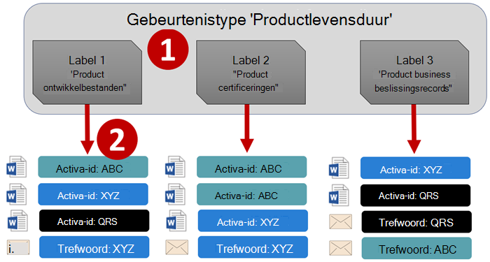
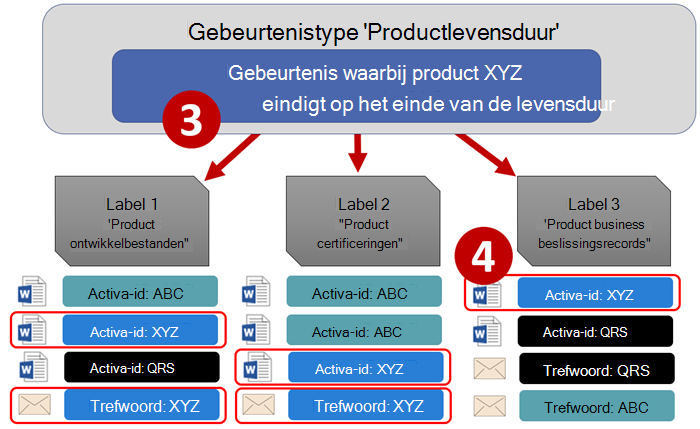
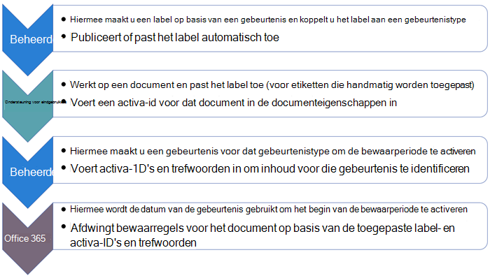
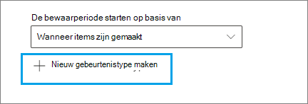
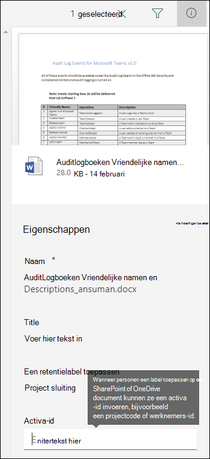
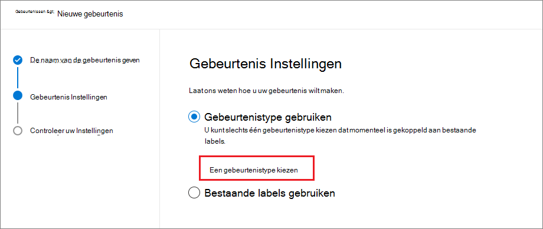
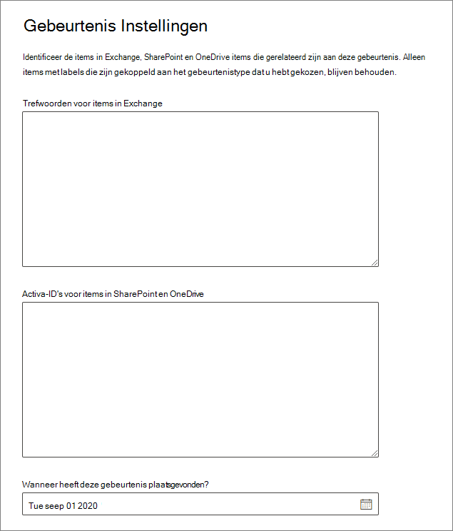

# <a name="start-retention-when-an-event-occurs"></a><span data-ttu-id="9a9cf-103">Retentie starten als zich een gebeurtenis voordoet</span><span class="sxs-lookup"><span data-stu-id="9a9cf-103">Start retention when an event occurs</span></span>

><span data-ttu-id="9a9cf-104">*[Richtlijnen voor Microsoft 365-licenties voor beveiliging en compliance](/office365/servicedescriptions/microsoft-365-service-descriptions/microsoft-365-tenantlevel-services-licensing-guidance/microsoft-365-security-compliance-licensing-guidance).*</span><span class="sxs-lookup"><span data-stu-id="9a9cf-104">*[Microsoft 365 licensing guidance for security & compliance](/office365/servicedescriptions/microsoft-365-service-descriptions/microsoft-365-tenantlevel-services-licensing-guidance/microsoft-365-security-compliance-licensing-guidance).*</span></span>

<span data-ttu-id="9a9cf-105">Wanneer u inhoud behoudt, is de retentieperiode vaak gebaseerd op de leeftijd van de inhoud.</span><span class="sxs-lookup"><span data-stu-id="9a9cf-105">When you retain content, the retention period is often based on the age of the content.</span></span> <span data-ttu-id="9a9cf-106">U kunt bijvoorbeeld documenten nog zeven jaar bewaren nadat ze zijn gemaakt en ze vervolgens verwijderen.</span><span class="sxs-lookup"><span data-stu-id="9a9cf-106">For example, you might retain documents for seven years after they're created and then delete them.</span></span> <span data-ttu-id="9a9cf-107">Maar wanneer u [retentielabels](retention.md#retention-labels) configureert, kunt u een retentieperiode ook baseren op wanneer een specifiek type gebeurtenis plaatsvindt.</span><span class="sxs-lookup"><span data-stu-id="9a9cf-107">But when you configure [retention labels](retention.md#retention-labels), you can also base a retention period on when a specific type of event occurs.</span></span> <span data-ttu-id="9a9cf-108">De gebeurtenis activeert het begin van de retentieperiode. Voor alle inhoud met een retentielabel dat op dat type gebeurtenis is toegepast, worden de bewaaracties van het label afgedwongen.</span><span class="sxs-lookup"><span data-stu-id="9a9cf-108">The event triggers the start of the retention period, and all content with a retention label applied for that type of event get the label's retention actions enforced on them.</span></span>
  
<span data-ttu-id="9a9cf-109">Voorbeelden voor het gebruik van retentiebeleid op basis van gebeurtenissen:</span><span class="sxs-lookup"><span data-stu-id="9a9cf-109">Examples for using event-based retention:</span></span>
  
- <span data-ttu-id="9a9cf-110">**Werknemers die de organisatie verlaten** Stel dat werknemersrecords tien jaar moeten worden bewaard vanaf het moment dat een werknemer de organisatie verlaat.</span><span class="sxs-lookup"><span data-stu-id="9a9cf-110">**Employees leaving the organization** Suppose that employee records must be retained for 10 years from the time an employee leaves the organization.</span></span> <span data-ttu-id="9a9cf-111">Na 10 jaar moeten alle documenten die betrekking hebben op de benoeming, de prestaties en het beëindigen van het dienstverband voor die werknemer worden verwijderd.</span><span class="sxs-lookup"><span data-stu-id="9a9cf-111">After 10 years elapse, all documents related to the hiring, performance, and termination of that employee must be disposed.</span></span> <span data-ttu-id="9a9cf-112">De gebeurtenis die de bewaarperiode van tien jaar activeert, is het vertrek van de werknemer.</span><span class="sxs-lookup"><span data-stu-id="9a9cf-112">The event that triggers the 10-year retention period is the employee leaving the organization.</span></span> 
    
- <span data-ttu-id="9a9cf-113">**Beëindiging van het contract** Stel dat alle records die betrekking hebben op contracten vijf jaar moeten worden bewaard vanaf het moment dat het contract afloopt.</span><span class="sxs-lookup"><span data-stu-id="9a9cf-113">**Contract expiration** Suppose that all records related to contracts must be retained for five years from the time the contract expires.</span></span> <span data-ttu-id="9a9cf-114">De gebeurtenis die de retentieperiode van vijf jaar activeert, is het einde van het contract.</span><span class="sxs-lookup"><span data-stu-id="9a9cf-114">The event that triggers the five-year retention period is the expiration of the contract.</span></span> 
    
- <span data-ttu-id="9a9cf-115">**Levensduur van product** Uw organisatie heeft mogelijk bewaarvereisten met betrekking tot de laatste productiedatum van producten voor bijvoorbeeld technische specificaties.</span><span class="sxs-lookup"><span data-stu-id="9a9cf-115">**Product lifetime** Your organization might have retention requirements related to the last manufacturing date of products for content such as technical specifications.</span></span> <span data-ttu-id="9a9cf-116">In dit geval is de laatste productiedatum de gebeurtenis die de bewaarperiode activeert.</span><span class="sxs-lookup"><span data-stu-id="9a9cf-116">In this case, the last manufacturing date is the event that triggers the retention period.</span></span> 
    
<span data-ttu-id="9a9cf-117">Retentiebeleid op basis van gebeurtenissen wordt meestal gebruikt als onderdeel van een proces voor recordbeheer.</span><span class="sxs-lookup"><span data-stu-id="9a9cf-117">Event-based retention is typically used as part of a records-management process.</span></span> <span data-ttu-id="9a9cf-118">Dit betekent:</span><span class="sxs-lookup"><span data-stu-id="9a9cf-118">This means that:</span></span>
  
- <span data-ttu-id="9a9cf-119">Retentielabels op basis van gebeurtenissen markeren items meestal ook als een record als onderdeel van een oplossing voor recordbeheer.</span><span class="sxs-lookup"><span data-stu-id="9a9cf-119">Retention labels based on events also usually mark items as a record, as a part of a records management solution.</span></span> <span data-ttu-id="9a9cf-120">Zie [Meer informatie over recordbeheer](records-management.md) voor meer informatie.</span><span class="sxs-lookup"><span data-stu-id="9a9cf-120">For more information, see [Learn about records management](records-management.md).</span></span>

- <span data-ttu-id="9a9cf-121">Een document dat als record is gedeclareerd, maar waarvan de gebeurtenis nog niet heeft plaatsgevonden, wordt voor onbepaalde tijd bewaard (records kunnen niet permanent worden verwijderd) totdat de retentieperiode van dat document wordt veroorzaakt door een gebeurtenis.</span><span class="sxs-lookup"><span data-stu-id="9a9cf-121">A document that's been declared a record but whose event trigger has not yet happened is retained indefinitely (records can't be permanently deleted), until an event triggers that document's retention period.</span></span>
    
- <span data-ttu-id="9a9cf-122">Retentielabels op basis van gebeurtenissen zorgen er meestal voor dat aan het einde van de bewaarperiode een beoordeling voor verwijdering wordt geactiveerd, zodat een recordbeheerder de inhoud handmatig kan controleren en verwijderen.</span><span class="sxs-lookup"><span data-stu-id="9a9cf-122">Retention labels based on events usually trigger a disposition review at the end of the retention period, so that a records manager can manually review and dispose of the content.</span></span> <span data-ttu-id="9a9cf-123">Zie [Verwijdering van inhoud](disposition.md) voor meer informatie.</span><span class="sxs-lookup"><span data-stu-id="9a9cf-123">For more information, see [Disposition of content](disposition.md).</span></span>
    

<span data-ttu-id="9a9cf-124">Een retentielabel op basis van een gebeurtenis heeft dezelfde mogelijkheden als elk retentielabel in Microsoft 365.</span><span class="sxs-lookup"><span data-stu-id="9a9cf-124">A retention label based on an event has the same capabilities as any retention label in Microsoft 365.</span></span> <span data-ttu-id="9a9cf-125">Zie [Meer informatie over retentiebeleid en retentielabels](retention.md) voor meer informatie.</span><span class="sxs-lookup"><span data-stu-id="9a9cf-125">For more information, see [Learn about retention policies and retention labels](retention.md).</span></span>

## <a name="understanding-the-relationship-between-event-types-labels-events-and-asset-ids"></a><span data-ttu-id="9a9cf-126">De relatie tussen gebeurtenistypen, labels, gebeurtenissen en asset-id’s begrijpen</span><span class="sxs-lookup"><span data-stu-id="9a9cf-126">Understanding the relationship between event types, labels, events, and asset IDs</span></span>

<span data-ttu-id="9a9cf-127">Om met succes retentie op basis van gebeurtenissen te gebruiken, is het belangrijk dat u de relatie begrijpt tussen gebeurtenistypen, retentielabels, gebeurtenissen en asset-id’s, zoals weergegeven in de diagrammen en de uitleg die volgt:</span><span class="sxs-lookup"><span data-stu-id="9a9cf-127">To successfully use event-based retention, it's important to understand the relationship between event types, retention labels, events, and asset IDs as illustrated in the diagrams and the explanation that follows:</span></span> 
  

  

  
1. <span data-ttu-id="9a9cf-130">U maakt retentielabels voor verschillende inhoudstypen en koppelt deze vervolgens aan een type gebeurtenis.</span><span class="sxs-lookup"><span data-stu-id="9a9cf-130">You create retention labels for different types of content and then associate them with a type of event.</span></span> <span data-ttu-id="9a9cf-131">Retentielabels voor verschillende typen productbestanden en records zijn bijvoorbeeld gekoppeld aan een gebeurtenistype genaamd Productlevensduur, omdat deze records tien jaar moeten worden bewaard vanaf het moment dat het einde van de levensduur van het product is bereikt.</span><span class="sxs-lookup"><span data-stu-id="9a9cf-131">For example, retention labels for different types of product files and records are associated with an event type named Product Lifetime because those records must be retained for 10 years from the time the product reaches its end of life.</span></span>
    
2. <span data-ttu-id="9a9cf-132">Gebruikers (meestal recordbeheerders) passen deze labels toe op inhoud en (voor documenten in SharePoint en OneDrive) voeren een asset-id in voor elk item.</span><span class="sxs-lookup"><span data-stu-id="9a9cf-132">Users (typically records managers) apply those retention labels to content and (for documents in SharePoint and OneDrive) enter an asset ID for each item.</span></span> <span data-ttu-id="9a9cf-133">In dit voorbeeld is de asset-id een productnaam of code die door de organisatie wordt gebruikt.</span><span class="sxs-lookup"><span data-stu-id="9a9cf-133">In this example, the asset ID is a product name or code used by the organization.</span></span> <span data-ttu-id="9a9cf-134">Vervolgens wordt aan de records van elk product een retentielabel toegewezen. Ook heeft elke record een eigenschap die een asset-id bevat.</span><span class="sxs-lookup"><span data-stu-id="9a9cf-134">Then, each product's records are assigned a retention label, and each record has a property that contains an asset ID.</span></span> <span data-ttu-id="9a9cf-135">Het diagram toont **alle inhoud** voor alle productrecords in een organisatie. Elk item bevat de asset-id van het product waarvan het record is.</span><span class="sxs-lookup"><span data-stu-id="9a9cf-135">The diagram represents **all the content** for all product records in an organization, and each item bears the asset ID of the product whose record it is.</span></span> 
    
3. <span data-ttu-id="9a9cf-136">Productlevensduur is het gebeurtenistype; een bepaald product dat het einde van de levensduur bereikt vormt een gebeurtenis.</span><span class="sxs-lookup"><span data-stu-id="9a9cf-136">Product Lifetime is the event type; a specific product reaching end of life is an event.</span></span> <span data-ttu-id="9a9cf-137">Wanneer een gebeurtenis van dat type plaatsvindt (in dit geval het einde van de levensduur van een product) maakt u een gebeurtenis die het volgende opgeeft:</span><span class="sxs-lookup"><span data-stu-id="9a9cf-137">When an event of that event type occurs—in this case, when a product reaches its end of life—you create an event that specifies:</span></span>
    
   - <span data-ttu-id="9a9cf-138">Een asset-id (voor SharePoint- en OneDrive-documenten)</span><span class="sxs-lookup"><span data-stu-id="9a9cf-138">An asset ID (for SharePoint and OneDrive documents)</span></span>
    
   - <span data-ttu-id="9a9cf-139">Trefwoorden (voor Exchange-items).</span><span class="sxs-lookup"><span data-stu-id="9a9cf-139">Keywords (for Exchange items).</span></span> <span data-ttu-id="9a9cf-140">In dit voorbeeld gebruikt de organisatie een productcode in berichten die productrecords bevatten. Het trefwoord voor Exchange-items is dus functioneel hetzelfde als de asset-id voor SharePoint- en OneDrive-documenten.</span><span class="sxs-lookup"><span data-stu-id="9a9cf-140">In this example, the organization uses a product code in messages containing product records, so the keyword for Exchange items is functionally the same as the asset ID for SharePoint and OneDrive documents.</span></span>
    
   - <span data-ttu-id="9a9cf-141">De datum waarop de gebeurtenis heeft plaatsgevonden.</span><span class="sxs-lookup"><span data-stu-id="9a9cf-141">The date when the event occurred.</span></span> <span data-ttu-id="9a9cf-142">Deze datum wordt gebruikt als het begin van de bewaarperiode.</span><span class="sxs-lookup"><span data-stu-id="9a9cf-142">This date is used as the start of the retention period.</span></span> <span data-ttu-id="9a9cf-143">Deze datum kan de huidige datum of een datum in het verleden of de toekomst zijn.</span><span class="sxs-lookup"><span data-stu-id="9a9cf-143">This date can be the current, a past, or a future date.</span></span>

4. <span data-ttu-id="9a9cf-144">Nadat u een gebeurtenis hebt gemaakt, wordt die datum van de gebeurtenis gesynchroniseerd met alle inhoud met een bewaarlabel van dat gebeurtenistype en die de opgegeven asset-id of het opgegeven trefwoord bevat.</span><span class="sxs-lookup"><span data-stu-id="9a9cf-144">After you create an event, that event date is synchronized to all the content that has a retention label of that event type and that contains the specified asset ID or keyword.</span></span> <span data-ttu-id="9a9cf-145">Net als bij elk retentielabel kan deze synchronisatie maximaal zeven dagen duren.</span><span class="sxs-lookup"><span data-stu-id="9a9cf-145">Like any retention label, this synchronization can take up to seven days.</span></span> <span data-ttu-id="9a9cf-146">Voor alle items die met rood zijn omcirkeld in het vorige diagram wordt de retentieperiode geactiveerd door deze gebeurtenis.</span><span class="sxs-lookup"><span data-stu-id="9a9cf-146">In the previous diagram, all the items circled in red have their retention period triggered by this event.</span></span> <span data-ttu-id="9a9cf-147">Met andere woorden: wanneer het einde van de levensduur van dit product wordt bereikt, activeert die gebeurtenis de retentieperiode voor de records van dat product.</span><span class="sxs-lookup"><span data-stu-id="9a9cf-147">In other words, when this product reaches its end of life, that event triggers the retention period for that product's records.</span></span>

<span data-ttu-id="9a9cf-148">Het is belangrijk om te weten dat **alle inhoud** met een retentielabel van dat gebeurtenistype de retentieperiode heeft die door de gebeurtenis wordt geactiveerd als u geen asset-id of trefwoorden opgeeft voor een gebeurtenis.</span><span class="sxs-lookup"><span data-stu-id="9a9cf-148">It's important to understand that if you don't specify an asset ID or keywords for an event, **all content** with a retention label of that event type will have its retention period triggered by the event.</span></span> <span data-ttu-id="9a9cf-149">Dit betekent dat alle inhoud in het vorige diagram behouden zou blijven.</span><span class="sxs-lookup"><span data-stu-id="9a9cf-149">This means that in the previous diagram, all content would start being retained.</span></span> <span data-ttu-id="9a9cf-150">Dit is mogelijk niet wat u wilt.</span><span class="sxs-lookup"><span data-stu-id="9a9cf-150">This might not be what you intend.</span></span>

<span data-ttu-id="9a9cf-151">Denk er ten slotte aan dat elk retentielabel eigen bewaarinstellingen heeft.</span><span class="sxs-lookup"><span data-stu-id="9a9cf-151">Finally, remember that each retention label has its own retention settings.</span></span> <span data-ttu-id="9a9cf-152">In dit voorbeeld zijn ze allemaal ingesteld op tien jaar, maar het is mogelijk dat een gebeurtenis retentielabels activeert wanneer elk etiket een andere retentieperiode heeft.</span><span class="sxs-lookup"><span data-stu-id="9a9cf-152">In this example, they all specify 10 years, but it's possible for an event to trigger retention labels where each label has a different retention period.</span></span>
  
## <a name="how-to-set-up-event-driven-retention"></a><span data-ttu-id="9a9cf-153">Retentiebeleid op basis van een gebeurtenis instellen</span><span class="sxs-lookup"><span data-stu-id="9a9cf-153">How to set up event-driven retention</span></span>

<span data-ttu-id="9a9cf-154">Werkstroom op hoog niveau voor bewaren op basis van gebeurtenissen:</span><span class="sxs-lookup"><span data-stu-id="9a9cf-154">High-level workflow for event-driven retention:</span></span>
  

  
> [!TIP]
> <span data-ttu-id="9a9cf-156">Zie [Retentielabels gebruiken voor het beheren van de levenscyclus van documenten die zijn opgeslagen in SharePoint](auto-apply-retention-labels-scenario.md) voor een gedetailleerd scenario waarin beheerde eigenschappen in SharePoint worden gebruikt om automatisch retentielabels toe te passen en om retentie op basis van gebeurtenissen te implementeren.</span><span class="sxs-lookup"><span data-stu-id="9a9cf-156">See [Use retention labels to manage the lifecycle of documents stored in SharePoint](auto-apply-retention-labels-scenario.md) for a detailed scenario about using managed properties in SharePoint to auto-apply retention labels and implement event-driven retention.</span></span>

### <a name="step-1-create-a-label-whose-retention-period-is-based-on-an-event"></a><span data-ttu-id="9a9cf-157">Stap 1: maak een label waarvan de retentieperiode is gebaseerd op een gebeurtenis</span><span class="sxs-lookup"><span data-stu-id="9a9cf-157">Step 1: Create a label whose retention period is based on an event</span></span>

<span data-ttu-id="9a9cf-158">Bekijk de instructies voor [Retentielabels maken](./create-apply-retention-labels.md#step-1-create-retention-labels) om uw retentielabel te maken en configureren.</span><span class="sxs-lookup"><span data-stu-id="9a9cf-158">To create and configure your retention label, see the instructions for [Create retention labels](./create-apply-retention-labels.md#step-1-create-retention-labels).</span></span> <span data-ttu-id="9a9cf-159">Maar specifiek voor retentie op basis van gebeurtenissen: selecteer op de pagina **Retentie-instellingen definiëren** in de wizard Retentielabel maken na **De retentieperiode starten op basis van** een van de standaardgebeurtenistypen in de vervolgkeuzelijst of maak zelf een gebeurtenistype door **Nieuw type gebeurtenis maken** te selecteren:</span><span class="sxs-lookup"><span data-stu-id="9a9cf-159">But specific to event-based retention, on the **Define retention settings** page of the Create retention label wizard, after **Start the retention period based on**, select one of the default event types from the dropdown list, or create your own by selecting **Create new event type**:</span></span>



<span data-ttu-id="9a9cf-161">Een gebeurtenistype is gewoon een algemene beschrijving van een gebeurtenis die u wilt koppelen aan een retentielabel.</span><span class="sxs-lookup"><span data-stu-id="9a9cf-161">An event type is simply a general description of an event that you want to associate with a retention label.</span></span>

<span data-ttu-id="9a9cf-162">De standaardgebeurtenistypen hebben **(gebeurtenistype)** achter hun naam in de vervolgkeuzelijst, zodat u ze eenvoudiger kunt herkennen. U kunt ook gebeurtenistypen bekijken en maken op het tabblad **Recordbeheer** > **Gebeurtenissen** > **Gebeurtenistypen beheren**.</span><span class="sxs-lookup"><span data-stu-id="9a9cf-162">The default event types have **(event type)** after their name in the dropdown list for easier identification, and you can also see and create event type from the **Records management** > **Events** tab > **Manage event types**.</span></span>

<span data-ttu-id="9a9cf-163">Voor het bewaren op basis van gebeurtenissen zijn bewaarinstellingen vereist die:</span><span class="sxs-lookup"><span data-stu-id="9a9cf-163">Event-based retention requires retention settings that:</span></span>
  
- <span data-ttu-id="9a9cf-164">De inhoud bewaren.</span><span class="sxs-lookup"><span data-stu-id="9a9cf-164">Retain the content.</span></span>
    
- <span data-ttu-id="9a9cf-165">De inhoud automatisch verwijderen of een beoordeling van het verwijderen activeren aan het einde van de bewaarperiode.</span><span class="sxs-lookup"><span data-stu-id="9a9cf-165">Delete the content automatically or trigger a disposition review at the end of the retention period.</span></span>
  
<span data-ttu-id="9a9cf-166">Retentiebeleid op basis van gebeurtenissen wordt meestal gebruikt voor inhoud die als record wordt gedeclareerd. Dit is dus een goed moment om te controleren of u ook de optie moet selecteren die inhoud markeert als een [record](records-management.md#records).</span><span class="sxs-lookup"><span data-stu-id="9a9cf-166">Event-based retention is typically used for content that's declared a record, so this is a good time to check whether you also need to select the option that marks content as a [record](records-management.md#records).</span></span>

<span data-ttu-id="9a9cf-167">Ga verder met stap 3 als u een bestaand gebeurtenistype gebruikt en geen nieuw gebeurtenistype maakt.</span><span class="sxs-lookup"><span data-stu-id="9a9cf-167">If you're using an existing event type rather than creating a new event type, skip to step 3.</span></span>

> [!NOTE]
> <span data-ttu-id="9a9cf-168">Nadat u een gebeurtenistype hebt gekozen en het retentielabel opslaat, kan het type gebeurtenis niet worden gewijzigd.</span><span class="sxs-lookup"><span data-stu-id="9a9cf-168">After you choose an event type and save the retention label, the event type cannot be changed.</span></span>

### <a name="step-2-create-a-new-event-type-for-your-label"></a><span data-ttu-id="9a9cf-169">Stap 2: maak een nieuw type gebeurtenis voor uw label</span><span class="sxs-lookup"><span data-stu-id="9a9cf-169">Step 2: Create a new event type for your label</span></span>

<span data-ttu-id="9a9cf-170">Als u voor de retentie-instellingen de optie **Nieuw gebeurtenistype maken** hebt geselecteerd, voert u naam en beschrijving voor het gebeurtenistype in.</span><span class="sxs-lookup"><span data-stu-id="9a9cf-170">For the retention settings, if you selected **Create new event type**, enter a name and description for your event type.</span></span> <span data-ttu-id="9a9cf-171">Selecteer vervolgens **Volgende**, **Verzenden** en **Gereed**.</span><span class="sxs-lookup"><span data-stu-id="9a9cf-171">Then select **Next**, **Submit**, and **Done**.</span></span>

<span data-ttu-id="9a9cf-172">Terug op de pagina **Instellingen voor retentie definiëren** kunt u voor **De retentieperiode starten op basis van** in het vervolgkeuzemenu het gebeurtenistype selecteren dat u hebt gemaakt.</span><span class="sxs-lookup"><span data-stu-id="9a9cf-172">Back on the **Define retention settings** page, for **Start the retention period based on**, use the dropdown list to select the event type that you created.</span></span>

  
### <a name="step-3-publish-or-auto-apply-the-event-based-retention-labels"></a><span data-ttu-id="9a9cf-173">Stap 3: publiceer labels voor bewaarbeleid op basis van gebeurtenissen of pas deze automatisch toe</span><span class="sxs-lookup"><span data-stu-id="9a9cf-173">Step 3: Publish or auto-apply the event-based retention labels</span></span>

<span data-ttu-id="9a9cf-174">Net als elk retentielabel moet u een label op basis van gebeurtenissen publiceren of automatisch toepassen om dit handmatig of automatisch op inhoud toe te passen:</span><span class="sxs-lookup"><span data-stu-id="9a9cf-174">Just like any retention label, you need to publish or auto-apply an event-based label, for it to be manually or automatically applied to content:</span></span>
- [<span data-ttu-id="9a9cf-175">Retentielabels maken en deze toepassen in apps</span><span class="sxs-lookup"><span data-stu-id="9a9cf-175">Create retention labels and apply them in apps</span></span>](create-apply-retention-labels.md)
- [<span data-ttu-id="9a9cf-176">Een retentielabel automatisch toepassen op inhoud</span><span class="sxs-lookup"><span data-stu-id="9a9cf-176">Apply a retention label to content automatically</span></span>](apply-retention-labels-automatically.md)

### <a name="step-4-enter-an-asset-id"></a><span data-ttu-id="9a9cf-177">Stap 4: voer een asset-id in</span><span class="sxs-lookup"><span data-stu-id="9a9cf-177">Step 4: Enter an asset ID</span></span>

<span data-ttu-id="9a9cf-178">Nadat een label op basis van een gebeurtenis op inhoud is toegepast, kunt u een asset-id voor elk item invoeren.</span><span class="sxs-lookup"><span data-stu-id="9a9cf-178">After an event-based label is applied to content, you can enter an asset ID for each item.</span></span> <span data-ttu-id="9a9cf-179">Uw organisatie kan bijvoorbeeld het volgende gebruiken:</span><span class="sxs-lookup"><span data-stu-id="9a9cf-179">For example, your organization might use:</span></span>
  
- <span data-ttu-id="9a9cf-180">Productcodes die u kunt gebruiken om alleen inhoud voor een specifiek product te bewaren.</span><span class="sxs-lookup"><span data-stu-id="9a9cf-180">Product codes that you can use to retain content for only a specific product.</span></span>
    
- <span data-ttu-id="9a9cf-181">Projectcodes die u kunt gebruiken om alleen inhoud voor een specifiek project te bewaren.</span><span class="sxs-lookup"><span data-stu-id="9a9cf-181">Project codes that you can use to retain content for only a specific project.</span></span>
    
- <span data-ttu-id="9a9cf-182">Werknemer-id’s die u kunt gebruiken om alleen inhoud voor een bepaalde persoon te bewaren.</span><span class="sxs-lookup"><span data-stu-id="9a9cf-182">Employee IDs that you can use to retain content for only a specific person.</span></span>
    
<span data-ttu-id="9a9cf-183">Asset-id is gewoon een andere documenteigenschap die beschikbaar is in SharePoint en OneDrive.</span><span class="sxs-lookup"><span data-stu-id="9a9cf-183">Asset ID is simply another document property that's available in SharePoint and OneDrive.</span></span> <span data-ttu-id="9a9cf-184">Uw organisatie gebruikt mogelijk al andere documenteigenschappen en -indelingen om inhoud te classificeren.</span><span class="sxs-lookup"><span data-stu-id="9a9cf-184">Your organization might already use other document properties and IDs to classify content.</span></span> <span data-ttu-id="9a9cf-185">Als dit het geval is, kunt u deze eigenschappen en waarden ook gebruiken wanneer u een gebeurtenis maakt. Zie stap 6 hierna.</span><span class="sxs-lookup"><span data-stu-id="9a9cf-185">If so, you can also use those properties and values when you create an event—see step 6 that follows.</span></span> <span data-ttu-id="9a9cf-186">Het belangrijkste punt is dat u een of *eigenschap:waarde*-combinatie in de documenteigenschappen moet gebruiken om dat item te koppelen aan een gebeurtenistype.</span><span class="sxs-lookup"><span data-stu-id="9a9cf-186">The important point is that you must use some *property:value* combination in the document properties to associate that item with an event type.</span></span>
  

  
### <a name="step-5-create-an-event"></a><span data-ttu-id="9a9cf-188">Stap 5: een gebeurtenis maken</span><span class="sxs-lookup"><span data-stu-id="9a9cf-188">Step 5: Create an event</span></span>

<span data-ttu-id="9a9cf-189">Wanneer een bepaald exemplaar van dat type gebeurtenis plaatsvindt, zoals het einde van de levensduur van een product, gaat u naar de pagina **Recordbeheer** > **Gebeurtenissen** in het Microsoft 365-compliancecentrum en selecteert u **+ Maken** om een gebeurtenis te maken.</span><span class="sxs-lookup"><span data-stu-id="9a9cf-189">When a particular instance of that event type occurs, such as a product reaches its end of life, go to the **Records management** > **Events** page in the Microsoft 365 compliance center, and select **+ Create** to create an event.</span></span> <span data-ttu-id="9a9cf-190">U activeert de gebeurtenis door deze hier te maken.</span><span class="sxs-lookup"><span data-stu-id="9a9cf-190">You trigger the event by creating it, here.</span></span>


<span data-ttu-id="9a9cf-192">Er worden maximaal een miljoen gebeurtenissen per tenant ondersteund.</span><span class="sxs-lookup"><span data-stu-id="9a9cf-192">Up to one million events are supported per tenant.</span></span>

### <a name="step-6-choose-the-same-event-type-used-by-the-label-in-step-2"></a><span data-ttu-id="9a9cf-193">Stap 6: kies het type gebeurtenis dat door het label wordt gebruikt in stap 2</span><span class="sxs-lookup"><span data-stu-id="9a9cf-193">Step 6: Choose the same event type used by the label in step 2</span></span>

<span data-ttu-id="9a9cf-194">Wanneer u de gebeurtenis maakt, kiest u hetzelfde gebeurtenistype dat is opgegeven in de instellingen voor het retentielabel in stap 2.</span><span class="sxs-lookup"><span data-stu-id="9a9cf-194">When you create the event, choose the same event type specified in the retention label settings in step 2.</span></span> <span data-ttu-id="9a9cf-195">Als u bijvoorbeeld **Productlevensduur** als uw gebeurtenistype voor de labelinstellingen hebt geselecteerd, selecteert u **Productlevensduur** wanneer u de gebeurtenis maakt.</span><span class="sxs-lookup"><span data-stu-id="9a9cf-195">For example, if you selected **Product Lifetime** as your event type for the label settings, select **Product Lifetime** when you create the event.</span></span> <span data-ttu-id="9a9cf-196">De retentieperiode wordt alleen geactiveerd voor inhoud met retentielabels voor dit type gebeurtenis.</span><span class="sxs-lookup"><span data-stu-id="9a9cf-196">Only content with retention labels applied to it of that event type will have its retention period triggered.</span></span>



<span data-ttu-id="9a9cf-198">Selecteer de optie **Bestaande labels kiezen** als u een gebeurtenis wilt maken voor meerdere bewaarlabels met verschillende typen gebeurtenissen.</span><span class="sxs-lookup"><span data-stu-id="9a9cf-198">Alternatively, if you need to create an event for multiple retention labels that have different event types, select the **Choose Existing Labels** option.</span></span> <span data-ttu-id="9a9cf-199">Selecteer vervolgens de labels die zijn geconfigureerd voor de gebeurtenistypen die u aan deze gebeurtenis wilt koppelen.</span><span class="sxs-lookup"><span data-stu-id="9a9cf-199">Then, select the labels that are configured for the event types you want to associate with this event.</span></span>

### <a name="step-7-enter-keywords-or-an-asset-id"></a><span data-ttu-id="9a9cf-200">Stap 7: voer trefwoorden of een activa-id in</span><span class="sxs-lookup"><span data-stu-id="9a9cf-200">Step 7: Enter keywords or an asset ID</span></span>

<span data-ttu-id="9a9cf-201">Beperk nu het bereik van de inhoud door activa-id’s voor SharePoint- en OneDrive-inhoud of trefwoorden voor Exchange-inhoud op te geven.</span><span class="sxs-lookup"><span data-stu-id="9a9cf-201">Now you narrow the scope of the content by specifying asset IDs for SharePoint and OneDrive content, or keywords for Exchange content.</span></span> <span data-ttu-id="9a9cf-202">Retentie van asset-id’s wordt alleen afgedwongen voor inhoud met de opgegeven *eigenschap:waarde*-combinatie.</span><span class="sxs-lookup"><span data-stu-id="9a9cf-202">For asset IDs, retention will be enforced only on content with the specified *property:value* pair.</span></span> <span data-ttu-id="9a9cf-203">Als u geen asset-id hebt ingevoerd, wordt op alle inhoud met labels van dat gebeurtenistype dezelfde bewaardatum toegepast.</span><span class="sxs-lookup"><span data-stu-id="9a9cf-203">If an asset ID is not entered, all content with labels of that event type get the same retention date applied to them.</span></span>

<span data-ttu-id="9a9cf-204">Bijvoorbeeld: Als u de eigenschap activa-id gebruikt, typt u `ComplianceAssetID:<value>` in het vak voor activa-id's die hieronder worden weergegeven.</span><span class="sxs-lookup"><span data-stu-id="9a9cf-204">For example: If you're using the Asset ID property, enter `ComplianceAssetID:<value>` in the box for asset IDs shown below.</span></span>
  
<span data-ttu-id="9a9cf-205">Uw organisatie heeft mogelijk andere eigenschappen en id’s toegepast op de documenten die zijn gerelateerd aan dit gebeurtenistype.</span><span class="sxs-lookup"><span data-stu-id="9a9cf-205">Your organization might have applied other properties and IDs to the documents related to this event type.</span></span> <span data-ttu-id="9a9cf-206">Als u bijvoorbeeld de records van een specifiek product moet detecteren, kan de id een combinatie zijn van uw aangepaste eigenschap ProductID en de waarde 'XYZ'.</span><span class="sxs-lookup"><span data-stu-id="9a9cf-206">For example, if you need to detect a specific product's records, the ID might be a combination of your custom property ProductID and the value "XYZ".</span></span> <span data-ttu-id="9a9cf-207">In dit geval voert u `ProductID:XYZ` in het vak voor asset-id's (zie de volgende afbeelding).</span><span class="sxs-lookup"><span data-stu-id="9a9cf-207">In this case, you'd enter `ProductID:XYZ` in the box for asset IDs shown in the following picture.</span></span>
  
<span data-ttu-id="9a9cf-208">Gebruik trefwoorden voor Exchange-items.</span><span class="sxs-lookup"><span data-stu-id="9a9cf-208">For Exchange items, use keywords.</span></span> <span data-ttu-id="9a9cf-209">U kunt een query gebruiken met behulp van zoekoperatoren zoals AND, OR en NOT.</span><span class="sxs-lookup"><span data-stu-id="9a9cf-209">You can use a query by using search operators such as AND, OR, and NOT.</span></span> <span data-ttu-id="9a9cf-210">Zie [Trefwoordquery's en zoekvoorwaarden voor Inhoud zoeken](keyword-queries-and-search-conditions.md) voor meer informatie.</span><span class="sxs-lookup"><span data-stu-id="9a9cf-210">For more information, see [Keyword queries and search conditions for Content Search](keyword-queries-and-search-conditions.md).</span></span>
  
<span data-ttu-id="9a9cf-211">Kies ten slotte de datum waarop de gebeurtenis heeft plaatsgevonden; deze datum wordt gebruikt als het begin van de retentieperiode.</span><span class="sxs-lookup"><span data-stu-id="9a9cf-211">Finally, choose the date when the event occurred; this date is used as the start of the retention period.</span></span> <span data-ttu-id="9a9cf-212">Nadat u een gebeurtenis hebt gemaakt, wordt die datum gesynchroniseerd met alle inhoud met een retentielabel van dat gebeurtenistype, die asset-id en die trefwoorden.</span><span class="sxs-lookup"><span data-stu-id="9a9cf-212">After you create an event, that event date is synchronized to all the content with a retention label of that event type, asset ID, and keywords.</span></span> <span data-ttu-id="9a9cf-213">Net als bij elk retentielabel kan deze synchronisatie maximaal zeven dagen duren.</span><span class="sxs-lookup"><span data-stu-id="9a9cf-213">As with any retention label, this synchronization can take up to seven days.</span></span>
  


<span data-ttu-id="9a9cf-215">Nadat u een gebeurtenis hebt gemaakt, worden de bewaarinstellingen van kracht voor de inhoud die al is gelabeld en geïndexeerd.</span><span class="sxs-lookup"><span data-stu-id="9a9cf-215">After creating an event, the retention settings take effect for the content that's already labeled and indexed.</span></span> <span data-ttu-id="9a9cf-216">Als het retentielabel aan nieuwe inhoud wordt toegevoegd nadat de gebeurtenis is gemaakt, moet u een nieuwe gebeurtenis met dezelfde details maken.</span><span class="sxs-lookup"><span data-stu-id="9a9cf-216">If the retention label is added to new content after the event is created, you must create a new event with the same details.</span></span>

<span data-ttu-id="9a9cf-217">Als u een gebeurtenis verwijdert, betekent dit niet dat de bewaarinstellingen worden geannuleerd die nu van kracht zijn voor de inhoud die al een label heeft.</span><span class="sxs-lookup"><span data-stu-id="9a9cf-217">Deleting an event doesn't cancel the retention settings that are now in effect for the content that's already labeled.</span></span> <span data-ttu-id="9a9cf-218">Maak een nieuwe gebeurtenis met dezelfde details, maar laat de datum leeg, als u dat wél wilt doen.</span><span class="sxs-lookup"><span data-stu-id="9a9cf-218">To do that, create a new event with the same details, but leave the date blank.</span></span> 

## <a name="use-content-search-to-find-all-content-with-a-specific-label-or-asset-id"></a><span data-ttu-id="9a9cf-219">Inhoud zoeken gebruiken om alle inhoud met een specifiek label of specifieke activa-id te zoeken</span><span class="sxs-lookup"><span data-stu-id="9a9cf-219">Use Content Search to find all content with a specific label or asset ID</span></span>

<span data-ttu-id="9a9cf-220">Nadat retentielabels aan inhoud zijn toegewezen, kunt u Inhoud zoeken gebruiken om alle inhoud te zoeken die wordt geclassificeerd met een specifiek retentielabel of die een specifieke activa-id bevat:</span><span class="sxs-lookup"><span data-stu-id="9a9cf-220">After retention labels are assigned to content, you can use content search to find all content that's classified with a specific retention label or that contains a specific asset ID:</span></span>
  
- <span data-ttu-id="9a9cf-221">Kies de voorwaarde **Retentielabel**, voer de volledige labelnaam of een deel van de labelnaam in en gebruik een jokerteken als u alle inhoud met een specifiek retentielabel wilt zoeken.</span><span class="sxs-lookup"><span data-stu-id="9a9cf-221">To find all content with a specific retention label, choose the **Retention label** condition, and then enter the complete label name or part of the label name and use a wildcard.</span></span> 
    
- <span data-ttu-id="9a9cf-222">Voer de eigenschap **ComplianceAssetID** en een waarde in, met de indeling `ComplianceAssetID:<value>` als u alle inhoud met een specifieke activa-id wilt zoeken.</span><span class="sxs-lookup"><span data-stu-id="9a9cf-222">To find all content with a specific asset ID, enter the **ComplianceAssetID** property and a value, using the format `ComplianceAssetID:<value>`.</span></span> 
    
<span data-ttu-id="9a9cf-223">Zie [Trefwoordquery's en zoekvoorwaarden voor Inhoud zoeken](keyword-queries-and-search-conditions.md) voor meer informatie.</span><span class="sxs-lookup"><span data-stu-id="9a9cf-223">For more information, see [Keyword queries and search conditions for Content Search](keyword-queries-and-search-conditions.md).</span></span>

## <a name="automate-events-by-using-powershell"></a><span data-ttu-id="9a9cf-224">Gebeurtenissen automatiseren met behulp van PowerShell</span><span class="sxs-lookup"><span data-stu-id="9a9cf-224">Automate events by using PowerShell</span></span>

<span data-ttu-id="9a9cf-225">U kunt een PowerShell-script gebruiken om het bewaren op basis van gebeurtenissen vanuit uw zakelijke toepassingen te automatiseren.</span><span class="sxs-lookup"><span data-stu-id="9a9cf-225">You can use a PowerShell script to automate event-based retention from your business applications.</span></span> <span data-ttu-id="9a9cf-226">De volgende PowerShell-cmdlets zijn beschikbaar voor bewaren op basis van gebeurtenissen:</span><span class="sxs-lookup"><span data-stu-id="9a9cf-226">The PowerShell cmdlets available for event-based retention:</span></span>
  
- [<span data-ttu-id="9a9cf-227">Get-ComplianceRetentionEventType</span><span class="sxs-lookup"><span data-stu-id="9a9cf-227">Get-ComplianceRetentionEventType</span></span>](/powershell/module/exchange/get-complianceretentioneventtype)
    
- [<span data-ttu-id="9a9cf-228">New-ComplianceRetentionEventType</span><span class="sxs-lookup"><span data-stu-id="9a9cf-228">New-ComplianceRetentionEventType</span></span>](/powershell/module/exchange/new-complianceretentioneventtype)
    
- [<span data-ttu-id="9a9cf-229">Remove-ComplianceRetentionEventType</span><span class="sxs-lookup"><span data-stu-id="9a9cf-229">Remove-ComplianceRetentionEventType</span></span>](/powershell/module/exchange/remove-complianceretentioneventtype)
    
- [<span data-ttu-id="9a9cf-230">Set-ComplianceRetentionEventType</span><span class="sxs-lookup"><span data-stu-id="9a9cf-230">Set-ComplianceRetentionEventType</span></span>](/powershell/module/exchange/set-complianceretentioneventtype)
    
- [<span data-ttu-id="9a9cf-231">Get-ComplianceRetentionEvent</span><span class="sxs-lookup"><span data-stu-id="9a9cf-231">Get-ComplianceRetentionEvent</span></span>](/powershell/module/exchange/get-complianceretentionevent)
    
- [<span data-ttu-id="9a9cf-232">Get-ComplianceRetentionEvent</span><span class="sxs-lookup"><span data-stu-id="9a9cf-232">New-ComplianceRetentionEvent</span></span>](/powershell/module/exchange/new-complianceretentionevent)
    

## <a name="automate-events-by-using-a-rest-api"></a><span data-ttu-id="9a9cf-233">Gebeurtenissen automatiseren met behulp van een REST-API</span><span class="sxs-lookup"><span data-stu-id="9a9cf-233">Automate events by using a REST API</span></span>

<span data-ttu-id="9a9cf-234">U kunt een REST-API gebruiken om automatisch de gebeurtenissen te maken die het begin van de retentietijd activeren.</span><span class="sxs-lookup"><span data-stu-id="9a9cf-234">You can use a REST API to automatically create the events that trigger the start of the retention time.</span></span>

<span data-ttu-id="9a9cf-235">Een REST-API is een service-eindpunt dat sets met HTTP-bewerkingen (methoden) ondersteunt die toegang bieden voor het maken/ophalen/bijwerken/verwijderen van de bronnen van de service.</span><span class="sxs-lookup"><span data-stu-id="9a9cf-235">A REST API is a service endpoint that supports sets of HTTP operations (methods), which provide create/retrieve/update/delete access to the service's resources.</span></span> <span data-ttu-id="9a9cf-236">Zie [Onderdelen van een REST-API-aanvraag/-reactie](/rest/api/gettingstarted/#components-of-a-rest-api-requestresponse) voor meer informatie.</span><span class="sxs-lookup"><span data-stu-id="9a9cf-236">For more information, see [Components of a REST API request/response](/rest/api/gettingstarted/#components-of-a-rest-api-requestresponse).</span></span> <span data-ttu-id="9a9cf-237">Met de REST-API van Microsoft 365 kunnen gebeurtenissen worden gemaakt en opgehaald met behulp van de POST- en GET-methoden.</span><span class="sxs-lookup"><span data-stu-id="9a9cf-237">By using the Microsoft 365 REST API, events can be created and retrieved using the POST and GET methods.</span></span>

<span data-ttu-id="9a9cf-238">Er zijn twee opties voor het gebruik van de REST-API:</span><span class="sxs-lookup"><span data-stu-id="9a9cf-238">There are two options for using the REST API:</span></span>

- <span data-ttu-id="9a9cf-239">**Met Microsoft Power Automate of een soortgelijke toepassing** om een gebeurtenis automatisch te laten plaatsvinden.</span><span class="sxs-lookup"><span data-stu-id="9a9cf-239">**Microsoft Power Automate or a similar application** to trigger the occurrence of an event automatically.</span></span> <span data-ttu-id="9a9cf-240">Microsoft Power Automate is een orchestrator die verbinding maakt met andere systemen, zodat u geen aangepaste oplossing hoeft te schrijven.</span><span class="sxs-lookup"><span data-stu-id="9a9cf-240">Microsoft Power Automate is an orchestrator for connecting to other systems, so you don't need to write a custom solution.</span></span> <span data-ttu-id="9a9cf-241">Raadpleeg de [Power Automate-website](https://flow.microsoft.com/nl-NL/) voor meer informatie.</span><span class="sxs-lookup"><span data-stu-id="9a9cf-241">For more information, see the [Power Automate website](https://flow.microsoft.com/nl-NL/).</span></span>

- <span data-ttu-id="9a9cf-242">**PowerShell of een HTTP-client om de REST-API aan te roepen** om gebeurtenissen te maken met behulp van PowerShell (versie 6 of hoger), die deel uitmaakt van een aangepaste oplossing.</span><span class="sxs-lookup"><span data-stu-id="9a9cf-242">**PowerShell or an HTTP client to call the REST API** to create events by using PowerShell (version 6 or later), which is part of a custom solution.</span></span>

<span data-ttu-id="9a9cf-243">Voordat u de REST-API gebruikt, moet u als globale beheerder de URL bevestigen die moet worden gebruikt voor de aanroep van de retentiegebeurtenis.</span><span class="sxs-lookup"><span data-stu-id="9a9cf-243">Before you use the REST API, as a global administrator, confirm the URL to use for the retention event call.</span></span> <span data-ttu-id="9a9cf-244">Voer hiervoor een GET-aanroep voor een retentiegebeurtenis uit met behulp van de URL van de REST-API:</span><span class="sxs-lookup"><span data-stu-id="9a9cf-244">To do this, run a GET retention event call by using the REST API URL:</span></span>

```http
https://ps.compliance.protection.outlook.com/psws/service.svc/ComplianceRetentionEvent
```

<span data-ttu-id="9a9cf-245">Controleer de reactiecode.</span><span class="sxs-lookup"><span data-stu-id="9a9cf-245">Check the response code.</span></span> <span data-ttu-id="9a9cf-246">Als dit 302 is, moet u de omgeleide URL op uit de eigenschap Locatie van de koptekst van de reactie halen en die URL gebruiken in plaats van `https://ps.compliance.protection.outlook.com/psws/service.svc/ComplianceRetentionEvent` in de volgende instructies.</span><span class="sxs-lookup"><span data-stu-id="9a9cf-246">If it's 302, get the redirected URL from the Location property of the response header and use that URL instead of `https://ps.compliance.protection.outlook.com/psws/service.svc/ComplianceRetentionEvent` in the instructions that follow.</span></span>

<span data-ttu-id="9a9cf-247">De gebeurtenissen die automatisch worden gemaakt, kunnen worden bevestigd door ze te bekijken in het Microsoft 365-compliancecentrum > **Recordbeheer** >  **Gebeurtenissen**.</span><span class="sxs-lookup"><span data-stu-id="9a9cf-247">The events that get automatically created can be confirmed by viewing them in the Microsoft 365 compliance center > **Records management** >  **Events**.</span></span>

### <a name="use-microsoft-power-automate-to-create-the-event"></a><span data-ttu-id="9a9cf-248">Microsoft Power Automate gebruiken om de gebeurtenis te maken</span><span class="sxs-lookup"><span data-stu-id="9a9cf-248">Use Microsoft Power Automate to create the event</span></span>

<span data-ttu-id="9a9cf-249">Maak een stroom die een gebeurtenis maakt met behulp van de REST-API van Microsoft 365:</span><span class="sxs-lookup"><span data-stu-id="9a9cf-249">Create a flow that creates an event using the Microsoft 365 REST API:</span></span>


#### <a name="create-an-event"></a><span data-ttu-id="9a9cf-252">Een gebeurtenis maken</span><span class="sxs-lookup"><span data-stu-id="9a9cf-252">Create an event</span></span>

<span data-ttu-id="9a9cf-253">Voorbeeldcode voor het aanroepen van de REST-API:</span><span class="sxs-lookup"><span data-stu-id="9a9cf-253">Sample code to call the REST API:</span></span>

- <span data-ttu-id="9a9cf-254">**Methode**: POST</span><span class="sxs-lookup"><span data-stu-id="9a9cf-254">**Method**: POST</span></span>
- <span data-ttu-id="9a9cf-255">**URL**: `https://ps.compliance.protection.outlook.com/psws/service.svc/ComplianceRetentionEvent`</span><span class="sxs-lookup"><span data-stu-id="9a9cf-255">**URL**: `https://ps.compliance.protection.outlook.com/psws/service.svc/ComplianceRetentionEvent`</span></span>
- <span data-ttu-id="9a9cf-256">**Kopteksten**: Sleutel = Content-Type, Waarde = application/atom+xml</span><span class="sxs-lookup"><span data-stu-id="9a9cf-256">**Headers**: Key = Content-Type, Value = application/atom+xml</span></span>
- <span data-ttu-id="9a9cf-257">**Hoofdtekst**:</span><span class="sxs-lookup"><span data-stu-id="9a9cf-257">**Body**:</span></span>
    
    ```xml
    <?xml version='1.0' encoding='utf-8' standalone='yes'?>
    
    <entry xmlns:d='http://schemas.microsoft.com/ado/2007/08/dataservices'
    
    xmlns:m='http://schemas.microsoft.com/ado/2007/08/dataservices/metadata'
    
    xmlns='http://www.w3.org/2005/Atom'>
    
    <category scheme='http://schemas.microsoft.com/ado/2007/08/dataservices/scheme' term='Exchange.ComplianceRetentionEvent' />
    
    <updated>9/9/2017 10:50:00 PM</updated>
    
    <content type='application/xml'>
    
    <m:properties>
    
    <d:Name>Employee Termination </d:Name>
    
    <d:EventType>99e0ae64-a4b8-40bb-82ed-645895610f56</d:EventType>
    
    <d:SharePointAssetIdQuery>1234</d:SharePointAssetIdQuery>
    
    <d:EventDateTime>2018-12-01T00:00:00Z </d:EventDateTime>
    
    </m:properties>
    
    </content>
    
    </entry>
    ```
    
- <span data-ttu-id="9a9cf-258">**Verificatie**: Basic</span><span class="sxs-lookup"><span data-stu-id="9a9cf-258">**Authentication**: Basic</span></span>
- <span data-ttu-id="9a9cf-259">**Gebruikersnaam**: 'Complianceuser'</span><span class="sxs-lookup"><span data-stu-id="9a9cf-259">**Username**: "Complianceuser"</span></span>
- <span data-ttu-id="9a9cf-260">**Wachtwoord**: 'Compliancepassword'</span><span class="sxs-lookup"><span data-stu-id="9a9cf-260">**Password**: "Compliancepassword"</span></span>


##### <a name="available-parameters"></a><span data-ttu-id="9a9cf-261">Beschikbare parameters</span><span class="sxs-lookup"><span data-stu-id="9a9cf-261">Available parameters</span></span>


|<span data-ttu-id="9a9cf-262">Parameters</span><span class="sxs-lookup"><span data-stu-id="9a9cf-262">Parameters</span></span>|<span data-ttu-id="9a9cf-263">Omschrijving</span><span class="sxs-lookup"><span data-stu-id="9a9cf-263">Description</span></span>|<span data-ttu-id="9a9cf-264">Opmerkingen</span><span class="sxs-lookup"><span data-stu-id="9a9cf-264">Notes</span></span>|
|--- |--- |--- |
|<span data-ttu-id="9a9cf-265"><d:Name></d:Name></span><span class="sxs-lookup"><span data-stu-id="9a9cf-265"><d:Name></d:Name></span></span>|<span data-ttu-id="9a9cf-266">Geef een unieke naam op voor de gebeurtenis,</span><span class="sxs-lookup"><span data-stu-id="9a9cf-266">Provide a unique name for the event,</span></span>|<span data-ttu-id="9a9cf-267">Kan geen volgspaties of de volgende tekens bevatten: % \* \ & < \> \| # ?</span><span class="sxs-lookup"><span data-stu-id="9a9cf-267">Cannot contain trailing spaces or the following characters: % \* \ & < \> \| # ?</span></span> <span data-ttu-id="9a9cf-268">, : ;</span><span class="sxs-lookup"><span data-stu-id="9a9cf-268">, : ;</span></span>|
|<span data-ttu-id="9a9cf-269"><d:EventType></d:EventType></span><span class="sxs-lookup"><span data-stu-id="9a9cf-269"><d:EventType></d:EventType></span></span>|<span data-ttu-id="9a9cf-270">Voer de naam (of Guid) van het gebeurtenistype in,</span><span class="sxs-lookup"><span data-stu-id="9a9cf-270">Enter event type name (or Guid),</span></span>|<span data-ttu-id="9a9cf-271">Voorbeeld: 'Beëindiging van dienstverband'.</span><span class="sxs-lookup"><span data-stu-id="9a9cf-271">Example: "Employee termination".</span></span> <span data-ttu-id="9a9cf-272">Het type gebeurtenis moet zijn gekoppeld aan een retentielabel.</span><span class="sxs-lookup"><span data-stu-id="9a9cf-272">Event type has to be associated with a retention label.</span></span>|
|<span data-ttu-id="9a9cf-273"><d:SharePointAssetIdQuery></d:SharePointAssetIdQuery></span><span class="sxs-lookup"><span data-stu-id="9a9cf-273"><d:SharePointAssetIdQuery></d:SharePointAssetIdQuery></span></span>|<span data-ttu-id="9a9cf-274">Voer 'ComplianceAssetId:' + werknemer-id in</span><span class="sxs-lookup"><span data-stu-id="9a9cf-274">Enter "ComplianceAssetId:" + employee ID</span></span>|<span data-ttu-id="9a9cf-275">Voorbeeld: 'ComplianceAssetId:12345'</span><span class="sxs-lookup"><span data-stu-id="9a9cf-275">Example: "ComplianceAssetId:12345"</span></span>|
|<span data-ttu-id="9a9cf-276"><d:EventDateTime></d:EventDateTime></span><span class="sxs-lookup"><span data-stu-id="9a9cf-276"><d:EventDateTime></d:EventDateTime></span></span>|<span data-ttu-id="9a9cf-277">Datum en tijd van gebeurtenis</span><span class="sxs-lookup"><span data-stu-id="9a9cf-277">Event Date and Time</span></span>|<span data-ttu-id="9a9cf-278">Notatie: yyyy-MM-ddTHH:mm:ssZ, voorbeeld: 2018-12-01T00:00:00Z</span><span class="sxs-lookup"><span data-stu-id="9a9cf-278">Format: yyyy-MM-ddTHH:mm:ssZ, Example: 2018-12-01T00:00:00Z</span></span>
|

###### <a name="response-codes"></a><span data-ttu-id="9a9cf-279">Antwoordcodes</span><span class="sxs-lookup"><span data-stu-id="9a9cf-279">Response codes</span></span>

| <span data-ttu-id="9a9cf-280">Antwoordcode</span><span class="sxs-lookup"><span data-stu-id="9a9cf-280">Response Code</span></span> | <span data-ttu-id="9a9cf-281">Omschrijving</span><span class="sxs-lookup"><span data-stu-id="9a9cf-281">Description</span></span>       |
| ----------------- | --------------------- |
| <span data-ttu-id="9a9cf-282">302</span><span class="sxs-lookup"><span data-stu-id="9a9cf-282">302</span></span>               | <span data-ttu-id="9a9cf-283">Redirect</span><span class="sxs-lookup"><span data-stu-id="9a9cf-283">Redirect</span></span>              |
| <span data-ttu-id="9a9cf-284">201</span><span class="sxs-lookup"><span data-stu-id="9a9cf-284">201</span></span>               | <span data-ttu-id="9a9cf-285">Gemaakt</span><span class="sxs-lookup"><span data-stu-id="9a9cf-285">Created</span></span>               |
| <span data-ttu-id="9a9cf-286">403</span><span class="sxs-lookup"><span data-stu-id="9a9cf-286">403</span></span>               | <span data-ttu-id="9a9cf-287">Autorisatie mislukt</span><span class="sxs-lookup"><span data-stu-id="9a9cf-287">Authorization Failed</span></span>  |
| <span data-ttu-id="9a9cf-288">401</span><span class="sxs-lookup"><span data-stu-id="9a9cf-288">401</span></span>               | <span data-ttu-id="9a9cf-289">Autorisatie mislukt</span><span class="sxs-lookup"><span data-stu-id="9a9cf-289">Authentication Failed</span></span> |

##### <a name="get-events-based-on-a-time-range"></a><span data-ttu-id="9a9cf-290">Gebeurtenissen ophalen op basis van een tijdsbereik</span><span class="sxs-lookup"><span data-stu-id="9a9cf-290">Get events based on a time range</span></span>

- <span data-ttu-id="9a9cf-291">**Methode**: GET</span><span class="sxs-lookup"><span data-stu-id="9a9cf-291">**Method**: GET</span></span>

- <span data-ttu-id="9a9cf-292">**URL**: `https://ps.compliance.protection.outlook.com/psws/service.svc/ComplianceRetentionEvent?BeginDateTime=2019-01-11&EndDateTime=2019-01-16`</span><span class="sxs-lookup"><span data-stu-id="9a9cf-292">**URL**: `https://ps.compliance.protection.outlook.com/psws/service.svc/ComplianceRetentionEvent?BeginDateTime=2019-01-11&EndDateTime=2019-01-16`</span></span>

- <span data-ttu-id="9a9cf-293">**Kopteksten**: Sleutel = Content-Type, Waarde = application/atom+xml</span><span class="sxs-lookup"><span data-stu-id="9a9cf-293">**Headers**: Key = Content-Type, Value = application/atom+xml</span></span>

- <span data-ttu-id="9a9cf-294">**Verificatie**: Basic</span><span class="sxs-lookup"><span data-stu-id="9a9cf-294">**Authentication**: Basic</span></span>

- <span data-ttu-id="9a9cf-295">**Gebruikersnaam**: 'Complianceuser'</span><span class="sxs-lookup"><span data-stu-id="9a9cf-295">**Username**: "Complianceuser"</span></span>

- <span data-ttu-id="9a9cf-296">**Wachtwoord**: 'Compliancepassword'</span><span class="sxs-lookup"><span data-stu-id="9a9cf-296">**Password**: "Compliancepassword"</span></span>


###### <a name="response-codes"></a><span data-ttu-id="9a9cf-297">Antwoordcodes</span><span class="sxs-lookup"><span data-stu-id="9a9cf-297">Response codes</span></span>

| <span data-ttu-id="9a9cf-298">Antwoordcode</span><span class="sxs-lookup"><span data-stu-id="9a9cf-298">Response Code</span></span> | <span data-ttu-id="9a9cf-299">Omschrijving</span><span class="sxs-lookup"><span data-stu-id="9a9cf-299">Description</span></span>                   |
| ----------------- | --------------------------------- |
| <span data-ttu-id="9a9cf-300">200</span><span class="sxs-lookup"><span data-stu-id="9a9cf-300">200</span></span>               | <span data-ttu-id="9a9cf-301">OK, een lijst met gebeurtenissen in atom+ xml</span><span class="sxs-lookup"><span data-stu-id="9a9cf-301">OK, A list of events in atom+ xml</span></span> |
| <span data-ttu-id="9a9cf-302">404</span><span class="sxs-lookup"><span data-stu-id="9a9cf-302">404</span></span>               | <span data-ttu-id="9a9cf-303">Niet gevonden</span><span class="sxs-lookup"><span data-stu-id="9a9cf-303">Not found</span></span>                         |
| <span data-ttu-id="9a9cf-304">302</span><span class="sxs-lookup"><span data-stu-id="9a9cf-304">302</span></span>               | <span data-ttu-id="9a9cf-305">Redirect</span><span class="sxs-lookup"><span data-stu-id="9a9cf-305">Redirect</span></span>                          |
| <span data-ttu-id="9a9cf-306">401</span><span class="sxs-lookup"><span data-stu-id="9a9cf-306">401</span></span>               | <span data-ttu-id="9a9cf-307">Autorisatie mislukt</span><span class="sxs-lookup"><span data-stu-id="9a9cf-307">Authorization Failed</span></span>              |
| <span data-ttu-id="9a9cf-308">403</span><span class="sxs-lookup"><span data-stu-id="9a9cf-308">403</span></span>               | <span data-ttu-id="9a9cf-309">Autorisatie mislukt</span><span class="sxs-lookup"><span data-stu-id="9a9cf-309">Authentication Failed</span></span>             |

##### <a name="get-an-event-by-id"></a><span data-ttu-id="9a9cf-310">Een gebeurtenis ophalen op basis van id</span><span class="sxs-lookup"><span data-stu-id="9a9cf-310">Get an event by ID</span></span>

- <span data-ttu-id="9a9cf-311">**Methode**: GET</span><span class="sxs-lookup"><span data-stu-id="9a9cf-311">**Method**: GET</span></span>

- <span data-ttu-id="9a9cf-312">**URL**: `https://ps.compliance.protection.outlook.com/psws/service.svc/ComplianceRetentionEvent('174e9a86-74ff-4450-8666-7c11f7730f66')`</span><span class="sxs-lookup"><span data-stu-id="9a9cf-312">**URL**: `https://ps.compliance.protection.outlook.com/psws/service.svc/ComplianceRetentionEvent('174e9a86-74ff-4450-8666-7c11f7730f66')`</span></span>

- <span data-ttu-id="9a9cf-313">**Kopteksten**: Sleutel = Content-Type, Waarde = application/atom+xml</span><span class="sxs-lookup"><span data-stu-id="9a9cf-313">**Headers**: Key = Content-Type, Value = application/atom+xml</span></span>

- <span data-ttu-id="9a9cf-314">**Verificatie**: Basic</span><span class="sxs-lookup"><span data-stu-id="9a9cf-314">**Authentication**: Basic</span></span>

- <span data-ttu-id="9a9cf-315">**Gebruikersnaam**: 'Complianceuser'</span><span class="sxs-lookup"><span data-stu-id="9a9cf-315">**Username**: "Complianceuser"</span></span>

- <span data-ttu-id="9a9cf-316">**Wachtwoord**: 'Compliancepassword'</span><span class="sxs-lookup"><span data-stu-id="9a9cf-316">**Password**: "Compliancepassword"</span></span>

###### <a name="response-codes"></a><span data-ttu-id="9a9cf-317">Antwoordcodes</span><span class="sxs-lookup"><span data-stu-id="9a9cf-317">Response codes</span></span>

| <span data-ttu-id="9a9cf-318">Antwoordcode</span><span class="sxs-lookup"><span data-stu-id="9a9cf-318">Response Code</span></span> | <span data-ttu-id="9a9cf-319">Omschrijving</span><span class="sxs-lookup"><span data-stu-id="9a9cf-319">Description</span></span>                                      |
| ----------------- | ---------------------------------------------------- |
| <span data-ttu-id="9a9cf-320">200</span><span class="sxs-lookup"><span data-stu-id="9a9cf-320">200</span></span>               | <span data-ttu-id="9a9cf-321">OK, de hoofdtekst van de reactie bevat de gebeurtenis in atom+xml</span><span class="sxs-lookup"><span data-stu-id="9a9cf-321">OK, The response body contains the event in atom+xml</span></span> |
| <span data-ttu-id="9a9cf-322">404</span><span class="sxs-lookup"><span data-stu-id="9a9cf-322">404</span></span>               | <span data-ttu-id="9a9cf-323">Niet gevonden</span><span class="sxs-lookup"><span data-stu-id="9a9cf-323">Not found</span></span>                                            |
| <span data-ttu-id="9a9cf-324">302</span><span class="sxs-lookup"><span data-stu-id="9a9cf-324">302</span></span>               | <span data-ttu-id="9a9cf-325">Redirect</span><span class="sxs-lookup"><span data-stu-id="9a9cf-325">Redirect</span></span>                                             |
| <span data-ttu-id="9a9cf-326">401</span><span class="sxs-lookup"><span data-stu-id="9a9cf-326">401</span></span>               | <span data-ttu-id="9a9cf-327">Autorisatie mislukt</span><span class="sxs-lookup"><span data-stu-id="9a9cf-327">Authorization Failed</span></span>                                 |
| <span data-ttu-id="9a9cf-328">403</span><span class="sxs-lookup"><span data-stu-id="9a9cf-328">403</span></span>               | <span data-ttu-id="9a9cf-329">Autorisatie mislukt</span><span class="sxs-lookup"><span data-stu-id="9a9cf-329">Authentication Failed</span></span>                                |

##### <a name="get-an-event-by-name"></a><span data-ttu-id="9a9cf-330">Een gebeurtenis ophalen op basis van de naam</span><span class="sxs-lookup"><span data-stu-id="9a9cf-330">Get an event by name</span></span>

- <span data-ttu-id="9a9cf-331">**Methode**: GET</span><span class="sxs-lookup"><span data-stu-id="9a9cf-331">**Method**: GET</span></span>

- <span data-ttu-id="9a9cf-332">**URL**: `https://ps.compliance.protection.outlook.com/psws/service.svc/ComplianceRetentionEvent`</span><span class="sxs-lookup"><span data-stu-id="9a9cf-332">**URL**: `https://ps.compliance.protection.outlook.com/psws/service.svc/ComplianceRetentionEvent`</span></span>

- <span data-ttu-id="9a9cf-333">**Kopteksten**: Sleutel = Content-Type, Waarde = application/atom+xml</span><span class="sxs-lookup"><span data-stu-id="9a9cf-333">**Headers**: Key = Content-Type, Value = application/atom+xml</span></span>

- <span data-ttu-id="9a9cf-334">**Verificatie**: Basic</span><span class="sxs-lookup"><span data-stu-id="9a9cf-334">**Authentication**: Basic</span></span>

- <span data-ttu-id="9a9cf-335">**Gebruikersnaam**: 'Complianceuser'</span><span class="sxs-lookup"><span data-stu-id="9a9cf-335">**Username**: "Complianceuser"</span></span>

- <span data-ttu-id="9a9cf-336">**Wachtwoord**: 'Compliancepassword'</span><span class="sxs-lookup"><span data-stu-id="9a9cf-336">**Password**: "Compliancepassword"</span></span>


###### <a name="response-codes"></a><span data-ttu-id="9a9cf-337">Antwoordcodes</span><span class="sxs-lookup"><span data-stu-id="9a9cf-337">Response codes</span></span>

| <span data-ttu-id="9a9cf-338">Antwoordcode</span><span class="sxs-lookup"><span data-stu-id="9a9cf-338">Response Code</span></span> | <span data-ttu-id="9a9cf-339">Omschrijving</span><span class="sxs-lookup"><span data-stu-id="9a9cf-339">Description</span></span>                                      |
| ----------------- | ---------------------------------------------------- |
| <span data-ttu-id="9a9cf-340">200</span><span class="sxs-lookup"><span data-stu-id="9a9cf-340">200</span></span>               | <span data-ttu-id="9a9cf-341">OK, de hoofdtekst van de reactie bevat de gebeurtenis in atom+xml</span><span class="sxs-lookup"><span data-stu-id="9a9cf-341">OK, The response body contains the event in atom+xml</span></span> |
| <span data-ttu-id="9a9cf-342">404</span><span class="sxs-lookup"><span data-stu-id="9a9cf-342">404</span></span>               | <span data-ttu-id="9a9cf-343">Niet gevonden</span><span class="sxs-lookup"><span data-stu-id="9a9cf-343">Not found</span></span>                                            |
| <span data-ttu-id="9a9cf-344">302</span><span class="sxs-lookup"><span data-stu-id="9a9cf-344">302</span></span>               | <span data-ttu-id="9a9cf-345">Redirect</span><span class="sxs-lookup"><span data-stu-id="9a9cf-345">Redirect</span></span>                                             |
| <span data-ttu-id="9a9cf-346">401</span><span class="sxs-lookup"><span data-stu-id="9a9cf-346">401</span></span>               | <span data-ttu-id="9a9cf-347">Autorisatie mislukt</span><span class="sxs-lookup"><span data-stu-id="9a9cf-347">Authorization Failed</span></span>                                 |
| <span data-ttu-id="9a9cf-348">403</span><span class="sxs-lookup"><span data-stu-id="9a9cf-348">403</span></span>               | <span data-ttu-id="9a9cf-349">Autorisatie mislukt</span><span class="sxs-lookup"><span data-stu-id="9a9cf-349">Authentication Failed</span></span>                                |

### <a name="use-powershell-or-any-http-client-to-create-the-event"></a><span data-ttu-id="9a9cf-350">PowerShell of een HTTP-client gebruiken om de gebeurtenis te maken</span><span class="sxs-lookup"><span data-stu-id="9a9cf-350">Use PowerShell or any HTTP client to create the event</span></span>

<span data-ttu-id="9a9cf-351">U moet minimaal PowerShell-versie 6 gebruiken.</span><span class="sxs-lookup"><span data-stu-id="9a9cf-351">PowerShell must be version 6 or later.</span></span>

<span data-ttu-id="9a9cf-352">Voer in een PowerShell-sessie het volgende script uit :</span><span class="sxs-lookup"><span data-stu-id="9a9cf-352">In a PowerShell session, run the following script:</span></span>

```powershell
param([string]$baseUri)

$userName = "UserName"

$password = "Password"

$securePassword = ConvertTo-SecureString $password -AsPlainText -Force

$credentials = New-Object System.Management.Automation.PSCredential($userName, $securePassword)

$EventName="EventByRESTPost-$(([Guid]::NewGuid()).ToString('N'))"

Write-Host "Start to create an event with name: $EventName"

$body = "<?xml version='1.0' encoding='utf-8' standalone='yes'?>

<entry xmlns:d='http://schemas.microsoft.com/ado/2007/08/dataservices'

xmlns:m='http://schemas.microsoft.com/ado/2007/08/dataservices/metadata'

xmlns='http://www.w3.org/2005/Atom'>

<category scheme='http://schemas.microsoft.com/ado/2007/08/dataservices/scheme' term='Exchange.ComplianceRetentionEvent' />

<updated>7/14/2017 2:03:36 PM</updated>

<content type='application/xml'>

<m:properties>

<d:Name>$EventName</d:Name>

<d:EventType>e823b782-9a07-4e30-8091-034fc01f9347</d:EventType>

<d:SharePointAssetIdQuery>'ComplianceAssetId:123'</d:SharePointAssetIdQuery>

</m:properties>

</content>

</entry>"

$event = $null

try

{

$event = Invoke-RestMethod -Body $body -Method 'POST' -Uri "$baseUri/ComplianceRetentionEvent" -ContentType "application/atom+xml" -Authentication Basic -Credential $credentials -MaximumRedirection 0

}

catch

{

$response = $_.Exception.Response

if($response.StatusCode -eq "Redirect")

{

$url = $response.Headers.Location

Write-Host "redirected to $url"

$event = Invoke-RestMethod -Body $body -Method 'POST' -Uri $url -ContentType "application/atom+xml" -Authentication Basic -Credential $credentials -MaximumRedirection 0

}

}

$event | fl *

```
