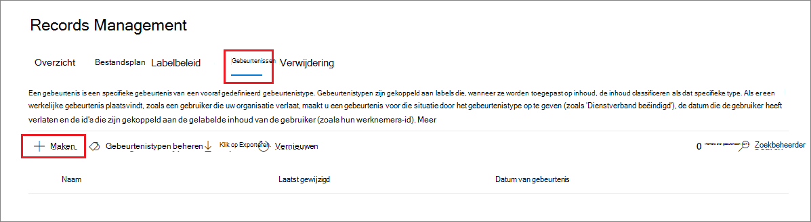
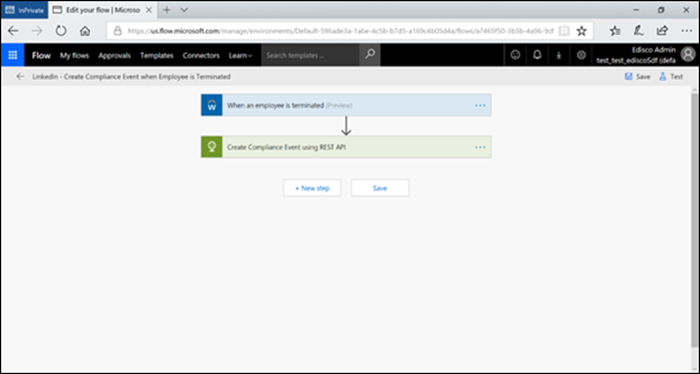

# <a name="start-retention-when-an-event-occurs"></a>Retentie starten als zich een gebeurtenis voordoet

>*[Richtlijnen voor Microsoft 365-licenties voor beveiliging en compliance](/office365/servicedescriptions/microsoft-365-service-descriptions/microsoft-365-tenantlevel-services-licensing-guidance/microsoft-365-security-compliance-licensing-guidance).*

Wanneer u inhoud behoudt, is de retentieperiode vaak gebaseerd op de leeftijd van de inhoud. U kunt bijvoorbeeld documenten nog zeven jaar bewaren nadat ze zijn gemaakt en ze vervolgens verwijderen. Maar wanneer u [retentielabels](retention.md#retention-labels) configureert, kunt u een retentieperiode ook baseren op wanneer een specifiek type gebeurtenis plaatsvindt. De gebeurtenis activeert het begin van de retentieperiode. Voor alle inhoud met een retentielabel dat op dat type gebeurtenis is toegepast, worden de bewaaracties van het label afgedwongen.
  
Voorbeelden voor het gebruik van retentiebeleid op basis van gebeurtenissen:
  
- **Werknemers die de organisatie verlaten** Stel dat werknemersrecords tien jaar moeten worden bewaard vanaf het moment dat een werknemer de organisatie verlaat. Na 10 jaar moeten alle documenten die betrekking hebben op de benoeming, de prestaties en het beëindigen van het dienstverband voor die werknemer worden verwijderd. De gebeurtenis die de bewaarperiode van tien jaar activeert, is het vertrek van de werknemer. 
    
- **Beëindiging van het contract** Stel dat alle records die betrekking hebben op contracten vijf jaar moeten worden bewaard vanaf het moment dat het contract afloopt. De gebeurtenis die de retentieperiode van vijf jaar activeert, is het einde van het contract. 
    
- **Levensduur van product** Uw organisatie heeft mogelijk bewaarvereisten met betrekking tot de laatste productiedatum van producten voor bijvoorbeeld technische specificaties. In dit geval is de laatste productiedatum de gebeurtenis die de bewaarperiode activeert. 
    
Retentie op basis van gebeurtenissen wordt doorgaans gebruikt als onderdeel van een recordbeheerproces. Dit betekent dat:
  
- Retentielabels op basis van gebeurtenissen markeren items meestal ook als een record als onderdeel van een oplossing voor recordbeheer. Zie [Meer informatie over recordbeheer](records-management.md) voor meer informatie.

- Een document dat als record is gedeclareerd, maar waarvan de gebeurtenis nog niet heeft plaatsgevonden, wordt voor onbepaalde tijd bewaard (records kunnen niet permanent worden verwijderd) totdat de retentieperiode van dat document wordt veroorzaakt door een gebeurtenis.
    
- Retentielabels op basis van gebeurtenissen zorgen er meestal voor dat aan het einde van de bewaarperiode een beoordeling voor verwijdering wordt geactiveerd, zodat een recordbeheerder de inhoud handmatig kan controleren en verwijderen. Zie [Verwijdering van inhoud](disposition.md) voor meer informatie.
    

Een retentielabel op basis van een gebeurtenis heeft dezelfde mogelijkheden als elk retentielabel in Microsoft 365. Zie [Meer informatie over retentiebeleid en retentielabels](retention.md) voor meer informatie.

## <a name="understanding-the-relationship-between-event-types-labels-events-and-asset-ids"></a>De relatie tussen gebeurtenistypen, labels, gebeurtenissen en asset-id’s begrijpen

Om met succes retentie op basis van gebeurtenissen te gebruiken, is het belangrijk dat u de relatie begrijpt tussen gebeurtenistypen, retentielabels, gebeurtenissen en asset-id’s, zoals weergegeven in de diagrammen en de uitleg die volgt: 
  

  

  
1. U maakt retentielabels voor verschillende typen inhoud en koppelt deze vervolgens aan een type gebeurtenis. Retentielabels voor verschillende typen productbestanden en -records zijn bijvoorbeeld gekoppeld aan een gebeurtenistype met de naam Productlevensduur, omdat deze records tien jaar moeten worden bewaard vanaf het moment dat het product het einde van de levensduur bereikt.
    
2. Gebruikers (meestal recordbeheerders) passen deze labels toe op inhoud en (voor documenten in SharePoint en OneDrive) voeren een asset-id in voor elk item. In dit voorbeeld is de asset-id een productnaam of code die door de organisatie wordt gebruikt. Vervolgens wordt aan de records van elk product een retentielabel toegewezen. Ook heeft elke record een eigenschap die een asset-id bevat. Het diagram toont **alle inhoud** voor alle productrecords in een organisatie. Elk item bevat de asset-id van het product waarvan het record is. 
    
3. Productlevensduur is het gebeurtenistype; een bepaald product dat het einde van de levensduur bereikt vormt een gebeurtenis. Wanneer een gebeurtenis van dat type plaatsvindt (in dit geval het einde van de levensduur van een product) maakt u een gebeurtenis die het volgende opgeeft:
    
   - Een asset-id (voor SharePoint- en OneDrive-documenten)
    
   - Trefwoorden (voor Exchange-items). In dit voorbeeld gebruikt de organisatie een productcode in berichten met productrecords, zodat het trefwoord voor Exchange-items functioneel hetzelfde is als de asset-id voor SharePoint- en OneDrive-documenten.
    
   - De datum waarop de gebeurtenis heeft plaatsgevonden. Deze datum wordt gebruikt als het begin van de bewaarperiode. Deze datum kan de huidige datum of een datum in het verleden of de toekomst zijn.

4. Nadat u een gebeurtenis hebt gemaakt, wordt die datum van de gebeurtenis gesynchroniseerd met alle inhoud met een bewaarlabel van dat gebeurtenistype en die de opgegeven asset-id of het opgegeven trefwoord bevat. Net als bij elk retentielabel kan deze synchronisatie maximaal zeven dagen duren. Voor alle items die met rood zijn omcirkeld in het vorige diagram wordt de retentieperiode geactiveerd door deze gebeurtenis. Met andere woorden: wanneer het einde van de levensduur van dit product wordt bereikt, activeert die gebeurtenis de retentieperiode voor de records van dat product.

Het is belangrijk om te weten dat **alle inhoud** met een retentielabel van dat gebeurtenistype de retentieperiode heeft die door de gebeurtenis wordt geactiveerd als u geen asset-id of trefwoorden opgeeft voor een gebeurtenis. Dit betekent dat alle inhoud in het vorige diagram behouden zou blijven. Dit is mogelijk niet wat u wilt.

Denk er ten slotte aan dat elk retentielabel eigen bewaarinstellingen heeft. In dit voorbeeld zijn ze allemaal ingesteld op tien jaar, maar het is mogelijk dat een gebeurtenis retentielabels activeert wanneer elk label een andere bewaarperiode heeft.
  
## <a name="how-to-set-up-event-driven-retention"></a>Retentiebeleid op basis van een gebeurtenis instellen

Werkstroom op hoog niveau voor bewaren op basis van gebeurtenissen:
  

  
> [!TIP]
> Zie [Retentielabels gebruiken voor het beheren van de levenscyclus van documenten die zijn opgeslagen in SharePoint](auto-apply-retention-labels-scenario.md) voor een gedetailleerd scenario waarin beheerde eigenschappen in SharePoint worden gebruikt om automatisch retentielabels toe te passen en om retentie op basis van gebeurtenissen te implementeren.

### <a name="step-1-create-a-label-whose-retention-period-is-based-on-an-event"></a>Stap 1: maak een label waarvan de retentieperiode is gebaseerd op een gebeurtenis

Bekijk de instructies voor [Retentielabels maken](./create-apply-retention-labels.md#step-1-create-retention-labels) om uw retentielabel te maken en configureren. Maar specifiek voor retentie op basis van gebeurtenissen: selecteer op de pagina **Retentie-instellingen definiëren** in de wizard Retentielabel maken na **De retentieperiode starten op basis van** een van de standaardgebeurtenistypen in de vervolgkeuzelijst of maak zelf een gebeurtenistype door **Nieuw type gebeurtenis maken** te selecteren:


Een gebeurtenistype is gewoon een algemene beschrijving van een gebeurtenis die u wilt koppelen aan een retentielabel.

De standaardgebeurtenistypen hebben **(gebeurtenistype)** achter hun naam in de vervolgkeuzelijst, zodat u ze eenvoudiger kunt herkennen. U kunt ook gebeurtenistypen bekijken en maken op het tabblad **Recordbeheer** > **Gebeurtenissen** > **Gebeurtenistypen beheren**.

Voor het bewaren op basis van gebeurtenissen zijn bewaarinstellingen vereist die:
  
- De inhoud bewaren.
    
- De inhoud automatisch verwijderen of een beoordeling van het verwijderen activeren aan het einde van de bewaarperiode.
  
Retentiebeleid op basis van gebeurtenissen wordt meestal gebruikt voor inhoud die als record wordt gedeclareerd. Dit is dus een goed moment om te controleren of u ook de optie moet selecteren die inhoud markeert als een [record](records-management.md#records).

Ga verder met stap 3 als u een bestaand gebeurtenistype gebruikt en geen nieuw gebeurtenistype maakt.

> [!NOTE]
> Nadat u een gebeurtenistype hebt gekozen en het retentielabel opslaat, kan het type gebeurtenis niet worden gewijzigd.

### <a name="step-2-create-a-new-event-type-for-your-label"></a>Stap 2: maak een nieuw type gebeurtenis voor uw label

Als u voor de retentie-instellingen de optie **Nieuw gebeurtenistype maken** hebt geselecteerd, voert u naam en beschrijving voor het gebeurtenistype in. Selecteer vervolgens **Volgende**, **Verzenden** en **Gereed**.

Terug op de pagina **Instellingen voor retentie definiëren** kunt u voor **De retentieperiode starten op basis van** in het vervolgkeuzemenu het gebeurtenistype selecteren dat u hebt gemaakt.

  
### <a name="step-3-publish-or-auto-apply-the-event-based-retention-labels"></a>Stap 3: publiceer labels voor bewaarbeleid op basis van gebeurtenissen of pas deze automatisch toe

Net als elk retentielabel moet u een label op basis van gebeurtenissen publiceren of automatisch toepassen om dit handmatig of automatisch op inhoud toe te passen:
- [Retentielabels maken en deze toepassen in apps](create-apply-retention-labels.md)
- [Een retentielabel automatisch toepassen op inhoud](apply-retention-labels-automatically.md)

### <a name="step-4-enter-an-asset-id"></a>Stap 4: voer een asset-id in

Nadat een label op basis van een gebeurtenis op inhoud is toegepast, kunt u een asset-id voor elk item invoeren. Uw organisatie kan bijvoorbeeld het volgende gebruiken:
  
- Productcodes die u kunt gebruiken om alleen inhoud voor een specifiek product te bewaren.
    
- Projectcodes die u kunt gebruiken om alleen inhoud voor een specifiek project te bewaren.
    
- Werknemer-id’s die u kunt gebruiken om alleen inhoud voor een bepaalde persoon te bewaren.
    
Asset-id is gewoon een andere documenteigenschap die beschikbaar is in SharePoint en OneDrive. Uw organisatie gebruikt mogelijk al andere documenteigenschappen en -indelingen om inhoud te classificeren. Als dit het geval is, kunt u deze eigenschappen en waarden ook gebruiken wanneer u een gebeurtenis maakt. Zie stap 6 hierna. Het belangrijkste punt is dat u een of *eigenschap:waarde*-combinatie in de documenteigenschappen moet gebruiken om dat item te koppelen aan een gebeurtenistype.
  

  
### <a name="step-5-create-an-event"></a>Stap 5: een gebeurtenis maken

Wanneer een bepaald exemplaar van dat type gebeurtenis plaatsvindt, zoals het einde van de levensduur van een product, gaat u naar de pagina **Recordbeheer** > **Gebeurtenissen** in het Microsoft 365-compliancecentrum en selecteert u **+ Maken** om een gebeurtenis te maken. U activeert de gebeurtenis door deze hier te maken.



Er worden maximaal een miljoen gebeurtenissen per tenant ondersteund.

### <a name="step-6-choose-the-same-event-type-used-by-the-label-in-step-2"></a>Stap 6: kies het type gebeurtenis dat door het label wordt gebruikt in stap 2

Wanneer u de gebeurtenis maakt, kiest u hetzelfde gebeurtenistype dat is opgegeven in de instellingen voor het retentielabel in stap 2. Als u bijvoorbeeld **Productlevensduur** als uw gebeurtenistype voor de labelinstellingen hebt geselecteerd, selecteert u **Productlevensduur** wanneer u de gebeurtenis maakt. De retentieperiode wordt alleen geactiveerd voor inhoud met retentielabels voor dit type gebeurtenis.


Selecteer de optie **Bestaande labels kiezen** als u een gebeurtenis wilt maken voor meerdere bewaarlabels met verschillende typen gebeurtenissen. Selecteer vervolgens de labels die zijn geconfigureerd voor de gebeurtenistypen die u aan deze gebeurtenis wilt koppelen.

### <a name="step-7-enter-keywords-or-query-for-exchange-asset-id-for-sharepoint-and-onedrive"></a>Stap 7: voer trefwoorden of query's in voor Exchange, asset-id voor SharePoint en OneDrive

Nu beperkt u het bereik van de inhoud. Voor Exchange-inhoud doet u dit door trefwoorden of een query op te geven. Voor SharePoint- en OneDrive-inhoud doet u dit door asset-id's op te geven.

Gebruik voor Exchange-items trefwoorden of een query die gebruikmaakt van Keyword Query Language (KQL). Zie [Naslaginformatie over de syntaxis van KQL (Keyword Query Language)](/sharepoint/dev/general-development/keyword-query-language-kql-syntax-reference) voor meer informatie over de syntaxis van de query. Zie [Trefwoordquery's en zoekvoorwaarden voor Inhoud zoeken](keyword-queries-and-search-conditions.md)voor meer informatie over de doorzoekbare eigenschappen die u voor Exchange kunt gebruiken.

Retentie van asset-id’s wordt alleen afgedwongen voor inhoud met de opgegeven *eigenschap:waarde*-combinatie. Als u bijvoorbeeld de eigenschap activa-id gebruikt, typt u `ComplianceAssetID:<value>` in het vak voor activa-id's die in de volgende afbeelding worden weergegeven.

Als u geen asset-id hebt ingevoerd, wordt op alle inhoud met labels van dat gebeurtenistype dezelfde bewaardatum toegepast.

Uw organisatie heeft mogelijk andere eigenschappen en id’s toegepast op de documenten die zijn gerelateerd aan dit gebeurtenistype. Als u bijvoorbeeld de records van een specifiek product moet detecteren, kan de id een combinatie zijn van uw aangepaste eigenschap ProductID en de waarde 'XYZ'. In dit geval voert u `ProductID:XYZ` in het vak voor asset-id's (zie de volgende afbeelding).

Kies ten slotte de datum waarop de gebeurtenis heeft plaatsgevonden; deze datum wordt gebruikt als het begin van de retentieperiode. Nadat u een gebeurtenis hebt gemaakt, wordt die datum gesynchroniseerd met alle inhoud met een retentielabel van dat gebeurtenistype, die asset-id en die trefwoorden. Net als bij elk retentielabel kan deze synchronisatie maximaal zeven dagen duren.
  


Nadat u een gebeurtenis hebt gemaakt, worden de bewaarinstellingen van kracht voor de inhoud die al is gelabeld en geïndexeerd. Als het retentielabel aan nieuwe inhoud wordt toegevoegd nadat de gebeurtenis is gemaakt, moet u een nieuwe gebeurtenis met dezelfde details maken.

Als u een gebeurtenis verwijdert, betekent dit niet dat de bewaarinstellingen worden geannuleerd die nu van kracht zijn voor de inhoud die al een label heeft. Maak een nieuwe gebeurtenis met dezelfde details, maar laat de datum leeg, als u dat wél wilt doen. 

## <a name="use-content-search-to-find-all-content-with-a-specific-label-or-asset-id"></a>Inhoud zoeken gebruiken om alle inhoud met een specifiek label of specifieke activa-id te zoeken

Nadat retentielabels aan inhoud zijn toegewezen, kunt u Inhoud zoeken gebruiken om alle inhoud te zoeken die wordt geclassificeerd met een specifiek retentielabel of die een specifieke activa-id bevat:
  
- Kies de voorwaarde **Retentielabel**, voer de volledige labelnaam of een deel van de labelnaam in en gebruik een jokerteken als u alle inhoud met een specifiek retentielabel wilt zoeken. 
    
- Voer de eigenschap **ComplianceAssetID** en een waarde in, met de indeling `ComplianceAssetID:<value>` als u alle inhoud met een specifieke activa-id wilt zoeken. 
    
Zie [Trefwoordquery's en zoekvoorwaarden voor Inhoud zoeken](keyword-queries-and-search-conditions.md) voor meer informatie.

## <a name="automate-events-by-using-powershell"></a>Gebeurtenissen automatiseren met behulp van PowerShell

U kunt een PowerShell-script gebruiken om het bewaren op basis van gebeurtenissen vanuit uw zakelijke toepassingen te automatiseren. De volgende PowerShell-cmdlets zijn beschikbaar voor bewaren op basis van gebeurtenissen:
  
- [Get-ComplianceRetentionEventType](/powershell/module/exchange/get-complianceretentioneventtype)
    
- [New-ComplianceRetentionEventType](/powershell/module/exchange/new-complianceretentioneventtype)
    
- [Remove-ComplianceRetentionEventType](/powershell/module/exchange/remove-complianceretentioneventtype)
    
- [Set-ComplianceRetentionEventType](/powershell/module/exchange/set-complianceretentioneventtype)
    
- [Get-ComplianceRetentionEvent](/powershell/module/exchange/get-complianceretentionevent)
    
- [Get-ComplianceRetentionEvent](/powershell/module/exchange/new-complianceretentionevent)
    

## <a name="automate-events-by-using-a-rest-api"></a>Gebeurtenissen automatiseren met behulp van een REST-API

U kunt een REST-API gebruiken om automatisch de gebeurtenissen te maken die het begin van de retentietijd activeren.

Een REST-API is een service-eindpunt dat sets met HTTP-bewerkingen (methoden) ondersteunt die toegang bieden voor het maken/ophalen/bijwerken/verwijderen van de bronnen van de service. Zie [Onderdelen van een REST-API-aanvraag/-reactie](/rest/api/gettingstarted/#components-of-a-rest-api-requestresponse) voor meer informatie. Met de REST-API van Microsoft 365 kunnen gebeurtenissen worden gemaakt en opgehaald met behulp van de POST- en GET-methoden.

Er zijn twee opties voor het gebruik van de REST-API:

- **Met Microsoft Power Automate of een soortgelijke toepassing** om een gebeurtenis automatisch te laten plaatsvinden. Microsoft Power Automate is een orchestrator die verbinding maakt met andere systemen, zodat u geen aangepaste oplossing hoeft te schrijven. Raadpleeg de [Power Automate-website](https://flow.microsoft.com/nl-NL/) voor meer informatie.

- **PowerShell of een HTTP-client om de REST-API aan te roepen** om gebeurtenissen te maken met behulp van PowerShell (versie 6 of hoger), die deel uitmaakt van een aangepaste oplossing.

Voordat u de REST-API gebruikt, moet u als globale beheerder de URL bevestigen die moet worden gebruikt voor de aanroep van de retentiegebeurtenis. Voer hiervoor een GET-aanroep voor een retentiegebeurtenis uit met behulp van de URL van de REST-API:

```http
https://ps.compliance.protection.outlook.com/psws/service.svc/ComplianceRetentionEvent
```

Controleer de reactiecode. Als dit 302 is, moet u de omgeleide URL op uit de eigenschap Locatie van de koptekst van de reactie halen en die URL gebruiken in plaats van `https://ps.compliance.protection.outlook.com/psws/service.svc/ComplianceRetentionEvent` in de volgende instructies.

De gebeurtenissen die automatisch worden gemaakt, kunnen worden bevestigd door ze te bekijken in het Microsoft 365-compliancecentrum > **Recordbeheer** >  **Gebeurtenissen**.

### <a name="use-microsoft-power-automate-to-create-the-event"></a>Microsoft Power Automate gebruiken om de gebeurtenis te maken

Maak een stroom die een gebeurtenis maakt met behulp van de REST-API van Microsoft 365:




#### <a name="create-an-event"></a>Een gebeurtenis maken

Voorbeeldcode voor het aanroepen van de REST-API:

- **Methode**: POST
- **URL**: `https://ps.compliance.protection.outlook.com/psws/service.svc/ComplianceRetentionEvent`
- **Kopteksten**: Sleutel = Content-Type, Waarde = application/atom+xml
- **Hoofdtekst**:

    ```xml
    <?xml version='1.0' encoding='utf-8' standalone='yes'?>
    
    <entry xmlns:d='http://schemas.microsoft.com/ado/2007/08/dataservices'
    
    xmlns:m='http://schemas.microsoft.com/ado/2007/08/dataservices/metadata'
    
    xmlns='http://www.w3.org/2005/Atom'>
    
    <category scheme='http://schemas.microsoft.com/ado/2007/08/dataservices/scheme' term='Exchange.ComplianceRetentionEvent' />
    
    <updated>9/9/2017 10:50:00 PM</updated>
    
    <content type='application/xml'>
    
    <m:properties>
    
    <d:Name>Employee Termination </d:Name>
    
    <d:EventType>99e0ae64-a4b8-40bb-82ed-645895610f56</d:EventType>
    
    <d:SharePointAssetIdQuery>1234</d:SharePointAssetIdQuery>
    
    <d:EventDateTime>2018-12-01T00:00:00Z </d:EventDateTime>
    
    </m:properties>
    
    </content>
    
    </entry>
    ```

- **Verificatie**: Basic
- **Gebruikersnaam**: 'Complianceuser'
- **Wachtwoord**: 'Compliancepassword'


##### <a name="available-parameters"></a>Beschikbare parameters


|Parameters|Omschrijving|Opmerkingen|
|--- |--- |--- |
|<d:Name></d:Name>|Geef een unieke naam op voor de gebeurtenis,|Kan geen volgspaties of de volgende tekens bevatten: % * \ & < \> \| # ? , : ;|
|<d:EventType></d:EventType>|Voer de naam (of Guid) van het gebeurtenistype in,|Voorbeeld: 'Ontslag van een werknemer'. Het type gebeurtenis moet zijn gekoppeld aan een retentielabel.|
|<d:SharePointAssetIdQuery></d:SharePointAssetIdQuery>|Voer 'ComplianceAssetId:' + werknemer-id in|Voorbeeld: 'ComplianceAssetId:12345'|
|<d:EventDateTime></d:EventDateTime>|Datum en tijd van gebeurtenis|Notatie: yyyy-MM-ddTHH:mm:ssZ, voorbeeld: 2018-12-01T00:00:00Z
|

###### <a name="response-codes"></a>Antwoordcodes

| Antwoordcode | Omschrijving       |
| ----------------- | --------------------- |
| 302               | Redirect              |
| 201               | Gemaakt               |
| 403               | Autorisatie mislukt  |
| 401               | Autorisatie mislukt |

##### <a name="get-events-based-on-a-time-range"></a>Gebeurtenissen ophalen op basis van een tijdsbereik

- **Methode**: GET

- **URL**: `https://ps.compliance.protection.outlook.com/psws/service.svc/ComplianceRetentionEvent?BeginDateTime=2019-01-11&EndDateTime=2019-01-16`

- **Kopteksten**: Sleutel = Content-Type, Waarde = application/atom+xml

- **Verificatie**: Basic

- **Gebruikersnaam**: 'Complianceuser'

- **Wachtwoord**: 'Compliancepassword'

###### <a name="response-codes"></a>Antwoordcodes

| Antwoordcode | Omschrijving                   |
| ----------------- | --------------------------------- |
| 200               | OK, een lijst met gebeurtenissen in atom+ xml |
| 404               | Niet gevonden                         |
| 302               | Redirect                          |
| 401               | Autorisatie mislukt              |
| 403               | Autorisatie mislukt             |

##### <a name="get-an-event-by-id"></a>Een gebeurtenis ophalen op basis van id

- **Methode**: GET

- **URL**: `https://ps.compliance.protection.outlook.com/psws/service.svc/ComplianceRetentionEvent('174e9a86-74ff-4450-8666-7c11f7730f66')`

- **Kopteksten**: Sleutel = Content-Type, Waarde = application/atom+xml

- **Verificatie**: Basic

- **Gebruikersnaam**: 'Complianceuser'

- **Wachtwoord**: 'Compliancepassword'

###### <a name="response-codes"></a>Antwoordcodes

| Antwoordcode | Omschrijving                                      |
| ----------------- | ---------------------------------------------------- |
| 200               | OK, de hoofdtekst van de reactie bevat de gebeurtenis in atom+xml |
| 404               | Niet gevonden                                            |
| 302               | Redirect                                             |
| 401               | Autorisatie mislukt                                 |
| 403               | Autorisatie mislukt                                |

##### <a name="get-an-event-by-name"></a>Een gebeurtenis ophalen op basis van de naam

- **Methode**: GET

- **URL**: `https://ps.compliance.protection.outlook.com/psws/service.svc/ComplianceRetentionEvent`

- **Kopteksten**: Sleutel = Content-Type, Waarde = application/atom+xml

- **Verificatie**: Basic

- **Gebruikersnaam**: 'Complianceuser'

- **Wachtwoord**: 'Compliancepassword'

###### <a name="response-codes"></a>Antwoordcodes

| Antwoordcode | Omschrijving                                      |
| ----------------- | ---------------------------------------------------- |
| 200               | OK, de hoofdtekst van de reactie bevat de gebeurtenis in atom+xml |
| 404               | Niet gevonden                                            |
| 302               | Redirect                                             |
| 401               | Autorisatie mislukt                                 |
| 403               | Autorisatie mislukt                                |

### <a name="use-powershell-or-any-http-client-to-create-the-event"></a>PowerShell of een HTTP-client gebruiken om de gebeurtenis te maken

U moet minimaal PowerShell-versie 6 gebruiken.

Voer in een PowerShell-sessie het volgende script uit :

```powershell
param([string]$baseUri)

$userName = "UserName"

$password = "Password"

$securePassword = ConvertTo-SecureString $password -AsPlainText -Force

$credentials = New-Object System.Management.Automation.PSCredential($userName, $securePassword)

$EventName="EventByRESTPost-$(([Guid]::NewGuid()).ToString('N'))"

Write-Host "Start to create an event with name: $EventName"

$body = "<?xml version='1.0' encoding='utf-8' standalone='yes'?>

<entry xmlns:d='http://schemas.microsoft.com/ado/2007/08/dataservices'

xmlns:m='http://schemas.microsoft.com/ado/2007/08/dataservices/metadata'

xmlns='http://www.w3.org/2005/Atom'>

<category scheme='http://schemas.microsoft.com/ado/2007/08/dataservices/scheme' term='Exchange.ComplianceRetentionEvent' />

<updated>7/14/2017 2:03:36 PM</updated>

<content type='application/xml'>

<m:properties>

<d:Name>$EventName</d:Name>

<d:EventType>e823b782-9a07-4e30-8091-034fc01f9347</d:EventType>

<d:SharePointAssetIdQuery>'ComplianceAssetId:123'</d:SharePointAssetIdQuery>

</m:properties>

</content>

</entry>"

$event = $null

try

{

$event = Invoke-RestMethod -Body $body -Method 'POST' -Uri "$baseUri/ComplianceRetentionEvent" -ContentType "application/atom+xml" -Authentication Basic -Credential $credentials -MaximumRedirection 0

}

catch

{

$response = $_.Exception.Response

if($response.StatusCode -eq "Redirect")

{

$url = $response.Headers.Location

Write-Host "redirected to $url"

$event = Invoke-RestMethod -Body $body -Method 'POST' -Uri $url -ContentType "application/atom+xml" -Authentication Basic -Credential $credentials -MaximumRedirection 0

}

}

$event | fl *
```
