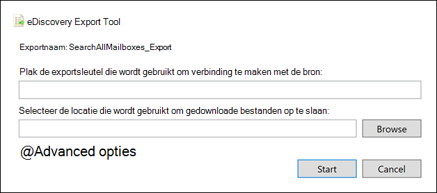

# Een inhoudszoekrapport exporterenExport a Content search report

In plaats van de volledige reeks zoekresultaten te exporteren uit een inhoudszoekactie in het Microsoft 365 compliancecentrum (of uit een zoekopdracht die is gekoppeld aan een Core eDiscovery-zaak), kunt u dezelfde rapporten exporteren die worden gegenereerd wanneer u de werkelijke zoekresultaten exporteert.Instead of exporting the full set of search results from a Content search in the Microsoft 365 compliance Center (or from a search that's associated with a Core eDiscovery case), you can export the same reports that are generated when you export the actual search results.
  
Wanneer u een rapport exporteert, worden de rapportbestanden gedownload naar een map op uw lokale computer die dezelfde naam heeft als het zoeken naar inhoud, maar die wordt toegevoegd met *_ReportsOnly.*When you export a report, the report files are downloaded to a folder on your local computer that has the same name as the Content Search, but that's appended with *_ReportsOnly*. Als het zoeken naar inhoud bijvoorbeeld de naam *ContosoCase0815* heeft, wordt het rapport gedownload naar een map *met de naam ContosoCase0815_ReportsOnly.*For example, if the Content Search is named  *ContosoCase0815*, then the report is downloaded to a folder named *ContosoCase0815_ReportsOnly*. Zie Wat is opgenomen in het rapport voor een lijst met documenten die in het rapport [zijn opgenomen.](#whats-included-in-the-report)For a list of documents that are included in the report, see [What's included in the report](#whats-included-in-the-report).

## Voordat u een zoekrapport exporteertBefore you export a search report

- Als u een zoekrapport wilt exporteren, moet u de rol compliancezoekbeheer toegewezen krijgen in & Compliancecentrum.To export a search report, you have to be assigned the Compliance Search management role in Security & Compliance Center. Deze rol wordt standaard toegewezen aan de ingebouwde rollengroepen eDiscovery Manager en Organisatiebeheer.This role is assigned by default to the built-in eDiscovery Manager and Organization Management role groups. Zie [eDiscovery-machtigingen toewijzen](assign-ediscovery-permissions.md) voor meer informatie.For more information, see [Assign eDiscovery permissions](assign-ediscovery-permissions.md).

- Wanneer u een rapport exporteert, worden de gegevens tijdelijk opgeslagen op Azure Storage locatie in de Microsoft-cloud voordat deze worden gedownload naar uw lokale computer.When you export a report, the data is temporarily stored in an Azure Storage location in the Microsoft cloud before it's downloaded to your local computer. Zorg ervoor dat uw organisatie verbinding kan maken met het eindpunt in Azure, dat **\* .blob.core.windows.net** is (het jokerteken vertegenwoordigt een unieke id voor uw export).Be sure that your organization can connect to the endpoint in Azure, which is **\*.blob.core.windows.net** (the wildcard represents a unique identifier for your export). De zoekresultaten worden twee weken na het maken Azure Storage van de locatie verwijderd.The search results data is deleted from the Azure Storage location two weeks after it's created.

- De computer die u gebruikt om de zoekresultaten te exporteren, moet voldoen aan de volgende systeemvereisten:The computer you use to export the search results has to meet the following system requirements:

  - Nieuwste versie van Windows (32-bits of 64-bits)Latest version of Windows (32-bit or 64-bit)

  - Microsoft .NET Framework 4.7Microsoft .NET Framework 4.7

- U moet een van de volgende ondersteunde browsers gebruiken om het eDiscovery Export Tool 1 uit tevoeren:You have to use one of the following supported browsers to run the eDiscovery Export Tool1:

  - Microsoft Edge 2Microsoft Edge 2

    OFOR

  - Microsoft Internet Explorer 10 en nieuwere versiesMicrosoft Internet Explorer 10 and later versions

  > [!NOTE]
  > 1 Microsoft produceert geen extensies of invoegtoepassingen van derden voor ClickOnce toepassingen.1 Microsoft doesn't manufacture third-party extensions or add-ons for ClickOnce applications. Het exporteren van zoekresultaten met een niet-ondersteunde browser met extensies of invoegtoepassingen van derden wordt niet ondersteund.Exporting search results using an unsupported browser with third-party extensions or add-ons isn't supported. 
  > 2 Als gevolg van recente wijzigingen in Microsoft Edge is ClickOnce standaard niet meer ingeschakeld.2 As a result of recent changes to Microsoft Edge, ClickOnce support is no longer enabled by default. Zie Het [eDiscovery-exporthulpmiddel](configure-edge-to-export-search-results.md)gebruiken in Microsoft Edge voor instructies over het inschakelen van ClickOnce ondersteuning in Edge.For instructions on enabling ClickOnce support in Edge, see [Use the eDiscovery Export Tool in Microsoft Edge](configure-edge-to-export-search-results.md).

- Als de geschatte totale grootte van de resultaten die door zoeken worden geretourneerd groter is dan 2 TB, mislukt het exporteren van de rapporten.If the estimated total size of the results returned by search exceeds 2 TB, exporting the reports fails. Als u de rapporten wilt exporteren, probeert u het bereik te beperken en de zoekopdracht opnieuw uit te voeren, zodat de geschatte grootte van de resultaten kleiner is dan 2 TB.To successfully export the reports, try to narrow the scope and rerun the search so the estimated size of the results is less than 2 TB.

- Als de resultaten van een zoekopdracht ouder zijn dan 7 dagen en u een exportrapportfunctie indient, wordt er een foutbericht weergegeven waarin u wordt gevraagd de zoekopdracht opnieuw uit te voeren om de zoekresultaten bij te werken.If the results of a search are older than 7 days and you submit an export report job, an error message is displayed prompting you to rerun the search to update the search results. Als dit gebeurt, annuleert u de export, heruitvoert u de zoekopdracht en start u de export opnieuw.If this happens, cancel the export, rerun the search, and then start the export again.

- Het exporteren van zoekrapporten telt mee voor het maximum aantal exporten dat tegelijkertijd wordt uitgevoerd en het maximum aantal exporten dat één gebruiker kan uitvoeren.Exporting search reports counts against the maximum number of exports running at the same time and the maximum number of exports that a single user can run. Zie Zoekresultaten voor inhoud exporteren voor meer informatie over [exportlimieten.](export-search-results.md#export-limits)For more information about export limits, see [Export Content search results](export-search-results.md#export-limits).
  
## Stap 1: Het rapport genereren voor exportStep 1: Generate the report for export

De eerste stap is het voorbereiden van het rapport voor het downloaden naar uw computer exporteren.The first step is to prepare the report for downloading to your computer exporting. Wanneer u het rapport exporteert, worden de rapportdocumenten geüpload naar een Azure Storage in de Microsoft-cloud.When you export the report, the report documents are uploaded to an Azure Storage area in the Microsoft cloud.
  
1. Selecteer in Microsoft 365 compliancecentrum de inhoudszoekactie waaruit u het rapport wilt exporteren.In the Microsoft 365 compliance center, select the Content search that you want to export the report from.
  
2. Klik in **het** menu Acties onder aan de flyoutpagina van de zoekactie op **Rapport exporteren.**On the **Actions** menu at the bottom of the search flyout page, click **Export report**.

   

   De **flyoutpagina** Rapport exporteren wordt weergegeven.The **Export report** flyout page is displayed. De exportrapportopties die beschikbaar zijn om informatie over de zoekopdracht te exporteren, zijn afhankelijk van of zoekresultaten zich in postvakken of sites bevinden of een combinatie van beide.The export report options available to export information about the search depend on whether search results are located in mailboxes or sites or a combination of both.
  
3. Kies **onder Uitvoeropties** een van de volgende opties:Under **Output options**, choose one of the following options:
  
   

    - Alle items, met uitzondering van items met een niet-herkende notatie, worden versleuteld of zijn om andere redenen **niet geïndexeerd.****All items, excluding ones that have unrecognized format, are encrypted, or weren't indexed for other reasons**. Deze optie exporteert alleen informatie over geïndexeerde items.This option only exports information about indexed items.
  
    - Alle items, inclusief items met een niet-herkende notatie, worden versleuteld of zijn om andere redenen **niet geïndexeerd.****All items, including ones that have unrecognized format, are encrypted, or weren't indexed for other reasons**. Met deze optie exporteert u informatie over geïndexeerde en niet-geïndexeerde items.This option exports information about indexed and unindexed items.
  
    - **Alleen items met een niet-herkende notatie,** worden versleuteld of om andere redenen niet geïndexeerd.**Only items that have an unrecognized format, are encrypted, or weren't indexed for other reasons**. Met deze optie wordt alleen informatie over niet-geïndexeerde items geexporteerd.This option only exports information about unindexed items.

4. Configureer **de optie Deplicatie inschakelen voor Exchange inhoud.**Configure the **Enable de-duplication for Exchange content** option.
  
   - Als u deze optie selecteert, wordt het aantal dubbele berichten (vóór de duplicatie en na de duplicatie) opgenomen in het overzichtsrapport exporteren.If you select this option, the count of duplicate messages (before de-duplication and after de-duplication) is included in the export summary report. Er wordt ook slechts één kopie van een bericht opgenomen in het manifest.xml bestand.Also, only one copy of a message will be included in the manifest.xml file. Het rapport Exportresultaten bevat echter een rij voor elke kopie van een duplicaatbericht, zodat u de postvakken kunt identificeren die een kopie van het dubbele bericht bevatten.But the export results report will contain a row for every copy of a duplicate message so that you can identify the mailboxes that contain a copy of the duplicate message. Zie Wat is opgenomen in het rapport voor meer informatie over [de geëxporteerde rapporten.](#whats-included-in-the-report)For more information about the exported reports, see [What's included in the report](#whats-included-in-the-report).

   - Als u deze optie niet selecteert, bevatten de exportrapporten informatie over alle berichten die door de zoekopdracht worden geretourneerd, inclusief duplicaten.If you don't select this option, the export reports will contain information about all messages returned by the search, including duplicates.

     Zie [De-duplicatie in eDiscovery-zoekresultaten](de-duplication-in-ediscovery-search-results.md)voor meer informatie over de-duplicatie en hoe dubbele items worden geïdentificeerd.For more information about de-duplication and how duplicate items are identified, see [De-duplication in eDiscovery search results](de-duplication-in-ediscovery-search-results.md).

5. Klik **op Rapport genereren.**Click **Generate report**.

   De zoekrapporten zijn voorbereid voor het downloaden, wat betekent dat de rapportdocumenten worden geüpload naar een Azure Storage locatie in de Microsoft-cloud.The search reports are prepared for downloading, which means the report documents are uploaded to an Azure Storage location in the Microsoft cloud. Dit kan enkele minuten duren.This may take several minutes.

Zie de volgende sectie voor instructies voor het downloaden van de geëxporteerde zoekrapporten.See the next section for instructions to download the exported search reports.
  
## Stap 2: Het rapport downloadenStep 2: Download the report

De volgende stap is het downloaden van het rapport van het Azure Storage naar uw lokale computer.The next step is to download the report from the Azure Storage area to your local computer.

1. Selecteer op **de pagina Inhoud** zoeken in het Microsoft 365 compliancecentrum het tabblad **Exporten**On the **Content search** page in the Microsoft 365 compliance center, select the **Exports** tab
  
   Mogelijk moet u op Vernieuwen klikken **om** de lijst met exporttaken bij te werken, zodat de exporttaken worden weergegeven die u hebt gemaakt.You may have to click **Refresh** to update the list of export jobs so that it shows the export job you created. Rapporttaken exporteren hebben dezelfde naam als de bijbehorende zoekopdracht **_ReportsOnly** toegevoegd aan de zoeknaam.Export report jobs have the same name as the corresponding search with **_ReportsOnly** appended to the search name.
  
2. Selecteer de exportklus die u hebt gemaakt in stap 1.Select the export job that you created in Step 1.

3. Klik op **de flyoutpagina** Rapport exporteren onder **Exportcode** op **Kopiëren naar klembord.**On the **Export report** flyout page under **Export key**, click **Copy to clipboard**. U gebruikt deze sleutel in stap 6 om de zoekresultaten te downloaden.You use this key in step 6 to download the search results.
  
   > [!IMPORTANT]
   > Omdat iedereen het hulpprogramma eDiscovery Export kan installeren en starten en vervolgens deze sleutel kan gebruiken om het zoekrapport te downloaden, moet u voorzorgsmaatregelen nemen om deze sleutel te beveiligen, net zoals u wachtwoorden of andere beveiligingsgerelateerde informatie zou beveiligen.Because anyone can install and start the eDiscovery Export tool, and then use this key to download the search report, be sure to take precautions to protect this key just like you would protect passwords or other security-related information.

4. Klik boven aan de flyoutpagina op **Resultaten downloaden.**At the top of the flyout page, click **Download results**.

5. Als u wordt gevraagd het **eDiscovery-exportprogramma te installeren,** klikt u op **Installeren.**If you're prompted to install the **eDiscovery Export Tool**, click **Install**.

6. Ga als volgt te werk in het **eDiscovery-exporthulpmiddel:**In the **eDiscovery Export Tool**, do the following:

   

   1. Plak de exportcode die u hebt gekopieerd in stap 3 in het juiste vak.Paste the export key that you copied in step 3 in the appropriate box.
  
   2. Klik **op Bladeren** om de locatie op te geven waar u de zoekrapportbestanden wilt downloaden.Click **Browse** to specify the location where you want to download the search report files.

7. Klik **op Start** om de zoekresultaten naar uw computer te downloaden.Click **Start** to download the search results to your computer.
  
    Het **eDiscovery-exporthulpmiddel** geeft statusgegevens weer over het exportproces, inclusief een schatting van het aantal (en de grootte) van de resterende items die moeten worden gedownload.The **eDiscovery Export Tool** displays status information about the export process, including an estimate of the number (and size) of the remaining items to be downloaded. Wanneer het exportproces is voltooid, hebt u toegang tot de bestanden op de locatie waar ze zijn gedownload.When the export process is complete, you can access the files in the location where they were downloaded.
  
## Wat is opgenomen in het rapportWhat's included in the report

Wanneer u een rapport genereert en exporteert over de resultaten van een zoekopdracht naar inhoud, worden de volgende documenten gedownload:When you generate and export a report about the results of a Content search, the following documents are downloaded:
  
- **Exportoverzicht:** Een Excel document met een overzicht van de export.**Export summary:** An Excel document that contains a summary of the export. Dit omvat informatie, zoals het aantal inhoudsbronnen dat is doorzocht, het aantal zoekresultaten van elke inhoudslocatie, het geschatte aantal items, het werkelijke aantal items dat zou worden geëxporteerd en de geschatte en werkelijke grootte van items die zouden worden geëxporteerd.This includes information such as the number of content sources that were searched, the number of search results from each content location, the estimated number of items, the actual number of items that would be exported, and the estimated and actual size of items that would be exported.

   Als u niet-geïndexeerde items opgeeft bij het exporteren van het rapport, wordt het aantal niet-geïndexeerde items opgenomen in het totale aantal geschatte zoekresultaten en in het totale aantal gedownloade zoekresultaten (als u de zoekresultaten wilt exporteren) die worden weergegeven in het overzichtsrapport exporteren.If you include unindexed items when exporting the report, the number of unindexed items are included in the total number of estimated search results and in the total number of downloaded search results (if you were to export the search results) that are listed in the export summary report. Met andere woorden, het totale aantal items dat wordt gedownload, is gelijk aan het totale aantal geschatte resultaten en het totale aantal niet-geïndexeerde items.In other words, the total number of items that would be downloaded is equal to the total number of estimated results and the total number of unindexed items.
  
- **Manifest:** Een manifestbestand (in XML-indeling) dat informatie bevat over elk item dat in de zoekresultaten wordt opgenomen.**Manifest:** A manifest file (in XML format) that contains information about each item included in the search results. Als u de optie de-duplicatie hebt ingeschakeld, worden dubbele berichten niet opgenomen in het manifestbestand.If you enabled the de-duplication option, duplicate message are not included in the manifest file.

- **Resultaten:** Een Excel document met een rij met informatie over elk geïndexeerd item dat met de zoekresultaten zou worden geëxporteerd.**Results:** An Excel document that contains a row with information about each indexed item that would be exported with the search results. Voor e-mail bevat het resultatenlogboek informatie over elk bericht, waaronder:For email, the result log contains information about each message, including: 

  - De locatie van het bericht in het bronpostvak (inclusief of het bericht zich in het primaire of archiefpostvak bevindt).The location of the message in the source mailbox (including whether the message is in the primary or archive mailbox).

  - De datum waarop het bericht is verzonden of ontvangen.The date the message was sent or received.

  - De onderwerpregel van het bericht.The Subject line from the message.

  - De afzender en geadresseerden van het bericht.The sender and recipients of the message.

  Voor documenten van SharePoint en OneDrive voor Bedrijven sites bevat het resultatenlogboek informatie over elk document, waaronder:For documents from SharePoint and OneDrive for Business sites, the results log contains information about each document, including:

  - De URL voor het document.The URL for the document.

  - De URL voor de siteverzameling waar het document zich bevindt.The URL for the site collection where the document is located.

  - De datum waarop het document voor het laatst is gewijzigd.The date that the document was last modified.

  - De naam van het document (dat zich in de kolom Onderwerp in het resultatenlogboek bevindt).The name of the document (which is located in the Subject column in the result log).

  > [!NOTE]
  > Het aantal rijen  in het rapport Resultaten moet gelijk zijn aan het totale aantal zoekresultaten minus het totale aantal items dat wordt weergegeven in het rapport **Niet-geïndexeerde** items.The number of rows in the **Results** report should be equal to the total number of search results minus the total number of items listed in the **Unindexed Items** report.
  
- **Trace.log:** een tracelogboek dat gedetailleerde logboekgegevens over het exportproces bevat en u kunt helpen bij het opsporen van problemen tijdens het exporteren.**Trace.log**: A trace log that contains detailed logging information about the export process and can help uncover issues during export. Als u een ticket opent met Microsoft Support over een probleem met betrekking tot het exporteren van zoekrapporten, wordt u mogelijk gevraagd dit tracelogboek op te geven.If you open a ticket with Microsoft Support about an issue related to exporting search reports, you may be asked to provide this trace log.

- **Niet-geïndexeerde items:** Een Excel document met informatie over niet-geïndexeerde items in de zoekresultaten.**Unindexed items:** An Excel document that contains information about any unindexed items included in the search results. Als u geen niet-geïndexeerde items opgeeft wanneer u het rapport met zoekresultaten genereert, wordt dit rapport nog steeds gedownload, maar is het leeg.If you don't include unindexed items when you generate the search results report, this report will still be downloaded, but will be empty.
