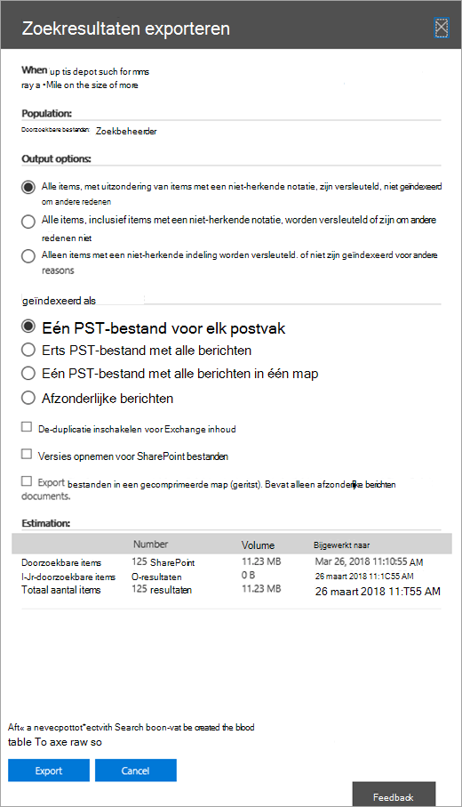
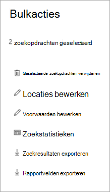

# Inhoud exporteren uit een hoofd-eDiscovery-zaakExport content from a Core eDiscovery case

Nadat een zoekopdracht is uitgevoerd, kunt u de zoekresultaten exporteren.After a search is successfully run, you can export the search results. Wanneer u zoekresultaten exporteert, worden postvakitems gedownload in PST-bestanden of als afzonderlijke berichten.When you export search results, mailbox items are downloaded in PST files or as individual messages. Wanneer u inhoud exporteert van SharePoint en OneDrive voor Bedrijven sites, worden kopieën van Office documenten en andere documenten geëxporteerd.When you export content from SharePoint and OneDrive for Business sites, copies of native Office documents and other documents are exported. Een Results.csv bestand met informatie over elk item dat wordt geëxporteerd en een manifestbestand (in XML-indeling) dat informatie bevat over elk zoekresultaat, wordt ook geëxporteerd.A Results.csv file that contains information about every item that's exported and a manifest file (in XML format) that contains information about every search result is also exported.
  
U kunt de resultaten exporteren van één zoekopdracht [die](#export-the-results-of-a-single-search) is gekoppeld aan een zaak of u kunt de resultaten exporteren van meerdere zoekopdrachten die aan [een zaak zijn gekoppeld.](#export-the-results-of-multiple-searches)You can export the results of a [single search associated with a case](#export-the-results-of-a-single-search) or you can export the results of [multiple searches associated with a case](#export-the-results-of-multiple-searches).
  
## De resultaten van één zoekopdracht exporterenExport the results of a single search

1. Ga naar en meld u aan met de referenties voor gebruikersaccount die zijn toegewezen aan de juiste [https://compliance.microsoft.com](https://compliance.microsoft.com) eDiscovery-machtigingen.Go to [https://compliance.microsoft.com](https://compliance.microsoft.com) and sign in using the credentials for user account that has been assigned the appropriate eDiscovery permissions.

2. Klik in het linkernavigatiedeelvenster van Microsoft 365 compliancecentrum op Alles weergeven **en** klik vervolgens op **eDiscovery > Core.**In the left navigation pane of the Microsoft 365 compliance center, click **Show all**, and then click **eDiscovery > Core**.

3. Selecteer op **de pagina Core eDiscovery** de zaak waaruit u zoekresultaten wilt exporteren en klik vervolgens op **Zaak openen.**On the **Core eDiscovery** page, select the case that you want to export search results from, and then click **Open case**.

4. Klik op **de startpagina** voor de zaak op **het tabblad** Zoekopdrachten.On the **Home** page for the case, click the **Searches** tab.

5. Klik in de lijst met zoekopdrachten naar de zaak op de zoekopdracht waaruit u zoekresultaten wilt exporteren en klik vervolgens op Resultaten exporteren **in** de flyout.In the list of searches for the case, click the search that you want to export search results from, and then click **Export results** on the flyout.

    De **pagina Resultaten exporteren** wordt weergegeven.The **Export results** page is displayed. 

    
  
    De werkstroom voor het exporteren van de resultaten van een zoekopdracht die is gekoppeld aan een Hoofd eDiscovery-zaak, is hetzelfde als het exporteren van de zoekresultaten voor een zoekopdracht op de pagina **Inhoud zoeken.**The workflow to export the results of a search associated with a Core eDiscovery case is that same as exporting the search results for a search on the **Content search** page. Zie Zoekresultaten voor inhoud exporteren voor [stapsgewijse instructies.](export-search-results.md)For step-by-step instructions, see [Export content search results](export-search-results.md).

    > [!NOTE]
    > Wanneer u zoekresultaten exporteert, kunt u de-duplicatie inschakelen, zodat slechts één kopie van een e-mailbericht wordt geëxporteerd, ook al zijn er mogelijk meerdere exemplaren van hetzelfde bericht gevonden in de postvakken die zijn doorzocht.When you export search results, you have the option to enable de-duplication so that only one copy of an email message is exported even though multiple instances of the same message might have been found in the mailboxes that were searched. Zie [De-duplicatie in eDiscovery-zoekresultaten](de-duplication-in-ediscovery-search-results.md)voor meer informatie over de-duplicatie en hoe dubbele items worden geïdentificeerd.For more information about de-duplication and how duplicate items are identified, see [De-duplication in eDiscovery search results](de-duplication-in-ediscovery-search-results.md).

    Nadat u de export hebt gestart, worden de zoekresultaten voorbereid voor het downloaden, wat betekent dat ze worden geüpload naar een microsoft-Azure Storage locatie in de Microsoft-cloud.After you start the export, the search results are prepared for downloading, which means they are uploaded to a Microsoft-provided Azure Storage location in the Microsoft cloud.
  
6. Klik op **het tabblad** Exporteren om de lijst met exporttaken voor de zaak weer te geven.Click the **Export** tab to display the list of export jobs for the case.
  
    Mogelijk moet u op Vernieuwen klikken **om** de lijst met exporttaken bij te werken, zodat de exporttaken worden weergegeven die u hebt gemaakt.You may have to click **Refresh** to update the list of export jobs so that it shows the export job you created. Exporttaken hebben dezelfde naam als de bijbehorende zoekopdracht **met _Export** toegevoegd aan de zoeknaam.Export jobs have the same name as the corresponding search with **_Export** appended to the search name.

7. Klik op de exportklus die u hebt gemaakt om statusgegevens weer te geven op de flyoutpagina.Click the export job you created to display status information on the flyout page. Deze informatie bevat het percentage items dat is overgebracht naar de Azure Storage locatie.This information includes the percentage of items that have been transferred to the Azure Storage location.

8. Nadat alle items zijn overgedragen, klikt u op **Resultaten downloaden** om de zoekresultaten naar uw lokale computer te downloaden.After all items have been transferred, click **Download results** to download the search results to your local computer. Zie Stap 2 in Zoekresultaten exporteren voor meer informatie over het downloaden [van zoekresultaten.](export-search-results.md#step-2-download-the-search-results)For more information downloading search results, see Step 2 in [Export content search results](export-search-results.md#step-2-download-the-search-results)

## De resultaten van meerdere zoekopdrachten exporterenExport the results of multiple searches

Als alternatief voor het exporteren van de resultaten van één zoekopdracht die aan een zaak is gekoppeld, kunt u de resultaten van meerdere zoekopdrachten exporteren vanuit hetzelfde geval in één exportklus.As an alternative to exporting the results of a single search associated with a case, you can export the results of multiple searches from the same case in a single export job. Het exporteren van de resultaten van meerdere zoekopdrachten gaat sneller en eenvoudiger dan het exporteren van de resultaten één zoekopdracht tegelijk.Exporting the results of multiple searches is faster and easier than exporting the results one search at a time.
  
> [!NOTE]
> U kunt de resultaten van meerdere zoekopdrachten niet exporteren als een van deze zoekopdrachten is geconfigureerd voor zoeklocaties in de wacht.You can't export the results of multiple searches if one of those searches was configured to search locations on hold.

1. Ga naar en meld u aan met de referenties voor gebruikersaccount die zijn toegewezen aan de juiste [https://compliance.microsoft.com](https://compliance.microsoft.com) eDiscovery-machtigingen.Go to [https://compliance.microsoft.com](https://compliance.microsoft.com) and sign in using the credentials for user account that has been assigned the appropriate eDiscovery permissions.

2. Klik in het linkernavigatiedeelvenster van Microsoft 365 compliancecentrum op Alles weergeven **en** klik vervolgens op **eDiscovery > Core.**In the left navigation pane of the Microsoft 365 compliance center, click **Show all**, and then click **eDiscovery > Core**.

3. Selecteer op **de pagina Core eDiscovery** de zaak waaruit u zoekresultaten wilt exporteren en klik vervolgens op **Zaak openen.**On the **Core eDiscovery** page, select the case that you want to export search results from, and then click **Open case**.

4. Klik op **de startpagina** voor de zaak op **het tabblad** Zoekopdrachten.On the **Home** page for the case, click the **Searches** tab.
    
5. Schakel in de lijst met zoekopdrachten naar de zaak het selectievakje in naast twee of meer zoekopdrachten waaruit u zoekresultaten wilt exporteren.In the list of searches for the case, select the checkbox next to two or more searches you want to export search results from. 

   De **flyoutpagina Bulkacties** wordt weergegeven.The **Bulk actions** flyout page appears. 

    
  
6. Klik **op Resultaten exporteren.**Click **Export results**.

   De **pagina Resultaten exporteren** wordt weergegeven.The **Export results** page is displayed. 

    
  
    Op dit moment is de werkstroom voor het exporteren van de resultaten van meerdere zoekopdrachten die zijn gekoppeld aan een Core eDiscovery-zaak hetzelfde als het exporteren van de zoekresultaten voor één zoekopdracht.At this point, the workflow to export the results of multiple searches associated with a Core eDiscovery case is that same as exporting the search results for a single search. Zie stap 5 in de vorige sectie.See step 5 in the previous section.

### Meer informatie over het exporteren van de resultaten van meerdere zoekopdrachtenMore information about exporting the results of multiple searches

- Wanneer u de resultaten van meerdere zoekopdrachten exporteert, worden de zoekquery's uit alle zoekopdrachten gecombineerd met **BEHULP** VAN OF-operatoren en wordt de gecombineerde zoekopdracht gestart.When you export the results of multiple searches, the search queries from all the searches are combined by using **OR** operators, and then the combined search is started. De geschatte resultaten van de gecombineerde zoekopdracht worden weergegeven op de flyoutpagina van de geselecteerde exportklus.The estimated results of the combined search are displayed in the flyout page of the selected export job. De zoekresultaten worden vervolgens gekopieerd naar de Azure Storage locatie in de Microsoft-cloud.The search results are then copied to the Azure Storage location in the Microsoft cloud. De status van de kopieerklus wordt ook weergegeven op de flyoutpagina.The status of the copy job is also displayed on the flyout page. Zoals eerder vermeld, kunt u de zoekresultaten downloaden naar een lokale computer nadat alle zoekresultaten zijn gekopieerd.As previously stated, after all the search results have been copied, you can download them to a local computer.

- Het maximum aantal trefwoorden uit query's voor alle zoekopdrachten die u wilt exporteren, is 500.The maximum number of keywords from queries for all searches that you want to export is 500. Dit is dezelfde limiet voor één zoekopdracht.This is the same limit for a single search. De exportfunctie combineert namelijk alle zoekquery's met behulp van de **operator OF.**That's because the export job combines all the search queries by using the **OR** operator. Als u deze limiet overschrijdt, wordt een fout geretourneerd.If you exceed this limit, an error will be returned. In dit geval moet u de resultaten exporteren uit minder zoekopdrachten of de zoekquery's vereenvoudigen van de oorspronkelijke zoekopdrachten die u wilt exporteren.In this case, you have to export the results from fewer searches or simplify the search queries of the original searches that you want to export.

- De zoekresultaten die worden geëxporteerd, worden ingedeeld op de inhoudslocatie waarin het item is gevonden.The search results that are exported are organized by the content location the item was found in. Dit betekent dat op een inhoudslocatie in de exportresultaten items kunnen worden geretourneerd door verschillende zoekopdrachten.That means a content location in the export results may have items returned by different searches. Als u bijvoorbeeld kiest voor het exporteren van e-mailberichten in één PST-bestand voor elk postvak, kan het PST-bestand resultaten hebben van meerdere zoekopdrachten.For example, if you choose to export email messages in one PST file for each mailbox, the PST file might have results from multiple searches.

- Als hetzelfde e-mailitem of hetzelfde document van dezelfde inhoudslocatie wordt geretourneerd door meer dan één van de zoekopdrachten die u exporteert, wordt slechts één kopie van het item geëxporteerd.If the same email item or document from the same content location is returned by more than one of the searches that you export, only one copy of the item will be exported.

- U kunt een export niet bewerken voor meerdere zoekopdrachten nadat u deze hebt aan het maken.You can't edit an export for multiple searches after you create it. U kunt bijvoorbeeld geen zoekopdrachten toevoegen of verwijderen uit de exportfunctie.For example, you can't add or remove searches from the export job. U moet een exportfunctie maken om te wijzigen welke zoekresultaten worden geëxporteerd.You have to create an export job to change which search results are exported. Nadat een exportklus is gemaakt, kunt u de resultaten alleen downloaden naar een computer, de export opnieuw starten of de exportklus verwijderen.After an export job is created, you only can download the results to a computer, restart the export, or delete the export job.

- Als u de export opnieuw start, hebben wijzigingen in de query's van de zoekopdrachten die deel uit maken van de exportklus, geen invloed op de zoekresultaten die worden opgehaald.If you restart the export, any changes to the queries of the searches that make up the export job won't affect the search results that are retrieved. Wanneer u een export opnieuw start, wordt dezelfde gecombineerde zoekquery-taak uitgevoerd die werd uitgevoerd toen de exportklus werd gemaakt, opnieuw uitgevoerd.When you restart an export, the same combined search query job that was run when the export job was created will be run again.

- Als u een export opnieuw start, worden de vorige resultaten overschreven door de zoekresultaten die naar de Azure Storage locatie worden gekopieerd.Also, if you restart an export, the search results that are copied to the Azure Storage location overwrites the previous results. De vorige resultaten die zijn gekopieerd, zijn niet beschikbaar om te worden gedownload.The previous results that were copied won't be available to be downloaded.
