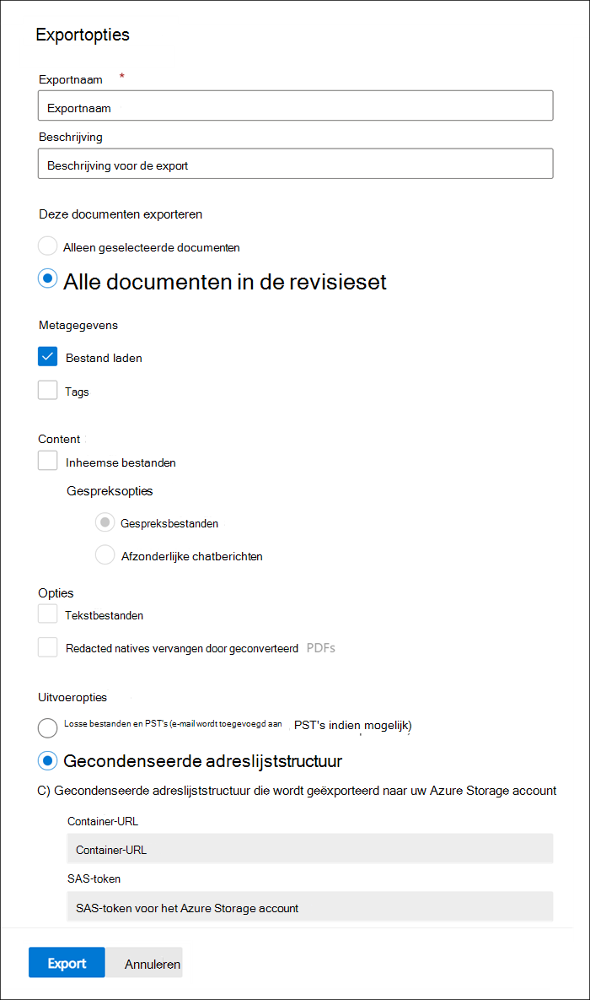

# Documenten exporteren uit een revisieset in Advanced eDiscovery

Met Exporteren kunnen gebruikers de inhoud aanpassen die is opgenomen in het downloadpakket wanneer u een document exporteert vanuit een revisieset in Advanced eDiscovery.

Documenten exporteren uit een revisieset:

1. Open in Microsoft 365 compliancecentrum het hoofd- Advanced eDiscovery, selecteer  het tabblad Revisiesets en selecteer vervolgens de revisieset die u wilt exporteren.

2. Klik in de revisieset op **Actie**  >  **exporteren.**

   Met het hulpmiddel Exporteren wordt de flyoutpagina weergegeven met de instellingen voor het configureren van de export. Sommige opties zijn standaard geselecteerd, maar u kunt deze wijzigen. Zie de volgende sectie voor beschrijvingen van de exportopties die u kunt configureren.

   

3. Nadat u de export hebt geconfigureerd, klikt u **op Exporteren om** het exportproces te starten. Afhankelijk van de optie die u **hebt** geselecteerd in de sectie Uitvoeropties, kunt u de exportbestanden openen via direct downloaden of in het account van Azure Storage organisatie.

> [!NOTE]
> Exporttaken blijven behouden voor de levensduur van de zaak. U moet de inhoud van een exportklus echter binnen 30 dagen nadat de exportklus is voltooid, downloaden.

## Exportopties

Gebruik de volgende opties om de export te configureren. Niet alle opties zijn toegestaan voor bepaalde uitvoeropties, met name het exporteren van tekstbestanden en opnieuw opgemaakte PDF-bestanden, zijn niet toegestaan bij het exporteren naar de PST-indeling.

- **Exportnaam:** naam van de exportklus. Dit wordt gebruikt om de zip-bestanden te noemen die worden gedownload.

- **Beschrijving**: Veld Vrije tekst om een beschrijving toe te voegen.

- **Deze documenten exporteren**

  - Alleen geselecteerde documenten: deze optie exporteert alleen de documenten die momenteel zijn geselecteerd. Deze optie is alleen beschikbaar wanneer items zijn geselecteerd in een revisieset.
  - Alle gefilterde documenten: met deze optie worden de documenten in een actief filter geexporteerd. Deze optie is alleen beschikbaar wanneer een filter wordt toegepast op de revisieset.
  - Alle documenten in de revisieset: met deze optie worden alle documenten in de revisieset geexporteert.

- **Uitvoeropties:** Geëxporteerde inhoud kan rechtstreeks via een webbrowser worden gedownload of kan worden verzonden naar een Azure Storage account. Met de eerste twee opties kunt u direct downloaden.
  
  - Alleen rapporten: Alleen het overzichts- en laadbestand worden gemaakt.
  - Losse bestanden en PST's (e-mail wordt indien mogelijk toegevoegd aan PST's): Bestanden worden geëxporteerd in een indeling die lijkt op de oorspronkelijke adreslijststructuur die gebruikers in hun eigen toepassingen zien.  Zie de sectie Losse bestanden en [PST-exportstructuur voor meer](#loose-files-and-pst-export-structure) informatie.
  - Gecondenseerde adreslijststructuur: Bestanden worden geëxporteerd en opgenomen in de download.
  - Gecondenseerde adreslijststructuur die wordt geëxporteerd naar uw Azure Storage account: Bestanden worden geëxporteerd naar het account Azure Storage uw organisatie. Voor deze optie moet u de URL opgeven voor de container in Azure Storage account om de bestanden naar te exporteren. U moet ook het SAS-token (Shared Access Signature) voor uw Azure Storage geven. Zie Documenten exporteren in een revisieset naar een Azure Storage [account voor meer informatie.](download-export-jobs.md)

- **Opnemen**
  - Tags: Wanneer u deze optie hebt geselecteerd, wordt taggegevens opgenomen in het laadbestand.
  - Tekstbestanden: Deze optie bevat de uitgepakte tekstversies van oorspronkelijke bestanden in de export.
  - Redacted natives vervangen door geconverteerde PDF-bestanden: Als er tijdens het controleren opnieuw uitgevoerde PDF-bestanden worden gegenereerd, zijn deze bestanden beschikbaar voor export. U kunt ervoor kiezen om alleen de oorspronkelijke bestanden te exporteren die opnieuw zijn uitgevoerd (door deze optie niet te selecteren) of u kunt deze optie selecteren om de PDF-bestanden te exporteren die de werkelijke redactions bevatten.

## In de volgende secties wordt de mapstructuur beschreven voor losse bestanden en opties voor gecondenseerde adreslijststructuur

Exporten worden verdeeld in ZIP-bestanden met een maximale grootte van niet-gecomprimeerde inhoud van 75 GB. Als de exportgrootte kleiner is dan 75 GB, bestaat de export uit een overzichtsbestand en één ZIP-bestand. Voor exporten van meer dan 75 GB aan niet-gecomprimeerde gegevens worden meerdere ZIP-bestanden gemaakt. Wanneer u deze hebt gedownload, kunnen de ZIP-bestanden op één locatie worden gecomprimeerd om de volledige export opnieuw te maken.

### Losse bestanden en PST-exportstructuur

Als u deze exportoptie selecteert, is de geëxporteerde inhoud ingedeeld in de volgende structuur:

- Summary.csv: Bevat een overzicht van de inhoud die is geëxporteerd uit de revisieset
- Hoofdmap: Deze map met de naam [Exportnaam] x van z.zip en wordt herhaald voor elke ZIP-bestandspartitie.
  - Export_load_file_x van z.csv: Het metagegevensbestand.
  - Waarschuwingen en fouten x van z.csv: Dit bestand bevat informatie over fouten die zijn aangetroffen bij het exporteren uit de revisieset.
  - Exchange: Deze map bevat alle inhoud uit Exchange opgeslagen in PST-bestanden. Deze optie kan niet worden opgenomen in opnieuw besleede PDF-bestanden. Als een bijlage is geselecteerd in de revisieset, wordt het bovenliggende e-mailbericht geëxporteerd met de bijlage als bijlage.
  - SharePoint: Deze map bevat alle oorspronkelijke inhoud van SharePoint in een oorspronkelijke bestandsindeling. Deze optie kan niet worden opgenomen in opnieuw besleede PDF-bestanden.

### Gecondenseerde adreslijststructuur

- Summary.csv: Bevat een overzicht van de inhoud die is geëxporteerd uit de revisieset
- Hoofdmap: Deze map met de naam [Exportnaam] x van z.zip en wordt herhaald voor elke ZIP-bestandspartitie.
  - Export_load_file_x van z.csv: Het metagegevensbestand en bevat ook de locatie van elk bestand dat is opgeslagen in het ZIP-bestand.
  - Waarschuwingen en fouten x van z.csv: Dit bestand bevat informatie over fouten die zijn aangetroffen bij het exporteren uit de revisieset.
  - NativeFiles: Deze map bevat alle oorspronkelijke bestanden die zijn geëxporteerd. Natives-bestanden worden vervangen door ge redacted PDF's als u de optie *Redacted Natives* vervangen door geconverteerde PDF's hebt geselecteerd.
  - Error_files: Deze map bevat bestanden met een extractie- of andere verwerkingsfout. De bestanden worden in afzonderlijke mappen geplaatst, extractiefout of ProcessingError. Deze bestanden worden weergegeven in het laadbestand.
  - Extracted_text_files: Deze map bevat alle uitgepakte tekstbestanden die tijdens de verwerking zijn gegenereerd.

### Gecondenseerde adreslijststructuur geëxporteerd naar uw Azure Storage Account

Deze optie gebruikt dezelfde algemene structuur als de *structuur* van de verkorte adreslijst, maar de inhoud wordt niet geritst en de gegevens worden opgeslagen in uw Azure Storage account. Deze optie wordt meestal gebruikt bij het werken met een externe eDiscovery-provider. Zie Documenten exporteren in een revisieset naar een Azure Storage account voor meer informatie over het gebruik [van deze optie.](download-export-jobs.md)
