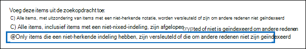
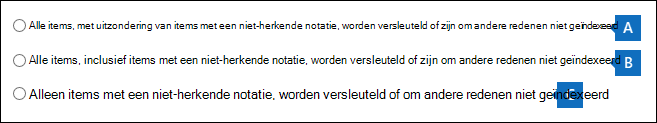

# <a name="export-content-search-results"></a><span data-ttu-id="6bc6d-105">Zoekresultaten voor inhoud exporteren</span><span class="sxs-lookup"><span data-stu-id="6bc6d-105">Export Content search results</span></span>

<span data-ttu-id="6bc6d-106">Nadat een inhoudszoekactie is uitgevoerd, kunt u de zoekresultaten exporteren naar een lokale computer.</span><span class="sxs-lookup"><span data-stu-id="6bc6d-106">After a Content search is successfully run, you can export the search results to a local computer.</span></span> <span data-ttu-id="6bc6d-107">Wanneer u e-mailresultaten exporteert, worden deze als PST-bestanden naar uw computer gedownload.</span><span class="sxs-lookup"><span data-stu-id="6bc6d-107">When you export email results, they're downloaded to your computer as PST files.</span></span> <span data-ttu-id="6bc6d-108">Wanneer u inhoud exporteert van SharePoint en OneDrive voor Bedrijven sites, worden kopieën van Office documenten geëxporteerd.</span><span class="sxs-lookup"><span data-stu-id="6bc6d-108">When you export content from SharePoint and OneDrive for Business sites, copies of native Office documents are exported.</span></span> <span data-ttu-id="6bc6d-109">Er zijn andere documenten en rapporten opgenomen in de geëxporteerde zoekresultaten.</span><span class="sxs-lookup"><span data-stu-id="6bc6d-109">There are other documents and reports included with the exported search results.</span></span>
  
<span data-ttu-id="6bc6d-110">Als u de resultaten van een inhoudszoekactie exporteert, worden de resultaten voorbereid en vervolgens gedownload naar een lokale computer.</span><span class="sxs-lookup"><span data-stu-id="6bc6d-110">Exporting the results of a Content search involves preparing the results, and then downloading them to a local computer.</span></span>
  
## <a name="before-you-export-search-results"></a><span data-ttu-id="6bc6d-111">Voordat u zoekresultaten exporteert</span><span class="sxs-lookup"><span data-stu-id="6bc6d-111">Before you export search results</span></span>

- <span data-ttu-id="6bc6d-112">Als u zoekresultaten wilt exporteren, moet u de rol Exportbeheer krijgen toegewezen in & Compliancecentrum.</span><span class="sxs-lookup"><span data-stu-id="6bc6d-112">To export search results, you have to be assigned the Export management role in Security & Compliance Center.</span></span> <span data-ttu-id="6bc6d-113">Deze rol wordt toegewezen aan de ingebouwde rollengroep eDiscovery Manager.</span><span class="sxs-lookup"><span data-stu-id="6bc6d-113">This role is assigned to the built-in eDiscovery Manager role group.</span></span> <span data-ttu-id="6bc6d-114">De functie is niet standaard toegewezen aan de rollengroep Organisatiebeheer.</span><span class="sxs-lookup"><span data-stu-id="6bc6d-114">It isn't assigned by default to the Organization Management role group.</span></span> <span data-ttu-id="6bc6d-115">Zie [eDiscovery-machtigingen](assign-ediscovery-permissions.md)toewijzen voor meer informatie.</span><span class="sxs-lookup"><span data-stu-id="6bc6d-115">For more information, see [Assign eDiscovery permissions](assign-ediscovery-permissions.md).</span></span>

- <span data-ttu-id="6bc6d-116">De computer die u gebruikt om de zoekresultaten te exporteren, moet voldoen aan de volgende systeemvereisten:</span><span class="sxs-lookup"><span data-stu-id="6bc6d-116">The computer you use to export the search results has to meet the following system requirements:</span></span>
  
  - <span data-ttu-id="6bc6d-117">Nieuwste versie van Windows (32-bits of 64-bits)</span><span class="sxs-lookup"><span data-stu-id="6bc6d-117">Latest version of Windows (32-bit or 64-bit)</span></span>
  
  - <span data-ttu-id="6bc6d-118">Microsoft .NET Framework 4.7</span><span class="sxs-lookup"><span data-stu-id="6bc6d-118">Microsoft .NET Framework 4.7</span></span>
  
- <span data-ttu-id="6bc6d-119">U moet een van de volgende ondersteunde browsers gebruiken om het eDiscovery Export Tool 1 uit te<sup>voeren:</sup></span><span class="sxs-lookup"><span data-stu-id="6bc6d-119">You have to use one of the following supported browsers to run the eDiscovery Export Tool<sup>1</sup>:</span></span>

  - <span data-ttu-id="6bc6d-120">Microsoft Edge <sup>2</sup></span><span class="sxs-lookup"><span data-stu-id="6bc6d-120">Microsoft Edge <sup>2</sup></span></span>
  
    <span data-ttu-id="6bc6d-121">OF</span><span class="sxs-lookup"><span data-stu-id="6bc6d-121">OR</span></span>

  - <span data-ttu-id="6bc6d-122">Microsoft Internet Explorer 10 en nieuwere versies</span><span class="sxs-lookup"><span data-stu-id="6bc6d-122">Microsoft Internet Explorer 10 and later versions</span></span>
  
  > [!NOTE]
  > <span data-ttu-id="6bc6d-123"><sup>1</sup> Microsoft produceert geen extensies of invoegtoepassingen van derden voor ClickOnce toepassingen.</span><span class="sxs-lookup"><span data-stu-id="6bc6d-123"><sup>1</sup> Microsoft doesn't manufacture third-party extensions or add-ons for ClickOnce applications.</span></span> <span data-ttu-id="6bc6d-124">Het exporteren van zoekresultaten met een niet-ondersteunde browser met extensies of invoegtoepassingen van derden wordt niet ondersteund.</span><span class="sxs-lookup"><span data-stu-id="6bc6d-124">Exporting search results using an unsupported browser with third-party extensions or add-ons isn't supported.</span></span><br/>
  > <span data-ttu-id="6bc6d-125"><sup>2</sup> Als gevolg van recente wijzigingen in Microsoft Edge is ClickOnce standaard niet meer ingeschakeld.</span><span class="sxs-lookup"><span data-stu-id="6bc6d-125"><sup>2</sup> As a result of recent changes to Microsoft Edge, ClickOnce support is no longer enabled by default.</span></span> <span data-ttu-id="6bc6d-126">Zie Het [eDiscovery-exporthulpmiddel](configure-edge-to-export-search-results.md)gebruiken in Microsoft Edge voor instructies over het inschakelen van ClickOnce ondersteuning in Edge.</span><span class="sxs-lookup"><span data-stu-id="6bc6d-126">For instructions on enabling ClickOnce support in Edge, see [Use the eDiscovery Export Tool in Microsoft Edge](configure-edge-to-export-search-results.md).</span></span>
  
- <span data-ttu-id="6bc6d-127">We raden u aan zoekresultaten te downloaden naar een lokale computer.</span><span class="sxs-lookup"><span data-stu-id="6bc6d-127">We recommend downloading search results to a local computer.</span></span> <span data-ttu-id="6bc6d-128">Als u wilt voorkomen dat de firewall of proxy-infrastructuur van uw bedrijf problemen veroorzaakt bij het downloaden van zoekresultaten, kunt u zoekresultaten downloaden naar een virtueel bureaublad buiten uw netwerk.</span><span class="sxs-lookup"><span data-stu-id="6bc6d-128">To eliminate your company's firewall or proxy infrastructure from causing issues when downloading search results, you might consider downloading search results to a virtual desktop outside of your network.</span></span> <span data-ttu-id="6bc6d-129">Dit kan time-outs verminderen die voorkomen in Azure-gegevensverbindingen bij het exporteren van een groot aantal bestanden.</span><span class="sxs-lookup"><span data-stu-id="6bc6d-129">This may decrease timeouts that occur in Azure data connections when exporting a large number of files.</span></span> <span data-ttu-id="6bc6d-130">Zie voor meer informatie over virtuele bureaubladen [Windows Virtual Desktop.](https://azure.microsoft.com/services/virtual-desktop)</span><span class="sxs-lookup"><span data-stu-id="6bc6d-130">For more information about virtual desktops, see [Windows Virtual Desktop](https://azure.microsoft.com/services/virtual-desktop).</span></span>

- <span data-ttu-id="6bc6d-131">Als u de prestaties bij het downloaden van zoekresultaten wilt verbeteren, kunt u zoekopdrachten die een grote reeks resultaten retourneren, verdelen in kleinere zoekopdrachten.</span><span class="sxs-lookup"><span data-stu-id="6bc6d-131">To improve performance when downloading search results, consider dividing searches that return a large set of results into smaller searches.</span></span> <span data-ttu-id="6bc6d-132">U kunt bijvoorbeeld datumbereiken in zoekquery's gebruiken om een kleinere reeks resultaten te retourneren die sneller kunnen worden gedownload.</span><span class="sxs-lookup"><span data-stu-id="6bc6d-132">For example, you can use date ranges in search queries to return a smaller set of results that can be downloaded faster.</span></span>
  
- <span data-ttu-id="6bc6d-133">Wanneer u zoekresultaten exporteert, worden de gegevens tijdelijk opgeslagen op een door Microsoft verstrekte Azure Storage in de Microsoft-cloud voordat deze worden gedownload naar uw lokale computer.</span><span class="sxs-lookup"><span data-stu-id="6bc6d-133">When you export search results, the data is temporarily stored in a Microsoft-provided Azure Storage location in the Microsoft cloud before it's downloaded to your local computer.</span></span> <span data-ttu-id="6bc6d-134">Zorg ervoor dat uw organisatie verbinding kan maken met het eindpunt in Azure, dat **\* .blob.core.windows.net** is (het jokerteken vertegenwoordigt een unieke id voor uw export).</span><span class="sxs-lookup"><span data-stu-id="6bc6d-134">Be sure that your organization can connect to the endpoint in Azure, which is **\*.blob.core.windows.net** (the wildcard represents a unique identifier for your export).</span></span> <span data-ttu-id="6bc6d-135">De zoekresultaten worden twee weken na het maken Azure Storage van de locatie verwijderd.</span><span class="sxs-lookup"><span data-stu-id="6bc6d-135">The search results data is deleted from the Azure Storage location two weeks after it's created.</span></span> 
  
- <span data-ttu-id="6bc6d-136">Als uw organisatie een proxyserver gebruikt om te communiceren met internet, moet u de proxyserverinstellingen definiëren op de computer die u gebruikt om de zoekresultaten te exporteren (zodat het exportprogramma kan worden geverifieerd door uw proxyserver).</span><span class="sxs-lookup"><span data-stu-id="6bc6d-136">If your organization uses a proxy server to communicate with the Internet, you need to define the proxy server settings on the computer that you use to export the search results (so the export tool can be authenticated by your proxy server).</span></span> <span data-ttu-id="6bc6d-137">Open hiervoor het *machine.config* bestand op de locatie die overeenkomt met uw versie van Windows.</span><span class="sxs-lookup"><span data-stu-id="6bc6d-137">To do this, open the  *machine.config*  file in the location that matches your version of Windows.</span></span> 
  
  - <span data-ttu-id="6bc6d-138">**32-bits:**`%windir%\Microsoft.NET\Framework\[version]\Config\machine.config`</span><span class="sxs-lookup"><span data-stu-id="6bc6d-138">**32-bit:** `%windir%\Microsoft.NET\Framework\[version]\Config\machine.config`</span></span>
  
  - <span data-ttu-id="6bc6d-139">**64-bits:**`%windir%\Microsoft.NET\Framework64\[version]\Config\machine.config`</span><span class="sxs-lookup"><span data-stu-id="6bc6d-139">**64-bit:** `%windir%\Microsoft.NET\Framework64\[version]\Config\machine.config`</span></span>
  
    <span data-ttu-id="6bc6d-140">Voeg de volgende regels toe aan  *machine.config*  bestand tussen de  `<configuration>`  `</configuration>` tags.</span><span class="sxs-lookup"><span data-stu-id="6bc6d-140">Add the following lines to the  *machine.config*  file somewhere between the  `<configuration>` and  `</configuration>` tags.</span></span> <span data-ttu-id="6bc6d-141">Zorg ervoor dat u de juiste waarden voor uw organisatie  `ProxyServer`  `Port` vervangt, `proxy01.contoso.com:80` bijvoorbeeld.</span><span class="sxs-lookup"><span data-stu-id="6bc6d-141">Be sure to replace  `ProxyServer` and  `Port` with the correct values for your organization; for example, `proxy01.contoso.com:80`.</span></span> 
  
    ```xml
    <system.net>
       <defaultProxy enabled="true" useDefaultCredentials="true">
         <proxy proxyaddress="https://ProxyServer :Port " 
                usesystemdefault="False" 
                bypassonlocal="True" 
                autoDetect="False" />
       </defaultProxy>
    </system.net>
    ```

- <span data-ttu-id="6bc6d-142">Als de resultaten van een zoekopdracht naar inhoud ouder zijn dan 7 dagen en u een exportklus indient, wordt er een foutbericht weergegeven waarin u wordt gevraagd de zoekopdracht opnieuw uit te voeren om de zoekresultaten bij te werken.</span><span class="sxs-lookup"><span data-stu-id="6bc6d-142">If the results of a Content search are older than 7 days and you submit an export job, an error message is displayed prompting you to rerun the search to update the search results.</span></span> <span data-ttu-id="6bc6d-143">Als dit gebeurt, annuleert u de export, heruitvoert u de zoekopdracht en start u de export opnieuw.</span><span class="sxs-lookup"><span data-stu-id="6bc6d-143">If this happens, cancel the export, rerun the search, and then start the export again.</span></span>

## <a name="step-1-prepare-search-results-for-export"></a><span data-ttu-id="6bc6d-144">Stap 1: Zoekresultaten voorbereiden voor export</span><span class="sxs-lookup"><span data-stu-id="6bc6d-144">Step 1: Prepare search results for export</span></span>

<span data-ttu-id="6bc6d-145">De eerste stap is het voorbereiden van de zoekresultaten voor het exporteren.</span><span class="sxs-lookup"><span data-stu-id="6bc6d-145">The first step is to prepare the search results for exporting.</span></span> <span data-ttu-id="6bc6d-146">Wanneer u de resultaten voorbereidt, worden deze geüpload naar een door Microsoft verstrekte Azure Storage in de Microsoft-cloud.</span><span class="sxs-lookup"><span data-stu-id="6bc6d-146">When you prepare results, they are uploaded to a Microsoft-provided Azure Storage location in the Microsoft cloud.</span></span> <span data-ttu-id="6bc6d-147">Inhoud van postvakken en sites wordt geüpload met een maximumsnelheid van 2 GB per uur.</span><span class="sxs-lookup"><span data-stu-id="6bc6d-147">Content from mailboxes and sites is uploaded at a maximum rate of 2 GB per hour.</span></span>
  
1. <span data-ttu-id="6bc6d-148">Selecteer in Microsoft 365 compliancecentrum de inhoudszoekactie waaruit u resultaten wilt exporteren.</span><span class="sxs-lookup"><span data-stu-id="6bc6d-148">In the Microsoft 365 compliance center, select the content search that you want to export results from.</span></span>
  
2. <span data-ttu-id="6bc6d-149">Klik in **het** menu Acties onder aan de flyoutpagina op **Resultaten exporteren.**</span><span class="sxs-lookup"><span data-stu-id="6bc6d-149">On the **Actions** menu at the bottom of the flyout page, click **Export results**.</span></span>

   

   <span data-ttu-id="6bc6d-151">De **flyoutpagina** Resultaten exporteren wordt weergegeven.</span><span class="sxs-lookup"><span data-stu-id="6bc6d-151">The **Export results** flyout page is displayed.</span></span> <span data-ttu-id="6bc6d-152">De exportopties die beschikbaar zijn om inhoud te exporteren, zijn afhankelijk van of zoekresultaten zich in postvakken of sites bevinden of een combinatie van beide.</span><span class="sxs-lookup"><span data-stu-id="6bc6d-152">The export options available to export content depend on whether search results are located in mailboxes or sites or a combination of both.</span></span>

3. <span data-ttu-id="6bc6d-153">Kies **onder Uitvoeropties** een van de volgende opties:</span><span class="sxs-lookup"><span data-stu-id="6bc6d-153">Under **Output options**, choose one of the following options:</span></span>
  
   

    - <span data-ttu-id="6bc6d-155">Alle items, met uitzondering van items met een niet-herkende notatie, worden versleuteld of zijn om andere redenen **niet geïndexeerd.**</span><span class="sxs-lookup"><span data-stu-id="6bc6d-155">**All items, excluding ones that have unrecognized format, are encrypted, or weren't indexed for other reasons**.</span></span> <span data-ttu-id="6bc6d-156">Deze optie exporteert alleen geïndexeerde items.</span><span class="sxs-lookup"><span data-stu-id="6bc6d-156">This option exports only indexed items.</span></span>
  
    - <span data-ttu-id="6bc6d-157">Alle items, inclusief items met een niet-herkende notatie, worden versleuteld of zijn om andere redenen **niet geïndexeerd.**</span><span class="sxs-lookup"><span data-stu-id="6bc6d-157">**All items, including ones that have unrecognized format, are encrypted, or weren't indexed for other reasons**.</span></span> <span data-ttu-id="6bc6d-158">Deze optie exporteert geïndexeerde en niet-geïndexeerde items.</span><span class="sxs-lookup"><span data-stu-id="6bc6d-158">This option exports indexed and unindexed items.</span></span>
  
    - <span data-ttu-id="6bc6d-159">**Alleen items met een niet-herkende notatie,** worden versleuteld of om andere redenen niet geïndexeerd.</span><span class="sxs-lookup"><span data-stu-id="6bc6d-159">**Only items that have an unrecognized format, are encrypted, or weren't indexed for other reasons**.</span></span> <span data-ttu-id="6bc6d-160">Met deze optie worden alleen niet-geïndexeerde items geexporteerd.</span><span class="sxs-lookup"><span data-stu-id="6bc6d-160">This option exports only unindexed items.</span></span>

      <span data-ttu-id="6bc6d-161">Zie de [sectie Meer informatie](#more-information) voor een beschrijving over hoe gedeeltelijk geïndexeerde items worden geëxporteerd.</span><span class="sxs-lookup"><span data-stu-id="6bc6d-161">See the [More information](#more-information) section for a description about how partially indexed items are exported.</span></span> <span data-ttu-id="6bc6d-162">Zie Gedeeltelijk geïndexeerde items in Inhoud zoeken voor meer informatie over gedeeltelijk geïndexeerde [items.](partially-indexed-items-in-content-search.md)</span><span class="sxs-lookup"><span data-stu-id="6bc6d-162">For more information about partially indexed items, see [Partially indexed items in Content search](partially-indexed-items-in-content-search.md).</span></span>

4. <span data-ttu-id="6bc6d-163">Kies **onder Exchange inhoud exporteren als** een van de volgende opties:</span><span class="sxs-lookup"><span data-stu-id="6bc6d-163">Under **Export Exchange content as**, choose one of the following options:</span></span>
  
   

    - <span data-ttu-id="6bc6d-165">**Eén PST-bestand voor elk postvak:** hiermee exporteert u één PST-bestand voor elk gebruikerspostvak met zoekresultaten.</span><span class="sxs-lookup"><span data-stu-id="6bc6d-165">**One PST file for each mailbox**: Exports one PST file for each user mailbox that contains search results.</span></span> <span data-ttu-id="6bc6d-166">Alle resultaten uit het archiefpostvak van de gebruiker worden opgenomen in hetzelfde PST-bestand.</span><span class="sxs-lookup"><span data-stu-id="6bc6d-166">Any results from the user's archive mailbox are included in the same PST file.</span></span> <span data-ttu-id="6bc6d-167">Met deze optie wordt de structuur van de postvakmap uit het bronpostvak gereproduceerd.</span><span class="sxs-lookup"><span data-stu-id="6bc6d-167">This option reproduces the mailbox folder structure from the source mailbox.</span></span>
  
    - <span data-ttu-id="6bc6d-168">**Eén PST-bestand** met alle berichten: hiermee exporteert u één PST-bestand (met de naam *Exchange.pst)* dat de zoekresultaten bevat van alle bronpostvakken die in de zoekopdracht zijn opgenomen.</span><span class="sxs-lookup"><span data-stu-id="6bc6d-168">**One PST file containing all messages**: Exports a single PST file (named *Exchange.pst*) that contains the search results from all source mailboxes included in the search.</span></span> <span data-ttu-id="6bc6d-169">Met deze optie wordt de structuur van de postvakmap voor elk bericht gereproduceerd.</span><span class="sxs-lookup"><span data-stu-id="6bc6d-169">This option reproduces the mailbox folder structure for each message.</span></span>
  
    - <span data-ttu-id="6bc6d-170">**Eén PST-bestand** met alle berichten in één map: hiermee exporteert u zoekresultaten naar één PST-bestand waarin alle berichten zich in één map op het hoogste niveau bevinden.</span><span class="sxs-lookup"><span data-stu-id="6bc6d-170">**One PST file containing all messages in a single folder**: Exports search results to a single PST file where all messages are located in a single, top-level folder.</span></span> <span data-ttu-id="6bc6d-171">Met deze optie kunnen revisoren items in chronologische volgorde bekijken (items worden gesorteerd op verzonden datum) zonder dat ze in de oorspronkelijke mapstructuur voor elk item moeten navigeren.</span><span class="sxs-lookup"><span data-stu-id="6bc6d-171">This option lets reviewers review items in chronological order (items are sorted by sent date) without having to navigate the original mailbox folder structure for each item.</span></span>
  
    - <span data-ttu-id="6bc6d-172">**Afzonderlijke berichten:** hiermee exporteert u zoekresultaten als afzonderlijke e-mailberichten met de MSG-indeling.</span><span class="sxs-lookup"><span data-stu-id="6bc6d-172">**Individual messages**: Exports search results as individual email messages, using the .msg format.</span></span> <span data-ttu-id="6bc6d-173">Als u deze optie selecteert, worden de zoekresultaten per e-mail geëxporteerd naar een map in het bestandssysteem.</span><span class="sxs-lookup"><span data-stu-id="6bc6d-173">If you select this option, email search results are exported to a folder in the file system.</span></span> <span data-ttu-id="6bc6d-174">Het mappad voor afzonderlijke berichten is hetzelfde als het pad dat wordt gebruikt als u de resultaten naar een PST-bestand exporteert.</span><span class="sxs-lookup"><span data-stu-id="6bc6d-174">The folder path for individual messages is the same as the one used if you exported the results to a PST file.</span></span>
  
5. <span data-ttu-id="6bc6d-175">Configureer de volgende aanvullende opties:</span><span class="sxs-lookup"><span data-stu-id="6bc6d-175">Configure the following additional options:</span></span>

   

   1. <span data-ttu-id="6bc6d-177">Schakel het **selectievakje De-duplicatie inschakelen voor Exchange inhoud** in om dubbele berichten uit te sluiten.</span><span class="sxs-lookup"><span data-stu-id="6bc6d-177">Select the **Enable de-duplication for Exchange content** checkbox to exclude duplicate messages.</span></span>
  
      <span data-ttu-id="6bc6d-178">Als u deze optie selecteert, wordt slechts één kopie van een bericht geëxporteerd, zelfs als er meerdere exemplaren van hetzelfde bericht worden gevonden in de postvakken die zijn doorzocht.</span><span class="sxs-lookup"><span data-stu-id="6bc6d-178">If you select this option, only one copy of a message will be exported even if multiple copies of the same message are found in the mailboxes that were searched.</span></span> <span data-ttu-id="6bc6d-179">Het rapport Exportresultaten (een bestand met de naam Results.csv) bevat een rij voor elke kopie van een duplicaatbericht, zodat u de postvakken (of openbare mappen) kunt identificeren die een kopie van het dubbele bericht bevatten.</span><span class="sxs-lookup"><span data-stu-id="6bc6d-179">The export results report (which is a file named Results.csv) will contain a row for every copy of a duplicate message so that you can identify the mailboxes (or public folders) that contain a copy of the duplicate message.</span></span> <span data-ttu-id="6bc6d-180">Zie [De-duplicatie in eDiscovery-zoekresultaten](de-duplication-in-ediscovery-search-results.md)voor meer informatie over de-duplicatie en hoe dubbele items worden geïdentificeerd.</span><span class="sxs-lookup"><span data-stu-id="6bc6d-180">For more information about de-duplication and how duplicate items are identified, see [De-duplication in eDiscovery search results](de-duplication-in-ediscovery-search-results.md).</span></span>
  
   2. <span data-ttu-id="6bc6d-181">Schakel het **selectievakje Versies opnemen voor SharePoint bestanden in** om alle versies van documenten SharePoint exporteren.</span><span class="sxs-lookup"><span data-stu-id="6bc6d-181">Select the **Include versions for SharePoint files** checkbox to export all versions of SharePoint documents.</span></span> <span data-ttu-id="6bc6d-182">Deze optie wordt alleen weergegeven als de inhoudsbronnen van de zoekopdracht sites SharePoint of OneDrive voor Bedrijven bevatten.</span><span class="sxs-lookup"><span data-stu-id="6bc6d-182">This option appears only if the content sources of the search include SharePoint or OneDrive for Business sites.</span></span>
  
   3. <span data-ttu-id="6bc6d-183">Selecteer de **bestanden exporteren in een gecomprimeerde map (geritst). Bevat alleen afzonderlijke berichten en SharePoint documenten om** zoekresultaten te exporteren naar gecomprimeerde mappen.</span><span class="sxs-lookup"><span data-stu-id="6bc6d-183">Select the **Export files in a compressed (zipped) folder. Includes only individual messages and SharePoint documents** checkbox to export search results to compressed folders.</span></span> <span data-ttu-id="6bc6d-184">Deze optie wordt alleen weergegeven wanneer u ervoor kiest om items Exchange te exporteren als afzonderlijke berichten en wanneer de zoekresultaten documenten SharePoint of OneDrive bevatten.</span><span class="sxs-lookup"><span data-stu-id="6bc6d-184">This option appears only when you choose to export Exchange items as individual messages and when the search results include SharePoint or OneDrive documents.</span></span> <span data-ttu-id="6bc6d-185">Deze optie wordt voornamelijk gebruikt om te werken rond de limiet van 260 tekens in Windows bestandspadnamen wanneer items worden geëxporteerd.</span><span class="sxs-lookup"><span data-stu-id="6bc6d-185">This option is primarily used to work around the 260 character limit in Windows file path names when items are exported.</span></span> <span data-ttu-id="6bc6d-186">Zie de 'Bestandsnaam van geëxporteerde items' in [de sectie Meer](#more-information) informatie.</span><span class="sxs-lookup"><span data-stu-id="6bc6d-186">See the "Filenames of exported items" in the [More information](#more-information) section.</span></span>
  
6. <span data-ttu-id="6bc6d-187">Klik **op Exporteren** om het exportproces te starten.</span><span class="sxs-lookup"><span data-stu-id="6bc6d-187">Click **Export** to start the export process.</span></span> <span data-ttu-id="6bc6d-188">De zoekresultaten zijn voorbereid voor het downloaden, wat betekent dat ze worden verzameld vanaf de oorspronkelijke inhoudslocaties en vervolgens worden geüpload naar een Azure Storage locatie in de Microsoft-cloud.</span><span class="sxs-lookup"><span data-stu-id="6bc6d-188">The search results are prepared for downloading, which means they're collected from the original content locations and then uploaded to an Azure Storage location in the Microsoft cloud.</span></span> <span data-ttu-id="6bc6d-189">Dit kan enkele minuten duren.</span><span class="sxs-lookup"><span data-stu-id="6bc6d-189">This may take several minutes.</span></span>

<span data-ttu-id="6bc6d-190">Zie de volgende sectie voor instructies voor het downloaden van de geëxporteerde zoekresultaten.</span><span class="sxs-lookup"><span data-stu-id="6bc6d-190">See the next section for instructions to download the exported search results.</span></span>
  
## <a name="step-2-download-the-search-results"></a><span data-ttu-id="6bc6d-191">Stap 2: De zoekresultaten downloaden</span><span class="sxs-lookup"><span data-stu-id="6bc6d-191">Step 2: Download the search results</span></span>

<span data-ttu-id="6bc6d-192">De volgende stap is het downloaden van de zoekresultaten van de Azure Storage locatie naar uw lokale computer.</span><span class="sxs-lookup"><span data-stu-id="6bc6d-192">The next step is to download the search results from the Azure Storage location to your local computer.</span></span>
  
1. <span data-ttu-id="6bc6d-193">Selecteer op **de pagina Inhoud** zoeken in het Microsoft 365 compliancecentrum het tabblad **Exporten**</span><span class="sxs-lookup"><span data-stu-id="6bc6d-193">On the **Content search** page in the Microsoft 365 compliance center, select the **Exports** tab</span></span>
  
   <span data-ttu-id="6bc6d-194">Mogelijk moet u op Vernieuwen klikken **om** de lijst met exporttaken bij te werken, zodat de exporttaken worden weergegeven die u hebt gemaakt.</span><span class="sxs-lookup"><span data-stu-id="6bc6d-194">You may have to click **Refresh** to update the list of export jobs so that it shows the export job you created.</span></span> <span data-ttu-id="6bc6d-195">Exporttaken hebben dezelfde naam als de bijbehorende zoekopdracht **met _Export** toegevoegd aan de zoeknaam.</span><span class="sxs-lookup"><span data-stu-id="6bc6d-195">Export jobs have the same name as the corresponding search with **_Export** appended to the search name.</span></span>
  
2. <span data-ttu-id="6bc6d-196">Selecteer de exportklus die u hebt gemaakt in stap 1.</span><span class="sxs-lookup"><span data-stu-id="6bc6d-196">Select the export job that you created in Step 1.</span></span>

3. <span data-ttu-id="6bc6d-197">Klik op de flyoutpagina onder **Exportcode** op **Kopiëren naar klembord.**</span><span class="sxs-lookup"><span data-stu-id="6bc6d-197">On the flyout page under **Export key**, click **Copy to clipboard**.</span></span> <span data-ttu-id="6bc6d-198">U gebruikt deze sleutel in stap 6 om de zoekresultaten te downloaden.</span><span class="sxs-lookup"><span data-stu-id="6bc6d-198">You use this key in step 6 to download the search results.</span></span>
  
   > [!IMPORTANT]
   > <span data-ttu-id="6bc6d-199">Omdat iedereen het hulpprogramma eDiscovery Export kan installeren en starten en vervolgens deze sleutel kan gebruiken om de zoekresultaten te downloaden, moet u voorzorgsmaatregelen nemen om deze sleutel te beveiligen, net zoals u wachtwoorden of andere beveiligingsgerelateerde informatie zou beveiligen.</span><span class="sxs-lookup"><span data-stu-id="6bc6d-199">Because anyone can install and start the eDiscovery Export tool, and then use this key to download the search results, be sure to take precautions to protect this key just like you would protect passwords or other security-related information.</span></span>

4. <span data-ttu-id="6bc6d-200">Klik boven aan de flyoutpagina op **Resultaten downloaden.**</span><span class="sxs-lookup"><span data-stu-id="6bc6d-200">At the top of the flyout page, click **Download results**.</span></span>

5. <span data-ttu-id="6bc6d-201">Als u wordt gevraagd het **eDiscovery-exportprogramma te installeren,** klikt u op **Installeren.**</span><span class="sxs-lookup"><span data-stu-id="6bc6d-201">If you're prompted to install the **eDiscovery Export Tool**, click **Install**.</span></span>

6. <span data-ttu-id="6bc6d-202">Ga als volgt te werk in het **eDiscovery-exporthulpmiddel:**</span><span class="sxs-lookup"><span data-stu-id="6bc6d-202">In the **eDiscovery Export Tool**, do the following:</span></span>

   

   1. <span data-ttu-id="6bc6d-204">Plak de exportcode die u hebt gekopieerd in stap 3 in het juiste vak.</span><span class="sxs-lookup"><span data-stu-id="6bc6d-204">Paste the export key that you copied in step 3 in the appropriate box.</span></span>
  
   2. <span data-ttu-id="6bc6d-205">Klik **op Bladeren** om de locatie op te geven waar u de zoekresultaten wilt downloaden.</span><span class="sxs-lookup"><span data-stu-id="6bc6d-205">Click **Browse** to specify the location where you want to download the search result files.</span></span>
  
      > [!IMPORTANT]
      >  <span data-ttu-id="6bc6d-206">Vanwege de hoge netwerkactiviteit tijdens het downloaden, moet u zoekresultaten alleen downloaden naar een locatie op een intern station op uw lokale computer.</span><span class="sxs-lookup"><span data-stu-id="6bc6d-206">Due to high network activity during download, you should download search results only to a location on an internal drive on your local computer.</span></span> <span data-ttu-id="6bc6d-207">Volg de volgende richtlijnen voor de beste downloadervaring:</span><span class="sxs-lookup"><span data-stu-id="6bc6d-207">For the best download experience, follow these guidelines:</span></span> <br/>
      >- <span data-ttu-id="6bc6d-208">Download geen zoekresultaten naar een UNC-pad, een netwerkstation, een extern USB-station of een gesynchroniseerd OneDrive voor Bedrijven account.</span><span class="sxs-lookup"><span data-stu-id="6bc6d-208">Don't download search results to a UNC path, a mapped network drive, an external USB drive, or a synched OneDrive for Business account.</span></span><br/>
      >- <span data-ttu-id="6bc6d-209">Schakel het scannen van virussen uit voor de map waar u het zoekresultaat naar downloadt.</span><span class="sxs-lookup"><span data-stu-id="6bc6d-209">Disable anti-virus scanning for the folder that you download the search result to.</span></span><br/>
      >- <span data-ttu-id="6bc6d-210">Download zoekresultaten naar verschillende mappen voor gelijktijdige downloadtaken.</span><span class="sxs-lookup"><span data-stu-id="6bc6d-210">Download search results to different folders for concurrent download jobs.</span></span>

6. <span data-ttu-id="6bc6d-211">Klik **op Start** om de zoekresultaten naar uw computer te downloaden.</span><span class="sxs-lookup"><span data-stu-id="6bc6d-211">Click **Start** to download the search results to your computer.</span></span>
  
    <span data-ttu-id="6bc6d-212">Het **eDiscovery-exporthulpmiddel** geeft statusgegevens weer over het exportproces, inclusief een schatting van het aantal (en de grootte) van de resterende items die moeten worden gedownload.</span><span class="sxs-lookup"><span data-stu-id="6bc6d-212">The **eDiscovery Export Tool** displays status information about the export process, including an estimate of the number (and size) of the remaining items to be downloaded.</span></span> <span data-ttu-id="6bc6d-213">Wanneer het exportproces is voltooid, hebt u toegang tot de bestanden op de locatie waar ze zijn gedownload.</span><span class="sxs-lookup"><span data-stu-id="6bc6d-213">When the export process is complete, you can access the files in the location where they were downloaded.</span></span>

## <a name="more-information"></a><span data-ttu-id="6bc6d-214">Meer informatie</span><span class="sxs-lookup"><span data-stu-id="6bc6d-214">More information</span></span>

<span data-ttu-id="6bc6d-215">Hier vindt u meer informatie over het exporteren van zoekresultaten.</span><span class="sxs-lookup"><span data-stu-id="6bc6d-215">Here's more information about exporting search results.</span></span>
  
[<span data-ttu-id="6bc6d-216">Exportlimieten</span><span class="sxs-lookup"><span data-stu-id="6bc6d-216">Export limits</span></span>](#export-limits)
  
[<span data-ttu-id="6bc6d-217">Rapporten exporteren</span><span class="sxs-lookup"><span data-stu-id="6bc6d-217">Export reports</span></span>](#export-reports)
  
[<span data-ttu-id="6bc6d-218">Gedeeltelijk geïndexeerde items exporteren</span><span class="sxs-lookup"><span data-stu-id="6bc6d-218">Exporting partially indexed items</span></span>](#exporting-partially-indexed-items)

[<span data-ttu-id="6bc6d-219">Afzonderlijke berichten of PST-bestanden exporteren</span><span class="sxs-lookup"><span data-stu-id="6bc6d-219">Exporting individual messages or PST files</span></span>](#exporting-individual-messages-or-pst-files)

[<span data-ttu-id="6bc6d-220">Met RMS beveiligde e-mailberichten en versleutelde bestandsbijlagen ontsleutelen</span><span class="sxs-lookup"><span data-stu-id="6bc6d-220">Decrypting RMS-protected email messages and encrypted file attachments</span></span>](#decrypting-rms-protected-email-messages-and-encrypted-file-attachments)

[<span data-ttu-id="6bc6d-221">Bestandsnaam van geëxporteerde items</span><span class="sxs-lookup"><span data-stu-id="6bc6d-221">Filenames of exported items</span></span>](#filenames-of-exported-items)  
  
[<span data-ttu-id="6bc6d-222">Diversen</span><span class="sxs-lookup"><span data-stu-id="6bc6d-222">Miscellaneous</span></span>](#miscellaneous)
  
### <a name="export-limits"></a><span data-ttu-id="6bc6d-223">Exportlimieten</span><span class="sxs-lookup"><span data-stu-id="6bc6d-223">Export limits</span></span>

<span data-ttu-id="6bc6d-224">Zie de sectie 'Exportlimieten' in Limieten voor inhoud zoeken voor informatie over limieten bij het exporteren van [inhoudsresultaten.](limits-for-content-search.md#export-limits)</span><span class="sxs-lookup"><span data-stu-id="6bc6d-224">For information about limits when exporting content search results, see the "Export limits" section in [Limits for content search](limits-for-content-search.md#export-limits).</span></span>

### <a name="export-reports"></a><span data-ttu-id="6bc6d-225">Rapporten exporteren</span><span class="sxs-lookup"><span data-stu-id="6bc6d-225">Export reports</span></span>
  
- <span data-ttu-id="6bc6d-226">Wanneer u zoekresultaten exporteert, worden naast de zoekresultaten ook de volgende rapporten opgenomen.</span><span class="sxs-lookup"><span data-stu-id="6bc6d-226">When you export search results, the following reports are included in addition to the search results.</span></span>
  
  - <span data-ttu-id="6bc6d-227">**Exportoverzicht** Een Excel document met een overzicht van de export.</span><span class="sxs-lookup"><span data-stu-id="6bc6d-227">**Export Summary** An Excel document that contains a summary of the export.</span></span> <span data-ttu-id="6bc6d-228">Dit omvat informatie, zoals het aantal inhoudsbronnen dat is doorzocht, de geschatte en gedownloade grootte van de zoekresultaten en het geschatte en gedownloade aantal items dat is geëxporteerd.</span><span class="sxs-lookup"><span data-stu-id="6bc6d-228">This includes information such as the number of content sources that were searched, the estimated and downloaded sizes of the search results, and the estimated and downloaded number of items that were exported.</span></span>
  
  - <span data-ttu-id="6bc6d-229">**Manifest** Een manifestbestand (in XML-indeling) dat informatie bevat over elk item dat in de zoekresultaten wordt opgenomen.</span><span class="sxs-lookup"><span data-stu-id="6bc6d-229">**Manifest** A manifest file (in XML format) that contains information about each item included in the search results.</span></span>
  
  - <span data-ttu-id="6bc6d-230">**Resultaten** Een Excel document met informatie over elk item dat als zoekresultaat wordt gedownload.</span><span class="sxs-lookup"><span data-stu-id="6bc6d-230">**Results** An Excel document that contains information about each item that is download as a search result.</span></span> <span data-ttu-id="6bc6d-231">Voor e-mail bevat het resultatenlogboek informatie over elk bericht, waaronder:</span><span class="sxs-lookup"><span data-stu-id="6bc6d-231">For email, the result log contains information about each message, including:</span></span>
  
    - <span data-ttu-id="6bc6d-232">De locatie van het bericht in het bronpostvak (inclusief of het bericht zich in het primaire of archiefpostvak bevindt).</span><span class="sxs-lookup"><span data-stu-id="6bc6d-232">The location of the message in the source mailbox (including whether the message is in the primary or archive mailbox).</span></span>
  
    - <span data-ttu-id="6bc6d-233">De datum waarop het bericht is verzonden of ontvangen.</span><span class="sxs-lookup"><span data-stu-id="6bc6d-233">The date the message was sent or received.</span></span>

    - <span data-ttu-id="6bc6d-234">De onderwerpregel van het bericht.</span><span class="sxs-lookup"><span data-stu-id="6bc6d-234">The Subject line from the message.</span></span>

    - <span data-ttu-id="6bc6d-235">De afzender en geadresseerden van het bericht.</span><span class="sxs-lookup"><span data-stu-id="6bc6d-235">The sender and recipients of the message.</span></span>

    - <span data-ttu-id="6bc6d-236">Of het bericht een duplicaatbericht is als u de optie de-duplicatie hebt ingeschakeld bij het exporteren van de zoekresultaten.</span><span class="sxs-lookup"><span data-stu-id="6bc6d-236">Whether the message is a duplicate message if you enabled the de-duplication option when exporting the search results.</span></span> <span data-ttu-id="6bc6d-237">Dubbele berichten hebben een waarde in de kolom **Dupliceren** naar item die het bericht als een duplicaat identificeert.</span><span class="sxs-lookup"><span data-stu-id="6bc6d-237">Duplicate messages have a value in the **Duplicate to Item** column that identifies the message as a duplicate.</span></span> <span data-ttu-id="6bc6d-238">De waarde in de **kolom Dupliceren** naar item bevat de itemidentiteit van het bericht dat is geëxporteerd.</span><span class="sxs-lookup"><span data-stu-id="6bc6d-238">The value in the **Duplicate to Item** column contains the item identity of the message that was exported.</span></span> <span data-ttu-id="6bc6d-239">Zie [De-duplicatie in de zoekresultaten van eDiscovery voor meer informatie.](de-duplication-in-ediscovery-search-results.md)</span><span class="sxs-lookup"><span data-stu-id="6bc6d-239">For more information, see [De-duplication in eDiscovery search results](de-duplication-in-ediscovery-search-results.md).</span></span>

      <span data-ttu-id="6bc6d-240">Voor documenten van SharePoint en OneDrive voor Bedrijven sites bevat het resultatenlogboek informatie over elk document, waaronder:</span><span class="sxs-lookup"><span data-stu-id="6bc6d-240">For documents from SharePoint and OneDrive for Business sites, the result log contains information about each document, including:</span></span>

      - <span data-ttu-id="6bc6d-241">De URL voor het document.</span><span class="sxs-lookup"><span data-stu-id="6bc6d-241">The URL for the document.</span></span>

      - <span data-ttu-id="6bc6d-242">De URL voor de siteverzameling waar het document zich bevindt.</span><span class="sxs-lookup"><span data-stu-id="6bc6d-242">The URL for the site collection where the document is located.</span></span>

      - <span data-ttu-id="6bc6d-243">De datum waarop het document voor het laatst is gewijzigd.</span><span class="sxs-lookup"><span data-stu-id="6bc6d-243">The date that the document was last modified.</span></span>

      - <span data-ttu-id="6bc6d-244">De naam van het document (dat zich in de kolom Onderwerp in het resultatenlogboek bevindt).</span><span class="sxs-lookup"><span data-stu-id="6bc6d-244">The name of the document (which is located in the Subject column in the result log).</span></span>

  - <span data-ttu-id="6bc6d-245">**Niet-geïndexeerde items** Een Excel document met informatie over gedeeltelijk geïndexeerde items die in de zoekresultaten zouden worden opgenomen.</span><span class="sxs-lookup"><span data-stu-id="6bc6d-245">**Unindexed Items** An Excel document that contains information about any partially indexed items that would be included in the search results.</span></span> <span data-ttu-id="6bc6d-246">Als u geen gedeeltelijk geïndexeerde items op neemt wanneer u het rapport met zoekresultaten genereert, wordt dit rapport nog steeds gedownload, maar is het leeg.</span><span class="sxs-lookup"><span data-stu-id="6bc6d-246">If you don't include partially indexed items when you generate the search results report, this report will still be downloaded, but will be empty.</span></span>

  - <span data-ttu-id="6bc6d-247">**Fouten en waarschuwingen** Bevat fouten en waarschuwingen voor bestanden die tijdens het exporteren zijn aangetroffen.</span><span class="sxs-lookup"><span data-stu-id="6bc6d-247">**Errors and Warnings** Contains errors and warnings for files encountered during export.</span></span> <span data-ttu-id="6bc6d-248">Zie de kolom Foutgegevens voor informatie die specifiek is voor elke afzonderlijke fout of waarschuwing.</span><span class="sxs-lookup"><span data-stu-id="6bc6d-248">See the Error Details column for information specific to each individual error or warning.</span></span>

  - <span data-ttu-id="6bc6d-249">**Overgeslagen items** Wanneer u zoekresultaten exporteert van SharePoint en OneDrive voor Bedrijven sites, bevat de export meestal een rapport overgeslagen items (SkippedItems.csv).</span><span class="sxs-lookup"><span data-stu-id="6bc6d-249">**Skipped Items** When you export search results from SharePoint and OneDrive for Business sites, the export will usually include a skipped items report (SkippedItems.csv).</span></span> <span data-ttu-id="6bc6d-250">De items die in dit rapport worden aangehaald, zijn meestal items die niet worden gedownload, zoals een map of een documentset.</span><span class="sxs-lookup"><span data-stu-id="6bc6d-250">The items cited in this report are typically items that won't be downloaded, such as a folder or a document set.</span></span> <span data-ttu-id="6bc6d-251">Het niet exporteren van dit type items is een ontwerp.</span><span class="sxs-lookup"><span data-stu-id="6bc6d-251">Not exporting these types of items is by design.</span></span> <span data-ttu-id="6bc6d-252">Voor andere items die zijn overgeslagen, wordt in het veld Fouttype en Foutgegevens in het rapport Overgeslagen items de reden weergegeven waarom het item is overgeslagen en niet is gedownload met de andere zoekresultaten.</span><span class="sxs-lookup"><span data-stu-id="6bc6d-252">For other items that were skipped, the 'Error Type' and 'Error Details' field in the skipped items report show the reason the item was skipped and wasn't downloaded with the other search results.</span></span>

  - <span data-ttu-id="6bc6d-253">**Trace.log** Bevat gedetailleerde logboekregistratiegegevens over het exportproces en kan helpen bij het opsporen van problemen tijdens het exporteren.</span><span class="sxs-lookup"><span data-stu-id="6bc6d-253">**Trace.log** Contains detailed logging information about the export process and can help uncover issues during export.</span></span> <span data-ttu-id="6bc6d-254">Als u een ticket opent met Microsoft Support over een probleem met betrekking tot het exporteren van zoekresultaten, wordt u mogelijk gevraagd dit tracelogboek op te geven.</span><span class="sxs-lookup"><span data-stu-id="6bc6d-254">If you open a ticket with Microsoft Support about an issue related to exporting search results, you may be asked to provide this trace log.</span></span>
  
    > [!NOTE]
    > <span data-ttu-id="6bc6d-255">U kunt deze documenten gewoon exporteren zonder de werkelijke zoekresultaten te exporteren.</span><span class="sxs-lookup"><span data-stu-id="6bc6d-255">You can just export these documents without having to export the actual search results.</span></span> <span data-ttu-id="6bc6d-256">Zie [Een inhoudszoekrapport exporteren.](export-a-content-search-report.md)</span><span class="sxs-lookup"><span data-stu-id="6bc6d-256">See [Export a Content search report](export-a-content-search-report.md).</span></span>
  
### <a name="exporting-partially-indexed-items"></a><span data-ttu-id="6bc6d-257">Gedeeltelijk geïndexeerde items exporteren</span><span class="sxs-lookup"><span data-stu-id="6bc6d-257">Exporting partially indexed items</span></span>
  
- <span data-ttu-id="6bc6d-258">Als u postvakitems exporteert vanuit een inhoudszoekactie die alle postvakitems in de zoekresultaten retourneert (omdat er geen trefwoorden zijn opgenomen in de zoekquery), worden gedeeltelijk geïndexeerde items niet gekopieerd naar het PST-bestand met de niet-geïndexeerde items.</span><span class="sxs-lookup"><span data-stu-id="6bc6d-258">If you're exporting mailbox items from a content search that returns all mailbox items in the search results (because no keywords where included in the search query), partially indexed items won't be copied to the PST file that contains the unindexed items.</span></span> <span data-ttu-id="6bc6d-259">Dit komt omdat alle items, inclusief gedeeltelijk geïndexeerde items, automatisch worden opgenomen in de normale zoekresultaten.</span><span class="sxs-lookup"><span data-stu-id="6bc6d-259">This is because all items, including any partially indexed items, are automatically included in the regular search results.</span></span> <span data-ttu-id="6bc6d-260">Dit betekent dat gedeeltelijk geïndexeerde items worden opgenomen in een PST-bestand (of als afzonderlijke berichten) met de andere, geïndexeerde items.</span><span class="sxs-lookup"><span data-stu-id="6bc6d-260">This means that partially indexed items will be included in a PST file (or as individual messages) that contains the other, indexed items.</span></span>

    <span data-ttu-id="6bc6d-261">Als u zowel de geïndexeerde als gedeeltelijk geïndexeerde items exporteert of als u alleen de geïndexeerde items exporteert uit een inhoudszoekactie die alle items retourneert, wordt hetzelfde aantal items gedownload.</span><span class="sxs-lookup"><span data-stu-id="6bc6d-261">If you export both the indexed and partially indexed items or if you export only the indexed items from a content search that returns all items, the same number of items will be downloaded.</span></span> <span data-ttu-id="6bc6d-262">Dit gebeurt ook al bevatten de geschatte zoekresultaten voor het zoeken naar inhoud (weergegeven in de zoekstatistieken in het beveiligings- & compliancecentrum) nog steeds een afzonderlijke schatting voor het aantal gedeeltelijk geïndexeerde items.</span><span class="sxs-lookup"><span data-stu-id="6bc6d-262">This happens even though the estimated search results for the content search (displayed in the search statistics in the Security & Compliance Center) will still include a separate estimate for the number of partially indexed items.</span></span> <span data-ttu-id="6bc6d-263">Stel dat de schatting voor een zoekopdracht met alle items (geen trefwoorden in de zoekquery) laat zien dat er 1000 items zijn gevonden en dat er ook 200 gedeeltelijk geïndexeerde items zijn gevonden.</span><span class="sxs-lookup"><span data-stu-id="6bc6d-263">For example, let's say that the estimate for a search that includes all items (no keywords in the search query) shows that 1,000 items were found and that 200 partially indexed items were also found.</span></span> <span data-ttu-id="6bc6d-264">In dit geval bevatten de 1.000 items de gedeeltelijk geïndexeerde items, omdat de zoekopdracht alle items retourneert.</span><span class="sxs-lookup"><span data-stu-id="6bc6d-264">In this case, the 1,000 items include the partially indexed items because the search returns all items.</span></span> <span data-ttu-id="6bc6d-265">Met andere woorden, er zijn in totaal 1.000 items die door de zoekopdracht worden geretourneerd en niet 1.200 items (zoals u zou verwachten).</span><span class="sxs-lookup"><span data-stu-id="6bc6d-265">In other words, there are 1,000 total items returned by the search, and not 1,200 items (as you might expect).</span></span> <span data-ttu-id="6bc6d-266">Als u de resultaten van deze zoekopdracht exporteert en geïndexeerde en gedeeltelijk geïndexeerde items exporteert (of alleen gedeeltelijk geïndexeerde items exporteert), worden 1000 items gedownload.</span><span class="sxs-lookup"><span data-stu-id="6bc6d-266">If you export the results of this search and choose to export indexed and partially indexed items (or export only partially indexed items), then 1,000 items will be downloaded.</span></span> <span data-ttu-id="6bc6d-267">Nogmaals, dat komt omdat gedeeltelijk geïndexeerde items worden opgenomen in de normale (geïndexeerde) resultaten wanneer u een lege zoekquery gebruikt om alle items te retourneren.</span><span class="sxs-lookup"><span data-stu-id="6bc6d-267">Again, that's because partially indexed items are included with the regular (indexed) results when you use a blank search query to return all items.</span></span> <span data-ttu-id="6bc6d-268">Als u in hetzelfde voorbeeld ervoor kiest om slechts gedeeltelijk geïndexeerde items te exporteren, worden alleen de 200 niet-geïndexeerde items gedownload.</span><span class="sxs-lookup"><span data-stu-id="6bc6d-268">In this same example, if you choose to export only partially indexed items, then only the 200 unindexed items would be downloaded.</span></span>

    <span data-ttu-id="6bc6d-269">Houd er ook rekening mee dat in het vorige voorbeeld (wanneer u geïndexeerde en gedeeltelijk geïndexeerde items exporteert of alleen geïndexeerde items exporteert), het rapport Overzicht exporteren in de geëxporteerde zoekresultaten 1000 geschatte items en 1.000 gedownloade items bevat om dezelfde redenen als eerder beschreven. </span><span class="sxs-lookup"><span data-stu-id="6bc6d-269">Also note that in the previous example (when you export indexed and partially indexed items or you export only indexed items), the **Export Summary** report included with the exported search results would list 1,000 items estimated items and 1,000 downloaded items for the same reasons as previously described.</span></span> 

- <span data-ttu-id="6bc6d-270">Als de zoekopdracht waaruit u resultaten exporteert, een zoekopdracht was naar specifieke inhoudslocaties of alle inhoudslocaties in uw organisatie, worden alleen de gedeeltelijke items van inhoudslocaties die items bevatten die voldoen aan de zoekcriteria, geëxporteerd.</span><span class="sxs-lookup"><span data-stu-id="6bc6d-270">If the search that you're exporting results from was a search of specific content locations or all content locations in your organization, only the partial items from content locations that contain items that match the search criteria will be exported.</span></span> <span data-ttu-id="6bc6d-271">Met andere woorden: als er geen zoekresultaten worden gevonden in een postvak of site, worden gedeeltelijk geïndexeerde items in dat postvak of die site niet geëxporteerd.</span><span class="sxs-lookup"><span data-stu-id="6bc6d-271">In other words, if no search results are found in a mailbox or site, then any partially indexed items in that mailbox or site won't be exported.</span></span> <span data-ttu-id="6bc6d-272">De reden hiervoor is dat het exporteren van gedeeltelijk geïndexeerde items vanuit een groot aantal locaties in de organisatie de kans op exportfouten kan vergroten en de tijd kan vergroten om de zoekresultaten te exporteren en te downloaden.</span><span class="sxs-lookup"><span data-stu-id="6bc6d-272">The reason for this is that exporting partially indexed items from lots of locations in the organization might increase the likelihood of export errors and increase the time it takes to export and download the search results.</span></span>

    <span data-ttu-id="6bc6d-273">Als u gedeeltelijk geïndexeerde items wilt exporteren van alle inhoudslocaties voor een zoekopdracht, configureert u de zoekopdracht om alle items te retourneren (door trefwoorden uit de zoekquery te verwijderen) en exporteert u vervolgens alleen gedeeltelijk geïndexeerde items wanneer u de zoekresultaten exporteert.</span><span class="sxs-lookup"><span data-stu-id="6bc6d-273">To export partially indexed items from all content locations for a search, configure the search to return all items (by removing any keywords from the search query) and then export only partially indexed items when you export the search results.</span></span>

    
  
- <span data-ttu-id="6bc6d-275">Wanneer u zoekresultaten exporteert van SharePoint- of OneDrive voor Bedrijven-sites, is de mogelijkheid om niet-geïndexeerde items te exporteren ook afhankelijk van de exportoptie die u selecteert en of een site die is gezocht een geïndexeerd item bevat dat voldoet aan de zoekcriteria.</span><span class="sxs-lookup"><span data-stu-id="6bc6d-275">When exporting search results from SharePoint or OneDrive for Business sites, the ability to export unindexed items also depends on the export option that you select and whether a site that was searched contains an indexed item that matches the search criteria.</span></span> <span data-ttu-id="6bc6d-276">Als u bijvoorbeeld op specifieke SharePoint- of OneDrive voor Bedrijven-sites zoekt en er geen zoekresultaten worden gevonden, worden er geen niet-geïndexeerde items van deze sites geëxporteerd als u de tweede exportoptie kiest om zowel geïndexeerde als niet-geïndexeerde items te exporteren.</span><span class="sxs-lookup"><span data-stu-id="6bc6d-276">For example, if you search specific SharePoint or OneDrive for Business sites and no search results are found, then no unindexed items from those sites will be exported if you choose the second export option to export both indexed and unindexed items.</span></span> <span data-ttu-id="6bc6d-277">Als een geïndexeerd item van een site wel voldoet aan de zoekcriteria, worden alle niet-geïndexeerde items van die site geëxporteerd bij het exporteren van zowel geïndexeerde als niet-geïndexeerde items.</span><span class="sxs-lookup"><span data-stu-id="6bc6d-277">If an indexed item from a site does match the search criteria, then all unindexed items from that site will be exported when exporting both indexed and unindexed items.</span></span> <span data-ttu-id="6bc6d-278">In de volgende afbeelding worden de exportopties beschreven op basis van of een site een geïndexeerd item bevat dat overeenkomt met de zoekcriteria.</span><span class="sxs-lookup"><span data-stu-id="6bc6d-278">The following illustration describes the export options based on whether a site contains an indexed item that matches the search criteria.</span></span>

    

    <span data-ttu-id="6bc6d-280">a.</span><span class="sxs-lookup"><span data-stu-id="6bc6d-280">a.</span></span> <span data-ttu-id="6bc6d-281">Alleen geïndexeerde items die voldoen aan de zoekcriteria, worden geëxporteerd.</span><span class="sxs-lookup"><span data-stu-id="6bc6d-281">Only indexed items that match the search criteria are exported.</span></span> <span data-ttu-id="6bc6d-282">Er worden geen gedeeltelijk geïndexeerde items geëxporteerd.</span><span class="sxs-lookup"><span data-stu-id="6bc6d-282">No partially indexed items are exported.</span></span>

    <span data-ttu-id="6bc6d-283">b.</span><span class="sxs-lookup"><span data-stu-id="6bc6d-283">b.</span></span> <span data-ttu-id="6bc6d-284">Als geen geïndexeerde items van een site overeenkomen met de zoekcriteria, worden gedeeltelijk geïndexeerde items van dezelfde site niet geëxporteerd.</span><span class="sxs-lookup"><span data-stu-id="6bc6d-284">If no indexed items from a site match the search criteria, then partially indexed items from that same site aren't exported.</span></span> <span data-ttu-id="6bc6d-285">Als geïndexeerde items van een site worden geretourneerd in de zoekresultaten, worden de gedeeltelijk geïndexeerde items van die site geëxporteerd.</span><span class="sxs-lookup"><span data-stu-id="6bc6d-285">If indexed items from a site are returned in the search results, then the partially indexed items from that site are exported.</span></span> <span data-ttu-id="6bc6d-286">Met andere woorden: alleen de gedeeltelijk geïndexeerde items van sites die items bevatten die voldoen aan de zoekcriteria, worden geëxporteerd.</span><span class="sxs-lookup"><span data-stu-id="6bc6d-286">In other words, only the partially indexed items from sites that contain items that match the search criteria are exported.</span></span>

    <span data-ttu-id="6bc6d-287">c.</span><span class="sxs-lookup"><span data-stu-id="6bc6d-287">c.</span></span> <span data-ttu-id="6bc6d-288">Alle gedeeltelijk geïndexeerde items van alle sites in de zoekopdracht worden geëxporteerd, ongeacht of een site items bevat die voldoen aan de zoekcriteria.</span><span class="sxs-lookup"><span data-stu-id="6bc6d-288">All partially indexed items from all sites in the search are exported, regardless of whether a site contains items that match the search criteria.</span></span>

    <span data-ttu-id="6bc6d-289">Als u ervoor kiest om gedeeltelijk geïndexeerde items te exporteren, worden gedeeltelijk geïndexeerde postvakitems geëxporteerd in een afzonderlijk PST-bestand, ongeacht de optie die u kiest onder **Exchange exporteren** als .</span><span class="sxs-lookup"><span data-stu-id="6bc6d-289">If you choose to export partially indexed items, partially indexed mailbox items are exported in a separate PST file regardless of the option that you choose under **Export Exchange content as**.</span></span>

- <span data-ttu-id="6bc6d-290">Als gedeeltelijk geïndexeerde items worden geretourneerd in de zoekresultaten (omdat andere eigenschappen van gedeeltelijk geïndexeerde items overeenkomen met de zoekcriteria), worden deze gedeeltelijk geïndexeerd met de normale zoekresultaten geëxporteerd.</span><span class="sxs-lookup"><span data-stu-id="6bc6d-290">If partially indexed items are returned in the search results (because other properties of partially indexed items matched the search criteria), then those partially indexed are exported with the regular search results.</span></span> <span data-ttu-id="6bc6d-291">Als u ervoor kiest om zowel geïndexeerde items als gedeeltelijk geïndexeerde items te exporteren (door alle **items te selecteren,** inclusief items met een niet-herkende notatie, zijn versleuteld of niet zijn geïndexeerd om andere redenen exportoptie), worden de gedeeltelijk geïndexeerde items die met de normale resultaten worden geëxporteerd, weergegeven in het rapport Results.csv.</span><span class="sxs-lookup"><span data-stu-id="6bc6d-291">So, if you choose to export both indexed items and partially indexed items (by selecting the **All items, including ones that have unrecognized format, are encrypted, or weren't indexed for other reasons** export option), the partially indexed items exported with the regular results will be listed in the Results.csv report.</span></span> <span data-ttu-id="6bc6d-292">Ze worden niet weergegeven in het niet-geïndexeerde items.csv rapport.</span><span class="sxs-lookup"><span data-stu-id="6bc6d-292">They will not be listed in the Unindexed items.csv report.</span></span>
  
### <a name="exporting-individual-messages-or-pst-files"></a><span data-ttu-id="6bc6d-293">Afzonderlijke berichten of PST-bestanden exporteren</span><span class="sxs-lookup"><span data-stu-id="6bc6d-293">Exporting individual messages or PST files</span></span>
  
- <span data-ttu-id="6bc6d-294">Als de naam van het bestandspad van een bericht de maximumtekenlimiet voor Windows overschrijdt, wordt de naam van het bestandspad afgekapt.</span><span class="sxs-lookup"><span data-stu-id="6bc6d-294">If the file path name of a message exceeds the maximum character limit for Windows, the file path name is truncated.</span></span> <span data-ttu-id="6bc6d-295">Maar de oorspronkelijke naam van het bestandspad wordt weergegeven in het Manifest en ResultsLog.</span><span class="sxs-lookup"><span data-stu-id="6bc6d-295">But the original file path name will be listed in the Manifest and ResultsLog.</span></span>
  
- <span data-ttu-id="6bc6d-296">Zoals eerder uitgelegd, worden e-mailzoekresultaten geëxporteerd naar een map in het bestandssysteem.</span><span class="sxs-lookup"><span data-stu-id="6bc6d-296">As previously explained, email search results are exported to a folder in the file system.</span></span> <span data-ttu-id="6bc6d-297">Het mappad voor afzonderlijke berichten zou het mappad in het postvak van de gebruiker repliceren.</span><span class="sxs-lookup"><span data-stu-id="6bc6d-297">The folder path for individual messages would replicate the folder path in the user's mailbox.</span></span> <span data-ttu-id="6bc6d-298">Voor een zoekopdracht met de naam 'ContosoCase101' bevinden berichten in het Postvak IN van een gebruiker zich bijvoorbeeld in het  `~ContosoCase101\\<date of export\Exchange\user@contoso.com (Primary)\Top of Information Store\Inbox` mappad.</span><span class="sxs-lookup"><span data-stu-id="6bc6d-298">For example, for a search named "ContosoCase101" messages in a user's inbox would be located in the folder path  `~ContosoCase101\\<date of export\Exchange\user@contoso.com (Primary)\Top of Information Store\Inbox`.</span></span>

- <span data-ttu-id="6bc6d-299">Als u ervoor kiest om e-mailberichten te exporteren in één  PST-bestand  met alle berichten in één map, worden een map Verwijderde items en een map Zoekmappen opgenomen in het bovenste niveau van de PST-map.</span><span class="sxs-lookup"><span data-stu-id="6bc6d-299">If you choose to export email messages in one PST file containing all messages in a single folder, a **Deleted Items** folder and a **Search Folders** folder are included in the top level of the PST folder.</span></span> <span data-ttu-id="6bc6d-300">Deze mappen zijn leeg.</span><span class="sxs-lookup"><span data-stu-id="6bc6d-300">These folders are empty.</span></span>

- <span data-ttu-id="6bc6d-301">Zoals eerder is vermeld, moet u zoekresultaten per e-mail exporteren als afzonderlijke berichten om met RMS beveiligde berichten te ontsleutelen wanneer ze worden geëxporteerd.</span><span class="sxs-lookup"><span data-stu-id="6bc6d-301">As previously stated, you must export email search results as individual messages to decrypt RMS-protected messages when they're exported.</span></span> <span data-ttu-id="6bc6d-302">Versleutelde berichten blijven versleuteld als u zoekresultaten per e-mail exporteert als een PST-bestand.</span><span class="sxs-lookup"><span data-stu-id="6bc6d-302">Encrypted messages will remain encrypted if you export email search results as a PST file.</span></span>
  
### <a name="decrypting-rms-protected-email-messages-and-encrypted-file-attachments"></a><span data-ttu-id="6bc6d-303">Met RMS beveiligde e-mailberichten en versleutelde bestandsbijlagen ontsleutelen</span><span class="sxs-lookup"><span data-stu-id="6bc6d-303">Decrypting RMS-protected email messages and encrypted file attachments</span></span>

<span data-ttu-id="6bc6d-304">Alle met rechten beveiligde (RMS-beveiligde) e-mailberichten die zijn opgenomen in de resultaten van een inhoudszoekactie, worden ontsleuteld wanneer u ze exporteert.</span><span class="sxs-lookup"><span data-stu-id="6bc6d-304">Any rights-protected (RMS-protected) email messages included in the results of a Content search will be decrypted when you export them.</span></span> <span data-ttu-id="6bc6d-305">Bovendien wordt elk bestand dat is [](encryption.md) versleuteld met een Microsoft-versleutelingstechnologie en is gekoppeld aan een e-mailbericht dat is opgenomen in de zoekresultaten, ook ontsleuteld wanneer het wordt geëxporteerd.</span><span class="sxs-lookup"><span data-stu-id="6bc6d-305">Additionally, any file that's encrypted with a [Microsoft encryption technology](encryption.md) and is attached to an email message that's included in the search results will also be decrypted when it's exported.</span></span> <span data-ttu-id="6bc6d-306">Deze ontsleutelingsfunctie is standaard ingeschakeld voor leden van de rollengroep eDiscovery Manager.</span><span class="sxs-lookup"><span data-stu-id="6bc6d-306">This decryption capability is enabled by default for members of the eDiscovery Manager role group.</span></span> <span data-ttu-id="6bc6d-307">Dit komt omdat de beheerrol RMS Decrypt standaard aan deze rollengroep is toegewezen.</span><span class="sxs-lookup"><span data-stu-id="6bc6d-307">This is because the RMS Decrypt management role is assigned to this role group by default.</span></span> <span data-ttu-id="6bc6d-308">Houd rekening met de volgende zaken bij het exporteren van versleutelde e-mailberichten en bijlagen:</span><span class="sxs-lookup"><span data-stu-id="6bc6d-308">Keep the following things in mind when exporting encrypted email messages and attachments:</span></span>
  
- <span data-ttu-id="6bc6d-309">Als u rms-beveiligde berichten wilt ontsleutelen wanneer u deze exporteert, moet u de zoekresultaten exporteren als afzonderlijke berichten.</span><span class="sxs-lookup"><span data-stu-id="6bc6d-309">As previously explained, to decrypt RMS-protected messages when you export them, you have to export the search results as individual messages.</span></span> <span data-ttu-id="6bc6d-310">Als u zoekresultaten exporteert naar een PST-bestand, blijven rms-beveiligde berichten versleuteld.</span><span class="sxs-lookup"><span data-stu-id="6bc6d-310">If you export search results to a PST file, RMS-protected messages remain encrypted.</span></span>

- <span data-ttu-id="6bc6d-311">Berichten die zijn ontsleuteld, worden geïdentificeerd in het **rapport ResultsLog.**</span><span class="sxs-lookup"><span data-stu-id="6bc6d-311">Messages that are decrypted are identified in the **ResultsLog** report.</span></span> <span data-ttu-id="6bc6d-312">Dit rapport bevat een kolom met de naam **Status decoderen** en een waarde van **Gedecodeerd** in deze kolom identificeert de berichten die zijn ontsleuteld.</span><span class="sxs-lookup"><span data-stu-id="6bc6d-312">This report contains a column named **Decode Status**, and a value of **Decoded** in this column identifies the messages that were decrypted.</span></span>

- <span data-ttu-id="6bc6d-313">Naast het ontsleutelen van bestandsbijlagen bij het exporteren van zoekresultaten, kunt u ook een voorbeeld van het ontsleutelde bestand bekijken wanneer u een voorbeeld van zoekresultaten bekijkt.</span><span class="sxs-lookup"><span data-stu-id="6bc6d-313">In addition to decrypting file attachments when exporting search results, you can also preview the decrypted file when previewing search results.</span></span> <span data-ttu-id="6bc6d-314">U kunt het met rechten beveiligde e-mailbericht alleen weergeven nadat u het hebt geëxporteerd.</span><span class="sxs-lookup"><span data-stu-id="6bc6d-314">You can only view the rights-protected email message after you export it.</span></span>

- <span data-ttu-id="6bc6d-315">Op dit moment bevat de ontsleutelingsfunctie bij het exporteren van zoekresultaten geen versleutelde inhoud van SharePoint en OneDrive voor Bedrijven sites.</span><span class="sxs-lookup"><span data-stu-id="6bc6d-315">At this time, the decryption capability when exporting search results doesn't include encrypted content from SharePoint and OneDrive for Business sites.</span></span> <span data-ttu-id="6bc6d-316">Er is echter binnenkort ondersteuning voor documenten die zijn versleuteld met Microsoft-versleutelingstechnologieën en die zijn opgeslagen in SharePoint Online en OneDrive voor Bedrijven.</span><span class="sxs-lookup"><span data-stu-id="6bc6d-316">However, support is coming soon for documents encrypted with Microsoft encryption technologies and stored in SharePoint Online and OneDrive for Business.</span></span>

- <span data-ttu-id="6bc6d-317">Als u wilt voorkomen dat iemand RMS-beveiligende berichten en versleutelde bestandsbijlagen ontsleutelt, moet u een aangepaste rollengroep maken (door de ingebouwde eDiscovery Manager-rollengroep te kopiëren) en vervolgens de beheerrol RMS Decrypt verwijderen uit de aangepaste rollengroep.</span><span class="sxs-lookup"><span data-stu-id="6bc6d-317">If you need to prevent someone from decrypting RMS-protect messages and encrypted file attachments, you have to create a custom role group (by copying the built-in eDiscovery Manager role group) and then remove the RMS Decrypt management role from the custom role group.</span></span> <span data-ttu-id="6bc6d-318">Voeg vervolgens de persoon toe die u berichten niet wilt ontsleutelen als lid van de aangepaste rollengroep.</span><span class="sxs-lookup"><span data-stu-id="6bc6d-318">Then add the person who you don't want to decrypt messages as a member of the custom role group.</span></span>
  
### <a name="filenames-of-exported-items"></a><span data-ttu-id="6bc6d-319">Bestandsnaam van geëxporteerde items</span><span class="sxs-lookup"><span data-stu-id="6bc6d-319">Filenames of exported items</span></span>
  
- <span data-ttu-id="6bc6d-320">Er is een limiet van 260 tekens (opgelegd door het besturingssysteem) voor de volledige padnaam voor e-mailberichten en sitedocumenten die naar uw lokale computer worden geëxporteerd.</span><span class="sxs-lookup"><span data-stu-id="6bc6d-320">There is a 260-character limit (imposed by the operating system) for the full path name for email messages and site documents exported to your local computer.</span></span> <span data-ttu-id="6bc6d-321">De volledige padnaam voor geëxporteerde items bevat de oorspronkelijke locatie van het item en de maplocatie op de lokale computer waar de zoekresultaten naar worden gedownload.</span><span class="sxs-lookup"><span data-stu-id="6bc6d-321">The full path name for exported items includes the item's original location and the folder location on the local computer where the search results are downloaded to.</span></span> <span data-ttu-id="6bc6d-322">Als u bijvoorbeeld opgeeft om de zoekresultaten te downloaden in het  `C:\Users\Admin\Desktop\SearchResults` hulpprogramma eDiscovery-export, is de volledige padnaam voor een gedownload e-mailitem  `C:\Users\Admin\Desktop\SearchResults\ContentSearch1\03.15.2017-1242PM\Exchange\sarad@contoso.com (Primary)\Top of Information Store\Inbox\Insider trading investigation.msg` .</span><span class="sxs-lookup"><span data-stu-id="6bc6d-322">For example, if you specify to download the search results to  `C:\Users\Admin\Desktop\SearchResults` in the eDiscovery Export tool, then the full pathname for a downloaded email item would be  `C:\Users\Admin\Desktop\SearchResults\ContentSearch1\03.15.2017-1242PM\Exchange\sarad@contoso.com (Primary)\Top of Information Store\Inbox\Insider trading investigation.msg`.</span></span>

- <span data-ttu-id="6bc6d-323">Als de limiet van 260 tekens wordt overschreden, wordt de volledige padnaam voor een item afgekapt, op basis van het volgende:</span><span class="sxs-lookup"><span data-stu-id="6bc6d-323">If the 260-character limit is exceeded, the full path name for an item will be truncated, based on the following:</span></span>

  - <span data-ttu-id="6bc6d-324">Als de naam van het volledige pad langer is dan 260 tekens, wordt de bestandsnaam ingekort om onder de limiet te komen. Houd er rekening mee dat de afgekapte bestandsnaam (met uitzondering van de bestandsextensie) niet minder dan acht tekens bevat.</span><span class="sxs-lookup"><span data-stu-id="6bc6d-324">If the full path name is longer than 260 characters, the file name will be shortened to get under the limit; note that the truncated filename (excluding the file extension) won't be fewer than eight characters.</span></span>

  - <span data-ttu-id="6bc6d-325">Als de naam van het volledige pad na het inkorten van de bestandsnaam nog te lang is, wordt het item verplaatst van de huidige locatie naar de bovenliggende map.</span><span class="sxs-lookup"><span data-stu-id="6bc6d-325">If the full path name is still too long after shortening the file name, the item is moved from its current location to the parent folder.</span></span> <span data-ttu-id="6bc6d-326">Als de padnaam nog te lang is, wordt het proces herhaald: verkort de bestandsnaam en ga zo nodig opnieuw naar de bovenliggende map.</span><span class="sxs-lookup"><span data-stu-id="6bc6d-326">If the pathname is still too long, then the process is repeated: shorten the filename, and if necessary move again to the parent folder.</span></span> <span data-ttu-id="6bc6d-327">Dit proces wordt herhaald totdat de volledige padnaam onder de limiet van 260 tekens valt.</span><span class="sxs-lookup"><span data-stu-id="6bc6d-327">This process is repeated until the full pathname is under the 260-character limit.</span></span>

  - <span data-ttu-id="6bc6d-328">Als er al een afgekapte volledige padnaam bestaat, wordt er een versienummer toegevoegd aan het einde van de bestandsnaam. `statusmessage(2).msg`bijvoorbeeld.</span><span class="sxs-lookup"><span data-stu-id="6bc6d-328">If a truncated full path name already exists, a version number is added to the end of the filename; for example, `statusmessage(2).msg`.</span></span>

    <span data-ttu-id="6bc6d-329">Als u dit probleem wilt beperken, kunt u zoekresultaten downloaden naar een locatie met een naam voor een kort pad. Als u bijvoorbeeld zoekresultaten downloadt naar een map met de naam, worden er minder tekens toegevoegd aan de padnamen van geëxporteerde items dan dat u ze downloadt naar een map met  `C:\Results` de naam  `C:\Users\Admin\Desktop\Results` .</span><span class="sxs-lookup"><span data-stu-id="6bc6d-329">To help mitigate this issue, consider downloading search results to a location with a short path name; for example, downloading search results to a folder named  `C:\Results` would add fewer characters to the path names of exported items than downloading them to a folder named  `C:\Users\Admin\Desktop\Results`.</span></span>

- <span data-ttu-id="6bc6d-330">Wanneer u sitedocumenten exporteert, is het ook mogelijk dat de oorspronkelijke bestandsnaam van een document wordt gewijzigd.</span><span class="sxs-lookup"><span data-stu-id="6bc6d-330">When you export site documents, it's also possible that the original file name of a document will be modified.</span></span> <span data-ttu-id="6bc6d-331">Dit gebeurt specifiek voor documenten die zijn verwijderd van een SharePoint of OneDrive voor Bedrijven site die in de wacht is geplaatst.</span><span class="sxs-lookup"><span data-stu-id="6bc6d-331">This happens specifically for documents that have been deleted from a SharePoint or OneDrive for Business site that's been placed on hold.</span></span> <span data-ttu-id="6bc6d-332">Nadat een document dat zich op een site in bewaring heeft geplaatst, is verwijderd, wordt het verwijderde document automatisch verplaatst naar de bewaringsbibliotheek voor de site (die is gemaakt toen de site in bewaring werd geplaatst).</span><span class="sxs-lookup"><span data-stu-id="6bc6d-332">After a document that's on a site that's on hold is deleted, the deleted document is automatically moved to the Preservation Hold library for the site (which was created when the site was placed on hold).</span></span> <span data-ttu-id="6bc6d-333">Wanneer het verwijderde document wordt verplaatst naar de bewaringsbibliotheek, wordt een willekeurig gegenereerde en unieke id toegevoegd aan de oorspronkelijke bestandsnaam van het document.</span><span class="sxs-lookup"><span data-stu-id="6bc6d-333">When the deleted document is moved to the Preservation Hold library, a randomly generated and unique ID is appended to the original filename of the document.</span></span> <span data-ttu-id="6bc6d-334">Als de bestandsnaam voor een document bijvoorbeeld is en dat document later wordt verwijderd en naar de bewaringsbibliotheek wordt verplaatst, wordt de bestandsnaam van het document dat naar de bewaringsbibliotheek wordt verplaatst, gewijzigd in zoiets  `FY2017Budget.xlsx`  `FY2017Budget_DEAF727D-0478-4A7F-87DE-5487F033C81A2000-07-05T10-37-55.xlsx` als .</span><span class="sxs-lookup"><span data-stu-id="6bc6d-334">For example, if the filename for a document is  `FY2017Budget.xlsx` and that document is later deleted and moved to the Preservation Hold library, the filename of the document that is moved to the Preservation Hold library is modified to something like  `FY2017Budget_DEAF727D-0478-4A7F-87DE-5487F033C81A2000-07-05T10-37-55.xlsx`.</span></span> <span data-ttu-id="6bc6d-335">Als een document in de bibliotheek Bewaring behouden overeenkomt met de query van een inhoudszoekactie en u de resultaten van die zoekopdracht exporteert, heeft het geëxporteerde bestand de gewijzigde bestandsnaam. in dit voorbeeld is de bestandsnaam van het geëxporteerde document  `FY2017Budget_DEAF727D-0478-4A7F-87DE-5487F033C81A2000-07-05T10-37-55.xlsx` .</span><span class="sxs-lookup"><span data-stu-id="6bc6d-335">If a document in the Preservation Hold library matches the query of a Content search and you export the results of that search, the exported file has the modified filename; in this example, the filename of the exported document would be  `FY2017Budget_DEAF727D-0478-4A7F-87DE-5487F033C81A2000-07-05T10-37-55.xlsx`.</span></span>

    <span data-ttu-id="6bc6d-336">Wanneer een document op een site die in bewaring staat, is gewijzigd (en versie voor de documentbibliotheek op de site is ingeschakeld), wordt automatisch een kopie van het bestand gemaakt in de bibliotheek Bewaring.</span><span class="sxs-lookup"><span data-stu-id="6bc6d-336">When a document on a site that's on hold is modified (and versioning for the document library in the site has been enabled), a copy of the file is automatically created in the Preservation Hold library.</span></span> <span data-ttu-id="6bc6d-337">In dit geval wordt ook een willekeurig gegenereerde en unieke id toegevoegd aan de bestandsnaam van het document dat is gekopieerd naar de bewaringsbibliotheek.</span><span class="sxs-lookup"><span data-stu-id="6bc6d-337">In this case, a randomly generated and unique ID is also appended to the filename of the document that's copied to the Preservation Hold library.</span></span>

    <span data-ttu-id="6bc6d-338">De reden waarom bestandsnaam van documenten die worden verplaatst of gekopieerd naar de bewaringsbibliotheek, is om conflicterende bestandsnaamen te voorkomen.</span><span class="sxs-lookup"><span data-stu-id="6bc6d-338">The reason why filenames of documents that are moved or copied to the Preservation Hold library is to prevent conflicting filenames.</span></span> <span data-ttu-id="6bc6d-339">Zie Overzicht van in-place bewaring in SharePoint [Server 2016 voor](https://support.office.com/article/5e400d68-cd51-444a-8fe6-e4df1d20aa95)meer informatie over het plaatsen van een bewaring op sites en de bewaringsbibliotheek.</span><span class="sxs-lookup"><span data-stu-id="6bc6d-339">For more information about placing a hold on sites and the Preservation Hold library, see [Overview of in-place hold in SharePoint Server 2016](https://support.office.com/article/5e400d68-cd51-444a-8fe6-e4df1d20aa95).</span></span>

### <a name="miscellaneous"></a><span data-ttu-id="6bc6d-340">Diversen</span><span class="sxs-lookup"><span data-stu-id="6bc6d-340">Miscellaneous</span></span>
  
- <span data-ttu-id="6bc6d-341">Wanneer u zoekresultaten downloadt met het eDiscovery-exporthulpmiddel, is het mogelijk dat u de volgende foutmelding ontvangt: Dit is een tijdelijke fout, die meestal optreedt op de Azure Storage `System.Net.WebException: The remote server returned an error: (412) The condition specified using HTTP conditional header(s) is not met.` locatie.</span><span class="sxs-lookup"><span data-stu-id="6bc6d-341">When downloading search results using the eDiscovery Export Tool, it's possible you might receive the following error: `System.Net.WebException: The remote server returned an error: (412) The condition specified using HTTP conditional header(s) is not met.` This is transient error, which typically occurs in the Azure Storage location.</span></span> <span data-ttu-id="6bc6d-342">Als u dit probleem wilt oplossen, [downloadt](#step-2-download-the-search-results)u de zoekresultaten opnieuw, waarmee het eDiscovery-exporthulpmiddel opnieuw wordt gestart.</span><span class="sxs-lookup"><span data-stu-id="6bc6d-342">To resolve this issue, retry [downloading the search results](#step-2-download-the-search-results), which will restart the eDiscovery Export Tool.</span></span>

- <span data-ttu-id="6bc6d-343">Alle zoekresultaten en de exportrapporten worden opgenomen in een map met dezelfde naam als de zoekopdracht Inhoud.</span><span class="sxs-lookup"><span data-stu-id="6bc6d-343">All search results and the export reports are included in a folder that has the same name as the Content search.</span></span> <span data-ttu-id="6bc6d-344">De e-mailberichten die zijn geëxporteerd, bevinden zich in een map **met de Exchange.**</span><span class="sxs-lookup"><span data-stu-id="6bc6d-344">The email messages that were exported are located in a folder named **Exchange**.</span></span> <span data-ttu-id="6bc6d-345">Documenten bevinden zich in een map met **de SharePoint.**</span><span class="sxs-lookup"><span data-stu-id="6bc6d-345">Documents are located in a folder named **SharePoint**.</span></span>

- <span data-ttu-id="6bc6d-346">De metagegevens van het bestandssysteem voor documenten op SharePoint en OneDrive voor Bedrijven sites worden bewaard wanneer documenten naar uw lokale computer worden geëxporteerd.</span><span class="sxs-lookup"><span data-stu-id="6bc6d-346">The file system metadata for documents on SharePoint and OneDrive for Business sites is maintained when documents are exported to your local computer.</span></span> <span data-ttu-id="6bc6d-347">Dit betekent dat documenteigenschappen, zoals gemaakte en laatst gewijzigde datums, niet worden gewijzigd wanneer documenten worden geëxporteerd.</span><span class="sxs-lookup"><span data-stu-id="6bc6d-347">That means document properties, such as created and last modified dates, aren't changed when documents are exported.</span></span>

- <span data-ttu-id="6bc6d-348">Als uw zoekresultaten een lijstitem uit SharePoint bevatten dat overeenkomt met de zoekquery, worden alle rijen in de lijst geëxporteerd, naast het item dat overeenkomt met de zoekquery en eventuele bijlagen in de lijst.</span><span class="sxs-lookup"><span data-stu-id="6bc6d-348">If your search results include a list item from SharePoint that matches the search query, all rows in the list will be exported in addition to the item that matches the search query and any attachments in the list.</span></span> <span data-ttu-id="6bc6d-349">De reden voor dit gedrag is om een context te bieden voor lijstitems die worden geretourneerd in de zoekresultaten.</span><span class="sxs-lookup"><span data-stu-id="6bc6d-349">The reason for this behavior is to provide a context for list items that are returned in the search results.</span></span> <span data-ttu-id="6bc6d-350">De extra lijstitems en bijlagen kunnen ertoe leiden dat het aantal geëxporteerde items anders is dan de oorspronkelijke schatting van zoekresultaten.</span><span class="sxs-lookup"><span data-stu-id="6bc6d-350">The additional list items and attachments may cause the count of exported items to be different than the original estimate of search results.</span></span>
