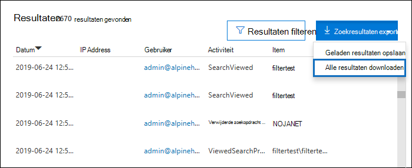
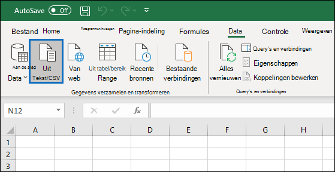
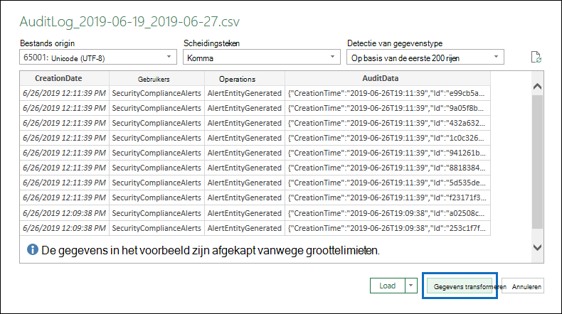
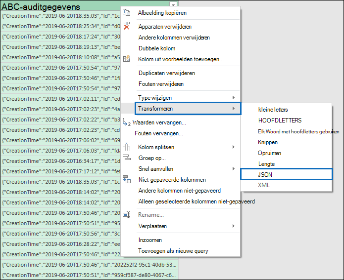

# <a name="export-configure-and-view-audit-log-records"></a><span data-ttu-id="d98a0-103">Auditlogboekrecords exporteren, configureren en weergeven</span><span class="sxs-lookup"><span data-stu-id="d98a0-103">Export, configure, and view audit log records</span></span>

<span data-ttu-id="d98a0-104">Nadat u in het auditlogboek hebt gezocht en de zoekresultaten hebt gedownload naar een CSV-bestand, bevat het bestand een kolom met de naam **AuditData,** die aanvullende informatie over elke gebeurtenis bevat.</span><span class="sxs-lookup"><span data-stu-id="d98a0-104">After you search the audit log and download the search results to a CSV file, the file contains a column named **AuditData**, which contains additional information about each event.</span></span> <span data-ttu-id="d98a0-105">De gegevens in deze kolom zijn opgemaakt als een JSON-object, dat meerdere eigenschappen bevat die zijn geconfigureerd als *eigenschap:waardeparen* gescheiden door komma's.</span><span class="sxs-lookup"><span data-stu-id="d98a0-105">The data in this column is formatted as a JSON object, which contains multiple properties that are configured as *property:value* pairs separated by commas.</span></span> <span data-ttu-id="d98a0-106">U kunt de functie JSON-transformatie in de Power Query-editor in Excel gebruiken om elke eigenschap in het JSON-object in de **kolom AuditData** te splitsen in meerdere kolommen, zodat elke eigenschap een eigen kolom heeft.</span><span class="sxs-lookup"><span data-stu-id="d98a0-106">You can use the JSON transform feature in the Power Query Editor in Excel to split each property in the JSON object in the **AuditData** column into multiple columns so that each property has its own column.</span></span> <span data-ttu-id="d98a0-107">Op deze manier kunt u sorteren en filteren op een of meer van deze eigenschappen, zodat u snel de specifieke controlegegevens kunt vinden die u zoekt.</span><span class="sxs-lookup"><span data-stu-id="d98a0-107">This lets you sort and filter on one or more of these properties, which can help you quickly locate the specific auditing data you're looking for.</span></span>

## <a name="step-1-export-audit-log-search-results"></a><span data-ttu-id="d98a0-108">Stap 1: Zoekresultaten van auditlogboek exporteren</span><span class="sxs-lookup"><span data-stu-id="d98a0-108">Step 1: Export audit log search results</span></span>

<span data-ttu-id="d98a0-109">De eerste stap is het zoeken in het auditlogboek en vervolgens de resultaten in een CSV-bestand (door komma's gescheiden) exporteren naar uw lokale computer.</span><span class="sxs-lookup"><span data-stu-id="d98a0-109">The first step is to search the audit log and then export the results in a comma-separated value (CSV) file to your local computer.</span></span>
  
1. <span data-ttu-id="d98a0-110">Voer een [zoekopdracht uit in een](search-the-audit-log-in-security-and-compliance.md#search-the-audit-log) auditlogboek en pas zo nodig de zoekcriteria aan totdat u de gewenste resultaten hebt.</span><span class="sxs-lookup"><span data-stu-id="d98a0-110">Run an [audit log search](search-the-audit-log-in-security-and-compliance.md#search-the-audit-log) and revise the search criteria if necessary until you have the desired results.</span></span>

2. <span data-ttu-id="d98a0-111">Klik **op Resultaten exporteren** en selecteer Alle resultaten **downloaden.**</span><span class="sxs-lookup"><span data-stu-id="d98a0-111">Click **Export results** and select **Download all results**.</span></span> 

   

   <span data-ttu-id="d98a0-113">Met deze optie exporteert u alle auditrecords uit de zoekopdracht in het auditlogboek die u in stap 1 hebt uitgevoerd en worden de onbewerkte gegevens uit het auditlogboek gedownload naar een CSV-bestand.</span><span class="sxs-lookup"><span data-stu-id="d98a0-113">This option to exports all the audit records from the audit log search you ran in step 1, and downloads the raw data from the audit log to a CSV file.</span></span> 

   <span data-ttu-id="d98a0-114">Onder aan het venster wordt een bericht weergegeven waarin u wordt gevraagd het CSV-bestand te openen of op te slaan.</span><span class="sxs-lookup"><span data-stu-id="d98a0-114">A message is displayed at the bottom of the window that prompts you to open or save the CSV file.</span></span> 

3. <span data-ttu-id="d98a0-115">Klik **op Opslaan > Opslaan als** en sla het CSV-bestand op uw lokale computer op.</span><span class="sxs-lookup"><span data-stu-id="d98a0-115">Click **Save > Save as** and save the CSV file to your local computer.</span></span> <span data-ttu-id="d98a0-116">Het duurt even voordat u veel zoekresultaten hebt gedownload.</span><span class="sxs-lookup"><span data-stu-id="d98a0-116">It takes a while to download many search results.</span></span> <span data-ttu-id="d98a0-117">Dit is meestal het geval bij het zoeken naar alle activiteiten of een breed datumbereik.</span><span class="sxs-lookup"><span data-stu-id="d98a0-117">This is typically the case when searching for all activities or a broad date range.</span></span> <span data-ttu-id="d98a0-118">Een bericht onder aan de vensters wordt weergegeven wanneer het CSV-bestand is gedownload.</span><span class="sxs-lookup"><span data-stu-id="d98a0-118">A message at the bottom of the windows is displayed when the CSV file is finished downloading.</span></span>

   

> [!NOTE]
  > <span data-ttu-id="d98a0-120">U kunt maximaal 50.000 vermeldingen (als gevolg van één zoekopdracht) in een CSV-bestand downloaden.</span><span class="sxs-lookup"><span data-stu-id="d98a0-120">You can download a maximum of 50,000 entries to a CSV file from a single audit log search.</span></span> <span data-ttu-id="d98a0-121">Als er 50.000 resultaten in het CSV-bestand zijn gedownload, kunt u aannemen dat er meer dan 50.000 gebeurtenissen zijn die aan de zoekcriteria voldoen.</span><span class="sxs-lookup"><span data-stu-id="d98a0-121">If 50,000 entries are downloaded to the CSV file, you can probably assume there are more than 50,000 events that met the search criteria.</span></span> <span data-ttu-id="d98a0-122">Als u meer dan deze limiet wilt exporteren, gebruikt u een datumbereik om het aantal auditlogboekrecords te verminderen.</span><span class="sxs-lookup"><span data-stu-id="d98a0-122">To export more than this limit, try using a date range to reduce the number of audit log records.</span></span> <span data-ttu-id="d98a0-123">Mogelijk moet u meerdere zoekopdrachten uitvoeren met kleinere datumbereiken als u meer dan 50.000 vermeldingen wilt exporteren.</span><span class="sxs-lookup"><span data-stu-id="d98a0-123">You might have to run multiple searches with smaller date ranges to export more than 50,000 entries.</span></span>

## <a name="step-2-format-the-exported-audit-log-using-the-power-query-editor"></a><span data-ttu-id="d98a0-124">Stap 2: Het geëxporteerde auditlogboek opmaken met de Power Query-editor</span><span class="sxs-lookup"><span data-stu-id="d98a0-124">Step 2: Format the exported audit log using the Power Query Editor</span></span>

<span data-ttu-id="d98a0-125">De volgende stap is het gebruik van de functie JSON-transformatie in de Power Query-editor in Excel om elke eigenschap in het JSON-object in de **kolom AuditData** te splitsen in een eigen kolom.</span><span class="sxs-lookup"><span data-stu-id="d98a0-125">The next step is to use the JSON transform feature in the Power Query Editor in Excel to split each property in the JSON object in the **AuditData** column into its own column.</span></span> <span data-ttu-id="d98a0-126">Vervolgens filtert u kolommen om records weer te geven op basis van de waarden van specifieke eigenschappen.</span><span class="sxs-lookup"><span data-stu-id="d98a0-126">Then you filter columns to view records based on the values of specific properties.</span></span> <span data-ttu-id="d98a0-127">Zo kunt u snel de specifieke controlegegevens vinden die u zoekt.</span><span class="sxs-lookup"><span data-stu-id="d98a0-127">This can help you quickly locate the specific auditing data you're looking for.</span></span>

1. <span data-ttu-id="d98a0-128">Open een lege werkmap in Excel voor Office 365, Excel 2019 of Excel 2016.</span><span class="sxs-lookup"><span data-stu-id="d98a0-128">Open a blank workbook in Excel for Office 365, Excel 2019, or Excel 2016.</span></span>

2. <span data-ttu-id="d98a0-129">Klik op **het** tabblad Gegevens in de groep **& gegevens transformeren** op Van **tekst/CSV.**</span><span class="sxs-lookup"><span data-stu-id="d98a0-129">On the **Data** tab, in the **Get & Transform Data** ribbon group, click **From Text/CSV**.</span></span>

    

3. <span data-ttu-id="d98a0-131">Open het CSV-bestand dat u hebt gedownload in stap 1.</span><span class="sxs-lookup"><span data-stu-id="d98a0-131">Open the CSV file that you downloaded in Step 1.</span></span>

4. <span data-ttu-id="d98a0-132">Klik in het weergegeven venster op **Gegevens transformeren.**</span><span class="sxs-lookup"><span data-stu-id="d98a0-132">In the window that's displayed, click **Transform Data**.</span></span>

   

   <span data-ttu-id="d98a0-134">Het CSV-bestand wordt geopend in de **queryeditor.**</span><span class="sxs-lookup"><span data-stu-id="d98a0-134">The CSV file is opened in the **Query Editor**.</span></span> <span data-ttu-id="d98a0-135">Er zijn vier kolommen: **CreationDate,** **UserIds,** **Operations** en **AuditData.**</span><span class="sxs-lookup"><span data-stu-id="d98a0-135">There are four columns: **CreationDate**, **UserIds**, **Operations**, and **AuditData**.</span></span> <span data-ttu-id="d98a0-136">De **kolom AuditData** is een JSON-object dat meerdere eigenschappen bevat.</span><span class="sxs-lookup"><span data-stu-id="d98a0-136">The **AuditData** column is a JSON object that contains multiple properties.</span></span> <span data-ttu-id="d98a0-137">De volgende stap is het maken van een kolom voor elke eigenschap in het JSON-object.</span><span class="sxs-lookup"><span data-stu-id="d98a0-137">The next step is to create a column for each property in the JSON object.</span></span>

5. <span data-ttu-id="d98a0-138">Klik met de rechtermuisknop op de titel in de **kolom AuditData,** klik **op Transformeren** en klik vervolgens op **JSON.**</span><span class="sxs-lookup"><span data-stu-id="d98a0-138">Right-click the title in the **AuditData** column, click **Transform**, and then click **JSON**.</span></span> 

   

6. <span data-ttu-id="d98a0-140">Klik in de rechterbovenhoek van de **kolom AuditData** op het pictogram Uitvuilen.</span><span class="sxs-lookup"><span data-stu-id="d98a0-140">In the upper-right corner of the **AuditData** column, click the expand icon.</span></span>

   

   <span data-ttu-id="d98a0-142">Er wordt een gedeeltelijke lijst met de eigenschappen in de JSON-objecten in de **kolom AuditData** weergegeven.</span><span class="sxs-lookup"><span data-stu-id="d98a0-142">A partial list of the properties in the JSON objects in the **AuditData** column is displayed.</span></span>

7. <span data-ttu-id="d98a0-143">Klik **op Meer laden** om alle eigenschappen weer te geven in de JSON-objecten in de kolom **AuditData.**</span><span class="sxs-lookup"><span data-stu-id="d98a0-143">Click **Load more** to display all properties in the JSON objects in the **AuditData** column.</span></span>

   

   <span data-ttu-id="d98a0-145">U kunt het selectievakje uitschakelen naast een eigenschap die u niet wilt opnemen.</span><span class="sxs-lookup"><span data-stu-id="d98a0-145">You can unselect the checkbox next to any property that you don't want to include.</span></span> <span data-ttu-id="d98a0-146">Het uitschakelen van kolommen die niet nuttig zijn voor uw onderzoek is een goede manier om de hoeveelheid gegevens die in het auditlogboek wordt weergegeven, te verminderen.</span><span class="sxs-lookup"><span data-stu-id="d98a0-146">Eliminating columns that aren't useful for your investigation is a good way to reduce the amount of data displayed in the audit log.</span></span> 

   > [!NOTE]
   > <span data-ttu-id="d98a0-147">De JSON-eigenschappen die worden weergegeven in de vorige schermafbeelding (nadat u op Meer laden hebt geklikt) zijn gebaseerd op de eigenschappen in de **kolom AuditData** van de eerste 1000 rijen in het CSV-bestand.</span><span class="sxs-lookup"><span data-stu-id="d98a0-147">The JSON properties displayed in the previous screenshot (after you click **Load more**) are based on the properties found in the **AuditData** column from the first 1,000 rows in the CSV file.</span></span> <span data-ttu-id="d98a0-148">Als records na de eerste 1000 rijen verschillende JSON-eigenschappen hebben, worden deze eigenschappen (en een bijbehorende kolom) niet opgenomen wanneer de **kolom AuditData** is gesplitst in meerdere kolommen.</span><span class="sxs-lookup"><span data-stu-id="d98a0-148">If there are different JSON properties in records after the first 1,000 rows, these properties (and a corresponding column) won't be included when the **AuditData** column is split into multiple columns.</span></span> <span data-ttu-id="d98a0-149">U kunt dit voorkomen door het zoeken in het auditlogboek opnieuw uit te voeren en de zoekcriteria te beperken, zodat er minder records worden geretourneerd.</span><span class="sxs-lookup"><span data-stu-id="d98a0-149">To help prevent this, consider re-running the audit log search and narrow the search criteria so that fewer records are returned.</span></span> <span data-ttu-id="d98a0-150">Een andere tijdelijke oplossing is  om items in de kolom Bewerkingen te filteren om het aantal rijen te verminderen (voordat u stap 5 hierboven uit te voeren) voordat u het JSON-object in de **kolom AuditData** transformeert.</span><span class="sxs-lookup"><span data-stu-id="d98a0-150">Another workaround is to filter items in the **Operations** column to reduce the number of rows (before you perform step 5 above) before transforming the JSON object in the **AuditData** column.</span></span>

   > [!TIP]
   > <span data-ttu-id="d98a0-151">Als u een kenmerk wilt weergeven in een lijst,  zoals AuditData.AffectedItems, klikt u op het pictogram Uitvijf in de rechterbovenhoek van de kolom waaruit u een kenmerk wilt trekken en selecteert u Vervolgens Uitvijf naar **nieuwe** rij.</span><span class="sxs-lookup"><span data-stu-id="d98a0-151">To view an attribute within a list such as AuditData.AffectedItems, click the **Expand** icon in the upper right corner of the column you want to pull an attribute from, and then select **Expand to New Row**.</span></span>  <span data-ttu-id="d98a0-152">Van hieruit wordt een record weergegeven  en kunt u in de rechterbovenhoek van de kolom op het pictogram Uitvuit klikken, de kenmerken bekijken en de kenmerken selecteren die u wilt weergeven of extraheren.</span><span class="sxs-lookup"><span data-stu-id="d98a0-152">From there it will be a record and you can click the **Expand** icon in the upper right corner of the column, view the attributes, and select the one you want to view or extract.</span></span>

8. <span data-ttu-id="d98a0-153">Ga op een van de volgende dingen te werk om de titel op te maken van de kolommen die worden toegevoegd voor elke JSON-eigenschap die is geselecteerd.</span><span class="sxs-lookup"><span data-stu-id="d98a0-153">Do one of the following things to format the title of the columns that are added for each JSON property that's selected.</span></span>

    - <span data-ttu-id="d98a0-154">Schakel het selectievakje **Oorspronkelijke kolomnaam als voorvoegsel gebruiken** als voorvoegsel uit om de naam van de eigenschap JSON als kolomnamen te gebruiken. Bijvoorbeeld **RecordType** of **SourceFileName.**</span><span class="sxs-lookup"><span data-stu-id="d98a0-154">Unselect the **Use original column name as prefix** checkbox to use the name of the JSON property as the column names; for example, **RecordType** or **SourceFileName**.</span></span>

    - <span data-ttu-id="d98a0-155">Laat het selectievakje Oorspronkelijke kolomnaam gebruiken als **voorvoegsel** ingeschakeld om het voorvoegsel AuditData toe te voegen aan de kolomnamen. bijvoorbeeld **AuditData.RecordType** of **AuditData.SourceFileName.**</span><span class="sxs-lookup"><span data-stu-id="d98a0-155">Leave the **Use original column name as prefix** checkbox selected to add the AuditData prefix to the column names; for example, **AuditData.RecordType** or **AuditData.SourceFileName**.</span></span>

9. <span data-ttu-id="d98a0-156">Klik op **OK**.</span><span class="sxs-lookup"><span data-stu-id="d98a0-156">Click **OK**.</span></span>

    <span data-ttu-id="d98a0-157">De **kolom AuditData** is gesplitst in meerdere kolommen.</span><span class="sxs-lookup"><span data-stu-id="d98a0-157">The **AuditData** column is split into multiple columns.</span></span> <span data-ttu-id="d98a0-158">Elke nieuwe kolom komt overeen met een eigenschap in het JSON-object AuditData.</span><span class="sxs-lookup"><span data-stu-id="d98a0-158">Each new column corresponds to a property in the AuditData JSON object.</span></span> <span data-ttu-id="d98a0-159">Elke rij in de kolom bevat de waarde voor de eigenschap.</span><span class="sxs-lookup"><span data-stu-id="d98a0-159">Each row in the column contains the value for the property.</span></span> <span data-ttu-id="d98a0-160">Als de eigenschap geen waarde bevat, wordt de *null-waarde* weergegeven.</span><span class="sxs-lookup"><span data-stu-id="d98a0-160">If the property doesn't contain a value, the *null* value is displayed.</span></span> <span data-ttu-id="d98a0-161">In Excel zijn cellen met null-waarden leeg.</span><span class="sxs-lookup"><span data-stu-id="d98a0-161">In Excel, cells with null values are empty.</span></span>
  
10. <span data-ttu-id="d98a0-162">Klik op **het** tabblad Start op **Sluiten & Laden** om de Power Query-editor te sluiten en het getransformeerde CSV-bestand in een Excel openen.</span><span class="sxs-lookup"><span data-stu-id="d98a0-162">On the **Home** tab, click **Close & Load** to close the Power Query Editor and open the transformed CSV file in an Excel workbook.</span></span>

## <a name="use-powershell-to-search-and-export-audit-log-records"></a><span data-ttu-id="d98a0-163">PowerShell gebruiken om auditlogboekrecords te doorzoeken en te exporteren</span><span class="sxs-lookup"><span data-stu-id="d98a0-163">Use PowerShell to search and export audit log records</span></span>

<span data-ttu-id="d98a0-164">In plaats van het zoekprogramma voor auditlogboek te gebruiken in het beveiligings- & compliancecentrum, kunt u de cmdlet [Search-UnifiedAuditLog](/powershell/module/exchange/search-unifiedauditlog) in Exchange Online PowerShell gebruiken om de resultaten van een zoekopdracht in een auditlogboek te exporteren naar een CSV-bestand.</span><span class="sxs-lookup"><span data-stu-id="d98a0-164">Instead of using the audit log search tool in the Security & Compliance Center, you can use the [Search-UnifiedAuditLog](/powershell/module/exchange/search-unifiedauditlog) cmdlet in Exchange Online PowerShell to export the results of an audit log search to a CSV file.</span></span> <span data-ttu-id="d98a0-165">Vervolgens kunt u dezelfde procedure volgen als in stap 2 om het auditlogboek op te maken met de Power Query-editor.</span><span class="sxs-lookup"><span data-stu-id="d98a0-165">Then you can follow the same procedure described in Step 2 to format the audit log using the Power Query editor.</span></span> <span data-ttu-id="d98a0-166">Een voordeel van het gebruik van de PowerShell-cmdlet is dat u gebeurtenissen van een bepaalde service kunt zoeken met de *parameter RecordType.*</span><span class="sxs-lookup"><span data-stu-id="d98a0-166">One advantage of using the PowerShell cmdlet is that you can search for events from a specific service by using the *RecordType* parameter.</span></span> <span data-ttu-id="d98a0-167">Hier zijn enkele voorbeelden van het gebruik van PowerShell om auditrecords te exporteren naar een CSV-bestand, zodat u de Power Query-editor kunt gebruiken om het JSON-object te transformeren in de **kolom AuditData,** zoals beschreven in stap 2.</span><span class="sxs-lookup"><span data-stu-id="d98a0-167">Here are few examples of using PowerShell to export audit records to a CSV file so you can use the Power Query editor to transform the JSON object in the **AuditData** column as described in Step 2.</span></span>

<span data-ttu-id="d98a0-168">Voer in dit voorbeeld de volgende opdrachten uit om alle records te retourneren die betrekking hebben op SharePoint delen.</span><span class="sxs-lookup"><span data-stu-id="d98a0-168">In this example, run the following commands to return all records related to SharePoint sharing operations.</span></span>

```powershell
$auditlog = Search-UnifiedAuditLog -StartDate 06/01/2019 -EndDate 06/30/2019 -RecordType SharePointSharingOperation
```

```powershell
$auditlog | Select-Object -Property CreationDate,UserIds,RecordType,AuditData | Export-Csv -Path c:\AuditLogs\PowerShellAuditlog.csv -NoTypeInformation
```

<span data-ttu-id="d98a0-169">De zoekresultaten worden geëxporteerd naar een CSV-bestand met de naam *PowerShellAuditlog* dat vier kolommen bevat: CreationDate, UserIds, RecordType, AuditData).</span><span class="sxs-lookup"><span data-stu-id="d98a0-169">The search results are exported to a CSV file named *PowerShellAuditlog* that contains four columns: CreationDate, UserIds, RecordType, AuditData).</span></span>

<span data-ttu-id="d98a0-170">U kunt ook de naam- of deumwaarde voor het recordtype gebruiken als de waarde voor de *parameter RecordType.*</span><span class="sxs-lookup"><span data-stu-id="d98a0-170">You can also use the name or enum value for the record type as the value for the *RecordType* parameter.</span></span> <span data-ttu-id="d98a0-171">Zie de tabel *AuditLogRecordType* in Office 365 [Management Activity API-schema voor](/office/office-365-management-api/office-365-management-activity-api-schema#enum-auditlogrecordtype---type-edmint32)een lijst met recordtypenamen en de bijbehorende enumwaarden.</span><span class="sxs-lookup"><span data-stu-id="d98a0-171">For a list of record type names and their corresponding enum values, see the *AuditLogRecordType* table in [Office 365 Management Activity API schema](/office/office-365-management-api/office-365-management-activity-api-schema#enum-auditlogrecordtype---type-edmint32).</span></span>

<span data-ttu-id="d98a0-172">U kunt slechts één waarde opnemen voor de *parameter RecordType.*</span><span class="sxs-lookup"><span data-stu-id="d98a0-172">You can only include a single value for the *RecordType* parameter.</span></span> <span data-ttu-id="d98a0-173">Als u wilt zoeken naar auditrecords voor andere recordtypen, moet u de twee vorige opdrachten opnieuw uitvoeren om een ander recordtype op te geven en deze resultaten toe te geven aan het oorspronkelijke CSV-bestand.</span><span class="sxs-lookup"><span data-stu-id="d98a0-173">To search for audit records for other record types, you have to run the two previous commands again to specify a different record type and append those results to the original CSV file.</span></span> <span data-ttu-id="d98a0-174">U voert bijvoorbeeld de volgende twee opdrachten uit om SharePoint bestandsactiviteiten uit hetzelfde datumbereik toe te voegen aan het PowerShellAuditlog.csv bestand.</span><span class="sxs-lookup"><span data-stu-id="d98a0-174">For example, you would run the following two commands to add SharePoint file activities from the same date range to the PowerShellAuditlog.csv file.</span></span>

```powershell
$auditlog = Search-UnifiedAuditLog -StartDate 06/01/2019 -EndDate 06/30/2019 -RecordType SharePointFileOperation
```

```powershell
$auditlog | Select-Object -Property CreationDate,UserIds,RecordType,AuditData | Export-Csv -Append -Path c:\AuditLogs\PowerShellAuditlog.csv -NoTypeInformation
```

## <a name="tips-for-exporting-and-viewing-the-audit-log"></a><span data-ttu-id="d98a0-175">Tips voor het exporteren en weergeven van het auditlogboek</span><span class="sxs-lookup"><span data-stu-id="d98a0-175">Tips for exporting and viewing the audit log</span></span>

<span data-ttu-id="d98a0-176">Hier vindt u enkele tips en voorbeelden van het exporteren en bekijken van het auditlogboek voor en nadat u de functie JSON-transformatie hebt gebruikt om de **kolom AuditData** in meerdere kolommen te splitsen.</span><span class="sxs-lookup"><span data-stu-id="d98a0-176">Here are some tips and examples of exporting and viewing the audit log before and after you use the JSON transform feature to split the **AuditData** column into multiple columns.</span></span>

- <span data-ttu-id="d98a0-177">Filter de **kolom RecordType** om alleen de records uit een specifiek service- of functioneel gebied weer te geven.</span><span class="sxs-lookup"><span data-stu-id="d98a0-177">Filter the **RecordType** column to display only the records from a specific service or functional area.</span></span> <span data-ttu-id="d98a0-178">Als u bijvoorbeeld gebeurtenissen wilt SharePoint delen, selecteert u **14** (deumwaarde voor records die worden geactiveerd door SharePoint activiteiten voor delen).</span><span class="sxs-lookup"><span data-stu-id="d98a0-178">For example, to show events related to SharePoint sharing, you would select **14** (the enum value for records triggered by SharePoint sharing activities).</span></span> <span data-ttu-id="d98a0-179">Zie Gedetailleerde eigenschappen in het [auditlogboek](detailed-properties-in-the-office-365-audit-log.md)voor een lijst met de services die overeenkomen met de opsommingswaarden die worden weergegeven in de **kolom RecordType.**</span><span class="sxs-lookup"><span data-stu-id="d98a0-179">For a list of the services that correspond to the enum values displayed in the **RecordType** column, see [Detailed properties in the audit log](detailed-properties-in-the-office-365-audit-log.md).</span></span>

- <span data-ttu-id="d98a0-180">Filter de **kolom Bewerkingen** om de records voor specifieke activiteiten weer te geven.</span><span class="sxs-lookup"><span data-stu-id="d98a0-180">Filter the **Operations** column to display the records for specific activities.</span></span> <span data-ttu-id="d98a0-181">Zie de sectie 'Gecontroleerde activiteiten' in Het auditlogboek zoeken in het beveiligings- & compliancecentrum voor een lijst met de meeste bewerkingen die overeenkomen met een doorzoekbare activiteit [& in](search-the-audit-log-in-security-and-compliance.md#audited-activities)het zoekprogramma voor auditlogboek.</span><span class="sxs-lookup"><span data-stu-id="d98a0-181">For a list of most operations that correspond to a searchable activity in the audit log search tool in the Security & Compliance Center, see the "Audited activities" section in [Search the audit log in the Security & Compliance Center](search-the-audit-log-in-security-and-compliance.md#audited-activities).</span></span>