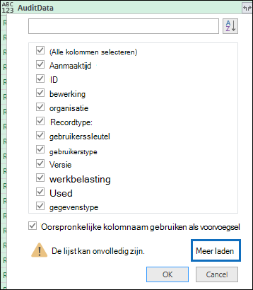

# <a name="export-configure-and-view-audit-log-records"></a>Auditlogboekrecords exporteren, configureren en weergeven

Nadat u in het auditlogboek hebt gezocht en de zoekresultaten hebt gedownload naar een CSV-bestand, bevat het bestand een kolom met de naam **AuditData,** die aanvullende informatie over elke gebeurtenis bevat. De gegevens in deze kolom zijn opgemaakt als een JSON-object, dat meerdere eigenschappen bevat die zijn geconfigureerd als *eigenschap:waardeparen* gescheiden door komma's. U kunt de functie JSON-transformatie in de Power Query-editor in Excel gebruiken om elke eigenschap in het JSON-object in de **kolom AuditData** te splitsen in meerdere kolommen, zodat elke eigenschap een eigen kolom heeft. Op deze manier kunt u sorteren en filteren op een of meer van deze eigenschappen, zodat u snel de specifieke controlegegevens kunt vinden die u zoekt.

## <a name="step-1-export-audit-log-search-results"></a>Stap 1: Zoekresultaten van auditlogboek exporteren

De eerste stap is het zoeken in het auditlogboek en vervolgens de resultaten in een CSV-bestand (door komma's gescheiden) exporteren naar uw lokale computer.
  
1. Voer een [zoekopdracht uit in een](search-the-audit-log-in-security-and-compliance.md#search-the-audit-log) auditlogboek en pas zo nodig de zoekcriteria aan totdat u de gewenste resultaten hebt.

2. Klik **op Resultaten exporteren** en selecteer Alle resultaten **downloaden.** 

   

   Met deze optie exporteert u alle auditrecords uit de zoekopdracht in het auditlogboek die u in stap 1 hebt uitgevoerd en worden de onbewerkte gegevens uit het auditlogboek gedownload naar een CSV-bestand. 

   Onder aan het venster wordt een bericht weergegeven waarin u wordt gevraagd het CSV-bestand te openen of op te slaan. 

3. Klik **op Opslaan > Opslaan als** en sla het CSV-bestand op uw lokale computer op. Het duurt even voordat u veel zoekresultaten hebt gedownload. Dit is meestal het geval bij het zoeken naar alle activiteiten of een breed datumbereik. Een bericht onder aan de vensters wordt weergegeven wanneer het CSV-bestand is gedownload.

   

> [!NOTE]
  > U kunt maximaal 50.000 items naar een CSV-bestand downloaden vanuit één zoekopdracht in een auditlogboek. Als 50.000 items worden gedownload naar het CSV-bestand, kunt u er waarschijnlijk van uitgaan dat er meer dan 50.000 gebeurtenissen zijn die voldoen aan de zoekcriteria. Als u meer dan deze limiet wilt exporteren, gebruikt u een datumbereik om het aantal auditlogboekrecords te verminderen. Mogelijk moet u meerdere zoekopdrachten uitvoeren met kleinere datumbereiken om meer dan 50.000 items te exporteren.

## <a name="step-2-format-the-exported-audit-log-using-the-power-query-editor"></a>Stap 2: Het geëxporteerde auditlogboek opmaken met de Power Query-editor

De volgende stap is het gebruik van de functie JSON-transformatie in de Power Query-editor in Excel om elke eigenschap in het JSON-object in de **kolom AuditData** te splitsen in een eigen kolom. Vervolgens filtert u kolommen om records weer te geven op basis van de waarden van specifieke eigenschappen. Zo kunt u snel de specifieke controlegegevens vinden die u zoekt.

1. Open een lege werkmap in Excel voor Office 365, Excel 2019 of Excel 2016.

2. Klik op **het** tabblad Gegevens in de groep **& gegevens transformeren** op Van **tekst/CSV.**

    

3. Open het CSV-bestand dat u hebt gedownload in stap 1.

4. Klik in het weergegeven venster op **Gegevens transformeren.**

   

   Het CSV-bestand wordt geopend in de **queryeditor.** Er zijn vier kolommen: **CreationDate,** **UserIds,** **Operations** en **AuditData.** De **kolom AuditData** is een JSON-object dat meerdere eigenschappen bevat. De volgende stap is het maken van een kolom voor elke eigenschap in het JSON-object.

5. Klik met de rechtermuisknop op de titel in de **kolom AuditData,** klik **op Transformeren** en klik vervolgens op **JSON.** 

   

6. Klik in de rechterbovenhoek van de **kolom AuditData** op het pictogram Uitvuilen.

   

   Er wordt een gedeeltelijke lijst met de eigenschappen in de JSON-objecten in de **kolom AuditData** weergegeven.

7. Klik **op Meer laden** om alle eigenschappen weer te geven in de JSON-objecten in de kolom **AuditData.**

   

   U kunt het selectievakje uitschakelen naast een eigenschap die u niet wilt opnemen. Het uitschakelen van kolommen die niet nuttig zijn voor uw onderzoek is een goede manier om de hoeveelheid gegevens die in het auditlogboek wordt weergegeven, te verminderen. 

   > [!NOTE]
   > De JSON-eigenschappen die worden weergegeven in de vorige schermafbeelding (nadat u op Meer laden hebt geklikt) zijn gebaseerd op de eigenschappen in de **kolom AuditData** van de eerste 1000 rijen in het CSV-bestand. Als records na de eerste 1000 rijen verschillende JSON-eigenschappen hebben, worden deze eigenschappen (en een bijbehorende kolom) niet opgenomen wanneer de **kolom AuditData** is gesplitst in meerdere kolommen. U kunt dit voorkomen door het zoeken in het auditlogboek opnieuw uit te voeren en de zoekcriteria te beperken, zodat er minder records worden geretourneerd. Een andere tijdelijke oplossing is  om items in de kolom Bewerkingen te filteren om het aantal rijen te verminderen (voordat u stap 5 hierboven uit te voeren) voordat u het JSON-object in de **kolom AuditData** transformeert.

   > [!TIP]
   > Als u een kenmerk wilt weergeven in een lijst,  zoals AuditData.AffectedItems, klikt u op het pictogram Uitvijf in de rechterbovenhoek van de kolom waaruit u een kenmerk wilt trekken en selecteert u Vervolgens Uitvijf naar **nieuwe** rij.  Van hieruit wordt een record weergegeven  en kunt u in de rechterbovenhoek van de kolom op het pictogram Uitvuit klikken, de kenmerken bekijken en de kenmerken selecteren die u wilt weergeven of extraheren.

8. Ga op een van de volgende dingen te werk om de titel op te maken van de kolommen die worden toegevoegd voor elke JSON-eigenschap die is geselecteerd.

    - Schakel het selectievakje **Oorspronkelijke kolomnaam als voorvoegsel gebruiken** als voorvoegsel uit om de naam van de eigenschap JSON als kolomnamen te gebruiken. Bijvoorbeeld **RecordType** of **SourceFileName.**

    - Laat het selectievakje Oorspronkelijke kolomnaam gebruiken als **voorvoegsel** ingeschakeld om het voorvoegsel AuditData toe te voegen aan de kolomnamen. bijvoorbeeld **AuditData.RecordType** of **AuditData.SourceFileName.**

9. Klik op **OK**.

    De **kolom AuditData** is gesplitst in meerdere kolommen. Elke nieuwe kolom komt overeen met een eigenschap in het JSON-object AuditData. Elke rij in de kolom bevat de waarde voor de eigenschap. Als de eigenschap geen waarde bevat, wordt de *null-waarde* weergegeven. In Excel zijn cellen met null-waarden leeg.
  
10. Klik op **het** tabblad Start op **Sluiten & Laden** om de Power Query-editor te sluiten en het getransformeerde CSV-bestand in een Excel openen.

## <a name="use-powershell-to-search-and-export-audit-log-records"></a>PowerShell gebruiken om auditlogboekrecords te doorzoeken en te exporteren

In plaats van het zoekprogramma voor auditlogboek te gebruiken in het beveiligings- & compliancecentrum, kunt u de cmdlet [Search-UnifiedAuditLog](/powershell/module/exchange/search-unifiedauditlog) in Exchange Online PowerShell gebruiken om de resultaten van een zoekopdracht in een auditlogboek te exporteren naar een CSV-bestand. Vervolgens kunt u dezelfde procedure volgen als in stap 2 om het auditlogboek op te maken met de Power Query-editor. Een voordeel van het gebruik van de PowerShell-cmdlet is dat u gebeurtenissen van een bepaalde service kunt zoeken met de *parameter RecordType.* Hier zijn enkele voorbeelden van het gebruik van PowerShell om auditrecords te exporteren naar een CSV-bestand, zodat u de Power Query-editor kunt gebruiken om het JSON-object te transformeren in de **kolom AuditData,** zoals beschreven in stap 2.

Voer in dit voorbeeld de volgende opdrachten uit om alle records te retourneren die betrekking hebben op SharePoint delen.

```powershell
$auditlog = Search-UnifiedAuditLog -StartDate 06/01/2019 -EndDate 06/30/2019 -RecordType SharePointSharingOperation
```

```powershell
$auditlog | Select-Object -Property CreationDate,UserIds,RecordType,AuditData | Export-Csv -Path c:\AuditLogs\PowerShellAuditlog.csv -NoTypeInformation
```

De zoekresultaten worden geëxporteerd naar een CSV-bestand met de naam *PowerShellAuditlog* dat vier kolommen bevat: CreationDate, UserIds, RecordType, AuditData).

U kunt ook de naam- of deumwaarde voor het recordtype gebruiken als de waarde voor de *parameter RecordType.* Zie de tabel *AuditLogRecordType* in Office 365 [Management Activity API-schema voor](/office/office-365-management-api/office-365-management-activity-api-schema#enum-auditlogrecordtype---type-edmint32)een lijst met recordtypenamen en de bijbehorende enumwaarden.

U kunt slechts één waarde opnemen voor de *parameter RecordType.* Als u wilt zoeken naar auditrecords voor andere recordtypen, moet u de twee vorige opdrachten opnieuw uitvoeren om een ander recordtype op te geven en deze resultaten toe te geven aan het oorspronkelijke CSV-bestand. U voert bijvoorbeeld de volgende twee opdrachten uit om SharePoint bestandsactiviteiten uit hetzelfde datumbereik toe te voegen aan het PowerShellAuditlog.csv bestand.

```powershell
$auditlog = Search-UnifiedAuditLog -StartDate 06/01/2019 -EndDate 06/30/2019 -RecordType SharePointFileOperation
```

```powershell
$auditlog | Select-Object -Property CreationDate,UserIds,RecordType,AuditData | Export-Csv -Append -Path c:\AuditLogs\PowerShellAuditlog.csv -NoTypeInformation
```

## <a name="tips-for-exporting-and-viewing-the-audit-log"></a>Tips voor het exporteren en weergeven van het auditlogboek

Hier vindt u enkele tips en voorbeelden van het exporteren en bekijken van het auditlogboek voor en nadat u de functie JSON-transformatie hebt gebruikt om de **kolom AuditData** in meerdere kolommen te splitsen.

- Filter de **kolom RecordType** om alleen de records uit een specifiek service- of functioneel gebied weer te geven. Als u bijvoorbeeld gebeurtenissen wilt SharePoint delen, selecteert u **14** (deumwaarde voor records die worden geactiveerd door SharePoint activiteiten voor delen). Zie Gedetailleerde eigenschappen in het [auditlogboek](detailed-properties-in-the-office-365-audit-log.md)voor een lijst met de services die overeenkomen met de opsommingswaarden die worden weergegeven in de **kolom RecordType.**

- Filter de **kolom Bewerkingen** om de records voor specifieke activiteiten weer te geven. Zie de sectie 'Gecontroleerde activiteiten' in Het auditlogboek zoeken in het beveiligings- & compliancecentrum voor een lijst met de meeste bewerkingen die overeenkomen met een doorzoekbare activiteit [& in](search-the-audit-log-in-security-and-compliance.md#audited-activities)het zoekprogramma voor auditlogboek.