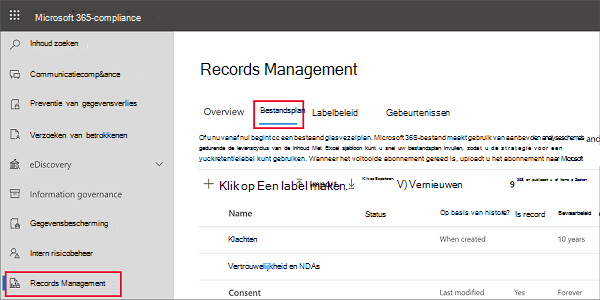
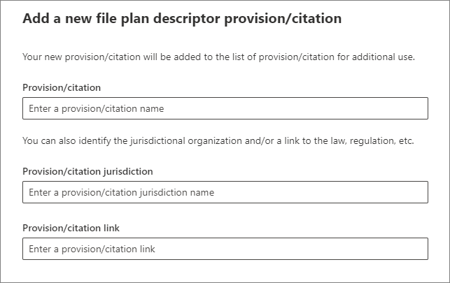
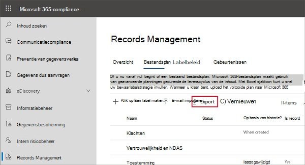
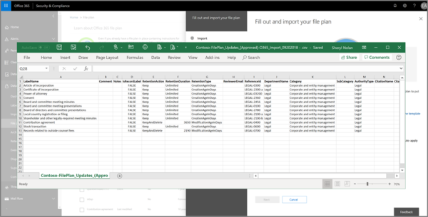
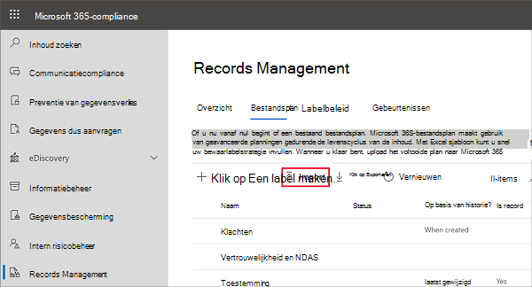
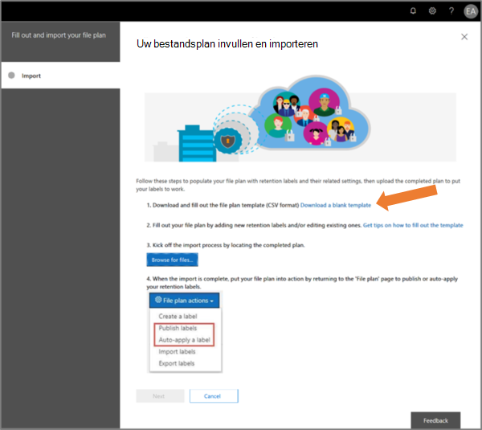
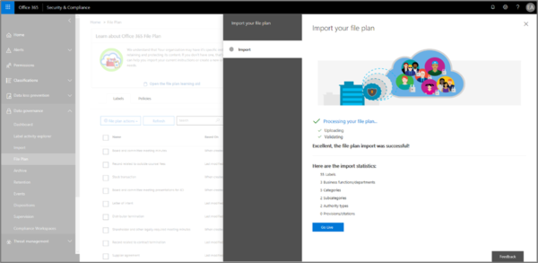

# Bestandsplan gebruiken voor het beheren van retentielabels

>*[Richtlijnen voor Microsoft 365-licenties voor beveiliging en compliance](/office365/servicedescriptions/microsoft-365-service-descriptions/microsoft-365-tenantlevel-services-licensing-guidance/microsoft-365-security-compliance-licensing-guidance).*

Hoewel u in het Microsoft 365-compliancecentrum retentielabels kunt maken en beheren vanuit **Information Governance**, beschikt het bestandsplan van **Recordbeheer** over extra beheermogelijkheden:

- U kunt bulksgewijs retentielabels maken door de relevante informatie uit een spreadsheet te importeren.

- U kunt de informatie uit bestaande retentielabels exporteren voor analyse en offline samenwerking.

- Er wordt meer informatie over de retentielabels weergegeven, zodat u de instellingen van al uw retentielabels beter kunt zien in één weergave.

- Beschrijvingen van bestandsplannen ondersteunen aanvullende en optionele informatie voor elk label.

Bestandsplan kan worden gebruikt voor alle retentielabels, zelfs als ze inhoud niet als record markeren.

Zie [Meer informatie over bewaarbeleid en retentielabels](retention.md) voor informatie over wat retentielabels zijn en hoe u deze kunt gebruiken.

## Bestandsplan openen

U moet een van de volgende beheerdersrollen hebben om toegang te krijgen tot een bestandsplan:
    
- Retentiebeheerder

- Retentiebeheerder alleen-weergeven

Ga in het Microsoft 365-compliancecentrum naar **Oplossingen** > **Recordbeheer** > **Bestandsplan**. 

Als **Recordbeheer** niet in het navigatiedeelvenster wordt weergegeven, moet u eerst omlaag schuiven en **Alle records weergeven** selecteren.

## Navigeren in uw bestandsplan

Als u al retentielabels via **informatiebeheer** in het Microsoft 365-compliancecentrum hebt gemaakt, worden deze labels automatisch weergegeven in uw bestandsplan. 

Als u nu retentielabels in het bestandsplan maakt, zijn deze ook beschikbaar via **Informatiebeheer** als de labels niet zijn geconfigureerd om inhoud als record te markeren.

Op de pagina **Bestandsplan** ziet u al uw labels met hun status en instellingen, optionele beschrijvingen voor het bestandsplan, een exportoptie voor het analyseren of inschakelen van offlinebeoordelingen van uw labels en een importoptie om retentielabels te maken. 

### Kolommen met labelinstellingen

Alle kolommen behalve het label **Naam** kunnen worden weergegeven of verborgen door de optie **Kolommen aanpassen** te selecteren. Standaard worden in de eerste paar kolommen echter gegevens over de labelstatus en de instellingen weergegeven: 

- **Status** geeft aan of het label wel of niet is opgenomen in een labelbeleid of beleid voor automatisch toepassen (**Actief**) of niet (**Inactief**).

- **Gebaseerd op** geeft aan hoe en wanneer de bewaarperiode begint. Geldige waarden:
    - Gebeurtenis
    - Wanneer gemaakt
    - Laatst gewijzigd
    - Wanneer gelabeld

- **Is een record** geeft aan of het item is gemarkeerd als een record wanneer het label wordt toegepast. Geldige waarden:
    - Nee
    - Ja
    - Ja (regelgeving)

- **Retentieduur** geeft de retentieperiode aan. Geldige waarden:
    - Dagen
    - Maanden
    - Jaren
    - Voor altijd
    - Geen

- **Verwijderingstype** geeft aan wat er met de inhoud gebeurt aan het einde van de bewaarperiode. Geldige waarden:
    - Geen actie
    - Automatisch verwijderen
    - Controle vereist

### Kolommen met beschrijvingen voor het bestandsplan

Met een bestandsplan kunt u meer informatie opnemen als onderdeel van uw retentielabels. Deze beschrijvingen van het bestandsplan bieden meer opties om de beheerbaarheid en organisatie te verbeteren van de inhoud die u van een label wilt voorzien.

Standaard worden in de volgende kolommen, te beginnen met **Verwijzings-id**, deze optionele beschrijvingen voor het bestandsplan weergegeven die u kunt opgeven wanneer u een retentielabel maakt of een bestaand label bewerkt. 

Om u op weg te helpen, zijn er enkele kant-en-klare waarden voor de volgende beschrijvingen van het bestandsplan: 
- Bedrijfsfunctie/afdeling
- Categorie
- Type Instantie
- Inrichting/bronvermelding 

Voorbeeld van beschrijvingen van het bestandsplan wanneer u een retentielabel maakt of bewerkt:

Wanneer u **Kiezen** selecteert voor elk van deze optionele descriptors, kunt u een van de standaardwaarden selecteren of uw eigen waarden maken en deze vervolgens selecteren. Bijvoorbeeld: 

## Alle retentielabels exporteren om offlinebeoordelingen te analyseren of in te stellen

U kunt vanuit uw bestandsplan de details van alle retentielabels exporteren naar een CSV-bestand, zodat u periodieke nalevingsbeoordelingen kunt uitvoeren met belanghebbenden voor gegevensbeheer in uw organisatie.

Ga als volgt te werk om alle retentielabels te exporteren: klik op de pagina **Bestandsplan** op **Exporteren**:

Er wordt een *.CSV-bestand geopend dat alle bestaande retentielabels bevat. Bijvoorbeeld:

## Retentielabels importeren in uw bestandsplan

In het bestandsplan kunt u bulksgewijs nieuwe retentielabels importeren met behulp van een .CSV-bestand met een specifieke indeling: 

1. Klik op pagina **Bestandsplan** op **Importeren** om de pagina **Uw bestandsplan invullen en importeren** te gebruiken:

   

   

2. Download een lege sjabloon zoals aangegeven:

   

3. Vul de sjabloon in met behulp van de volgende informatie die de eigenschappen en geldige waarden voor elke eigenschap beschrijft. Voor het importeren hebben sommige waarden een maximale lengte:
    
    - **LabelName**: maximaal 64 tekens
    - **Opmerkingen** en **Notities**: maximaal 1024 tekens
    - Alle overige waarden: onbeperkte lengte
     
    
   |Eigenschap|Type|Vereist|Geldige waarden|
   |:-----|:-----|:-----|:-----|
   |LabelName|Tekenreeks|Ja|Met deze eigenschap geeft u de naam van het retentielabel op. Deze moet uniek zijn in uw tenant.|
   |Opmerking|Tekenreeks|Nee|Gebruik deze eigenschap om een beschrijving van het retentielabel toe te voegen voor beheerders. Deze beschrijving wordt alleen weergegeven voor beheerders die het retentielabel beheren in het compliancecentrum.|
   |Opmerkingen|Tekenreeks|Nee|Gebruik deze eigenschap om een beschrijving van het retentielabel toe te voegen voor gebruikers. Deze beschrijving wordt weergegeven wanneer gebruikers met de muisaanwijzer over het label gaan in apps zoals Outlook, SharePoint en OneDrive. Als u deze eigenschap leeg laat, wordt een standaardbeschrijving weergegeven waarin de retentie-instellingen voor het label worden uitgelegd. |
   |IsRecordLabel|Tekenreeks|Nee, tenzij **Regelgevend** is **WAAR**|Met deze eigenschap wordt opgegeven of het label de inhoud markeert als een record. Geldige waarden zijn: **WAAR**: het label markeert het item als een record en hierdoor kan het item niet worden verwijderd.  **ONWAAR**: het label markeert de inhoud niet als record. Dit is de standaardwaarde.     Groepsafhankelijkheden: als deze eigenschap is opgegeven, moeten ook RetentionAction, RetentionDuration en RetentionType worden opgegeven.|
   |RetentionAction|Tekenreeks|Nee, tenzij **RetentionDuration**, **RetentionType** of **ReviewerEmail** zijn opgegeven|Deze eigenschap geeft aan welke actie moet worden ondernomen nadat de waarde die is opgegeven in de eigenschap RetentionDuration verloopt. Geldige waarden zijn: **Verwijderen**: items die ouder zijn dan de waarde die is opgegeven met de eigenschap RetentionDuration worden verwijderd. **Behouden**: behoud items voor de duur die is opgegeven in de eigenschap RetentionDuration en doe niets wanneer de periode verloopt.  **BehoudenEnVerwijderen**: behoud items voor de duur die is opgegeven in de eigenschap RetentionDuration en verwijder ze wanneer de periode verloopt.     Groepsafhankelijkheden: als deze eigenschap is opgegeven, moeten ook RetentionDuration en RetentionType worden opgegeven. |
   |RetentionDuration|Tekenreeks|Nee, tenzij **RetentionAction** of **RetentionType** zijn opgegeven|Met deze eigenschap wordt het aantal dagen opgegeven dat de inhoud moet worden bewaard. Geldige waarden zijn: **Onbeperkt**: items worden voor onbepaalde tijd bewaard.  **_n_*: een positief geheel getal in dagen; bijvoorbeeld **365**. Het maximaal ondersteunde aantal is 24.855, dat is 68 jaar. Als u langer dan dit maximum nodig hebt, gebruikt u in plaats daarvan Onbeperkt.    Groepsafhankelijkheden: als deze eigenschap is opgegeven, moeten ook RetentionAction en RetentionType worden opgegeven.
   |RetentionType|Tekenreeks|Nee, tenzij **RetentionAction** of **RetentionDuration** zijn opgegeven|Met deze eigenschap geeft u op of de retentieduur (indien opgegeven) wordt berekend op basis van de aanmaakdatum, gebeurtenisdatum, gelabelde datum of datum van laatste wijziging. Geldige waarden zijn:  **CreationAgeInDays** **EventAgeInDays** **TaggedAgeInDays** **ModificationAgeInDays**     Groepsafhankelijkheden: als deze eigenschap is opgegeven, moeten ook RetentionAction en RetentionDuration worden opgegeven.|
   |ReviewerEmail|SmtpAddress|Nee|Wanneer deze eigenschap is opgegeven, wordt een verwijderingsbeoordeling geactiveerd wanneer de bewaarperiode verloopt. Met deze eigenschap geeft u het e-mailadres van een revisor op voor de bewaaractie **KeepAndDelete**.     U kunt het e-mailadres van afzonderlijke gebruikers, distributiegroepen of beveiligingsgroepen in uw tenant opnemen. Geef meerdere e-mailadressen op door deze te scheiden met puntkomma's.     Groepsafhankelijkheden: wanneer deze eigenschap is opgegeven, moeten ook **RetentionAction** (moet zijn **KeepAndDelete**), **RetentionDuration** en **RetentionType** worden opgegeven.|
   |ReferenceId|Tekenreeks|Nee|Deze eigenschap geeft de waarde op die wordt weergegeven in de beschrijving **Verwijzings-id** van het bestandsplan. U kunt deze als unieke waarde voor uw organisatie gebruiken.| 
   |DepartmentName|Tekenreeks|Nee|Deze eigenschap geeft de waarde op die wordt weergegeven in de beschrijving **Functie/afdeling** van het bestandsplan.|
   |Categorie|Tekenreeks|Nee|Deze eigenschap geeft de waarde op die wordt weergegeven in de beschrijving **Categorie** van het bestandsplan.|
   |Subcategorie|Tekenreeks|Nee|Deze eigenschap geeft de waarde op die wordt weergegeven in de beschrijving **Subcategorie** van het bestandsplan.|
   |AuthorityType|Tekenreeks|Nee|Deze eigenschap geeft de waarde op die wordt weergegeven in de beschrijving **Type Instantie** van het bestandsplan.|
   |CitationName|Tekenreeks|Nee|Met deze eigenschap geeft u de naam op van de bronvermelding die wordt weergegeven in de beschrijving **Inrichting/bronvermelding** van het bestandsplan. Bijvoorbeeld 'Sarbanes-Oxley Act van 2002'. |
   |CitationUrl|Tekenreeks|Nee|Met deze eigenschap geeft u de URL op die wordt weergegeven in de beschrijving **Inrichting/bronvermelding** van het bestandsplan.|
   |CitationJurisdiction|Tekenreeks|Nee|Met deze eigenschap geeft u het rechtsgebied of de instantie op die wordt weergegeven in de beschrijving **Inrichting/bronvermelding** van het bestandsplan. Bijvoorbeeld 'U.S. Securities and Exchange Commission (SEC)'.|
   |Wettelijk verplicht|Tekenreeks|Nee|Met deze eigenschap geeft u op of de inhoud door het label wordt gemarkeerd als een regelgevingsrecord. Dit is [meer beperkende](records-management.md#compare-restrictions-for-what-actions-are-allowed-or-blocked) dan een record. Als u deze labelconfiguratie wilt gebruiken, moet uw tenant zijn geconfigureerd om [de optie weer te geven om inhoud te markeren als een regelgevingsrecord](declare-records.md#how-to-display-the-option-to-mark-content-as-a-regulatory-record), anders mislukt de importvalidatie. Geldige waarden zijn:  **TRUE**: het label markeert het item als een regelgevingsrecord. U moet ook de eigenschap **IsRecordLabel** instellen op TRUE. **ONWAAR**: het label markeert de inhoud niet als record. Dit is de standaardwaarde.|
   |EventType|Tekenreeks|Nee, tenzij **RetentionType** gelijk is aan **EventAgeInDays**|Met deze eigenschap geeft u een gebeurtenistype op dat wordt gebruikt voor [retentie op basis van gebeurtenissen](event-driven-retention.md). Geef een bestaand gebeurtenistype op dat wordt weergegeven in **Recordbeheer** > **Gebeurtenissen** > **Gebeurtenistypen beheren**. U kunt ook de cmdlet [Get-ComplianceRetentionEventType](/powershell/module/exchange/get-complianceretentioneventtype) gebruiken om de beschikbare gebeurtenistypen weer te geven. Hoewel er enkele ingebouwde gebeurtenistypen zijn, zoals **Werknemersactiviteit** en **Levensduur van het product**, kunt u ook uw eigen gebeurtenistypen maken.     Als u uw eigen gebeurtenistype opgeeft, moet dit bestaan vóór de import, omdat de naam wordt gevalideerd als onderdeel van het importproces.|
   |||

   Hier is een voorbeeld van de sjabloon met informatie over retentielabels.

   

4. Klik onder stap 3 op de pagina **Uw bestandsplan invullen en importeren** op **Bestanden zoeken** om de ingevulde sjabloon te uploaden en selecteer vervolgens **Volgende**.

   Bestandsplan uploadt het bestand en valideert de invoer, waarbij de importstatistieken worden weergegeven.

   

5. Afhankelijk van de validatieresultaten doet u het volgende:
    
    - Als de validatie mislukt: noteer het rijnummer en de kolomnaam die u wilt corrigeren in het importbestand. Selecteer **Sluiten** en vervolgens **Ja** om te bevestigen. Corrigeer de fouten in het bestand en sla het op, selecteer de optie **Importeren** opnieuw en ga terug naar stap 4.
    
    - Als de validatie is geslaagd: u kunt **Go Live** selecteren om de retentielabels beschikbaar te maken in uw tenant. Of kies het pictogram Sluiten voor de pagina en **Ja** om te bevestigen dat u de wizard wilt sluiten zonder de bewaarlabels op dit moment beschikbaar te maken in uw tenant.

Wanneer de geïmporteerde labels worden toegevoegd aan uw tenant, kunt u ze nu beschikbaar maken voor gebruikers door ze te publiceren of automatisch toe te passen. U kunt beide doen op het tabblad **Labelbeleid** en vervolgens **Labels publiceren** kiezen of **een label automatisch toepassen**.

## Volgende stappen

Zie de volgende instructies voor meer informatie over het maken en bewerken van retentielabelks en hun beleid:
- [Retentielabels maken en deze toepassen in apps](create-apply-retention-labels.md)
- [Een retentielabel automatisch toepassen op inhoud](apply-retention-labels-automatically.md)