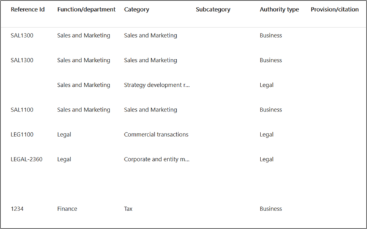
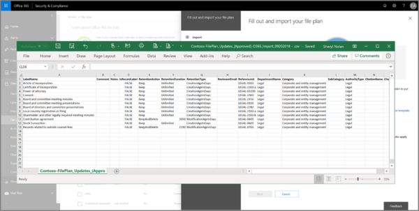

# Bestandsplan gebruiken voor het beheren van retentielabels

>*[Richtlijnen voor Microsoft 365-licenties voor beveiliging en compliance](/office365/servicedescriptions/microsoft-365-service-descriptions/microsoft-365-tenantlevel-services-licensing-guidance/microsoft-365-security-compliance-licensing-guidance).*

Hoewel u in het Microsoft 365-compliancecentrum retentielabels kunt maken en beheren vanuit **Information Governance**, beschikt het bestandsplan van **Recordbeheer** over extra beheermogelijkheden:

- U kunt bulksgewijs retentielabels maken door de relevante informatie uit een spreadsheet te importeren.

- U kunt de gegevens van bestaande retentielabels exporteren voor analyse en offlinesamenwerking of voor bulkbewerking.

- Er wordt meer informatie over de retentielabels weergegeven, zodat u de instellingen van al uw retentielabels beter kunt zien in één weergave.

- Beschrijvingen van bestandsplannen ondersteunen aanvullende en optionele informatie voor elk label.

Bestandsplan kan worden gebruikt voor alle retentielabels, zelfs als ze inhoud niet als record markeren.

Zie [Meer informatie over bewaarbeleid en retentielabels](retention.md) voor informatie over wat retentielabels zijn en hoe u deze kunt gebruiken.

## Bestandsplan openen

U moet een van de volgende beheerdersrollen hebben om toegang te krijgen tot een bestandsplan:
    
- Retentiebeheerder

- Retentiebeheerder alleen-weergeven

Ga in het Microsoft 365-compliancecentrum naar **Oplossingen** > **Recordbeheer** > **Bestandsplan**. 

Als **Recordbeheer** niet in het navigatiedeelvenster wordt weergegeven, moet u eerst omlaag schuiven en **Alle records weergeven** selecteren.

## Navigeren in uw bestandsplan

Als u al retentielabels via **informatiebeheer** in het Microsoft 365-compliancecentrum hebt gemaakt, worden deze labels automatisch weergegeven in uw bestandsplan. 

Als u nu retentielabels in het bestandsplan maakt, zijn deze ook beschikbaar via **Informatiebeheer** als de labels niet zijn geconfigureerd om inhoud als record te markeren.

Op de pagina **Bestandsplan** ziet u al uw labels met hun status en instellingen, optionele beschrijvingen voor het bestandsplan, een exportoptie voor het analyseren of inschakelen van offlinebeoordelingen van uw labels en een importoptie om retentielabels te maken. 

### Kolommen met labelinstellingen

Alle kolommen behalve het label **Naam** kunnen worden weergegeven of verborgen door de optie **Kolommen aanpassen** te selecteren. Standaard worden in de eerste paar kolommen echter gegevens over de labelstatus en de instellingen weergegeven: 

- **Status** geeft aan of het label wel of niet is opgenomen in een labelbeleid of beleid voor automatisch toepassen (**Actief**) of niet (**Inactief**).

- **Gebaseerd op** geeft aan hoe en wanneer de bewaarperiode begint. Geldige waarden:
    - Gebeurtenis
    - Wanneer gemaakt
    - Laatst gewijzigd
    - Wanneer gelabeld

- **Is een record** geeft aan of het item is gemarkeerd als een record wanneer het label wordt toegepast. Geldige waarden:
    - Nee
    - Ja
    - Ja (regelgeving)

- **Retentieduur** geeft de retentieperiode aan. Geldige waarden:
    - Dagen
    - Maanden
    - Jaren
    - Voor altijd
    - Geen

- **Verwijderingstype** geeft aan wat er met de inhoud gebeurt aan het einde van de bewaarperiode. Geldige waarden:
    - Geen actie
    - Automatisch verwijderen
    - Controle vereist

### Kolommen met beschrijvingen voor het bestandsplan

Met een bestandsplan kunt u meer informatie opnemen als onderdeel van uw retentielabels. Deze beschrijvingen van het bestandsplan bieden meer opties om de beheerbaarheid en organisatie te verbeteren van de inhoud die u van een label wilt voorzien.

Standaard worden in de volgende kolommen, te beginnen met **Verwijzings-id**, deze beschrijvingen voor het bestandsplan weergegeven die u kunt opgeven wanneer u een retentielabel maakt of een bestaand label bewerkt. 

Om u op weg te helpen, zijn er enkele kant-en-klare waarden voor de volgende beschrijvingen van het bestandsplan: 
- Bedrijfsfunctie/afdeling
- Categorie
- Type Instantie
- Inrichting/bronvermelding 

Voorbeeld van beschrijvingen van het bestandsplan wanneer u een retentielabel maakt of bewerkt:

Voorbeeldweergave van de kolommen in het bestandsplan:

## Alle retentielabels exporteren om offlinebeoordelingen te analyseren of in te stellen

U kunt vanuit uw bestandsplan de details van alle retentielabels exporteren naar een CSV-bestand, zodat u periodieke nalevingsbeoordelingen kunt uitvoeren met belanghebbenden voor gegevensbeheer in uw organisatie.

Ga als volgt te werk om alle retentielabels te exporteren: klik op de pagina **Bestandsplan** op **Exporteren**:

Er wordt een CSV-bestand geopend dat alle bestaande retentielabels bevat. Bijvoorbeeld:

## Retentielabels importeren in uw bestandsplan

U kunt in het bestandsplan bulksgewijs nieuwe retentielabels importeren en op dezelfde manier bestaande retentielabels bulksgewijs wijzigen.

Nieuwe retentielabels importeren en bestaande retentielabels wijzigen: 

1. Klik op pagina **Bestandsplan** op **Importeren** om de pagina **Uw bestandsplan invullen en importeren** te gebruiken:

   

   

2. Download een lege sjabloon om nieuwe retentielabels te importeren. U kunt ook beginnen met het CSV-bestand dat wordt geëxporteerd wanneer u de bestaande retentielabels in uw organisatie exporteert.

   

3. Vul de volgende informatie, die de eigenschappen en geldige waarden voor elke eigenschap beschrijft, in de sjabloon in. Voor het importeren hebben sommige waarden een maximale lengte:
    
    - **LabelName**: maximaal 64 tekens
    - **Opmerkingen** en **Notities**: maximaal 1024 tekens
    - Alle overige waarden: onbeperkte lengte
     
    
   |Eigenschap|Type|Geldige waarden|
   |:-----|:-----|:-----|
   |LabelName|Tekenreeks|Met deze eigenschap wordt de naam van het retentielabel opgegeven.|
   |Opmerking|Tekenreeks|Gebruik deze eigenschap om een beschrijving van het retentielabel toe te voegen voor beheerders. Deze beschrijving wordt alleen weergegeven voor beheerders die het retentielabel beheren in het compliancecentrum.|
   |Opmerkingen|Tekenreeks|Gebruik deze eigenschap om een beschrijving van het retentielabel toe te voegen voor gebruikers. Deze beschrijving wordt weergegeven wanneer gebruikers met de muisaanwijzer over het label gaan in apps zoals Outlook, SharePoint en OneDrive. Als u deze eigenschap leeg laat, wordt een standaardbeschrijving weergegeven waarin de retentie-instellingen voor het label worden uitgelegd. |
   |IsRecordLabel|Tekenreeks|Met deze eigenschap wordt opgegeven of het label de inhoud markeert als een record. Geldige waarden zijn:  **WAAR**: het label markeert het item als een record en hierdoor kan het item niet worden verwijderd.  **ONWAAR**: het label markeert de inhoud niet als record. Dit is de standaardwaarde.|
   |RetentionAction|Tekenreeks|Deze eigenschap geeft aan welke actie moet worden ondernomen nadat de waarde die is opgegeven in de eigenschap RetentionDuration is verlopen. Geldige waarden zijn:  **Verwijderen**: items die ouder zijn dan de waarde die is opgegeven met de eigenschap RetentionDuration worden verwijderd. **Behouden**: behoud items voor de duur die is opgegeven in de eigenschap RetentionDuration en doe niets wanneer de periode verloopt.  **BehoudenEnVerwijderen**: behoud items voor de duur die is opgegeven in de eigenschap RetentionDuration en verwijder ze wanneer de periode verloopt.   |
   |RetentionDuration|Tekenreeks|Met deze eigenschap wordt het aantal dagen opgegeven dat de inhoud moet worden bewaard. Geldige waarden zijn:  **Onbeperkt**: items worden voor onbepaalde tijd bewaard.  **_n_*_: een positief geheel getal; bijvoorbeeld _* 365**. 
   |RetentionType|Tekenreeks|Deze eigenschap geeft aan of de duur wordt berekend op basis van de aanmaakdatum, de datum van de gebeurtenis, de labelingsdatum of de laatste wijzigingsdatum. Geldige waarden zijn:  **CreationAgeInDays** **EventAgeInDays** **TaggedAgeInDays** **ModificationAgeInDays** |
   |ReviewerEmail|SmtpAddress|Wanneer deze eigenschap is ingevuld, wordt een verwijderingsbeoordeling geactiveerd wanneer de bewaarduur verloopt. Met deze eigenschap wordt het e-mailadres opgegeven van een revisor voor de actie **BehoudenEnVerwijderen**. U kunt het e-mailadres van afzonderlijke gebruikers, distributiegroepen of beveiligingsgroepen opnemen. U kunt meerdere e-mailadressen opgeven, gescheiden door puntkomma's.|
   |ReferenceId|Tekenreeks|Deze eigenschap geeft de waarde op die wordt weergegeven in de beschrijving **Verwijzings-id** van het bestandsplan. U kunt deze als unieke waarde voor uw organisatie gebruiken.| 
   |DepartmentName|Tekenreeks|Deze eigenschap geeft de waarde op die wordt weergegeven in de beschrijving **Functie/afdeling** van het bestandsplan.|
   |Categorie|Tekenreeks|Deze eigenschap geeft de waarde op die wordt weergegeven in de beschrijving **Categorie** van het bestandsplan.|
   |Subcategorie|Tekenreeks|Deze eigenschap geeft de waarde op die wordt weergegeven in de beschrijving **Subcategorie** van het bestandsplan.|
   |AuthorityType|Tekenreeks|Deze eigenschap geeft de waarde op die wordt weergegeven in de beschrijving **Type Instantie** van het bestandsplan.|
   |CitationName|Tekenreeks|Met deze eigenschap geeft u de naam op van de bronvermelding die wordt weergegeven in de beschrijving **Inrichting/bronvermelding** van het bestandsplan. Bijvoorbeeld 'Sarbanes-Oxley Act van 2002'. |
   |CitationUrl|Tekenreeks|Met deze eigenschap geeft u de URL op die wordt weergegeven in de beschrijving **Inrichting/bronvermelding** van het bestandsplan.|
   |CitationJurisdiction|Tekenreeks|Met deze eigenschap geeft u het rechtsgebied of de instantie op die wordt weergegeven in de beschrijving **Inrichting/bronvermelding** van het bestandsplan. Bijvoorbeeld 'U.S. Securities and Exchange Commission (SEC)'.|
   |Wettelijk verplicht|Tekenreeks|Laat leeg. Deze eigenschap wordt op dit moment niet gebruikt.|
   |EventType|Tekenreeks|Met deze eigenschap wordt de bewaarregel opgegeven die aan het label is gekoppeld. U kunt elke waarde gebruiken die de regel op een unieke manier identificeert. Bijvoorbeeld: **Naam** **Distinguished Name (DN)** **GUID**  U kunt de cmdlet [Get-RetentionComplianceRule](/powershell/module/exchange/get-retentioncompliancerule) gebruiken om de beschikbare retentieregels weer te geven. Houd er rekening mee dat u als u labels uit een organisatie exporteert, u de waarden voor de eigenschap EventType van die organisatie niet kunt gebruiken om labels in een andere organisatie te importeren omdat de EventType-waarden uniek zijn voor een organisatie.|
   |||

   Hier is een voorbeeld van de sjabloon met informatie over retentielabels.

   

4. Klik onder stap 3 op de pagina **Uw bestandsplan invullen en importeren** op **Bestanden zoeken** om de ingevulde sjabloon te uploaden. 

   Bestandsplan valideert de vermeldingen en geeft de importstatistieken weer.

   

   Als er een validatiefout is opgetreden, blijft het proces voor het importeren van het bestandsplan elke vermelding in het importbestand valideren en worden alle fouten weergegeven met daarbij de regel- en rijnummers in het importbestand. Kopieer de weergegeven foutresultaten zodat u deze kunt corrigeren wanneer u terug gaat naar het importbestand.

Wanneer het importeren is voltooid, kunt u de retentielabels toevoegen aan een nieuw retentielabelbeleid of ze automatisch toepassen. U kunt dit direct doen vanaf de pagina **Bestandsplan** door de vervolgkeuzelijst te selecteren in **+ Label maken** en vervolgens **Beleid voor het publiceren van labels** of **Beleid voor het automatisch toepassen van een label** te selecteren.

## Volgende stappen

Zie de volgende instructies voor meer informatie over het maken en bewerken van retentielabelks en hun beleid:
- [Retentielabels maken en deze toepassen in apps](create-apply-retention-labels.md)
- [Een retentielabel automatisch toepassen op inhoud](apply-retention-labels-automatically.md)