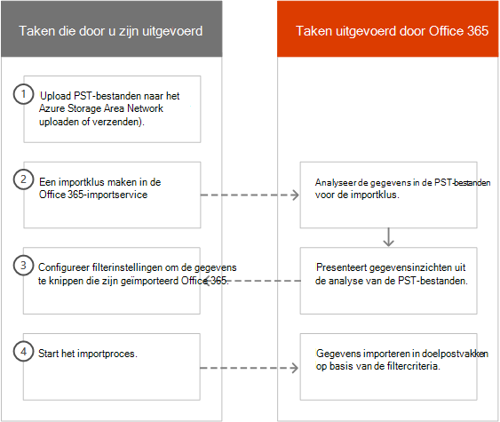
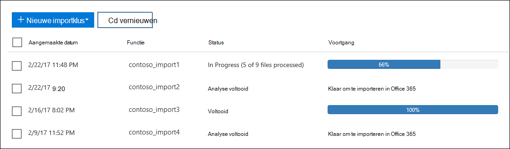
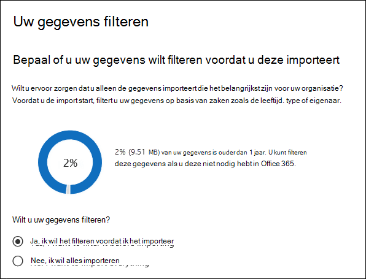
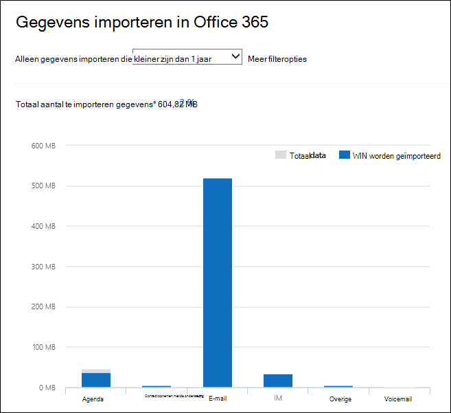
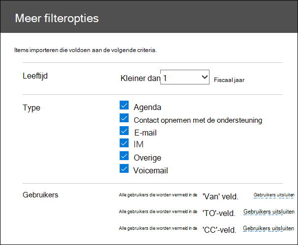
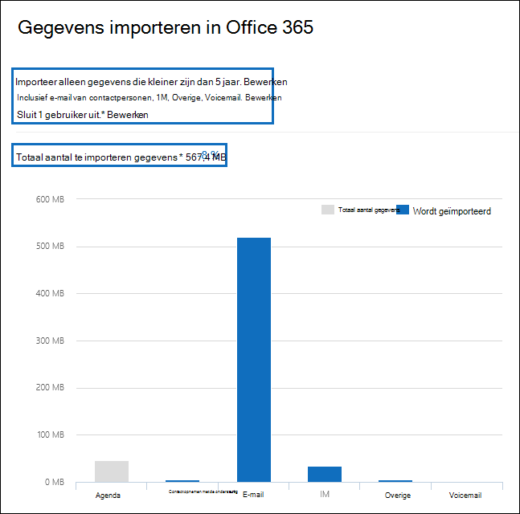

# Gegevens filteren bij het importeren van PST-bestanden

Gebruik de nieuwe functie Intelligent importeren in de Office 365 Service Importeren om de items in PST-bestanden te filteren die daadwerkelijk worden geïmporteerd in de doelpostvakken. Dit werkt als volgende:
  
- Nadat u een PST-importklus hebt gedaan en indient, worden PST-bestanden geüpload naar een Azure-opslaggebied in de Microsoft-cloud.
  
- Microsoft 365 analyseert de gegevens in de PST-bestanden op een veilige en veilige manier door de leeftijd van de postvakitems en de verschillende berichtentypen in de PST-bestanden te identificeren.
  
- Wanneer de analyse is voltooid en de gegevens klaar zijn om te importeren, hebt u de optie om alle gegevens in de PST-bestanden te importeren of de geïmporteerde gegevens te knippen door filters in te stellen die bepalen welke gegevens worden geïmporteerd. U kunt bijvoorbeeld kiezen voor:
  
  - Importeer alleen items van een bepaalde leeftijd.
  
  - Geselecteerde berichttypen importeren.
  
  - Sluit berichten uit die door bepaalde personen zijn verzonden of ontvangen.
  
- Nadat u de filterinstellingen hebt geconfigureerd, Microsoft 365 alleen de gegevens die voldoen aan de filtercriteria, geïmporteerd naar de doelpostvakken die zijn opgegeven in de importklus.
  
In de volgende afbeelding ziet u het proces intelligent importeren en worden de taken die u uitvoert en de taken die door de Office 365.
  

  
## Een PST-importklus maken

- In de stappen in dit onderwerp wordt ervan uit gegaan dat u een PST-import taak hebt gemaakt in de Office 365 Service importeren met behulp van netwerk uploaden of verzenden. Zie een van de volgende onderwerpen voor stapsgewijse instructies:
    
  - [PST-bestanden importeren in Office 365 via het netwerk](use-network-upload-to-import-pst-files.md)
    
  - [Verzendstation gebruiken om PST-bestanden te importeren in Office 365](use-drive-shipping-to-import-pst-files-to-office-365.md)
    
- Nadat u een importklus hebt gemaakt met behulp van netwerk uploaden, is de status voor de importklus op de pagina Importeren in het Beveiligings- & Compliancecentrum ingesteld op Analyse **in uitvoering,** wat betekent dat Microsoft 365 de gegevens analyseert in de PST-bestanden die u hebt geüpload. Klik **op Vernieuwen** vernieuwen om de status voor de  importklus bij te werken. 
    
- Voor importtaken voor schijfzending worden de gegevens geanalyseerd door Microsoft 365 nadat medewerkers van het Microsoft-datacenter uw harde schijf hebben ontvangen en de PST-bestanden naar het Azure-opslaggebied voor uw organisatie hebben geüpload.
  
## Gegevens filteren die worden geïmporteerd in postvakken

Nadat u een PST-importklus hebt gemaakt, volgt u deze stappen om de gegevens te filteren voordat u deze importeert in Office 365.
  
1. Ga naar <https://compliance.microsoft.com> en meld u aan met de referenties van een beheerdersaccount in uw organisatie.
    
2. Klik in het linkerdeelvenster van Microsoft 365 compliancecentrum op **Informatiebeheer** \> **importeren.**
    
    De importtaken voor uw organisatie worden weergegeven op het **tabblad** Importeren. De **waarde Analyse voltooid** in de kolom **Status** geeft de importtaken aan die door de Microsoft 365 zijn geanalyseerd en die u kunt importeren.
    
    
  
3. Selecteer de importklus die u wilt voltooien en klik **op Importeren in Office 365.**
  
    Er wordt een flyoutpagina weergegeven met informatie over de PST-bestanden en overige informatie over de importtaak.

4. Klik **op Importeren om Office 365.**
    
    De pagina **Gegevens filteren** wordt weergegeven. Het bevat gegevensinzichten over de gegevens in de PST-bestanden voor de importklus, inclusief informatie over de leeftijd van de gegevens. 
    
    
  
5. Ga op een van de volgende opties te werk op basis van het feit of u de gegevens die in Microsoft 365 worden geïmporteerd, wilt knippen onder Wilt u uw gegevens **filteren?**?
  
    a. Klik **op Ja, ik wil deze filteren voordat u importeert** om de gegevens die u importeert te knippen en klik vervolgens op **Volgende.**
  
    De **pagina Gegevens importeren Office 365 pagina** wordt weergegeven met gedetailleerde gegevensinzichten uit de analyse die Microsoft 365 uitgevoerd. 
  
    
  
    In de grafiek op deze pagina ziet u de hoeveelheid gegevens die worden geïmporteerd. Informatie over elk berichttype dat in de PST-bestanden wordt gevonden, wordt weergegeven in de grafiek. U kunt de cursor op elke balk plaatsen om specifieke informatie over dat berichttype weer te geven. Er is ook een vervolgkeuzelijst met verschillende leeftijdswaarden op basis van de analyse van de PST-bestanden. Wanneer u een leeftijd selecteert in de vervolgkeuzelijst, wordt de grafiek bijgewerkt om aan te geven hoeveel gegevens voor de geselecteerde leeftijd worden geïmporteerd. 
  
    b. Als u aanvullingsfilters wilt configureren om de hoeveelheid geïmporteerde gegevens te beperken, klikt u op **Meer filteropties.**
  
    
  
    U kunt deze filters configureren:
  
      - **Leeftijd:** selecteer een leeftijd, zodat alleen items die hoger zijn dan de opgegeven leeftijd, worden geïmporteerd. Zie de [sectie Meer informatie](#more-information) voor een beschrijving over hoe Microsoft 365 leeftijdsemmers voor het leeftijdsfilter bepaalt.  
  
      - **Type:** in deze sectie worden alle berichttypen weergegeven die zijn gevonden in de PST-bestanden voor de importklus. U kunt een vakje naast een berichttype dat u wilt uitsluiten, uit- of uit- U kunt het type Ander bericht niet uitsluiten. Zie de [sectie Meer informatie](#more-information) voor een lijst met postvakitems die zijn opgenomen in de categorie Overige.
  
      - **Gebruikers:** u kunt berichten uitsluiten die door bepaalde personen worden verzonden of ontvangen. Als u personen wilt uitsluiten die worden weergegeven in het veld Van:, het veld Aan: of het veld CC: met berichten, klikt u op Gebruikers **uitsluiten** naast dat type geadresseerde. Typ het e-mailadres (SMTP-adres) van de persoon, klik op Pictogram Nieuw toevoegen om deze toe te voegen aan de lijst met uitgesloten gebruikers voor dat type geadresseerde en klik vervolgens op Opslaan om de lijst met uitgesloten gebruikers op te  slaan.  
  
        > [!NOTE]
        > Microsoft 365 geeft geen gegevensinzichten weer die het resultaat zijn van het instellen van **het** filter Personen. Als u dit filter echter in stelt om berichten uit te sluiten die door bepaalde personen zijn verzonden of ontvangen, worden deze berichten uitgesloten tijdens het werkelijke importproces. 
  
    c. Klik **op Toepassen** op de pagina Meer **filteropties** om de filterinstellingen op te slaan. 
  
    De gegevensinzichten op de pagina Gegevens importeren **Office 365** pagina worden bijgewerkt op basis van uw filterinstellingen, inclusief de totale hoeveelheid gegevens die worden geïmporteerd op basis van de filterinstellingen. Er wordt ook een overzicht van de filterinstellingen weergegeven. U kunt klikken **op Bewerken** naast een filter om de instelling zo nodig te wijzigen. 
  
    
  
    d. Klik op **Volgende**.
  
    Er wordt een statuspagina weergegeven met de filterinstellingen. Nogmaals, u kunt een van de filterinstellingen bewerken.
  
    e. Klik **op Gegevens importeren** om de import te starten. De totale hoeveelheid gegevens die wordt geïmporteerd, wordt weergegeven. 
  
    Of
  
    a. Klik **op Nee, ik wil alles importeren** om alle gegevens in de PST-bestanden te importeren in Office 365 en klik vervolgens op **Volgende.**
  
    b. Klik op **de pagina Gegevens Office 365** importeren op Gegevens importeren **om** de import te starten. De totale hoeveelheid gegevens die wordt geïmporteerd, wordt weergegeven. 
  
6. Klik op **het tabblad** Importeren op   Vernieuwen. De status van de importklus wordt weergegeven in de **kolom Status.**
  
7. Klik op de taak importeren om meer gedetailleerde informatie weer te geven, zoals de status van elk PST-bestand en de filterinstellingen die u hebt geconfigureerd.

## Meer informatie

- Hoe bepaalt Microsoft 365 de stappen voor het leeftijdsfilter? Wanneer Microsoft 365 een PST-bestand analyseert, wordt het verzonden of ontvangen tijdstempel van elk item bekeken (als een item zowel een verzonden als ontvangen tijdstempel heeft, is de oudste datum geselecteerd). Vervolgens Microsoft 365 de jaarwaarde voor die tijdstempel en vergelijkt u deze met de huidige datum om de leeftijd van het item te bepalen. Deze leeftijden worden vervolgens gebruikt als de waarden in de vervolgkeuzelijst voor het **filter** Leeftijd. Als een PST-bestand bijvoorbeeld berichten bevat uit 2016, 2015 en 2014, zijn de waarden in het **filter** Leeftijd **1** jaar, **2** jaar en **3 jaar**.
  
- De volgende tabel bevat de berichtentypen  die zijn opgenomen in  de categorie Overige in het **filter** Type op de pagina Meer opties (zie Stap 5b in de vorige procedure). Momenteel kunt u items in de categorie 'Overige' niet uitsluiten wanneer u PST's importeert in Office 365. 
  
    |**Berichtklasse-id**|**Postvakitems die deze berichtenklasse gebruiken**|
    |:-----|:-----|
    |IPM. Activiteit    |Logboekgegevens    |
    |IPM.Document    |Documenten en bestanden (niet gekoppeld aan een e-mailbericht)    |
    |IPM. Bestand    |(hetzelfde als IPM.Document)    |
    |IPM. Opmerking.IMC.Melding    |Rapporten die zijn verzonden door Internet Mail Verbinding maken, de Exchange Server gateway naar internet    |
    |IPM. Note.Microsoft.Fax    |Faxberichten    |
    |IPM. Note.Rules.Oof.Template.Microsoft    |Out-of-office autoreply-berichten    |
    |IPM. Note.Rules.ReplyTemplate.Microsoft    |Antwoorden die zijn verzonden met een regel voor Postvak IN    |
    |IPM. OLE. Klas    |Uitzonderingen voor een terugkerende reeks    |
    |IPM. Recall.Report    |Berichten inroepen    |
    |IPM. Extern    |Externe e-mailberichten    |
    |IPM. Rapport    |Itemstatusrapporten    |
