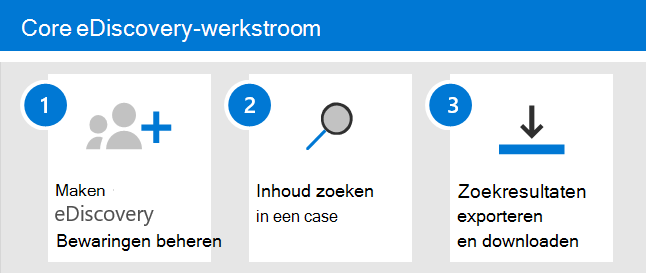

# Aan de slag met Core eDiscovery

Core eDiscovery in Microsoft 365 biedt een eenvoudig eDiscovery-hulpprogramma waarmee organisaties inhoud kunnen zoeken en exporteren in Microsoft 365 en Office 365. U kunt Core eDiscovery ook gebruiken om een eDiscovery-wachtplaats te plaatsen op inhoudslocaties, zoals Exchange-postvakken, SharePoint-sites, OneDrive-accounts en Microsoft Teams. Er is niets nodig om Core eDiscovery te implementeren, maar er zijn enkele vereisten die een IT-beheerder en eDiscovery-manager moeten uitvoeren voordat uw organisatie Core eDiscovery kan gaan gebruiken om inhoud te zoeken, te exporteren en te behouden.

In dit artikel worden de stappen beschreven die nodig zijn om Core eDiscovery in te stellen. Dit omvat het waarborgen van de juiste licenties die nodig zijn voor toegang tot Core eDiscovery en het plaatsen van een eDiscovery-wachtplaats op inhoudslocaties, en het toewijzen van machtigingen aan uw IT-, juridische en onderzoeksteam, zodat ze toegang hebben tot en zaken kunnen beheren. Dit artikel bevat ook een overzicht op hoog niveau van het gebruik van cases om inhoud te zoeken en te exporteren.

## Stap 1: De juiste licenties controleren en toewijzen

Voor licenties voor Core eDiscovery zijn het juiste organisatieabonnement en een licentie per gebruiker vereist.

- **Organisatieabonnement:** Als u Toegang wilt tot Core eDiscovery in het Microsoft 365 compliancecentrum of het Office 365 Security & Compliance Center en de functies voor het vasthouden en exporteren wilt gebruiken, moet uw organisatie een Microsoft 365 E3- of Office 365 E3-abonnement of hoger hebben.

- **Licenties per gebruiker:** Als u een eDiscovery-wachtplaats wilt plaatsen op postvakken en sites, moet een gebruiker een van de volgende licenties krijgen, afhankelijk van uw organisatieabonnement:

  - Een Microsoft 365 E3 of Office 365 E3-licentie of hoger

   OF

  - Office 365 E1-licentie met een Exchange Online abonnement 2 of Exchange Online Archiving invoeglicentie

  EN

  - Office 365 E1-licentie met een SharePoint online abonnement 2 of OneDrive voor Bedrijven abonnement 2-invoeglicentie
  
  Zie Licenties toewijzen aan gebruikers voor informatie over het toewijzen van [licenties.](../admin/manage/assign-licenses-to-users.md)

Voor informatie over licenties:

- Download en bekijk de oplossing 'Discover & Respond' in [de Microsoft 365 Compliance Licensing Comparison](/office365/servicedescriptions/downloads/microsoft-365-compliance-licensing-comparison.xlsx).

- Zie de [servicebeschrijving & Beveiligingscentrum](/office365/servicedescriptions/office-365-platform-service-description/office-365-securitycompliance-center).

## Stap 2: eDiscovery-machtigingen toewijzen

Als u toegang wilt tot Core eDiscovery of wilt worden toegevoegd als lid van een Core eDiscovery-zaak, moet aan een gebruiker de juiste machtigingen worden toegewezen. In het bijzonder moet een gebruiker worden toegevoegd als lid van de rollengroep eDiscovery Manager in het Office 365 beveiligingscentrum & Compliancecentrum. Leden van deze rollengroep kunnen Core eDiscovery-cases maken en beheren. Ze kunnen leden toevoegen en verwijderen, een eDiscovery-wachtplaats voor gebruikers plaatsen, zoekopdrachten maken en bewerken en inhoud exporteren uit een Core eDiscovery-zaak.

Volg de volgende stappen om gebruikers toe te voegen aan de rollengroep eDiscovery Manager:

1. Ga naar [https://protection.office.com/permissions](https://protection.office.com/permissions) en meld u aan met de referenties voor een beheerdersaccount in uw Microsoft 365 of Office 365 organisatie.

2. Selecteer op **de pagina** Machtigingen de **rollengroep eDiscovery Manager.**

3. Klik op de flyoutpagina van eDiscovery Manager op **Bewerken** naast de **sectie eDiscovery Manager.**

4. Klik op **de pagina eDiscovery Manager** kiezen in de wizard Rollengroep bewerken op **Detectiebeheer kiezen.**

5. Klik **op** Toevoegen en schakel het selectievakje in voor alle gebruikers die u wilt toevoegen aan de rollengroep.

6. Klik **op Toevoegen** om de geselecteerde gebruikers toe te voegen en klik vervolgens op **Klaar.**

7. Klik **op** Opslaan om de gebruikers toe te voegen aan de rollengroep en klik vervolgens op **Sluiten** om de stap te voltooien.

### Meer informatie over de rollengroep eDiscovery Manager

Er zijn twee subgroepen in de rollengroep eDiscovery Manager. Het verschil tussen deze subgroepen is gebaseerd op bereik.

- **eDiscovery Manager:** Kan de core eDiscovery-cases bekijken en beheren die ze maken of lid zijn van. Als een andere eDiscovery Manager een zaak maakt, maar geen tweede eDiscovery Manager toevoegt als lid van die zaak, kan de tweede eDiscovery Manager de zaak niet weergeven of openen op de pagina Core eDiscovery in het compliancecentrum. Over het algemeen kunnen de meeste personen in uw organisatie worden toegevoegd aan de subgroep eDiscovery Manager.

- **eDiscovery-beheerder:** Kan alle case managementtaken uitvoeren die een eDiscovery Manager kan uitvoeren. Bovendien kan een eDiscovery-beheerder:

  - Bekijk alle zaken die worden weergegeven op de pagina Core eDiscovery.
  
  - Beheer hoe dan ook in de organisatie nadat ze zichzelf hebben toevoegen als lid van de zaak.

  - Toegang tot en export van casegegevens voor elk geval in de organisatie.

  Vanwege het grote bereik van toegang moet een organisatie slechts een paar beheerders hebben die lid zijn van de subgroep eDiscovery-beheerders.

Zie eDiscovery-machtigingen toewijzen voor meer informatie over [eDiscovery-machtigingen](assign-ediscovery-permissions.md)en een beschrijving van elke rol die is toegewezen aan de rollengroep eDiscovery Manager.

## Stap 3: Een kern-eDiscovery-zaak maken

De volgende stap is het maken van een case en het gebruik van Core eDiscovery. Volg de volgende stappen om een zaak te maken en leden toe te voegen. De gebruiker die de zaak maakt, wordt automatisch toegevoegd als lid.

1. Ga naar en meld u aan met de referenties voor een gebruikersaccount dat is toegewezen aan de juiste [https://compliance.microsoft.com](https://compliance.microsoft.com) eDiscovery-machtigingen. Leden van de rollengroep Organisatiebeheer kunnen ook Core eDiscovery-cases maken.

2. Klik in het linkernavigatiedeelvenster van Microsoft 365 compliancecentrum op Alles weergeven **en** klik vervolgens op **eDiscovery > Core.**

3. Klik op **de pagina Core eDiscovery** op **Een zaak maken.**

4. Geef de **zaak op de** pagina Nieuwe hoofd zaak een naam (vereist) en typ vervolgens een optioneel hoofdnummer en een beschrijving. De naam van de zaak moet uniek zijn in uw organisatie.

5. Klik **op Opslaan** om de zaak te maken.

   De nieuwe zaak wordt gemaakt en weergegeven op de pagina Core eDiscovery. Mogelijk moet u op Vernieuwen **klikken om** de nieuwe case weer te geven. 

## Stap 4 (optioneel): Leden toevoegen aan een core eDiscovery-zaak

Als u een zaak maakt in stap 3 en u de enige bent die de zaak gebruikt, hoeft u deze stap niet uit te voeren. U kunt de zaak gaan gebruiken om eDiscovery-inhoudsreporten te maken, inhoud te zoeken of zoekresultaten te exporteren. Voer deze stap uit als u andere gebruikers (of rollengroep) toegang wilt geven tot de zaak.

1. Klik op **de pagina Core eDiscovery** in het Microsoft 365 compliancecentrum op de naam van de zaak aan wie u leden wilt toevoegen.

2. Klik op **de pagina Manage this case** flyout onder Leden **beheren** op **Toevoegen** om leden aan de zaak toe te voegen. 

    U kunt er ook voor kiezen om rollengroep toe te voegen als leden van een zaak. Klik **onder Rollengroepen beheren** op **Toevoegen.** U kunt alleen de rollengroepen waar u lid van bent, toewijzen aan een zaak. Dat komt omdat rollengroepen bepalen wie leden kan toewijzen aan een eDiscovery-zaak.

3. Klik in de lijst met personen of rollengroepen die als leden van de zaak kunnen worden toegevoegd, op het selectievakje naast de namen van de personen (of rollengroepen) die u wilt toevoegen. Als u een grote lijst met personen hebt  die als lid kunnen worden toegevoegd, gebruikt u het vak Zoeken om te zoeken naar een specifieke persoon in de lijst.
  
4. Nadat u de personen of rollengroepen hebt geselecteerd die u wilt toevoegen als leden van de zaak, klikt u op **Toevoegen.**

5. Klik **op Opslaan** om de nieuwe lijst met caseleden op te slaan.

## De core eDiscovery-werkstroom verkennen

Om aan de slag te gaan met kern-eDiscovery, is hier een eenvoudige werkstroom voor het maken van eDiscovery-inhoud voor geïnteresseerden, het zoeken naar inhoud die relevant is voor uw onderzoek en het exporteren van die gegevens voor verder onderzoek. In elk van deze stappen markeren we ook enkele uitgebreide Core eDiscovery-functionaliteit die u kunt verkennen.

1. **[Maak een eDiscovery-wacht.](create-ediscovery-holds.md)** De eerste stap na het maken van een zaak is het plaatsen van een wachtstand (ook wel *een eDiscovery-wachtstand* genoemd) op de inhoudslocaties van de personen die geïnteresseerd zijn in uw onderzoek. Inhoudslocaties zijn Exchange postvakken, SharePoint sites, OneDrive-accounts, evenals de postvakken en sites die zijn gekoppeld aan Microsoft Teams en Office 365 Groepen. Hoewel deze stap optioneel is, behoudt het maken van een eDiscovery-bewaarwaarde inhoud die mogelijk relevant is voor de zaak tijdens het onderzoek. Wanneer u een eDiscovery-bewaarfunctie maakt, kunt u alle inhoud behouden op specifieke inhoudslocaties of kunt u een op query gebaseerde bewaarfunctie maken om alleen de inhoud te behouden die overeenkomt met een bewaarquery. Naast het behoud van inhoud, is een andere goede reden om eDiscovery-inhoudsophoudts te maken, door snel te zoeken naar de inhoudslocaties in de wacht (in plaats van elke locatie te selecteren om te zoeken) wanneer u zoekopdrachten maakt en uit te voeren in de volgende stap. Nadat u het onderzoek hebt voltooid, kunt u de aangemaakte wacht houden.

2. **[Zoeken naar inhoud](search-for-content-in-core-ediscovery.md)**. Nadat u eDiscovery-wachtplaatsen hebt gemaakt, gebruikt u het ingebouwde zoekprogramma om de inhoudslocaties in de wacht te zetten. U kunt ook op andere inhoudslocaties zoeken naar gegevens die relevant kunnen zijn voor de zaak. U kunt verschillende zoekopdrachten maken en uitvoeren die aan de zaak zijn gekoppeld. U gebruikt trefwoorden, eigenschappen en  voorwaarden om zoekquery's te maken die zoekresultaten retourneren met de gegevens die waarschijnlijk relevant zijn voor de zaak. U kunt ook:

   - Zoekstatistieken weergeven die u kunnen helpen een zoekquery te verfijnen om de resultaten te verfijnen.

   - Bekijk een voorbeeld van de zoekresultaten om snel te controleren of de relevante gegevens worden gevonden.

   - Een query wijzigen en de zoekopdracht opnieuw uitvoeren.

3. **[Zoekresultaten exporteren en downloaden.](export-content-in-core-ediscovery.md)** Nadat u gegevens hebt gezocht en gevonden die relevant zijn voor uw onderzoek, kunt u deze exporteren uit Office 365 ter controle door personen buiten het onderzoeksteam. Het exporteren van gegevens is een proces in twee stappen. De eerste stap is het exporteren van de resultaten van een zoekopdracht in het geval van Office 365. Dit wordt bereikt door de resultaten van een zoekopdracht te kopiëren naar een door Microsoft verstrekte Azure Storage locatie. De volgende stap is om het hulpprogramma eDiscovery-export te gebruiken om de inhoud naar een lokale computer te downloaden. Naast de geëxporteerde gegevensbestanden bevat het exportpakket ook een exportrapport, een overzichtsrapport en een foutrapport.