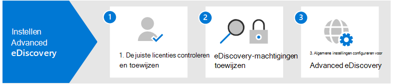

# Een Microsoft 365 Advanced eDiscoverySet up Microsoft 365 Advanced eDiscovery

Advanced eDiscovery in Microsoft 365 biedt een end-to-end werkstroom voor het bewaren, verzamelen, controleren, analyseren en exporteren van gegevens die reageren op interne en externe onderzoeken van uw organisatie.Advanced eDiscovery in Microsoft 365 provides an end-to-end workflow to preserve, collect, review, analyze, and export data that's responsive to your organization's internal and external investigations. Er is niets nodig om Advanced eDiscovery te implementeren, maar er zijn enkele vereiste taken die een IT-beheerder en eDiscovery-manager moeten uitvoeren voordat uw organisatie kan beginnen met het maken en gebruiken van Advanced eDiscovery-zaken om uw onderzoeken te beheren.Nothing is needed to deploy Advanced eDiscovery, but there are some prerequisite tasks that an IT admin and eDiscovery manager have to complete before your organization can start to create and use Advanced eDiscovery cases to manage your investigations.

In dit artikel worden de volgende stappen beschreven die nodig zijn voor het instellen van Advanced eDiscovery.This article discusses the following steps necessary to set up Advanced eDiscovery.

Dit omvat het waarborgen van de juiste licenties die nodig zijn voor toegang tot Advanced eDiscovery en het toevoegen van voogden aan zaken, en het toewijzen van machtigingen aan uw juridische en onderzoeksteam, zodat ze zaken kunnen openen en beheren.This includes ensuring the proper licensing required to access Advanced eDiscovery and add custodians to cases, and assigning permissions to your legal and investigation team so they can access and manage cases.

## Stap 1: De juiste licenties controleren en toewijzenStep 1: Verify and assign appropriate licenses

Licenties voor Advanced eDiscovery vereist het juiste organisatieabonnement en licenties per gebruiker.Licensing for Advanced eDiscovery requires the appropriate organization subscription and per-user licensing. Zie Abonnementen en licenties voor een lijst met licentievereisten voor Advanced eDiscovery [licenties.](overview-ediscovery-20.md#subscriptions-and-licensing)For a list of licensing requirements for Advanced eDiscovery, see [Subscriptions and licensing](overview-ediscovery-20.md#subscriptions-and-licensing).

## Stap 2: eDiscovery-machtigingen toewijzenStep 2: Assign eDiscovery permissions

Als u toegang Advanced eDiscovery of toegevoegd als lid van een Advanced eDiscovery geval, moet aan een gebruiker de juiste machtigingen zijn toegewezen.To access Advanced eDiscovery or added as a member of an Advanced eDiscovery case, a user must be assigned the appropriate permissions. Een gebruiker moet met name worden toegevoegd als lid van de rollengroep eDiscovery Manager in het beveiligings- & Compliancecentrum.Specifically, a user must be added as a member of the eDiscovery Manager role group in the Security & Compliance Center. Leden van deze rollengroep kunnen een aantal Advanced eDiscovery maken en beheren.Members of this role group can create and manage Advanced eDiscovery cases. Ze kunnen leden toevoegen en verwijderen, beheerders en inhoudslocaties in de wacht zetten, meldingen over juridische wacht houden beheren, zoekopdrachten maken en bewerken die aan een zaak zijn gekoppeld, zoekresultaten toevoegen aan een revisieset, gegevens analyseren in een revisieset en exporteren en downloaden vanuit een Advanced eDiscovery-zaak.They can add and remove members, place custodians and content locations on hold, manage legal hold notifications, create and edit searches associated in a case, add search results to a review set, analyze data in a review set, and export and download from an Advanced eDiscovery case.

Volg de volgende stappen om gebruikers toe te voegen aan de rollengroep eDiscovery Manager:Complete the following steps to add users to the eDiscovery Manager role group:

1. Ga naar <https://protection.office.com/permissions> en meld u aan met de referenties voor een beheerdersaccount in uw Microsoft 365 organisatie.Go to <https://protection.office.com/permissions> and sign in using the credentials for an admin account in your Microsoft 365 organization.

2. Selecteer op **de pagina** Machtigingen de **rollengroep eDiscovery Manager.**On the **Permissions** page, select the **eDiscovery Manager** role group.

3. Klik op de flyoutpagina van eDiscovery Manager op **Bewerken** naast de **sectie eDiscovery Manager.**On the eDiscovery Manager flyout page, click **Edit** next to the **eDiscovery Manager** section.

4. Klik op **de pagina eDiscovery Manager** kiezen in de wizard Rollengroep bewerken op **EDiscovery Manager kiezen.**On the **Choose eDiscovery Manager** page in the edit role group wizard, click **Choose eDiscovery Manager**.

5. Klik **op** Toevoegen en schakel het selectievakje in voor alle gebruikers die u wilt toevoegen aan de rollengroep.Click **Add** then select the checkbox for all users you want to add to the role group.

6. Klik **op Toevoegen** om de geselecteerde gebruikers toe te voegen en klik vervolgens op **Klaar.**Click **Add** to add the selected users, and then click **Done**.

7. Klik **op** Opslaan om de gebruikers toe te voegen aan de rollengroep en klik vervolgens op **Sluiten** om de stap te voltooien.Click **Save** to add the users to the role group, and then click **Close** to complete the step.

### Meer informatie over de rollengroep eDiscovery ManagerMore information about the eDiscovery Manager role group

Er zijn twee subgroepen in de rollengroep eDiscovery Manager.There are two subgroups in the eDiscovery Manager role group. Het verschil tussen deze subgroepen is gebaseerd op bereik.The difference between these subgroups is based on scope.

- **eDiscovery Manager:** kan de verschillende Advanced eDiscovery die ze maken of lid zijn van weergeven en beheren.**eDiscovery Manager**: Can view and manage the Advanced eDiscovery cases they create or are a member of. Als een andere eDiscovery Manager een zaak maakt, maar geen tweede eDiscovery Manager toevoegt als lid van die zaak, kan de tweede eDiscovery Manager de zaak niet weergeven of openen op de pagina Advanced eDiscovery in het compliancecentrum.If another eDiscovery Manager creates a case but doesn't add a second eDiscovery Manager as a member of that case, the second eDiscovery Manager won't be able to view or open the case on the Advanced eDiscovery page in the compliance center. Over het algemeen kunnen de meeste personen in uw organisatie worden toegevoegd aan de subgroep eDiscovery Manager.In general, most people in your organization can be added to the eDiscovery Manager subgroup.

- **eDiscovery-beheerder:** kan alle casebeheertaken uitvoeren die een eDiscovery Manager kan uitvoeren.**eDiscovery Administrator**: Can perform all case management tasks that an eDiscovery Manager can do. Bovendien kan een eDiscovery-beheerder:Additionally, an eDiscovery Administrator can:

  - Bekijk alle zaken die worden weergegeven op de Advanced eDiscovery pagina.View all cases that are listed on the Advanced eDiscovery page.
  
  - Beheer hoe dan ook in de organisatie nadat ze zichzelf hebben toevoegen als lid van de zaak.Manage any case in the organization after they add themselves as a member of the case.

  - Toegang tot en export van casegegevens voor elk geval in de organisatie.Access and export case data for any case in the organization.

  Vanwege het grote bereik van toegang moet een organisatie slechts een paar beheerders hebben die lid zijn van de subgroep eDiscovery-beheerders.Because of the broad scope of access, an organization should have only a few admins who are members of the eDiscovery Administrators subgroup.

Zie eDiscovery-machtigingen toewijzen voor meer informatie over [eDiscovery-machtigingen](assign-ediscovery-permissions.md)en een beschrijving van elke rol die is toegewezen aan de rollengroep eDiscovery Manager.For more information about eDiscovery permissions and a description of each role that's assigned to the eDiscovery Manager role group, see [Assign eDiscovery permissions](assign-ediscovery-permissions.md).

## Stap 3: Algemene instellingen configureren voor Advanced eDiscoveryStep 3: Configure global settings for Advanced eDiscovery

De laatste stap die moet worden voltooid voordat personen in uw organisatie zaken gaan maken en gebruiken, is het configureren van algemene instellingen die van toepassing zijn op alle zaken in uw organisatie.The last step to complete before people in your organization start to create and use cases is to configure global settings that apply to all cases in your organization. Op dit moment is de enige globale instelling de detectie van *advocaten-clientvoorrechten* (in de toekomst zijn er meer algemene instellingen beschikbaar).At this time, the only global setting is *attorney-client privilege detection* (more global settings will be available in the future). Met deze instelling kan het privilegemodel voor advocatenclient worden uitgevoerd wanneer u gegevens in een revisieset analyseert.This setting enables the attorney-client privilege model to run when you analyze data in a review set. Het model maakt gebruik van machine learning om de kans te bepalen dat een document inhoud bevat die juridisch van aard is.The model uses machine learning to determine the likelihood that a document contains content that is legal in nature. Ook worden de deelnemers aan documenten vergeleken met een advocatenlijst (die u indient bij het instellen van het model) om te bepalen of een document ten minste één deelnemer heeft die een advocaat is.It also compares the participants of documents with an attorney list (that you submit when setting up the model) to determine if a document has at least one participant who is an attorney.

Zie Detectie van advocaten-clientvoorrechten instellen in Advanced eDiscovery voor meer informatie over het instellen en gebruiken van het detectiemodel voor [advocaten-clientrechten.](attorney-privilege-detection.md)For more information about setting up and using the attorney-client privilege detection model, see [Set up attorney-client privilege detection in Advanced eDiscovery](attorney-privilege-detection.md).

> [!NOTE]
> Dit is een optionele stap die u op elk gewenst moment kunt uitvoeren.This is an optional step that you can perform anytime. Als u het detectiemodel voor advocaten-clientvoorrechten niet implementeert, kunt u geen nieuwe Advanced eDiscovery maken.Not implementing the attorney-client privilege detection model doesn't prevent you from creating and using Advanced eDiscovery cases.

## Volgende stappenNext steps

Nadat u een Advanced eDiscovery hebt ingesteld, kunt u een [zaak maken.](create-and-manage-advanced-ediscoveryv2-case.md)After you set up Advanced eDiscovery, you're ready to [create a case](create-and-manage-advanced-ediscoveryv2-case.md).