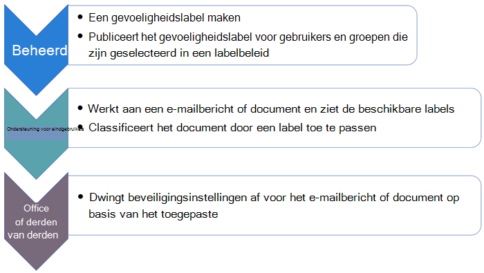

# Aan de slag met vertrouwelijkheidslabelsGet started with sensitivity labels

>*[Richtlijnen voor Microsoft 365-licenties voor beveiliging en compliance](/office365/servicedescriptions/microsoft-365-service-descriptions/microsoft-365-tenantlevel-services-licensing-guidance/microsoft-365-security-compliance-licensing-guidance).**[Microsoft 365 licensing guidance for security & compliance](/office365/servicedescriptions/microsoft-365-service-descriptions/microsoft-365-tenantlevel-services-licensing-guidance/microsoft-365-security-compliance-licensing-guidance).*

Zie [Meer informatie over vertrouwelijkheidslabels](sensitivity-labels.md) voor informatie over vertrouwelijkheidslabels en hoe ze u kunnen helpen bij het beschermen van de gegevens van uw organisatie.For information about what sensitivity labels are and how they can help you protect your organization's data, see [Learn about sensitivity labels](sensitivity-labels.md).

Als u [Azure Information Protection](/azure/information-protection/what-is-information-protection) hebt en nog steeds labels van Azure Information Protection gebruikt die zijn beheerd vanuit de Azure-portal, moet u deze labels migreren naar het [platform voor labeling](/azure/information-protection/faqs#how-can-i-determine-if-my-tenant-is-on-the-unified-labeling-platform).If you have [Azure Information Protection](/azure/information-protection/what-is-information-protection) and still using Azure Information Protection labels that were managed from the Azure portal, you must migrate these labels to the [unified labeling platform](/azure/information-protection/faqs#how-can-i-determine-if-my-tenant-is-on-the-unified-labeling-platform). Voor Windows-computers kunt u vervolgens [kiezen welke labelclient u](/azure/information-protection/rms-client/use-client#choose-which-labeling-client-to-use-for-windows-computers) voor uw gepubliceerde gevoeligheidslabels.For Windows computers, you can then [choose which labeling client to use](/azure/information-protection/rms-client/use-client#choose-which-labeling-client-to-use-for-windows-computers) for your published sensitivity labels.

Wanneer u klaar bent om te beginnen met het beveiligen van de gegevens van uw organisatie met behulp van gevoeligheidslabels:When you're ready to start protecting your organization's data by using sensitivity labels:

1. **Maak de labels.****Create the labels.** Maak en benoem uw gevoeligheidslabels volgens de classificatie-taxonomie van uw organisatie voor verschillende gevoeligheidsniveaus voor inhoud.Create and name your sensitivity labels according to your organization's classification taxonomy for different sensitivity levels of content. Gebruik veelgebruikte namen of termen die voor uw gebruikers zinvol zijn.Use common names or terms that make sense to your users. Als u nog geen taxonomie hebt, kunt u overwegen om te beginnen met labelnamen zoals Persoonlijk, Openbaar, Algemeen, Vertrouwelijk en Zeer vertrouwelijk.If you don't already have an established taxonomy, consider starting with label names such as Personal, Public, General, Confidential, and Highly Confidential. U kunt vervolgens sublabels gebruiken om soortgelijke labels te groepeert op categorie.You can then use sublabels to group similar labels by category. Wanneer u een label maakt, gebruikt u de tekst in de knopinfo om gebruikers te helpen het juiste label te selecteren.When you create a label, use the  tooltip text to help users select the appropriate label.
    
    Voor uitgebreidere instructies voor het definiëren van een classificatie taxonomie downloadt u het whitepaper 'Data Classification & Sensitivity Label Taxonomy' van de [Service Trust Portal](https://aka.ms/DataClassificationWhitepaper).For more extensive guidance for defining a classification taxonomy, download the white paper, "Data Classification & Sensitivity Label Taxonomy" from the [Service Trust Portal](https://aka.ms/DataClassificationWhitepaper).

2. **Bepalen wat elk label kan doen.****Define what each label can do.** Configureer de beveiligingsinstellingen die u aan elk label wilt koppelen.Configure the protection settings you want associated with each label. U wilt bijvoorbeeld dat inhoud met een lagere gevoeligheid (zoals een label 'Algemeen') alleen een koptekst of voettekst krijgt, terwijl inhoud met een hogere gevoeligheid (zoals een label 'Vertrouwelijk') een watermerk en versleuteling.For example, you might want lower sensitivity content (such as a "General" label) to have just a header or footer applied, while higher sensitivity content (such as a "Confidential" label) should have a watermark and encryption.

3. **De labels publiceren.****Publish the labels.** Wanneer uw gevoeligheidslabels zijn geconfigureerd, kunt u deze publiceren met een labelbeleid.After your sensitivity labels are configured, publish them by using a label policy. Bepaal welke gebruikers en groepen de labels moeten hebben en welke beleidsinstellingen u wilt gebruiken.Decide which users and groups should have the labels and what policy settings to use. Een enkel label is herbruikbaar: u definieert het eenmaal en vervolgens kunt u het opnemen in verschillende labelbeleidsregels die aan verschillende gebruikers zijn toegewezen.A single label is reusable—you define it once, and then you can include it in several label policies assigned to different users. U kunt bijvoorbeeld uw gevoeligheidslabels piloten door een labelbeleid toe te wijzen aan slechts een paar gebruikers.So for example, you could pilot your sensitivity labels by assigning a label policy to just a few users. Wanneer u klaar bent om de etiketten in uw organisatie uit te rollen, kunt u een nieuw etiketbeleid maken voor uw etiketten en deze keer alle gebruikers opgeven.Then when you're ready to roll out the labels across your organization, you can create a new label policy for your labels and this time, specify all users.

De basisstroom voor het implementeren en toepassen van gevoeligheidslabels:The basic flow for deploying and applying sensitivity labels:

## Abonnements- en licentievereisten voor vertrouwelijkheidslabelsSubscription and licensing requirements for sensitivity labels

Een aantal verschillende abonnementen ondersteunen vertrouwelijkheidslabels en de licentievereisten voor gebruikers zijn afhankelijk van de functies die u gebruikt.A number of different subscriptions support sensitivity labels and the licensing requirements for users depend on the features you use.

Zie de [Richtlijnen voor Microsoft 365-licenties voor beveiliging en compliance](/office365/servicedescriptions/microsoft-365-service-descriptions/microsoft-365-tenantlevel-services-licensing-guidance/microsoft-365-security-compliance-licensing-guidance) om de opties te zien voor de licentieverlening aan uw gebruikers om voordeel te halen uit de functies van Microsoft 365-compliance.To see the options for licensing your users to benefit from Microsoft 365 compliance features, see the [Microsoft 365 licensing guidance for security & compliance](/office365/servicedescriptions/microsoft-365-service-descriptions/microsoft-365-tenantlevel-services-licensing-guidance/microsoft-365-security-compliance-licensing-guidance). Zie de sectie [privacylabels](/office365/servicedescriptions/microsoft-365-service-descriptions/microsoft-365-tenantlevel-services-licensing-guidance/microsoft-365-security-compliance-licensing-guidance#information-protection) de bijbehorende PDF- of Excel-download voor gevoelige labels.For sensitivity labels, see the [Information Protection](/office365/servicedescriptions/microsoft-365-service-descriptions/microsoft-365-tenantlevel-services-licensing-guidance/microsoft-365-security-compliance-licensing-guidance#information-protection) section and related PDF or Excel download.

## Gevoeligheidslabels maken en beherenPermissions required to create and manage sensitivity labels

Leden van uw nalevingsteam die bewaarbeleidsregels en bewaarlabels maken en beheren, hebben machtigingen nodig voor het compliancecentrum.Members of your compliance team who will create sensitivity labels need permissions to the Microsoft 365 compliance center, or to the older Security & Compliance Center. 

Standaard heeft de tenantbeheerder (globale beheerder) toegang tot deze locatie en kan deze **compliance officers** en andere personen toegang verlenen zonder hen alle machtigingen van een tenantbeheerder te geven. Als u machtigingen wilt verlenen voor dit beperkte beheer, raden we u aan gebruikers toe te voegen aan de **beheerdersrolgroep** **Compliancebeheerder**.By default, global administrators for your tenant have access to these admin centers and can give compliance officers and other people access, without giving them all of the permissions of a tenant admin. For this delegated limited admin access, add users to the **Compliance Data Administrator**, **Compliance Administrator**, or **Security Administrator** role group. 

U kunt ook de standaardrollen gebruiken. U kunt ook een nieuwe rollengroep maken en **Vertrouwelijkheidslabelbeheerder** of **Organisatieconfiguratie** rollen toevoegen aan deze groep.Alternatively to using the default roles, you can create a new role group and add either **Sensitivity Label Administrator** or **Organization Configuration** roles to this group. Als u een alleen-lezenrol nodig hebt, **De lezer voor gevoeligheidslabels**.For a read-only role, use **Sensitivity Label Reader**. 

Zie [Gebruikers toegang geven tot het Beveiligings- en compliancecentrum](../security/office-365-security/grant-access-to-the-security-and-compliance-center.md) voor instructies om gebruikers aan rolgroepen toe te voegen en rollen toe te wijzen.For instructions to add users to the default roles or create your own role groups, see [Give users access to the Office 365 Security & Compliance Center](../security/office-365-security/grant-access-to-the-security-and-compliance-center.md).

Deze machtigingen zijn alleen vereist om gevoeligheidslabels en het labelbeleid te maken en configureren.These permissions are required only to create and configure sensitivity labels and their label policies. Ze zijn niet vereist om de labels in apps of services toe te passen.They are not required to apply the labels in apps or services. Als er extra machtigingen nodig zijn voor specifieke configuraties die betrekking hebben op gevoeligheidslabels, worden die machtigingen vermeld in de desbetreffende documentatie-instructies.If additional permissions are needed for specific configurations that relate to sensitivity labels, those permissions will be listed in their respective documentation instructions.

## Implementatiestrategie voor gevoeligheidslabelsDeployment strategy for sensitivity labels
Een succesvolle strategie voor de implementatie van gevoeligheidslabels voor een organisatie is het maken van een virtueel team dat de zakelijke en technische vereisten identificeert en beheert, test van concept, interne controlepunten en goedkeuringen, en de uiteindelijke implementatie voor de productieomgeving.A successful strategy to deploy sensitivity labels for an organization is to create a working virtual team that identifies and manages the business and technical requirements, proof of concept testing, internal checkpoints and approvals, and final deployment for the production environment.

Aan de hand van de tabel in het volgende gedeelte wordt u aangeraden de belangrijkste een of twee scenario's te identificeren die zijn toe te passen op de meest impactvolle bedrijfsvereisten.Using the table in the next section, we recommend identifying your top one or two scenarios that map to your most impactful business requirements. Nadat deze scenario's zijn geïmplementeerd, gaat u terug naar de lijst om vast te stellen wat de volgende een of twee prioriteiten zijn voor implementatie.After these scenarios are deployed, return to the list to identify the next one or two priorities for deployment.

In de downloadbare richtlijnen voor preventie van gegevensverlies en implementatieversnelling voor Microsoft Information Protection vindt u aanvullende algemene richtlijnen voor implementatie.You'll find additional general deployment guidance in the downloadable Data Loss Prevention and Microsoft Information Protection Deployment Acceleration Guide. Zie voor meer informatie het blogbericht [Microsoft 365 Information Protection and Compliance Deployment Acceleration Guides](https://techcommunity.microsoft.com/t5/microsoft-security-and/microsoft-365-information-protection-and-compliance-deployment/ba-p/2076404).For more information, see the blog post, [Microsoft 365 Information Protection and Compliance Deployment Acceleration Guides](https://techcommunity.microsoft.com/t5/microsoft-security-and/microsoft-365-information-protection-and-compliance-deployment/ba-p/2076404).

## Gebruikelijke scenario's voor vertrouwelijkheidslabelsCommon scenarios for sensitivity labels

Voor alle scenario's moet u [Gevoeligheidslabels en hun beleid maken en configureren](create-sensitivity-labels.md).All scenarios require you to [Create and configure sensitivity labels and their policies](create-sensitivity-labels.md).

|Ik wil het volgende doenI want to ...|DocumentatieDocumentation|
|----------------|---------------|
|Beheer gevoeligheidslabels voor Office-apps, zodat inhoud wordt gelabeld terwijl deze wordt gemaakt. Dit omvat ondersteuning voor handmatige labeling op alle platformsManage sensitivity labels for Office apps so that content is labeled as it's created—includes support for manual labeling on all platforms |[Vertrouwelijkheidslabels in Office-apps beherenManage sensitivity labels in Office apps](sensitivity-labels-office-apps.md)|
|Gebruikers in staat stellen bestanden van Windows-computers te labelen en te beveiligen met Office-apps, Verkenner en PowerShellEnable users to label and protect files from Windows computers using Office apps, File Explorer, and PowerShell|[Geïntegreerde Azure Information Protection-labelclient en -scanner:Azure Information Protection unified labeling client for Windows](/azure/information-protection/rms-client/aip-clientv2)|
|Documenten en e-mailberichten versleutelen met gevoeligheidslabels en beperken wie toegang heeft tot die inhoud en hoe deze kan worden gebruiktEncrypt documents and emails with sensitivity labels and restrict who can access that content and how it can be used |[Toegang tot inhoud beperken door versleuteling toe te passen met vertrouwelijkheidslabelsRestrict access to content by using sensitivity labels to apply encryption](encryption-sensitivity-labels.md)|
|Schakel gevoeligheidslabels in voor Office op het web, met ondersteuning voor coauthoring, eDiscovery, preventie van gegevensverlies, zoeken, zelfs wanneer documenten zijn versleuteldEnable sensitivity labels for Office on the web, with support for coauthoring, eDiscovery, data loss prevention, search—even when documents are encrypted | [Vertrouwelijkheidslabels inschakelen voor Office-bestanden in SharePoint en OneDriveEnable sensitivity labels for Office files in SharePoint and OneDrive](sensitivity-labels-sharepoint-onedrive-files.md)
|Co authoring en automatisch opslaan gebruiken in Office-bureaublad-apps wanneer documenten zijn versleuteldUse co-authoring and AutoSave in Office desktop apps when documents are encrypted | [Cocreatie inschakelen voor bestanden die zijn versleuteld met gevoeligheidslabelsEnable co-authoring for files encrypted with sensitivity labels](sensitivity-labels-coauthoring.md)
|Automatisch gevoeligheidslabels toepassen op uw documenten en e-mailsAutomatically apply sensitivity labels to documents and emails | [Een vertrouwelijkheidslabel automatisch toepassen op inhoudApply a sensitivity label to content automatically](apply-sensitivity-label-automatically.md)|
|Zie Gevoeligheidslabels gebruiken om inhoud te beveiligen in Microsoft Teams, Office 365-groepen en SharePoint-sites voor meer informatie.Use sensitivity labels to protect content in Teams and  SharePoint |[Vertrouwelijkheidslabels gebruiken met Microsoft Teams, Microsoft 365 Groepen en SharePoint-sitesUse sensitivity labels with Microsoft Teams, Microsoft 365 groups, and SharePoint sites](sensitivity-labels-teams-groups-sites.md)|
|Voorkomen of waarschuwen voor het delen van bestanden of e-mailberichten met een specifiek gevoeligheidslabelPrevent or warn users about sharing files or emails with a specific sensitivity label |[Vertrouwelijkheidslabels gebruiken als voorwaarden in DLP-beleidUse sensitivity labels as conditions in DLP policies](dlp-sensitivity-label-as-condition.md) |
|Bestanden ontdekken, labelen en beveiligen die zijn opgeslagen in on-premises gegevensopslagDiscover, label, and protect files stored in data stores that are on premises |[De Azure Information Protection-scanner implementeren om bestanden automatisch te classificeren en te beveiligenDeploying the Azure Information Protection scanner to automatically classify and protect files](/azure/information-protection/deploy-aip-scanner)|
|Bestanden ontdekken, labelen en beveiligen die zijn opgeslagen in de cloud gegevensopslagDiscover, label, and protect files stored in data stores that are in the cloud|[Ontdek, classificeer, label en bescherm gereguleeerde en vertrouwelijke gegevens die zijn opgeslagen in de cloudDiscover, classify, label, and protect regulated and sensitive data stored in the cloud](/cloud-app-security/best-practices#discover-classify-label-and-protect-regulated-and-sensitive-data-stored-in-the-cloud)|
|Labels toepassen en weergeven in Power BI en gegevens beveiligen wanneer deze buiten de service worden opgeslagenApply and view labels in Power BI, and protect data when it's saved outside the service|[Gevoeligheidslabels in Power BISensitivity labels in Power BI](/power-bi/admin/service-security-sensitivity-label-overview)|
|Controleren en begrijpen hoe gevoeligheidslabels worden gebruikt in mijn organisatieMonitor and understand how sensitivity labels are being used in my organization|[Meer informatie over gegevensclassificatieLearn about data classification](data-classification-overview.md)|
|Vertrouwelijkheidslabels uitbreiden naar apps en services van derden.Extend sensitivity labels to third-party apps and services|[Microsoft Information Protection SDKMicrosoft Information Protection SDK](/information-protection/develop/overview#microsoft-information-protection-sdk)|
|De gevoeligheidslabels uitbreiden voor inhoud in Azure Blob Storage, Azure-bestanden, Azure Data Lake Storage Generatie1 en Azure Data Lake Storage Generatie12Extend sensitivity labels across content in Azure Blob Storage, Azure files, Azure Data Lake Storage Gen1, and Azure Data Lake Storage Gen12|[Automatisch uw inhoud labelen in Azure PurviewAutomatically label your content in Azure Purview](/azure/purview/create-sensitivity-label) |

## Documentatie voor eindgebruikers voor gevoeligheidslabelsEnd-user documentation for sensitivity labels

De meest effectieve documentatie voor eindgebruikers bestaat uit aangepaste begeleiding en instructies voor de namen en configuraties van labels die u kiest.The most effective end-user documentation will be customized guidance and instructions you provide for the label names and configurations you choose. U kunt de instelling voor labelbeleid **Geef gebruikers een koppeling naar een aangepaste Help-pagina** gebruiken om een interne koppeling voor deze documentatie op te geven.You can use the label policy setting **Provide users with a link to a custom help page** to specify an internal link for this documentation. Gebruikers kunnen deze vervolgens eenvoudig openen via de knop **Vertrouwelijkheid**:Users can then easily access it from the **Sensitivity** button:

- Voor ingebouwde labeling: menuoptie **Meer informatie**.For built-in labeling: **Learn More** menu option.
- Voor de geïntegreerde Azure Information Protection-labelclient: menuoptie **Help en Feedback** > koppeling **Meer informatie** in het dialoogvenster Microsoft Azure Information Protection.For the Azure Information Protection unified labeling client: **Help and Feedback** menu option > **Tell Me More** link in the Microsoft Azure Information Protection dialog box.

Bekijk, om u te helpen bij het bieden van aangepaste documentatie, de volgende pagina en downloads die u kunt gebruiken voor het trainen van gebruikers: [Eindgebruikerstraining voor Retentielabels](https://microsoft.github.io/ComplianceCxE/enduser/sensitivity/).To help you provide your customized documentation, see the following page and downloads that you can use to help train your users: [End User Training for Sensitivity Labels](https://microsoft.github.io/ComplianceCxE/enduser/sensitivity/). 

U kunt ook de volgende bronnen gebruiken voor basisinstructies:You can also use the following resources for basic instructions:

- [Gevoeligheidslabels toepassen op uw documenten en e-mail in OfficeApply sensitivity labels to your files and email in Office](https://support.microsoft.com/nl-NL/office/apply-sensitivity-labels-to-your-files-and-email-in-office-2f96e7cd-d5a4-403b-8bd7-4cc636bae0f9)
    - [Bekende problemen met vertrouwelijkheidslabels in OfficeKnown issues with sensitivity labels in Office](https://support.microsoft.com/nl-NL/office/known-issues-with-sensitivity-labels-in-office-b169d687-2bbd-4e21-a440-7da1b2743edc)

- [Vertrouwelijkheidslabels automatisch toepassen op of aanbevelen voor uw bestanden en e-mailberichten in OfficeAutomatically apply or recommend sensitivity labels to your files and emails in Office](https://support.office.com/article/automatically-apply-or-recommend-sensitivity-labels-to-your-files-and-emails-in-office-622e0d9c-f38c-470a-bcdb-9e90b24d71a1)
    - [Bekende problemen met het automatisch toepassen of aanbevelen van vertrouwelijkheidslabelsKnown issues with automatically applying or recommending sensitivity labels](https://support.office.com/article/known-issues-with-automatically-applying-or-recommending-sensitivity-labels-451698ae-311b-4d28-83aa-a839a66f6efc)

- [Geïntegreerde Azure Information Protection-labelhandleidingAzure Information Protection unified labeling user guide](/azure/information-protection/rms-client/clientv2-user-guide)

Als uw gevoeligheidslabels versleuteling toepassen op PDF-documenten, kunnen deze documenten worden geopend met Microsoft Edge op Windows of Mac.If your sensitivity labels apply encryption for PDF documents, these documents can be opened with Microsoft Edge on Windows or Mac. Zie voor meer informatie en alternatieve lezers [Welke PDF-lezers worden ondersteund voor beveiligde PDF-bestanden?](/azure/information-protection/rms-client/protected-pdf-readers#viewing-protected-pdfs-in-microsoft-edge-on-windows-or-mac)For more information, and alternative readers, see [Which PDF readers are supported for protected PDFs?](/azure/information-protection/rms-client/protected-pdf-readers#viewing-protected-pdfs-in-microsoft-edge-on-windows-or-mac)
