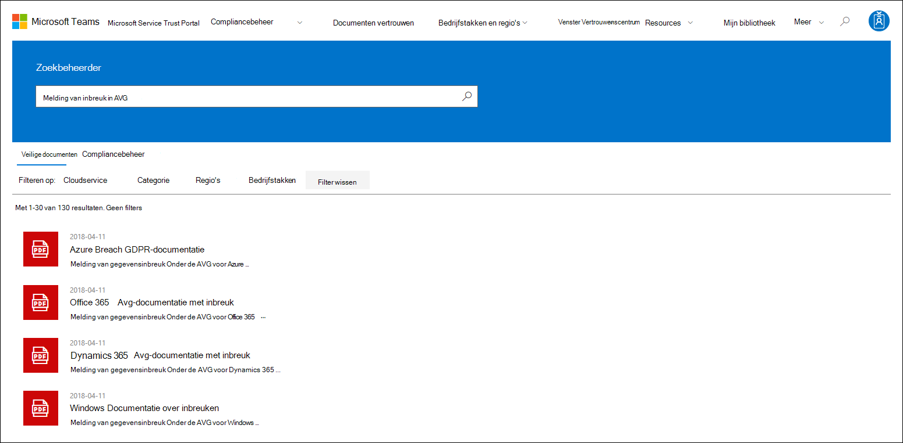
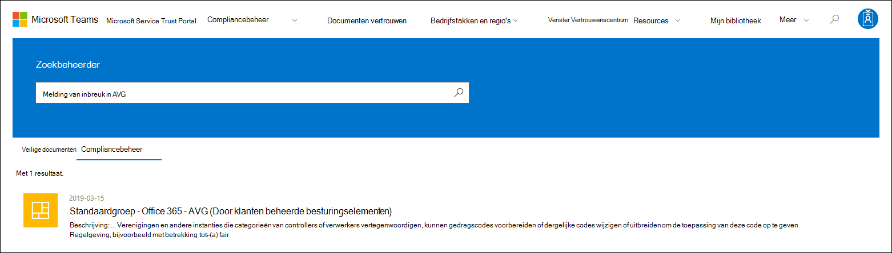

# Aan de slag met de Microsoft Service Trust Portal

De Microsoft Service Trust Portal biedt een verscheidenheid aan inhoud, hulpmiddelen en andere bronnen over microsoft-beveiligings-, privacy- en compliancepraktijken.

## Toegang tot de Service Trust Portal

De Service Trust Portal bevat details over de implementatie door Microsoft van besturingselementen en processen die onze cloudservices en de klantgegevens daarin beschermen. Als u toegang wilt tot bepaalde bronnen in de Service Trust Portal, moet u zich aanmelden als een geverifieerde gebruiker met uw Microsoft Cloud Services-account (een account van een Azure Active Directory-organisatie of een Microsoft-account) en de Microsoft Non-Disclosure Agreement for Compliance Materials controleren en accepteren.

### Bestaande klanten

Bestaande klanten hebben toegang tot de Service Trust Portal op met een van de volgende <https://aka.ms/STP> online-abonnementen (proefabonnement of betaald):

- Microsoft 365
- Dynamics 365
- Azure

 > [!NOTE]
 > Azure Active Directory accounts die zijn gekoppeld aan organisaties hebben toegang tot het volledige bereik van documenten en functies, zoals Compliance Manager. Microsoft-accounts die voor persoonlijk gebruik zijn gemaakt, hebben beperkte toegang tot inhoud van de Service Trust Portal.

### Nieuwe klanten en klanten die microsoft-onlineservices evalueren

Als u een nieuw account wilt maken of een proefaccount wilt maken, gebruikt u een van de volgende aanmeldingsformulieren (ook gebruikt voor proefaccounts) om toegang te krijgen tot de STP.

- Registreren voor een nieuw [Microsoft 365-apps voor bedrijven-proefaccount](https://go.microsoft.com/fwlink/p/?LinkID=507653) of een [nieuw Office 365 Enterprise proefaccount](https://go.microsoft.com/fwlink/p/?LinkID=698279)

- Registreren voor een nieuw [Dynamics 365-proefaccount](https://go.microsoft.com/fwlink/?LinkId=252780)

- Meld u aan voor een nieuw [Azure-proefaccount.](https://go.microsoft.com/fwlink/?LinkId=722737)

Wanneer u zich registreert voor een gratis proefabonnement of een abonnement, moet u Azure Active Directory toegang tot de STP ondersteunen.

## De Service Trust Portal gebruiken

De functies en inhoud van de Service Trust Portal zijn toegankelijk via het hoofdmenu.

In de volgende secties wordt elk item in het hoofdmenu beschreven.

### Service Trust Portal

De **koppeling Service Trust Portal** geeft de startpagina weer. Het biedt een snelle manier om terug te gaan naar de startpagina.

### Compliancebeheer

> [!IMPORTANT]
> Compliance manager is overgeplaatst van de Service Trust Portal naar de nieuwe locatie in [het Microsoft 365 compliancecentrum.](https://compliance.microsoft.com/) Alle klantgegevens zijn verplaatst naar de nieuwe locatie, zodat u compliancebeheer zonder onderbreking kunt blijven gebruiken. Raadpleeg de [documentatie van Compliance Manager voor](compliance-manager.md) installatiegegevens en voor meer informatie over nieuwe functies. Hoewel de klassieke versie van Compliance Manager in de Service Trust Portal blijft staan, worden alle gebruikers aangeraden compliancebeheer te gebruiken in het Microsoft 365 compliancecentrum.

### Documenten vertrouwen

Biedt een schat aan beveiligingsuitvoerings- en ontwerpgegevens, zodat u eenvoudiger aan de nalevingsdoelstellingen voor regelgeving kunt voldoen door te begrijpen hoe Microsoft Cloud-services uw gegevens beveiligen. Als u inhoud wilt bekijken, selecteert u een van de volgende opties in **het** snelmenu Documenten vertrouwen.

- **Auditrapporten:** Er wordt een lijst met onafhankelijke audit- en beoordelingsrapporten over de Cloudservices van Microsoft weergegeven. Deze rapporten bevatten informatie over de naleving van Microsoft Cloud services met gegevensbeschermingsstandaarden en wettelijke vereisten, zoals:

  - Internationale organisatie voor normalisatie (ISO)
  - Besturingselementen voor serviceorganisaties (SOC)
  - National Institute of Standards and Technology (NIST)
  - Federal Risk and Authorization Management Program (FedRAMP)
  - Algemene verordening gegevensbescherming (AVG)

- **Gegevensbescherming:** Bevat een schat aan resources, zoals gecontroleerde besturingselementen, whitepapers, veelgestelde vragen, penetratietests, hulpmiddelen voor risicobeoordeling en compliancehandleidingen.

- **Azure-beveiligings- en compliance-blauwdrukken:** Resources die u helpen veilige en compatibele cloudtoepassingen te maken. Dit gebied bevat blauwdruk-richtlijnen voor overheids-, financiële, gezondheidszorg- en retail-verticalen.

### Bedrijfstakken & regio's

Biedt branche- en regiospecifieke compliance-informatie over Microsoft Cloud-services.

- **Bedrijfstakken:** Op dit moment biedt deze pagina een branchespecifieke landingspagina voor de financiële dienstverlening. Dit bevat informatie zoals complianceaanbiedingen, veelgestelde vragen en succesverhalen. Resources voor meer bedrijfstakken worden in de toekomst uitgebracht, maar u kunt bronnen voor meer bedrijfstakken vinden door naar de pagina Vertrouwensdocumenten **> gegevensbescherming** in de STP te gaan.

- **Regio's:** Biedt juridische adviezen over de naleving van Microsoft Cloud services met verschillende wetten van verschillende landen. Specifieke landen zijn Australië, Canada, Tsjechië, Denemarken, Duitsland, Polen, Roemenië, Spanje en het Verenigd Koninkrijk.

### Vertrouwenscentrum

Koppelingen naar het [Microsoft Trust Center](https://www.microsoft.com/trust-center), dat meer informatie biedt over beveiliging, naleving en privacy in de Microsoft Cloud. Dit omvat informatie over de mogelijkheden in Microsoft Cloud-services die u kunt gebruiken om specifieke vereisten van de AVG aan te pakken, documentatie die nuttig is voor uw AVG-verantwoordelijkheid en voor uw begrip van de technische en organisatorische maatregelen die Microsoft heeft genomen ter ondersteuning van de AVG.

### Mijn bibliotheek

Met deze nieuwe functie kunt u documenten opslaan *(of* vastmaken), zodat u ze snel kunt openen op de pagina Mijn bibliotheek. U kunt ook meldingen zo instellen dat Microsoft u een e-mailbericht stuurt wanneer documenten in uw Mijn bibliotheek worden bijgewerkt. Zie de sectie [Mijn](#my-library-1) bibliotheek in dit artikel voor meer informatie.

### Meer

Ga naar **Meer > beheerder voor** toegang tot beheerfuncties die alleen beschikbaar zijn voor het globale beheerdersaccount. Deze optie is alleen zichtbaar wanneer u bent aangemeld als globale beheerder. Er zijn twee opties in **het** snelmenu Beheerder:

- **Instellingen:** Op deze pagina kunt u gebruikersrollen toewijzen voor Compliance Manager (klassiek).

- **Gebruikers privacy Instellingen:** Op deze pagina kunt u een rapport exporteren met actie-itemtoewijzingen in Compliance Manager (klassiek) voor een specifieke gebruiker. U kunt ook alle actie-items opnieuw toewijzen aan een andere gebruiker en een toegewezen actie-item van de opgegeven gebruiker verwijderen.

### Zoeken

Klik op het vergrootglas in de rechterbovenhoek van de pagina Service Trust Portal om het vak uit te vouwen, uw zoektermen in te voeren en op **Enter te drukken.** De **pagina** Zoeken wordt weergegeven, met de zoekterm weergegeven in het zoekvak en de zoekresultaten hieronder.

De zoekactie retourneert standaard documentresultaten. U kunt de resultaten filteren met behulp van de vervolgkeuzelijsten om de lijst met weergegeven documenten te verfijnen. U kunt meerdere filters gebruiken om de lijst met documenten te beperken. Filters omvatten de specifieke cloudservices, categorieën nalevings- of beveiligingspraktijken, regio's en bedrijfstakken. Klik op de koppeling documentnaam om het document te downloaden.

Als u besturingselementen uit beoordelingen in compliancebeheer (klassiek) wilt gebruiken die betrekking hebben op uw zoektermen, klikt u op **Compliancebeheer.** De zoekresultaten geven de datum weer waarop de beoordeling is gemaakt, de naam van de beoordelingsgroep, de toepasselijke Microsoft Cloud-service en of het besturingselement Microsoft of Customer Managed is. Klik op de naam van het besturingselement om het besturingselement weer te geven in de evaluatie in compliancebeheer (klassiek).

> [!NOTE]
> Service Trust Portal-rapporten en -documenten kunnen minimaal 12 maanden na publicatie worden gedownload of totdat er een nieuwe versie van het document beschikbaar komt.

## Mijn bibliotheek

Gebruik de functie Mijn bibliotheek om documenten en resources op de Service Trust Portal toe te voegen aan uw pagina Mijn bibliotheek. Op deze manier hebt u toegang tot documenten die relevant zijn voor u op één plaats.  Als u een document wilt toevoegen aan uw Mijn bibliotheek, klikt u in **het menu ...** rechts van een document en selecteert u Opslaan in **bibliotheek.** U kunt meerdere documenten toevoegen aan uw Mijn bibliotheek door op het selectievakje  naast een of meer documenten te klikken en vervolgens boven aan de pagina op Opslaan in bibliotheek te klikken.

Bovendien kunt u met de functie meldingen uw Mijn bibliotheek zo configureren dat er een e-mailbericht naar u wordt verzonden wanneer Microsoft een document bij werkt dat u aan uw Mijn bibliotheek hebt toegevoegd. Als u meldingen wilt instellen, gaat u naar mijn bibliotheek en klikt u op **Meldingen Instellingen.** U kunt de frequentie van meldingen kiezen en een e-mailadres opgeven in uw organisatie om meldingen naar te verzenden. E-mailmeldingen bevatten koppelingen naar de documenten die zijn bijgewerkt en een korte beschrijving van de update.

Houd er ook rekening mee dat we documenten in uw Mijn bibliotheek identificeren die in de afgelopen 30 dagen zijn bijgewerkt, ongeacht of u meldingen al dan niet in bedrijf hebt. Een korte beschrijving van de update wordt ook weergegeven in een hulpmiddeltip.

## Starterspakketten

Starterspakketten zijn een door Microsoft samengestelde set documentatie over Microsoft Cloud-services voor specifieke bedrijfstakken. Op dit moment biedt de Service Trust Portal de volgende drie starterspakketten voor financiële servicesorganisaties. Deze starterspakketten helpen organisaties bij het evalueren en beoordelen van beveiliging, naleving en privacy in de Microsoft Cloud en bieden richtlijnen voor het implementeren van Microsoft Cloud-services in de sterk gereguleerde financiële dienstverlening.

- **Evaluatiestartpakket:** Gebruik dit programma voor een vroegtijdige evaluatie van de Microsoft-cloud voor financiële services.

- **Assessment Starter Pack:** Gebruik na de evaluatie de controlelijsten en andere richtlijnen in dit starterspakket om uw organisatie te helpen bij het beoordelen van risico's met betrekking tot beveiliging, naleving en privacy.

- **Audit Starter Pack:** Gebruik dit starterspakket voor richtlijnen over het gebruik van controlebesturingselementen en andere hulpprogramma's om uw implementatie van Microsoft Cloud-services te begeleiden op een manier die de blootstelling van uw organisatie aan risico's helpt verminderen.

Als u toegang wilt tot deze starterspakketten, gaat u naar **Service Trust Portal > Industries & Regions > Industry Solutions > Financial Services.** U kunt documenten openen of downloaden vanuit een starterspakket of opslaan in uw Mijn bibliotheek.

## Ondersteuning voor lokalisatie

Met de Service Trust Portal kunt u de pagina-inhoud in verschillende talen bekijken. Als u de paginataal wilt wijzigen, klikt u op het wereldbolpictogram in de linkerbenedenhoek van de pagina en selecteert u de taal van uw keuze.

## Feedback geven

We kunnen u helpen met vragen over de Service Trust Portal of fouten die u ervaart wanneer u de portal gebruikt. U kunt ook contact met ons opnemen met vragen en feedback over compliancerapporten en vertrouwensbronnen van service trust portal via de koppeling Feedback onderaan de STP-pagina's.

Uw feedback is belangrijk voor ons. Klik op de knop Feedback onder aan de pagina om ons opmerkingen te sturen over wat u wel of niet leuk vond, of suggesties voor het verbeteren van onze producten of productfuncties.

