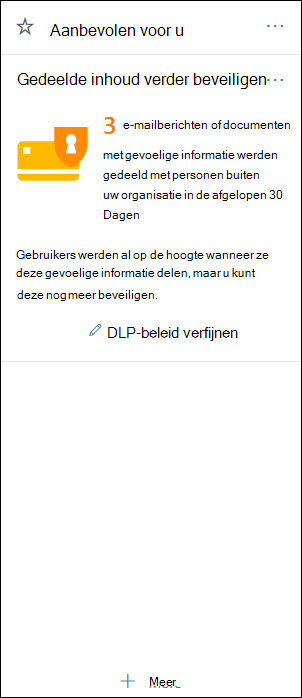
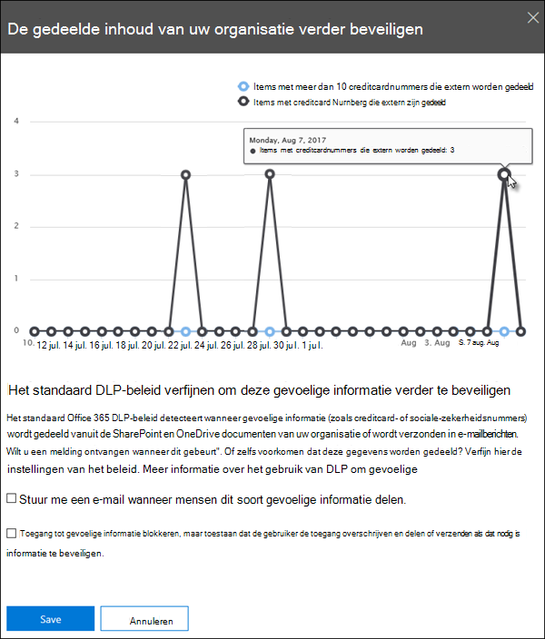

# Aan de slag met het standaard DLP-beleidGet started with the default DLP policy

Voordat u zelfs uw eerste beleid voor preventie van gegevensverlies (DLP) maakt, helpt DLP uw gevoelige informatie te beschermen met een standaardbeleid.Before you even create your first data loss prevention (DLP) policy, DLP is helping to protect your sensitive information with a default policy. Dit standaardbeleid en de aanbeveling (hieronder) helpen uw gevoelige inhoud veilig te houden door u op de hoogte te stellen wanneer e-mail of documenten met een creditcardnummer zijn gedeeld met iemand buiten uw organisatie.This default policy and its recommendation (shown below) help keep your sensitive content secure by notifying you when email or documents containing a credit card number were shared with someone outside your organization. U ziet deze aanbeveling op de **startpagina** van het Beveiligings &amp; compliancecentrum.You'll see this recommendation on the **Home** page of the Security &amp; Compliance Center. 
  
U kunt deze widget gebruiken om snel te bekijken wanneer en hoeveel gevoelige informatie is gedeeld en vervolgens met één of twee klikken het standaard DLP-beleid te verfijnen.You can use this widget to quickly view when and how much sensitive information was shared, and then refine the default DLP policy in just a click or two. U kunt ook het standaard DLP-beleid op elk moment bewerken omdat het volledig kan worden aangepast.You can also edit the default DLP policy at any time because it's fully customizable. Als u de aanbeveling eerst niet ziet, klikt u onder aan de sectie Aanbevolen **voor u** op **+Meer.**Note that if you don't see the recommendation at first, try clicking **+More** at the bottom of the **Recommended for you** section. 
  

  
## Het rapport weergeven en het standaard DLP-beleid verfijnenView the report and refine the default DLP policy

Wanneer de widget laat zien dat gebruikers gevoelige informatie hebben gedeeld met personen buiten uw organisatie, kiest u **DLP-beleid** onder aan verfijnen.When the widget shows you that users have shared sensitive information with people outside your organization, choose **Refine DLP policy** at the bottom. 
  
In het gedetailleerde rapport ziet u wanneer en hoeveel inhoud met creditcardnummers in de afgelopen 30 dagen is gedeeld.The detailed report shows you when and how much content containing credit card numbers was shared in the past 30 days. Houd er rekening mee dat het tot 48 uur kan duren voordat regels in de widget worden weer te geven.Note that rule matches can take up to 48 hours to show up in the widget.
  
Het standaard DLP-beleid om de gevoelige informatie te beschermen:To help protect the sensitive information, the default DLP policy:
  
- Detecteert wanneer inhoud in Exchange, SharePoint en OneDrive die ten minste één creditcardnummer bevat, wordt gedeeld met personen buiten uw organisatie.Detects when content in Exchange, SharePoint, and OneDrive that contains at least one credit card number is shared with people outside your organization.
    
- Toont een beleidstip en stuurt een e-mailmelding naar gebruikers wanneer ze deze gevoelige informatie proberen te delen met personen buiten uw organisatie.Shows a policy tip and sends an email notification to users when they attempt to share this sensitive information with people outside your organization. Zie E-mailmeldingen verzenden en [beleidstips](use-notifications-and-policy-tips.md)voor DLP-beleid voor meer informatie over deze opties.For more information on these options, see [Send email notifications and show policy tips for DLP policies](use-notifications-and-policy-tips.md).
    
- Genereert gedetailleerde activiteitenrapporten, zodat u bijvoorbeeld kunt bijhouden wie de inhoud heeft gedeeld met personen buiten uw organisatie en wanneer ze de inhoud hebben gedeeld.Generates detailed activity reports so that you can track things like who shared the content with people outside your organization and when they did it. U kunt de [DLP-rapporten en](view-the-dlp-reports.md) [auditlogboekgegevens](search-the-audit-log-in-security-and-compliance.md) (waar **Activiteit**  =  **DLP)** gebruiken om deze informatie weer te geven.You can use the [DLP reports](view-the-dlp-reports.md) and [audit log data](search-the-audit-log-in-security-and-compliance.md) (where **Activity** = **DLP**) to see this information.
    
Als u snel het standaard DLP-beleid wilt verfijnen, kunt u ervoor kiezen om het te gebruiken:To quickly refine the default DLP policy, you can choose to have it:
  
- Stuur u een e-mail over een incidentrapport wanneer gebruikers deze gevoelige informatie delen met personen buiten uw organisatie.Send you an incident report email when users share this sensitive information with people outside your organization.
    
- Voeg andere gebruikers toe aan het e-mailincidentrapport.Add other users to the email incident report.
    
- Blokkeer de toegang tot de inhoud die de gevoelige informatie bevat, maar laat de gebruiker de toegang overschrijven en delen of verzenden als dat nodig is.Block access to the content containing the sensitive information, but allow the user to override and share or send if they need to.
    
Zie Informatie over preventie van gegevensverlies voor meer informatie over incidentenrapporten of het beperken [van toegang.](data-loss-prevention-policies.md)For more information on incident reports or restricting access, see [Data loss prevention reference](data-loss-prevention-policies.md).
  
Als u deze opties later wilt wijzigen, kunt u het standaard DLP-beleid op elk moment bewerken: zie de volgende sectie.If you want to change these options later, you can edit the default DLP policy at any time - see the next section.
  

  
## Het standaard DLP-beleid bewerkenEdit the default DLP policy

Dit beleid heet Standaard **DLP-beleid** en wordt weergegeven onder **Preventie van** gegevensverlies op **de pagina Beleid** van het Beveiligings &amp; compliancecentrum.This policy is named **Default DLP policy** and appears under **Data loss prevention** on the **Policy** page of the Security &amp; Compliance Center. 
  
Dit beleid is volledig aanpasbaar, net zoals elk DLP-beleid dat u zelf zelf maakt.This policy is fully customizable, the same as any DLP policy that you create yourself from scratch. U kunt het beleid ook uitschakelen of verwijderen, zodat uw gebruikers geen beleidstips of e-mailmeldingen meer ontvangen.You can also turn off or delete the policy, so that your users no longer receive policy tips or email notifications.
  

  
## Wanneer de widget wel en niet wordt weergegevenWhen the widget does and does not appear

De widget met **de naam Gedeelde inhoud verder** beveiligen wordt weergegeven in de sectie Aanbevolen voor **u** op de **startpagina** van het Beveiligings &amp; compliancecentrum.The widget named **Further protect shared content** appears in the **Recommended for you** section of the **Home** page of the Security &amp; Compliance Center. 
  
Deze widget wordt alleen weergegeven wanneer:This widget appears only when:
  
- Er zijn geen beleid voor preventie van gegevensverlies in het Beveiligings compliancecentrum of &amp; Exchange beheercentrum.There are no data loss prevention policies in the Security &amp; Compliance Center or Exchange admin center. Deze widget is bedoeld om u te helpen aan de slag te gaan met DLP, zodat deze niet wordt weergegeven als u al DLP-beleid hebt.This widget is intended to help you get started with DLP, so it doesn't appear if you already have DLP policies.
    
- Inhoud met ten minste één creditcard is de afgelopen 30 dagen gedeeld met iemand buiten uw organisatie.Content containing least one credit card has been shared with someone outside your organization in the past 30 days.
    
Houd er rekening mee dat het tot 48 uur kan duren voordat regels beschikbaar zijn voor de widget, dus nadat gevoelige gegevens extern zijn gedeeld, kan het maximaal twee dagen duren voordat de aanbeveling wordt weergegeven.Note that rule matches can take up to 48 hours to be available to the widget, so after sensitive information shared externally is detected, it may take up to two days for the recommendation to appear.
  
Nadat u de widget hebt gebruikt om het standaard DLP-beleid te verfijnen, verdwijnt de widget van de **startpagina.**Finally, after you use the widget to refine the default DLP policy, the widget disappears from the **Home** page. 
  

