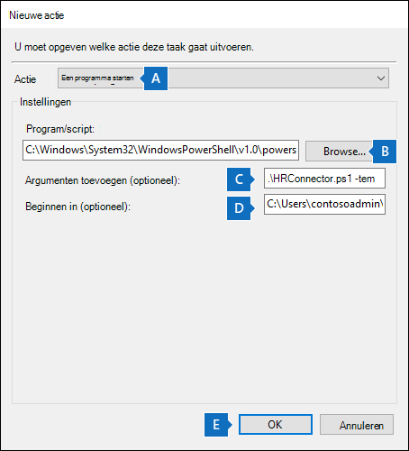

# <a name="set-up-a-connector-to-import-hr-data-in-us-government"></a><span data-ttu-id="c3324-104">Een connector instellen voor het importeren van HR-gegevens in de Amerikaanse overheid</span><span class="sxs-lookup"><span data-stu-id="c3324-104">Set up a connector to import HR data in US Government</span></span>

<span data-ttu-id="c3324-105">U kunt een gegevensconnector instellen in het Microsoft 365 compliancecentrum om HR-gegevens (HR) te importeren in uw Amerikaanse overheidsorganisatie.</span><span class="sxs-lookup"><span data-stu-id="c3324-105">You can set up a data connector in the Microsoft 365 compliance center to import human resources (HR) data to your US Government organization.</span></span> <span data-ttu-id="c3324-106">HR-gerelateerde gegevens omvatten de datum waarop een werknemer zijn aftreding heeft ingediend en de datum van de laatste dag van de werknemer.</span><span class="sxs-lookup"><span data-stu-id="c3324-106">HR-related data includes the date an employee submitted their resignation and date of the employee's last day.</span></span> <span data-ttu-id="c3324-107">Deze HR-gegevens kunnen vervolgens worden gebruikt door Microsoft-oplossingen voor informatiebeveiliging, zoals de oplossing voor [insiderrisicobeheer,](insider-risk-management.md)om uw organisatie te beschermen tegen schadelijke activiteiten of gegevensdiefstal binnen uw organisatie.</span><span class="sxs-lookup"><span data-stu-id="c3324-107">This HR data can then be used by Microsoft information protection solutions, such as the [insider risk management solution](insider-risk-management.md), to help protect your organization from malicious activity or data theft inside your organization.</span></span> <span data-ttu-id="c3324-108">Het instellen van een HR-connector bestaat uit het maken van een app in Azure Active Directory die wordt gebruikt voor verificatie door connector, het maken van een CSV-toewijzingsbestanden met uw HR-gegevens, het maken van een gegevensconnector in het compliancecentrum en het uitvoeren van een script (op een geplande basis) waarmee de HR-gegevens in het CSV-bestand worden opgenomen in de Microsoft-cloud.</span><span class="sxs-lookup"><span data-stu-id="c3324-108">Setting up an HR connector consists of creating an app in Azure Active Directory that's used for authentication by connector, creating a CSV mapping files that contains your HR data, creating a data connector in the compliance center, and then running a script (on a scheduled basis) that ingests the HR data in the CSV file to the Microsoft cloud.</span></span> <span data-ttu-id="c3324-109">Vervolgens wordt de gegevensconnector gebruikt door het insider-hulpprogramma voor risicobeheer om toegang te krijgen tot de HR-gegevens die zijn geïmporteerd in uw Microsoft 365 amerikaanse overheidsorganisatie.</span><span class="sxs-lookup"><span data-stu-id="c3324-109">Then the data connector is used by the insider risk management tool to access the HR data that was imported to your Microsoft 365 US Government organization.</span></span>

## <a name="before-you-begin"></a><span data-ttu-id="c3324-110">Voordat u begint</span><span class="sxs-lookup"><span data-stu-id="c3324-110">Before you begin</span></span>

- <span data-ttu-id="c3324-111">De gebruiker die de HR-connector maakt in stap 3, moet de rol Postvak importeren exporteren in Exchange Online.</span><span class="sxs-lookup"><span data-stu-id="c3324-111">The user who creates the HR connector in Step 3 must be assigned the Mailbox Import Export role in Exchange Online.</span></span> <span data-ttu-id="c3324-112">Deze rol is standaard niet toegewezen aan een rollengroep in Exchange Online.</span><span class="sxs-lookup"><span data-stu-id="c3324-112">By default, this role isn't assigned to any role group in Exchange Online.</span></span> <span data-ttu-id="c3324-113">U kunt de rol Postvak importeren exporteren toevoegen aan de rollengroep Organisatiebeheer in Exchange Online.</span><span class="sxs-lookup"><span data-stu-id="c3324-113">You can add the Mailbox Import Export role to the Organization Management role group in Exchange Online.</span></span> <span data-ttu-id="c3324-114">U kunt ook een nieuwe rollengroep maken, de rol Postvak importeren exporteren toewijzen en vervolgens de juiste gebruikers toevoegen als leden.</span><span class="sxs-lookup"><span data-stu-id="c3324-114">Or you can create a new role group, assign the Mailbox Import Export role, and then add the appropriate users as members.</span></span> <span data-ttu-id="c3324-115">Zie de secties [](/Exchange/permissions-exo/role-groups#create-role-groups) Rollengroepen [](/Exchange/permissions-exo/role-groups#modify-role-groups) maken of Rollengroepen wijzigen in het artikel 'Rollengroepen beheren in Exchange Online'.</span><span class="sxs-lookup"><span data-stu-id="c3324-115">For more information, see the [Create role groups](/Exchange/permissions-exo/role-groups#create-role-groups) or [Modify role groups](/Exchange/permissions-exo/role-groups#modify-role-groups) sections in the article "Manage role groups in Exchange Online".</span></span>

- <span data-ttu-id="c3324-116">U moet bepalen hoe u de gegevens uit het HR-systeem van uw organisatie (regelmatig) op haalt of exporteert en deze toevoegt aan het CSV-bestand dat wordt beschreven in stap 2.</span><span class="sxs-lookup"><span data-stu-id="c3324-116">You'll need to determine how to retrieve or export the data from your organization's HR system (on a regular basis) and add it to the CSV file that's described in Step 2.</span></span> <span data-ttu-id="c3324-117">Met het script dat u in stap 4 hebt uitgevoerd, worden de HR-gegevens in het CSV-bestand geüpload naar de Microsoft-cloud.</span><span class="sxs-lookup"><span data-stu-id="c3324-117">The script that you run in Step 4 will upload the HR data in the CSV file to the Microsoft cloud.</span></span>

- <span data-ttu-id="c3324-118">Met het voorbeeldscript dat u in stap 4 uitwerkt, worden HR-gegevens geüpload naar de Microsoft-cloud, zodat deze kunnen worden gebruikt door andere Microsoft-hulpprogramma's, zoals de oplossing voor insiderrisicobeheer.</span><span class="sxs-lookup"><span data-stu-id="c3324-118">The sample script that you run in Step 4 will upload HR data to the Microsoft cloud so that it can be used by other Microsoft tools, such as the insider risk management solution.</span></span> <span data-ttu-id="c3324-119">Dit voorbeeldscript wordt niet ondersteund onder een standaardondersteuningsprogramma of -service van Microsoft.</span><span class="sxs-lookup"><span data-stu-id="c3324-119">This sample script isn't supported under any Microsoft standard support program or service.</span></span> <span data-ttu-id="c3324-120">Het voorbeeldscript wordt geleverd als IS zonder enige garantie.</span><span class="sxs-lookup"><span data-stu-id="c3324-120">The sample script is provided AS IS without warranty of any kind.</span></span> <span data-ttu-id="c3324-121">Microsoft wijst alle impliciete garanties verder af, inclusief, zonder beperking, impliciete garanties van verkoopbaarheid of geschiktheid voor een bepaald doel.</span><span class="sxs-lookup"><span data-stu-id="c3324-121">Microsoft further disclaims all implied warranties including, without limitation, any implied warranties of merchantability or of fitness for a particular purpose.</span></span> <span data-ttu-id="c3324-122">Het volledige risico dat voortvloeit uit het gebruik of de prestaties van het voorbeeldscript en de documentatie blijft bij u.</span><span class="sxs-lookup"><span data-stu-id="c3324-122">The entire risk arising out of the use or performance of the sample script and documentation remains with you.</span></span> <span data-ttu-id="c3324-123">In geen geval zijn Microsoft, de auteurs of anderen die betrokken zijn bij het maken, produceren of leveren van de scripts aansprakelijk voor enige schade (met inbegrip van, zonder beperking, schade voor verlies van bedrijfswinsten, bedrijfsonderbreking, verlies van bedrijfsgegevens of ander geldverlies) als gevolg van het gebruik van of het onvermogen om de voorbeeldscripts of documentatie te gebruiken, zelfs als Microsoft op de hoogte is gesteld van de mogelijkheid van dergelijke schade.</span><span class="sxs-lookup"><span data-stu-id="c3324-123">In no event shall Microsoft, its authors, or anyone else involved in the creation, production, or delivery of the scripts be liable for any damages whatsoever (including, without limitation, damages for loss of business profits, business interruption, loss of business information, or other pecuniary loss) arising out of the use of or inability to use the sample scripts or documentation, even if Microsoft has been advised of the possibility of such damages.</span></span>

## <a name="step-1-create-an-app-in-azure-active-directory"></a><span data-ttu-id="c3324-124">Stap 1: Een app maken in Azure Active Directory</span><span class="sxs-lookup"><span data-stu-id="c3324-124">Step 1: Create an app in Azure Active Directory</span></span>

<span data-ttu-id="c3324-125">De eerste stap is het maken en registreren van een nieuwe app in Azure Active Directory (Azure AD).</span><span class="sxs-lookup"><span data-stu-id="c3324-125">The first step is to create and register a new app in Azure Active Directory (Azure AD).</span></span> <span data-ttu-id="c3324-126">De app komt overeen met de HR-connector die u maakt in stap 3.</span><span class="sxs-lookup"><span data-stu-id="c3324-126">The app will correspond to the HR connector that you create in Step 3.</span></span> <span data-ttu-id="c3324-127">Als u deze app maakt, kan Azure AD de HR-connector verifiëren wanneer deze wordt uitgevoerd en wordt geprobeerd toegang te krijgen tot uw organisatie.</span><span class="sxs-lookup"><span data-stu-id="c3324-127">Creating this app will allow Azure AD to authenticate the HR connector when it runs and attempts to access your organization.</span></span> <span data-ttu-id="c3324-128">Deze app wordt ook gebruikt om het script te verifiëren dat u in stap 4 gebruikt om uw HR-gegevens te uploaden naar de Microsoft-cloud.</span><span class="sxs-lookup"><span data-stu-id="c3324-128">This app will also be used to authenticate the script that you run in Step 4 to upload your HR data to the Microsoft cloud.</span></span> <span data-ttu-id="c3324-129">Sla tijdens het maken van deze Azure AD-app de volgende informatie op.</span><span class="sxs-lookup"><span data-stu-id="c3324-129">During the creation of this Azure AD app, be sure to save the following information.</span></span> <span data-ttu-id="c3324-130">Deze waarden worden in latere stappen gebruikt.</span><span class="sxs-lookup"><span data-stu-id="c3324-130">These values will be used in later steps.</span></span>

- <span data-ttu-id="c3324-131">Azure AD-toepassings-id (ook wel *de app-id* *of client-id* genoemd)</span><span class="sxs-lookup"><span data-stu-id="c3324-131">Azure AD application ID (also called the *app Id* or *client Id*)</span></span>

- <span data-ttu-id="c3324-132">Azure AD-toepassingsgeheim (ook wel het *clientgeheim genoemd)*</span><span class="sxs-lookup"><span data-stu-id="c3324-132">Azure AD application secret (also called the *client secret*)</span></span>

- <span data-ttu-id="c3324-133">Tenant-id (ook wel *adreslijst-id* genoemd)</span><span class="sxs-lookup"><span data-stu-id="c3324-133">Tenant Id (also called the *directory Id*)</span></span>

<span data-ttu-id="c3324-134">Zie Een toepassing registreren met de Microsoft identity platform voor stapsgewijs [instructies voor](/azure/active-directory/develop/quickstart-register-app)het maken van een app in Azure AD.</span><span class="sxs-lookup"><span data-stu-id="c3324-134">For step-by-step instructions for creating an app in Azure AD, see [Register an application with the Microsoft identity platform](/azure/active-directory/develop/quickstart-register-app).</span></span>

## <a name="step-2-prepare-a-csv-file-with-your-hr-data"></a><span data-ttu-id="c3324-135">Stap 2: Een CSV-bestand voorbereiden met uw HR-gegevens</span><span class="sxs-lookup"><span data-stu-id="c3324-135">Step 2: Prepare a CSV file with your HR data</span></span>

<span data-ttu-id="c3324-136">De volgende stap is het maken van een CSV-bestand met informatie over werknemers die uw organisatie hebben verlaten.</span><span class="sxs-lookup"><span data-stu-id="c3324-136">The next step is to create a CSV file that contains information about employees who have left your organization.</span></span> <span data-ttu-id="c3324-137">Zoals uitgelegd in de sectie Voordat u begint, moet u bepalen hoe u dit CSV-bestand genereert vanuit het HR-systeem van uw organisatie.</span><span class="sxs-lookup"><span data-stu-id="c3324-137">As explained in the Before You Begin section, you'll need to determine how to generate this CSV file from your organization's HR system.</span></span> <span data-ttu-id="c3324-138">In het volgende voorbeeld ziet u een voltooid CSV-bestand (geopend in notitieblok) dat de drie vereiste parameters (kolommen) bevat.</span><span class="sxs-lookup"><span data-stu-id="c3324-138">The following example shows a completed CSV file (opened in Note Pad) that contains the three required parameters (columns).</span></span> <span data-ttu-id="c3324-139">Het is veel gemakkelijker om het CSV-bestand te bewerken in Microsoft Excel.</span><span class="sxs-lookup"><span data-stu-id="c3324-139">It's much easier to edit the CSV file in Microsoft Excel.</span></span>

```text
EmailAddress,TerminationDate,LastWorkingDate
sarad@contoso.com,2019-04-23T15:18:02.4675041+05:30,2019-04-29T15:18:02.4675041+05:30
pilarp@contoso.com,2019-04-24T09:15:49Z,2019-04-29T15:18:02.7117540
```

<span data-ttu-id="c3324-140">De eerste rij of veldnamenrij van het CSV-bestand bevat de vereiste kolomnamen.</span><span class="sxs-lookup"><span data-stu-id="c3324-140">The first row, or header row, of the CSV file lists the required column names.</span></span> <span data-ttu-id="c3324-141">De naam die in elke kolomkop wordt gebruikt, is aan u (de namen in het vorige voorbeeld zijn suggesties).</span><span class="sxs-lookup"><span data-stu-id="c3324-141">The name used in each column header is up to you (the ones in the previous example are suggestions).</span></span> <span data-ttu-id="c3324-142">Dezelfde kolomnamen die u in het  CSV-bestand gebruikt, moeten echter worden opgegeven wanneer u de HR-connector maakt in stap 3.</span><span class="sxs-lookup"><span data-stu-id="c3324-142">However, the same column names you use in the CSV file *must* be specified when you create the HR connector in Step 3.</span></span> <span data-ttu-id="c3324-143">Neem geen spaties op in de kolomnamen.</span><span class="sxs-lookup"><span data-stu-id="c3324-143">Do not include spaces in the column names.</span></span>

<span data-ttu-id="c3324-144">In de volgende tabel wordt elke kolom in het CSV-bestand beschreven:</span><span class="sxs-lookup"><span data-stu-id="c3324-144">The following table describes each column in the CSV file:</span></span>

| <span data-ttu-id="c3324-145">Kolomnaam</span><span class="sxs-lookup"><span data-stu-id="c3324-145">Column name</span></span> | <span data-ttu-id="c3324-146">Beschrijving</span><span class="sxs-lookup"><span data-stu-id="c3324-146">Description</span></span> |
|:-----|:-----|
| <span data-ttu-id="c3324-147">**EmailAddress**</span><span class="sxs-lookup"><span data-stu-id="c3324-147">**EmailAddress**</span></span> <br/> |<span data-ttu-id="c3324-148">Hiermee geeft u het e-mailadres op van de beëindigde werknemer.</span><span class="sxs-lookup"><span data-stu-id="c3324-148">Specifies the email address of the terminated employee.</span></span>|
| <span data-ttu-id="c3324-149">**Beëindigingsdatum**</span><span class="sxs-lookup"><span data-stu-id="c3324-149">**TerminationDate**</span></span> <br/> |<span data-ttu-id="c3324-150">Hiermee geeft u de datum op waarop het dienstverband van de persoon officieel is beëindigd in uw organisatie.</span><span class="sxs-lookup"><span data-stu-id="c3324-150">Specifies the date the person's employment was officially terminated in your organization.</span></span> <span data-ttu-id="c3324-151">Dit kan bijvoorbeeld de datum zijn waarop de werknemer heeft laten weten uw organisatie te verlaten.</span><span class="sxs-lookup"><span data-stu-id="c3324-151">For example, this may be the date when the employee gave their notice about leaving your organization.</span></span> <span data-ttu-id="c3324-152">Deze datum kan de andere datum zijn dan de datum van de laatste werkdag van de persoon.</span><span class="sxs-lookup"><span data-stu-id="c3324-152">This date may be the different than the date of the person's last day of work.</span></span> <span data-ttu-id="c3324-153">Gebruik de volgende datumnotatie: de datum- en tijdnotatie `yyyy-mm-ddThh:mm:ss.nnnnnn+|-hh:mm` [ISO 8601.](https://www.iso.org/iso-8601-date-and-time-format.html)</span><span class="sxs-lookup"><span data-stu-id="c3324-153">Use the following date format: `yyyy-mm-ddThh:mm:ss.nnnnnn+|-hh:mm`, which is the [ISO 8601 date and time format](https://www.iso.org/iso-8601-date-and-time-format.html).</span></span>|
|<span data-ttu-id="c3324-154">**LastWorkingDate**</span><span class="sxs-lookup"><span data-stu-id="c3324-154">**LastWorkingDate**</span></span>|<span data-ttu-id="c3324-155">Hiermee geeft u de laatste dag van het werk voor de beëindigde werknemer op.</span><span class="sxs-lookup"><span data-stu-id="c3324-155">Specifies the last day of work for the terminated employee.</span></span> <span data-ttu-id="c3324-156">Gebruik de volgende datumnotatie: de datum- en tijdnotatie `yyyy-mm-ddThh:mm:ss.nnnnnn+|-hh:mm` [ISO 8601.](https://www.iso.org/iso-8601-date-and-time-format.html)</span><span class="sxs-lookup"><span data-stu-id="c3324-156">Use the following date format: `yyyy-mm-ddThh:mm:ss.nnnnnn+|-hh:mm`, which is the [ISO 8601 date and time format](https://www.iso.org/iso-8601-date-and-time-format.html).</span></span>|
|||

<span data-ttu-id="c3324-157">Nadat u het CSV-bestand met de vereiste HR-gegevens hebt gemaakt, kunt u het opslaan op hetzelfde systeem als het script dat u in stap 4 hebt uitgevoerd.</span><span class="sxs-lookup"><span data-stu-id="c3324-157">After you create the CSV file with the required HR data, store it on the same system as the script that you run in Step 4.</span></span> <span data-ttu-id="c3324-158">Zorg ervoor dat u een updatestrategie implementeert, zodat het CSV-bestand altijd de meest recente informatie bevat.</span><span class="sxs-lookup"><span data-stu-id="c3324-158">Be sure to implement an update strategy so the CSV file always contains the most current information.</span></span> <span data-ttu-id="c3324-159">Als u dit doet, worden de meest recente werknemersbeëindigingsgegevens geüpload naar de Microsoft-cloud.</span><span class="sxs-lookup"><span data-stu-id="c3324-159">Doing so ensures that that whatever you run the script, the most current employee termination data is uploaded to the Microsoft cloud.</span></span>

## <a name="step-3-create-the-hr-connector"></a><span data-ttu-id="c3324-160">Stap 3: De HR-connector maken</span><span class="sxs-lookup"><span data-stu-id="c3324-160">Step 3: Create the HR connector</span></span>

<span data-ttu-id="c3324-161">De volgende stap is het maken van een HR-connector in het Microsoft 365 compliancecentrum.</span><span class="sxs-lookup"><span data-stu-id="c3324-161">The next step is to create an HR connector in the Microsoft 365 compliance center.</span></span> <span data-ttu-id="c3324-162">Nadat u het script hebt uitgevoerd in stap 4, worden de HR-connector die u maakt, de HR-gegevens uit het CSV-bestand opgenomen in uw Microsoft 365 organisatie.</span><span class="sxs-lookup"><span data-stu-id="c3324-162">After you run the script in Step 4, the HR connector that you create will ingest the HR data from the CSV file to your Microsoft 365 organization.</span></span> <span data-ttu-id="c3324-163">Kopieer in deze stap de taak-id die wordt gegenereerd wanneer u de verbindingslijn maakt.</span><span class="sxs-lookup"><span data-stu-id="c3324-163">In this step, be sure to copy the job ID that's generated when you create the connector.</span></span> <span data-ttu-id="c3324-164">U gebruikt de taak-id wanneer u het script uit te voeren.</span><span class="sxs-lookup"><span data-stu-id="c3324-164">You'll use the job ID when you run the script.</span></span>

1. <span data-ttu-id="c3324-165">Ga naar [https://compliance.microsoft.com](https://compliance.microsoft.com) en klik vervolgens op **Gegevensconnectoren** in het linkernavigatievenster.</span><span class="sxs-lookup"><span data-stu-id="c3324-165">Go to [https://compliance.microsoft.com](https://compliance.microsoft.com) and then click **Data connectors** in the left nav.</span></span>

2. <span data-ttu-id="c3324-166">Klik op **de pagina Gegevensconnectoren** onder **HR** op **Weergeven.**</span><span class="sxs-lookup"><span data-stu-id="c3324-166">On the **Data connectors** page under **HR**, click **View**.</span></span>

3. <span data-ttu-id="c3324-167">Klik op **de pagina HR** op **Verbindingslijn toevoegen.**</span><span class="sxs-lookup"><span data-stu-id="c3324-167">On the **HR** page, click **Add connector**.</span></span>

4. <span data-ttu-id="c3324-168">Ga op **de pagina Verificatiereferenties** als volgt te werk en klik vervolgens op **Volgende:**</span><span class="sxs-lookup"><span data-stu-id="c3324-168">On the **Authentication credentials** page, do the following and then click **Next**:</span></span>

   1. <span data-ttu-id="c3324-169">Typ of plak de Azure AD-toepassings-id voor de Azure-app die u in stap 1 hebt gemaakt.</span><span class="sxs-lookup"><span data-stu-id="c3324-169">Type or paste the Azure AD application ID for the Azure app that you created in Step 1.</span></span>

   1. <span data-ttu-id="c3324-170">Typ een naam voor de HR-connector.</span><span class="sxs-lookup"><span data-stu-id="c3324-170">Type a name for the HR connector.</span></span>

5. <span data-ttu-id="c3324-171">Typ op **de pagina** Bestandstoewijzing de namen van de drie kolomkoppen (ook *wel parameters* genoemd) van het CSV-bestand dat u in stap 2 in elk van de juiste vakken hebt gemaakt.</span><span class="sxs-lookup"><span data-stu-id="c3324-171">On the **File mapping** page, type the names of the three column headers (also called *parameters*) from the CSV file that you created in Step 2 in each of the appropriate boxes.</span></span> <span data-ttu-id="c3324-172">De namen zijn niet case-sensitive.</span><span class="sxs-lookup"><span data-stu-id="c3324-172">The names are not case-sensitive.</span></span> <span data-ttu-id="c3324-173">Zoals eerder is uitgelegd, moeten de namen die u in deze vakken typt, overeenkomen met de parameternamen in uw CSV-bestand.</span><span class="sxs-lookup"><span data-stu-id="c3324-173">As previously explained, the names that you type in these boxes must match the parameter names in your CSV file.</span></span> <span data-ttu-id="c3324-174">In de volgende schermafbeelding ziet u bijvoorbeeld de parameternamen uit het voorbeeld in een CSV-voorbeeldbestand dat wordt weergegeven in stap 2.</span><span class="sxs-lookup"><span data-stu-id="c3324-174">For example, the following screenshot shows the parameter names from the example in sample CSV file shown in Step 2.</span></span>

   

6. <span data-ttu-id="c3324-176">Controleer op **de pagina** Controleren uw instellingen en klik vervolgens **op Voltooien** om de verbindingslijn te maken.</span><span class="sxs-lookup"><span data-stu-id="c3324-176">On the **Review** page, review your settings and then click **Finish** to create the connector.</span></span>

   <span data-ttu-id="c3324-177">Er wordt een statuspagina weergegeven die bevestigt dat de verbindingslijn is gemaakt.</span><span class="sxs-lookup"><span data-stu-id="c3324-177">A status page is displayed that confirms the connector was created.</span></span> <span data-ttu-id="c3324-178">Deze pagina bevat twee belangrijke dingen die u nodig hebt om de volgende stap uit te voeren om het voorbeeldscript uit te voeren om uw HR-gegevens te uploaden.</span><span class="sxs-lookup"><span data-stu-id="c3324-178">This page contains two important things that you need to complete the next step to run the sample script to upload your HR data.</span></span>

   

   1. <span data-ttu-id="c3324-180">**Taak-id.**</span><span class="sxs-lookup"><span data-stu-id="c3324-180">**Job ID.**</span></span> <span data-ttu-id="c3324-181">U hebt deze taak-id nodig om het script in de volgende stap uit te voeren.</span><span class="sxs-lookup"><span data-stu-id="c3324-181">You'll need this job ID to run the script in the next step.</span></span> <span data-ttu-id="c3324-182">U kunt deze kopiëren vanaf deze pagina of vanaf de flyoutpagina van de verbindingslijn.</span><span class="sxs-lookup"><span data-stu-id="c3324-182">You can copy it from this page or from the connector flyout page.</span></span>
   
   1. <span data-ttu-id="c3324-183">**Koppeling maken naar voorbeeldscript.**</span><span class="sxs-lookup"><span data-stu-id="c3324-183">**Link to sample script.**</span></span> <span data-ttu-id="c3324-184">Klik op **de koppeling** hier om naar de GitHub site te gaan om het voorbeeldscript te openen (met de koppeling wordt een nieuw venster geopend).</span><span class="sxs-lookup"><span data-stu-id="c3324-184">Click the **here** link to go to the GitHub site to access the sample script (the link opens a new window).</span></span> <span data-ttu-id="c3324-185">Houd dit venster open, zodat u het script kunt kopiëren in stap 4.</span><span class="sxs-lookup"><span data-stu-id="c3324-185">Keep this window open so that you can copy the script in Step 4.</span></span> <span data-ttu-id="c3324-186">U kunt ook een bladwijzer toevoegen aan de bestemming of de URL kopiëren, zodat u deze opnieuw kunt openen in stap 4.</span><span class="sxs-lookup"><span data-stu-id="c3324-186">Alternatively, you can bookmark the destination or copy the URL so you can access it again in Step 4.</span></span> <span data-ttu-id="c3324-187">Deze koppeling is ook beschikbaar op de flyoutpagina van de verbindingslijn.</span><span class="sxs-lookup"><span data-stu-id="c3324-187">This link is also available on the connector flyout page.</span></span>

7. <span data-ttu-id="c3324-188">Klik op **Gereed**.</span><span class="sxs-lookup"><span data-stu-id="c3324-188">Click **Done**.</span></span>

   <span data-ttu-id="c3324-189">De nieuwe verbindingslijn wordt weergegeven in de lijst op het **tabblad Connectors.**</span><span class="sxs-lookup"><span data-stu-id="c3324-189">The new connector is displayed in the list on the **Connectors** tab.</span></span> 

8. <span data-ttu-id="c3324-190">Klik op de HR-connector die u zojuist hebt gemaakt om de flyoutpagina weer te geven, die eigenschappen en andere informatie over de verbindingslijn bevat.</span><span class="sxs-lookup"><span data-stu-id="c3324-190">Click the HR connector that you just created to display the flyout page, which contains properties and other information about the connector.</span></span>

   

   <span data-ttu-id="c3324-192">Als u dit nog niet hebt gedaan, kunt u de waarden voor de **azure-app-id** en **connector-taak-id kopiëren.**</span><span class="sxs-lookup"><span data-stu-id="c3324-192">If you haven't already done so, you can copy the values for the **Azure App ID** and **Connector job ID**.</span></span> <span data-ttu-id="c3324-193">U hebt deze nodig om het script in de volgende stap uit te voeren.</span><span class="sxs-lookup"><span data-stu-id="c3324-193">You'll need these to run the script in the next step.</span></span> <span data-ttu-id="c3324-194">U kunt het script ook downloaden vanaf de flyoutpagina (of het downloaden via de koppeling in de volgende stap.)</span><span class="sxs-lookup"><span data-stu-id="c3324-194">You can also download the script from the flyout page (or download it using the link in the next step.)</span></span>

   <span data-ttu-id="c3324-195">U kunt ook op **Bewerken klikken om** de Azure App-id of de kolomkopnamen te wijzigen die u hebt gedefinieerd op de pagina **Bestandstoewijzing.**</span><span class="sxs-lookup"><span data-stu-id="c3324-195">You can also click **Edit** to change the Azure App ID or the column header names that you defined on the **File mapping** page.</span></span>

## <a name="step-4-run-the-sample-script-to-upload-your-hr-data"></a><span data-ttu-id="c3324-196">Stap 4: Het voorbeeldscript uitvoeren om uw HR-gegevens te uploaden</span><span class="sxs-lookup"><span data-stu-id="c3324-196">Step 4: Run the sample script to upload your HR data</span></span>

<span data-ttu-id="c3324-197">De laatste stap bij het instellen van een HR-connector is het uitvoeren van een voorbeeldscript dat de HR-gegevens in het CSV-bestand (die u in stap 2 hebt gemaakt) naar de Microsoft-cloud uploadt.</span><span class="sxs-lookup"><span data-stu-id="c3324-197">The last step in setting up an HR connector is to run a sample script that will upload the HR data in the CSV file (that you created in Step 2) to the Microsoft cloud.</span></span> <span data-ttu-id="c3324-198">Met het script worden de gegevens geüpload naar de HR-connector.</span><span class="sxs-lookup"><span data-stu-id="c3324-198">Specifically, the script uploads the data to the HR connector.</span></span> <span data-ttu-id="c3324-199">Nadat u het script hebt uitgevoerd, importeert de HR-connector die u hebt gemaakt in stap 3 de HR-gegevens naar uw Microsoft 365-organisatie waar deze toegankelijk zijn via andere compliancehulpmiddelen, zoals de Insider-oplossing voor risicobeheer.</span><span class="sxs-lookup"><span data-stu-id="c3324-199">After you run the script, the HR connector that you created in Step 3 imports the HR data to your Microsoft 365 organization where it can accessed by other compliance tools, such as the Insider risk management solution.</span></span> <span data-ttu-id="c3324-200">Nadat u het script hebt uitgevoerd, kunt u overwegen om een taak te plannen om deze automatisch dagelijks uit te voeren, zodat de meest recente werknemersbeëindigingsgegevens worden geüpload naar de Microsoft-cloud.</span><span class="sxs-lookup"><span data-stu-id="c3324-200">After you run the script, consider scheduling a task to run it automatically on a daily basis so the most current employee termination data is uploaded to the Microsoft cloud.</span></span> <span data-ttu-id="c3324-201">Zie [Het script automatisch uitvoeren plannen.](#optional-step-6-schedule-the-script-to-run-automatically)</span><span class="sxs-lookup"><span data-stu-id="c3324-201">See [Schedule the script to run automatically](#optional-step-6-schedule-the-script-to-run-automatically).</span></span>

1. <span data-ttu-id="c3324-202">Ga naar het venster dat u hebt geopend vanaf de vorige stap om toegang te krijgen tot de GitHub site met het voorbeeldscript.</span><span class="sxs-lookup"><span data-stu-id="c3324-202">Go to window that you left open from the previous step to access the GitHub site with the sample script.</span></span> <span data-ttu-id="c3324-203">U kunt ook de site met bladwijzers openen of de URL gebruiken die u hebt gekopieerd.</span><span class="sxs-lookup"><span data-stu-id="c3324-203">Alternatively, open the bookmarked site or use the URL that you copied.</span></span>

2. <span data-ttu-id="c3324-204">Klik op **de knop Raw** om het script weer te geven in de tekstweergave.</span><span class="sxs-lookup"><span data-stu-id="c3324-204">Click the **Raw** button to display the script in text view.</span></span>

3. <span data-ttu-id="c3324-205">Kopieer alle regels in het voorbeeldscript en sla ze vervolgens op in een tekstbestand.</span><span class="sxs-lookup"><span data-stu-id="c3324-205">Copy all the lines in the sample script and then save them to a text file.</span></span>

4. <span data-ttu-id="c3324-206">Wijzig indien nodig het voorbeeldscript voor uw organisatie.</span><span class="sxs-lookup"><span data-stu-id="c3324-206">Modify the sample script for your organization, if necessary.</span></span>

5. <span data-ttu-id="c3324-207">Sla het tekstbestand op als Windows PowerShell scriptbestand met een bestandsnaamachtervoegsel van `.ps1` bijvoorbeeld `HRConnector.ps1` .</span><span class="sxs-lookup"><span data-stu-id="c3324-207">Save the text file as a Windows PowerShell script file by using a filename suffix of `.ps1`; for example, `HRConnector.ps1`.</span></span>

6. <span data-ttu-id="c3324-208">Open een opdrachtprompt op uw lokale computer en ga naar de adreslijst waar u het script hebt opgeslagen.</span><span class="sxs-lookup"><span data-stu-id="c3324-208">Open a Command Prompt on your local computer, and go to the directory where you saved the script.</span></span>

7. <span data-ttu-id="c3324-209">Voer de volgende opdracht uit om de HR-gegevens in het CSV-bestand te uploaden naar de Microsoft-cloud. bijvoorbeeld:</span><span class="sxs-lookup"><span data-stu-id="c3324-209">Run the following command to upload the HR data in the CSV file to the Microsoft cloud; for example:</span></span>

    ```powershell
    .\HRConnector.ps1 -tenantId <tenantId> -appId <appId>  -appSecret <appSecret>  -jobId <jobId>  -csvFilePath '<csvFilePath>'
    ```

   <span data-ttu-id="c3324-210">In de volgende tabel worden de parameters beschreven die u wilt gebruiken met dit script en de vereiste waarden.</span><span class="sxs-lookup"><span data-stu-id="c3324-210">The following table describes the parameters to use with this script and their required values.</span></span> <span data-ttu-id="c3324-211">De gegevens die u in de vorige stappen hebt verkregen, worden gebruikt in de waarden voor deze parameters.</span><span class="sxs-lookup"><span data-stu-id="c3324-211">The information you obtained in the previous steps is used in the values for these parameters.</span></span>

   | <span data-ttu-id="c3324-212">Parameter</span><span class="sxs-lookup"><span data-stu-id="c3324-212">Parameter</span></span> | <span data-ttu-id="c3324-213">Beschrijving</span><span class="sxs-lookup"><span data-stu-id="c3324-213">Description</span></span> |
   |:-----|:-----|:-----|
   |`tenantId`|<span data-ttu-id="c3324-214">De id voor uw Microsoft 365 organisatie die u hebt verkregen in stap 1.</span><span class="sxs-lookup"><span data-stu-id="c3324-214">The Id for your Microsoft 365 organization that you obtained in Step 1.</span></span> <span data-ttu-id="c3324-215">U kunt ook de tenant-id voor uw organisatie verkrijgen op het **overzichtsblad** in het Azure AD-beheercentrum.</span><span class="sxs-lookup"><span data-stu-id="c3324-215">You can also obtain the tenant Id for your organization on the **Overview** blade in the Azure AD admin center.</span></span> <span data-ttu-id="c3324-216">Dit wordt gebruikt om uw organisatie te identificeren.</span><span class="sxs-lookup"><span data-stu-id="c3324-216">This is used to identify your organization.</span></span>|
   |`appId` |<span data-ttu-id="c3324-217">De Azure AD-toepassing-id voor de app die u hebt gemaakt in Azure AD in stap 1.</span><span class="sxs-lookup"><span data-stu-id="c3324-217">The Azure AD application Id for the app that you created in Azure AD in Step 1.</span></span> <span data-ttu-id="c3324-218">Dit wordt door Azure AD gebruikt voor verificatie wanneer het script toegang probeert te krijgen tot uw Microsoft 365 organisatie.</span><span class="sxs-lookup"><span data-stu-id="c3324-218">This is used by Azure AD for authentication when the script attempts to accesses your Microsoft 365 organization.</span></span> |
   |`appSecret`|<span data-ttu-id="c3324-219">Het geheim van de Azure AD-toepassing voor de app die u hebt gemaakt in Azure AD in stap 1.</span><span class="sxs-lookup"><span data-stu-id="c3324-219">The Azure AD application secret for the app that you created in Azure AD in Step 1.</span></span> <span data-ttu-id="c3324-220">Dit wordt ook gebruikt voor verificatie.</span><span class="sxs-lookup"><span data-stu-id="c3324-220">This also used for authentication.</span></span>|
   |`jobId`|<span data-ttu-id="c3324-221">De taak-id voor de HR-connector die u hebt gemaakt in stap 3.</span><span class="sxs-lookup"><span data-stu-id="c3324-221">The job ID for the HR connector that you created in Step 3.</span></span> <span data-ttu-id="c3324-222">Dit wordt gebruikt om de HR-gegevens die naar de Microsoft-cloud worden geüpload, te koppelen aan de HR-connector.</span><span class="sxs-lookup"><span data-stu-id="c3324-222">This is used to associate the HR data that is uploaded to the Microsoft cloud with the HR connector.</span></span>|
   |`csvFilePath`|<span data-ttu-id="c3324-223">Het bestandspad voor het CSV-bestand (opgeslagen op hetzelfde systeem als het script) dat u hebt gemaakt in stap 2.</span><span class="sxs-lookup"><span data-stu-id="c3324-223">The file path for the CSV file (stored on the same system as the script) that you created in Step 2.</span></span> <span data-ttu-id="c3324-224">Probeer spaties in het bestandspad te vermijden. gebruik anders enkele aanhalingstekens.</span><span class="sxs-lookup"><span data-stu-id="c3324-224">Try to avoid spaces in the file path; otherwise use single quotation marks.</span></span>|
   |||
   
   <span data-ttu-id="c3324-225">Hier is een voorbeeld van de syntaxis voor het HR-connectorscript met werkelijke waarden voor elke parameter:</span><span class="sxs-lookup"><span data-stu-id="c3324-225">Here's an example of the syntax for the HR connector script using actual values for each parameter:</span></span>

   ```powershell
    .\HRConnector.ps1 -tenantId d5723623-11cf-4e2e-b5a5-01d1506273g9 -appId 29ee526e-f9a7-4e98-a682-67f41bfd643e -appSecret MNubVGbcQDkGCnn -jobId b8be4a7d-e338-43eb-a69e-c513cd458eba -csvFilePath 'C:\Users\contosoadmin\Desktop\Data\employee_termination_data.csv'
    ```

   <span data-ttu-id="c3324-226">Als het uploaden is gelukt, wordt in het script het **Upload bericht Geslaagd** weergegeven.</span><span class="sxs-lookup"><span data-stu-id="c3324-226">If the upload is successful, the script displays the **Upload Successful** message.</span></span>

   > [!NOTE]
   > <span data-ttu-id="c3324-227">Als u problemen hebt met het uitvoeren [](/powershell/module/microsoft.powershell.core/about/about_execution_policies) van de vorige opdracht vanwege uitvoeringsbeleid, zie Over uitvoeringsbeleid en [Set-ExecutionPolicy](/powershell/module/microsoft.powershell.security/set-executionpolicy) voor informatie over het instellen van uitvoeringsbeleid.</span><span class="sxs-lookup"><span data-stu-id="c3324-227">If you have problems running the previous command because of execution policies, see [About Execution Policies](/powershell/module/microsoft.powershell.core/about/about_execution_policies) and [Set-ExecutionPolicy](/powershell/module/microsoft.powershell.security/set-executionpolicy) for guidance about setting execution policies.</span></span>

## <a name="step-5-monitor-the-hr-connector"></a><span data-ttu-id="c3324-228">Stap 5: De HR-connector controleren</span><span class="sxs-lookup"><span data-stu-id="c3324-228">Step 5: Monitor the HR connector</span></span>

<span data-ttu-id="c3324-229">Nadat u de HR-connector hebt gemaakt en het script hebt uitgevoerd om uw HR-gegevens te uploaden, kunt u de connector bekijken en de status uploaden in het Microsoft 365 compliancecentrum.</span><span class="sxs-lookup"><span data-stu-id="c3324-229">After you create the HR connector and run the script to upload your HR data, you can view the connector and upload status in the Microsoft 365 compliance center.</span></span> <span data-ttu-id="c3324-230">Als u het script regelmatig automatisch wilt uitvoeren, kunt u ook de huidige status weergeven nadat het script voor het laatst is uitgevoerd.</span><span class="sxs-lookup"><span data-stu-id="c3324-230">If you schedule the script to run automatically on a regular basis, you can also view the current status after the last time the script ran.</span></span>

1. <span data-ttu-id="c3324-231">Ga naar [https://compliance.microsoft.com](https://compliance.microsoft.com) en klik op **Gegevensconnectoren** in het linkernavigatievenster.</span><span class="sxs-lookup"><span data-stu-id="c3324-231">Go to [https://compliance.microsoft.com](https://compliance.microsoft.com) and click **Data connectors** in the left nav.</span></span>

2. <span data-ttu-id="c3324-232">Klik op **het tabblad Verbindingslijnen** en selecteer vervolgens de HR-verbindingslijn om de flyoutpagina weer te geven.</span><span class="sxs-lookup"><span data-stu-id="c3324-232">Click the **Connectors** tab and then select the HR connector to display the flyout page.</span></span> <span data-ttu-id="c3324-233">Deze pagina bevat de eigenschappen en informatie over de verbindingslijn.</span><span class="sxs-lookup"><span data-stu-id="c3324-233">This page contains the properties and information about the connector.</span></span>

   

3. <span data-ttu-id="c3324-235">Klik **onder** Voortgang op de **koppeling Logboek downloaden** om het statuslogboek voor de verbindingslijn te openen (of op te slaan).</span><span class="sxs-lookup"><span data-stu-id="c3324-235">Under **Progress**, click the **Download log** link to open (or save) the status log for the connector.</span></span> <span data-ttu-id="c3324-236">Dit logboek bevat informatie over elke keer dat het script wordt uitgevoerd en uploadt de gegevens uit het CSV-bestand naar de Microsoft-cloud.</span><span class="sxs-lookup"><span data-stu-id="c3324-236">This log contains information about each time the script runs and uploads the data from the CSV file to the Microsoft cloud.</span></span> 

   

   <span data-ttu-id="c3324-238">Het veld geeft het aantal rijen aan in het `RecordsSaved` CSV-bestand dat is geüpload.</span><span class="sxs-lookup"><span data-stu-id="c3324-238">The `RecordsSaved` field indicates the number of rows in the CSV file that uploaded.</span></span> <span data-ttu-id="c3324-239">Als het CSV-bestand bijvoorbeeld vier rijen bevat, is de waarde van de velden 4, als het script alle rijen in het `RecordsSaved` CSV-bestand heeft geüpload.</span><span class="sxs-lookup"><span data-stu-id="c3324-239">For example, if the CSV file contains four rows, then the value of the `RecordsSaved` fields is 4, if the script successfully uploaded all the rows in the CSV file.</span></span>

<span data-ttu-id="c3324-240">Als u het script niet hebt uitgevoerd in stap 4, wordt een koppeling voor het downloaden van het script weergegeven onder **Laatst importeren.**</span><span class="sxs-lookup"><span data-stu-id="c3324-240">If you've haven't run the script in Step 4, a link to download the script is displayed under **Last import**.</span></span> <span data-ttu-id="c3324-241">U kunt het script downloaden en vervolgens de stappen in stap 4 volgen om het uit te voeren.</span><span class="sxs-lookup"><span data-stu-id="c3324-241">You can download the script and then follow the steps in Step 4 to run it.</span></span>

## <a name="optional-step-6-schedule-the-script-to-run-automatically"></a><span data-ttu-id="c3324-242">(Optioneel) Stap 6: Het script automatisch laten uitvoeren</span><span class="sxs-lookup"><span data-stu-id="c3324-242">(Optional) Step 6: Schedule the script to run automatically</span></span>

<span data-ttu-id="c3324-243">Om ervoor te zorgen dat de meest recente HR-gegevens van uw organisatie beschikbaar zijn voor hulpprogramma's zoals de oplossing voor insiderrisicobeheer, raden we u aan het script automatisch te plannen op terugkerende basis, zoals eenmaal per dag.</span><span class="sxs-lookup"><span data-stu-id="c3324-243">To make sure the latest HR data from your organization is available to tools like the insider risk management solution, we recommend that you schedule the script to run automatically on a recurring basis, such as once a day.</span></span> <span data-ttu-id="c3324-244">Hiervoor moet u ook de HR-gegevens in het CSV-bestand bijwerken volgens een vergelijkbaar (zo niet hetzelfde) schema, zodat deze de meest recente informatie bevatten over werknemers die uw organisatie verlaten.</span><span class="sxs-lookup"><span data-stu-id="c3324-244">This also requires that you update the HR data in the CSV file on a similar (if not the same) schedule so that it contains the latest information about employees who leave your organization.</span></span> <span data-ttu-id="c3324-245">Het doel is om de meest recente HR-gegevens te uploaden, zodat de HR-connector deze beschikbaar kan maken voor de insider-oplossing voor risicobeheer.</span><span class="sxs-lookup"><span data-stu-id="c3324-245">The goal is to upload the most current HR data so that the HR connector can make it available to the insider risk management solution.</span></span>

<span data-ttu-id="c3324-246">U kunt de app Taakplanning gebruiken in Windows om het script elke dag automatisch uit te voeren.</span><span class="sxs-lookup"><span data-stu-id="c3324-246">You can user the Task Scheduler app in Windows to automatically run the script every day.</span></span>

1. <span data-ttu-id="c3324-247">Klik op uw lokale computer op de Windows **startknop** en typ **vervolgens Taakplanning.**</span><span class="sxs-lookup"><span data-stu-id="c3324-247">On your local computer, click the Windows **Start** button and then type **Task Scheduler**.</span></span>

2. <span data-ttu-id="c3324-248">Klik op **de app Taakplanning om** deze te openen.</span><span class="sxs-lookup"><span data-stu-id="c3324-248">Click the **Task Scheduler** app to open it.</span></span>

3. <span data-ttu-id="c3324-249">Klik in **de sectie** Acties op **Taak maken.**</span><span class="sxs-lookup"><span data-stu-id="c3324-249">In the **Actions** section, click **Create Task**.</span></span>

4. <span data-ttu-id="c3324-250">Typ op **het** tabblad Algemeen een beschrijvende naam voor de geplande taak. bijvoorbeeld HR **Connector Script**.</span><span class="sxs-lookup"><span data-stu-id="c3324-250">On the **General** tab, type a descriptive name for the scheduled task; for example, **HR Connector Script**.</span></span> <span data-ttu-id="c3324-251">U kunt ook een optionele beschrijving toevoegen.</span><span class="sxs-lookup"><span data-stu-id="c3324-251">You can also add an optional description.</span></span>

5. <span data-ttu-id="c3324-252">Ga **als volgt te** werk onder Beveiligingsopties:</span><span class="sxs-lookup"><span data-stu-id="c3324-252">Under **Security options**, do the following:</span></span>

   1. <span data-ttu-id="c3324-253">Bepaal of u het script alleen wilt uitvoeren wanneer u bent aangemeld bij de computer of wanneer u bent aangemeld of niet.</span><span class="sxs-lookup"><span data-stu-id="c3324-253">Determine whether to run the script only when you're logged on to the computer or run it when you're logged on or not.</span></span>
   
   1. <span data-ttu-id="c3324-254">Controleer of het selectievakje **Uitvoeren met de hoogste bevoegdheden** is ingeschakeld.</span><span class="sxs-lookup"><span data-stu-id="c3324-254">Make sure that the **Run with the highest privileges** checkbox is selected.</span></span>

6. <span data-ttu-id="c3324-255">Selecteer het **tabblad Triggers,** klik **op Nieuw** en ga vervolgens als volgt te werk:</span><span class="sxs-lookup"><span data-stu-id="c3324-255">Select the **Triggers** tab, click **New**, and then do the following things:</span></span>

   1. <span data-ttu-id="c3324-256">Selecteer **Instellingen** de optie  Dagelijks en kies een datum en tijd om het script voor het eerst uit te voeren.</span><span class="sxs-lookup"><span data-stu-id="c3324-256">Under **Settings**, select the **Daily** option, and then choose a date and time to run the script for the first time.</span></span> <span data-ttu-id="c3324-257">Het script wordt elke dag op dezelfde opgegeven tijd gebruikt.</span><span class="sxs-lookup"><span data-stu-id="c3324-257">The script will every day at the same specified time.</span></span>
   
   1. <span data-ttu-id="c3324-258">Controleer **onder Geavanceerde** instellingen of **het** selectievakje Ingeschakeld is ingeschakeld.</span><span class="sxs-lookup"><span data-stu-id="c3324-258">Under **Advanced settings**, make sure the **Enabled** checkbox is selected.</span></span>
   
   1. <span data-ttu-id="c3324-259">Klik **op Ok**.</span><span class="sxs-lookup"><span data-stu-id="c3324-259">Click **Ok**.</span></span>

7. <span data-ttu-id="c3324-260">Selecteer het **tabblad** Acties, klik **op Nieuw** en ga als volgt te werk:</span><span class="sxs-lookup"><span data-stu-id="c3324-260">Select the **Actions** tab, click **New**, and then do the following things:</span></span>

   

   1. <span data-ttu-id="c3324-262">Zorg ervoor **dat een** programma  starten is geselecteerd in de vervolgkeuzelijst Actie.</span><span class="sxs-lookup"><span data-stu-id="c3324-262">In the **Action** dropdown list, make sure that **Start a program** is selected.</span></span>

   1. <span data-ttu-id="c3324-263">Klik in **het vak Programma/script** op **Bladeren** en ga naar de volgende locatie en selecteer het pad zodat het pad wordt weergegeven in het vak: `C:\Windows\System32\WindowsPowerShell\v1.0\powershell.exe` .</span><span class="sxs-lookup"><span data-stu-id="c3324-263">In the **Program/script** box, click **Browse**, and go to the following location and select it so the path is displayed in the box: `C:\Windows\System32\WindowsPowerShell\v1.0\powershell.exe`.</span></span>

   1. <span data-ttu-id="c3324-264">Plak in **het vak Argumenten toevoegen (optioneel)** dezelfde scriptopdracht die u hebt gebruikt in stap 4.</span><span class="sxs-lookup"><span data-stu-id="c3324-264">In the **Add arguments (optional)** box, paste the same script command that you ran in Step 4.</span></span> <span data-ttu-id="c3324-265">Bijvoorbeeld: `.\HRConnector.ps1 -tenantId "d5723623-11cf-4e2e-b5a5-01d1506273g9" -appId "c12823b7-b55a-4989-faba-02de41bb97c3" -appSecret "MNubVGbcQDkGCnn"  -jobId "e081f4f4-3831-48d6-7bb3-fcfab1581458" -csvFilePath "C:\Users\contosoadmin\Desktop\Data\employee_termination_data.csv"`</span><span class="sxs-lookup"><span data-stu-id="c3324-265">For example, `.\HRConnector.ps1 -tenantId "d5723623-11cf-4e2e-b5a5-01d1506273g9" -appId "c12823b7-b55a-4989-faba-02de41bb97c3" -appSecret "MNubVGbcQDkGCnn"  -jobId "e081f4f4-3831-48d6-7bb3-fcfab1581458" -csvFilePath "C:\Users\contosoadmin\Desktop\Data\employee_termination_data.csv"`</span></span>

   1. <span data-ttu-id="c3324-266">Plak in **het vak Start in (optioneel)** de maplocatie van het script dat u hebt gebruikt in stap 4.</span><span class="sxs-lookup"><span data-stu-id="c3324-266">In the **Start in (optional)** box, paste the folder location of the script that you ran in Step 4.</span></span> <span data-ttu-id="c3324-267">Bijvoorbeeld `C:\Users\contosoadmin\Desktop\Scripts`.</span><span class="sxs-lookup"><span data-stu-id="c3324-267">For example, `C:\Users\contosoadmin\Desktop\Scripts`.</span></span>

   1. <span data-ttu-id="c3324-268">Klik **op Ok** om de instellingen voor de nieuwe actie op te slaan.</span><span class="sxs-lookup"><span data-stu-id="c3324-268">Click **Ok** to save the settings for the new action.</span></span>

8. <span data-ttu-id="c3324-269">Klik in **het venster Taak** maken op Ok **om** de geplande taak op te slaan.</span><span class="sxs-lookup"><span data-stu-id="c3324-269">In the **Create Task** window, click **Ok** to save the scheduled task.</span></span> <span data-ttu-id="c3324-270">Mogelijk wordt u gevraagd uw referenties voor uw gebruikersaccount in te voeren.</span><span class="sxs-lookup"><span data-stu-id="c3324-270">You might be prompted to enter your user account credentials.</span></span>

   <span data-ttu-id="c3324-271">De nieuwe taak wordt weergegeven in de bibliotheek Taakplanning.</span><span class="sxs-lookup"><span data-stu-id="c3324-271">The new task is displayed in the Task Scheduler Library.</span></span>

   

   <span data-ttu-id="c3324-273">De laatste keer dat het script is uitgevoerd en de volgende keer dat het wordt uitgevoerd, wordt weergegeven.</span><span class="sxs-lookup"><span data-stu-id="c3324-273">The last time the script ran and the next time it's scheduled to run is displayed.</span></span> <span data-ttu-id="c3324-274">U kunt dubbelklikken op de taak om deze te bewerken.</span><span class="sxs-lookup"><span data-stu-id="c3324-274">You can double-click the task to edit it.</span></span>

   <span data-ttu-id="c3324-275">U kunt ook controleren wanneer het script voor het laatst is gebruikt op de flyoutpagina van de bijbehorende HR-connector in het compliancecentrum.</span><span class="sxs-lookup"><span data-stu-id="c3324-275">You can also verify the last time the script ran on the flyout page of the corresponding HR connector in the compliance center.</span></span>