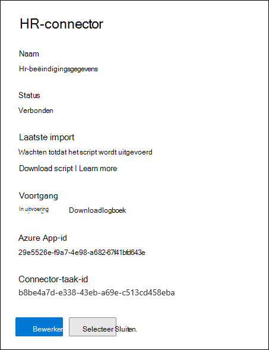
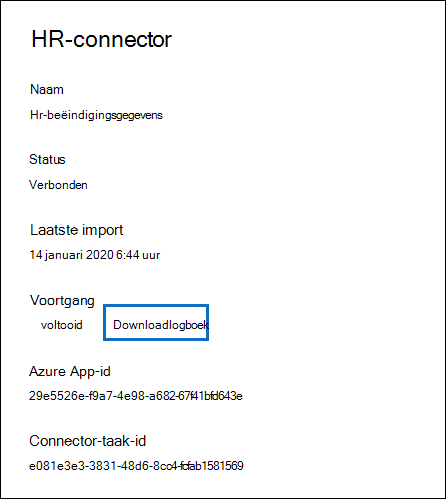
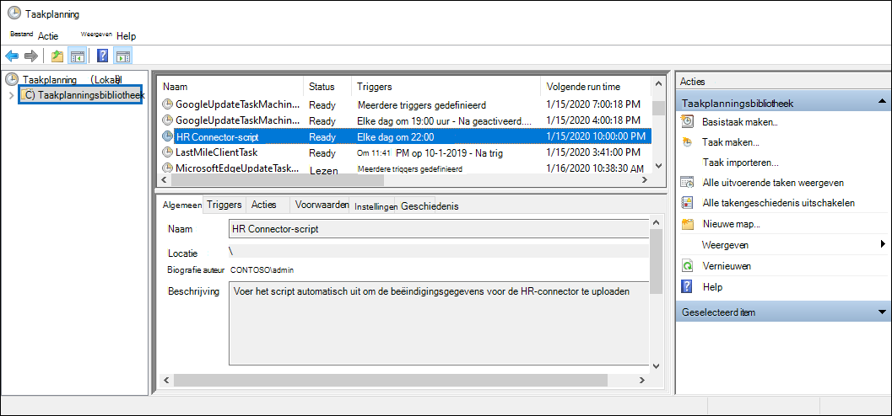

# <a name="set-up-a-connector-to-import-hr-data"></a><span data-ttu-id="2c8a5-104">Een verbindingslijn instellen om HR-gegevens te importeren</span><span class="sxs-lookup"><span data-stu-id="2c8a5-104">Set up a connector to import HR data</span></span>

<span data-ttu-id="2c8a5-105">U kunt een gegevensconnector instellen in het Microsoft 365 compliancecentrum om HR-gegevens (HR) te importeren die betrekking hebben op gebeurtenissen, zoals het aftreden van een gebruiker of een wijziging in het taakniveau van een gebruiker.</span><span class="sxs-lookup"><span data-stu-id="2c8a5-105">You can set up a data connector in the Microsoft 365 compliance center to import human resources (HR) data related to events such as a user's resignation or a change in a user's job level.</span></span> <span data-ttu-id="2c8a5-106">De HR-gegevens kunnen vervolgens worden gebruikt door de [insider-oplossing](insider-risk-management.md) voor risicobeheer om risico-indicatoren te genereren die u kunnen helpen bij het identificeren van mogelijke schadelijke activiteiten of gegevensdiefstal door gebruikers binnen uw organisatie.</span><span class="sxs-lookup"><span data-stu-id="2c8a5-106">The HR data can then be used by the [insider risk management solution](insider-risk-management.md) to generate risk indicators that can help you identity possible malicious activity or data theft by users inside your organization.</span></span>

<span data-ttu-id="2c8a5-107">Het instellen van een connector voor HR-gegevens die door insiderrisicobeheerbeleid kan worden gebruikt om risico-indicatoren te genereren, bestaat uit het maken van een CSV-bestand dat de HR-gegevens bevat, het maken van een app in Azure Active Directory die wordt gebruikt voor verificatie, het maken van een HR-gegevensconnector in het Microsoft 365-compliancecentrum en het uitvoeren van een script (op een geplande basis) dat de HR-gegevens in CSV-bestanden in de Microsoft-cloud opslokt, zodat deze beschikbaar zijn voor de oplossing voor insiderrisicobeheer.</span><span class="sxs-lookup"><span data-stu-id="2c8a5-107">Setting up a connector for HR data that insider risk management policies can use to generate risk indicators consists of creating a CSV file that contains that contains the HR data, creating an app in Azure Active Directory that's used for authentication, creating an HR data connector in the Microsoft 365 compliance center, and then running a script (on a scheduled basis) that ingests the HR data in CSV files to the Microsoft cloud so it's available to the insider risk management solution.</span></span>

## <a name="before-you-begin"></a><span data-ttu-id="2c8a5-108">Voordat u begint</span><span class="sxs-lookup"><span data-stu-id="2c8a5-108">Before you begin</span></span>

- <span data-ttu-id="2c8a5-109">Bepaal welke HR-scenario's en gegevens u wilt importeren in Microsoft 365.</span><span class="sxs-lookup"><span data-stu-id="2c8a5-109">Determine which HR scenarios and data to import to Microsoft 365.</span></span> <span data-ttu-id="2c8a5-110">Op deze manier kunt u bepalen hoeveel CSV-bestanden en HR-connectors u moet maken en hoe u de CSV-bestanden kunt genereren en structureren.</span><span class="sxs-lookup"><span data-stu-id="2c8a5-110">This will help you determine how many CSV files and HR connectors you'll need to create, and how to generate and structure the CSV files.</span></span> <span data-ttu-id="2c8a5-111">De HR-gegevens die u importeert, worden bepaald door het beleid voor insiderrisicobeheer dat u wilt implementeren.</span><span class="sxs-lookup"><span data-stu-id="2c8a5-111">The HR data that you import is determined by the insider risk management policies that you want to implement.</span></span> <span data-ttu-id="2c8a5-112">Zie Stap 1 voor meer informatie.</span><span class="sxs-lookup"><span data-stu-id="2c8a5-112">For more information, see Step 1.</span></span>

- <span data-ttu-id="2c8a5-113">Bepaal hoe u de gegevens kunt ophalen of exporteren uit het HR-systeem van uw organisatie (en op regelmatige basis) en voeg deze toe aan de CSV-bestanden die u in stap 1 maakt.</span><span class="sxs-lookup"><span data-stu-id="2c8a5-113">Determine how to retrieve or export the data from your organization's HR system (and on a regular basis) and add it to the CSV files that you create in Step 1.</span></span> <span data-ttu-id="2c8a5-114">Het script dat u in stap 4 hebt uitgevoerd, uploadt de HR-gegevens in de CSV-bestanden naar de Microsoft-cloud.</span><span class="sxs-lookup"><span data-stu-id="2c8a5-114">The script that you run in Step 4 will upload the HR data in the CSV files to the Microsoft cloud.</span></span>

- <span data-ttu-id="2c8a5-115">De gebruiker die de HR-connector maakt in stap 3, moet de rol Postvak importeren exporteren in Exchange Online.</span><span class="sxs-lookup"><span data-stu-id="2c8a5-115">The user who creates the HR connector in Step 3 must be assigned the Mailbox Import Export role in Exchange Online.</span></span> <span data-ttu-id="2c8a5-116">Deze rol is standaard niet toegewezen aan een rollengroep in Exchange Online.</span><span class="sxs-lookup"><span data-stu-id="2c8a5-116">By default, this role isn't assigned to any role group in Exchange Online.</span></span> <span data-ttu-id="2c8a5-117">U kunt de rol Postvak importeren exporteren toevoegen aan de rollengroep Organisatiebeheer in Exchange Online.</span><span class="sxs-lookup"><span data-stu-id="2c8a5-117">You can add the Mailbox Import Export role to the Organization Management role group in Exchange Online.</span></span> <span data-ttu-id="2c8a5-118">U kunt ook een nieuwe rollengroep maken, de rol Postvak importeren exporteren toewijzen en vervolgens de juiste gebruikers toevoegen als leden.</span><span class="sxs-lookup"><span data-stu-id="2c8a5-118">Or you can create a new role group, assign the Mailbox Import Export role, and then add the appropriate users as members.</span></span> <span data-ttu-id="2c8a5-119">Zie de secties [](/Exchange/permissions-exo/role-groups#create-role-groups) Rollengroepen [](/Exchange/permissions-exo/role-groups#modify-role-groups) maken of Rollengroepen wijzigen in het artikel 'Rollengroepen beheren in Exchange Online'.</span><span class="sxs-lookup"><span data-stu-id="2c8a5-119">For more information, see the [Create role groups](/Exchange/permissions-exo/role-groups#create-role-groups) or [Modify role groups](/Exchange/permissions-exo/role-groups#modify-role-groups) sections in the article "Manage role groups in Exchange Online".</span></span>

- <span data-ttu-id="2c8a5-120">Met het voorbeeldscript dat u in stap 4 hebt uitgevoerd, worden uw HR-gegevens geüpload naar de Microsoft-cloud, zodat deze kunnen worden gebruikt door de insider-oplossing voor risicobeheer.</span><span class="sxs-lookup"><span data-stu-id="2c8a5-120">The sample script that you run in Step 4 will upload your HR data to the Microsoft cloud so that it can be used by the insider risk management solution.</span></span> <span data-ttu-id="2c8a5-121">Dit voorbeeldscript wordt niet ondersteund onder een standaardondersteuningsprogramma of -service van Microsoft.</span><span class="sxs-lookup"><span data-stu-id="2c8a5-121">This sample script isn't supported under any Microsoft standard support program or service.</span></span> <span data-ttu-id="2c8a5-122">Het voorbeeldscripts wordt zonder enige garantie ONGEWIJZIGD verstrekt.</span><span class="sxs-lookup"><span data-stu-id="2c8a5-122">The sample script is provided AS IS without warranty of any kind.</span></span> <span data-ttu-id="2c8a5-123">Microsoft wijst alle impliciete garanties met inbegrip van, maar niet beperkt tot, impliciete garanties van verkoopbaarheid en geschiktheid voor een bepaald doel af.</span><span class="sxs-lookup"><span data-stu-id="2c8a5-123">Microsoft further disclaims all implied warranties including, without limitation, any implied warranties of merchantability or of fitness for a particular purpose.</span></span> <span data-ttu-id="2c8a5-124">Het risico dat ontstaat als gevolg van het gebruik of prestaties van het voorbeeldscript ligt geheel bij u.</span><span class="sxs-lookup"><span data-stu-id="2c8a5-124">The entire risk arising out of the use or performance of the sample script and documentation remains with you.</span></span> <span data-ttu-id="2c8a5-125">In geen geval kan Microsoft, haar auteurs of anderen die bij het maken, produceren of leveren van de scripts zijn betrokken, aansprakelijk worden gehouden voor enige schade om welke reden dan ook (met inbegrip van maar niet beperkt tot schade door verlies van bedrijfswinsten, belemmering van de bedrijfsuitvoering, verlies van bedrijfsinformatie of andere geldelijke verliezen) voortvloeiend uit het gebruik of de onmogelijkheid van het gebruik van de voorbeeldscripts, zelfs als Microsoft op de hoogte is gesteld van de mogelijkheid van dergelijke schade.</span><span class="sxs-lookup"><span data-stu-id="2c8a5-125">In no event shall Microsoft, its authors, or anyone else involved in the creation, production, or delivery of the scripts be liable for any damages whatsoever (including, without limitation, damages for loss of business profits, business interruption, loss of business information, or other pecuniary loss) arising out of the use of or inability to use the sample scripts or documentation, even if Microsoft has been advised of the possibility of such damages.</span></span>

## <a name="step-1-prepare-a-csv-file-with-your-hr-data"></a><span data-ttu-id="2c8a5-126">Stap 1: Een CSV-bestand voorbereiden met uw HR-gegevens</span><span class="sxs-lookup"><span data-stu-id="2c8a5-126">Step 1: Prepare a CSV file with your HR data</span></span>

<span data-ttu-id="2c8a5-127">De eerste stap is het maken van een CSV-bestand met de HR-gegevens die de verbindingslijn importeert naar Microsoft 365.</span><span class="sxs-lookup"><span data-stu-id="2c8a5-127">The first step is to create a CSV file that contains the HR data that the connector will import to Microsoft 365.</span></span> <span data-ttu-id="2c8a5-128">Deze gegevens worden door de insider-risicooplossing gebruikt om potentiële risico-indicatoren te genereren.</span><span class="sxs-lookup"><span data-stu-id="2c8a5-128">This data will be used by the insider risk solution to generate potential risk indicators.</span></span> <span data-ttu-id="2c8a5-129">Gegevens voor de volgende HR-scenario's kunnen worden geïmporteerd in Microsoft 365:</span><span class="sxs-lookup"><span data-stu-id="2c8a5-129">Data for the following HR scenarios can be imported to Microsoft 365:</span></span>

- <span data-ttu-id="2c8a5-130">Werknemer aftreding.</span><span class="sxs-lookup"><span data-stu-id="2c8a5-130">Employee resignation.</span></span> <span data-ttu-id="2c8a5-131">Informatie over gebruikers die uw organisatie hebben verlaten.</span><span class="sxs-lookup"><span data-stu-id="2c8a5-131">Information about users who have left your organization.</span></span>

- <span data-ttu-id="2c8a5-132">Wijzigingen op taakniveau.</span><span class="sxs-lookup"><span data-stu-id="2c8a5-132">Job level changes.</span></span> <span data-ttu-id="2c8a5-133">Informatie over wijzigingen op taakniveau voor gebruikers, zoals promoties en degradaties.</span><span class="sxs-lookup"><span data-stu-id="2c8a5-133">Information about job level changes for users, such as promotions and demotions.</span></span>

- <span data-ttu-id="2c8a5-134">Prestatiebeoordelingen.</span><span class="sxs-lookup"><span data-stu-id="2c8a5-134">Performance reviews.</span></span> <span data-ttu-id="2c8a5-135">Informatie over de prestaties van gebruikers.</span><span class="sxs-lookup"><span data-stu-id="2c8a5-135">Information about user performance.</span></span>

- <span data-ttu-id="2c8a5-136">Prestatieverbeteringsplannen.</span><span class="sxs-lookup"><span data-stu-id="2c8a5-136">Performance improvement plans.</span></span> <span data-ttu-id="2c8a5-137">Informatie over prestatieverbeteringsplannen voor gebruikers.</span><span class="sxs-lookup"><span data-stu-id="2c8a5-137">Information about performance improvement plans for users.</span></span>

<span data-ttu-id="2c8a5-138">Het type HR-gegevens dat u wilt importeren, is afhankelijk van het beleid voor insiderrisicobeheer en de bijbehorende beleidssjabloon die u wilt implementeren.</span><span class="sxs-lookup"><span data-stu-id="2c8a5-138">The type of HR data to import depends on the insider risk management policy and corresponding policy template that you want to implement.</span></span> <span data-ttu-id="2c8a5-139">In de volgende tabel ziet u welk HR-gegevenstype vereist is voor elke beleidssjabloon:</span><span class="sxs-lookup"><span data-stu-id="2c8a5-139">The following table shows which HR data type is required for each policy template:</span></span>

|  <span data-ttu-id="2c8a5-140">Beleidssjabloon</span><span class="sxs-lookup"><span data-stu-id="2c8a5-140">Policy template</span></span> |  <span data-ttu-id="2c8a5-141">HR-gegevenstype</span><span class="sxs-lookup"><span data-stu-id="2c8a5-141">HR data type</span></span> |
|:-----------------------------------------------|:---------------------------------------------------------------------|
| <span data-ttu-id="2c8a5-142">Gegevensdiefstal door vertrekkende gebruikers</span><span class="sxs-lookup"><span data-stu-id="2c8a5-142">Data theft by departing users</span></span>                   | <span data-ttu-id="2c8a5-143">Aftreding van werknemers</span><span class="sxs-lookup"><span data-stu-id="2c8a5-143">Employee resignations</span></span>                                                 |
| <span data-ttu-id="2c8a5-144">Algemene gegevenslekken</span><span class="sxs-lookup"><span data-stu-id="2c8a5-144">General data leaks</span></span>                              | <span data-ttu-id="2c8a5-145">Niet van toepassing</span><span class="sxs-lookup"><span data-stu-id="2c8a5-145">Not applicable</span></span>                                                        |
| <span data-ttu-id="2c8a5-146">Gegevenslekken per gebruiker met prioriteit</span><span class="sxs-lookup"><span data-stu-id="2c8a5-146">Data leaks by priority users</span></span>                    | <span data-ttu-id="2c8a5-147">Niet van toepassing</span><span class="sxs-lookup"><span data-stu-id="2c8a5-147">Not applicable</span></span>                                                        |
| <span data-ttu-id="2c8a5-148">Gegevenslekken door ontevreden gebruikers</span><span class="sxs-lookup"><span data-stu-id="2c8a5-148">Data leaks by disgruntled users</span></span>                 | <span data-ttu-id="2c8a5-149">Wijzigingen op functieniveau, Prestatiebeoordelingen, Prestatieverbeteringsplannen</span><span class="sxs-lookup"><span data-stu-id="2c8a5-149">Job level changes, Performance reviews, Performance improvement plans</span></span> |
| <span data-ttu-id="2c8a5-150">Algemene schendingen beveiligingsbeleid</span><span class="sxs-lookup"><span data-stu-id="2c8a5-150">General security policy violations</span></span>              | <span data-ttu-id="2c8a5-151">Niet van toepassing</span><span class="sxs-lookup"><span data-stu-id="2c8a5-151">Not applicable</span></span>                                                        |
| <span data-ttu-id="2c8a5-152">Schendingen van beveiligingsbeleid door vertrekkende gebruikers</span><span class="sxs-lookup"><span data-stu-id="2c8a5-152">Security policy violations by departing users</span></span>   | <span data-ttu-id="2c8a5-153">Aftreding van werknemers</span><span class="sxs-lookup"><span data-stu-id="2c8a5-153">Employee resignations</span></span>                                                 |
| <span data-ttu-id="2c8a5-154">Schendingen van beveiligingsbeleid door gebruikers met een prioriteit</span><span class="sxs-lookup"><span data-stu-id="2c8a5-154">Security policy violations by priority users</span></span>    | <span data-ttu-id="2c8a5-155">Niet van toepassing</span><span class="sxs-lookup"><span data-stu-id="2c8a5-155">Not applicable</span></span>                                                        |
| <span data-ttu-id="2c8a5-156">Schendingen van het beveiligingsbeleid door een ontevreden gebruiker</span><span class="sxs-lookup"><span data-stu-id="2c8a5-156">Security policy violations by disgruntled users</span></span> | <span data-ttu-id="2c8a5-157">Wijzigingen op functieniveau, Prestatiebeoordelingen, Prestatieverbeteringsplannen</span><span class="sxs-lookup"><span data-stu-id="2c8a5-157">Job level changes, Performance reviews, Performance improvement plans</span></span> |
| <span data-ttu-id="2c8a5-158">Aanstootgevende taal in e-mail</span><span class="sxs-lookup"><span data-stu-id="2c8a5-158">Offensive language in email</span></span>                     | <span data-ttu-id="2c8a5-159">Niet van toepassing</span><span class="sxs-lookup"><span data-stu-id="2c8a5-159">Not applicable</span></span>                                                        |

<span data-ttu-id="2c8a5-160">Zie Insider-beleid voor risicobeheer voor meer informatie over beleidssjablonen voor [insiderrisicobeheer.](insider-risk-management-policies.md#policy-templates)</span><span class="sxs-lookup"><span data-stu-id="2c8a5-160">For more information about policy templates for insider risk management, see [Insider risk management policies](insider-risk-management-policies.md#policy-templates).</span></span>

<span data-ttu-id="2c8a5-161">Voor elk HR-scenario moet u de bijbehorende HR-gegevens in een of meer CSV-bestanden verstrekken.</span><span class="sxs-lookup"><span data-stu-id="2c8a5-161">For each HR scenario, you'll need to provide the corresponding HR data in one or more CSV files.</span></span> <span data-ttu-id="2c8a5-162">Het aantal CSV-bestanden dat moet worden gebruikt voor de implementatie van uw insiderrisicobeheer, wordt later besproken in deze sectie.</span><span class="sxs-lookup"><span data-stu-id="2c8a5-162">The number of CSV files to use for your insider risk management implementation is discussed later in this section.</span></span>

<span data-ttu-id="2c8a5-163">Nadat u het CSV-bestand met de vereiste HR-gegevens hebt gemaakt, kunt u het opslaan op de lokale computer waarin u het script in stap 4 hebt uitgevoerd.</span><span class="sxs-lookup"><span data-stu-id="2c8a5-163">After you create the CSV file with the required HR data, store it on the local computer that you run the script on in Step 4.</span></span> <span data-ttu-id="2c8a5-164">U moet ook een updatestrategie implementeren om ervoor te zorgen dat het CSV-bestand altijd de meest recente informatie bevat, zodat de meest recente HR-gegevens worden geüpload naar de Microsoft-cloud en toegankelijk zijn voor de oplossing voor insiderrisicobeheer.</span><span class="sxs-lookup"><span data-stu-id="2c8a5-164">You should also implement an update strategy to make sure the CSV file always contains the most current information so that whatever you run the script, the most current HR data will be uploaded to the Microsoft cloud and accessible to the insider risk management solution.</span></span>

> [!IMPORTANT]
> <span data-ttu-id="2c8a5-165">De kolomnamen die in de volgende secties worden beschreven, zijn geen vereiste parameters, maar alleen voorbeelden.</span><span class="sxs-lookup"><span data-stu-id="2c8a5-165">The column names described in the following sections are not required parameters, but only examples.</span></span> <span data-ttu-id="2c8a5-166">U kunt elke kolomnaam in uw CSV-bestanden gebruiken.</span><span class="sxs-lookup"><span data-stu-id="2c8a5-166">You can use any column name in your CSV files.</span></span> <span data-ttu-id="2c8a5-167">De kolomnamen die u in een  CSV-bestand gebruikt, moeten echter worden toegesneden op het gegevenstype wanneer u de HR-connector maakt in stap 3.</span><span class="sxs-lookup"><span data-stu-id="2c8a5-167">However, the column names you use in a CSV file *must* be mapped to the data type when you create the HR connector in Step 3.</span></span> <span data-ttu-id="2c8a5-168">Houd er ook rekening mee dat de voorbeeld-CSV-bestanden in de volgende secties worden weergeven in de weergave Kladblok.</span><span class="sxs-lookup"><span data-stu-id="2c8a5-168">Also note that the sample CSV files in the following sections are show in NotePad view.</span></span> <span data-ttu-id="2c8a5-169">Het is veel gemakkelijker om CSV-bestanden te bekijken en te bewerken in Microsoft Excel.</span><span class="sxs-lookup"><span data-stu-id="2c8a5-169">It's much easier to view and edit CSV files in Microsoft Excel.</span></span>

<span data-ttu-id="2c8a5-170">In de volgende secties worden de vereiste CSV-gegevens voor elk HR-scenario beschreven.</span><span class="sxs-lookup"><span data-stu-id="2c8a5-170">The follow sections describe the required CSV data for each HR scenario.</span></span>

### <a name="csv-file-for-employee-resignation-data"></a><span data-ttu-id="2c8a5-171">CSV-bestand voor gegevens over werknemersbetreding</span><span class="sxs-lookup"><span data-stu-id="2c8a5-171">CSV file for employee resignation data</span></span>

<span data-ttu-id="2c8a5-172">Hier is een voorbeeld van een CSV-bestand voor werknemersgegevens.</span><span class="sxs-lookup"><span data-stu-id="2c8a5-172">Here's an example of a CSV file for employee resignation data.</span></span>

```text
EmailAddress,ResignationDate,LastWorkingDate
sarad@contoso.com,2019-04-23T15:18:02.4675041+05:30,2019-04-29T15:18:02.4675041+05:30
pilarp@contoso.com,2019-04-24T09:15:49Z,2019-04-29T15:18:02.7117540
```

<span data-ttu-id="2c8a5-173">In de volgende tabel wordt elke kolom in het CSV-bestand beschreven voor gegevens over werknemersbezuiling.</span><span class="sxs-lookup"><span data-stu-id="2c8a5-173">The following table describes each column in the CSV file for employee resignation data.</span></span>

|  <span data-ttu-id="2c8a5-174">Kolom</span><span class="sxs-lookup"><span data-stu-id="2c8a5-174">Column</span></span>   |   <span data-ttu-id="2c8a5-175">Beschrijving</span><span class="sxs-lookup"><span data-stu-id="2c8a5-175">Description</span></span> |
|:------------|:----------------|
|<span data-ttu-id="2c8a5-176">**EmailAddress**</span><span class="sxs-lookup"><span data-stu-id="2c8a5-176">**EmailAddress**</span></span>| <span data-ttu-id="2c8a5-177">Hiermee geeft u het e-mailadres (UPN) op van de beëindigde gebruiker.</span><span class="sxs-lookup"><span data-stu-id="2c8a5-177">Specifies the email address (UPN) of the terminated user.</span></span>|
| <span data-ttu-id="2c8a5-178">**Aftredingsdatum**</span><span class="sxs-lookup"><span data-stu-id="2c8a5-178">**ResignationDate**</span></span> | <span data-ttu-id="2c8a5-179">Hiermee geeft u de datum op waarop de dienstverbanden van de gebruiker officieel zijn beëindigd in uw organisatie.</span><span class="sxs-lookup"><span data-stu-id="2c8a5-179">Specifies the date the user's employment was officially terminated in your organization.</span></span> <span data-ttu-id="2c8a5-180">Dit kan bijvoorbeeld de datum zijn waarop de gebruiker heeft laten weten uw organisatie te verlaten.</span><span class="sxs-lookup"><span data-stu-id="2c8a5-180">For example, this may be the date when the user gave their notice about leaving your organization.</span></span> <span data-ttu-id="2c8a5-181">Deze datum kan de andere datum zijn dan de datum van de laatste werkdag van de persoon.</span><span class="sxs-lookup"><span data-stu-id="2c8a5-181">This date may be the different than the date of the person's last day of work.</span></span> <span data-ttu-id="2c8a5-182">Gebruik de volgende datumnotatie: de datum- en tijdnotatie `yyyy-mm-ddThh:mm:ss.nnnnnn+|-hh:mm` [ISO 8601.](https://www.iso.org/iso-8601-date-and-time-format.html)</span><span class="sxs-lookup"><span data-stu-id="2c8a5-182">Use the following date format: `yyyy-mm-ddThh:mm:ss.nnnnnn+|-hh:mm`, which is the [ISO 8601 date and time format](https://www.iso.org/iso-8601-date-and-time-format.html).</span></span>|
| <span data-ttu-id="2c8a5-183">**LastWorkingDate**</span><span class="sxs-lookup"><span data-stu-id="2c8a5-183">**LastWorkingDate**</span></span> | <span data-ttu-id="2c8a5-184">Hiermee geeft u de laatste werkdag voor de beëindigde gebruiker op.</span><span class="sxs-lookup"><span data-stu-id="2c8a5-184">Specifies the last day of work for the terminated user.</span></span> <span data-ttu-id="2c8a5-185">Gebruik de volgende datumnotatie: de datum- en tijdnotatie `yyyy-mm-ddThh:mm:ss.nnnnnn+|-hh:mm` [ISO 8601.](https://www.iso.org/iso-8601-date-and-time-format.html)</span><span class="sxs-lookup"><span data-stu-id="2c8a5-185">Use the following date format: `yyyy-mm-ddThh:mm:ss.nnnnnn+|-hh:mm`, which is the [ISO 8601 date and time format](https://www.iso.org/iso-8601-date-and-time-format.html).</span></span>|
|||

### <a name="csv-file-for-job-level-changes-data"></a><span data-ttu-id="2c8a5-186">CSV-bestand voor taakniveau wijzigt gegevens</span><span class="sxs-lookup"><span data-stu-id="2c8a5-186">CSV file for job level changes data</span></span>

<span data-ttu-id="2c8a5-187">Hier is een voorbeeld van een CSV-bestand voor het wijzigen van gegevens op taakniveau.</span><span class="sxs-lookup"><span data-stu-id="2c8a5-187">Here's an example of a CSV file for job level changes data.</span></span>

```text
EmailAddress,EffectiveDate,OldLevel,NewLevel
sarad@contoso.com,2019-04-23T15:18:02.4675041+05:30,Level 61 – Sr. Manager,Level 60- Manager
pillar@contoso.com,2019-04-23T15:18:02.4675041+05:30,Level 62 – Director,Level 60- Sr. Manager
```

<span data-ttu-id="2c8a5-188">In de volgende tabel wordt elke kolom in het CSV-bestand beschreven voor wijzigingen in gegevens op taakniveau.</span><span class="sxs-lookup"><span data-stu-id="2c8a5-188">The following table describes each column in the CSV file for job level changes data.</span></span>

|  <span data-ttu-id="2c8a5-189">Kolom</span><span class="sxs-lookup"><span data-stu-id="2c8a5-189">Column</span></span> | <span data-ttu-id="2c8a5-190">Beschrijving</span><span class="sxs-lookup"><span data-stu-id="2c8a5-190">Description</span></span> |
|:--------- |:------------- |
| <span data-ttu-id="2c8a5-191">**EmailAddress**</span><span class="sxs-lookup"><span data-stu-id="2c8a5-191">**EmailAddress**</span></span>  | <span data-ttu-id="2c8a5-192">Hiermee geeft u het e-mailadres (UPN) van de gebruiker op.</span><span class="sxs-lookup"><span data-stu-id="2c8a5-192">Specifies the user's email address (UPN).</span></span>|
| <span data-ttu-id="2c8a5-193">**Effectieve datum**</span><span class="sxs-lookup"><span data-stu-id="2c8a5-193">**EffectiveDate**</span></span> | <span data-ttu-id="2c8a5-194">Hiermee geeft u de datum op waarop het taakniveau van de gebruiker officieel is gewijzigd.</span><span class="sxs-lookup"><span data-stu-id="2c8a5-194">Specifies the date that the user's job level was officially changed.</span></span> <span data-ttu-id="2c8a5-195">Gebruik de volgende datumnotatie: de datum- en tijdnotatie `yyyy-mm-ddThh:mm:ss.nnnnnn+|-hh:mm` [ISO 8601.](https://www.iso.org/iso-8601-date-and-time-format.html)</span><span class="sxs-lookup"><span data-stu-id="2c8a5-195">Use the following date format: `yyyy-mm-ddThh:mm:ss.nnnnnn+|-hh:mm`, which is the [ISO 8601 date and time format](https://www.iso.org/iso-8601-date-and-time-format.html).</span></span>|
| <span data-ttu-id="2c8a5-196">**Opmerkingen**</span><span class="sxs-lookup"><span data-stu-id="2c8a5-196">**Remarks**</span></span>| <span data-ttu-id="2c8a5-197">Hiermee geeft u de opmerkingen op die de beoordelaar heeft gegeven over de wijziging van het taakniveau.</span><span class="sxs-lookup"><span data-stu-id="2c8a5-197">Specifies the remarks that evaluator has provided about the change of job level.</span></span> <span data-ttu-id="2c8a5-198">U kunt een limiet van 200 tekens invoeren.</span><span class="sxs-lookup"><span data-stu-id="2c8a5-198">You can enter a limit of 200 characters.</span></span> <span data-ttu-id="2c8a5-199">Deze parameter is optioneel.</span><span class="sxs-lookup"><span data-stu-id="2c8a5-199">This parameter is optional.</span></span> <span data-ttu-id="2c8a5-200">U hoeft het bestand niet op te nemen in het CSV-bestand.</span><span class="sxs-lookup"><span data-stu-id="2c8a5-200">You don't have to include it in the CSV file.</span></span>|
| <span data-ttu-id="2c8a5-201">**OldLevel**</span><span class="sxs-lookup"><span data-stu-id="2c8a5-201">**OldLevel**</span></span>| <span data-ttu-id="2c8a5-202">Hiermee geeft u het taakniveau van de gebruiker op voordat deze is gewijzigd.</span><span class="sxs-lookup"><span data-stu-id="2c8a5-202">Specifies the user's job level before it was changed.</span></span> <span data-ttu-id="2c8a5-203">Dit is een vrije-tekstparameter en kan hiërarchische taxonomie voor uw organisatie bevatten.</span><span class="sxs-lookup"><span data-stu-id="2c8a5-203">This is a free-text parameter and can contain hierarchical taxonomy for your organization.</span></span> <span data-ttu-id="2c8a5-204">Deze parameter is optioneel.</span><span class="sxs-lookup"><span data-stu-id="2c8a5-204">This parameter is optional.</span></span> <span data-ttu-id="2c8a5-205">U hoeft het bestand niet op te nemen in het CSV-bestand.</span><span class="sxs-lookup"><span data-stu-id="2c8a5-205">You don't have to include it in the CSV file.</span></span>|
| <span data-ttu-id="2c8a5-206">**NewLevel**</span><span class="sxs-lookup"><span data-stu-id="2c8a5-206">**NewLevel**</span></span>| <span data-ttu-id="2c8a5-207">Hiermee geeft u het taakniveau van de gebruiker op nadat deze is gewijzigd.</span><span class="sxs-lookup"><span data-stu-id="2c8a5-207">Specifies the user's job level after it was changed.</span></span> <span data-ttu-id="2c8a5-208">Dit is een vrije-tekstparameter en kan hiërarchische taxonomie voor uw organisatie bevatten.</span><span class="sxs-lookup"><span data-stu-id="2c8a5-208">This is a free-text parameter and can contain hierarchical taxonomy for your organization.</span></span> <span data-ttu-id="2c8a5-209">Deze parameter is optioneel.</span><span class="sxs-lookup"><span data-stu-id="2c8a5-209">This parameter is optional.</span></span> <span data-ttu-id="2c8a5-210">U hoeft het bestand niet op te nemen in het CSV-bestand.</span><span class="sxs-lookup"><span data-stu-id="2c8a5-210">You don't have to include it in the CSV file.</span></span>|
|||

### <a name="csv-file-for-performance-review-data"></a><span data-ttu-id="2c8a5-211">CSV-bestand voor prestatiebeoordelingsgegevens</span><span class="sxs-lookup"><span data-stu-id="2c8a5-211">CSV file for performance review data</span></span>

<span data-ttu-id="2c8a5-212">Hier is een voorbeeld van een CSV-bestand voor prestatiegegevens.</span><span class="sxs-lookup"><span data-stu-id="2c8a5-212">Here's an example of a CSV file for performance data.</span></span>

```text
EmailAddress,EffectiveDate,Remarks,Rating
sarad@contoso.com,2019-04-23T15:18:02.4675041+05:30,Met expectations but bad attitude,2-Below expectation
pillar@contoso.com,2019-04-23T15:18:02.4675041+05:30, Multiple conflicts with the team
```

<span data-ttu-id="2c8a5-213">In de volgende tabel wordt elke kolom in het CSV-bestand beschreven voor prestatiebeoordelingsgegevens.</span><span class="sxs-lookup"><span data-stu-id="2c8a5-213">The following table describes each column in the CSV file for performance review data.</span></span>

|  <span data-ttu-id="2c8a5-214">Kolom</span><span class="sxs-lookup"><span data-stu-id="2c8a5-214">Column</span></span> | <span data-ttu-id="2c8a5-215">Beschrijving</span><span class="sxs-lookup"><span data-stu-id="2c8a5-215">Description</span></span> |
|:----------|:--------------|
| <span data-ttu-id="2c8a5-216">**EmailAddress**</span><span class="sxs-lookup"><span data-stu-id="2c8a5-216">**EmailAddress**</span></span>  | <span data-ttu-id="2c8a5-217">Hiermee geeft u het e-mailadres (UPN) van de gebruiker op.</span><span class="sxs-lookup"><span data-stu-id="2c8a5-217">Specifies the user's email address (UPN).</span></span>|
| <span data-ttu-id="2c8a5-218">**Effectieve datum**</span><span class="sxs-lookup"><span data-stu-id="2c8a5-218">**EffectiveDate**</span></span> | <span data-ttu-id="2c8a5-219">Hiermee geeft u de datum op waarop de gebruiker officieel op de hoogte is gesteld van het resultaat van de prestatiebeoordeling.</span><span class="sxs-lookup"><span data-stu-id="2c8a5-219">Specifies the date that the user was officially informed about the result of their performance review.</span></span> <span data-ttu-id="2c8a5-220">Dit kan de datum zijn waarop de cyclus voor prestatiebeoordeling is beëindigd.</span><span class="sxs-lookup"><span data-stu-id="2c8a5-220">This can be the date when the performance review cycle ended.</span></span> <span data-ttu-id="2c8a5-221">Gebruik de volgende datumnotatie: de datum- en tijdnotatie `yyyy-mm-ddThh:mm:ss.nnnnnn+|-hh:mm` [ISO 8601.](https://www.iso.org/iso-8601-date-and-time-format.html)</span><span class="sxs-lookup"><span data-stu-id="2c8a5-221">Use the following date format: `yyyy-mm-ddThh:mm:ss.nnnnnn+|-hh:mm`, which is the [ISO 8601 date and time format](https://www.iso.org/iso-8601-date-and-time-format.html).</span></span>|
| <span data-ttu-id="2c8a5-222">**Opmerkingen**</span><span class="sxs-lookup"><span data-stu-id="2c8a5-222">**Remarks**</span></span>| <span data-ttu-id="2c8a5-223">Hiermee geeft u eventuele opmerkingen op die de beoordelaar aan de gebruiker heeft gegeven voor de prestatiebeoordeling.</span><span class="sxs-lookup"><span data-stu-id="2c8a5-223">Specifies any remarks that evaluator has provided to the user for the performance review.</span></span> <span data-ttu-id="2c8a5-224">Dit is een tekstparameter met een limiet van 200 tekens.</span><span class="sxs-lookup"><span data-stu-id="2c8a5-224">This is a text parameter with a limit of 200 characters.</span></span> <span data-ttu-id="2c8a5-225">Deze parameter is optioneel.</span><span class="sxs-lookup"><span data-stu-id="2c8a5-225">This parameter is optional.</span></span> <span data-ttu-id="2c8a5-226">U hoeft het bestand niet op te nemen in het CSV-bestand.</span><span class="sxs-lookup"><span data-stu-id="2c8a5-226">You don't have to include it in the CSV file.</span></span>|
| <span data-ttu-id="2c8a5-227">**Beoordeling**</span><span class="sxs-lookup"><span data-stu-id="2c8a5-227">**Rating**</span></span>| <span data-ttu-id="2c8a5-228">Hiermee geeft u de beoordeling op die is opgegeven voor de prestatiebeoordeling.</span><span class="sxs-lookup"><span data-stu-id="2c8a5-228">Specifies the rating provided for the performance review.</span></span> <span data-ttu-id="2c8a5-229">Dit is een tekstparameter en kan vrije tekst bevatten die door uw organisatie wordt gebruikt om de evaluatie te herkennen.</span><span class="sxs-lookup"><span data-stu-id="2c8a5-229">This is a text parameter and can contain any free-form text that your organization uses to recognize the evaluation.</span></span> <span data-ttu-id="2c8a5-230">Bijvoorbeeld '3 Aan verwachtingen' of '2 onder het gemiddelde'.</span><span class="sxs-lookup"><span data-stu-id="2c8a5-230">For example, "3 Met expectations" or "2 Below average".</span></span> <span data-ttu-id="2c8a5-231">Dit is een tekstparameter met een limiet van 25 tekens.</span><span class="sxs-lookup"><span data-stu-id="2c8a5-231">This is a text parameter with a limit of 25 characters.</span></span> <span data-ttu-id="2c8a5-232">Deze parameter is optioneel.</span><span class="sxs-lookup"><span data-stu-id="2c8a5-232">This parameter is optional.</span></span> <span data-ttu-id="2c8a5-233">U hoeft het bestand niet op te nemen in het CSV-bestand.</span><span class="sxs-lookup"><span data-stu-id="2c8a5-233">You don't have to include it in the CSV file.</span></span>|
|||

### <a name="csv-file-for-performance-improvement-plan-data"></a><span data-ttu-id="2c8a5-234">CSV-bestand voor prestatieverbeteringsplangegevens</span><span class="sxs-lookup"><span data-stu-id="2c8a5-234">CSV file for performance improvement plan data</span></span>

<span data-ttu-id="2c8a5-235">Hier is een voorbeeld van een CSV-bestand voor de gegevens voor de gegevens van het prestatieverbeteringsplan.</span><span class="sxs-lookup"><span data-stu-id="2c8a5-235">Here's an example of a CSV file for the data for the performance improvement plan data.</span></span>

```text
EmailAddress,EffectiveDate,ImprovementRemarks,PerformanceRating
sarad@contoso.com,2019-04-23T15:18:02.4675041+05:30,Met expectation but bad attitude,2-Below expectation
pillar@contoso.com,2019-04-23T15:18:02.4675041+05:30, Multiple conflicts with the team
```

<span data-ttu-id="2c8a5-236">In de volgende tabel wordt elke kolom in het CSV-bestand beschreven voor prestatiebeoordelingsgegevens.</span><span class="sxs-lookup"><span data-stu-id="2c8a5-236">The following table describes each column in the CSV file for performance review data.</span></span>

|  <span data-ttu-id="2c8a5-237">Kolom</span><span class="sxs-lookup"><span data-stu-id="2c8a5-237">Column</span></span> |  <span data-ttu-id="2c8a5-238">Beschrijving</span><span class="sxs-lookup"><span data-stu-id="2c8a5-238">Description</span></span> |
|:----------|:---------------|
| <span data-ttu-id="2c8a5-239">**EmailAddress**</span><span class="sxs-lookup"><span data-stu-id="2c8a5-239">**EmailAddress**</span></span>  | <span data-ttu-id="2c8a5-240">Hiermee geeft u het e-mailadres (UPN) van de gebruiker op.</span><span class="sxs-lookup"><span data-stu-id="2c8a5-240">Specifies the user's email address (UPN).</span></span>|
| <span data-ttu-id="2c8a5-241">**Effectieve datum**</span><span class="sxs-lookup"><span data-stu-id="2c8a5-241">**EffectiveDate**</span></span> | <span data-ttu-id="2c8a5-242">Hiermee geeft u de datum op waarop de gebruiker officieel op de hoogte is gesteld van het prestatieverbeteringsplan.</span><span class="sxs-lookup"><span data-stu-id="2c8a5-242">Specifies the date when the user was officially informed about their performance improvement plan.</span></span> <span data-ttu-id="2c8a5-243">U moet de volgende datumnotatie gebruiken: `yyyy-mm-ddThh:mm:ss.nnnnnn+|-hh:mm` de [iso 8601-datum- en tijdnotatie.](https://www.iso.org/iso-8601-date-and-time-format.html)</span><span class="sxs-lookup"><span data-stu-id="2c8a5-243">You must use the following date format: `yyyy-mm-ddThh:mm:ss.nnnnnn+|-hh:mm`, which is the [ISO 8601 date and time format](https://www.iso.org/iso-8601-date-and-time-format.html).</span></span>|
| <span data-ttu-id="2c8a5-244">**Opmerkingen**</span><span class="sxs-lookup"><span data-stu-id="2c8a5-244">**Remarks**</span></span>| <span data-ttu-id="2c8a5-245">Hiermee geeft u eventuele opmerkingen op die de beoordelaar heeft gegeven over het prestatieverbeteringsplan.</span><span class="sxs-lookup"><span data-stu-id="2c8a5-245">Specifies any remarks that evaluator has provided about the performance improvement plan.</span></span> <span data-ttu-id="2c8a5-246">Dit is een tekstparameter met een limiet van 200 tekens.</span><span class="sxs-lookup"><span data-stu-id="2c8a5-246">This is a text parameter with a limit of 200 characters.</span></span> <span data-ttu-id="2c8a5-247">Dit is een optionele parameter.</span><span class="sxs-lookup"><span data-stu-id="2c8a5-247">This is an optional parameter.</span></span> <span data-ttu-id="2c8a5-248">U hoeft het bestand niet op te nemen in het CSV-bestand.</span><span class="sxs-lookup"><span data-stu-id="2c8a5-248">You don't have to include it in the CSV file.</span></span> |
| <span data-ttu-id="2c8a5-249">**Beoordeling**</span><span class="sxs-lookup"><span data-stu-id="2c8a5-249">**Rating**</span></span>| <span data-ttu-id="2c8a5-250">Hiermee geeft u een beoordeling of andere informatie op die betrekking heeft op de prestatiebeoordeling.</span><span class="sxs-lookup"><span data-stu-id="2c8a5-250">Specifies any rating or other information related to the performance review.</span></span> <span data-ttu-id="2c8a5-251">prestatieverbeteringsplan.</span><span class="sxs-lookup"><span data-stu-id="2c8a5-251">performance improvement plan.</span></span> <span data-ttu-id="2c8a5-252">Dit is een tekstparameter en kan vrije formuliertekst bevatten die door uw organisatie wordt gebruikt om de evaluatie te herkennen.</span><span class="sxs-lookup"><span data-stu-id="2c8a5-252">This is a text parameter and can contain any free form text that your organization uses to recognize the evaluation.</span></span> <span data-ttu-id="2c8a5-253">Bijvoorbeeld '3 Aan verwachtingen' of '2 onder het gemiddelde'.</span><span class="sxs-lookup"><span data-stu-id="2c8a5-253">For example, "3 Met expectations" or "2 Below average".</span></span> <span data-ttu-id="2c8a5-254">Dit is een tekstparameter met een limiet van 25 tekens.</span><span class="sxs-lookup"><span data-stu-id="2c8a5-254">This is a text parameter with limit of 25 characters.</span></span> <span data-ttu-id="2c8a5-255">Dit is een optionele parameter.</span><span class="sxs-lookup"><span data-stu-id="2c8a5-255">This is an optional parameter.</span></span> <span data-ttu-id="2c8a5-256">U hoeft het bestand niet op te nemen in het CSV-bestand.</span><span class="sxs-lookup"><span data-stu-id="2c8a5-256">You don't have to include it in the CSV file.</span></span>|
|||

### <a name="determining-how-many-csv-files-to-use-for-hr-data"></a><span data-ttu-id="2c8a5-257">Bepalen hoeveel CSV-bestanden moeten worden gebruikt voor HR-gegevens</span><span class="sxs-lookup"><span data-stu-id="2c8a5-257">Determining how many CSV files to use for HR data</span></span>

<span data-ttu-id="2c8a5-258">In stap 3 kunt u ervoor kiezen om afzonderlijke connectors te maken voor elk HR-gegevenstype of u kunt ervoor kiezen om één verbindingslijn te maken voor alle gegevenstypen.</span><span class="sxs-lookup"><span data-stu-id="2c8a5-258">In Step 3, you can choose to create separate connectors for each HR data type or you can choose to create single connector for all data types.</span></span> <span data-ttu-id="2c8a5-259">U kunt afzonderlijke CSV-bestanden gebruiken die gegevens bevatten voor één HR-scenario (zoals de voorbeelden van de CSV-bestanden die in de vorige secties worden beschreven).</span><span class="sxs-lookup"><span data-stu-id="2c8a5-259">You can use separate CSV files that contain data for one HR scenario (like the examples of the CSV files described in the previous sections).</span></span> <span data-ttu-id="2c8a5-260">U kunt ook één CSV-bestand gebruiken dat gegevens bevat voor twee of meer HR-scenario's.</span><span class="sxs-lookup"><span data-stu-id="2c8a5-260">Alternatively, you can use a single CSV file that contains data for two or more HR scenarios.</span></span> <span data-ttu-id="2c8a5-261">Hier volgen enkele richtlijnen om te bepalen hoeveel CSV-bestanden u moet gebruiken voor HR-gegevens.</span><span class="sxs-lookup"><span data-stu-id="2c8a5-261">Here are some guidelines to help you determine how many CSV files to use for HR data.</span></span>

- <span data-ttu-id="2c8a5-262">Als voor het insiderrisicobeheerbeleid dat u wilt implementeren meerdere HR-gegevenstypen nodig zijn, kunt u overwegen één CSV-bestand te gebruiken dat alle vereiste gegevenstypen bevat.</span><span class="sxs-lookup"><span data-stu-id="2c8a5-262">If the insider risk management policy that you want to implement requires multiple HR data types, consider using a single CSV file that contains all the required data types.</span></span>

- <span data-ttu-id="2c8a5-263">De methode voor het genereren of verzamelen van de HR-gegevens kan het aantal CSV-bestanden bepalen.</span><span class="sxs-lookup"><span data-stu-id="2c8a5-263">The method for generating or collecting the HR data may determine the number of CSV files.</span></span> <span data-ttu-id="2c8a5-264">Als de verschillende typen HR-gegevens die worden gebruikt voor het configureren van een HR-connector zich bijvoorbeeld in één HR-systeem in uw organisatie bevinden, kunt u de gegevens mogelijk exporteren naar één CSV-bestand.</span><span class="sxs-lookup"><span data-stu-id="2c8a5-264">For example, if the different types of HR data used to configure an HR connector are located in a single HR system in your organization, then you may be able to export the data to a single CSV file.</span></span> <span data-ttu-id="2c8a5-265">Maar als gegevens over verschillende HR-systemen zijn verdeeld, is het mogelijk gemakkelijker om gegevens te exporteren naar verschillende CSV-bestanden.</span><span class="sxs-lookup"><span data-stu-id="2c8a5-265">But if data is distributed across different HR systems, then it might be easier to export data to different CSV files.</span></span> <span data-ttu-id="2c8a5-266">Werknemers kunnen zich bijvoorbeeld in een ander HR-systeem bevinden dan gegevens over functieniveau of Prestatiebeoordeling.</span><span class="sxs-lookup"><span data-stu-id="2c8a5-266">For example, Employee resignation data may be located in a different HR system than Job level or Performance review data.</span></span> <span data-ttu-id="2c8a5-267">In dit geval is het mogelijk gemakkelijker om afzonderlijke CSV-bestanden te hebben in plaats van de gegevens handmatig te combineren in één CSV-bestand.</span><span class="sxs-lookup"><span data-stu-id="2c8a5-267">In this case, it may be easier to have separate CSV files rather than having to manually combine the data into a single CSV file.</span></span> <span data-ttu-id="2c8a5-268">De manier waarop u gegevens uit uw HR-systemen op haalt of exporteert, kan dus bepalen hoe het aantal CSV-bestanden dat u nodig hebt.</span><span class="sxs-lookup"><span data-stu-id="2c8a5-268">So, how you retrieve or export data from your HR systems may determine how the number of CSV files you'll need.</span></span>

- <span data-ttu-id="2c8a5-269">Over het algemeen wordt het aantal HR-connectors dat u moet maken bepaald door de gegevenstypen in een CSV-bestand.</span><span class="sxs-lookup"><span data-stu-id="2c8a5-269">As a general rule, the number of HR connectors that you'll need to create is determined by the data types in a CSV file.</span></span> <span data-ttu-id="2c8a5-270">Als een CSV-bestand bijvoorbeeld alle gegevenstypen bevat die nodig zijn om uw implementatie van insiderrisicobeheer te ondersteunen, hebt u slechts één HR-connector nodig.</span><span class="sxs-lookup"><span data-stu-id="2c8a5-270">For example, if a CSV file contains all the data types required to support your insider risk management implementation, then you only need one HR connector.</span></span> <span data-ttu-id="2c8a5-271">Maar als u twee afzonderlijke CSV-bestanden hebt die elk één gegevenstype bevatten, moet u twee HR-connectors maken.</span><span class="sxs-lookup"><span data-stu-id="2c8a5-271">But if you have two separate CSV files that each contain a single data type, then you'll have to create two HR connectors.</span></span> <span data-ttu-id="2c8a5-272">Een uitzondering hierop is dat als u een **HRScenario-kolom** toevoegt aan een CSV-bestand (zie de volgende sectie), u één HR-connector kunt configureren die verschillende CSV-bestanden kan verwerken.</span><span class="sxs-lookup"><span data-stu-id="2c8a5-272">An exception to this is that if you add an **HRScenario** column to a CSV file (see the next section), you can configure a single HR connector that can process different CSV files.</span></span>

### <a name="configuring-a-single-csv-file-for-multiple-hr-data-types"></a><span data-ttu-id="2c8a5-273">Eén CSV-bestand configureren voor meerdere HR-gegevenstypen</span><span class="sxs-lookup"><span data-stu-id="2c8a5-273">Configuring a single CSV file for multiple HR data types</span></span>

<span data-ttu-id="2c8a5-274">U kunt meerdere HR-gegevenstypen toevoegen aan één CSV-bestand.</span><span class="sxs-lookup"><span data-stu-id="2c8a5-274">You can add multiple HR data types to a single CSV file.</span></span> <span data-ttu-id="2c8a5-275">Dit is handig als voor de insider-oplossing voor risicobeheer die u implementeert, meerdere HR-gegevenstypen zijn vereist of als de gegevenstypen zich in één HR-systeem in uw organisatie bevinden.</span><span class="sxs-lookup"><span data-stu-id="2c8a5-275">This is useful if the insider risk management solution you're implementing requires multiple HR data types or if the data types are located in a single HR system in your organization.</span></span> <span data-ttu-id="2c8a5-276">Als u altijd minder CSV-bestanden hebt, kunt u minder HR-connectors maken en beheren.</span><span class="sxs-lookup"><span data-stu-id="2c8a5-276">Having fewer CSV files always allows you to have fewer HR connectors to create and manage.</span></span>

<span data-ttu-id="2c8a5-277">Hier zijn vereisten voor het configureren van een CSV-bestand met meerdere gegevenstypen:</span><span class="sxs-lookup"><span data-stu-id="2c8a5-277">Here are requirements for configuring a CSV file with multiple data types:</span></span>

- <span data-ttu-id="2c8a5-278">U moet de vereiste kolommen toevoegen (en optioneel als u deze gebruikt) voor elk gegevenstype en de bijbehorende kolomnaam in de veldnamenrij.</span><span class="sxs-lookup"><span data-stu-id="2c8a5-278">You have to add the required columns (and optional if you use them) for each data type and the corresponding column name in the header row.</span></span> <span data-ttu-id="2c8a5-279">Als een gegevenstype niet overeenkomt met een kolom, kunt u de waarde leeg laten.</span><span class="sxs-lookup"><span data-stu-id="2c8a5-279">If a data type doesn't correspond to a column, you can leave the value blank.</span></span>

- <span data-ttu-id="2c8a5-280">Als u een CSV-bestand met meerdere typen HR-gegevens wilt gebruiken, moet de HR-connector weten welke rijen in het CSV-bestand hr-gegevens bevatten.</span><span class="sxs-lookup"><span data-stu-id="2c8a5-280">To use a CSV file with multiple types of HR data, the HR connector needs to know which rows in the CSV file contain which type HR data.</span></span> <span data-ttu-id="2c8a5-281">Dit wordt gedaan door een extra **HRScenario-kolom** toe te voegen aan het CSV-bestand.</span><span class="sxs-lookup"><span data-stu-id="2c8a5-281">This is accomplished by adding an additional **HRScenario** column to the CSV file.</span></span> <span data-ttu-id="2c8a5-282">De waarden in deze kolom bepalen het type HR-gegevens in elke rij.</span><span class="sxs-lookup"><span data-stu-id="2c8a5-282">The values in this column identify the type of HR data in each row.</span></span> <span data-ttu-id="2c8a5-283">Waarden die overeenkomen met de vier HR-scenario's kunnen bijvoorbeeld \` \` Berusting, \` \` Functieniveauwijziging, \` Prestatiebeoordeling \` en \` Prestatieverbeteringsplan \` zijn.</span><span class="sxs-lookup"><span data-stu-id="2c8a5-283">For example, values that correspond to the four HR scenarios could be \`Resignation\`, \`Job level change\`, \`Performance review\`, and \`Performance improvement plan\`.</span></span>

- <span data-ttu-id="2c8a5-284">Als u meerdere CSV-bestanden hebt die een KOLOM HRScenario\*\* bevatten, moet u ervoor zorgen dat elk bestand dezelfde kolomnaam en dezelfde waarden gebruikt die de specifieke HR-scenario's identificeren.</span><span class="sxs-lookup"><span data-stu-id="2c8a5-284">If you have multiple CSV files that contain an HRScenario\*\* column, be sure that each file uses the same column name and the same values that identify the specific HR scenarios.</span></span>

<span data-ttu-id="2c8a5-285">In het volgende voorbeeld ziet u een CSV-bestand dat de **kolom HRScenario** bevat.</span><span class="sxs-lookup"><span data-stu-id="2c8a5-285">The following example shows a CSV file that contains the **HRScenario** column.</span></span> <span data-ttu-id="2c8a5-286">Met de waarden in de kolom HRScenario wordt het type gegevens in de bijbehorende rij bepaald.</span><span class="sxs-lookup"><span data-stu-id="2c8a5-286">The values in the HRScenario column identify the type of data in the corresponding row.</span></span>

```text
HRScenario,EmailAddress,ResignationDate,LastWorkingDate,EffectiveDate,Remarks,Rating,OldLevel,NewLevel
Resignation,sarad@contoso.com,2019-04-23T15:18:02.4675041+05:30,2019-04-29T15:18:02.4675041+05:30,,,,
Resignation,pilarp@contoso.com,2019-04-24T09:15:49Z,2019-04-29T15:18:02.7117540,,,,
Job level change,sarad@contoso.com,2019-04-23T15:18:02.4675041+05:30,,,,,Level 61 Sr. Manager, Level 60 Manager
Job level change,pillarp@contoso.com,2019-04-23T15:18:02.4675041+05:30,,,,,Level 62 Director,Level 60 Sr Manager
Performance review,sarad@contoso.com,,,2019-04-23T15:18:02.4675041+05:30,Met expectation but bad attitude,2 Below expectations,,
Performance review,pillarp@contoso.com,,,2019-04-23T15:18:02.4675041+05:30, Multiple conflicts with the team,,
Performance improvement plan,sarad@contoso.com,,,2019-04-23T15:18:02.4675041+05:30,Met expectations but bad attitude,2 Below expectations,,
Performance improvement plan,pillarp@contoso.com,,,2019-04-23T15:18:02.4675041+05:30,Multiple conflicts with the team,,
```

> [!NOTE]
> <span data-ttu-id="2c8a5-287">U kunt elke naam gebruiken voor de kolom die hr-gegevenstype identificeert, omdat u de naam van de kolom in het CSV-bestand in kaart brengt als de kolom die het gegevenstype HR identificeert wanneer u de verbindingslijn in stap 3 in stelt.</span><span class="sxs-lookup"><span data-stu-id="2c8a5-287">You can use any name for the column that identifies HR data type because you will map the name of the column in your CSV file as the column that identifies the HR data type when you set up the connector in Step 3.</span></span> <span data-ttu-id="2c8a5-288">U geeft ook de waarden toe die worden gebruikt voor de kolom gegevenstype wanneer u de verbindingslijn in stelt.</span><span class="sxs-lookup"><span data-stu-id="2c8a5-288">You will also map the values used for the data type column when you set up the connector.</span></span>

### <a name="adding-the-hrscenario-column-to-a-csv-file-that-contains-a-single-data-type"></a><span data-ttu-id="2c8a5-289">De kolom HRScenario toevoegen aan een CSV-bestand dat één gegevenstype bevat</span><span class="sxs-lookup"><span data-stu-id="2c8a5-289">Adding the HRScenario column to a CSV file that contains a single data type</span></span>

<span data-ttu-id="2c8a5-290">Op basis van de HR-systemen van uw organisatie en de manier waarop u HR-gegevens exporteert naar CSV-bestand, moet u mogelijk meerdere CSV-bestanden maken die één HR-gegevenstype bevatten.</span><span class="sxs-lookup"><span data-stu-id="2c8a5-290">Based on your organization's HR systems and how you will export HR data to CSV file, you might have to create multiple CSV files that contain a single HR data type.</span></span> <span data-ttu-id="2c8a5-291">In dit geval kunt u nog steeds één HR-connector maken om gegevens uit verschillende CSV-bestanden te importeren.</span><span class="sxs-lookup"><span data-stu-id="2c8a5-291">In this case, you can still create a single HR connector to import data from different CSV files.</span></span> <span data-ttu-id="2c8a5-292">Hiervoor hoeft u alleen een KOLOM HRScenario toe te voegen aan het CSV-bestand en het gegevenstype HR op te geven.</span><span class="sxs-lookup"><span data-stu-id="2c8a5-292">To do this, you'll just have to add an HRScenario column to the CSV file and specify the HR data type.</span></span> <span data-ttu-id="2c8a5-293">Vervolgens kunt u het script voor elk CSV-bestand uitvoeren, maar dezelfde taak-id gebruiken voor de verbindingslijn.</span><span class="sxs-lookup"><span data-stu-id="2c8a5-293">Then you can run the script for each CSV file, but use the same job ID for the connector.</span></span> <span data-ttu-id="2c8a5-294">Zie [Stap 4](#step-4-run-the-sample-script-to-upload-your-hr-data).</span><span class="sxs-lookup"><span data-stu-id="2c8a5-294">See [Step 4](#step-4-run-the-sample-script-to-upload-your-hr-data).</span></span>

## <a name="step-2-create-an-app-in-azure-active-directory"></a><span data-ttu-id="2c8a5-295">Stap 2: Een app maken in Azure Active Directory</span><span class="sxs-lookup"><span data-stu-id="2c8a5-295">Step 2: Create an app in Azure Active Directory</span></span>

<span data-ttu-id="2c8a5-296">De volgende stap is het maken en registreren van een nieuwe app in Azure Active Directory (Azure AD).</span><span class="sxs-lookup"><span data-stu-id="2c8a5-296">The next step is to create and register a new app in Azure Active Directory (Azure AD).</span></span> <span data-ttu-id="2c8a5-297">De app komt overeen met de HR-connector die u maakt in stap 3.</span><span class="sxs-lookup"><span data-stu-id="2c8a5-297">The app will correspond to the HR connector that you create in Step 3.</span></span> <span data-ttu-id="2c8a5-298">Als u deze app maakt, kan Azure AD de HR-connector verifiëren wanneer deze wordt uitgevoerd en wordt geprobeerd toegang te krijgen tot uw organisatie.</span><span class="sxs-lookup"><span data-stu-id="2c8a5-298">Creating this app will allow Azure AD to authenticate the HR connector when it runs and attempts to access your organization.</span></span> <span data-ttu-id="2c8a5-299">Deze app wordt ook gebruikt om het script te verifiëren dat u in stap 4 gebruikt om uw HR-gegevens te uploaden naar de Microsoft-cloud.</span><span class="sxs-lookup"><span data-stu-id="2c8a5-299">This app will also be used to authenticate the script that you run in Step 4 to upload your HR data to the Microsoft cloud.</span></span> <span data-ttu-id="2c8a5-300">Sla tijdens het maken van deze Azure AD-app de volgende informatie op.</span><span class="sxs-lookup"><span data-stu-id="2c8a5-300">During the creation of this Azure AD app, be sure to save the following information.</span></span> <span data-ttu-id="2c8a5-301">Deze waarden worden gebruikt in stap 3 en stap 4.</span><span class="sxs-lookup"><span data-stu-id="2c8a5-301">These values will be used in Step 3 and Step 4.</span></span>

- <span data-ttu-id="2c8a5-302">Azure AD-toepassings-id (ook wel *de app-id* *of client-id* genoemd)</span><span class="sxs-lookup"><span data-stu-id="2c8a5-302">Azure AD application ID (also called the *app Id* or *client Id*)</span></span>

- <span data-ttu-id="2c8a5-303">Azure AD-toepassingsgeheim (ook wel het *clientgeheim genoemd)*</span><span class="sxs-lookup"><span data-stu-id="2c8a5-303">Azure AD application secret (also called the *client secret*)</span></span>

- <span data-ttu-id="2c8a5-304">Tenant-id (ook wel *adreslijst-id* genoemd)</span><span class="sxs-lookup"><span data-stu-id="2c8a5-304">Tenant Id (also called the *directory Id*)</span></span>

<span data-ttu-id="2c8a5-305">Zie Een toepassing registreren met de Microsoft identity platform voor stapsgewijs [instructies voor](/azure/active-directory/develop/quickstart-register-app)het maken van een app in Azure AD.</span><span class="sxs-lookup"><span data-stu-id="2c8a5-305">For step-by-step instructions for creating an app in Azure AD, see [Register an application with the Microsoft identity platform](/azure/active-directory/develop/quickstart-register-app).</span></span>

## <a name="step-3-create-the-hr-connector"></a><span data-ttu-id="2c8a5-306">Stap 3: De HR-connector maken</span><span class="sxs-lookup"><span data-stu-id="2c8a5-306">Step 3: Create the HR connector</span></span>

<span data-ttu-id="2c8a5-307">De volgende stap is het maken van een HR-connector in het Microsoft 365 compliancecentrum.</span><span class="sxs-lookup"><span data-stu-id="2c8a5-307">The next step is to create an HR connector in the Microsoft 365 compliance center.</span></span> <span data-ttu-id="2c8a5-308">Nadat u het script hebt uitgevoerd in stap 4, worden de HR-connector die u maakt, de HR-gegevens uit het CSV-bestand opgenomen in uw Microsoft 365 organisatie.</span><span class="sxs-lookup"><span data-stu-id="2c8a5-308">After you run the script in Step 4, the HR connector that you create will ingest the HR data from the CSV file to your Microsoft 365 organization.</span></span> <span data-ttu-id="2c8a5-309">Voordat u een verbindingslijn maakt, moet u ervoor zorgen dat u een lijst hebt met de HR-scenario's en de bijbehorende CSV-kolomnamen voor elke connector.</span><span class="sxs-lookup"><span data-stu-id="2c8a5-309">Before you create a connector, be sure that you have a list of the HR scenarios and the corresponding CSV column names for each one.</span></span> <span data-ttu-id="2c8a5-310">U moet de gegevens die voor elk scenario zijn vereist, in kaart brengen aan de werkelijke kolomnamen in het CSV-bestand bij het configureren van de verbindingslijn.</span><span class="sxs-lookup"><span data-stu-id="2c8a5-310">You have to map the data required for each scenario to the actual column names in your CSV file when configuring the connector.</span></span> <span data-ttu-id="2c8a5-311">U kunt ook een voorbeeld-CSV-bestand uploaden bij het configureren van de verbindingslijn en met de wizard kunt u de naam van de kolommen aan de vereiste gegevenstypen toevoegen.</span><span class="sxs-lookup"><span data-stu-id="2c8a5-311">Alternatively, you can upload a sample CSV file when configuring the connector and the wizard will help you map the name of the columns to the required data types.</span></span>

<span data-ttu-id="2c8a5-312">Nadat u deze stap hebt voltooid, moet u de taak-id kopiëren die wordt gegenereerd wanneer u de verbindingslijn maakt.</span><span class="sxs-lookup"><span data-stu-id="2c8a5-312">After you complete this step, be sure to copy the job ID that's generated when you create the connector.</span></span> <span data-ttu-id="2c8a5-313">U gebruikt de taak-id wanneer u het script uit te voeren.</span><span class="sxs-lookup"><span data-stu-id="2c8a5-313">You'll use the job ID when you run the script.</span></span>

1. <span data-ttu-id="2c8a5-314">Ga naar [https://compliance.microsoft.com](https://compliance.microsoft.com/) en klik vervolgens op **Gegevensconnectoren** in het linkernavigatievenster.</span><span class="sxs-lookup"><span data-stu-id="2c8a5-314">Go to [https://compliance.microsoft.com](https://compliance.microsoft.com/) and then click **Data connectors** in the left nav.</span></span>

2. <span data-ttu-id="2c8a5-315">Klik op **de pagina Gegevensconnectoren** onder **HR** op **Weergeven.**</span><span class="sxs-lookup"><span data-stu-id="2c8a5-315">On the **Data connectors** page under **HR**, click **View**.</span></span>

3. <span data-ttu-id="2c8a5-316">Klik op **de pagina AANGEPAST** HR op **Verbindingslijn toevoegen.**</span><span class="sxs-lookup"><span data-stu-id="2c8a5-316">On the **HR Custom** page, click **Add connector**.</span></span>

4. <span data-ttu-id="2c8a5-317">Ga op **de pagina Verbinding** instellen als volgt te werk en klik vervolgens op **Volgende:**</span><span class="sxs-lookup"><span data-stu-id="2c8a5-317">On the **Setup the connection** page, do the following and then click **Next**:</span></span>

   1. <span data-ttu-id="2c8a5-318">Typ of plak de Azure AD-toepassings-id voor de Azure-app die u in stap 2 hebt gemaakt.</span><span class="sxs-lookup"><span data-stu-id="2c8a5-318">Type or paste the Azure AD application ID for the Azure app that you created in Step 2.</span></span>

   1. <span data-ttu-id="2c8a5-319">Typ een naam voor de HR-connector.</span><span class="sxs-lookup"><span data-stu-id="2c8a5-319">Type a name for the HR connector.</span></span>

5. <span data-ttu-id="2c8a5-320">Selecteer op de pagina HR-scenario's een of meer HR-scenario's waar u gegevens voor wilt importeren en klik vervolgens op **Volgende.**</span><span class="sxs-lookup"><span data-stu-id="2c8a5-320">On the HR scenarios page, select one or more HR scenarios that you want to import data for, and then click **Next**.</span></span>

6. <span data-ttu-id="2c8a5-321">Selecteer op de pagina bestandstoewijzingsmethode een van de volgende opties en klik vervolgens op **Volgende.**</span><span class="sxs-lookup"><span data-stu-id="2c8a5-321">On the file mapping method page, select one of the following options and then click **Next**.</span></span>

   - <span data-ttu-id="2c8a5-322">**Upload een voorbeeldbestand**.</span><span class="sxs-lookup"><span data-stu-id="2c8a5-322">**Upload a sample file**.</span></span> <span data-ttu-id="2c8a5-323">Als u deze optie selecteert, klikt **u Upload voorbeeldbestand** om het CSV-bestand te uploaden dat u hebt voorbereid in stap 1.</span><span class="sxs-lookup"><span data-stu-id="2c8a5-323">If you select this option, click **Upload sample file** to upload the CSV file that you prepared in Step 1.</span></span> <span data-ttu-id="2c8a5-324">Met deze optie kunt u snel kolomnamen in uw CSV-bestand selecteren in een vervolgkeuzelijst om deze toe te wijden aan de gegevenstypen voor de HR-scenario's die u eerder hebt geselecteerd.</span><span class="sxs-lookup"><span data-stu-id="2c8a5-324">This option allows you to quickly select column names in your CSV file from a drop-down list to map them to the data types for the HR scenarios that you previously selected.</span></span>

   <span data-ttu-id="2c8a5-325">OF</span><span class="sxs-lookup"><span data-stu-id="2c8a5-325">OR</span></span>

   - <span data-ttu-id="2c8a5-326">**Geef de toewijzingsgegevens handmatig op.**</span><span class="sxs-lookup"><span data-stu-id="2c8a5-326">**Manually provide the mapping details**.</span></span> <span data-ttu-id="2c8a5-327">Als u deze optie selecteert, moet u de naam van de kolommen in het CSV-bestand typen om deze toe te wijden aan de gegevenstypen voor de HR-scenario's die u eerder hebt geselecteerd.</span><span class="sxs-lookup"><span data-stu-id="2c8a5-327">If you select this option, you have to type the name of the columns in your CSV file to map them to the data types for the HR scenarios that you previously selected.</span></span>

7. <span data-ttu-id="2c8a5-328">Ga op de pagina Bestandstoewijzingsgegevens op een van de volgende manieren te werk, afhankelijk van of u een voorbeeld-CSV-bestand hebt geüpload en of u de connector configureert voor één HR-scenario of voor meerdere scenario's.</span><span class="sxs-lookup"><span data-stu-id="2c8a5-328">On the File mapping details page, do one of the following, depending on whether you uploaded a sample CSV file and whether you're configuring the connector for a single HR scenario or for multiple scenarios.</span></span> <span data-ttu-id="2c8a5-329">Als u een voorbeeldbestand hebt geüpload, hoeft u de kolomnamen niet te typen.</span><span class="sxs-lookup"><span data-stu-id="2c8a5-329">If you uploaded a sample file, you don't have to type the column names.</span></span> <span data-ttu-id="2c8a5-330">U kiest ze in een vervolgkeuzelijst.</span><span class="sxs-lookup"><span data-stu-id="2c8a5-330">You pick them from a dropdown list.</span></span>

    - <span data-ttu-id="2c8a5-331">Als u in de vorige stap één HR-scenario hebt geselecteerd, typt u de kolomkopnamen (ook *wel parameters* genoemd) uit het CSV-bestand dat u in stap 1 in elk van de juiste vakken hebt gemaakt.</span><span class="sxs-lookup"><span data-stu-id="2c8a5-331">If you selected a single HR scenario in the previous step, then type the column header names (also called *parameters*) from the CSV file that you created in Step 1 in each of the appropriate boxes.</span></span> <span data-ttu-id="2c8a5-332">De kolomnamen die u typt, zijn niet hoofdbestandsgevoelig, maar zorg ervoor dat u spaties op neemt als de kolomnamen in het CSV-bestand spaties bevatten.</span><span class="sxs-lookup"><span data-stu-id="2c8a5-332">The column names that you type are not case-sensitive, but be sure to include spaces if the column names in your CSV file include spaces.</span></span> <span data-ttu-id="2c8a5-333">Zoals eerder is uitgelegd, moeten de namen die u in deze vakken typt, overeenkomen met de parameternamen in het CSV-bestand.</span><span class="sxs-lookup"><span data-stu-id="2c8a5-333">As previously explained, the names you type in these boxes must match the parameter names in your CSV file.</span></span> <span data-ttu-id="2c8a5-334">In de volgende schermafbeelding ziet u bijvoorbeeld de parameternamen uit het voorbeeld-CSV-bestand voor het HR-scenario voor personeelsaftreding dat wordt weergegeven in stap 1.</span><span class="sxs-lookup"><span data-stu-id="2c8a5-334">For example, the following screenshot shows the parameter names from the sample CSV file for the employee resignation HR scenario shown in Step 1.</span></span>

    - <span data-ttu-id="2c8a5-335">Als u in stap hierboven meerdere gegevenstypen hebt geselecteerd, moet u de naam van de id-kolom invoeren om het gegevenstype HR in uw CSV-bestand te identificeren.</span><span class="sxs-lookup"><span data-stu-id="2c8a5-335">If you selected multiple data types in step above, then you need to enter identifier column name that will identify the HR data type in your CSV file.</span></span> <span data-ttu-id="2c8a5-336">Typ na het invoeren van de naam van de id-kolom de waarde die dit HR-gegevenstype identificeert en typ de kolomkopnamen voor geselecteerde gegevenstypen uit het CSV-bestand(en) dat u in stap 1 hebt gemaakt in elk van de juiste vakken voor elk geselecteerd gegevenstype.</span><span class="sxs-lookup"><span data-stu-id="2c8a5-336">After entering the identifier column name, type the value that identifies this HR data type, and type the column header names for selected data types from the CSV file(s) that you created in Step 1 in each of the appropriate boxes for each selected data type.</span></span> <span data-ttu-id="2c8a5-337">Zoals eerder is uitgelegd, moeten de namen die u in deze vakken typt, overeenkomen met de kolomnamen in het CSV-bestand.</span><span class="sxs-lookup"><span data-stu-id="2c8a5-337">As previously explained, the names that you type in these boxes must match the column names in your CSV file.</span></span>

8. <span data-ttu-id="2c8a5-338">Controleer op **de pagina** Controleren uw instellingen en klik vervolgens **op Voltooien** om de verbindingslijn te maken.</span><span class="sxs-lookup"><span data-stu-id="2c8a5-338">On the **Review** page, review your settings and then click **Finish** to create the connector.</span></span>

   <span data-ttu-id="2c8a5-339">Er wordt een statuspagina weergegeven die bevestigt dat de verbindingslijn is gemaakt.</span><span class="sxs-lookup"><span data-stu-id="2c8a5-339">A status page is displayed that confirms the connector was created.</span></span> <span data-ttu-id="2c8a5-340">Deze pagina bevat twee belangrijke dingen die u nodig hebt om de volgende stap uit te voeren om het voorbeeldscript uit te voeren om uw HR-gegevens te uploaden.</span><span class="sxs-lookup"><span data-stu-id="2c8a5-340">This page contains two important things that you need to complete the next step to run the sample script to upload your HR data.</span></span>

   

   1. <span data-ttu-id="2c8a5-342">**Taak-id.**</span><span class="sxs-lookup"><span data-stu-id="2c8a5-342">**Job ID.**</span></span> <span data-ttu-id="2c8a5-343">U hebt deze taak-id nodig om het script in de volgende stap uit te voeren.</span><span class="sxs-lookup"><span data-stu-id="2c8a5-343">You'll need this job ID to run the script in the next step.</span></span> <span data-ttu-id="2c8a5-344">U kunt deze kopiëren vanaf deze pagina of vanaf de flyoutpagina van de verbindingslijn.</span><span class="sxs-lookup"><span data-stu-id="2c8a5-344">You can copy it from this page or from the connector flyout page.</span></span>

   1. <span data-ttu-id="2c8a5-345">**Koppeling maken naar voorbeeldscript.**</span><span class="sxs-lookup"><span data-stu-id="2c8a5-345">**Link to sample script.**</span></span> <span data-ttu-id="2c8a5-346">Klik op **de koppeling** hier om naar de GitHub site te gaan om het voorbeeldscript te openen (met de koppeling wordt een nieuw venster geopend).</span><span class="sxs-lookup"><span data-stu-id="2c8a5-346">Click the **here** link to go to the GitHub site to access the sample script (the link opens a new window).</span></span> <span data-ttu-id="2c8a5-347">Houd dit venster open, zodat u het script kunt kopiëren in stap 4.</span><span class="sxs-lookup"><span data-stu-id="2c8a5-347">Keep this window open so that you can copy the script in Step 4.</span></span> <span data-ttu-id="2c8a5-348">U kunt ook een bladwijzer toevoegen aan de bestemming of de URL kopiëren, zodat u deze opnieuw kunt openen wanneer u het script uit te voeren.</span><span class="sxs-lookup"><span data-stu-id="2c8a5-348">Alternatively, you can bookmark the destination or copy the URL so you can access it again when you run the script.</span></span> <span data-ttu-id="2c8a5-349">Deze koppeling is ook beschikbaar op de flyoutpagina van de verbindingslijn.</span><span class="sxs-lookup"><span data-stu-id="2c8a5-349">This link is also available on the connector flyout page.</span></span>

9. <span data-ttu-id="2c8a5-350">Klik op **Gereed**.</span><span class="sxs-lookup"><span data-stu-id="2c8a5-350">Click **Done**.</span></span>

   <span data-ttu-id="2c8a5-351">De nieuwe verbindingslijn wordt weergegeven in de lijst op het **tabblad Connectors.**</span><span class="sxs-lookup"><span data-stu-id="2c8a5-351">The new connector is displayed in the list on the **Connectors** tab.</span></span>

10. <span data-ttu-id="2c8a5-352">Klik op de HR-connector die u zojuist hebt gemaakt om de flyoutpagina weer te geven, die eigenschappen en andere informatie over de verbindingslijn bevat.</span><span class="sxs-lookup"><span data-stu-id="2c8a5-352">Click the HR connector that you just created to display the flyout page, which contains properties and other information about the connector.</span></span>

   

<span data-ttu-id="2c8a5-354">Als u dit nog niet hebt gedaan, kunt u de waarden voor de **azure-app-id** en **connector-taak-id kopiëren.**</span><span class="sxs-lookup"><span data-stu-id="2c8a5-354">If you haven't already done so, you can copy the values for the **Azure App ID** and **Connector job ID**.</span></span> <span data-ttu-id="2c8a5-355">U hebt deze nodig om het script in de volgende stap uit te voeren.</span><span class="sxs-lookup"><span data-stu-id="2c8a5-355">You'll need these to run the script in the next step.</span></span> <span data-ttu-id="2c8a5-356">U kunt het script ook downloaden vanaf de flyoutpagina (of het downloaden via de koppeling in de volgende stap.)</span><span class="sxs-lookup"><span data-stu-id="2c8a5-356">You can also download the script from the flyout page (or download it using the link in the next step.)</span></span>

<span data-ttu-id="2c8a5-357">U kunt ook op **Bewerken klikken om** de Azure App-id of de kolomkopnamen te wijzigen die u hebt gedefinieerd op de pagina **Bestandstoewijzing.**</span><span class="sxs-lookup"><span data-stu-id="2c8a5-357">You can also click **Edit** to change the Azure App ID or the column header names that you defined on the **File mapping** page.</span></span>

## <a name="step-4-run-the-sample-script-to-upload-your-hr-data"></a><span data-ttu-id="2c8a5-358">Stap 4: Het voorbeeldscript uitvoeren om uw HR-gegevens te uploaden</span><span class="sxs-lookup"><span data-stu-id="2c8a5-358">Step 4: Run the sample script to upload your HR data</span></span>

<span data-ttu-id="2c8a5-359">De laatste stap bij het instellen van een HR-connector is het uitvoeren van een voorbeeldscript dat de HR-gegevens in het CSV-bestand (dat u in stap 1 hebt gemaakt) uploadt naar de Microsoft-cloud.</span><span class="sxs-lookup"><span data-stu-id="2c8a5-359">The last step in setting up an HR connector is to run a sample script that will upload the HR data in the CSV file (that you created in Step 1) to the Microsoft cloud.</span></span> <span data-ttu-id="2c8a5-360">Met het script worden de gegevens geüpload naar de HR-connector.</span><span class="sxs-lookup"><span data-stu-id="2c8a5-360">Specifically, the script uploads the data to the HR connector.</span></span> <span data-ttu-id="2c8a5-361">Nadat u het script hebt uitgevoerd, importeert de HR-connector die u hebt gemaakt in stap 3 de HR-gegevens naar uw Microsoft 365-organisatie waar deze toegankelijk zijn via andere compliancehulpmiddelen, zoals de Insider-oplossing voor risicobeheer.</span><span class="sxs-lookup"><span data-stu-id="2c8a5-361">After you run the script, the HR connector that you created in Step 3 imports the HR data to your Microsoft 365 organization where it can accessed by other compliance tools, such as the Insider risk management solution.</span></span> <span data-ttu-id="2c8a5-362">Nadat u het script hebt uitgevoerd, kunt u overwegen om een taak te plannen om deze automatisch dagelijks uit te voeren, zodat de meest recente werknemersbeëindigingsgegevens worden geüpload naar de Microsoft-cloud.</span><span class="sxs-lookup"><span data-stu-id="2c8a5-362">After you run the script, consider scheduling a task to run it automatically on a daily basis so the most current employee termination data is uploaded to the Microsoft cloud.</span></span> <span data-ttu-id="2c8a5-363">Zie [Het script automatisch uitvoeren plannen.](#optional-step-6-schedule-the-script-to-run-automatically)</span><span class="sxs-lookup"><span data-stu-id="2c8a5-363">See [Schedule the script to run automatically](#optional-step-6-schedule-the-script-to-run-automatically).</span></span>

1. <span data-ttu-id="2c8a5-364">Ga naar het venster dat u hebt geopend vanaf de vorige stap om toegang te krijgen tot de GitHub site met het voorbeeldscript.</span><span class="sxs-lookup"><span data-stu-id="2c8a5-364">Go to window that you left open from the previous step to access the GitHub site with the sample script.</span></span> <span data-ttu-id="2c8a5-365">U kunt ook de site met bladwijzers openen of de URL gebruiken die u hebt gekopieerd.</span><span class="sxs-lookup"><span data-stu-id="2c8a5-365">Alternatively, open the bookmarked site or use the URL that you copied.</span></span>

2. <span data-ttu-id="2c8a5-366">Klik op **de knop Raw** om het script weer te geven in de tekstweergave.</span><span class="sxs-lookup"><span data-stu-id="2c8a5-366">Click the **Raw** button to display the script in text view.</span></span>

3. <span data-ttu-id="2c8a5-367">Kopieer alle regels in het voorbeeldscript en sla ze vervolgens op in een tekstbestand.</span><span class="sxs-lookup"><span data-stu-id="2c8a5-367">Copy all the lines in the sample script and then save them to a text file.</span></span>

4. <span data-ttu-id="2c8a5-368">Wijzig indien nodig het voorbeeldscript voor uw organisatie.</span><span class="sxs-lookup"><span data-stu-id="2c8a5-368">Modify the sample script for your organization, if necessary.</span></span>

5. <span data-ttu-id="2c8a5-369">Sla het tekstbestand op als Windows PowerShell scriptbestand met een bestandsnaamachtervoegsel van `.ps1` bijvoorbeeld `HRConnector.ps1` .</span><span class="sxs-lookup"><span data-stu-id="2c8a5-369">Save the text file as a Windows PowerShell script file by using a filename suffix of `.ps1`; for example, `HRConnector.ps1`.</span></span>

6. <span data-ttu-id="2c8a5-370">Open een opdrachtprompt op uw lokale computer en ga naar de adreslijst waar u het script hebt opgeslagen.</span><span class="sxs-lookup"><span data-stu-id="2c8a5-370">Open a Command Prompt on your local computer, and go to the directory where you saved the script.</span></span>

7. <span data-ttu-id="2c8a5-371">Voer de volgende opdracht uit om de HR-gegevens in het CSV-bestand te uploaden naar de Microsoft-cloud. bijvoorbeeld:</span><span class="sxs-lookup"><span data-stu-id="2c8a5-371">Run the following command to upload the HR data in the CSV file to the Microsoft cloud; for example:</span></span>

    ```powershell
    .\HRConnector.ps1 -tenantId <tenantId> -appId <appId>  -appSecret <appSecret>  -jobId <jobId>  -csvFilePath '<csvFilePath>'
    ```

   <span data-ttu-id="2c8a5-372">In de volgende tabel worden de parameters beschreven die u wilt gebruiken met dit script en de vereiste waarden.</span><span class="sxs-lookup"><span data-stu-id="2c8a5-372">The following table describes the parameters to use with this script and their required values.</span></span> <span data-ttu-id="2c8a5-373">De gegevens die u in de vorige stappen hebt verkregen, worden gebruikt in de waarden voor deze parameters.</span><span class="sxs-lookup"><span data-stu-id="2c8a5-373">The information you obtained in the previous steps is used in the values for these parameters.</span></span>

   | <span data-ttu-id="2c8a5-374">Parameter</span><span class="sxs-lookup"><span data-stu-id="2c8a5-374">Parameter</span></span> | <span data-ttu-id="2c8a5-375">Beschrijving</span><span class="sxs-lookup"><span data-stu-id="2c8a5-375">Description</span></span> |
   |:-----|:-----|:-----|
   |`tenantId`|<span data-ttu-id="2c8a5-376">Dit is de id voor uw Microsoft 365 organisatie die u hebt verkregen in stap 2.</span><span class="sxs-lookup"><span data-stu-id="2c8a5-376">This is the Id for your Microsoft 365 organization that you obtained in Step 2.</span></span> <span data-ttu-id="2c8a5-377">U kunt ook de tenant-id voor uw organisatie verkrijgen op het **overzichtsblad** in het Azure AD-beheercentrum.</span><span class="sxs-lookup"><span data-stu-id="2c8a5-377">You can also obtain the tenant Id for your organization on the **Overview** blade in the Azure AD admin center.</span></span> <span data-ttu-id="2c8a5-378">Dit wordt gebruikt om uw organisatie te identificeren.</span><span class="sxs-lookup"><span data-stu-id="2c8a5-378">This is used to identify your organization.</span></span>|
   |`appId` |<span data-ttu-id="2c8a5-379">Dit is de Azure AD-toepassing-id voor de app die u hebt gemaakt in Azure AD in stap 2.</span><span class="sxs-lookup"><span data-stu-id="2c8a5-379">This is the Azure AD application Id for the app that you created in Azure AD in Step 2.</span></span> <span data-ttu-id="2c8a5-380">Dit wordt door Azure AD gebruikt voor verificatie wanneer het script toegang probeert te krijgen tot uw Microsoft 365 organisatie.</span><span class="sxs-lookup"><span data-stu-id="2c8a5-380">This is used by Azure AD for authentication when the script attempts to accesses your Microsoft 365 organization.</span></span> | 
   |`appSecret`|<span data-ttu-id="2c8a5-381">Dit is het Azure AD-toepassingsgeheim voor de app die u hebt gemaakt in Azure AD in stap 2.</span><span class="sxs-lookup"><span data-stu-id="2c8a5-381">This is the Azure AD application secret for the app that you created in Azure AD in Step 2.</span></span> <span data-ttu-id="2c8a5-382">Dit wordt ook gebruikt voor verificatie.</span><span class="sxs-lookup"><span data-stu-id="2c8a5-382">This also used for authentication.</span></span>|
   |`jobId`|<span data-ttu-id="2c8a5-383">Dit is de taak-id voor de HR-connector die u hebt gemaakt in stap 3.</span><span class="sxs-lookup"><span data-stu-id="2c8a5-383">This is the job ID for the HR connector that you created in Step 3.</span></span> <span data-ttu-id="2c8a5-384">Dit wordt gebruikt om de HR-gegevens die naar de Microsoft-cloud worden geüpload, te koppelen aan de HR-connector.</span><span class="sxs-lookup"><span data-stu-id="2c8a5-384">This is used to associate the HR data that is uploaded to the Microsoft cloud with the HR connector.</span></span>|
   |`csvFilePath`|<span data-ttu-id="2c8a5-385">Dit is het bestandspad voor het CSV-bestand (opgeslagen op hetzelfde systeem als het script) dat u hebt gemaakt in stap 1.</span><span class="sxs-lookup"><span data-stu-id="2c8a5-385">This is the file path for the CSV file (stored on the same system as the script) that you created in Step 1.</span></span> <span data-ttu-id="2c8a5-386">Probeer spaties in het bestandspad te vermijden. gebruik anders enkele aanhalingstekens.</span><span class="sxs-lookup"><span data-stu-id="2c8a5-386">Try to avoid spaces in the file path; otherwise use single quotation marks.</span></span>|
   |||

   <span data-ttu-id="2c8a5-387">Hier is een voorbeeld van de syntaxis voor het HR-connectorscript met werkelijke waarden voor elke parameter:</span><span class="sxs-lookup"><span data-stu-id="2c8a5-387">Here's an example of the syntax for the HR connector script using actual values for each parameter:</span></span>

   ```powershell
    .\HRConnector.ps1 -tenantId d5723623-11cf-4e2e-b5a5-01d1506273g9 -appId 29ee526e-f9a7-4e98-a682-67f41bfd643e -appSecret MNubVGbcQDkGCnn -jobId b8be4a7d-e338-43eb-a69e-c513cd458eba -csvFilePath 'C:\Users\contosoadmin\Desktop\Data\employee_termination_data.csv'
    ```

   <span data-ttu-id="2c8a5-388">Als het uploaden is gelukt, wordt in het script het **Upload bericht Geslaagd** weergegeven.</span><span class="sxs-lookup"><span data-stu-id="2c8a5-388">If the upload is successful, the script displays the **Upload Successful** message.</span></span>

   > [!NOTE]
   > <span data-ttu-id="2c8a5-389">Als u problemen hebt met het uitvoeren [](/powershell/module/microsoft.powershell.core/about/about_execution_policies) van de vorige opdracht vanwege uitvoeringsbeleid, zie Over uitvoeringsbeleid en [Set-ExecutionPolicy](/powershell/module/microsoft.powershell.security/set-executionpolicy) voor informatie over het instellen van uitvoeringsbeleid.</span><span class="sxs-lookup"><span data-stu-id="2c8a5-389">If you have problems running the previous command because of execution policies, see [About Execution Policies](/powershell/module/microsoft.powershell.core/about/about_execution_policies) and [Set-ExecutionPolicy](/powershell/module/microsoft.powershell.security/set-executionpolicy) for guidance about setting execution policies.</span></span>

## <a name="step-5-monitor-the-hr-connector"></a><span data-ttu-id="2c8a5-390">Stap 5: De HR-connector controleren</span><span class="sxs-lookup"><span data-stu-id="2c8a5-390">Step 5: Monitor the HR connector</span></span>

<span data-ttu-id="2c8a5-391">Nadat u de HR-connector hebt gemaakt en het script hebt uitgevoerd om uw HR-gegevens te uploaden, kunt u de connector bekijken en de status uploaden in het Microsoft 365 compliancecentrum.</span><span class="sxs-lookup"><span data-stu-id="2c8a5-391">After you create the HR connector and run the script to upload your HR data, you can view the connector and upload status in the Microsoft 365 compliance center.</span></span> <span data-ttu-id="2c8a5-392">Als u het script regelmatig automatisch wilt uitvoeren, kunt u ook de huidige status weergeven nadat het script voor het laatst is uitgevoerd.</span><span class="sxs-lookup"><span data-stu-id="2c8a5-392">If you schedule the script to run automatically on a regular basis, you can also view the current status after the last time the script ran.</span></span>

1. <span data-ttu-id="2c8a5-393">Ga naar [https://compliance.microsoft.com](https://compliance.microsoft.com) en klik op **Gegevensconnectoren** in het linkernavigatievenster.</span><span class="sxs-lookup"><span data-stu-id="2c8a5-393">Go to [https://compliance.microsoft.com](https://compliance.microsoft.com) and click **Data connectors** in the left nav.</span></span>

2. <span data-ttu-id="2c8a5-394">Klik op **het tabblad Verbindingslijnen** en selecteer vervolgens de HR-verbindingslijn om de flyoutpagina weer te geven.</span><span class="sxs-lookup"><span data-stu-id="2c8a5-394">Click the **Connectors** tab and then select the HR connector to display the flyout page.</span></span> <span data-ttu-id="2c8a5-395">Deze pagina bevat de eigenschappen en informatie over de verbindingslijn.</span><span class="sxs-lookup"><span data-stu-id="2c8a5-395">This page contains the properties and information about the connector.</span></span>

   

3. <span data-ttu-id="2c8a5-397">Klik **onder** Voortgang op de **koppeling Logboek downloaden** om het statuslogboek voor de verbindingslijn te openen (of op te slaan).</span><span class="sxs-lookup"><span data-stu-id="2c8a5-397">Under **Progress**, click the **Download log** link to open (or save) the status log for the connector.</span></span> <span data-ttu-id="2c8a5-398">Dit logboek bevat informatie over elke keer dat het script wordt uitgevoerd en uploadt de gegevens uit het CSV-bestand naar de Microsoft-cloud.</span><span class="sxs-lookup"><span data-stu-id="2c8a5-398">This log contains information about each time the script runs and uploads the data from the CSV file to the Microsoft cloud.</span></span> 

   

   <span data-ttu-id="2c8a5-400">Het veld geeft het aantal rijen aan in het `RecordsSaved` CSV-bestand dat is geüpload.</span><span class="sxs-lookup"><span data-stu-id="2c8a5-400">The `RecordsSaved` field indicates the number of rows in the CSV file that uploaded.</span></span> <span data-ttu-id="2c8a5-401">Als het CSV-bestand bijvoorbeeld vier rijen bevat, is de waarde van de velden 4, als het script alle rijen in het `RecordsSaved` CSV-bestand heeft geüpload.</span><span class="sxs-lookup"><span data-stu-id="2c8a5-401">For example, if the CSV file contains four rows, then the value of the `RecordsSaved` fields is 4, if the script successfully uploaded all the rows in the CSV file.</span></span>

<span data-ttu-id="2c8a5-402">Als u het script niet hebt uitgevoerd in stap 4, wordt een koppeling voor het downloaden van het script weergegeven onder **Laatst importeren.**</span><span class="sxs-lookup"><span data-stu-id="2c8a5-402">If you've haven't run the script in Step 4, a link to download the script is displayed under **Last import**.</span></span> <span data-ttu-id="2c8a5-403">U kunt het script downloaden en vervolgens de stappen volgen om het script uit te voeren.</span><span class="sxs-lookup"><span data-stu-id="2c8a5-403">You can download the script and then follow the steps to run the script.</span></span>

## <a name="optional-step-6-schedule-the-script-to-run-automatically"></a><span data-ttu-id="2c8a5-404">(Optioneel) Stap 6: Het script automatisch laten uitvoeren</span><span class="sxs-lookup"><span data-stu-id="2c8a5-404">(Optional) Step 6: Schedule the script to run automatically</span></span>

<span data-ttu-id="2c8a5-405">Om ervoor te zorgen dat de meest recente HR-gegevens van uw organisatie beschikbaar zijn voor hulpprogramma's zoals de oplossing voor insiderrisicobeheer, raden we u aan het script automatisch te plannen op terugkerende basis, zoals eenmaal per dag.</span><span class="sxs-lookup"><span data-stu-id="2c8a5-405">To make sure the latest HR data from your organization is available to tools like the insider risk management solution, we recommend that you schedule the script to run automatically on a recurring basis, such as once a day.</span></span> <span data-ttu-id="2c8a5-406">Hiervoor moet u ook de HR-gegevens in het CSV-bestand bijwerken volgens een vergelijkbaar (zo niet hetzelfde) schema, zodat deze de meest recente informatie bevatten over werknemers die uw organisatie verlaten.</span><span class="sxs-lookup"><span data-stu-id="2c8a5-406">This also requires that you update the HR data in the CSV file on a similar (if not the same) schedule so that it contains the latest information about employees who leave your organization.</span></span> <span data-ttu-id="2c8a5-407">Het doel is om de meest recente HR-gegevens te uploaden, zodat de HR-connector deze beschikbaar kan maken voor de insider-oplossing voor risicobeheer.</span><span class="sxs-lookup"><span data-stu-id="2c8a5-407">The goal is to upload the most current HR data so that the HR connector can make it available to the insider risk management solution.</span></span>

<span data-ttu-id="2c8a5-408">U kunt de app Taakplanning gebruiken in Windows om het script elke dag automatisch uit te voeren.</span><span class="sxs-lookup"><span data-stu-id="2c8a5-408">You can user the Task Scheduler app in Windows to automatically run the script every day.</span></span>

1. <span data-ttu-id="2c8a5-409">Klik op uw lokale computer op de Windows **startknop** en typ **vervolgens Taakplanning.**</span><span class="sxs-lookup"><span data-stu-id="2c8a5-409">On your local computer, click the Windows **Start** button and then type **Task Scheduler**.</span></span>

2. <span data-ttu-id="2c8a5-410">Klik op **de app Taakplanning om** deze te openen.</span><span class="sxs-lookup"><span data-stu-id="2c8a5-410">Click the **Task Scheduler** app to open it.</span></span>

3. <span data-ttu-id="2c8a5-411">Klik in **de sectie** Acties op **Taak maken.**</span><span class="sxs-lookup"><span data-stu-id="2c8a5-411">In the **Actions** section, click **Create Task**.</span></span>

4. <span data-ttu-id="2c8a5-412">Typ op **het** tabblad Algemeen een beschrijvende naam voor de geplande taak. bijvoorbeeld HR **Connector Script**.</span><span class="sxs-lookup"><span data-stu-id="2c8a5-412">On the **General** tab, type a descriptive name for the scheduled task; for example, **HR Connector Script**.</span></span> <span data-ttu-id="2c8a5-413">U kunt ook een optionele beschrijving toevoegen.</span><span class="sxs-lookup"><span data-stu-id="2c8a5-413">You can also add an optional description.</span></span>

5. <span data-ttu-id="2c8a5-414">Ga **als volgt te** werk onder Beveiligingsopties:</span><span class="sxs-lookup"><span data-stu-id="2c8a5-414">Under **Security options**, do the following:</span></span>

   1. <span data-ttu-id="2c8a5-415">Bepaal of u het script alleen wilt uitvoeren wanneer u bent aangemeld bij de computer of wanneer u bent aangemeld of niet.</span><span class="sxs-lookup"><span data-stu-id="2c8a5-415">Determine whether to run the script only when you're logged on to the computer or run it when you're logged on or not.</span></span>

   1. <span data-ttu-id="2c8a5-416">Controleer of het selectievakje **Uitvoeren met de hoogste bevoegdheden** is ingeschakeld.</span><span class="sxs-lookup"><span data-stu-id="2c8a5-416">Make sure that the **Run with the highest privileges** checkbox is selected.</span></span>

6. <span data-ttu-id="2c8a5-417">Selecteer het **tabblad Triggers,** klik **op Nieuw** en ga vervolgens als volgt te werk:</span><span class="sxs-lookup"><span data-stu-id="2c8a5-417">Select the **Triggers** tab, click **New**, and then do the following things:</span></span>

   1. <span data-ttu-id="2c8a5-418">Selecteer **Instellingen** de optie  Dagelijks en kies een datum en tijd om het script voor het eerst uit te voeren.</span><span class="sxs-lookup"><span data-stu-id="2c8a5-418">Under **Settings**, select the **Daily** option, and then choose a date and time to run the script for the first time.</span></span> <span data-ttu-id="2c8a5-419">Het script wordt elke dag op dezelfde opgegeven tijd gebruikt.</span><span class="sxs-lookup"><span data-stu-id="2c8a5-419">The script will every day at the same specified time.</span></span>

   1. <span data-ttu-id="2c8a5-420">Controleer **onder Geavanceerde** instellingen of **het** selectievakje Ingeschakeld is ingeschakeld.</span><span class="sxs-lookup"><span data-stu-id="2c8a5-420">Under **Advanced settings**, make sure the **Enabled** checkbox is selected.</span></span>

   1. <span data-ttu-id="2c8a5-421">Klik **op Ok**.</span><span class="sxs-lookup"><span data-stu-id="2c8a5-421">Click **Ok**.</span></span>

7. <span data-ttu-id="2c8a5-422">Selecteer het **tabblad** Acties, klik **op Nieuw** en ga als volgt te werk:</span><span class="sxs-lookup"><span data-stu-id="2c8a5-422">Select the **Actions** tab, click **New**, and then do the following things:</span></span>

   

   1. <span data-ttu-id="2c8a5-424">Zorg ervoor **dat een** programma  starten is geselecteerd in de vervolgkeuzelijst Actie.</span><span class="sxs-lookup"><span data-stu-id="2c8a5-424">In the **Action** dropdown list, make sure that **Start a program** is selected.</span></span>

   1. <span data-ttu-id="2c8a5-425">Klik in **het vak Programma/script** op **Bladeren** en ga naar de volgende locatie en selecteer het pad zodat het pad wordt weergegeven in het vak: `C:\Windows\System32\WindowsPowerShell\v1.0\powershell.exe` .</span><span class="sxs-lookup"><span data-stu-id="2c8a5-425">In the **Program/script** box, click **Browse**, and go to the following location and select it so the path is displayed in the box: `C:\Windows\System32\WindowsPowerShell\v1.0\powershell.exe`.</span></span>

   1. <span data-ttu-id="2c8a5-426">Plak in **het vak Argumenten toevoegen (optioneel)** dezelfde scriptopdracht die u hebt gebruikt in stap 4.</span><span class="sxs-lookup"><span data-stu-id="2c8a5-426">In the **Add arguments (optional)** box, paste the same script command that you ran in Step 4.</span></span> <span data-ttu-id="2c8a5-427">Bijvoorbeeld: `.\HRConnector.ps1 -tenantId "d5723623-11cf-4e2e-b5a5-01d1506273g9" -appId "c12823b7-b55a-4989-faba-02de41bb97c3" -appSecret "MNubVGbcQDkGCnn"  -jobId "e081f4f4-3831-48d6-7bb3-fcfab1581458" -csvFilePath "C:\Users\contosoadmin\Desktop\Data\employee_termination_data.csv"`</span><span class="sxs-lookup"><span data-stu-id="2c8a5-427">For example, `.\HRConnector.ps1 -tenantId "d5723623-11cf-4e2e-b5a5-01d1506273g9" -appId "c12823b7-b55a-4989-faba-02de41bb97c3" -appSecret "MNubVGbcQDkGCnn"  -jobId "e081f4f4-3831-48d6-7bb3-fcfab1581458" -csvFilePath "C:\Users\contosoadmin\Desktop\Data\employee_termination_data.csv"`</span></span>

   1. <span data-ttu-id="2c8a5-428">Plak in **het vak Start in (optioneel)** de maplocatie van het script dat u hebt gebruikt in stap 4.</span><span class="sxs-lookup"><span data-stu-id="2c8a5-428">In the **Start in (optional)** box, paste the folder location of the script that you ran in Step 4.</span></span> <span data-ttu-id="2c8a5-429">Bijvoorbeeld `C:\Users\contosoadmin\Desktop\Scripts`.</span><span class="sxs-lookup"><span data-stu-id="2c8a5-429">For example, `C:\Users\contosoadmin\Desktop\Scripts`.</span></span>

   1. <span data-ttu-id="2c8a5-430">Klik **op Ok** om de instellingen voor de nieuwe actie op te slaan.</span><span class="sxs-lookup"><span data-stu-id="2c8a5-430">Click **Ok** to save the settings for the new action.</span></span>

8. <span data-ttu-id="2c8a5-431">Klik in **het venster Taak** maken op Ok **om** de geplande taak op te slaan.</span><span class="sxs-lookup"><span data-stu-id="2c8a5-431">In the **Create Task** window, click **Ok** to save the scheduled task.</span></span> <span data-ttu-id="2c8a5-432">Mogelijk wordt u gevraagd uw referenties voor uw gebruikersaccount in te voeren.</span><span class="sxs-lookup"><span data-stu-id="2c8a5-432">You might be prompted to enter your user account credentials.</span></span>

   <span data-ttu-id="2c8a5-433">De nieuwe taak wordt weergegeven in de bibliotheek Taakplanning.</span><span class="sxs-lookup"><span data-stu-id="2c8a5-433">The new task is displayed in the Task Scheduler Library.</span></span>

   

   <span data-ttu-id="2c8a5-435">De laatste keer dat het script is uitgevoerd en de volgende keer dat het wordt uitgevoerd, wordt weergegeven.</span><span class="sxs-lookup"><span data-stu-id="2c8a5-435">The last time the script ran and the next time it's scheduled to run is displayed.</span></span> <span data-ttu-id="2c8a5-436">U kunt dubbelklikken op de taak om deze te bewerken.</span><span class="sxs-lookup"><span data-stu-id="2c8a5-436">You can double-click the task to edit it.</span></span>

   <span data-ttu-id="2c8a5-437">U kunt ook controleren wanneer het script voor het laatst is gebruikt op de flyoutpagina van de bijbehorende HR-connector in het compliancecentrum.</span><span class="sxs-lookup"><span data-stu-id="2c8a5-437">You can also verify the last time the script ran on the flyout page of the corresponding HR connector in the compliance center.</span></span>

## <a name="existing-hr-connectors"></a><span data-ttu-id="2c8a5-438">Bestaande HR-connectors</span><span class="sxs-lookup"><span data-stu-id="2c8a5-438">Existing HR connectors</span></span>

<span data-ttu-id="2c8a5-439">Op 20 juli 2020 hebben we extra scenario's uitgebracht die worden ondersteund door HR-connectors.</span><span class="sxs-lookup"><span data-stu-id="2c8a5-439">On July 20, 2020, we released additional scenarios that are supported by HR connectors.</span></span> <span data-ttu-id="2c8a5-440">Dit zijn de HR-scenario's die eerder in dit artikel zijn beschreven.</span><span class="sxs-lookup"><span data-stu-id="2c8a5-440">These are the HR scenarios that were previously described in this article.</span></span> <span data-ttu-id="2c8a5-441">Een HR-connector die vóór deze datum is gemaakt, biedt alleen ondersteuning voor het scenario Werknemer aftreding.</span><span class="sxs-lookup"><span data-stu-id="2c8a5-441">Any HR connector created before this date only supports the Employee resignation scenario.</span></span> <span data-ttu-id="2c8a5-442">Als u vóór 20 juli 2020 een HR-connector hebt gemaakt, hebben we deze gemigreerd, zodat deze uw HR-gegevens blijft migreren naar de Microsoft-cloud.</span><span class="sxs-lookup"><span data-stu-id="2c8a5-442">If you created an HR connector before July 20, 2020, we have migrated it so that it continues to migrate your HR data to the Microsoft cloud.</span></span> <span data-ttu-id="2c8a5-443">U hoeft niets te doen om deze functionaliteit te behouden.</span><span class="sxs-lookup"><span data-stu-id="2c8a5-443">You don't have to do anything to maintain this functionality.</span></span> <span data-ttu-id="2c8a5-444">U kunt de verbindingslijn zonder onderbrekingen blijven gebruiken.</span><span class="sxs-lookup"><span data-stu-id="2c8a5-444">You can keep using the connector without any disruption.</span></span>

<span data-ttu-id="2c8a5-445">Als u extra HR-scenario's wilt implementeren, maakt u een nieuwe HR-connector en configureert u deze voor de extra HR-scenario's die zijn uitgebracht.</span><span class="sxs-lookup"><span data-stu-id="2c8a5-445">If you want to implement additional HR scenarios, please create a new HR connector and configure it for the additional HR scenarios that were released.</span></span> <span data-ttu-id="2c8a5-446">U moet ook een of meer nieuwe CSV-bestanden maken die de gegevens bevatten ter ondersteuning van de extra HR-scenario's.</span><span class="sxs-lookup"><span data-stu-id="2c8a5-446">You'll also need to create one or more new CSV files that contain the data to support the additional HR scenarios.</span></span> <span data-ttu-id="2c8a5-447">Nadat u een nieuwe HR-connector hebt gemaakt, kunt u het script uitvoeren met de taak-id van de nieuwe verbindingslijn en CSV-bestand(s) met de gegevens voor uw extra HR-scenario's.</span><span class="sxs-lookup"><span data-stu-id="2c8a5-447">After you create a new HR connector, run the script using the job ID of the new connector and CSV file(s) with the data for your additional HR scenarios.</span></span>