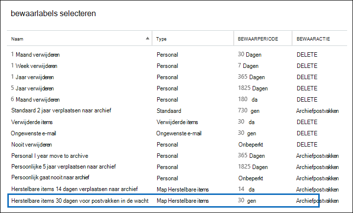
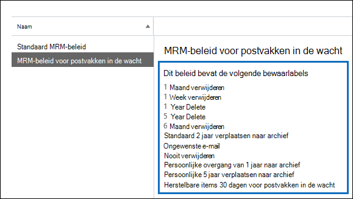

# <a name="increase-the-recoverable-items-quota-for-mailboxes-on-hold"></a>De quota verhogen voor herstelbare items voor postvakken in bewaring

Het standaardbeleid Exchange bewaarbeleid(met de naam Standaard *MRM-beleid)* dat automatisch wordt toegepast op nieuwe postvakken in Exchange Online bevat een bewaarlabel met de naam Herstelbare items die 14 dagen naar het archief worden verplaatst. Met deze bewaartag worden items verplaatst van de map Herstelbare items in het primaire postvak van de gebruiker naar de map Herstelbare items in het archiefpostvak van de gebruiker nadat de bewaarperiode van 14 dagen voor een item is verlopen. Hiervoor moet het archiefpostvak van de gebruiker zijn ingeschakeld. Als het archiefpostvak niet is ingeschakeld, wordt er geen actie ondernomen. Dit betekent dat items in de map Herstelbare items voor een postvak in bewaring niet worden verplaatst naar het archiefpostvak nadat de bewaarperiode van 14 dagen is verlopen. Omdat er niets wordt verwijderd uit een postvak in bewaring, is het mogelijk dat het opslagquotum voor de map Herstelbare items kan worden overschreden, met name als het archiefpostvak van de gebruiker niet is ingeschakeld. 
  
Om de kans op het overschrijden van deze limiet te verkleinen, wordt het opslagquotum voor de map Herstelbare items automatisch verhoogd van 30 GB naar 100 GB wanneer een bewaring in een postvak in Exchange Online. Als het archiefpostvak is ingeschakeld, wordt het opslagquotum voor de map Herstelbare items in het archiefpostvak ook verhoogd van 30 GB naar 100 GB. Als de functie voor automatisch archiveren in Exchange Online is ingeschakeld, is het opslagquotum voor de map Herstelbare items in het archief van de gebruiker onbeperkt.
  
 In de volgende tabel wordt het opslagquotum voor de map Herstelbare items samengevat. 
  
|**Locatie van de map Herstelbare items**|**Postvakken die niet in de wacht staan**|**Postvakken in de wacht**|
|:-----|:-----|:-----|
|Primair postvak  <br/> |30 GB  <br/> |100 GB  <br/> |
|Archiefpostvak<sup>\*</sup> <br/> |Onbeperkt  <br/> |Onbeperkt  <br/> |
|**Totaal opslagquotum voor de map Herstelbare items** <br/> |Onbeperkt  <br/> |Onbeperkt  <br/> |
   
> [!NOTE]
> <sup>\*</sup>Het oorspronkelijke opslagquotum voor het archiefpostvak is 100 GB voor gebruikers met een Exchange Online (Abonnement 2) licentie. Wanneer het automatisch uitbreiden van archivering is ingeschakeld voor postvakken in bewaring, wordt het opslagquotum voor zowel het archiefpostvak als de map Herstelbare items verhoogd tot 110 GB. Indien nodig wordt extra archiefopslagruimte ingericht, wat resulteert in een onbeperkte hoeveelheid archiefopslag. Zie Overzicht van onbeperkt archiveren in Office 365 voor meer informatie over het automatisch uitbreiden [van archivering.](unlimited-archiving.md) 
  
Wanneer het opslagquotum voor de map Herstelbare items in het primaire postvak van een postvak in bewaring bijna de limiet heeft bereikt, kunt u de volgende dingen doen:
  
- **Schakel het archiefpostvak in en schakel automatisch uitbreidende archivering in.** U kunt een onbeperkte opslagcapaciteit voor de map Herstelbare items inschakelen door het archiefpostvak in te stellen en vervolgens de functie voor automatisch uitbreiden van archivering in te Exchange Online. Dit resulteert in 110 GB voor de map Herstelbare items in het primaire postvak en een onbeperkte opslagcapaciteit voor de map Herstelbare items in het archief van de gebruiker. Zie hoe: [Archiefpostvakken inschakelen in](enable-archive-mailboxes.md) het Beveiligings- & compliancecentrum en [Onbeperkt archiveren inschakelen in Office 365.](enable-unlimited-archiving.md)
    
    > [!NOTE]
    > Nadat u het archief hebt ingeschakeld voor een postvak dat bijna het opslagquotum voor de map Herstelbare items overschrijdt, wilt u mogelijk de assistent beheerde map uitvoeren om de assistent handmatig te activeren om het postvak te verwerken, zodat verlopen items worden verplaatst naar de map Herstelbare items in het archiefpostvak. Zie [Stap 4 voor](#optional-step-4-run-the-managed-folder-assistant-to-apply-the-new-retention-settings) instructies. Houd er rekening mee dat andere items in het postvak van de gebruiker mogelijk worden verplaatst naar het nieuwe archiefpostvak. U kunt de gebruiker laten weten dat dit kan gebeuren nadat u het archiefpostvak hebt ingeschakeld. 
  
- **Maak een aangepast Exchange bewaarbeleid voor postvakken in bewaring.** Naast het inschakelen van het archiefpostvak en het automatisch uitbreiden van archivering voor postvakken in bewaring of In-Place Bewaring, kunt u ook een aangepast Exchange bewaarbeleid voor postvakken in bewaring maken. Hiermee kunt u een bewaarbeleid toepassen op postvakken in bewaring die verschillen van het standaard MRM-beleid dat is toegepast op postvakken die niet in bewaring staan en kunt u bewaarlabels toepassen die zijn ontworpen voor postvakken in bewaring. Dit omvat het maken van een nieuwe bewaartag voor de map Herstelbare items. 
    
In de rest van dit onderwerp worden de stapsgewijs procedures beschreven voor het maken van een aangepast Exchange bewaarbeleid voor postvakken in bewaring.
  
[Stap 1: een aangepaste bewaartag maken voor de map Herstelbare items](#step-1-create-a-custom-retention-tag-for-the-recoverable-items-folder)

[Stap 2: Een nieuw bewaarbeleid Exchange voor postvakken in bewaring](#step-2-create-a-new-exchange-retention-policy-for-mailboxes-on-hold)

[Stap 3: Het nieuwe bewaarbeleid voor Exchange toepassen op postvakken in bewaring](#step-3-apply-the-new-exchange-retention-policy-to-mailboxes-on-hold)

[(Optioneel) Stap 4: De assistent voor beheerde mappen uitvoeren om de nieuwe bewaarinstellingen toe te passen](#optional-step-4-run-the-managed-folder-assistant-to-apply-the-new-retention-settings)
  
## <a name="step-1-create-a-custom-retention-tag-for-the-recoverable-items-folder"></a>Stap 1: een aangepaste bewaartag maken voor de map Herstelbare items

De eerste stap is het maken van een aangepaste bewaartag (een zogenaamde bewaarbeleidstag of RPT) voor de map Herstelbare items. Zoals eerder uitgelegd, worden met dit RPT items verplaatst van de map Herstelbare items in het primaire postvak van de gebruiker naar de map Herstelbare items in het archiefpostvak van de gebruiker. U moet PowerShell gebruiken om een RPT te maken voor de map Herstelbare items. U kunt het beheercentrum Exchange (EAC) niet gebruiken. 
  
1. [Maak verbinding met Exchange Online via externe PowerShell](/powershell/exchange/connect-to-exchange-online-powershell)
    
2. Voer de volgende opdracht uit om een nieuwe RPT te maken voor de map Herstelbare items: 
    
    ```powershell
    New-RetentionPolicyTag -Name <Name of RPT> -Type RecoverableItems -AgeLimitForRetention <Number of days> -RetentionAction MoveToArchive
    ```

    Met de volgende opdracht wordt bijvoorbeeld een RPT gemaakt voor de map Herstelbare items met de naam 'Herstelbare items 30 dagen voor postvakken in bewaring', met een bewaarperiode van 30 dagen. Dit betekent dat een item na 30 dagen in de map Herstelbare items wordt verplaatst naar de map Herstelbare items in het archiefpostvak van de gebruiker.
    
    ```powershell
    New-RetentionPolicyTag -Name "Recoverable Items 30 days for mailboxes on hold" -Type RecoverableItems -AgeLimitForRetention 30 -RetentionAction MoveToArchive
    ```

    > [!TIP]
    > Het is raadzaam dat de bewaarperiode (gedefinieerd door de parameter  _AgeLimitForRetention)_ voor de RPT Herstelbare items hetzelfde is als de bewaarperiode voor verwijderde items voor de postvakken waar het RPT op wordt toegepast. Hierdoor kan een gebruiker de hele bewaarperiode voor verwijderde items herstellen voordat deze naar het archiefpostvak worden verplaatst. In het vorige voorbeeld is de bewaarperiode ingesteld op 30 dagen op basis van de aanname dat de bewaarperiode voor verwijderde items voor postvakken ook 30 dagen is. Een Exchange Online postvak is standaard geconfigureerd om verwijderde items 14 dagen te bewaren. U kunt deze instelling echter wijzigen in maximaal 30 dagen. Zie De bewaarperiode voor [verwijderde items](https://www.microsoft.com/?ref=go)wijzigen voor een postvak in Exchange Online. 
  
## <a name="step-2-create-a-new-exchange-retention-policy-for-mailboxes-on-hold"></a>Stap 2: Een nieuw bewaarbeleid Exchange voor postvakken in bewaring

De volgende stap is het maken van een nieuw bewaarbeleid en het toevoegen van bewaarlabels, inclusief de RPT Herstelbare items die u in stap 1 hebt gemaakt. Dit nieuwe beleid wordt in de volgende stap toegepast op postvakken die in de wacht staan. 
  
Voordat u het nieuwe bewaarbeleid maakt, bepaalt u de extra bewaarlabels die u wilt toevoegen. Zie het volgende voor een lijst met bewaarlabels die zijn toegevoegd aan het standaard MRM-beleid en voor informatie over het maken van nieuwe bewaarlabels:
  
- [Standaard bewaarbeleid in Exchange Online](/exchange/security-and-compliance/messaging-records-management/default-retention-policy)
    
- [Standaardmappen die bewaarbeleidslabels ondersteunen](/exchange/security-and-compliance/messaging-records-management/default-folders)
    
- De sectie Een bewaarlabel maken in het [onderwerp Bewaarbeleid](/exchange/security-and-compliance/messaging-records-management/create-a-retention-policy) maken.
    
U kunt het EAC of Exchange Online PowerShell gebruiken om een bewaarbeleid te maken.
  
### <a name="use-the-eac-to-create-a-retention-policy"></a>Het EAC gebruiken om een bewaarbeleid te maken
  
1. Ga in het EAC naar **Bewaarbeleid voor nalevingsbeheer** \> en klik vervolgens **op Pictogram**  toevoegen.
    
2. Typ op **de pagina Nieuw** bewaarbeleid onder **Naam** een naam die het doel van het bewaarbeleid beschrijft. bijvoorbeeld **MRM-beleid voor postvakken in de wacht.** 
    
3. Klik **onder Bewaarlabels** op **Pictogram**  toevoegen.
    
4. Selecteer in de lijst met bewaarlabels de RPT Herstelbare items die u hebt gemaakt in stap 1 en klik vervolgens op **Toevoegen.**
    
    
  
5. Selecteer extra bewaarlabels die u wilt toevoegen aan het bewaarbeleid. U kunt bijvoorbeeld dezelfde tags toevoegen die zijn opgenomen in het standaard MRM-beleid.
    
6. Wanneer u klaar bent met het toevoegen van bewaarlabels, klikt u op **OK.**
    
7. Klik **op Opslaan** om het nieuwe bewaarbeleid te maken. 
    
    De bewaarlabels die zijn gekoppeld aan het bewaarbeleid, worden weergegeven in het detailvenster.
    
    
  
### <a name="use-exchange-online-powershell-to-create-a-retention-policy"></a>PowerShell Exchange Online gebruiken om een bewaarbeleid te maken
  
Voer de volgende opdracht uit om nieuw bewaarbeleid voor postvakken in bewaring te maken. 
  
```powershell
New-RetentionPolicy <Name of retention policy>  -RetentionPolicyTagLinks <list of retention tags>

```

Met de volgende opdracht worden bijvoorbeeld het bewaarbeleid en gekoppelde bewaarlabels gemaakt die in de vorige afbeelding worden weergegeven.
  
```powershell
New-RetentionPolicy "MRM Policy for Mailboxes on Hold"  -RetentionPolicyTagLinks "Recoverable Items 30 days for mailboxes on hold","1 Month Delete","1 Week Delete","1 Year Delete","5 Year Delete","6 Month Delete","Default 2 year move to archive","Junk Email","Never Delete","Personal 1 year move to archive","Personal 5 year move to archive"
```

## <a name="step-3-apply-the-new-exchange-retention-policy-to-mailboxes-on-hold"></a>Stap 3: Het nieuwe bewaarbeleid voor Exchange toepassen op postvakken in bewaring

De laatste stap is het toepassen van het nieuwe bewaarbeleid dat u in stap 2 hebt gemaakt op postvakken in bewaring in uw organisatie. U kunt het EAC of Exchange Online PowerShell gebruiken om het bewaarbeleid toe te passen op één postvak of op meerdere postvakken. 
  
### <a name="use-the-eac-to-apply-the-new-retention-policy"></a>Het EAC gebruiken om het nieuwe bewaarbeleid toe te passen
  
1. Ga naar **Geadresseerdenpostvakken.**  >  
    
2. Selecteer in de lijstweergave het postvak waar u het bewaarbeleid op wilt toepassen en klik vervolgens op **Pictogram**  bewerken.
    
3. Klik op **de pagina Gebruikerspostvak** op **Postvakfuncties.**
    
4. Selecteer **onder Bewaarbeleid** het bewaarbeleid dat u hebt gemaakt in stap 2 en klik vervolgens op **Opslaan.**
    
U kunt het EAC ook gebruiken om het bewaarbeleid toe te passen op meerdere postvakken.
  
1. Ga naar **Geadresseerdenpostvakken.**  >  
    
2. Gebruik in de lijstweergave de toetsen Shift of Ctrl om meerdere postvakken te selecteren.
    
3. Klik in het detailvenster op **Meer opties.**
    
4. Klik **onder Bewaarbeleid** op **Bijwerken.**
    
5. Selecteer op **de pagina Bewaarbeleid bulksgewijs** toewijzen het bewaarbeleid dat u hebt gemaakt in stap 2 en klik vervolgens op **Opslaan.** 
    
### <a name="use-exchange-online-powershell-to-apply-the-new-retention-policy"></a>Gebruik Exchange Online PowerShell om het nieuwe bewaarbeleid toe te passen
  
U kunt Exchange Online PowerShell gebruiken om een nieuw bewaarbeleid toe te passen op één postvak. Maar de echte kracht van PowerShell is dat u deze kunt gebruiken om snel alle postvakken in uw organisatie te identificeren die in bewaring staan voor juridische procedures of In-Place Bewaring en vervolgens het nieuwe bewaarbeleid toepassen op alle postvakken die in bewaring staan in één opdracht. Hier zijn enkele voorbeelden van het gebruik Exchange PowerShell om een bewaarbeleid toe te passen op een of meer postvakken. In alle voorbeelden wordt het bewaarbeleid toegepast dat is gemaakt in stap 2.
  
In dit voorbeeld wordt het nieuwe bewaarbeleid toegepast op het postvak van Pilar Pinilla.
  
```powershell
Set-Mailbox "Pilar Pinilla" -RetentionPolicy "MRM Policy for Mailboxes on Hold"
```

In dit voorbeeld wordt het nieuwe bewaarbeleid toegepast op alle postvakken in de organisatie die in bewaring staan voor rechtszaken.
  
```powershell
$LitigationHolds = Get-Mailbox -ResultSize unlimited | Where-Object {$_.LitigationHoldEnabled -eq 'True'}
```

```powershell
$LitigationHolds.DistinguishedName | Set-Mailbox -RetentionPolicy "MRM Policy for Mailboxes on Hold"
```

In dit voorbeeld wordt het nieuwe bewaarbeleid toegepast op alle postvakken in de organisatie die In-Place bewaring.
  
```powershell
$InPlaceHolds = Get-Mailbox -ResultSize unlimited | Where-Object {$_.InPlaceHolds -ne $null}
```

```powershell
$InPlaceHolds.DistinguishedName | Set-Mailbox -RetentionPolicy "MRM Policy for Mailboxes on Hold"
```

U kunt de **cmdlet Postvak** IN gebruiken om te controleren of het nieuwe bewaarbeleid is toegepast. 
  
Hier zijn enkele voorbeelden om te controleren of de opdrachten in de vorige voorbeelden het bewaarbeleid 'MRM-beleid voor postvakken in bewaring' hebben toegepast op postvakken in De bewaring van geschillen en postvakken in In-Place Bewaring.
  
```powershell
Get-Mailbox "Pilar Pinilla" | Select RetentionPolicy
```

```powershell
Get-Mailbox -ResultSize unlimited | Where-Object {$_.LitigationHoldEnabled -eq 'True'} | FT DisplayName,RetentionPolicy -Auto
```

```powershell
Get-Mailbox -ResultSize unlimited | Where-Object {$_.InPlaceHolds -ne $null} | FT DisplayName,RetentionPolicy -Auto
```

## <a name="optional-step-4-run-the-managed-folder-assistant-to-apply-the-new-retention-settings"></a>(Optioneel) Stap 4: De assistent voor beheerde mappen uitvoeren om de nieuwe bewaarinstellingen toe te passen

Nadat u het nieuwe Exchange bewaarbeleid hebt toegepast op postvakken in bewaring, kan het tot 7 dagen in Exchange Online duren voordat de assistent voor beheerde mappen deze postvakken verwerkt met de instellingen in het nieuwe bewaarbeleid. In plaats van te wachten totdat de beheerde mapassistent wordt uitgevoerd, kunt u de **cmdlet Start-ManagedFolderAssistant** gebruiken om de assistent handmatig te activeren om de postvakken te verwerken waarin u het nieuwe bewaarbeleid hebt toegepast. 
  
Voer de volgende opdracht uit om de beheerde mapassistent voor het postvak van Pilar Pinilla te starten.
  
```powershell
Start-ManagedFolderAssistant "Pilar Pinilla"
```

Voer de volgende opdrachten uit om de Beheerde mapassistent voor alle postvakken in de wacht te zetten.
  
```powershell
$MailboxesOnHold = Get-Mailbox -ResultSize unlimited | Where-Object {($_.InPlaceHolds -ne $null) -or ($_.LitigationHoldEnabled -eq "True")}
```

```powershell
$MailboxesOnHold.DistinguishedName | Start-ManagedFolderAssistant
```

## <a name="more-information"></a>Meer informatie

- Nadat u het archiefpostvak van een gebruiker hebt ingeschakeld, kunt u de gebruiker laten weten dat andere items in het postvak (niet alleen items in de map Herstelbare items) mogelijk worden verplaatst naar het archiefpostvak. Dit komt omdat het standaard MRM-beleid dat is toegewezen aan Exchange Online-postvakken een bewaarlabel bevat (met de naam Standaard 2 jaar verplaatsen naar archiveren) dat items naar het archiefpostvak verplaatst twee jaar na de datum waarop het item in het postvak is bezorgd of door de gebruiker is gemaakt. Zie Standaard bewaarbeleid [in](/exchange/security-and-compliance/messaging-records-management/default-retention-policy) Exchange Online
    
- Nadat u het archiefpostvak van een gebruiker hebt ingeschakeld, kunt u de gebruiker ook laten weten dat hij of zij verwijderde items kan herstellen in de map Herstelbare items in het archiefpostvak. Ze kunnen dit doen in Outlook door de map Verwijderde **items** in het archiefpostvak te selecteren en vervolgens op Verwijderde items van **Server** herstellen op het tabblad Start **te** klikken. Zie Verwijderde items herstellen in Outlook voor Windows voor meer informatie over het herstellen [van verwijderde items.](https://go.microsoft.com/fwlink/p/?LinkId=624829)