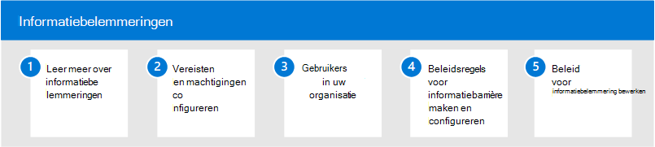

# Informatiebarrières in Microsoft 365Information barriers in Microsoft 365

Microsoft 365 communicatie en samenwerking tussen groepen en organisaties mogelijk en ondersteunt manieren om de communicatie en samenwerking tussen specifieke groepen gebruikers te beperken wanneer dat nodig is.Microsoft 365 enables communication and collaboration across groups and organizations and supports ways to restrict communication and collaboration among specific groups of users when necessary. Dit kunnen situaties of scenario's zijn waarin u de communicatie en samenwerking tussen twee groepen wilt beperken om te voorkomen dat er een conflict van belang is in uw organisatie.This may include situations or scenarios where you want to restrict communication and collaboration between two groups to avoid a conflict of interest from occurring in your organization. Dit kunnen ook situaties zijn waarin u de communicatie en samenwerking tussen bepaalde personen binnen uw organisatie moet beperken om interne informatie te beschermen.This may also include situations when you need to restrict communication and collaboration between certain people inside your organization to safeguard internal information.

Informatiebarrières worden ondersteund in Microsoft Teams, SharePoint Online en OneDrive voor Bedrijven.Information barriers are supported in Microsoft Teams, SharePoint Online, and OneDrive for Business. Een compliancebeheerder of informatiebarrièrebeheerder kan beleidsregels definiëren om communicatie tussen groepen gebruikers in Microsoft Teams.A compliance administrator or information barriers administrator can define policies to allow or prevent communications between groups of users in Microsoft Teams. Beleid voor informatiebarrière kan worden gebruikt voor situaties zoals deze:Information barrier policies can be used for situations like these:

- Gebruiker in de groep van de daghandelaar mag geen bestanden communiceren of delen met het marketingteamUser in the day trader group should not communicate or share files with the marketing team
- Financieel personeel dat werkt aan vertrouwelijke bedrijfsgegevens mag geen bestanden communiceren of delen met bepaalde groepen binnen hun organisatieFinance personnel working on confidential company information should not communicate or share files with certain groups within their organization
- Een intern team met handelsgeheim materiaal mag niet online bellen of chatten met personen in bepaalde groepen binnen hun organisatieAn internal team with trade secret material should not call or chat online with people in certain groups within their organization
- Een onderzoeksteam mag alleen online bellen of chatten met een productontwikkelingsteamA research team should only call or chat online with a product development team

## Gegevensbarrières configureren voor Microsoft 365Configure information barriers for Microsoft 365

Gebruik de volgende stappen om informatiebarrières voor uw organisatie te configureren:Use the following steps to configure information barriers for your organization:

1. Meer informatie [over informatiebarrières](information-barriers.md) in Microsoft 365Learn about [information barriers](information-barriers.md) in Microsoft 365
2. Vereisten [en machtigingen configureren](information-barriers-policies.md#prerequisites)Configure [prerequisites and permissions](information-barriers-policies.md#prerequisites)
3. Gebruikers [in uw organisatie segmenteren](information-barriers-policies.md#part-1-segment-users)Segment [users in your organization](information-barriers-policies.md#part-1-segment-users)
4. Beleidsregels voor [informatiebarrière maken en configureren](information-barriers-policies.md#part-2-define-information-barrier-policies)Create and configure [information barrier policies](information-barriers-policies.md#part-2-define-information-barrier-policies)
5. Beleidsregels [voor informatiebarrière toepassen](information-barriers-policies.md#part-3-apply-information-barrier-policies)Apply [information barrier policies](information-barriers-policies.md#part-3-apply-information-barrier-policies)

## Meer informatie over informatiebarrièresMore information about information barriers

- [Kenmerken voor het beleid voor informatiebelemmeringAttributes for information barrier policies](information-barriers-attributes.md)
- [Beleidsregels voor informatiebarrière bewerken of verwijderenEdit or remove information barrier policies](information-barriers-edit-segments-policies.md)