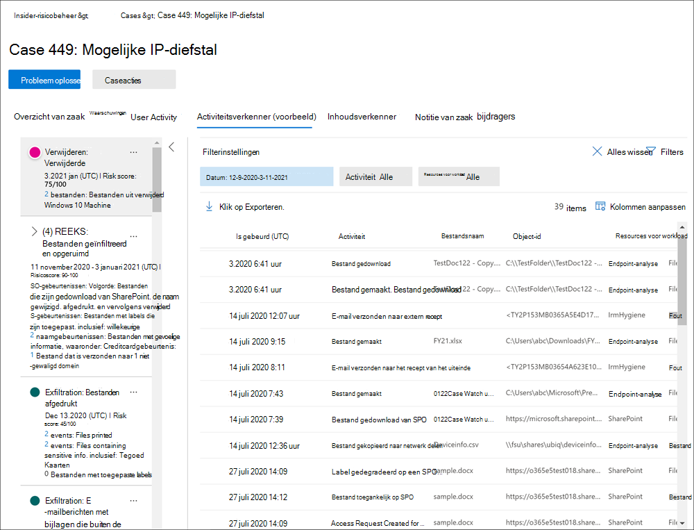

# Activiteiten voor insiderrisicobeheer onderzoekenInvestigate insider risk management activities

Het onderzoeken van risicovolle gebruikersactiviteiten is een belangrijke eerste stap in het minimaliseren van insiderrisico's voor uw organisatie.Investigating risky user activities is an important first step in minimizing insider risks for your organization. Deze risico's kunnen activiteiten zijn die waarschuwingen genereren van beleidsregels voor insiderrisicobeheer, of risico's van activiteiten die worden gedetecteerd door beleid, maar die niet onmiddellijk een waarschuwing voor insiderrisicobeheer voor gebruikers maken.These risks may be activities that generate alerts from insider risk management policies, or risks from activities that are detected by policies but do not immediately create an insider risk management alert for users. U kunt dit soort activiteiten onderzoeken met behulp van de **gebruikersactiviteitsrapporten (voorbeeld)** of met het **dashboard Waarschuwing.**You can investigate these types of activities by using the **User activity reports (preview)** or with the **Alert dashboard**.

## Gebruikersactiviteitsrapporten (voorbeeld)User activity reports (preview)

Met gebruikersactiviteitsrapporten kunt u activiteiten voor specifieke gebruikers voor een bepaalde periode bekijken zonder deze tijdelijk of expliciet toe te wijzen aan een beleid voor insiderrisicobeheer.User activity reports allow you to examine activities for specific users for a defined time period without having to assign them temporarily or explicitly to an insider risk management policy. In de meeste scenario's voor insiderrisicobeheer worden gebruikers expliciet gedefinieerd in beleidsregels en kunnen ze beleidswaarschuwingen hebben (afhankelijk van triggeringgebeurtenissen) en risicoscores die aan de activiteiten zijn gekoppeld.In most insider risk management scenarios, users are explicitly defined in policies, and they may have policy alerts (depending on triggering events) and risk scores associated with the activities. Maar in sommige scenario's wilt u mogelijk de activiteiten bekijken voor gebruikers die niet expliciet zijn gedefinieerd in een beleid.But in some scenarios, you may want to examine the activities for users that aren't explicitly defined in a policy. Dit kunnen gebruikers zijn die u een tip hebt ontvangen over de gebruiker en potentieel risicovolle activiteiten, of gebruikers die meestal niet hoeven te worden toegewezen aan een beleid voor insiderrisicobeheer.These may be users that you've received a tip about the user and potentially risky activities, or users that typically don't need to be assigned to an insider risk management policy.

Nadat u indicatoren hebt geconfigureerd op de pagina Insider Risk Management **Instellingen,** wordt gebruikersactiviteit gedetecteerd voor risicovolle activiteiten die zijn gekoppeld aan de geselecteerde indicatoren.After you've configured indicators on the insider risk management **Settings** page, user activity is detected for risky activity associated with the selected indicators. U hoeft geen beleid te configureren voor gebruikersactiviteitsrapporten om risicovolle activiteiten van gebruikers in uw organisatie te detecteren en te rapporteren.You do not have to configure a policy for user activity reports to detect and report risky activities by users in your organization. Activiteiten die zijn opgenomen in gebruikersactiviteitsrapporten, vereisen geen triggeringgebeurtenissen om de activiteiten weer te geven.Activities included in user activity reports do not require triggering events for the activities to be displayed. Deze configuratie betekent dat alle gedetecteerde activiteiten voor de gebruiker ter controle beschikbaar zijn, ongeacht of deze een triggeringgebeurtenis heeft of als er een waarschuwing wordt gemaakt.This configuration means that all detected activity for the user is available for review, regardless if it has a triggering event or if it creates an alert. Rapporten worden per gebruiker gemaakt en kunnen alle activiteiten bevatten voor een aangepaste periode van 90 dagen.Reports are created on a per-user basis and can include all activities for a custom 90-day period. Meerdere rapporten voor dezelfde gebruiker worden niet ondersteund.Multiple reports for the same user aren't supported.

Na het onderzoeken van activiteiten voor een gebruiker, kunnen de onderzoekers afzonderlijke activiteiten als goedaardig afdoen, een koppeling naar het rapport delen of e-mailen met andere onderzoeker, of ervoor kiezen om de gebruiker tijdelijk of expliciet toe te wijzen aan een beleid voor insiderrisicobeheer.After examining activities for a user, investigators can dismiss individual activities as benign, share or email a link to the report with other investigators, or choose to assign the user temporarily or explicitly to an insider risk management policy. Gebruikers moeten zijn toegewezen aan de rollengroep *Insider Risk Management Investigators* om de pagina **Gebruikersactiviteitsrapporten weer te** geven.Users must be assigned to the *Insider Risk Management Investigators* role group to view the **User activity reports** page.  

U kunt aan de slag gaan door **Rapporten beheren** te selecteren in de sectie **Gebruikersactiviteit** onderzoeken op de pagina Overzicht van insiderrisicobeheer. You can get started by selecting **Manage reports** in the **Investigate user activity** section on the insider risk management **Overview** page. Als u activiteiten voor een gebruiker wilt bekijken, selecteert u eerst **Gebruikersactiviteitsrapport maken** en vult u de volgende velden in het rapport **rapport Nieuwe gebruikersactiviteit** in:To view activities for a user, first select **Create user activity report** and complete the following fields in the **New user activity report** pane:

- **Gebruiker:** een gebruiker zoeken op naam of e-mailadres**User**: Search for a user by name or email address
- **Begindatum:** Gebruik het agendabesturingselement om de begindatum voor gebruikersactiviteiten te selecteren.**Start date**: Use the calendar control to select the start date for user activities.
- **Einddatum:** Gebruik het agendabesturingselement om de einddatum voor gebruikersactiviteiten te selecteren.**End date**: Use the calendar control to select the end date for user activities. De geselecteerde einddatum moet groter zijn dan twee dagen na de geselecteerde begindatum en niet groter zijn dan 90 dagen vanaf de geselecteerde begindatum.The end date selected must be greater than two days after the selected start date and no greater than 90 days from the selected start date.
Nieuwe rapporten duren meestal maximaal 10 uur voordat ze kunnen worden beoordeeld.New reports typically take up to 10 hours before they are ready for review. Wanneer het rapport gereed is, ziet u *Rapport* gereed in de **kolom Status** op de rapportpagina Gebruikersactiviteit.When the report is ready, you'll see *Report ready* in the **Status** column on the User activity report page. Selecteer de gebruiker om het gedetailleerde rapport te bekijken:Select the user to view the detailed report:

Het **rapport Gebruikersactiviteit voor** de geselecteerde gebruiker bevat de tabbladen **Gebruikersactiviteit** en **Activiteitenverkenner:**The **User activity report** for the selected user contains the **User activity** and **Activity explorer** tabs:

- **Gebruikersactiviteit:** Gebruik deze grafiekweergave om activiteiten te onderzoeken en mogelijke activiteiten in reeksen weer te geven.**User activity**: Use this chart view to investigate activities and view potential activities that occur in sequences. Dit tabblad is zo gestructureerd dat een zaak snel kan worden gecontroleerd, inclusief een historische tijdlijn van alle activiteiten, activiteitendetails, de huidige risicoscore voor de gebruiker in de zaak, de reeks risicogebeurtenissen en filterbesturingselementen om te helpen bij onderzoeken.This tab is structured to enable quick review of a case, including a historical timeline of all activities, activity details, the current risk score for the user in the case, the sequence of risk events, and filtering controls to help with investigative efforts.
- **Activiteitenverkenner:** Het tabblad **Activiteitsverkenner** biedt risicoonderzoekers een uitgebreid analytisch hulpmiddel dat gedetailleerde informatie over activiteiten biedt.**Activity explorer**: The **Activity explorer** tab provides risk investigators with a comprehensive analytic tool that provides detailed information about activities. Met de Activiteitsverkenner kunnen revisoren snel een tijdlijn bekijken van gedetecteerde riskante activiteiten en alle risicoactiviteiten identificeren en filteren die aan waarschuwingen zijn gekoppeld.With the Activity explorer, reviewers can quickly review a timeline of detected risky activity and identify and filter all risk activities associated with alerts. Zie de sectie Activiteitsverkenner  verder in dit artikel voor meer informatie over het gebruik van de Activiteitsverkenner.To learn more about using the Activity explorer, see the *Activity explorer* section later in this article.

## WaarschuwingsdashboardAlert dashboard

Waarschuwingen voor insiderrisicobeheer worden automatisch gegenereerd door risicoindicatoren die zijn gedefinieerd in beleidsregels voor insiderrisicobeheer.Insider risk management alerts are automatically generated by risk indicators defined in insider risk management policies. Deze waarschuwingen geven compliance-analisten en -onderzoekers een overzicht van de huidige risicostatus en stellen uw organisatie in staat om te triagen en acties te ondernemen voor ontdekte risico's.These alerts give compliance analysts and investigators an all-up view of the current risk status and allow your organization to triage and take actions for discovered risks. Standaard genereren beleidsregels een bepaalde hoeveelheid waarschuwingen met een lage,  gemiddelde en hoge ernst, maar u kunt het waarschuwingsvolume naar uw wensen verhogen of verlagen.By default, policies generate a certain amount of low, medium, and high severity alerts, but you can [increase or decrease the alert volume](insider-risk-management-settings.md#alert-volume) to suit your needs. Bovendien kunt u de waarschuwingsdrempel [voor beleidsindicatoren](insider-risk-management-settings.md#indicator-level-settings-preview) configureren bij het maken van een nieuw beleid met de beleidswizard.Additionally, you can configure the [alert threshold for policy indicators](insider-risk-management-settings.md#indicator-level-settings-preview) when creating a new policy with the policy wizard.

Bekijk de [Video Triage-ervaring](https://www.youtube.com/watch?v=KgmpxBLJLPI) met waarschuwingen voor insiderrisicobeheer voor een overzicht van hoe waarschuwingen details, context en gerelateerde inhoud bieden voor risicovolle activiteiten en hoe u uw onderzoeksproces effectiever kunt maken.Check out the [Insider Risk Management Alerts Triage Experience video](https://www.youtube.com/watch?v=KgmpxBLJLPI) for an overview of how alerts provide details, context, and related content for risky activity and how to make your investigation process more effective.

Met het dashboard Insider Risk **Alert** kunt u waarschuwingen die worden gegenereerd door beleidsregels voor insiderrisico's bekijken en erop reageren.The insider risk **Alert dashboard** allows you to view and act on alerts generated by insider risk policies. Elke rapportwidget bevat gegevens van de afgelopen 30 dagen.Each report widget displays information for last 30 days.

- **Totaal aantal waarschuwingen dat moet** worden beoordeeld: Het totale aantal waarschuwingen dat moet worden beoordeeld en drie keer moet worden beoordeeld, inclusief een uitsplitsing op ernst van de waarschuwing.**Total alerts that need review**: The total number of alerts needing review and triage are listed, including a breakdown by alert severity.
- **Waarschuwingen openen in de afgelopen 30** dagen: het totale aantal waarschuwingen dat is gemaakt door beleid komt overeen met de afgelopen 30 dagen, gesorteerd op hoge, gemiddelde en lage ernst van waarschuwingen.**Open alerts over past 30 days**: The total number of alerts created by policy matches over the last 30 days, sorted by high, medium, and low alert severity levels.
- **Gemiddelde tijd om waarschuwingen op te lossen:** een overzicht van nuttige waarschuwingsstatistieken:**Average time to resolve alerts**: A summary of useful alert statistics:
  - Gemiddelde tijd om waarschuwingen met hoge ernst op te lossen, weergegeven in uren, dagen of maanden.Average time to resolve high severity alerts, listed in hours, days, or months.
  - Gemiddelde tijd om waarschuwingen met gemiddelde ernst op te lossen, weergegeven in uren, dagen of maanden.Average time to resolve medium severity alerts, listed in hours, days, or months.
  - Gemiddelde tijd om waarschuwingen met een lage ernst op te lossen, weergegeven in uren, dagen of maanden.Average time to resolve low severity alerts, listed in hours, days, or months.

> [!NOTE]
> Insider-risicobeheer gebruikt ingebouwde waarschuwingsbeperking om uw risicoonderzoek te beschermen en te optimaliseren en de ervaring te controleren.Insider risk management uses built-in alert throttling to help protect and optimize your risk investigation and review experience. Deze beperking beschermt tegen problemen die kunnen leiden tot een overbelasting van beleidswaarschuwingen, zoals verkeerd geconfigureerde gegevensconnectoren of DLP-beleid.This throttling guards against issues that might result in an overload of policy alerts, such as misconfigured data connectors or DLP policies. Hierdoor kan het weergeven van nieuwe waarschuwingen voor een gebruiker vertraging oplopen.As a result, there might be a delay in displaying new alerts for a user.

## Status en ernst van waarschuwingAlert status and severity

U kunt waarschuwingen naar een van de volgende statussen triage:You can triage alerts into one of the following statuses:

- **Bevestigd:** een waarschuwing die is bevestigd en toegewezen aan een nieuwe of bestaande zaak.**Confirmed**: An alert confirmed and assigned to a new or existing case.
- **Afgewezen:** een waarschuwing die is afgewezen als goedaardig in het triageproces.**Dismissed**: An alert dismissed as benign in the triage process.
- **Behoeften controleren:** een nieuwe waarschuwing waarbij triageacties nog niet zijn ondernomen.**Needs review**: A new alert where triage actions have not yet been taken.
- **Opgelost:** een waarschuwing die deel uitmaakt van een gesloten en opgeloste zaak.**Resolved**: An alert that is part of a closed and resolved case.

Waarschuwingsrisicoscores worden automatisch berekend op basis van verschillende indicatoren voor risicoactiviteit.Alert risk scores are automatically calculated from several risk activity indicators. Deze indicatoren omvatten het type risicoactiviteit, het aantal en de frequentie van het optreden van de activiteit, de geschiedenis van gebruikersrisicoactiviteit en de toevoeging van activiteitenrisico's die de ernst van de activiteit kunnen verhogen.These indicators include the type of risk activity, the number and frequency of the activity occurrence, the history of user risk activity, and the addition of activity risks that may boost the seriousness of the activity. Met de waarschuwingsrisicoscore wordt de programmatische toewijzing van een ernst van het risico voor elke waarschuwing aan de gebruiker gegeven en kan deze niet worden aangepast.The alert risk score drives the programmatic assignment of a risk severity level for each alert and cannot be customized. Als waarschuwingen niet worden afgerekend en de risicoactiviteiten nog steeds toenemen tot de waarschuwing, kan de ernst van het risico toenemen.If alerts remain untriaged and risk activities continue to accrue to the alert, the risk severity level can increase. Risicoanalisten en -onderzoekers kunnen de ernst van het waarschuwingsrisico gebruiken om waarschuwingen te triageeren in overeenstemming met het risicobeleid en de standaarden van uw organisatie.Risk analysts and investigators can use the alert risk severity to help triage alerts in accordance with your organization's risk policies and standards.

Ernst van het waarschuwingsrisico is:Alert risk severity levels are:

- **Hoge ernst:** De activiteiten en indicatoren voor de waarschuwing vormen een aanzienlijk risico.**High severity**: The activities and indicators for the alert pose significant risk. De bijbehorende risicoactiviteiten zijn ernstig, herhalend en sterk afhankelijk van andere significante risicofactoren.The associated risk activities are serious, repetitive, and corelate strongly to other significant risk factors.
- **Gemiddelde ernst:** De activiteiten en indicatoren voor de waarschuwing vormen een matig risico.**Medium severity**: The activities and indicators for the alert pose a moderate risk. De bijbehorende risicoactiviteiten zijn gemiddeld, frequent en hebben een correlatie met andere risicofactoren.The associated risk activities are moderate, frequent, and have some correlation to other risk factors.
- **Lage ernst:** De activiteiten en indicatoren voor de waarschuwing vormen een gering risico.**Low severity**: The activities and indicators for the alert pose a minor risk. De bijbehorende risicoactiviteiten zijn secundair, komen minder vaak voor en vormen geen basis voor andere significante risicofactoren.The associated risk activities are minor, more infrequent, and do not corelate to other significant risk factors.

## Waarschuwingen filteren op het waarschuwingsdashboardFilter alerts on the Alert dashboard

Afhankelijk van het aantal en het type actief beleid voor insiderrisicobeheer in uw organisatie, kan het controleren van een grote wachtrij met waarschuwingen lastig zijn.Depending on the number and type of active insider risk management policies in your organization, reviewing a large queue of alerts can be challenging. Met behulp van waarschuwingsfilters kunnen analisten en onderzoekers waarschuwingen op verschillende kenmerken sorteren.Using alert filters can help analysts and investigators sort alerts by several attributes. Als u waarschuwingen wilt filteren op het **dashboard Waarschuwingen,** selecteert u het **besturingselement** Filter.To filter alerts on the **Alerts dashboard**, select the **Filter** control. U kunt waarschuwingen filteren op een of meer kenmerken:You can filter alerts by one or more attributes:

- **Status:** Selecteer een of meer statuswaarden om de lijst met waarschuwingen te filteren.**Status**: Select one or more status values to filter the alert list. De opties *zijn Bevestigd*, *Afgewezen*, *Behoeften controleren* en *Opgelost*.The options are *Confirmed*, *Dismissed*, *Needs review*, and *Resolved*.
- **Ernst:** Selecteer een of meer ernstsniveaus voor waarschuwingsrisico's om de lijst met waarschuwingen te filteren.**Severity**: Select one or more alert risk severity levels to filter the alert list. De opties zijn *Hoog,* *Gemiddeld* en *Laag.*The options are *High*, *Medium*, and *Low*.
- **Tijd gedetecteerd:** Selecteer de begin- en einddatums voor wanneer de waarschuwing is gemaakt.**Time detected**: Select the start and end dates for when the alert was created.
- **Beleid:** Selecteer een of meer beleidsregels om de waarschuwingen te filteren die worden gegenereerd door het geselecteerde beleid.**Policy**: Select one or more policies to filter the alerts generated by the selected policies.

## Zoekwaarschuwingen op het dashboard WaarschuwingSearch alerts on the Alert dashboard

Als u in de naam van de waarschuwing naar een bepaald woord wilt zoeken, selecteert u **het** besturingselement Zoeken en typt u het woord dat u wilt zoeken.To search the alert name for a specific word, select the **Search** control and type the word to search. In de zoekresultaten wordt een beleidswaarschuwing weergegeven die het woord bevat dat is gedefinieerd in de zoekopdracht.The search results display any policy alert containing the word defined in the search.

## TriagewaarschuwingenTriage alerts

Als u een insiderrisicowaarschuwing wilt triageren, volgt u de volgende stappen:To triage an insider risk alert, complete the following steps:

1. Ga in [Microsoft 365-compliancecentrum](https://compliance.microsoft.com)naar **Insider-risicobeheer** en selecteer het **tabblad Waarschuwingen.**In the [Microsoft 365 compliance center](https://compliance.microsoft.com), go to **Insider risk management** and select the **Alerts** tab.
2. Selecteer in **het dashboard Waarschuwingen** de waarschuwing die u wilt triagen.On the **Alerts dashboard**, select the alert you want to triage.
3. In het **detailvenster Waarschuwingen** kunt u de volgende tabbladen bekijken en de waarschuwing triageeren:On the **Alerts detail pane**, you can review the following tabs and triage the alert:
    - **Overzicht:** Dit tabblad bevat algemene informatie over de waarschuwing en stelt u in staat om de waarschuwing te bevestigen en een nieuw geval te maken of u kunt de waarschuwing afwijzen.**Summary**: This tab contains general information about the alert and allows you to confirm the alert and create a new case or allows you to dismiss the alert. Het bevat de huidige status voor de waarschuwing en het ernstniveau van het *waarschuwingsrisico,* vermeld als *Hoog,* *Gemiddeld* of Laag.It includes the current status for the alert and the alert risk severity level, listed as *High*, *Medium*, or *Low*. Het ernstniveau kan in de tijd toenemen of afnemen als de waarschuwing niet triaged is.The severity level may increase or decrease over time if the alert is not triaged.
        - **Wat is er gebeurd (voorbeeld)**: geeft de drie belangrijkste risicoactiviteiten en beleidswedstrijden weer tijdens de evaluatieperiode van de activiteit, inclusief het type schending dat is gekoppeld aan de activiteit en het aantal exemplaren.**What happened (preview)**: Displays the top three risk activities and policy matches during the activity evaluation period, including the type of violation associated with the activity and the number of occurrences.
        - **Gebruikersgegevens:** geeft algemene informatie weer over de gebruiker die aan de waarschuwing is toegewezen.**User details**: Displays general information about the user assigned to the alert. Als anonimiseren is ingeschakeld, worden de gebruikersnaam, het e-mailadres, de alias en de organisatievelden geanonimiseerd.If anonymization is enabled, the username, email address, alias, and organization fields are anonymized.
        - **Waarschuwingsdetails:** Dit omvat de tijdsduur sinds de waarschuwing is gegenereerd, het beleid dat de waarschuwing heeft gegenereerd en de case die wordt gegenereerd op basis van de waarschuwing, wordt weergegeven.**Alert details**: Includes the length of time since the alert was generated, the policies that generated the alert are listed, and the case generated from the alert is listed. Voor nieuwe waarschuwingen wordt in **het veld Zaak** Geen weergegeven.For new alerts, the **Case** field displays None.
        - **Gedetecteerde inhoud (voorbeeld)**: bevat inhoud die is gekoppeld aan de risicoactiviteiten voor de waarschuwing en een overzicht van activiteitengebeurtenissen per belangrijke gebieden.**Content detected (preview)**: Includes content associated with the risk activities for the alert and summarizes activity events by key areas. Als u een activiteitskoppeling selecteert, wordt de Activiteitsverkenner geopend en worden aanvullende details over de activiteit weergegeven.Selecting an activity link opens the Activity explorer and displays additional details about the activity.
    - **Gebruikersactiviteit:** op dit tabblad wordt de activiteitengeschiedenis weergegeven voor de gebruiker die aan de waarschuwing is gekoppeld.**User activity**: This tab displays the activity history for the user associated with the alert. Deze geschiedenis bevat andere waarschuwingen en activiteiten met betrekking tot risico-indicatoren die zijn gedefinieerd in de sjabloon die is toegewezen aan het beleid voor deze waarschuwing.This history includes other alerts and activities related to risk indicators defined in the template assigned to the policy for this alert. In deze geschiedenis kunnen risicoanalisten en -onderzoekers in het verleden risicogedrag van de werknemer als onderdeel van het triageproces in rekening brengen.This history allows risk analysts and investigators to factor in any past risky behavior for the employee as part of the triage process.
    - **Acties:** De volgende acties zijn beschikbaar voor elke waarschuwing:**Actions**: The following actions are available for each alert:
        - **Uit uitgebreide weergave openen:** hiermee opent u het **dashboard activiteitsverkenner.****Open expanded view**: Opens the **Activity explorer** dashboard.
        - **Bevestig en maak een case:** Gebruik deze actie om een nieuw geval te bevestigen en te maken voor alle waarschuwingen die aan een gebruiker zijn gekoppeld.**Confirm and create case**: Use this action to confirm and create a new case for all the alerts associated with a user. Met deze actie wordt de status van de waarschuwing automatisch *gewijzigd in Bevestigd.*This action automatically changes the alert status to *Confirmed*.
        - **Waarschuwing afwijzen:** gebruik deze actie om de waarschuwing te afwijzen.**Dismiss alert**: Use this action to dismiss the alert. Met deze actie wordt de status van de waarschuwing *gewijzigd in Opgelost.*This action changes the alert status to *Resolved*.

## Activiteitsverkenner (voorbeeld)Activity explorer (preview)

> [!NOTE]
> Activiteitsverkenner is beschikbaar in het waarschuwingsbeheergebied voor gebruikers met triggeringgebeurtenissen nadat deze functie beschikbaar is in uw organisatie.Activity explorer is available in the alert management area for users with triggering events after this feature is available in your organization.

De Activiteitsverkenner biedt risicoonderzoekers en -analisten een uitgebreid analytisch hulpmiddel dat gedetailleerde informatie over waarschuwingen biedt.The Activity explorer provides risk investigators and analysts with a comprehensive analytic tool that provides detailed information about alerts. Met de Activiteitsverkenner kunnen revisoren snel een tijdlijn bekijken van gedetecteerde riskante activiteiten en alle risicoactiviteiten identificeren en filteren die aan waarschuwingen zijn gekoppeld.With the Activity explorer, reviewers can quickly review a timeline of detected risky activity and identify and filter all risk activities associated with alerts. Als u waarschuwingen wilt filteren in de Activiteitsverkenner, selecteert u het besturingselement Filter.To filter alerts on the Activity explorer, select the Filter control. U kunt waarschuwingen filteren op een of meer kenmerken die worden vermeld in het detailvenster voor de waarschuwing.You can filter alerts by one or more attributes listed in the details pane for the alert. Activiteitsverkenner ondersteunt ook aanpasbare kolommen om onderzoekers en analisten te helpen het dashboard te richten op de informatie die voor hen het belangrijkst is.Activity explorer also supports customizable columns to help investigators and analysts focus the dashboard on the information most important to them.

Als u de **Activiteitsverkenner wilt** gebruiken, gaat u als volgt te werk:To use the **Activity explorer**, complete the following steps:

1. Ga in Microsoft 365-compliancecentrum naar **Insider-risicobeheer** en selecteer het **tabblad Waarschuwingen.**In the Microsoft 365 compliance center, go to **Insider risk management** and select the **Alerts** tab.
2. Selecteer in **het dashboard Waarschuwingen** de waarschuwing die u wilt triagen.On the **Alerts dashboard**, select the alert you want to triage.
3. Selecteer in **het detailvenster Waarschuwingen** de optie **Uit uitgebreide weergave openen.**On the **Alerts detail pane**, select **Open expanded view**.
4. Selecteer op de pagina voor de geselecteerde waarschuwing het tabblad **Activiteitsverkenner.**On the page for the selected alert, select the **Activity explorer** tab.

Wanneer u activiteiten in de Activiteitenverkenner bekijkt, kunnen onderzoekers en analisten een specifieke activiteit selecteren en het deelvenster activiteitsdetails openen.When reviewing activities in the Activity explorer, investigators and analysts can select a specific activity and open the activity details pane. In het deelvenster wordt gedetailleerde informatie weergegeven over de activiteit die onderzoekers en analisten kunnen gebruiken tijdens het triageproces voor waarschuwingen.The pane displays detailed information about the activity that investigators and analysts can use during the alert triage process. De gedetailleerde informatie kan context bieden voor de waarschuwing en helpen bij het identificeren van het volledige bereik van de risicoactiviteit die de waarschuwing heeft geactiveerd.The detailed information may provide context for the alert and assist with identifying the full scope of the risk activity that triggered the alert.

## Een case maken voor een waarschuwingCreate a case for an alert

Wanneer een waarschuwing wordt gecontroleerd en triaged, kunt u een nieuwe zaak maken om de risicoactiviteit verder te onderzoeken.As alert is reviewed and triaged, you can create a new case to further investigate the risk activity. Als u een melding wilt maken, gaat u als volgt te werk:To create a case for an alert, follow these steps:

1. Ga in [Microsoft 365-compliancecentrum](https://compliance.microsoft.com)naar **Insider-risicobeheer** en selecteer het **tabblad Waarschuwingen.**In the [Microsoft 365 compliance center](https://compliance.microsoft.com), go to **Insider risk management** and select the **Alerts** tab.
2. Selecteer in **het dashboard Waarschuwingen** de waarschuwing die u wilt bevestigen en maak een nieuwe zaak voor.On the **Alerts dashboard**, select the alert you want to confirm and create a new case for.
3. Selecteer in **het deelvenster Waarschuwingendetails** de optie **Acties** controleren  >  **& maken.**On the **Alerts details pane**, select **Actions** > **Confirm alerts & create case**.
4. Voer in het dialoogvenster Waarschuwing bevestigen en **insiderrisicocase** maken een naam voor de zaak in, selecteer gebruikers die u wilt toevoegen als inzenders en voeg opmerkingen toe indien van toepassing.On the **Confirm alert and create insider risk case** dialog, enter a name for the case, select users to add as contributors, and add comments as applicable. Opmerkingen worden automatisch als een notitie aan de zaak toegevoegd.Comments are automatically added to the case as a case note.
5. Selecteer **Zaak maken** om een nieuwe zaak te maken of selecteer **Annuleren** om het dialoogvenster te sluiten zonder een zaak te maken.Select **Create case** to create a new case or select **Cancel** to close the dialog without creating a case.

Nadat de zaak is gemaakt, kunnen onderzoekers en analisten de zaak beheren en handelen.After the case is created, investigators and analysts can manage and act on the case. Zie het artikel [Insider-case](insider-risk-management-cases.md) voor risicobeheer voor meer informatie.For more information, see the [Insider risk management case](insider-risk-management-cases.md) article.
