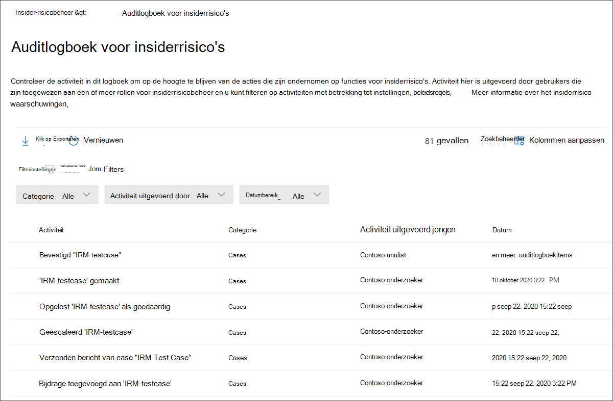

# Auditlogboek voor insiderrisicobeheer

Met het auditlogboek voor insiderrisicobeheer kunt u op de hoogte blijven van de acties die zijn uitgevoerd op basis van functies voor insiderrisicobeheer. In dit logboek kunt u onafhankelijk bekijken welke acties gebruikers hebben ondernomen die zijn toegewezen aan een of meer rollengroepen voor insiderrisicobeheer. Het auditlogboek voor insiderrisicobeheer wordt automatisch ingeschakeld in uw organisatie en kan niet worden uitgeschakeld.

Het auditlogboek wordt automatisch en onmiddellijk bijgewerkt wanneer er gecontroleerde activiteiten plaatsvinden en het logboek bewaart informatie over de activiteit gedurende 180 dagen (ongeveer zes maanden). Na 180 dagen worden de gegevens voor de activiteit definitief uit het logboek verwijderd.

Gebieden die deel uit maken van activiteitencontrole zijn:

- Beleid
- Cases
- Waarschuwingen
- Instellingen
- Gebruikers
- Kennisgevingssjablonen

Als u gegevens uit het auditlogboek wilt weergeven en exporteren, moeten gebruikers zijn toegewezen aan de rollengroepen *Insider Risk Management* of Insider Risk Management *Auditors.* Zie Aan de slag met insider [risk management Stap 1: Machtigingen inschakelen](insider-risk-management-configure.md#step-1-enable-permissions-for-insider-risk-management)voor meer informatie over rollengroepen voor insiderrisicobeheer.

>[!NOTE]
>Het auditlogboek voor insiderrisicobeheer is niet gekoppeld aan Microsoft 365 auditlogboek, het zijn onafhankelijke controlesystemen en vastleggen van informatie over afzonderlijke activiteiten. Het uitschakelen van Microsoft 365 auditing heeft geen invloed op activiteitencontrole binnen insider risk management.

## Activiteit weergeven in het auditlogboek voor insiderrisico's

Als u de functieactiviteit wilt bekijken die wordt gecontroleerd voor insiderrisicobeheer, gaat u naar de koppeling Insider-risicoauditlogboek en selecteert u deze in het rechterbovenhoek van het tabblad Insider-risicobeheer.  Standaard ziet u de volgende informatie voor activiteiten op het gebied van insiderrisicobeheer:

- **Activiteit:** Een beschrijving van de activiteit die een gebruiker heeft genomen in de oplossing voor insiderrisicobeheer.
- **Categorie:** Het gebied of item waar de activiteit is uitgevoerd. U ziet bijvoorbeeld Beleid *als* de categorie wanneer activiteiten voor beleidswijziging zijn uitgevoerd.
- **Activiteit uitgevoerd door:** De gebruikersnaam van de gebruiker die de activiteit heeft uitgevoerd.
- **Datum:** De datum en tijd waarop de activiteit is uitgevoerd. De datum en tijd zijn de lokale datum en tijd voor uw organisatie.

Voor meer informatie over een aangemelde activiteit selecteert u de activiteit om het deelvenster met activiteitendetails weer te geven. Dit deelvenster bevat aanvullende informatie over de activiteit.

## Kolommen en filteren

Om het voor auditors gemakkelijker te maken om geregistreerde activiteiten te bekijken, wordt filteren ondersteund in het **auditlogboek voor insiderrisico's.** Voor basisfilters zijn wachtrijkolommen beschikbaar om toe te voegen aan de weergave om verschillende draaitatjes op de bestanden en berichten te geven. U kunt activiteiten filteren op **categorie, datumbereik** en **activiteit die zijn uitgevoerd op** velden.

Als u kolomkoppen voor de activiteitswachtrij wilt toevoegen of verwijderen, gebruikt u **het** besturingselement Kolommen aanpassen en selecteert u een van de kolomopties. Deze kolommen zijn gebaseerd op algemene voorwaarden die worden ondersteund in het **insiderrisicoauditlogboek** en worden later in dit artikel weergegeven.

## Controlelogboek exporteren

Gebruikers die zijn toegewezen aan de rollengroepen *Insider Risk Management* of Insider Risk Management *Auditors,* kunnen alle activiteiten in het auditlogboek exporteren naar een .csv-bestand (door komma's gescheiden waarden) door **Exporteren** te selecteren op de **pagina** Auditlogboek voor Insider-risico's. Afhankelijk van de activiteit zijn sommige velden voor een activiteit mogelijk niet van toepassing op de activiteit en worden deze velden als leeg weergegeven in het geëxporteerde bestand.

Het bestand bevat activiteitsgegevens voor de volgende velden:

- **Activiteit uitgevoerd door:** De gebruikersnaam van de gebruiker die een itemwaarde wijzigt. Gebruikers die hier worden vermeld, zijn toegewezen aan een of meer van de volgende rollen van insiderrisicobeheer: *Insider Risk Management*, Insider Risk Management *Admins*, *Insider Risk Management Analysts*, *Insider Risk Management Investigators*. Elke rollengroep heeft verschillende machtigingsniveaus voor het beheren van functies voor insiderrisico's.
- **Activiteit:** De activiteit die voor een item wordt genomen. Waarden zijn *Bekeken, Verwijderd, Toegevoegd, Bewerkt beleid, Case, Gebruiker, Waarschuwing en* *Instellingen.*
- **Toegevoegd:** Objecten die tijdens de activiteit zijn toegevoegd, zoals gebruikers, bestandstypen of domeinen.
- **Waarschuwingsvolume:** het niveau van het waarschuwingsvolume dat is gedefinieerd in instellingen voor insiderrisicobeheer.
- **Bedrag:** De momenteel geselecteerde aangepaste indicator bedraagt voor een beleid.
- **Activa-id:** de activa-id van het prioritaire fysieke activum waar de activiteit op is uitgevoerd.
- **Categorie:** De categorie van het gewijzigde item. Waarden zijn *Beleid, Cases, Gebruikers, Waarschuwingen, Instellingen en* *Kennisgevingssjablonen.*
- **Datum:** Datum en tijd, vermeld in de lokale datum en tijd van uw organisatie.
- **Beschrijving:** De beschrijving die door de gebruiker wordt ingevoerd voor het object dat wordt gebruikt (zoals een beleid of een gebruikersgroep met prioriteit).
- **DLP-beleid**: Het beleid voor preventie van gegevensverlies (DLP) is geselecteerd om opname in een insiderrisicobeheerbeleid te activeren.
- **Indicator**: De indicator in de instellingen voor insiderrisico's waarin de activiteit is uitgevoerd (zoals het toevoegen of verwijderen van een indicator).
- **Kennisgevingssjabloon:** De kennisgevingssjabloon waar de activiteit op is uitgevoerd.
- **Aantal dagen:** Het activeringsvenster voor beleid dat is gedefinieerd in instellingen voor insiderrisico's.
- **Aantal bestanden:** de bestandsvolumelimiet die is gedefinieerd in instellingen voor insiderrisicobeheer.
- **Beleidssjabloon:** de beleidssjabloon waar de indicatoren op hebben geacteerd, behoort toe aan.
- **Vorige bedrag:** De eerder geselecteerde aangepaste indicator bedraagt voor een beleid.
- **Gebruikersgroep Prioriteit:** De gebruikersgroep prioriteit waar de activiteit is uitgevoerd.
- **Verwijderd:** Objecten die tijdens de activiteit zijn verwijderd, zoals gebruikers, bestandstypen of domeinen.
- **Afzender:** het afzenderveld van de kennisgevingssjabloon waar de activiteit is uitgevoerd.
- **Doelbeleid:** Het beleid waar de activiteit op is uitgevoerd (zoals het toevoegen van een gebruiker aan of het verwijderen van een gebruiker).
- **Bericht in sjabloon:** de bericht body van de kennisgevingssjabloon waarin de activiteit is uitgevoerd.
- **Sjabloononderwerp:** Het onderwerpveld van de kennisgevingssjabloon waar de activiteit is uitgevoerd.
- **Gebruiker:** Gebruiker waar de activiteit op is uitgevoerd.
