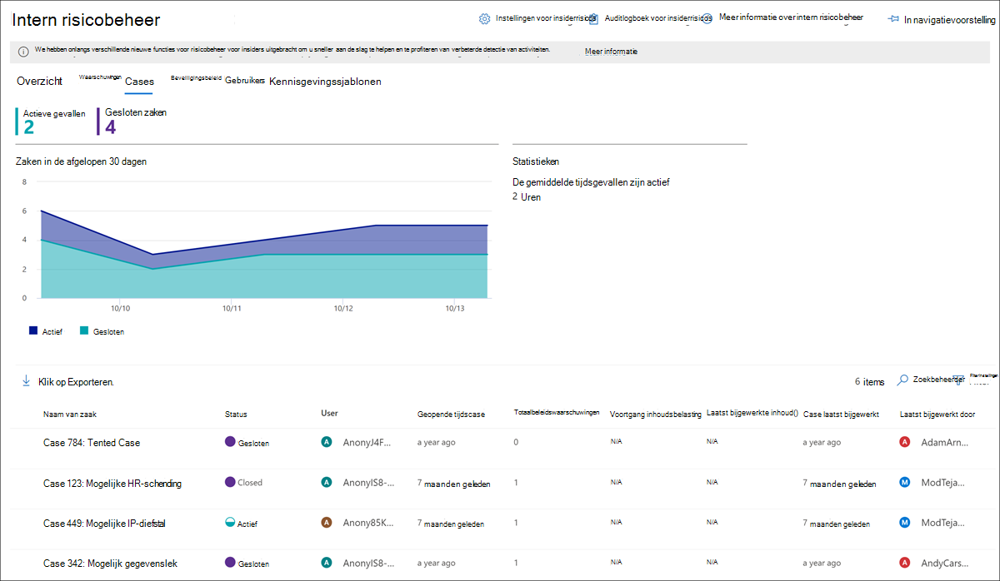
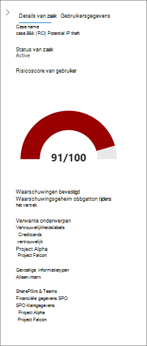
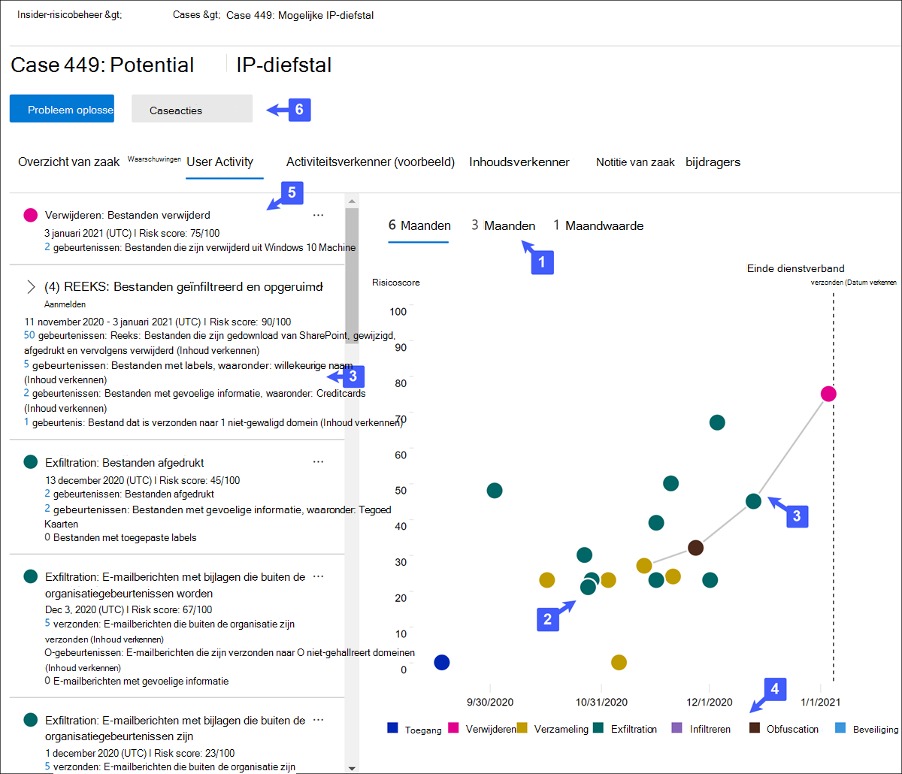
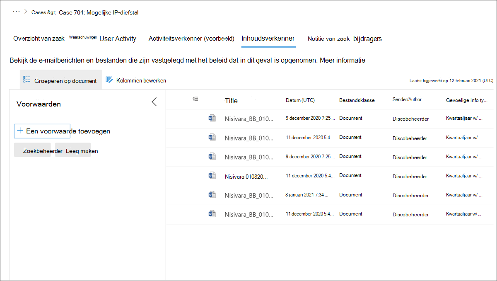

# Cases voor insiderrisicobeheerInsider risk management cases

Cases vormen het hart van insider-risicobeheer en stellen u in staat om problemen die zijn gegenereerd door risico-indicatoren die in uw beleid zijn gedefinieerd, grondig te onderzoeken en op te lossen.Cases are the heart of insider risk management and allow you to deeply investigate and act on issues generated by risk indicators defined in your policies. Gevallen worden handmatig gemaakt op het gebied van waarschuwingen in situaties waarin verdere actie nodig is om een complianceprobleem voor een gebruiker aan te pakken.Cases are manually created from alerts in situations where further action is needed to address a compliance-related issue for a user. Elk geval is beperkt tot één gebruiker en meerdere waarschuwingen voor de gebruiker kunnen worden toegevoegd aan een bestaand geval of aan een nieuw geval.Each case is scoped to a single user and multiple alerts for the user can be added to an existing case or to a new case. 

Nadat u de details van een zaak hebt onderzocht, kunt u actie ondernemen door:After investigating the details of a case, you can take action by:

- de gebruiker een melding sturensending the user a notice
- het oplossen van de zaak als goedaardigresolving the case as benign
- het geval delen met uw ServiceNow-exemplaar of met een e-mailontvangersharing the case with your ServiceNow instance or with an email recipient
- de zaak voor een onderzoek Advanced eDiscovery escalerenescalating the case for an Advanced eDiscovery investigation

Bekijk de [video Insider Risk Management Investigation and Escalation](https://www.youtube.com/watch?v=UONUSmkRC8s) voor een overzicht van hoe zaken worden onderzocht en beheerd in insider risk management.Check out the [Insider Risk Management Investigation and Escalation video](https://www.youtube.com/watch?v=UONUSmkRC8s) for an overview of how cases are investigated and managed in insider risk management.

## Cases dashboardCases dashboard

Met het dashboard Cases **voor insiderrisicobeheer** kunt u zaken bekijken en handelen.The insider risk management **Cases dashboard** allows you to view and act on cases. Elke rapportwidget op het dashboard bevat gegevens van de afgelopen 30 dagen.Each report widget on the dashboard displays information for last 30 days.

- **Actieve zaken:** Het totale aantal actieve zaken dat wordt onderzocht.**Active cases**: The total number of active cases under investigation.
- **Zaken in de afgelopen 30 dagen:** het totale aantal zaken dat is gemaakt, gesorteerd op *actieve* en *gesloten* status.**Cases over past 30 days**: The total number of cases created, sorted by *Active* and *Closed* status.
- **Statistieken:** Gemiddelde tijd van actieve gevallen, weergegeven in uren, dagen of maanden.**Statistics**: Average time of active cases, listed in hours, days, or months.

De hoofdwachtrij bevat alle actieve en gesloten zaken voor uw organisatie, naast de huidige status van de volgende hoofdzakenkenmerken:The case queue lists all active and closed cases for your organization, in addition to the current status of the following case attributes:

- **Naam van zaak:** de naam van de zaak, gedefinieerd wanneer een waarschuwing wordt bevestigd en de zaak wordt gemaakt.**Case name**: The name of the case, defined when an alert is confirmed and the case is created.  
- **Status:** De status van de zaak, *actief* of *gesloten.***Status**: The status of the case, either *Active* or *Closed*.
- **Gebruiker:** De gebruiker voor de zaak.**User**: The user for the case. Als anonimisatie voor gebruikersnamen is ingeschakeld, worden geanonimiseerde gegevens weergegeven.If anonymization for usernames is enabled, anonymized information is displayed.
- **Geopende** tijdscase: de tijd die is verstreken sinds de zaak is geopend.**Time case opened**: The time that has passed since the case was opened.
- **Totaalbeleidswaarschuwingen:** het aantal beleidswedstrijden dat in de zaak is opgenomen.**Total policy alerts**: The number of policy matches included in the case. Dit aantal kan toenemen als er nieuwe waarschuwingen aan de zaak worden toegevoegd.This number may increase if new alerts are added to the case.
- **Case laatst bijgewerkt:** De tijd die is verstreken sinds er een toegevoegde notitie of wijziging is toegevoegd in de case state.**Case last updated**: The time that has passed since there has been an added case note or change in the case state.
- **Laatst bijgewerkt door**: De naam van de insider-risicobeheeranalist of onderzoeker die de zaak het laatst heeft bijgewerkt.**Last updated by**: The name of the insider risk management analyst or investigator that last updated the case.

Gebruik het **besturingselement** Zoeken om naam van een zaak te zoeken naar specifieke tekst en gebruik het casefilter om zaken te sorteren op de volgende kenmerken:Use the **Search** control to search case names for specific text and use the case filter to sort cases by the following attributes:

- StatusStatus
- Geopende tijdscase, begindatum en einddatumTime case opened, start date, and end date
- Laatst bijgewerkt, begindatum en einddatumLast updated, start date, and end date

## Filter casesFilter cases

Afhankelijk van het aantal en het type actief beleid voor insiderrisicobeheer in uw organisatie, kan het controleren van een grote wachtrij met zaken lastig zijn.Depending on the number and type of active insider risk management policies in your organization, reviewing a large queue of cases can be challenging. Met behulp van hoofdzakenfilters kunnen analisten en onderzoekers zaken op verschillende kenmerken sorteren.Using case filters can help analysts and investigators sort cases by several attributes. Als u waarschuwingen wilt filteren op het **dashboard Cases,** selecteert u het **besturingselement** Filter.To filter alerts on the **Cases dashboard**, select the **Filter** control. U kunt zaken filteren op een of meer kenmerken:You can filter cases by one or more attributes:

- **Status:** Selecteer een of meer statuswaarden om de lijst met zaken te filteren.**Status**: Select one or more status values to filter the case list. De opties zijn *Actief* en *Gesloten.*The options are *Active* and *Closed*.
- **Geopende** tijdscase: Selecteer de begin- en einddatums voor wanneer de zaak is geopend.**Time case opened**: Select the start and end dates for when the case was opened.
- **Laatst bijgewerkt:** Selecteer de begin- en einddatums voor wanneer de zaak is bijgewerkt.**Last updated**: Select the start and end dates for when the case was updated.

## Een zaak onderzoekenInvestigate a case

Nader onderzoek naar waarschuwingen voor insiderrisicobeheer is essentieel voor het nemen van juiste corrigerende acties.Deeper investigation into insider risk management alerts is critical to taking proper corrective actions. Insider risk management cases zijn het centrale beheerhulpmiddel om dieper in te gaan op de geschiedenis van gebruikersrisicoactiviteit, waarschuwingsdetails, de reeks risicogebeurtenissen en om de inhoud en berichten te verkennen die aan risico's worden blootgesteld.Insider risk management cases are the central management tool to dive deeper into user risk activity history, alert details, the sequence of risk events, and to explore the content and messages exposed to risks. Risicoanalisten en -onderzoeker gebruiken ook cases om feedback en notities te centraliseren en case-resolutie te verwerken.Risk analysts and investigators also use cases to centralize review feedback and notes and to process case resolution.

Als u een zaak selecteert, worden de hulpprogramma's voor casebeheer geopend en kunnen analisten en onderzoekers de details van zaken bekijken.Selecting a case opens the case management tools and allows analysts and investigators to dig into the details of cases.

### Overzicht van zaakCase overview

Het **tabblad Overzicht van** zaak bevat een overzicht van de casedetails voor risicoanalisten en -onderzoeker.The **Case overview** tab summarizes the case details for risk analysts and investigators. Het bevat de volgende informatie in het **gebied Over dit geval**It includes the following information in the **About this case** area

- **Status:** De huidige status van de zaak, actief of gesloten.**Status**: The current status of the case, either Active or Closed.
- **Case gemaakt op**: De datum en tijd waarop de zaak is gemaakt.**Case created on**: The date and time the case was created.
- **De risicoscore van de gebruiker:** het huidige berekende risiconiveau van de gebruiker voor de zaak.**User's risk score**: The current calculated risk level of the user for the case. Deze score wordt elke 24 uur berekend en gebruikt waarschuwingsrisicoscores van alle actieve waarschuwingen die aan de gebruiker zijn gekoppeld.This score is calculated every 24 hours and uses alert risk scores from all active alerts associated to the user.
- **E-mail:** De e-mailalias van de gebruiker voor de zaak.**Email**: The email alias of the user for the case.
- **Organisatie of afdeling:** de organisatie of afdeling aan de gebruiker.**Organization or department**: The organization or department that the user is assigned to.
- **Managernaam:** De naam van de manager van de gebruiker.**Manager name**: The name of the user's manager.
- **E-mail van Manager:** de e-mailalias van de manager van de gebruiker.**Manager email**: The email alias of the user's manager.

Het **tabblad Overzicht van** zaak bevat ook een sectie **Waarschuwingen** met de volgende informatie over waarschuwingen voor beleidsmatchen die aan de zaak zijn gekoppeld:The **Case overview** tab also includes an **Alerts** section that includes the following information about policy match alerts associated with the case:

- **Beleid komt overeen:** de naam van het beleid voor insiderrisicobeheer dat is gekoppeld aan de overeenkomende waarschuwingen voor gebruikersactiviteit.**Policy matches**: The name of the insider risk management policy associated with the match alerts for user activity.
- **Status:** Status van de waarschuwing.**Status**: Status of the alert.
- **Ernst:** Ernst van de waarschuwing.**Severity**: Severity of the alert.
- **Tijd gedetecteerd:** de tijd die is verstreken sinds de waarschuwing is gegenereerd.**Time detected**: The time that has passed since the alert was generated.

### WaarschuwingenAlerts

Het **tabblad Waarschuwingen** bevat een overzicht van de huidige waarschuwingen die in de case zijn opgenomen.The **Alerts** tab summarizes the current alerts included in the case. Nieuwe waarschuwingen kunnen worden toegevoegd aan een bestaand  geval en ze worden toegevoegd aan de waarschuwingswachtrij wanneer ze worden toegewezen.New alerts may be added to an existing case and they will be added to the **Alert** queue as they are assigned. De volgende waarschuwingskenmerken worden weergegeven in de wachtrij:The following alert attributes are listed the queue:

- StatusStatus
- ErnstSeverity
- Tijd gedetecteerdTime detected

Selecteer een waarschuwing in de wachtrij om de detailpagina **Waarschuwing weer te** geven.Select an alert from the queue to display the **Alert detail** page.

Gebruik het zoekbesturingselement om waarschuwingsnamen te zoeken naar specifieke tekst en gebruik het waarschuwingsfilter om zaken te sorteren op de volgende kenmerken:Use the search control to search alert names for specific text and use the alert filter to sort cases by the following attributes:

- StatusStatus
- ErnstSeverity
- Tijd gedetecteerd, begindatum en einddatumTime detected, start date, and end date

Gebruik het filterbesturingselement om waarschuwingen te filteren op verschillende kenmerken, waaronder:Use the filter control to filter alerts by several attributes, including:

- **Status:** Selecteer een of meer statuswaarden om de lijst met waarschuwingen te filteren.**Status**: Select one or more status values to filter the alert list. De opties *zijn Bevestigd*, *Afgewezen*, *Behoeften controleren* en *Opgelost*.The options are *Confirmed*, *Dismissed*, *Needs review*, and *Resolved*.
- **Ernst:** Selecteer een of meer ernstsniveaus voor waarschuwingsrisico's om de lijst met waarschuwingen te filteren.**Severity**: Select one or more alert risk severity levels to filter the alert list. De opties zijn *Hoog,* *Gemiddeld* en *Laag.*The options are *High*, *Medium*, and *Low*.
- **Tijd gedetecteerd:** Selecteer de begin- en einddatums voor wanneer de waarschuwing is gemaakt.**Time detected**: Select the start and end dates for when the alert was created.
- **Beleid:** Selecteer een of meer beleidsregels om de waarschuwingen te filteren die worden gegenereerd door het geselecteerde beleid.**Policy**: Select one or more policies to filter the alerts generated by the selected policies.

### GebruikersactiviteitUser activity

Het **tabblad Gebruikersactiviteit** is een van de krachtigste hulpmiddelen voor interne risicoanalyse en -onderzoek voor gevallen in de insider-oplossing voor risicobeheer.The **User activity** tab is one of the most powerful tools for internal risk analysis and investigation for cases in the insider risk management solution. Dit tabblad is zo gestructureerd dat een zaak snel kan worden gecontroleerd, inclusief een historische tijdlijn met alle waarschuwingen, waarschuwingsdetails, de huidige risicoscore voor de gebruiker in het geval, de reeks risicogebeurtenissen en besturingselementen om effectieve actie te ondernemen om de risico's in het geval te bevatten.This tab is structured to enable quick review of a case, including a historical timeline of all alerts, alert details, the current risk score for the user in the case, the sequence of risk events, and controls to take effective action to contain the risks in the case.

1. **Tijdfilters:** Standaard worden de laatste zes maanden van waarschuwingen die in het geval zijn bevestigd, weergegeven in de grafiek Gebruikersactiviteit.**Time filters**: By default, the last six months of alerts confirmed in the case are displayed in the User activity chart. U kunt de grafiekweergave eenvoudig filteren door de tabbladen *6 maanden,* *3* maanden of *1 maand in* het bellendiagram te selecteren.You can easily filter the chart view by selecting the *6 Months*, *3 Months*, or *1 Month* tabs on the bubble chart.
2. **Activiteit en details van risicowaarschuwing:** Risicoactiviteiten worden visueel weergegeven als gekleurde bellen in de grafiek Gebruikersactiviteit.**Risk alert activity and details**: Risk activities are visually displayed as colored bubbles in the User activity chart. Bellen worden gemaakt voor verschillende categorieën risico's en de grootte van bellen is evenredig met het aantal risicoactiviteiten voor de categorie.Bubbles are created for different categories of risk and bubble size is proportional to the number of risk activities for the category. Selecteer een bel om de details voor elke risicoactiviteit weer te geven.Select a bubble to display the details for each risk activity. Details zijn:Details include:
    - **Datum** van de risicoactiviteit.**Date** of the risk activity.
    - De **categorie risicoactiviteit**.The **risk activity category**. *E-mail(en)* met bijlagen die buiten de organisatie zijn verzonden of Bestanden die zijn gedownload van *SharePoint Online.*For example, *Email(s) with attachments sent outside the organization* or *File(s) downloaded from SharePoint Online*.
    - **Risicoscore** voor de waarschuwing.**Risk score** for the alert. Deze score is de numerieke score voor het ernstsniveau van het waarschuwingsrisico.This score is the numerical score for the alert risk severity level.
    - Het aantal gebeurtenissen dat aan de waarschuwing is gekoppeld.Number of events associated with the alert. Koppelingen naar elk bestand of e-mailbericht dat aan de risicoactiviteit is gekoppeld, zijn ook beschikbaar.Links to each file or email associated with the risk activity are also available.
3. **Risicoreeks (voorbeeld)**: De chronologische volgorde van risicovolle activiteiten is een belangrijk aspect van risicoonderzoek en het identificeren van deze gerelateerde activiteiten is een belangrijk onderdeel van het evalueren van het totale risico voor uw organisatie.**Risk sequence (preview)**: The chronological order of risky activities is an important aspect of risk investigation and identifying these related activities is an important part of evaluating overall risk for your organization. Waarschuwingsactiviteiten die gerelateerd zijn, worden weergegeven met verbindingslijnen om te benadrukken dat deze activiteiten zijn gekoppeld aan een groter risicogebied.Alert activities that are related are displayed with connecting lines to highlight that these activities are associated with a larger risk area. Met deze weergave van activiteiten kunnen onderzoekers letterlijk 'de puntjes verbinden' voor risicoactiviteiten die als eenmalige of eenmalige gebeurtenissen hadden kunnen worden bekeken.This view of activities can help investigators literally 'connect the dots' for risk activities that could have been viewed as isolated or one-off events. Selecteer een bellen in de reeks om details weer te geven voor alle bijbehorende risicoactiviteiten.Select any bubble in the sequence to display details for all the associated risk activities. Details zijn:Details include:

    - **Naam** van de reeks.**Name** of the sequence.
    - **Datum** of **datumbereik** van de reeks.**Date** or **Date range** of the sequence.
    - **Risicoscore** voor de reeks.**Risk score** for the sequence. Deze score is de numerieke score voor de reeks van de gecombineerde ernst van het waarschuwingsrisico voor elke gerelateerde activiteit in de reeks.This score is the numerical score for the sequence of the combined alert risk severity levels for each related activity in the sequence.
    - **Het aantal gebeurtenissen dat aan elke waarschuwing in de reeks is gekoppeld.****Number of events associated with each alert in the sequence**. Koppelingen naar elk bestand of e-mailbericht dat aan elke risicoactiviteit is gekoppeld, zijn ook beschikbaar.Links to each file or email associated with each risk activity are also available.
    - **Activiteiten in de juiste volgorde laten zien.****Show activities in sequence**. Hiermee wordt de volgorde weergegeven als een markeringslijn in het bellendiagram en worden de waarschuwingsdetails uitgebreid om alle gerelateerde waarschuwingen in de volgorde weer te geven.Displays sequence as a highlight line on the bubble chart and expands the alert details to display all related alerts in the sequence.

4. **Legenda risicoactiviteit:** aan de onderkant van de grafiek met gebruikersactiviteit kunt u met een legenda met kleurcode snel de risicocategorie voor elke waarschuwing bepalen.**Risk activity legend**: Across the bottom of the user activity chart, a color-coded legend helps you quickly determine risk category for each alert.
5. **Risicoactiviteitschronologie:** De volledigechronologie van alle risicowaarschuwingen die aan de zaak zijn gekoppeld, worden weergegeven, inclusief alle details die beschikbaar zijn in de bijbehorende waarschuwingsballon.**Risk activity chronology**: The full chronology of all risk alerts associated with the case are listed, including all the details available in the corresponding alert bubble.
6. **Caseacties:** Opties voor het oplossen van de zaak staan op de werkbalk caseactie.**Case actions**: Options for resolving the case are on the case action toolbar. U kunt een zaak oplossen, een e-mailbericht naar de gebruiker verzenden of de zaak escaleren voor een gegevens- of gebruikersonderzoek.You can resolve a case, send an email notice to the user, or escalate the case for a data or user investigation.

### Activiteitsverkenner (voorbeeld)Activity explorer (preview)

>[!IMPORTANT]
>Het tabblad Activiteitsverkenner is beschikbaar in het gebied voor casebeheer voor gebruikers met triggeringgebeurtenissen nadat deze functie beschikbaar is in uw organisatie.The Activity explorer tab is available in the case management area for users with triggering events after this feature is available in your organization.

Op **het tabblad Activiteitsverkenner** kunnen risicoanalisten en -onderzoeker activiteitendetails bekijken die zijn gekoppeld aan risicowaarschuwingen.The **Activity explorer** tab allows risk analysts and investigators to review activity details associated with risk alerts. Als onderdeel van de casemanagementacties moeten de onderzoekers en analisten bijvoorbeeld mogelijk alle risicoactiviteiten die aan de zaak zijn gekoppeld, bekijken voor meer informatie.For example, as part of the case management actions, investigators and analysts may need to review all the risk activities associated with the case for more details. Met de **Activiteitsverkenner** kunnen revisoren snel een tijdlijn bekijken van gedetecteerde riskante activiteiten en alle risicoactiviteiten identificeren en filteren die aan waarschuwingen zijn gekoppeld.With the **Activity explorer**, reviewers can quickly review a timeline of detected risky activity and identify and filter all risk activities associated with alerts.

Zie het artikel Waarschuwingen voor [Insider-risicobeheer](insider-risk-management-alerts.md#activity-explorer-preview) voor meer informatie over de Activiteitenverkenner.For more information about the Activity explorer, see the [Insider risk management alerts](insider-risk-management-alerts.md#activity-explorer-preview) article.

### InhoudsverkennerContent explorer

Op **het tabblad Inhoudverkenner** kunnen risicoanalisten en -onderzoekers kopieën bekijken van alle afzonderlijke bestanden en e-mailberichten die zijn gekoppeld aan risicowaarschuwingen.The **Content explorer** tab allows risk analysts and investigators to review copies of all individual files and email messages associated with risk alerts. Als er bijvoorbeeld een waarschuwing wordt gemaakt wanneer een gebruiker honderden bestanden downloadt van SharePoint Online en de activiteit een beleidsmelding activeert, worden alle gedownloade bestanden voor de waarschuwing vastgelegd en gekopieerd naar de insider risk management case uit oorspronkelijke opslagbronnen.For example, if an alert is created when a user downloads hundreds of files from SharePoint Online and the activity triggers a policy alert, all the downloaded files for the alert are captured and copied to the insider risk management case from original storage sources.

De Inhoudsverkenner is een krachtig hulpmiddel met eenvoudige en geavanceerde zoek- en filterfuncties.The Content explorer is a powerful tool with basic and advanced search and filtering features. Zie Insider risk management Content [explorer](insider-risk-management-content-explorer.md)voor meer informatie over het gebruik van de Inhoudsverkenner.To learn more about using the Content explorer, see [Insider risk management Content explorer](insider-risk-management-content-explorer.md).

### Notitie van zaakCase notes

Op **het tabblad** Case-notities in de zaak delen risicoanalisten en -onderzoeker opmerkingen, feedback en inzichten over hun werk voor de zaak.The **Case notes** tab in the case is where risk analysts and investigators share comments, feedback, and insights about their work for the case. Notities zijn permanente toevoegingen aan een zaak en kunnen niet worden bewerkt of verwijderd nadat de notitie is opgeslagen.Notes are permanent additions to a case and cannot be edited or deleted after the note is saved. Wanneer een zaak wordt gemaakt op basis  van een waarschuwing, worden de opmerkingen die zijn ingevoerd in het dialoogvenster Waarschuwing bevestigen en insiderrisico's maken, automatisch toegevoegd als een notitie.When a case is created from an alert, the comments entered in the **Confirm alert and create insider risk case** dialog are automatically added as a case note.

In het dashboard met notitienotities worden notities weergegeven van de gebruiker die de notitie heeft gemaakt en de tijd die is verstreken sinds de notitie is opgeslagen.The case notes dashboard displays notes by the user that created the note and the time that has passed since the note was saved. Als u in het tekstveld met hoofdteksten naar een specifiek trefwoord wilt zoeken, gebruikt u de knop Zoeken op het hoofdvak en voert u een specifiek trefwoord in. To search the case note text field for a specific keyword, use the **Search** button on the case dashboard and enter a specific keyword.

Een notitie toevoegen aan een zaak:To add a note to a case:

1. Ga in [Microsoft 365 compliancecentrum](https://compliance.microsoft.com)naar **Insider-risicobeheer** en selecteer het **tabblad Gevallen.**In the [Microsoft 365 compliance center](https://compliance.microsoft.com), go to **Insider risk management** and select the **Cases** tab.
2. Selecteer een hoofd zaak en selecteer vervolgens het **tabblad Notitie** van zaak.Select a case, then select the **Case notes** tab.
3. Selecteer **Notitie van de zaak toevoegen**.Select **Add case note**.
4. Typ in **het dialoogvenster Notitie** toevoegen uw notitie voor de zaak.On the **Add case note** dialog, type your note for the case. Selecteer **Opslaan** om de notitie aan de zaak toe te voegen of selecteer **Sluiten** annuleren zonder de notitie op te slaan in de zaak.Select **Save** to add the note to the case or select **Cancel** close without saving the note to the case.

### InzendersContributors

Op **het tabblad Inzenders** in de zaak kunnen risicoanalisten en -onderzoekers andere revisoren aan de zaak toevoegen.The **Contributors** tab in the case is where risk analysts and investigators can add other reviewers to the case. Wees standaard, alle gebruikers  die de insiderrisicobeheeranalisten en de rollen insiderrisicobeheeronderzoekers hebben toegewezen, worden vermeld als bijdragers voor elke actieve en gesloten zaak. Be default, all users assigned the **Insider Risk Management Analysts** and the **Insider Risk Management Investigators** roles are listed as contributors for each active and closed case. Alleen gebruikers die de rol **Insider Risk Management-onderzoeker** hebben toegewezen, hebben toestemming om bestanden en berichten weer te geven in de Inhoudsverkenner.Only users assigned the **Insider Risk Management Investigators** role have permission to view files and messages in the Content explorer.

Tijdelijke toegang tot een zaak kan worden verleend door een gebruiker toe te voegen als inzender.Temporary access to a case can be granted by adding a user as a contributor. Inzenders hebben alle beheersbesturingselementen voor het specifieke geval, behalve:Contributors have all case management control on the specific case except:

- Machtiging voor het bevestigen of afwijzen van waarschuwingenPermission to confirm or dismiss alerts
- Machtiging voor het bewerken van de inzenders voor zakenPermission to edit the contributors for cases
- Machtiging voor het weergeven van bestanden en berichten in de InhoudsverkennerPermission to view files and messages in the Content explorer

Een inzender toevoegen aan een zaak:To add a contributor to a case:

1. Ga in [Microsoft 365 compliancecentrum](https://compliance.microsoft.com)naar **Insider-risicobeheer** en selecteer het **tabblad Gevallen.**In the [Microsoft 365 compliance center](https://compliance.microsoft.com), go to **Insider risk management** and select the **Cases** tab.
2. Selecteer een zaak en selecteer vervolgens het **tabblad Inzenders.**Select a case, then select the **Contributors** tab.
3. Selecteer **Inzender toevoegen.**Select **Add contributor**.
4. Typ in **het dialoogvenster Inzender** toevoegen de naam van de gebruiker die u wilt toevoegen en selecteer de gebruiker in de voorgestelde gebruikerslijst.On the **Add contributor** dialog, start typing the name of the user you want to add and then select the user from the suggested user list. Deze lijst wordt gegenereerd op basis van Azure Active Directory van uw tenantabonnement.This list is generated from the Azure Active Directory of your tenant subscription.
5. Selecteer **Toevoegen om** de gebruiker toe te voegen als inzender of selecteer **Het** dialoogvenster annuleren sluiten zonder de gebruiker toe te voegen als inzender.Select **Add** to add the user as a contributor or select **Cancel** close the dialog without adding the user as a contributor.

## CaseactiesCase actions

Risicoanalisten en -onderzoeker kunnen actie ondernemen op een zaak in een van de verschillende methoden, afhankelijk van de ernst van de zaak, de geschiedenis van het risico van de gebruiker en de risicorichtlijnen van uw organisatie.Risk analysts and investigators can take action on a case in one of several methods, depending on the severity of the case, the history of risk of the user, and the risk guidelines of your organization. In sommige situaties moet u mogelijk een zaak escaleren naar een gebruiker of gegevensonderzoek om samen te werken met andere gebieden van uw organisatie en om dieper in te gaan op risicoactiviteiten.In some situations, you may need to escalate a case to a user or data investigation to collaborate with other areas of your organization and to dive deeper into risk activities. Insider risk management is nauw geïntegreerd met andere Microsoft 365 compliance-oplossingen om u te helpen met end-to-end oplossingsbeheer.Insider risk management is tightly integrated with other Microsoft 365 compliance solutions to help you with end-to-end resolution management.

### E-mailbericht verzendenSend email notice

In de meeste gevallen zijn gebruikersacties die insiderrisicowaarschuwingen maken onbedoeld of per ongeluk.In most cases, user actions that create insider risk alerts are inadvertent or accidental. Het verzenden van een herinneringsbericht naar de gebruiker via e-mail is een effectieve methode voor het documenteren van case review en actie, en is een methode om gebruikers te herinneren aan bedrijfsbeleid of hen aan te wijzen op bijscholing.Sending a reminder notice to the user via email is an effective method for documenting case review and action, and is a method to remind users of corporate policies or point them to refresher training. Kennisgevingen worden gegenereerd op basis [van kennisgevingssjablonen die u maakt](insider-risk-management-notices.md) voor uw insider-infrastructuur voor risicobeheer.Notices are generated from [notice templates that you create](insider-risk-management-notices.md) for your insider risk management infrastructure.

Het is belangrijk om te onthouden dat het verzenden van een e-mailbericht naar een gebruiker \*\*\*\*\* het probleem niet kan oplossen als _Closed\*.It's important to remember that sending an email notice to a user ***does not** _ resolve the case as _Closed*. In sommige gevallen wilt u mogelijk een zaak open laten nadat u een melding naar een gebruiker hebt verzonden om te zoeken naar meer risicoactiviteiten zonder een nieuwe zaak te openen.In some cases, you may want to leave a case open after sending a notice to a user to look for more risk activities without opening a new case. Als u een zaak wilt oplossen nadat u  een melding hebt verzonden, moet u de zaak Oplossen selecteren als een vervolgstap na het verzenden van een kennisgeving.If you want to resolve a case after sending a notice, you must select the **Resolve case** as a follow-on step after sending a notice.

Een melding verzenden naar de gebruiker die aan een zaak is toegewezen:To send a notice to the user assigned to a case:

1. Ga in [Microsoft 365 compliancecentrum](https://compliance.microsoft.com)naar **Insider-risicobeheer** en selecteer het **tabblad Gevallen.**In the [Microsoft 365 compliance center](https://compliance.microsoft.com), go to **Insider risk management** and select the **Cases** tab.
2. Selecteer een zaak en selecteer vervolgens de **knop Bericht per e-mail** verzenden op de werkbalk actie voor het geval.Select a case, then select the **Send email notice** button on the case action toolbar.
3. Selecteer in **het dialoogvenster E-mailbericht verzenden** het vervolgkeuzevenster Een kennisgevingssjabloon kiezen om de aankondigingssjabloon voor de melding te selecteren. On the **Send e-mail notice** dialog, select the **Choose a notice template** dropdown control to select the notice template for the notice. Met deze selectie worden de andere velden in de melding vooraf gevuld.This selection pre-fills the other fields on the notice.
4. Controleer de kennisgevingsvelden en werk deze zo nodig bij.Review the notice fields and update as appropriate. De waarden die hier worden ingevoerd, overschrijven de waarden op de sjabloon.The values entered here will override the values on the template.
5. Selecteer **Verzenden** om de melding naar de gebruiker te verzenden of selecteer **Het** dialoogvenster annuleren sluiten zonder de melding naar de gebruiker te verzenden.Select **Send** to send the notice to the user or select **Cancel** close the dialog without sending the notice to the user. Alle verzonden kennisgevingen worden toegevoegd aan de wachtrij met casenotities op het dashboard **Case notes.**All sent notices are added to the case notes queue on the **Case notes** dashboard.

### Escaleren voor onderzoekEscalate for investigation

Escaleert de zaak voor gebruikersonderzoek in situaties waarin aanvullende juridische controle nodig is voor de risicoactiviteit van de gebruiker.Escalate the case for user investigation in situations where additional legal review is needed for the user's risk activity. Deze escalatie opent een nieuw Advanced eDiscovery in uw Microsoft 365 organisatie.This escalation opens a new Advanced eDiscovery case in your Microsoft 365 organization. Advanced eDiscovery biedt een end-to-end werkstroom voor het bewaren, verzamelen, controleren, analyseren en exporteren van inhoud die reageert op interne en externe juridische onderzoeken van uw organisatie.Advanced eDiscovery provides an end-to-end workflow to preserve, collect, review, analyze, and export content that's responsive to your organization's internal and external legal investigations. Het is ook mogelijk dat uw juridische team de volledige werkstroom voor de melding van de wettelijke bewaarstatus beheert om te communiceren met bewaarders die betrokken zijn bij een zaak.It also lets your legal team manage the entire legal hold notification workflow to communicate with custodians involved in a case. Als u een revisor toewijst als voogd in een Advanced eDiscovery geval dat is gemaakt op basis van een insiderrisicobeheerzaak, kan uw juridische team passende actie ondernemen en inhoudsbewaaring beheren.Assigning a reviewer as a custodian in an Advanced eDiscovery case created from an insider risk management case helps your legal team take appropriate action and manage content preservation. Zie Overzicht van Advanced eDiscovery in Microsoft 365 voor meer informatie over Advanced eDiscovery [gevallen.](overview-ediscovery-20.md)To learn more about Advanced eDiscovery cases, see [Overview of Advanced eDiscovery in Microsoft 365](overview-ediscovery-20.md).

Een zaak escaleren naar een gebruikersonderzoek:To escalate a case to a user investigation:

1. Ga in [Microsoft 365 compliancecentrum](https://compliance.microsoft.com)naar **Insider-risicobeheer** en selecteer het **tabblad Gevallen.**In the [Microsoft 365 compliance center](https://compliance.microsoft.com), go to **Insider risk management** and select the **Cases** tab.
2. Selecteer een zaak en selecteer vervolgens de **knop Escaleren voor onderzoek** op de werkbalk actie van het geval.Select a case, then select the **Escalate for investigation** button on the case action toolbar.
3. Voer in **het dialoogvenster Escaleren voor onderzoek** een naam in voor het nieuwe gebruikersonderzoek.On the **Escalate for investigation** dialog, enter a name for the new user investigation. Typ indien nodig notities over de zaak en selecteer **Escaleren.**If needed, enter notes about the case and select **Escalate**.
4. Controleer de kennisgevingsvelden en werk deze zo nodig bij.Review the notice fields and update as appropriate. De waarden die hier worden ingevoerd, overschrijven de waarden op de sjabloon.The values entered here will override the values on the template.
5. Selecteer **Bevestigen** om de zaak voor het gebruikersonderzoek te maken of selecteer **Annuleren** om het dialoogvenster te sluiten zonder een nieuwe zaak voor gebruikersonderzoek te maken.Select **Confirm** to create the user investigation case or select **Cancel** to close the dialog without creating a new user investigation case.

Nadat de zaak voor insiderrisicobeheer is geëscaleerd naar een nieuwe zaak voor gebruikersonderzoek, kunt u de nieuwe zaak bekijken in het **gebied eDiscovery**  >  **Advanced** in het Microsoft 365 compliancecentrum.After the insider risk management case has been escalated to a new user investigation case, you can review the new case in the **eDiscovery** > **Advanced** area in the Microsoft 365 compliance center.

### Geautomatiseerde taken uitvoeren met Power Automate voor de zaakRun automated tasks with Power Automate flows for the case

Met aanbevolen Power Automate kunnen risicoonderzoekers en analisten snel actie ondernemen om:Using recommended Power Automate flows, risk investigators and analysts can quickly take action to:

- Informatie aanvragen bij HR of business over een gebruiker in een insider risk caseRequest information from HR or business about a user in an insider risk case
- Manager op de hoogte stellen wanneer een gebruiker een insiderrisicowaarschuwing heeftNotify manager when a user has an insider risk alert
- Een record maken voor een insider risk management case in ServiceNowCreate a record for an insider risk management case in ServiceNow
- Gebruikers op de hoogte stellen wanneer ze worden toegevoegd aan een insiderrisicobeleidNotify users when they're added to an insider risk policy

Voer, beheer of maak Power Automate voor een insiderrisicobeheercase:To run, manage, or create Power Automate flows for an insider risk management case:

1. Selecteer **Automatiseren op** de werkbalk voor de actie voor de zaak.Select **Automate** on the case action toolbar. 
2. Kies de Power Automate stroom die u wilt uitvoeren en selecteer **vervolgens Stroom uitvoeren.**Choose the Power Automate flow to run, then select **Run flow**. 
3. Nadat de stroom is voltooid, selecteert u **Gereed**.After the flow has completed, select **Done**.

Zie Aan de slag met instellingen voor insider-risicobeheer voor meer Power Automate voor [insiderrisicobeheer.](insider-risk-management-settings.md#power-automate-flows-preview)To learn more about Power Automate flows for insider risk management, see [Getting started with insider risk management settings](insider-risk-management-settings.md#power-automate-flows-preview).

### Een team voor het Microsoft Teams voor de zaak weergeven of makenView or create a Microsoft Teams team for the case

Wanneer Microsoft Teams voor insider risk management is ingeschakeld in instellingen, wordt er automatisch een Microsoft Teams team gemaakt telkens wanneer een waarschuwing wordt bevestigd en er een zaak wordt gemaakt.When Microsoft Teams integration for insider risk management is enabled in settings, a Microsoft Teams team is automatically created every time an alert is confirmed and a case is created. Risicoonderzoekers en -analisten kunnen snel Microsoft Teams en rechtstreeks naar het team voor een zaak navigeren door **Weergave Microsoft Teams team** te selecteren op de werkbalk voor de actie van de zaak.Risk investigators and analysts can quickly open Microsoft Teams and navigate directly to the team for a case by selecting **View Microsoft Teams team** on the case action toolbar.

Voor zaken die zijn geopend voordat ze de integratie van microsoft-team inschakelen, kunnen risicoonderzoekers en -analisten een nieuw Microsoft Teams-team voor een zaak maken door Microsoft Teams **team maken** te selecteren op de werkbalk caseactie.For cases opened before enabling Microsoft Team integration, risk investigators and analysts can create a new Microsoft Teams team for a case by selecting **Create Microsoft Teams team** on the case action toolbar.

Wanneer een zaak is opgelost, wordt het bijbehorende Microsoft-team automatisch gearchiveerd (verborgen en omgezet in alleen-lezen).When a case is resolved, the associated Microsoft Team will be automatically archive (hidden and turned to read-only).

Zie Aan de slag met instellingen voor insiderrisicobeheer voor meer Microsoft Teams voor [insiderrisicobeheer.](insider-risk-management-settings.md#microsoft-teams-preview)To learn more about Microsoft Teams for insider risk management, see [Getting started with insider risk management settings](insider-risk-management-settings.md#microsoft-teams-preview).

### De zaak oplossenResolve the case

Nadat risicoanalisten en -onderzoeker hun onderzoek en onderzoek hebben voltooid, kan een zaak worden opgelost om te reageren op alle waarschuwingen die momenteel in de zaak zijn opgenomen.After risk analysts and investigators have completed their review and investigation, a case can be resolved to act on all the alerts currently included in the case. Bij het oplossen van een zaak wordt een resolutieclassificatie toegevoegd, wordt de status van de zaak gewijzigd in *Gesloten* en worden de redenen voor de oplossingsactie automatisch toegevoegd aan de wachtrij met casenotities op het dashboard **Case notes.**Resolving a case adds a resolution classification, changes the case status to *Closed*, and the resolution action reasons are automatically added to the case notes queue on the **Case notes** dashboard. Zaken worden als een van de volgende zaken opgelost:Cases are resolved as either:

- **Goedaardig:** De classificatie voor gevallen waarin waarschuwingen voor beleidsmatchen worden geëvalueerd als laag risico, niet-ernstig of onwaar positief.**Benign**: The classification for cases where policy match alerts are evaluated as low risk, non-serious, or false positive.
- **Bevestigd beleidsovertreding:** de classificatie voor gevallen waarin waarschuwingen voor beleidsovertredingen worden geëvalueerd als riskant, ernstig of het resultaat van kwaadaardige bedoelingen.**Confirmed policy violation**: The classification for cases where policy match alerts are evaluated as risky, serious, or the result of malicious intent.

Een probleem oplossen:To resolve a case:

1. Ga in [Microsoft 365 compliancecentrum](https://compliance.microsoft.com)naar **Insider-risicobeheer** en selecteer het **tabblad Gevallen.**In the [Microsoft 365 compliance center](https://compliance.microsoft.com), go to **Insider risk management** and select the **Cases** tab.
2. Selecteer een zaak en selecteer vervolgens de **knop Hoofd zaak oplossen** op de werkbalk voor de actie van het hoofdgeval.Select a case, then select the **Resolve case** button on the case action toolbar.
3. Selecteer in **het dialoogvenster Zaak oplossen** de vervolgkeuzelijst Oplossen **als** om de resolutieclassificatie voor de zaak te selecteren.On the **Resolve case** dialog, select the **Resolve as** dropdown control to select the resolution classification for the case. De opties zijn **Goedaardig** **of Bevestigd beleidsovertreding.**The options are **Benign** or **Confirmed policy violation**.
4. Voer in **het dialoogvenster Zaak oplossen** de redenen voor de resolutieclassificatie in het **tekstveld Actie ondernomen** in.On the **Resolve case** dialog, enter the reasons for the resolution classification in the **Action taken** text field.
5. Selecteer **Oplossen** om de zaak te sluiten of selecteer **Het** dialoogvenster annuleren sluiten zonder de zaak op te lossen.Select **Resolve** to close the case or select **Cancel** close the dialog without resolving the case.
