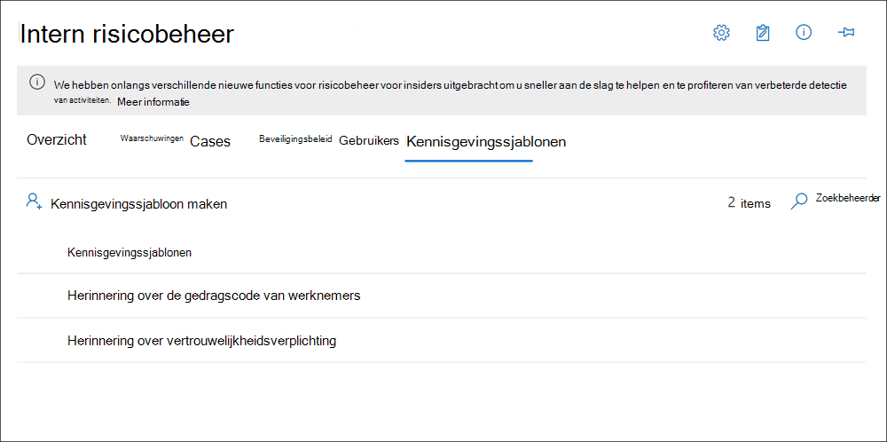

# <a name="insider-risk-management-notice-templates"></a><span data-ttu-id="e5b5e-104">Kennisgevingssjablonen voor insiderrisicobeheer</span><span class="sxs-lookup"><span data-stu-id="e5b5e-104">Insider risk management notice templates</span></span>

<span data-ttu-id="e5b5e-105">Met kennisgevingssjablonen voor insiderrisicobeheer kunt u e-mailberichten verzenden naar gebruikers wanneer hun activiteiten een beleidsmatch en waarschuwing genereren.</span><span class="sxs-lookup"><span data-stu-id="e5b5e-105">Insider risk management notice templates allow you to send email messages to users when their activities generate a policy match and alert.</span></span> <span data-ttu-id="e5b5e-106">In de meeste gevallen zijn gebruikersacties die waarschuwingen genereren het resultaat van fouten of onbedoelde activiteiten zonder slechte bedoelingen.</span><span class="sxs-lookup"><span data-stu-id="e5b5e-106">In most cases, user actions that generate alerts are the result of mistakes or inadvertent activities without ill intent.</span></span> <span data-ttu-id="e5b5e-107">Kennisgevingen dienen als eenvoudige herinneringen aan gebruikers om voorzichtiger te zijn, om koppelingen te geven naar informatie voor bijscholing of naar bronnen van het bedrijfsbeleid.</span><span class="sxs-lookup"><span data-stu-id="e5b5e-107">Notices serve as simple reminders to users to be more careful, to provide links to information for refresher training, or to corporate policy resources.</span></span> <span data-ttu-id="e5b5e-108">Kennisgevingen kunnen een belangrijk onderdeel zijn van uw interne compliancetrainingsprogramma en kunnen helpen bij het maken van een gedocumenteerd controlespoor voor gebruikers met terugkerende risicoactiviteiten.</span><span class="sxs-lookup"><span data-stu-id="e5b5e-108">Notices can be an important part of your internal compliance training program and can help create a documented audit trail for users with recurring risk activities.</span></span>

<span data-ttu-id="e5b5e-109">Maak kennisgevingssjablonen als u gebruikers een e-mailherinneringsbericht wilt sturen voor beleidswedstrijden als onderdeel van het probleemoplossingsproces.</span><span class="sxs-lookup"><span data-stu-id="e5b5e-109">Create notice templates if you want to send users an email reminder notice for policy matches as part of the issue resolution process.</span></span> <span data-ttu-id="e5b5e-110">Kennisgevingen kunnen alleen worden verzonden naar het e-mailadres van de gebruiker dat is gekoppeld aan de specifieke waarschuwing die wordt gecontroleerd.</span><span class="sxs-lookup"><span data-stu-id="e5b5e-110">Notices can only be sent to the user email address associated with the specific alert being reviewed.</span></span> <span data-ttu-id="e5b5e-111">Wanneer u een kennisgevingssjabloon selecteert die moet worden toegepast op een beleidsmatch, kunt u ervoor kiezen om de veldwaarden te accepteren die in de sjabloon zijn gedefinieerd of om de velden zo nodig te overschrijven.</span><span class="sxs-lookup"><span data-stu-id="e5b5e-111">When selecting a notice template to apply to a policy match, you can choose to accept the field values defined in the template or overwrite the fields as needed.</span></span>

## <a name="notice-templates-dashboard"></a><span data-ttu-id="e5b5e-112">Dashboard Met kennisgevingssjablonen</span><span class="sxs-lookup"><span data-stu-id="e5b5e-112">Notice templates dashboard</span></span>

<span data-ttu-id="e5b5e-113">In het dashboard Berichtensjablonen wordt een lijst met geconfigureerde kennisgevingssjablonen weergegeven en kunt u nieuwe **kennisgevingssjablonen** maken.</span><span class="sxs-lookup"><span data-stu-id="e5b5e-113">The **Notices templates dashboard** displays a list of configured notice templates and allows you to create new notice templates.</span></span> <span data-ttu-id="e5b5e-114">De kennisgevingssjablonen worden weergegeven in omgekeerde datum volgorde met de meest recente kennisgevingssjabloon die eerst wordt weergegeven.</span><span class="sxs-lookup"><span data-stu-id="e5b5e-114">The notice templates are listed in reverse date order with the most recent notice template listed first.</span></span>



## <a name="html-for-notices"></a><span data-ttu-id="e5b5e-116">HTML voor kennisgevingen</span><span class="sxs-lookup"><span data-stu-id="e5b5e-116">HTML for notices</span></span>

<span data-ttu-id="e5b5e-117">Als u meer wilt maken dan een eenvoudig e-mailbericht op basis van tekst voor meldingen, kunt u een gedetailleerder bericht maken met HTML in het berichttekstveld van een kennisgevingssjabloon.</span><span class="sxs-lookup"><span data-stu-id="e5b5e-117">If you'd like to create more than a simple text-based email message for notifications, you can create a more detailed message by using HTML in the message body field of a notice template.</span></span> <span data-ttu-id="e5b5e-118">In het volgende voorbeeld wordt de hoofdindeling van het bericht weergegeven voor een basissjabloon voor e-mailmeldingen op basis van HTML:</span><span class="sxs-lookup"><span data-stu-id="e5b5e-118">The following example provides the message body format for a basic HTML-based email notification template:</span></span>

```HTML
<!DOCTYPE html>
<html>
<body>
<h2>Action Required: Contoso User Code of Conduct Policy Training</h2>
<p>A recent activity you've performed has generated a risk alert prohibited by the Contoso User <a href='https://www.contoso.com'>Code of Conduct Policy</a>.</p>
<p>You are required to attend the Contoso User Code of Conduct <a href='https://www.contoso.com'>training</a> within the next 14 days. Please contact <a href='mailto:hr@contoso.com'>Human Resources</a> with any questions about this training request.</p>
<p>Thank you,</p>
<p><em>Human Resources</em></p>
</body>
</html>
```

> [!NOTE]
> <span data-ttu-id="e5b5e-119">Html href attribute implementation in the insider risk management notice templates currently support only single quotation marks instead of double quotation marks for URL references.</span><span class="sxs-lookup"><span data-stu-id="e5b5e-119">HTML href attribute implementation in the insider risk management notice templates currently support only single quotation marks instead of double quotation marks for URL references.</span></span>

## <a name="create-a-new-notice-template"></a><span data-ttu-id="e5b5e-120">Een nieuwe kennisgevingssjabloon maken</span><span class="sxs-lookup"><span data-stu-id="e5b5e-120">Create a new notice template</span></span>

<span data-ttu-id="e5b5e-121">Als u een nieuwe kennisgevingssjabloon voor insiderrisicobeheer wilt maken, gebruikt u de kennisgevingswizard in **de oplossing** voor insiderrisicobeheer in het Microsoft 365 compliancecentrum.</span><span class="sxs-lookup"><span data-stu-id="e5b5e-121">To create a new insider risk management notice template, you'll use the notice wizard in **Insider risk management** solution in the Microsoft 365 compliance center.</span></span>

<span data-ttu-id="e5b5e-122">Volg de volgende stappen om een nieuwe kennisgevingssjabloon voor insiderrisicobeheer te maken:</span><span class="sxs-lookup"><span data-stu-id="e5b5e-122">Complete the following steps to create a new insider risk management notice template:</span></span>

1. <span data-ttu-id="e5b5e-123">Ga in [Microsoft 365 compliancecentrum](https://compliance.microsoft.com)naar **Insider-risicobeheer** en selecteer het **tabblad Kennisgevingssjablonen.**</span><span class="sxs-lookup"><span data-stu-id="e5b5e-123">In the [Microsoft 365 compliance center](https://compliance.microsoft.com), go to **Insider risk management** and select the **Notice templates** tab.</span></span>
2. <span data-ttu-id="e5b5e-124">Selecteer **Kennisgevingssjabloon maken** om de wizard Kennisgeving te openen.</span><span class="sxs-lookup"><span data-stu-id="e5b5e-124">Select **Create notice template** to open the notice wizard.</span></span>
3. <span data-ttu-id="e5b5e-125">Vul op **de pagina Een nieuwe kennisgevingssjabloon** maken de volgende velden in:</span><span class="sxs-lookup"><span data-stu-id="e5b5e-125">On the **Create a new notice template** page, complete the following fields:</span></span>
    - <span data-ttu-id="e5b5e-126">**Naam van sjabloon:** Voer een vriendelijke naam in voor de melding.</span><span class="sxs-lookup"><span data-stu-id="e5b5e-126">**Template name**: Enter a friendly name for the notice.</span></span> <span data-ttu-id="e5b5e-127">Deze naam wordt weergegeven in de lijst met aankondigingen op het aankondigingsdashboard en in de lijst met aankondigingenselectie bij het verzenden van kennisgevingen vanuit een zaak.</span><span class="sxs-lookup"><span data-stu-id="e5b5e-127">This name appears on the list of notices on the notice dashboard and in the notice selection list when sending notices from a case.</span></span>
    - <span data-ttu-id="e5b5e-128">**Verzenden vanuit**: Voer het e-mailadres van de afzender in voor de melding.</span><span class="sxs-lookup"><span data-stu-id="e5b5e-128">**Send from**: Enter the sender email address for the notice.</span></span> <span data-ttu-id="e5b5e-129">Dit adres wordt weergegeven in het **veld Van:** in alle kennisgevingen die naar gebruikers worden verzonden, tenzij dit is gewijzigd bij het verzenden van een melding vanuit een zaak.</span><span class="sxs-lookup"><span data-stu-id="e5b5e-129">This address will appear in the **From:** field in all notices sent to users unless changed when sending a notice from a case.</span></span>
    - <span data-ttu-id="e5b5e-130">**CC- en BCC-velden:** Optionele gebruikers of groepen die op de hoogte worden gesteld van de beleidsmatch, geselecteerd in de Active Directory voor uw abonnement.</span><span class="sxs-lookup"><span data-stu-id="e5b5e-130">**Cc and Bcc** fields: Optional users or groups to be notified of the policy match, selected from the Active Directory for your subscription.</span></span>
    - <span data-ttu-id="e5b5e-131">**Onderwerp:** Informatie die wordt weergegeven in de onderwerpregel van het bericht, ondersteunt teksttekens.</span><span class="sxs-lookup"><span data-stu-id="e5b5e-131">**Subject**: Information that appears in the subject line of the message, supports text characters.</span></span>
    - <span data-ttu-id="e5b5e-132">**Berichttekst:** informatie die wordt weergegeven in de berichttekst, ondersteunt tekst- of HTML-waarden.</span><span class="sxs-lookup"><span data-stu-id="e5b5e-132">**Message body**: Information that appears in the message body, supports text or HTML values.</span></span>
4. <span data-ttu-id="e5b5e-133">Selecteer **Maken om** de kennisgevingssjabloon te maken en op te slaan of selecteer **Annuleren** om te sluiten zonder de kennisgevingssjabloon op te slaan.</span><span class="sxs-lookup"><span data-stu-id="e5b5e-133">Select **Create** to create and save the notice template or select **Cancel** to close without saving the notice template.</span></span>

## <a name="update-a-notice-template"></a><span data-ttu-id="e5b5e-134">Een kennisgevingssjabloon bijwerken</span><span class="sxs-lookup"><span data-stu-id="e5b5e-134">Update a notice template</span></span>

<span data-ttu-id="e5b5e-135">Als u een bestaande kennisgevingssjabloon voor insiderrisicobeheer wilt bijwerken, gaat u als volgt te werk:</span><span class="sxs-lookup"><span data-stu-id="e5b5e-135">To update an existing insider risk management notice template, complete the following steps:</span></span>

1. <span data-ttu-id="e5b5e-136">Ga in [Microsoft 365 compliancecentrum](https://compliance.microsoft.com)naar **Insider-risicobeheer** en selecteer het **tabblad Kennisgevingssjablonen.**</span><span class="sxs-lookup"><span data-stu-id="e5b5e-136">In the [Microsoft 365 compliance center](https://compliance.microsoft.com), go to **Insider risk management** and select the **Notice templates** tab.</span></span>
2. <span data-ttu-id="e5b5e-137">Selecteer in het kennisgevingsdashboard de kennisgevingssjabloon die u wilt beheren.</span><span class="sxs-lookup"><span data-stu-id="e5b5e-137">On the notice dashboard, select the notice template you want to manage.</span></span>
3. <span data-ttu-id="e5b5e-138">Selecteer bewerken op de pagina **Aankondigingsdetails**</span><span class="sxs-lookup"><span data-stu-id="e5b5e-138">On the notice details page, select **Edit**</span></span>
4. <span data-ttu-id="e5b5e-139">Op de **pagina** Bewerken kunt u de volgende velden bewerken:</span><span class="sxs-lookup"><span data-stu-id="e5b5e-139">On the **Edit** page, you can edit the following fields:</span></span>
    - <span data-ttu-id="e5b5e-140">**Naam van sjabloon:** Voer een nieuwe vriendschappelijke naam in voor de melding.</span><span class="sxs-lookup"><span data-stu-id="e5b5e-140">**Template name**: Enter a new friendly name for the notice.</span></span> <span data-ttu-id="e5b5e-141">Deze naam wordt weergegeven in de lijst met aankondigingen op het aankondigingsdashboard en in de lijst met aankondigingenselectie bij het verzenden van kennisgevingen vanuit een zaak.</span><span class="sxs-lookup"><span data-stu-id="e5b5e-141">This name appears on the list of notices on the notice dashboard and in the notice selection list when sending notices from a case.</span></span>
    - <span data-ttu-id="e5b5e-142">**Verzenden vanuit**: Het e-mailadres van de afzender bijwerken voor de melding.</span><span class="sxs-lookup"><span data-stu-id="e5b5e-142">**Send from**: Update the sender email address for the notice.</span></span> <span data-ttu-id="e5b5e-143">Dit adres wordt weergegeven in het **veld Van:** in alle kennisgevingen die naar gebruikers worden verzonden, tenzij dit is gewijzigd bij het verzenden van een melding vanuit een zaak.</span><span class="sxs-lookup"><span data-stu-id="e5b5e-143">This address will appear in the **From:** field in all notices sent to users unless changed when sending a notice from a case.</span></span>
    - <span data-ttu-id="e5b5e-144">**CC- en BCC-velden:** Werk optionele gebruikers of groepen bij om op de hoogte te worden gesteld van de beleidsmatch, geselecteerd in de Active Directory voor uw abonnement.</span><span class="sxs-lookup"><span data-stu-id="e5b5e-144">**Cc and Bcc** fields: Update optional users or groups to be notified of the policy match, selected from the Active Directory for your subscription.</span></span>
    - <span data-ttu-id="e5b5e-145">**Onderwerp:** Informatie bijwerken die wordt weergegeven in de onderwerpregel van het bericht, ondersteunt teksttekens.</span><span class="sxs-lookup"><span data-stu-id="e5b5e-145">**Subject**: Update information that appears in the subject line of the message, supports text characters.</span></span>
    - <span data-ttu-id="e5b5e-146">**Berichttekst:** Informatie bijwerken die wordt weergegeven in de berichttekst, ondersteunt tekst- of HTML-waarden.</span><span class="sxs-lookup"><span data-stu-id="e5b5e-146">**Message body**: Update information that appears in the message body, supports text or HTML values.</span></span>
5. <span data-ttu-id="e5b5e-147">Selecteer **Opslaan om** de melding bij te werken en op te slaan of selecteer **Annuleren** om te sluiten zonder de kennisgevingssjabloon op te slaan.</span><span class="sxs-lookup"><span data-stu-id="e5b5e-147">Select **Save** to update and save the notice or select **Cancel** to close without saving the notice template.</span></span>

## <a name="delete-a-notice-template"></a><span data-ttu-id="e5b5e-148">Een kennisgevingssjabloon verwijderen</span><span class="sxs-lookup"><span data-stu-id="e5b5e-148">Delete a notice template</span></span>

<span data-ttu-id="e5b5e-149">Als u een bestaande kennisgevingssjabloon voor insiderrisicobeheer wilt verwijderen, gaat u als volgt te werk:</span><span class="sxs-lookup"><span data-stu-id="e5b5e-149">To delete an existing insider risk management notice template, complete the following steps:</span></span>

1. <span data-ttu-id="e5b5e-150">Ga in [Microsoft 365 compliancecentrum](https://compliance.microsoft.com)naar **Insider-risicobeheer** en selecteer het **tabblad Kennisgevingssjablonen.**</span><span class="sxs-lookup"><span data-stu-id="e5b5e-150">In the [Microsoft 365 compliance center](https://compliance.microsoft.com), go to **Insider risk management** and select the **Notice templates** tab.</span></span>
2. <span data-ttu-id="e5b5e-151">Selecteer in het aankondigingsdashboard de kennisgevingssjabloon die u wilt verwijderen.</span><span class="sxs-lookup"><span data-stu-id="e5b5e-151">On the notice dashboard, select the notice template you want to delete.</span></span>
3. <span data-ttu-id="e5b5e-152">Selecteer het **pictogram** Verwijderen op de werkbalk.</span><span class="sxs-lookup"><span data-stu-id="e5b5e-152">Select the **Delete** icon on the toolbar.</span></span>
4. <span data-ttu-id="e5b5e-153">Als u de kennisgevingssjabloon wilt verwijderen, **selecteert u Ja** in het dialoogvenster Verwijderen.</span><span class="sxs-lookup"><span data-stu-id="e5b5e-153">To delete the notice template, select **Yes** in the delete dialog.</span></span> <span data-ttu-id="e5b5e-154">Als u het verwijderen wilt annuleren, selecteert u **Annuleren.**</span><span class="sxs-lookup"><span data-stu-id="e5b5e-154">To cancel the deletion, select **Cancel**.</span></span>
