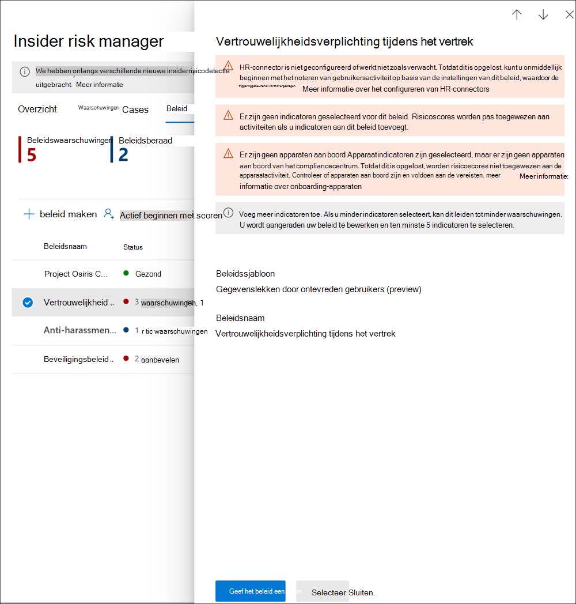

# <a name="insider-risk-management-policies"></a>Beleid voor insiderrisicobeheer

Insider-beleid voor risicobeheer bepaalt welke gebruikers binnen het bereik vallen en welke typen risico-indicatoren zijn geconfigureerd voor waarschuwingen. U kunt snel een beleid maken dat van toepassing is op alle gebruikers in uw organisatie of afzonderlijke gebruikers of groepen definiëren voor beheer in een beleid. Beleid ondersteunt inhoudsprioriteiten om beleidsvoorwaarden te richten op meerdere of specifieke Microsoft Teams, SharePoint sites, gegevensgevoeligheidstypen en gegevenslabels. Met behulp van sjablonen kunt u specifieke risicoindicatoren selecteren en gebeurtenisdrempels aanpassen voor beleidsindicatoren, waarmee u de risicoscores effectief kunt aanpassen, en het niveau en de frequentie van waarschuwingen. Bovendien helpen risicoscore-verhogingen en anomalydetecties om gebruikersactiviteit te identificeren die van hoger belang of ongebruikelijker is. Met beleidsvensters kunt u de periode definiëren om het beleid toe te passen op activiteiten met waarschuwingen en worden deze gebruikt om de duur van het beleid te bepalen wanneer dit is geactiveerd.

Bekijk de [video Configuratievideo insiderrisicobeheerbeleid](https://www.youtube.com/watch?v=kudK5ajZTUo) voor een overzicht van hoe beleidsregels die zijn gemaakt met ingebouwde beleidssjablonen u kunnen helpen om snel actie te ondernemen op mogelijke risico's.

## <a name="policy-dashboard"></a>Beleidsdashboard

Met **het dashboard** Beleid kunt u snel het beleid in uw organisatie zien, de status van het beleid, gebruikers handmatig toevoegen aan beleid en de status bekijken van waarschuwingen die aan elk beleid zijn gekoppeld.

- **Beleidsnaam:** de naam die is toegewezen aan het beleid in de wizard Beleid.
- **Status:** De status van elk beleid. Geeft het aantal beleidswaarschuwingen en -aanbevelingen weer, of een status van *Gezond* voor beleid zonder problemen.  U kunt op het beleid klikken om de statusgegevens voor eventuele waarschuwingen of aanbevelingen weer te geven.
- **Actieve waarschuwingen:** het aantal actieve waarschuwingen voor elk beleid.
- **Bevestigd waarschuwingen:** het totale aantal meldingen dat de afgelopen 365 dagen is ontstaan door het beleid.
- **Acties voor waarschuwingen:** het totale aantal waarschuwingen dat de afgelopen 365 dagen is bevestigd of afgemeld.
- **Effectiviteit van** beleidswaarschuwingen: het percentage dat wordt bepaald door het totale aantal bevestigde waarschuwingen, gedeeld door het totale aantal acties voor waarschuwingen (dat is de som van de waarschuwingen die het afgelopen jaar zijn bevestigd of afgekeurd).


## <a name="policy-recommendations-from-analytics-preview"></a>Beleidsaanbevelingen van analyse (voorbeeld)

Met insider risk analytics kunt u een evaluatie uitvoeren van potentiële insiderrisico's in uw organisatie zonder dat u beleidsregels voor insiderrisico's configureert. Deze evaluatie kan uw organisatie helpen bij het identificeren van mogelijke gebieden met een hoger gebruikersrisico en het bepalen van het type en het bereik van beleidsregels voor insiderrisicobeheer dat u mogelijk wilt configureren.

Zie Instellingen voor insiderrisicobeheer voor meer informatie over insiderrisicoanalyse en beleidsaanbevelingen: [Analytics (preview)](insider-risk-management-settings.md#analytics-preview).

## <a name="policy-templates"></a>Beleidssjablonen

Insider-sjablonen voor risicobeheer zijn vooraf gedefinieerde beleidsvoorwaarden waarmee de typen risico-indicatoren en het risicoscoremodel worden gedefinieerd dat door het beleid wordt gebruikt. Aan elk beleid moet een sjabloon zijn toegewezen in de wizard Voor het maken van beleid voordat het beleid wordt gemaakt. Insider-risicobeheer ondersteunt maximaal vijf beleidsregels voor elke beleidssjabloon. Wanneer u een nieuw insiderrisicobeleid maakt met de beleidswizard, kiest u een van de volgende beleidssjablonen:

### <a name="data-theft-by-departing-users"></a>Gegevensdiefstal door vertrekkende gebruikers

Wanneer gebruikers uw organisatie verlaten, zijn er specifieke risico-indicatoren die meestal worden gekoppeld aan gegevensdiefstal door vertrekkende gebruikers. Deze beleidssjabloon gebruikt exfiltratieindicatoren voor risicoscores en richt zich op detectie en waarschuwingen in dit risicogebied. Gegevensdiefstal voor vertrekkende gebruikers kan bestaan uit het downloaden van bestanden van SharePoint Online, het afdrukken van bestanden en het kopiëren van gegevens naar persoonlijke cloudberichten- en opslagservices in de buurt van hun dienstverband en einddatums. Met behulp van de Microsoft 365 HR-connector of de optie om automatisch te controleren of gebruikersaccounts in Azure Active Directory voor uw organisatie worden verwijderd, wordt met deze sjabloon een score gemaakt voor risico-indicatoren met betrekking tot deze activiteiten en hoe deze correleren met de status van gebruiker.

>[!IMPORTANT]
>Wanneer u deze sjabloon gebruikt, kunt u een Microsoft 365 hr-connector zo configureren dat gebruikers in uw organisatie regelmatig informatie over afzeggings- en beëindigingsdatums importeren. Zie het [artikel Gegevens importeren met het HR-connectorartikel](import-hr-data.md) voor stapsgewijs richtlijnen voor het configureren van de Microsoft 365 HR-connector voor uw organisatie. Als u ervoor kiest om de HR-connector niet te gebruiken, moet u de optie Gebruikersaccount verwijderen uit Azure AD selecteren bij het configureren van triggergebeurtenissen in de beleidswizard.

### <a name="general-data-leaks"></a>Algemene gegevenslekken

Het beschermen van gegevens en het voorkomen van gegevenslekken is een constante uitdaging voor de meeste organisaties, met name met de snelle groei van nieuwe gegevens die worden gemaakt door gebruikers, apparaten en services. Gebruikers zijn gemachtigd om informatie te maken, op te slaan en te delen op verschillende services en apparaten, zodat het beheren van gegevenslekken steeds complexer en moeilijker wordt. Gegevenslekken kunnen onbedoelde oversharing van gegevens buiten uw organisatie of gegevensdiefstal met kwaadwillende bedoelingen omvatten. Met een toegewezen DLP-beleid (Data Loss Prevention) of de ingebouwde triggering-gebeurtenis, begint deze sjabloon realtime detecties te noteren van verdachte SharePoint Online-gegevensdownloads, bestanden en mappen delen, bestanden afdrukken en gegevens kopiëren naar persoonlijke cloudberichten- en opslagservices.

Wanneer u een sjabloon *Gegevenslekken* gebruikt, kunt u een DLP-beleid toewijzen om indicatoren in het insiderrisicobeleid te activeren voor waarschuwingen met hoge ernst in uw organisatie. Wanneer een waarschuwing met hoge ernst wordt gegenereerd door een DLP-beleidsregel wordt toegevoegd aan het auditlogboek van Office 365, wordt de DLP-waarschuwing automatisch gecontroleerd door insiderrisicobeleid dat met deze sjabloon is gemaakt. Als de waarschuwing een in-scopegebruiker bevat die is gedefinieerd in het insiderrisicobeleid, wordt de waarschuwing door het insiderrisicobeleid verwerkt als een nieuwe waarschuwing en een insiderrisico-ernst en risicoscore toegewezen. Met dit beleid kunt u deze waarschuwing evalueren in context met andere activiteiten die in de zaak zijn opgenomen. Als u geen DLP-beleid kiest, moet u de ingebouwde triggering-gebeurtenis selecteren.

#### <a name="data-leaks-policy-guidelines"></a>Beleidsrichtlijnen voor gegevenslekken

Houd rekening met de volgende richtlijnen bij het maken of wijzigen van DLP-beleid voor gebruik met beleidsregels voor insiderrisicobeheer:

- Geef prioriteit aan gegevens exfiltratiegebeurtenissen en wees selectief bij het toewijzen van instellingen voor **incidentrapporten** aan *Hoog* bij het configureren van regels in uw DLP-beleid. Het e-mailen van gevoelige documenten naar  een bekende concurrent moet bijvoorbeeld een exfiltrationgebeurtenis op hoog waarschuwingsniveau zijn. Als u het  hoge niveau  in de instellingen voor incidentenrapporten in andere DLP-beleidsregels overbewijdt, kan het geluid in de waarschuwingswerkstroom voor insiderrisicobeheer toenemen en wordt het moeilijker voor uw gegevensonderzoekers en analisten om deze waarschuwingen correct te evalueren. Als u bijvoorbeeld hoge *waarschuwingsniveaus* toewijst om toegang te krijgen tot activiteiten in DLP-beleid, is het lastiger om echt riskant gedrag en activiteiten van gebruikers te evalueren.
- Zorg ervoor dat u de in-scopegebruikers begrijpt en correct configureert in zowel het DLP- als insiderrisicobeheerbeleid. Alleen gebruikers die zijn gedefinieerd als in-scope voor insider-risicobeheerbeleid met de sjabloon Gegevenslekken, worden met hoge ernst DLP-beleidswaarschuwingen verwerkt.  Bovendien worden alleen gebruikers die zijn gedefinieerd als in-scope in een regel voor een DLP-waarschuwing met hoge ernst, onderzocht door het insiderrisicobeheerbeleid ter overweging. Het is belangrijk dat u niet onbewust gebruikers binnen het bereik configureert in zowel uw DLP- als insiderrisicobeleid op een conflicterende manier.

     Als uw DLP-beleidsregels bijvoorbeeld zijn beperkt tot alleen gebruikers in het verkoopteam en het insiderrisicobeleid dat is gemaakt op basis van de sjabloon Gegevenslekken alle gebruikers heeft gedefinieerd als in-scope, worden met het insiderrisicobeleid alleen DLP-waarschuwingen met hoge ernst verwerkt voor de gebruikers in het verkoopteam.  Het insiderrisicobeleid ontvangt geen DLP-waarschuwingen met hoge prioriteit voor gebruikers die niet zijn gedefinieerd in de DLP-regels in dit voorbeeld. Als uw beleid voor insiderrisicobeheer  dat is gemaakt op basis van gegevenslekkensjablonen, is beperkt tot alleen gebruikers in het verkoopteam en het toegewezen DLP-beleid is beperkt tot alle gebruikers, worden met het insiderrisicobeleid alleen DLP-waarschuwingen met hoge ernst verwerkt voor leden van het verkoopteam. Het insiderrisicobeheerbeleid negeert DLP-waarschuwingen met hoge ernst voor alle gebruikers die niet in het verkoopteam zijn.

- Zorg ervoor dat de **regelinstelling Incidentrapporten** in het DLP-beleid  dat wordt gebruikt voor deze sjabloon voor insiderrisicobeheer is geconfigureerd voor waarschuwingen op hoog ernstniveau. Het *hoge* ernstniveau is de triggeringgebeurtenissen en waarschuwingen voor insiderrisicobeheer worden niet gegenereerd op basis van regels in DLP-beleid met het **veld Incidentrapporten** ingesteld op *Laag* of *Gemiddeld.*

    

     >[!NOTE]
     >Wanneer u een nieuw DLP-beleid maakt met de ingebouwde sjablonen, moet u de optie Geavanceerde **DLP-regels** maken of aanpassen selecteren om de instelling **Incidentrapporten** te configureren voor het niveau hoge ernst. 

Aan elk beleid voor insiderrisicobeheer dat is gemaakt op basis van de sjabloon **Gegevenslekken** kan slechts één DLP-beleid worden toegewezen. Overweeg een speciaal DLP-beleid te maken waarin de verschillende activiteiten worden gecombineerd die u wilt detecteren en fungeren als triggering voor insiderrisicobeleid dat gebruik maakt van de sjabloon **Gegevenslekken.**

Zie het [artikel DLP-beleid maken,](create-test-tune-dlp-policy.md) testen en afstemmen voor stapsgewijs richtlijnen voor het configureren van DLP-beleid voor uw organisatie.

### <a name="data-leaks-by-priority-users-preview"></a>Gegevenslekken door prioriteitsgebruikers (voorbeeld)

Het beveiligen van gegevens en het voorkomen van gegevenslekken voor gebruikers in uw organisatie kan afhankelijk zijn van hun positie, niveau van toegang tot gevoelige informatie of risicogeschiedenis. Gegevenslekken kunnen bestaan uit onbedoelde oversharing van zeer gevoelige informatie buiten uw organisatie of gegevensdiefstal met kwaadaardige bedoelingen. Met een toegewezen DLP-beleid (Data Loss Prevention) worden met deze sjabloon realtime detecties van verdachte activiteiten verzameld en wordt de kans op waarschuwingen en waarschuwingen met een hogere ernst groter. Gebruikers met prioriteit worden gedefinieerd in [gebruikersgroepen met prioriteit](insider-risk-management-settings.md#priority-user-groups-preview) die zijn geconfigureerd in het gebied met instellingen voor insiderrisicobeheer.

Net als bij **de sjabloon Algemene gegevenslekken** moet u een DLP-beleid toewijzen om indicatoren in het insiderrisicobeleid te activeren voor waarschuwingen met hoge ernst in uw organisatie. Volg de beleidsrichtlijnen voor gegevenslekken hierboven bij het maken van een beleid met deze sjabloon. Daarnaast moet u gebruikersgroepen met prioriteit die zijn gemaakt in **Insider-risicobeheer** Instellingen  >    >  **gebruikersgroepen prioriteit** toewijzen aan het beleid.

### <a name="data-leaks-by-disgruntled-users-preview"></a>Gegevenslekken door ontevreden gebruikers (preview)

Wanneer gebruikers werkstressoren ervaren, kunnen ze ontevreden raken, waardoor de kans op activiteit met insiderrisico's kan toenemen. Deze sjabloon begint gebruikersactiviteit te noteren wanneer een indicator wordt geïdentificeerd die is gekoppeld aan ongenoegen. Voorbeelden hiervan zijn prestatieverbeteringsmeldingen, slechte prestatiebeoordelingen of wijzigingen in de status van het taakniveau. Gegevenslekken voor ontevreden gebruikers kunnen bestaan uit het downloaden van bestanden van SharePoint Online en het kopiëren van gegevens naar persoonlijke cloudberichten en opslagservices in de buurt van stress- of gebeurtenissen in de werkomgeving.

Wanneer u deze sjabloon gebruikt, moet u ook een Microsoft 365 HR-connector configureren om regelmatig prestatieverbeteringsmeldingen, slechte status van prestatiebeoordeling of wijzigingsgegevens op taakniveau te importeren voor gebruikers in uw organisatie. Zie het [artikel Gegevens importeren met het HR-connectorartikel](import-hr-data.md) voor stapsgewijs richtlijnen voor het configureren van de Microsoft 365 HR-connector voor uw organisatie.

### <a name="general-security-policy-violations-preview"></a>Schendingen van het algemene beveiligingsbeleid (voorbeeld)

In veel organisaties hebben gebruikers toestemming om software op hun apparaten te installeren of apparaatinstellingen te wijzigen om te helpen bij hun taken. Gebruikers kunnen per ongeluk of met kwaadwillende bedoelingen malware installeren of belangrijke beveiligingsfuncties uitschakelen die informatie op hun apparaat of op uw netwerkbronnen helpen beveiligen. Deze beleidssjabloon maakt gebruik van beveiligingswaarschuwingen van Microsoft Defender voor Eindpunt om deze activiteiten te gaan noteren en focusdetectie en waarschuwingen voor dit risicogebied. Gebruik deze sjabloon om inzicht te geven in schendingen van het beveiligingsbeleid in scenario's waarin gebruikers mogelijk een geschiedenis hebben van schendingen van het beveiligingsbeleid die een indicator kunnen zijn voor insiderrisico's.

U moet Microsoft Defender voor Eindpunt hebben geconfigureerd in uw organisatie en Defender voor Eindpunt inschakelen voor integratie van insiderrisicobeheer in het Defender-beveiligingscentrum om waarschuwingen voor beveiligingsovertredingen te importeren. Zie Geavanceerde functies configureren in Defender voor Eindpunt voor meer informatie over het configureren van Defender voor Eindpunt voor integratie met [insiderrisicobeheer.](/windows/security/threat-protection/microsoft-defender-atp/advanced-features#share-endpoint-alerts-with-microsoft-compliance-center)

### <a name="security-policy-violations-by-departing-users-preview"></a>Schendingen van het beveiligingsbeleid door vertrekkende gebruikers (voorbeeld)

Vertrekkende gebruikers, ongeacht of ze vertrekken onder positieve of negatieve voorwaarden, kunnen hogere risico's voor schendingen van het beveiligingsbeleid zijn. Om u te beschermen tegen onbedoelde of schadelijke beveiligingsovertredingen voor vertrekkende gebruikers, wordt in deze beleidssjabloon Defender voor eindpuntwaarschuwingen gebruikt om inzicht te krijgen in beveiligingsgerelateerde activiteiten. Deze activiteiten omvatten de gebruiker die malware of andere potentieel schadelijke toepassingen installeert en beveiligingsfuncties op hun apparaten uit te zetten. Door de [Microsoft 365 HR-connector te](import-hr-data.md) gebruiken of de optie om automatisch te controleren op verwijdering van gebruikersaccounts in Azure Active Directory voor uw organisatie, begint deze sjabloon te scoren voor risico-indicatoren met betrekking tot deze beveiligingsactiviteiten en hoe deze correleren met de status van gebruiker.

U moet Microsoft Defender voor Eindpunt hebben geconfigureerd in uw organisatie en Defender voor Eindpunt inschakelen voor integratie van insiderrisicobeheer in het Defender-beveiligingscentrum om waarschuwingen voor beveiligingsovertredingen te importeren. Zie Geavanceerde functies configureren in Defender voor Eindpunt voor meer informatie over het configureren van Defender voor Eindpunt voor integratie met [insiderrisicobeheer.](/windows/security/threat-protection/microsoft-defender-atp/advanced-features#share-endpoint-alerts-with-microsoft-compliance-center)

### <a name="security-policy-violations-by-priority-users-preview"></a>Schendingen van beveiligingsbeleid door prioriteitsgebruikers (voorbeeld)

Beveiliging tegen beveiligingsovertredingen voor gebruikers in uw organisatie kan afhankelijk zijn van hun positie, niveau van toegang tot gevoelige informatie of risicogeschiedenis. Omdat beveiligingsovertredingen door prioriteitsgebruikers een aanzienlijke invloed kunnen hebben op de kritieke gebieden van uw organisatie, wordt met deze beleidssjabloon op deze indicatoren gesjabloond en worden waarschuwingen van Microsoft Defender voor eindpunten gebruikt om inzicht te krijgen in beveiligingsgerelateerde activiteiten voor deze gebruikers. Deze activiteiten kunnen bestaan uit de prioriteit die gebruikers hebben bij het installeren van malware of andere potentieel schadelijke toepassingen en het uitschakelen van beveiligingsfuncties op hun apparaten. Gebruikers met prioriteit worden gedefinieerd in gebruikersgroepen met prioriteit die zijn geconfigureerd in het gebied met instellingen voor insiderrisicobeheer.

U moet Microsoft Defender voor Eindpunt hebben geconfigureerd in uw organisatie en Defender voor Eindpunt inschakelen voor integratie van insiderrisicobeheer in het Defender-beveiligingscentrum om waarschuwingen voor beveiligingsovertredingen te importeren. Zie Geavanceerde functies configureren in Defender voor Eindpunt voor meer informatie over het configureren van Defender voor Eindpunt voor integratie met [insiderrisicobeheer.](/windows/security/threat-protection/microsoft-defender-atp/advanced-features#share-endpoint-alerts-with-microsoft-compliance-center) Daarnaast moet u gebruikersgroepen met prioriteit die zijn gemaakt in **Insider-risicobeheer** Instellingen  >    >  **gebruikersgroepen prioriteit** toewijzen aan het beleid.

### <a name="security-policy-violations-by-disgruntled-users-preview"></a>Schendingen van beveiligingsbeleid door ontevreden gebruikers (voorbeeld)

Gebruikers die stressoren voor werk hebben, lopen mogelijk een hoger risico op onbedoelde of schadelijke beveiligingsbeleidsovertredingen. Deze stressoren kunnen bestaan uit de gebruiker die wordt geplaatst op een prestatieverbeteringsplan, een slechte beoordelingsstatus voor prestaties of een degradatie van de huidige positie. Met deze beleidssjabloon wordt de risicoscore gestart op basis van deze indicatoren en activiteiten die aan deze gebeurtenissen voor deze gebruikers zijn gekoppeld.

Wanneer u deze sjabloon gebruikt, moet u ook een Microsoft 365 HR-connector configureren om regelmatig prestatieverbeteringsmeldingen, slechte status van prestatiebeoordeling of wijzigingsgegevens op taakniveau te importeren voor gebruikers in uw organisatie. Zie het [artikel Gegevens importeren met het HR-connectorartikel](import-hr-data.md) voor stapsgewijs richtlijnen voor het configureren van de Microsoft 365 HR-connector voor uw organisatie.

U moet ook Microsoft Defender voor Eindpunt configureren in uw organisatie en Defender voor Eindpunt inschakelen voor integratie van insiderrisicobeheer in het Defender-beveiligingscentrum om waarschuwingen voor beveiligingsovertreding te importeren. Zie Geavanceerde functies configureren in Defender voor Eindpunt voor meer informatie over het configureren van Defender voor Eindpunt voor integratie met [insiderrisicobeheer.](/windows/security/threat-protection/microsoft-defender-atp/advanced-features#share-endpoint-alerts-with-microsoft-compliance-center)

### <a name="policy-template-prerequisites-and-triggering-events"></a>Vereisten voor beleidssjabloon en triggeringgebeurtenissen

Afhankelijk van de sjabloon die u kiest voor een insiderrisicobeheerbeleid, variëren de triggeringgebeurtenissen en beleidsvoorwaardes. Triggering events are prerequisites that determine if a user is active for an insider risk management policy. Als een gebruiker is toegevoegd aan een beleid voor insider-risicobeheer, maar geen triggeringgebeurtenis heeft, wordt de gebruikersactiviteit niet geëvalueerd door het beleid, tenzij deze handmatig worden toegevoegd aan het gebruikersdashboard. Beleidsvoorwaardes zijn vereiste items, zodat het beleid de signalen of activiteiten ontvangt die nodig zijn om risico's te evalueren.

De volgende tabel bevat de triggeringgebeurtenissen en vereisten voor beleidsregels die zijn gemaakt op basis van elke sjabloon voor insiderrisicobeheerbeleid:

| **Beleidssjabloon** | **Gebeurtenissen activeren voor beleid** | **Vereisten** |
| :------------------ | :--------------------------------- | :---------------- |
| Gegevensdiefstal door vertrekkende gebruikers | Indicator voor aftredings- of beëindigingsdatum van HR-connector | (optioneel) Microsoft 365 HR-connector geconfigureerd voor beëindigings- en afzeggingsdatumindicatoren Azure Active Directory integratie ingeschakeld |
| Algemene gegevenslekken | Activiteit voor gegevenslekkenbeleid die een waarschuwing met hoge ernst maakt | (optioneel) DLP-beleid geconfigureerd voor waarschuwingen met hoge ernst of ingebouwde gebeurtenis voor gegevens exfiltration triggering |
| Gegevenslekken door prioriteitsgebruikers | Activiteit voor gegevenslekkenbeleid die een waarschuwing met hoge *ernst* of een ingebouwde exfiltratiegebeurtenis veroorzaakt | (optioneel) DLP-beleid geconfigureerd voor waarschuwingen met hoge ernst <br><br> Gebruikersgroepen met prioriteit die zijn geconfigureerd in instellingen voor insiderrisico's |
| Gegevenslekken door ontevreden gebruikers | Prestatieverbetering, slechte prestaties of wijzigingsindicatoren op het werkniveau van HR-connector | Microsoft 365 HR-connector geconfigureerd voor onwillekeurige indicatoren |
| Schendingen van het algemene beveiligingsbeleid | Defensieve ontwijking van beveiligingsbesturingselementen of ongewenste software gedetecteerd door Microsoft Defender voor Eindpunt | Actief Microsoft Defender voor endpoint-abonnement <br><br> Microsoft Defender voor endpoint-integratie met Microsoft 365 compliancecentrum geconfigureerd |
| Schendingen van het beveiligingsbeleid door vertrekkende gebruikers | Afzeggings- of beëindigingsdatumindicatoren van HR-connector of Azure Active Directory account verwijderen | (optioneel) Microsoft 365 HR-connector geconfigureerd voor indicatoren voor beëindigings- en afzeggingsdatum <br><br> Actief Microsoft Defender voor endpoint-abonnement <br><br> Microsoft Defender voor endpoint-integratie met Microsoft 365 compliancecentrum geconfigureerd |
| Schendingen van beveiligingsbeleid door gebruikers met prioriteit | Defensieve ontwijking van beveiligingsbesturingselementen of ongewenste software gedetecteerd door Microsoft Defender voor Eindpunt | Actief Microsoft Defender voor endpoint-abonnement <br><br> Microsoft Defender voor endpoint-integratie met Microsoft 365 compliancecentrum geconfigureerd <br><br> Gebruikersgroepen met prioriteit die zijn geconfigureerd in instellingen voor insiderrisico's |
| Schendingen van het beveiligingsbeleid door ontevreden gebruikers | Prestatieverbetering, slechte prestaties of wijzigingsindicatoren op het werkniveau van HR-connector | Microsoft 365 HR-connector geconfigureerd voor onwillekeurige indicatoren <br><br> Actief Microsoft Defender voor endpoint-abonnement <br><br> Microsoft Defender voor endpoint-integratie met Microsoft 365 compliancecentrum geconfigureerd |

## <a name="prioritize-content-in-policies"></a>Prioriteit geven aan inhoud in beleid

Insider-beleid voor risicobeheer ondersteunt het opgeven van een hogere prioriteit voor inhoud, afhankelijk van waar deze is opgeslagen of hoe deze wordt geclassificeerd. Als u inhoud als prioriteit opgeeft, wordt de risicoscore voor een gekoppelde activiteit verhoogd, waardoor de kans op het genereren van een waarschuwing met hoge ernst toeneemt. Sommige activiteiten genereren echter helemaal geen waarschuwing, tenzij de gerelateerde inhoud ingebouwde of aangepaste gevoelige informatietypen bevat of is opgegeven als prioriteit in het beleid.

Uw organisatie heeft bijvoorbeeld een speciale SharePoint voor een zeer vertrouwelijk project. Gegevenslekken voor informatie op SharePoint site kunnen het project in gevaar brengen en hebben een aanzienlijke invloed op het succes ervan. Door prioriteit te geven aan SharePoint site in een beleid voor gegevenslekken, worden de risicoscores voor in aanmerking komende activiteiten automatisch verhoogd. Deze prioriteitsprioriteit verhoogt de kans dat deze activiteiten een insiderrisicowaarschuwing genereren en verhoogt het ernstniveau voor de waarschuwing.

Wanneer u een insiderrisicobeheerbeleid maakt in de beleidswizard, kunt u kiezen uit de volgende prioriteiten:

- **SharePoint sites:** alle activiteiten die zijn gekoppeld aan alle bestandstypen in gedefinieerde SharePoint sites, krijgen een hogere risicoscore toegewezen. 
- **Typen gevoelige informatie:** aan elke activiteit die is gekoppeld aan inhoud die [gevoelige informatietypen](sensitive-information-type-entity-definitions.md) bevat, wordt een hogere risicoscore toegewezen.
- **Gevoeligheidslabels:** elke activiteit die [](sensitivity-labels.md) is gekoppeld aan inhoud met specifieke gevoeligheidslabels, krijgt een hogere risicoscore toegewezen.

## <a name="sequence-detection-preview"></a>Reeksdetectie (voorbeeld)

Risicovolle activiteiten kunnen niet optreden als afzonderlijke gebeurtenissen. Deze risico's maken vaak deel uit van een grotere reeks gebeurtenissen. Een reeks is een groep van twee of meer gebruikersactiviteiten die een na de andere worden uitgevoerd, die een verhoogd risico kunnen suggereren. Het identificeren van deze verwante activiteiten is een belangrijk onderdeel van het evalueren van het totale risico. Wanneer sequentiedetectie is ingeschakeld voor gegevensdiefstal of gegevenslekkenbeleid,  worden inzichten uit reeksinformatieactiviteiten weergegeven op het tabblad Activiteit van gebruiker in een insiderrisicobeheercase. De volgende beleidssjablonen ondersteunen de detectie van reeksen:

- Gegevensdiefstal door vertrekkende gebruikers
- Algemene gegevenslekken
- Gegevenslekken door prioriteitsgebruikers
- Gegevenslekken door ontevreden gebruikers

In dit beleid voor insiderrisicobeheer kunnen specifieke indicatoren worden gebruikt en de volgorde waarin deze worden uitgevoerd om elke stap in een reeks risico's te detecteren. Bestandsnamen worden gebruikt bij het toewijzen van activiteiten in een reeks. Deze risico's zijn ingedeeld in vier hoofdcategorieën:

- **Verzameling:** Deze categoriesignalen richten zich op downloadactiviteiten van beleidsgebruikers binnen het bereik. Een voorbeeldactiviteit in deze categorie is het downloaden van bestanden van SharePoint sites.
- **Exfiltration:** Deze categoriesignalen richten zich op het delen of extrareren van activiteiten met interne en externe bronnen door beleidsgebruikers binnen het bereik. Een voorbeeldactiviteit in deze categorie is het verzenden van e-mailberichten met bijlagen van uw organisatie naar externe geadresseerden.
- **Obfuscation:** Deze categoriesignalen richten zich op het maskeren van risicovolle activiteiten door gebruikers van het beleid binnen het bereik. Een voorbeeldactiviteit in deze categorie is het wijzigen van de naam van bestanden op een apparaat.
- **Opruimen: deze** categoriesignalen richten zich op verwijderingsactiviteiten van beleidsgebruikers binnen het bereik. Een voorbeeldactiviteit in deze categorie is het verwijderen van bestanden van een apparaat.

>[!NOTE]
>Volgordedetectie maakt gebruik van indicatoren die zijn ingeschakeld in de globale instellingen voor insiderrisicobeheer en indicatoren die zijn geselecteerd in een beleid. Als de juiste indicatoren niet zijn geselecteerd, werkt de reeksdetectie niet.

U kunt afzonderlijke drempelinstellingen voor elk type reeksdetectie aanpassen wanneer deze zijn geconfigureerd in het beleid. Met deze drempelinstellingen worden waarschuwingen aangepast op basis van het volume van de bestanden die aan de reeks zijn gekoppeld.

Zie Insider risk management cases: User activity (Insider [risk management cases: User activity)](insider-risk-management-cases.md#user-activity)voor meer informatie over het beheer van reeksdetectie in de weergave Gebruikersactiviteit. 

## <a name="cumulative-exfiltration-detection-preview"></a>Cumulatieve exfiltratiedetectie (voorbeeld)

Insiderrisicoindicatoren helpen ongebruikelijke niveaus van risicoactiviteiten te identificeren wanneer ze dagelijks worden geëvalueerd voor gebruikers die binnen het bereik van insiderrisicobeleid vallen. Cumulatieve exfiltratiedetectie maakt gebruik van machine learning-modellen om te bepalen wanneer exfiltratieactiviteiten van gebruikers de organisatiegemiddelden overschrijden wanneer ze worden gemeten in de tijd en over meerdere exfiltrationactiviteitstypen. Insider-risicobeheeranalisten en -onderzoekers kunnen cumulatieve inzichten in exfiltrationdetectie gebruiken om exfiltrationactiviteiten te identificeren die meestal geen waarschuwingen genereren, maar die boven de gebruikelijke gegevens voor hun organisatie staan. Sommige voorbeelden zijn vertrekkende gebruikers die gegevens langzaam over een bereik van dagen exfiltreren, of wanneer gebruikers herhaaldelijk gegevens delen via meerdere kanalen, meer dan gebruikelijk voor het delen van gegevens voor uw organisatie.

Cumulatieve exfiltratiedetectie is standaard ingeschakeld wanneer u de volgende beleidssjablonen gebruikt:

- Gegevensdiefstal door vertrekkende gebruikers
- Algemene gegevenslekken
- Gegevenslekken door prioriteitsgebruikers
- Gegevenslekken door ontevreden gebruikers

>[!NOTE]
>Cumulatieve exfiltrationdetectie maakt gebruik van exfiltrationindicatoren die zijn ingeschakeld in de globale instellingen voor insiderrisicobeheer- en exfiltratieindicatoren die zijn geselecteerd in een beleid. Als zodanig wordt cumulatieve exfiltratiedetectie alleen geëvalueerd voor de geselecteerde benodigde exfiltratieindicatoren.

Wanneer cumulatieve exfiltratiedetectie is ingeschakeld voor gegevensdiefstal of beleidsregels voor gegevenslekken,  worden inzichten uit cumulatieve exfiltratieactiviteiten weergegeven op het tabblad Gebruikersactiviteit in een insiderrisicobeheercase.

Zie Insider risk management cases: User activities (Insider [risk management cases: User activities)](insider-risk-management-cases.md#user-activity)voor meer informatie over het beheer van gebruikersactiviteiten.

## <a name="policy-health-preview"></a>Beleidstoestand (voorbeeld)

De status van de beleidsstatus geeft u inzicht in mogelijke problemen met uw beleid voor insiderrisicobeheer. De kolom Status op het tabblad Beleid kan u waarschuwen voor beleidsproblemen die kunnen voorkomen dat gebruikersactiviteit wordt gerapporteerd of waarom het aantal activiteitswaarschuwingen ongebruikelijk is. De status van de beleidsstatus kan ook bevestigen dat het beleid gezond is en dat er geen aandacht of configuratiewijzigingen nodig zijn.

Als er problemen zijn met een beleid, worden in de status van de beleidsstatus meldingen en aanbevelingen weergegeven om actie te ondernemen om beleidsproblemen op te lossen. Met deze meldingen kunt u de volgende problemen oplossen:

- Beleid met onvolledige configuratie. Deze problemen kunnen bestaan uit ontbrekende gebruikers of groepen in de beleidsstappen of andere onvolledige beleidsconfiguratiestappen.
- Beleid met problemen met de indicatorconfiguratie. Indicatoren zijn een belangrijk onderdeel van elk beleid. Als indicatoren niet zijn geconfigureerd of als er te weinig indicatoren zijn geselecteerd, kan het beleid riskante activiteiten niet evalueren zoals verwacht.
- Beleidstriggers werken niet of beleids triggervereisten zijn niet correct geconfigureerd. Beleidsfunctionaliteit kan afhankelijk zijn van andere services of configuratievereisten om triggeringgebeurtenissen effectief te detecteren om risicoscoretoewijzing te activeren voor gebruikers in het beleid. Deze afhankelijkheden kunnen problemen met de configuratie van connectors, het delen van waarschuwingen in Microsoft Defender voor eindpunten of beleidsconfiguratie-instellingen voor preventie van gegevensverlies omvatten.
- Volumelimieten zijn bijna of boven de limieten. Insider-beleid voor risicobeheer gebruikt Microsoft 365 services en eindpunten om risicoactiviteitssignalen te aggregeren. Afhankelijk van het aantal gebruikers in uw beleid kunnen volumelimieten de identificatie en rapportage van risicoactiviteiten vertragen. Meer informatie over deze limieten in de sectie Beleidssjabloonlimieten van dit artikel.

Als u snel de status van een beleid wilt bekijken, gaat u naar het tabblad Beleid en de kolom Status. Hier ziet u de volgende statusopties voor beleidsstatus voor elk beleid:

- Gezond: er zijn geen problemen geïdentificeerd met het beleid.
- Aanbevelingen: Er zijn enkele problemen met het beleid waardoor het beleid mogelijk niet werkt zoals verwacht.
- Waarschuwingen: Er zijn problemen met het beleid waardoor risicovolle activiteiten niet kunnen worden identificeren.

Voor meer informatie over eventuele aanbevelingen of waarschuwingen  selecteert u een beleid op het tabblad Beleid om de kaart met beleidsdetails te openen. Meer informatie over de aanbevelingen en waarschuwingen, inclusief richtlijnen voor het oplossen van deze problemen, wordt weergegeven in de sectie Meldingen van de detailkaart.



Gebruik de volgende tabel voor meer informatie over aanbevelingen en waarschuwingsmeldingen en acties om mogelijke problemen op te lossen.

|**Meldingsberichten**|**Beleidssjablonen**|**Oorzaken / Probeer deze actie op te lossen**|
|:------------------------|:-------------------|:---------------------------|
| Beleid is niet het toewijzen van risicoscores aan activiteiten | Alle beleidssjablonen | Mogelijk wilt u het beleidsbereik bekijken en de configuratie van gebeurtenissen activeren, zodat het beleid risicoscores kan toewijzen aan activiteiten <br><br> 1. Controleer de gebruikers die zijn geselecteerd voor het beleid. Als er maar weinig gebruikers zijn geselecteerd, wilt u mogelijk extra gebruikers selecteren. <br> 2. Als u een HR-connector gebruikt, controleert u of uw HR-connector de juiste gegevens verstuurt. <br> 3. Als u een DLP-beleid gebruikt als triggeringgebeurtenis, controleert u de configuratie van het DLP-beleid om te controleren of het is geconfigureerd voor gebruik in dit beleid. <br> 4. Controleer voor beveiligingsovertredingsbeleid de triagestatus van Microsoft Defender voor eindpuntwaarschuwing die is geselecteerd in insiderrisico-instellingen > Intelligente detecties. Controleer of het waarschuwingsfilter niet te smal is. |
| Beleid heeft geen waarschuwingen gegenereerd | Alle beleidssjablonen | Mogelijk wilt u de beleidsconfiguratie bekijken, zodat u de activiteit analyseert die u belangrijk vindt. <br><br> 1. Controleer of u indicatoren hebt geselecteerd die u wilt scoren. Hoe meer indicatoren worden geselecteerd, hoe meer activiteiten risicoscores worden toegewezen. <br> 2. Controleer de aanpassing van drempelwaarden voor beleid. Als de geselecteerde drempels niet aansluiten bij de risicotolerantie van uw organisatie, past u de selecties aan zodat waarschuwingen worden gemaakt op basis van de gewenste drempelwaarden. <br> 3. Controleer de gebruikers en groepen die zijn geselecteerd voor het beleid. Bevestig dat u alle van toepassing zijnde gebruikers en groepen hebt geselecteerd. <br> 4. Bevestig voor beveiligingsovertredingsbeleid dat u de status van de waarschuwingstriage hebt geselecteerd die u wilt scoren voor Waarschuwingen van Microsoft Defender voor eindpunten in Intelligente detecties in instellingen.|
| Er zijn geen gebruikers of groepen opgenomen in dit beleid | Alle beleidssjablonen | Gebruikers of groepen zijn niet toegewezen aan het beleid. <br><br> Bewerk uw beleid en selecteer gebruikers of groepen voor het beleid. |
| Er zijn geen indicatoren geselecteerd voor dit beleid | Alle beleidssjablonen | Indicatoren zijn niet geselecteerd voor het beleid <br><br> Bewerk uw beleid en selecteer de juiste beleidsindicatoren voor het beleid. |
| Er zijn geen gebruikersgroepen met prioriteit opgenomen in dit beleid | - Gegevenslekken door gebruikers met prioriteit <br> - Schendingen van het beveiligingsbeleid door gebruikers met prioriteit | Gebruikersgroepen met prioriteit zijn niet toegewezen aan het beleid. <br><br> Configureer gebruikersgroepen met prioriteit in Insider-instellingen voor risicobeheer en wijs gebruikersgroepen met prioriteit toe aan het beleid. |
| Er is geen triggeringgebeurtenis geselecteerd voor dit beleid | Alle beleidssjablonen | Een triggeringgebeurtenis is niet geconfigureerd voor het beleid <br><br> Risicoscores worden pas toegewezen aan gebruikersactiviteiten als u het beleid bewerkt en een triggeringgebeurtenis selecteert. |
| HR-connector is niet geconfigureerd of werkt niet zoals verwacht | - Gegevensdiefstal door vertrekkende gebruiker <br> - Schendingen van beveiligingsbeleid door vertrekkende gebruiker <br> - Gegevenslekken door ontevreden gebruikers <br> - Schendingen van het beveiligingsbeleid door ontevreden gebruikers | Er is een probleem met de HR-connector. <br><br> 1. Als u een HR-connector gebruikt, controleert u of uw HR-connector de juiste gegevens verstuurt <br><br> OF <br><br> 2. Selecteer de gebeurtenis Verwijderde triggering van het Azure AD-account. |
| Er zijn geen apparaten aan boord | - Gegevensdiefstal door vertrekkende gebruikers <br> - Algemene gegevenslekken <br> - Gegevenslekken door ontevreden gebruikers <br> - Gegevenslekken door prioriteitsgebruikers | Apparaatindicatoren zijn geselecteerd, maar er zijn geen apparaten die aan de Microsoft 365 <br><br> Controleer of apparaten aan boord zijn en voldoen aan de vereisten. |
| Hr-connector heeft onlangs geen gegevens geüpload | - Gegevensdiefstal door vertrekkende gebruiker <br> - Schendingen van beveiligingsbeleid door vertrekkende gebruiker <br> - Gegevenslekken door ontevreden gebruikers <br> - Schendingen van het beveiligingsbeleid door ontevreden gebruikers | HR-connector heeft in meer dan 7 dagen geen gegevens geïmporteerd. <br><br> Controleer of uw HR-connector correct is geconfigureerd en gegevens verstuurt. |
| We kunnen de status van uw HR-connector momenteel niet controleren, controleer het later opnieuw. | - Gegevensdiefstal door vertrekkende gebruiker <br> - Schendingen van beveiligingsbeleid door vertrekkende gebruiker <br> - Gegevenslekken door ontevreden gebruikers <br> - Schendingen van het beveiligingsbeleid door ontevreden gebruikers | De insider-oplossing voor risicobeheer kan de status van uw HR-connector niet controleren. <br><br> Controleer of uw HR-connector juist is geconfigureerd en gegevens verstuurt, of kom terug en controleer de beleidsstatus.  |
| DLP-beleid is niet geselecteerd als triggeringgebeurtenis | - Algemene gegevenslekken <br> - Gegevenslekken door gebruikers met prioriteit | Een DLP-beleid is niet geselecteerd als triggeringgebeurtenis of het geselecteerde DLP-beleid is verwijderd. <br><br> Bewerk het beleid en selecteer een actief DLP-beleid of 'Gebruiker voert een exfiltratieactiviteit uit' als triggeringgebeurtenis in de beleidsconfiguratie. |
| DLP-beleid dat in dit beleid wordt gebruikt, is uitgeschakeld | - Algemene gegevenslekken <br> - Gegevenslekken door gebruikers met prioriteit | DLP-beleid dat in dit beleid wordt gebruikt, is uitgeschakeld. <br><br> 1. Schakel het DLP-beleid dat aan dit beleid is toegewezen in. <br><br> OF <br><br> 2. Bewerk dit beleid en selecteer een nieuw DLP-beleid of 'Gebruiker voert een exfiltratieactiviteit uit' als de triggeringgebeurtenis in de beleidsconfiguratie. |
| DLP-beleid voldoet niet aan vereisten | - Algemene gegevenslekken <br> - Gegevenslekken door gebruikers met prioriteit | DLP-beleid dat wordt gebruikt als triggeringgebeurtenissen, moet zodanig zijn geconfigureerd dat waarschuwingen met hoge ernst worden gegenereerd. <br><br>  1. Bewerk uw DLP-beleid om van toepassing zijnde waarschuwingen toe te wijzen als *Hoge ernst.* <br><br> OF <br><br> 2. Bewerk dit beleid en selecteer *Gebruiker voert een exfiltrationactiviteit uit* als de triggeringgebeurtenis. |
| Uw organisatie heeft geen Microsoft Defender for Endpoint-abonnement | - Schendingen van het algemene beveiligingsbeleid <br> - Schendingen van het beveiligingsbeleid door vertrekkende gebruikers <br> - Schendingen van het beveiligingsbeleid door ontevreden gebruikers <br> - Schendingen van het beveiligingsbeleid door gebruikers met prioriteit | Er is geen actief Microsoft Defender voor Eindpunt-abonnement gedetecteerd voor uw organisatie. <br><br> Totdat een Microsoft Defender voor Eindpunt-abonnement is toegevoegd, worden met dit beleid geen risicoscores toegewezen aan gebruikersactiviteiten. |
| Microsoft Defenders for Endpoint-waarschuwingen worden niet gedeeld met het compliancecentrum | - Schendingen van het algemene beveiligingsbeleid <br> - Schendingen van het beveiligingsbeleid door vertrekkende gebruikers <br> - Schendingen van het beveiligingsbeleid door ontevreden gebruikers <br> - Schendingen van het beveiligingsbeleid door gebruikers met prioriteit | Microsoft Defender voor eindpuntwaarschuwingen worden niet gedeeld met het compliancecentrum. <br><br> Het delen van Microsoft Defender voor eindpuntwaarschuwingen configureren. |
| U nadert de maximumlimiet voor gebruikers die actief worden gescored voor deze beleidssjabloon. | Alle beleidssjablonen | Elke beleidssjabloon heeft een maximum aantal gebruikers binnen het bereik. Zie de sectiedetails van de sjabloonlimiet. <br><br> Controleer de gebruikers op het tabblad Gebruikers en verwijder alle gebruikers die niet meer hoeven te worden beoordeeld. |

## <a name="policy-template-limits"></a>Limieten voor beleidssjabloon

In insiderbeleidssjablonen voor risicobeheer worden limieten gebruikt voor het beheren van het volume en de verwerkingssnelheid voor activiteiten in het kader van gebruikersrisico's en de manier waarop dit proces wordt geïntegreerd met ondersteunende Microsoft 365 services. Elke beleidssjabloon heeft een maximum aantal gebruikers dat actief aan risicoscores kan worden toegewezen voor het beleid dat kan worden ondersteund en effectief risicoactiviteiten kan verwerken en rapporteren. Gebruikers binnen het bereik zijn gebruikers met triggeringgebeurtenissen voor het beleid.

De limiet voor elk beleid wordt berekend op basis van het totale aantal unieke gebruikers dat risicoscores per type beleidssjabloon ontvangt. Als het aantal gebruikers voor een type beleidssjabloon bijna of hoger is dan de gebruikerslimiet, worden de beleidsprestaties verlaagd. Als u het huidige aantal gebruikers voor een beleid wilt weergeven, gaat u naar het tabblad Beleid en de kolom Gebruikers in het bereik. Mogelijk hebt u maximaal vijf beleidsregels voor een beleidssjabloon. Deze maximumlimieten zijn van toepassing op gebruikers in alle beleidsregels die een bepaalde beleidssjabloon gebruiken.

Gebruik de volgende tabel om het maximum aantal in-scopegebruikers te bepalen dat voor elke beleidssjabloon wordt ondersteund:

|**Beleidssjabloon**|**Huidige maximale gebruikersbereik**|
|:------------------|:--------------------------------|
| Algemene gegevenslekken | 15,000 |
| Gegevenslek door ontevreden gebruikers | 7,500 |
| Gegevenslek door prioriteitsgebruikers | 1,000 |
| Gegevensdiefstal door vertrekkende gebruikers | 20,000 |
| Schendingen van het algemene beveiligingsbeleid | 1,000 |
| Schending van beveiligingsbeleid door gebruikers met prioriteit | 1,000 |
| Schendingen van het beveiligingsbeleid door vertrekkende gebruikers | 15,000 |
| Schendingen van beveiligingsbeleid door ontevreden gebruikers | 7,500 |

## <a name="create-a-new-policy"></a>Een nieuw beleid maken

Als u een nieuw beleid voor insiderrisicobeheer wilt maken, gebruikt u de beleidswizard in de oplossing voor **insiderrisicobeheer** in het Microsoft 365 compliancecentrum.

Volg de volgende stappen om een nieuw beleid te maken:

1. Ga in [Microsoft 365 compliancecentrum](https://compliance.microsoft.com)naar **Insider-risicobeheer** en selecteer het **tabblad** Beleid.
2. Selecteer **Beleid maken om** de beleidswizard te openen.
3. Kies op **de pagina** Beleidssjabloon een beleidscategorie en selecteer vervolgens de sjabloon voor het nieuwe beleid. Deze sjablonen zijn gemaakt van voorwaarden en indicatoren die de risicoactiviteiten definiëren die u wilt detecteren en onderzoeken. Controleer de vereisten voor de sjabloon, triggeringsgebeurtenissen en gedetecteerde activiteiten om te bevestigen dat deze beleidssjabloon aan uw behoeften voldoet.

    >[!IMPORTANT]
    >Sommige beleidssjablonen hebben vereisten die moeten worden geconfigureerd voor het beleid om relevante waarschuwingen te genereren. Zie Stap **4 hierboven** als u de toepasselijke beleidsvoorwaarde niet hebt geconfigureerd.

4. Selecteer **Volgende om** door te gaan.
5. Vul op **de pagina Naam** en beschrijving de volgende velden in:
    - **Naam (vereist)**: Voer een vriendelijke naam in voor het beleid. Deze naam kan niet worden gewijzigd nadat het beleid is gemaakt.
    - **Beschrijving (optioneel)**: Voer een beschrijving in voor het beleid.

6. Selecteer **Volgende om** door te gaan.
7. Selecteer op de pagina  Gebruikers en groepen  de optie Alle gebruikers en groepen opnemen of Specifieke gebruikers en groepen opnemen om te definiëren welke gebruikers of groepen zijn opgenomen in het beleid of als u een sjabloon met prioriteitsgebruikers hebt gekozen.  selecteer **Gebruikersgroepen met prioriteit toevoegen of bewerken.** Als **u Alle gebruikers en groepen opnemen** selecteert, wordt er naar triggeringgebeurtenissen voor alle gebruikers en groepen in uw organisatie op zoek om risicoscores voor het beleid toe te wijzen. Als **u Specifieke gebruikers en groepen opnemen selecteert,** kunt u definiëren welke gebruikers en groepen u wilt toewijzen aan het beleid.
8. Selecteer **Volgende om** door te gaan.
9. Op de **pagina** Inhoud om prioriteit te geven, kunt u (indien nodig) de bronnen toewijzen aan prioriteit, waardoor de kans op het genereren van een waarschuwing met hoge ernst voor deze bronnen groter wordt. Selecteer een van de volgende opties:

    - **Ik wil de SharePoint, gevoeligheidslabels en/of gevoelige informatietypen opgeven als prioriteitsinhoud.** Als u deze optie selecteert, kunnen detailpagina's in de wizard deze kanalen configureren.
    - **Ik wil nu geen prioriteitsinhoud** opgeven (u kunt dit doen nadat het beleid is gemaakt) . Als u deze optie selecteert, worden de pagina's met kanaaldetails in de wizard overgeslagen.

10. Selecteer **Volgende om** door te gaan.

11. Als u in de vorige stap ik SharePoint sites, gevoeligheidslabels **en/of** gevoelige informatietypen als prioriteitsinhoud hebt geselecteerd, ziet u de detailpagina's voor *SharePoint-sites,* gevoelige *infotypen* en gevoeligheidslabels.  Gebruik deze detailpagina's om de SharePoint, gevoelige infotypen en gevoeligheidslabels te definiëren om prioriteit te geven aan het beleid.

    - **SharePoint sites:** Selecteer **Toevoegen SharePoint site** en selecteer de SharePoint sites die u hebt en die u prioriteit wilt geven. Bijvoorbeeld *'group1@contoso.sharepoint.com/sites/group1'*.
    - **Type gevoelige informatie:** Selecteer **Gevoelige informatietype toevoegen** en selecteer de gevoeligheidstypen die u wilt prioriteren. Bijvoorbeeld *'Amerikaans bankrekeningnummer'* en *'Creditcardnummer'.*
    - **Gevoeligheidslabels:** Selecteer **Gevoeligheidslabel toevoegen** en selecteer de etiketten die u wilt prioriteren. Bijvoorbeeld *'Vertrouwelijk'* en *'Geheim'.*

12. Selecteer **Volgende om** door te gaan.
13. Op de **pagina Indicatoren en triggeringgebeurtenissen** ziet u de indicatoren die u hebt gedefinieerd als beschikbaar op de pagina Indicatoren voor [](insider-risk-management-settings.md#indicators)   >   insiderrisico-instellingen. Als u aan het begin van de wizard een sjabloon Gegevenslekken hebt geselecteerd, moet u een DLP-beleid selecteren in de vervolgkeuzelijst **DLP-beleid** om *triggeringindicatoren* voor het beleid in te stellen of de ingebouwde triggeringgebeurtenis te selecteren.

    >[!IMPORTANT]
    >Als indicatoren op deze pagina niet kunnen worden geselecteerd, moet u de indicatoren selecteren die u wilt inschakelen voor alle beleidsregels. U kunt de knop **Indicatoren in de** wizard in-/uit- of indicatoren selecteren op de pagina **Insider-risicobeheer**  >  **Instellingen**  >  **beleidsindicatoren.**

    Selecteer de indicatoren die u wilt toepassen op het beleid. Als u liever geen gebruik wilt maken van de standaardinstellingen voor drempelwaarden voor deze indicatoren, schakelt u de door Microsoft aanbevolen **standaarddrempels** gebruiken uit en voert u de drempelwaarden voor elke geselecteerde indicator in.

    - Als u ten minste  één Office of *apparaatindicator* hebt geselecteerd, selecteert u de **risicoscore-verhogingen.** Risicoscore-verhogingen zijn alleen van toepassing op geselecteerde indicatoren.
    - Als u een beleidssjabloon *Gegevensdiefstal* of Gegevenslekken hebt geselecteerd, selecteert u een of meer detectiemethoden voor reeksen en een methode voor cumulatieve **exfiltratie** die u wilt toepassen op het beleid.  

14. Selecteer **Volgende om** door te gaan.
15. Selecteer op **de pagina Indicatordrempels** de optie voor het gebruik van standaardindicatordrempels of om aangepaste drempelwaarden voor afzonderlijke indicatoren op te geven. Kies voor elke indicator het juiste niveau om het gewenste niveau van activiteitswaarschuwingen te genereren.
16. Selecteer **Volgende om** door te gaan.
17. Bekijk op **de** pagina Controleren de instellingen die u hebt gekozen voor het beleid en eventuele suggesties of waarschuwingen voor uw selecties. Selecteer **Bewerken om** een van de beleidswaarden te wijzigen of selecteer **Verzenden** om het beleid te maken en te activeren.

## <a name="update-a-policy"></a>Een beleid bijwerken

Als u een bestaand beleid voor insiderrisicobeheer wilt bijwerken, gebruikt u de beleidswizard in de oplossing voor **insiderrisicobeheer** in het Microsoft 365 compliancecentrum.

Volg de volgende stappen om een bestaand beleid te beheren:

1. Ga in [Microsoft 365 compliancecentrum](https://compliance.microsoft.com)naar **Insider-risicobeheer** en selecteer het **tabblad** Beleid.
2. Selecteer in het beleidsdashboard het beleid dat u wilt beheren.
3. Selecteer beleid bewerken op de pagina **beleidsdetails**
4. In de wizard Beleid kunt u het volgende niet bewerken:
    - **Beleidssjabloon:** de sjabloon die wordt gebruikt om de typen risico-indicatoren te definiëren die door het beleid worden gecontroleerd.
    - **Naam**: De vriendelijke naam voor het beleid
5. Werk op **de pagina Naam** en beschrijving de beschrijving voor het beleid bij in het **veld** Beschrijving.
6. Selecteer **Volgende om** door te gaan.
7. Selecteer op de pagina  Gebruikers en groepen  de optie Alle gebruikers en groepen opnemen of Specifieke gebruikers en groepen opnemen om te definiëren welke gebruikers of groepen zijn opgenomen in het beleid of als u een sjabloon met prioriteitsgebruikers hebt gekozen.  selecteer **Gebruikersgroepen met prioriteit toevoegen of bewerken.** Als **u Alle gebruikers en groepen opnemen** selecteert, wordt er naar triggeringgebeurtenissen voor alle gebruikers en groepen in uw organisatie op zoek om risicoscores voor het beleid toe te wijzen. Als **u Specifieke gebruikers en groepen opnemen selecteert,** kunt u definiëren welke gebruikers en groepen u wilt toewijzen aan het beleid.
8. Selecteer **Volgende om** door te gaan.
9. Op de **pagina** Inhoud om prioriteit te geven, kunt u (indien nodig) de bronnen toewijzen aan prioriteit, waardoor de kans op het genereren van een waarschuwing met hoge ernst voor deze bronnen groter wordt. Selecteer een van de volgende opties:

    - **Ik wil de SharePoint, gevoeligheidslabels en/of gevoelige informatietypen opgeven als prioriteitsinhoud.** Als u deze optie selecteert, kunnen detailpagina's in de wizard deze kanalen configureren.
    - **Ik wil nu geen prioriteitsinhoud** opgeven (u kunt dit doen nadat het beleid is gemaakt) . Als u deze optie selecteert, worden de pagina's met kanaaldetails in de wizard overgeslagen.

10. Selecteer **Volgende om** door te gaan.

11. Als u in de vorige stap ik SharePoint sites, gevoeligheidslabels **en/of** gevoelige informatietypen als prioriteitsinhoud hebt geselecteerd, ziet u de detailpagina's voor *SharePoint-sites,* gevoelige *infotypen* en gevoeligheidslabels.  Gebruik deze detailpagina's om de SharePoint, gevoelige infotypen en gevoeligheidslabels te definiëren om prioriteit te geven aan het beleid.

    - **SharePoint sites:** Selecteer **Toevoegen SharePoint site** en selecteer de SharePoint sites die u hebt en die u prioriteit wilt geven. Bijvoorbeeld *'group1@contoso.sharepoint.com/sites/group1'*.
    - **Type gevoelige informatie:** Selecteer **Gevoelige informatietype toevoegen** en selecteer de gevoeligheidstypen die u wilt prioriteren. Bijvoorbeeld *'Amerikaans bankrekeningnummer'* en *'Creditcardnummer'.*
    - **Gevoeligheidslabels:** Selecteer **Gevoeligheidslabel toevoegen** en selecteer de etiketten die u wilt prioriteren. Bijvoorbeeld *'Vertrouwelijk'* en *'Geheim'.*

12. Selecteer **Volgende om** door te gaan.
13. Op de **pagina Indicatoren en triggeringgebeurtenissen** ziet u de indicatoren die u hebt gedefinieerd als beschikbaar op de pagina Indicatoren voor [](insider-risk-management-settings.md#indicators)   >   insiderrisico-instellingen. Als u aan het begin van de wizard een sjabloon Gegevenslekken hebt geselecteerd, moet u een DLP-beleid selecteren in de vervolgkeuzelijst **DLP-beleid** om *triggeringindicatoren* voor het beleid in te stellen of de ingebouwde triggeringgebeurtenis te selecteren.

    >[!IMPORTANT]
    >Als indicatoren op deze pagina niet kunnen worden geselecteerd, moet u de indicatoren selecteren die u wilt inschakelen voor alle beleidsregels. U kunt de knop **Indicatoren in de** wizard in-/uit- of indicatoren selecteren op de pagina **Insider-risicobeheer**  >  **Instellingen**  >  **beleidsindicatoren.**

    Selecteer de indicatoren die u wilt toepassen op het beleid. Als u liever geen gebruik wilt maken van de standaardinstellingen voor drempelwaarden voor deze indicatoren, schakelt u de door Microsoft aanbevolen **standaarddrempels** gebruiken uit en voert u de drempelwaarden voor elke geselecteerde indicator in.

    - Als u ten minste  één Office of *apparaatindicator* hebt geselecteerd, selecteert u de **risicoscore-verhogingen.** Risicoscore-verhogingen zijn alleen van toepassing op geselecteerde indicatoren.
    - Als u een beleidssjabloon *Gegevensdiefstal* of Gegevenslekken hebt geselecteerd, selecteert u een of meer detectiemethoden voor reeksen en een methode voor cumulatieve **exfiltratie** die u wilt toepassen op het beleid.  

14. Selecteer **Volgende om** door te gaan.
15. Selecteer op **de pagina Indicatordrempels** de optie voor het gebruik van standaardindicatordrempels of om aangepaste drempelwaarden voor afzonderlijke indicatoren op te geven. Kies voor elke indicator het juiste niveau om het gewenste niveau van activiteitswaarschuwingen te genereren.
16. Selecteer **Volgende om** door te gaan.
17. Bekijk op **de** pagina Controleren de instellingen die u hebt gekozen voor het beleid en eventuele suggesties of waarschuwingen voor uw selecties. Selecteer **Bewerken om** een van de beleidswaarden te wijzigen of selecteer **Verzenden** om het beleid te maken en te activeren.

## <a name="copy-a-policy"></a>Een beleid kopiëren

Mogelijk moet u een nieuw beleid maken dat lijkt op een bestaand beleid, maar slechts enkele configuratiewijzigingen nodig heeft. In plaats van een nieuw beleid te maken, kunt u een bestaand beleid kopiëren en vervolgens de gebieden wijzigen die moeten worden bijgewerkt in het nieuwe beleid.

Volg de volgende stappen om een bestaand beleid te kopiëren:

1. Ga in Microsoft 365 compliancecentrum naar Insider-risicobeheer en selecteer het tabblad Beleid.
2. Selecteer in het beleidsdashboard het beleid dat u wilt kopiëren.
3. Selecteer kopiëren op de pagina beleidsdetails.
4. In de beleidswizard kunt u het nieuwe beleid een naam geven en de beleidsconfiguratie zo nodig bijwerken.

## <a name="immediately-start-scoring-user-activity"></a>Onmiddellijk beginnen met het noteren van gebruikersactiviteit

Er kunnen scenario's zijn waarin u onmiddellijk risicoscores moet toewijzen aan gebruikers met insiderrisicobeleid buiten het insiderrisicobeheer dat de gebeurteniswerkstroom activeert. Gebruik  Scoreactiviteit starten voor  gebruikers op het tabblad Beleid om een gebruiker (of gebruikers) handmatig toe te voegen aan een of meer insiderrisicobeleidsregels voor een bepaalde periode, om onmiddellijk te beginnen met het toewijzen van risicoscores aan hun activiteit en om de vereiste te omzeilen dat een gebruiker een triggering indicator heeft (zoals een DLP-beleidsmatch). U kunt ook een reden toevoegen voor het toevoegen van de gebruiker aan het beleid, dat wordt weergegeven op de tijdlijn met activiteiten van de gebruikers. Gebruikers die handmatig zijn toegevoegd aan beleid, worden weergegeven in het **dashboard** Gebruikers en waarschuwingen worden gemaakt als activiteit voldoet aan de drempelwaarden voor beleidswaarschuwingen.

Enkele scenario's waarin u mogelijk onmiddellijk gebruikersactiviteiten wilt gaan noteren:

- Wanneer gebruikers worden geïdentificeerd met risico's en u direct wilt beginnen met het toewijzen van risicoscores aan hun activiteit voor een of meer van uw beleidsregels
- Wanneer er een incident is waarbij u mogelijk onmiddellijk risicoscores moet toewijzen aan de activiteiten van betrokken gebruikers voor een of meer van uw beleidsregels
- Wanneer u de HR-connector nog niet hebt geconfigureerd, maar u wel risicoscores wilt toewijzen aan gebruikersactiviteiten voor HR-gebeurtenissen door een .csv-bestand voor de gebruikers te uploaden

>[!NOTE]
>Het kan enkele uren duren voordat nieuwe gebruikers die handmatig zijn toegevoegd, worden weergegeven in het dashboard **Gebruikers.** Het kan maximaal 24 uur duren voordat activiteiten voor deze gebruikers worden weergegeven. Als u activiteiten wilt weergeven voor  handmatig toegevoegde gebruikers, gaat u naar  het tabblad Gebruikers en selecteert u de gebruiker op het **dashboard** Gebruikers en opent u het tabblad Gebruikersactiviteit in het detailvenster.

Als u handmatig wilt beginnen met het noteren van activiteiten voor gebruikers in een of meer beleidsregels voor insiderrisicobeheer, gaat u als volgt te werk:

1. Ga in [Microsoft 365 compliancecentrum](https://compliance.microsoft.com)naar **Insider-risicobeheer** en selecteer het **tabblad** Beleid.
2. Selecteer in het beleidsdashboard het beleid of beleid dat u wilt toevoegen aan gebruikers.
3. Selecteer **Scoreactiviteit starten voor gebruikers.**
4. Voeg in **het veld Reden** in het deelvenster Gebruikers toevoegen **aan** meerdere beleidsregels een reden toe voor het toevoegen van de gebruikers.
5. Definieert in het veld Dit moet duren (kiezen tussen 5 en **30 dagen)** het aantal dagen om de activiteit van de gebruiker te bepalen voor het beleid dat wordt toegevoegd aan
6. Als u wilt zoeken in uw Active Directory voor gebruikers, gebruikt u de gebruiker **Zoeken om toe te voegen aan het veld Beleid.** Typ de naam van de gebruiker die u wilt toevoegen aan het beleid. Selecteer de gebruikersnaam en herhaal dit om extra gebruikers toe te wijzen aan het beleid. De lijst met gebruikers die u hebt geselecteerd, wordt weergegeven in de sectie Gebruikers van het deelvenster Gebruikers toevoegen aan meerdere beleidsregels.
7. Als u een lijst met gebruikers wilt importeren die u wilt toevoegen aan het beleid, **selecteert** u Importeren om een bestand .csv (door komma's gescheiden waarden) te importeren. Het bestand moet de volgende indeling hebben en u moet de hoofdnamen van de gebruiker in het bestand opnoemen:

    ```csv
    user principal name
    user1@domain.com
    user2@domain.com
    ```

8. Selecteer gebruikers toevoegen aan beleidsregels om de wijzigingen te accepteren en gebruikers toe te voegen aan het beleid of selecteer Annuleren om de wijzigingen te negeren en het dialoogvenster te sluiten.

## <a name="stop-scoring-users-in-a-policy"></a>Gebruikers niet meer in een beleid noteren

Als u wilt stoppen met het noteren van gebruikers in een beleid, bekijkt u de Insider-gebruikers voor risicobeheer: Gebruikers verwijderen uit [een in-scopetoewijzing naar beleidsartikel.](insider-risk-management-users.md#remove-users-from-in-scope-assignment-to-policies)

## <a name="delete-a-policy"></a>Een beleid verwijderen

>[!NOTE]
>Als u een beleid verwijdert, worden actieve of gearchiveerde waarschuwingen die zijn gegenereerd uit het beleid niet verwijderd.

Als u een bestaand beleid voor insiderrisicobeheer wilt verwijderen, gaat u als volgt te werk:

1. Ga in [Microsoft 365 compliancecentrum](https://compliance.microsoft.com)naar **Insider-risicobeheer** en selecteer het **tabblad** Beleid.
2. Selecteer in het beleidsdashboard het beleid dat u wilt verwijderen.
3. Selecteer **Verwijderen** op de werkbalk van het dashboard.
4. Selecteer in **het** dialoogvenster Verwijderen **Ja om** het beleid te verwijderen of selecteer **Annuleren om** het dialoogvenster te sluiten.
