# Aan de slag met instellingen voor insider-risicobeheer

Insider-instellingen voor risicobeheer zijn van toepassing op alle beleidsregels voor insiderrisicobeheer, ongeacht de sjabloon die u kiest bij het maken van een beleid. Instellingen zijn geconfigureerd met behulp  van het insiderrisico-instellingenbesturingselement boven aan alle tabbladen voor insiderrisicobeheer. Met deze instellingen worden beleidsonderdelen voor de volgende gebieden besturingselementen:

- Privacy
- Indicatoren
- Beleidstijdlijnslijn
- Intelligente detecties
- Waarschuwingen exporteren (voorbeeld)
- Gebruikersgroepen met prioriteit (voorbeeld)
- Fysieke activa met prioriteit (voorbeeld)
- Power Automate stromen (voorbeeld)
- Microsoft Teams (voorbeeld)
- Analyse (voorbeeld)

Voordat u aan de slag gaat en beleidsregels voor insiderrisicobeheer maakt, is het belangrijk om deze instellingen te begrijpen en de instellingsniveaus te kiezen die het beste voldoen aan de compliancevereisten voor uw organisatie.

## Privacy

Het beschermen van de privacy van gebruikers die overeenkomsten hebben met het beleid is belangrijk en kan objectiviteit bevorderen in gegevensonderzoeks- en analysebeoordelingen voor waarschuwingen voor insiderrisico's. Voor gebruikers met een insiderrisicobeleid kunt u een van de volgende instellingen kiezen:

- **Anonieme versies van** gebruikersnamen weergeven: namen van gebruikers worden geanonimiseerd om te voorkomen dat beheerders, gegevensonderzoekers en revisoren kunnen zien wie is gekoppeld aan beleidswaarschuwingen. Een gebruiker 'Grace Taylor' wordt bijvoorbeeld weergegeven met een gerandomiseerd pseudoniem zoals 'AnonIS8-988' op alle gebieden van de ervaring met insiderrisicobeheer. Als u deze instelling kiest, worden alle gebruikers met huidige en eerdere beleidsregels geanonimiseerd en geldt dit voor alle beleidsregels. Gebruikersprofielgegevens in de insiderrisicowaarschuwing en casedetails zijn niet beschikbaar wanneer deze optie wordt gekozen. Gebruikersnamen worden echter weergegeven bij het toevoegen van nieuwe gebruikers aan bestaand beleid of bij het toewijzen van gebruikers aan nieuw beleid. Als u ervoor kiest om deze instelling uit te schakelen, worden gebruikersnamen weergegeven voor alle gebruikers met huidige of eerdere beleids matches.
- **Geen anonieme versies van gebruikersnamen** weergeven: gebruikersnamen worden weergegeven voor alle huidige en eerdere beleidswedstrijden voor waarschuwingen en gevallen. Gebruikersprofielgegevens (de naam, titel, alias en organisatie of afdeling) worden weergegeven voor de gebruiker voor alle waarschuwingen en gevallen voor insiderrisicobeheer.

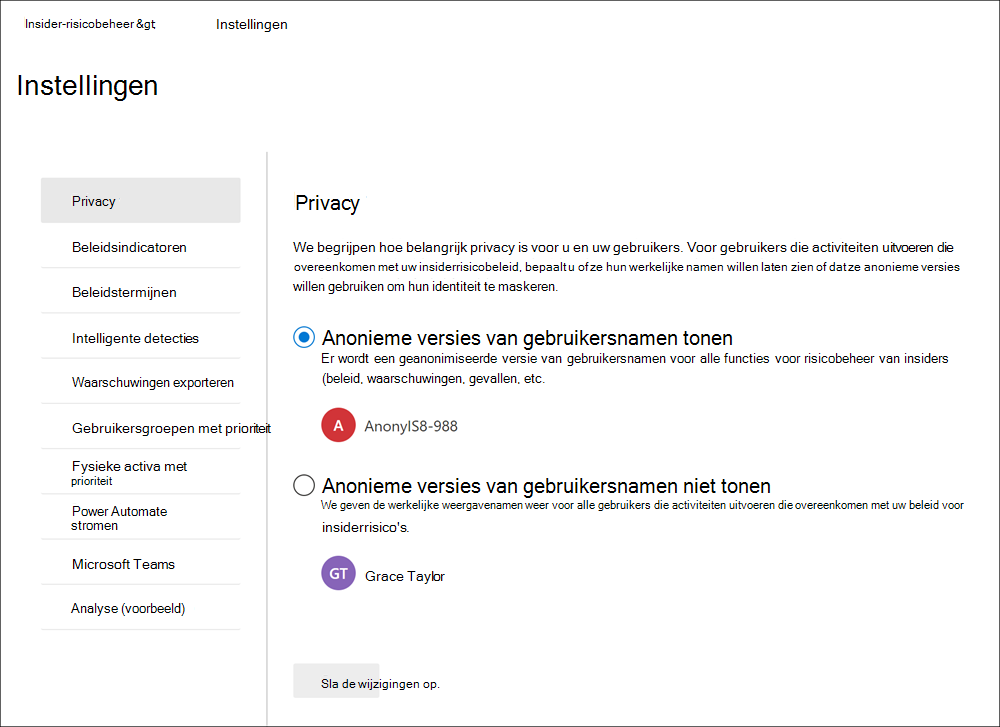

## Indicatoren

Sjablonen voor insiderrisicobeleid definiëren het type risicoactiviteiten dat u wilt detecteren en onderzoeken. Elke beleidssjabloon is gebaseerd op specifieke indicatoren die overeenkomen met specifieke triggers en risicoactiviteiten. Alle indicatoren zijn standaard uitgeschakeld en u moet een of meer beleidsindicatoren selecteren voordat u een beleid voor insiderrisicobeheer configureert.

Waarschuwingen worden geactiveerd door beleid wanneer gebruikers activiteiten uitvoeren die betrekking hebben op beleidsindicatoren die voldoen aan een vereiste drempelwaarde. Insider-risicobeheer gebruikt twee soorten indicatoren:

- **Gebeurtenissen activeren:** gebeurtenissen die bepalen of een gebruiker actief is in een beleid voor insiderrisicobeheer. Als een gebruiker wordt toegevoegd aan een insiderrisicobeheerbeleid geen triggeringgebeurtenis heeft, wordt de gebruikersactiviteit niet geëvalueerd door het beleid. Gebruiker A wordt bijvoorbeeld toegevoegd aan een  beleid dat is gemaakt op basis van de gegevensdiefstal door de beleidssjabloon van vertrekkende gebruikers en het beleid en Microsoft 365 HR-connector correct zijn geconfigureerd. Totdat gebruiker A een beëindigingsdatum heeft gerapporteerd door de HR-connector, worden gebruikersactiviteiten niet geëvalueerd door dit insiderrisicobeheerbeleid voor risico's. Een ander voorbeeld van een triggeringgebeurtenis  is als een gebruiker een DLP-beleidswaarschuwing met hoge ernst heeft bij het gebruik van beleidsregels voor *gegevenslekken.*
- **Beleidsindicatoren:** Indicatoren die zijn opgenomen in beleidsregels voor insiderrisicobeheer die worden gebruikt om een risicoscore voor een in-scopegebruiker te bepalen. Deze beleidsindicatoren worden alleen geactiveerd nadat een triggeringgebeurtenis voor een gebruiker plaatsvindt. Enkele voorbeelden van beleidsindicatoren zijn wanneer een gebruiker gegevens kopieert naar persoonlijke cloudopslagservices of draagbare opslagapparaten, als een gebruikersaccount wordt verwijderd uit Azure Active Directory of als een gebruiker interne bestanden en mappen deelt met niet-geautoriseerde externe partijen.

Beleidsindicatoren worden gesegmenteerd in de volgende gebieden. U kunt de indicatoren kiezen om de limieten voor indicatorgebeurtenissen voor elk indicatorniveau te activeren en aan te passen bij het maken van een insiderrisicobeleid:

- **Office indicatoren:** dit zijn beleidsindicatoren voor SharePoint sites, Microsoft Teams en e-mailberichten.
- **Apparaatindicatoren:** dit zijn beleidsindicatoren voor activiteiten, zoals het delen van bestanden via het netwerk of met apparaten. Indicatoren zijn activiteiten met betrekking tot alle bestandstypen, met uitzondering van uitvoerbare (.exe) en dynamische koppelingsbibliotheek (.dll) bestandsactiviteit. Als u **Apparaatindicatoren** selecteert, wordt activiteit alleen verwerkt voor apparaten met Windows 10 build 1809 of hoger en moet u eerst apparaten aan boord van het compliancecentrum. Zie de volgende sectie Apparaatindicatoren en [onboard-apparaten](insider-risk-management-settings.md#OnboardDevices) inschakelen in dit artikel voor meer informatie over het configureren van apparaten voor integratie met insiderrisico's.
- Indicator voor beveiligingsbeleidsovertreding **(voorbeeld)**: Dit zijn indicatoren van Microsoft Defender voor Eindpunt die betrekking hebben op niet-goedgekeurde of schadelijke softwareinstallatie of het omzeilen van beveiligingsbesturingselementen. Als u waarschuwingen wilt ontvangen in insider risk management, moet u een actieve Defender for Endpoint-licentie en integratie van insiderrisico's hebben ingeschakeld. Zie Geavanceerde functies configureren in Microsoft Defender voor Eindpunt voor meer informatie over het configureren van Defender voor Eindpunt voor integratie met [insiderrisicobeheer.](/windows/security/threat-protection/microsoft-defender-atp/advanced-features\#share-endpoint-alerts-with-microsoft-compliance-center)
- **Indicatoren voor fysieke toegang (voorbeeld)**: Dit zijn beleidsindicatoren voor fysieke toegang tot gevoelige activa. Poging tot toegang tot een beperkt gebied in uw fysieke systeemlogboeken kan bijvoorbeeld worden gedeeld met beleidsregels voor insiderrisicobeheer. Als u dit type waarschuwingen wilt ontvangen in insider risk management, moet u fysieke activa met prioriteit hebben ingeschakeld in insider risk management en de [physical badging data connector](import-physical-badging-data.md) geconfigureerd. Zie de sectie Fysieke toegang prioriteit [in](#priority-physical-assets-preview) dit artikel voor meer informatie over het configureren van fysieke toegang.
- **Microsoft Cloud App Security indicatoren (voorbeeld)**: Dit zijn beleidsindicatoren van gedeelde waarschuwingen van Cloud App Security. Automatisch ingeschakelde afwijkingsdetectie in Cloud App Security wordt onmiddellijk gestart met het detecteren en verzamelen van resultaten, met als doel een groot aantal gedragsproblemen tussen uw gebruikers en de machines en apparaten die met uw netwerk zijn verbonden. Als u deze activiteiten wilt opnemen in waarschuwingen voor insiderrisicobeheer, selecteert u een of meer indicatoren in deze sectie. Zie Gedragsanalyse en [anomalydetectie](/cloud-app-security/anomaly-detection-policy)voor meer informatie over Cloud App Security analyse en afwijkingsdetectie.
- **Risicoscoreverhogers:** Dit zijn onder andere het verhogen van de risicoscore voor ongebruikelijke activiteiten of beleidsovertredingen in het verleden. Het inschakelen van risicoscores verhoogt de risicoscores en de kans op waarschuwingen voor dit type activiteiten. Voor ongebruikelijke activiteiten worden scores gestekt als de gedetecteerde activiteit afwijkt van het normale gedrag van de gebruiker. Bijvoorbeeld een aanzienlijke toename van het aantal dagelijkse bestandsdownloads. Ongebruikelijke activiteit wordt weergegeven als een toename van percentage (bijvoorbeeld '100% boven gebruikelijke activiteit') en heeft een andere invloed op de risicoscore, afhankelijk van de activiteit. Voor gebruikers met eerdere beleidsovertredingen worden de scores hoger als een gebruiker eerder meerdere gevallen heeft opgelost als een bevestigd beleidsovertreding. Risicoscore-verhogingen kunnen alleen worden geselecteerd als een of meer indicatoren zijn geselecteerd.

In sommige gevallen wilt u mogelijk de indicatoren voor insiderrisicobeleid beperken die worden toegepast op insiderrisicobeleid in uw organisatie. U kunt de beleidsindicatoren voor specifieke gebieden uitschakelen door ze uit te schakelen uit alle beleidsregels voor insiderrisico's. Triggering-gebeurtenissen kunnen niet worden gewijzigd voor beleidsjablonen voor insiderrisico's.

Als u de indicatoren voor insiderrisicobeleid wilt definiëren die zijn ingeschakeld in alle insiderrisicobeleidsregels, gaat u naar Insider-risico-instellingen Indicatoren en selecteert u een  >   of meer beleidsindicatoren. De indicatoren die zijn geselecteerd op de pagina Indicatoren-instellingen, kunnen niet afzonderlijk worden geconfigureerd wanneer u een insiderrisicobeleid maakt of bewerkt in de beleidswizard.

>[!NOTE]
>Het kan enkele uren duren voordat nieuwe gebruikers die handmatig zijn toegevoegd, worden weergegeven in het **dashboard Gebruikers.** Het kan maximaal 24 uur duren voordat activiteiten voor deze gebruikers worden weergegeven. Als u activiteiten wilt weergeven voor handmatig toegevoegde gebruikers, selecteert u de gebruiker op het **dashboard** Gebruikers en opent u het tabblad **Gebruikersactiviteit** in het detailvenster.

### Apparaatindicatoren en onboard-apparaten inschakelen

Als u het bewaken van risicoactiviteiten op apparaten wilt inschakelen en beleidsindicatoren voor deze activiteiten wilt opnemen, moeten uw apparaten voldoen aan de volgende vereisten en moet u de volgende onboarding-stappen uitvoeren.

#### Stap 1: Uw eindpunten voorbereiden

Zorg ervoor dat de Windows 10 apparaten die u wilt rapporteren in insider risk management aan deze vereisten voldoen.

1. Moet worden uitgevoerd Windows 10 x64-build 1809 of hoger en moet de [Windows 10-update (os build 17763.1075)](https://support.microsoft.com/help/4537818/windows-10-update-kb4537818) hebben geïnstalleerd vanaf 20 februari 2020.
2. Het gebruikersaccount dat wordt gebruikt om u aan te melden bij Windows 10 apparaat moet een actief Azure Active Directory (AAD)-account zijn. Het Windows 10 kan [AAD,](/azure/active-directory/devices/concept-azure-ad-join)hybride AAD of Active Directory zijn of AAD zijn geregistreerd.
3. Installeer microsoft Chromium Edge-browser op het eindpuntapparaat om acties voor de uploadactiviteit in de cloud te controleren. Zie [Nieuwe Microsoft Edge op basis van Chromium downloaden](https://support.microsoft.com/help/4501095/download-the-new-microsoft-edge-based-on-chromium).

#### Stap 2: Onboarding-apparaten

U moet apparaatcontrole en onboarding van uw eindpunten inschakelen voordat u activiteiten voor insiderrisicobeheer op een apparaat kunt controleren. Beide acties worden ondernomen in de Microsoft 365 complianceportal.

Wanneer u apparaten wilt onboarden die nog niet zijn onboarded, downloadt u het juiste script en implementeert u het script zoals beschreven in de volgende stappen.

Als u al apparaten hebt die zijn toegevoegd aan [Microsoft Defender voor Eindpunt](/windows/security/threat-protection/), worden deze al weergegeven in de lijst met beheerde apparaten. Volg [stap 3: Als u apparaten hebt](insider-risk-management-settings.md#OnboardStep3) ingebouwde bij Microsoft Defender voor Eindpunt in de volgende sectie.

In dit implementatiescenario kunt u apparaten aan boord nemen die nog niet zijn onboarded en wilt u alleen activiteiten met insiderrisico's controleren op Windows 10 apparaten.

1. Open het [Microsoft-compliancecentrum](https://compliance.microsoft.com).
2. Open de instellingenpagina voor het Compliancecentrum en kies **Apparaten onboarden**.

   > [!NOTE]
   > Het duurt gewoonlijk ongeveer 60 seconden voordat onboarding voor apparaten is ingeschakeld. Wacht 30 minuten voordat u contact opneemt met Microsoft-ondersteuning.

3. Kies **Apparaatbeheer** om de lijst **Apparaten** te openen. De lijst is leeg totdat u apparaten onboardt.
4. Kies **Onboarding** om het onboardingproces te starten.
5. Kies de manier waarop u wilt implementeren op deze meer apparaten in de lijst **met** implementatiemethodes en download **het pakket.**
6. Volg de juiste procedures in [Onboarding-hulpprogramma's en -methoden voor Windows 10-computers](/windows/security/threat-protection/microsoft-defender-atp/configure-endpoints). Via deze koppeling gaat u naar een landingspagina waar u toegang hebt tot procedures voor Microsoft Defender voor Eindpunt die overeenkomen met het installatiepakket dat u in stap 5 hebt geselecteerd:
    - Windows 10-computers onboarden met groepsbeleid
    - Windows-apparaten onboarden met behulp van Microsoft Endpoint Configuration Manager
    - Windows 10-apparaten onboarden met hulpmiddelen voor Mobiel Apparaatbeheer
    - Windows 10-apparaten onboarden met een lokaal script
    - Niet-permanente virtuele desktopinfrastructuur (VDI)-apparaten onboarden.

Wanneer dit is gedaan en het eindpunt is onboarded, moet het zichtbaar zijn in de lijst met apparaten en begint het eindpunt met het rapporteren van logboeken voor auditactiviteiten aan insiderrisicobeheer.

> [!NOTE]
> Deze ervaring valt onder het afdwingen van licenties. Zonder de vereiste licentie zijn de gegevens niet zichtbaar of toegankelijk.

#### Stap 3: Als u apparaten hebt aan boord van Microsoft Defender voor Eindpunt

Als Microsoft Defender voor Eindpunt al is geïmplementeerd en er eindpunten zijn die rapporteren, worden al deze eindpunten weergegeven in de lijst met beheerde apparaten. U kunt nieuwe apparaten blijven gebruiken voor insiderrisicobeheer om de dekking uit te breiden met de sectie Stap [2: Onboarding-apparaten.](insider-risk-management-settings.md#OnboardStep2)

1. Open het [Microsoft-compliancecentrum](https://compliance.microsoft.com).
2. Open de instellingenpagina voor het Compliancecentrum en kies **Apparaatcontrole inschakelen**.
3. Kies **Apparaatbeheer** om de lijst **Apparaten** te openen. U ziet de lijst met apparaten die al rapporteren in Microsoft Defender voor Eindpunt.
4. Kies **Onboarding** als u meer apparaten wilt onboarden.
5. Kies de manier waarop u wilt implementeren naar deze meer apparaten in de lijst **Implementatiemethode** en vervolgens **Pakket downloaden.**
6. Volg de juiste procedures in [Onboarding-hulpprogramma's en -methoden voor Windows 10-computers](/windows/security/threat-protection/microsoft-defender-atp/configure-endpoints). Via deze koppeling gaat u naar een landingspagina waar u toegang hebt tot procedures voor Microsoft Defender voor Eindpunt die overeenkomen met het installatiepakket dat u in stap 5 hebt geselecteerd:
    - Windows 10-computers onboarden met groepsbeleid
    - Windows-apparaten onboarden met behulp van Microsoft Endpoint Configuration Manager
    - Windows 10-apparaten onboarden met hulpmiddelen voor Mobiel Apparaatbeheer
    - Windows 10-apparaten onboarden met een lokaal script
    - Niet-permanente virtuele desktopinfrastructuur (VDI)-apparaten onboarden.

Wanneer dit is gedaan en het eindpunt is  onboarded, moet het zichtbaar zijn onder de tabel Apparaten en begint het eindpunt met het rapporteren van logboeken voor auditactiviteiten aan insiderrisicobeheer.

> [!NOTE]
>Deze ervaring valt onder het afdwingen van licenties. Zonder de vereiste licentie zijn de gegevens niet zichtbaar of toegankelijk.

### Instellingen voor indicatorniveau (voorbeeld)

Wanneer u een beleid maakt in de beleidswizard, kunt u configureren hoe het dagelijkse aantal risicogebeurtenissen van invloed moet zijn op de risicoscore voor insiderrisicowaarschuwingen. Met deze indicatorinstellingen kunt u bepalen hoe het aantal incidenten met risico's in uw organisatie van invloed moet zijn op de risicoscore, en dus de bijbehorende ernst van de waarschuwing, voor deze gebeurtenissen. Als u wilt, kunt u er ook voor kiezen om de standaardwaarden voor gebeurtenisdrempels die door Microsoft worden aanbevolen, te behouden voor alle ingeschakelde indicatoren.

U besluit bijvoorbeeld om SharePoint-indicatoren in te stellen in de instellingen voor insiderrisicobeleid en aangepaste drempelwaarden in te stellen voor SharePoint-gebeurtenissen bij het configureren van indicatoren voor een nieuw insiderrisico *Gegevenslekkenbeleid.* In de wizard Insider-risicobeleid configureert u drie verschillende dagelijkse gebeurtenisniveaus voor elke SharePoint indicator om de risicoscore voor waarschuwingen die aan deze gebeurtenissen zijn gekoppeld, te beïnvloeden.

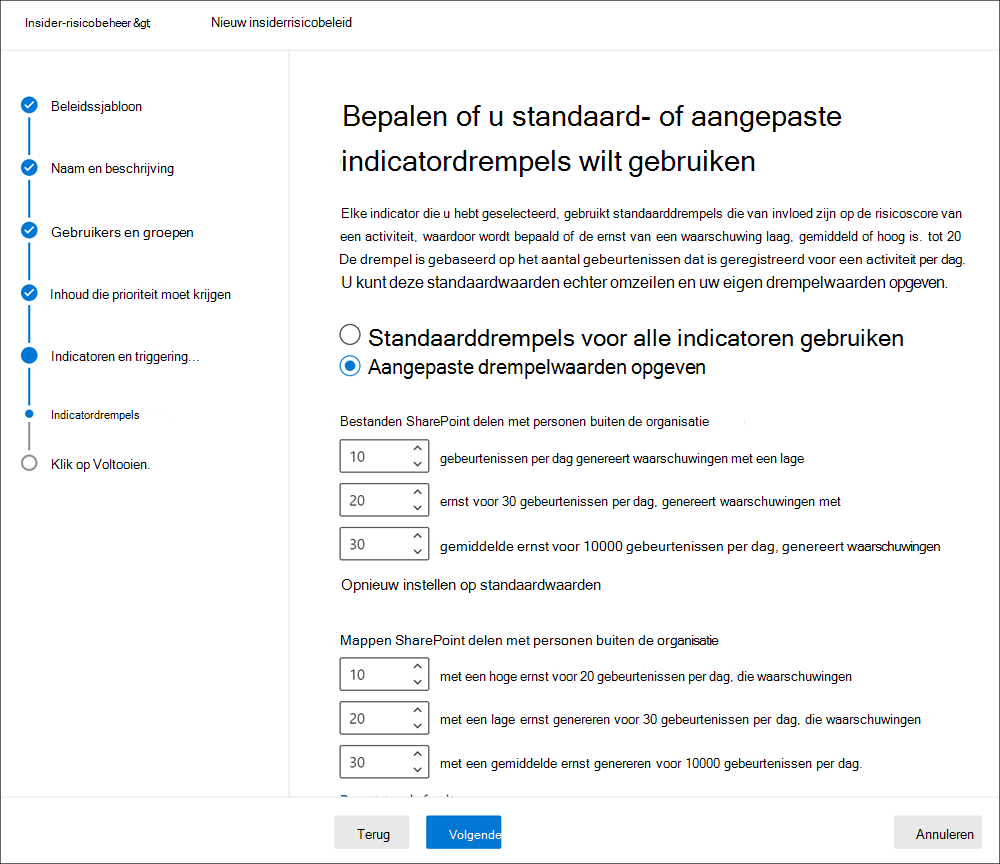

Voor het eerste dagelijkse gebeurtenisniveau stelt u de drempel op *10* of meer gebeurtenissen per dag voor een lager effect in op de risicoscore voor de gebeurtenissen, *20* of meer gebeurtenissen per dag voor een gemiddeld effect op de risicoscore voor de gebeurtenissen en *30* of meer gebeurtenissen per dag een hoger effect op de risicoscore voor de gebeurtenissen. Deze instellingen betekenen effectief:

- Als er 1-9 SharePoint gebeurtenissen die plaatsvinden na het activeren van een gebeurtenis, worden de risicoscores minimaal beïnvloed en wordt er meestal geen waarschuwing gegenereerd.
- Als er 10-19 SharePoint gebeurtenissen zijn die plaatsvinden na een triggeringgebeurtenis, is de risicoscore inherent lager en ligt de ernst van de waarschuwing meestal op een laag niveau.
- Als er 20-29 SharePoint gebeurtenissen zijn die plaatsvinden na een triggering, is de risicoscore inherent hoger en ligt de ernst van de waarschuwing meestal op een gemiddeld niveau.
- Als er 30 of meer SharePoint gebeurtenissen zijn die plaatsvinden na een triggering, is de risicoscore inherent hoger en ligt de ernst van de waarschuwing meestal op een hoog niveau.

## Beleidstermijnen

Met beleidstermijnen kunt u eerdere en toekomstige revisieperioden definiëren die worden geactiveerd na beleidswedstrijden op basis van gebeurtenissen en activiteiten voor de beleidsjablonen voor insiderrisicobeheer. Afhankelijk van de beleidssjabloon die u kiest, zijn de volgende beleidstermijnen beschikbaar:

- **Activeringsvenster:** Het activeringsvenster *is* beschikbaar voor alle beleidssjablonen en  is het gedefinieerde aantal dagen dat het venster na een triggeringgebeurtenis activeert. Het venster wordt 1 tot 30 dagen na een triggering-gebeurtenis geactiveerd voor elke gebruiker die aan het beleid is toegewezen. U hebt bijvoorbeeld een beleid voor insider-risicobeheer geconfigureerd en het activeringsvenster ingesteld *op* 30 dagen. Er zijn enkele maanden verstreken sinds u het beleid hebt geconfigureerd en er vindt een triggering-gebeurtenis plaats voor een van de gebruikers die deel uit maken van het beleid. De triggeringgebeurtenis activeert het *activeringsvenster* en het beleid is 30 dagen na de triggering-gebeurtenis actief voor die gebruiker.
- **Detectie van activiteiten in het** verleden: Voor alle beleidssjablonen is de detectie van activiteiten in het verleden het gedefinieerde aantal dagen dat het venster activeert **vóór** een triggeringgebeurtenis.  Het venster wordt 0 tot 180 dagen geactiveerd voordat een triggeringgebeurtenis plaatsvindt voor elke gebruiker die aan het beleid is toegewezen. U hebt bijvoorbeeld een beleid voor insider-risicobeheer geconfigureerd en de detectie van activiteiten in het verleden ingesteld *op* 90 dagen. Er zijn enkele maanden verstreken sinds u het beleid hebt geconfigureerd en er vindt een triggering-gebeurtenis plaats voor een van de gebruikers die deel uit maken van het beleid. De triggeringgebeurtenis activeert de detectie van activiteiten in het verleden en het beleid verzamelt historische activiteiten voor die gebruiker 90 dagen vóór de triggeringgebeurtenis. 

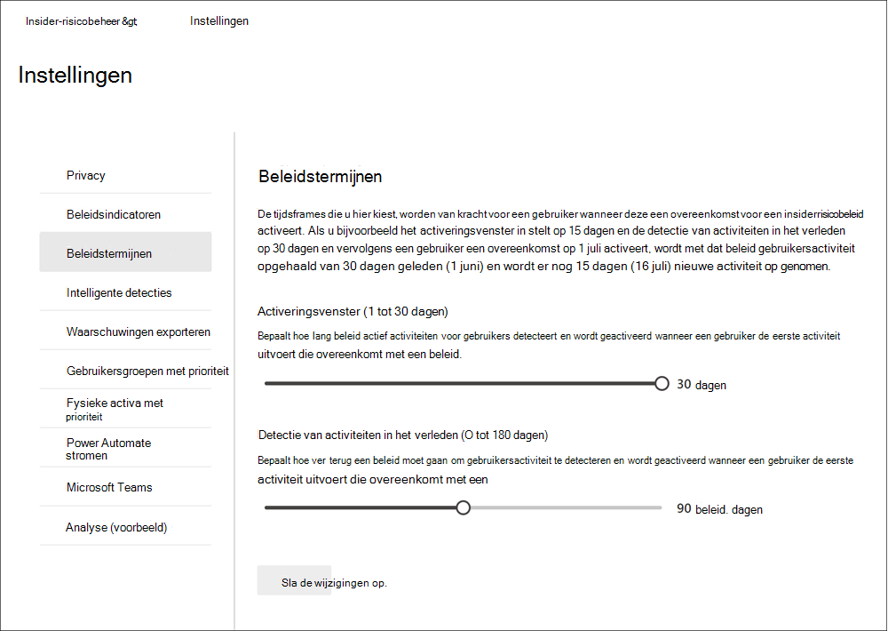

## Intelligente detecties

Intelligente detectie-instellingen helpen bij het verfijnen van de manier waarop detecties van risicovolle activiteiten worden verwerkt voor waarschuwingen. In bepaalde omstandigheden moet u mogelijk bestandstypen definiëren die u wilt negeren of wilt u een detectieniveau afdwingen voor bestanden om een minimumbalk voor waarschuwingen te definiëren. Gebruik deze instellingen om het totale waarschuwingsvolume, uitsluitingen van bestandstype en bestandsvolumelimieten te bepalen.

### Uitsluitingen van bestandstype

Als u specifieke bestandstypen wilt uitsluiten van alle beleidsaanpassingen voor insiderrisicobeheer, voert u bestandsextensies in, gescheiden door komma's. Als u bijvoorbeeld bepaalde soorten muziekbestanden wilt uitsluiten van beleidswedstrijden, kunt u aac,mp3,wav,wma invoeren in het veld **Uitsluitingen bestandstype.** Bestanden met deze extensies worden genegeerd door alle beleidsregels voor insiderrisicobeheer.

### Drempelwaarde voor ongebruikelijke bestandsactiviteit

Als u een minimaal bestandsniveau wilt definiëren voordat activiteitswaarschuwingen worden gerapporteerd in beleidsregels voor insiderrisico's, voert u het aantal bestanden in. U voert bijvoorbeeld '10' in als u geen waarschuwingen voor insiderrisico's wilt genereren wanneer een gebruiker 10 bestanden of minder downloadt, zelfs als het beleid deze activiteit als ongebruikelijk beschouwt.

### Waarschuwingsvolume

Gebruikersactiviteiten die door insiderrisicobeleid worden gedetecteerd, krijgen een specifieke risicoscore toegewezen, die op zijn beurt de ernst van de waarschuwing bepaalt (laag, gemiddeld, hoog). Standaard genereren we een bepaalde hoeveelheid waarschuwingen met lage, gemiddelde en hoge ernst, maar u kunt het volume naar uw behoeften verhogen of verlagen. Als u het volume van waarschuwingen voor alle beleidsregels voor insiderrisicobeheer wilt aanpassen, kiest u een van de volgende instellingen:

- **Minder waarschuwingen:** U ziet alle waarschuwingen met hoge ernst, minder waarschuwingen met een gemiddelde ernst en geen waarschuwingen met een lage ernst. Dit instellingsniveau betekent dat u mogelijk enkele echte positieven mist.
- **Standaardvolume:** u ziet alle waarschuwingen met hoge ernst en een evenwichtige hoeveelheid waarschuwingen met een gemiddelde en lage ernst.
- **Meer waarschuwingen:** U ziet alle waarschuwingen met een gemiddelde en hoge ernst en waarschuwingen met de meeste ernst. Dit instellingsniveau kan leiden tot meer onwaar positieven.

### Microsoft Defender voor Eindpunt (voorbeeld)

[Microsoft Defender for Endpoint](/windows/security/threat-protection/microsoft-defender-atp/microsoft-defender-advanced-threat-protection) is een beveiligingsplatform voor zakelijke eindpunten dat is ontworpen om bedrijfsnetwerken te helpen geavanceerde bedreigingen te voorkomen, te detecteren, te onderzoeken en erop te reageren. Als u een betere zichtbaarheid van beveiligingsovertredingen in uw organisatie wilt hebben, kunt u Defender voor eindpuntwaarschuwingen importeren en filteren voor activiteiten die worden gebruikt in beleidsregels die zijn gemaakt op basis van beleidsregels voor beveiligingsovertredingssjablonen voor insiderrisicobeheer.

Afhankelijk van de typen signalen waarin u geïnteresseerd bent, kunt u ervoor kiezen om waarschuwingen te importeren in insider risk management op basis van de triagestatus van de Defender for Endpoint-waarschuwing. U kunt een of meer van de volgende waarschuwingstriagestatussen definiëren in de globale instellingen die u wilt importeren:

- Unknown
- Nieuw
- In uitvoering
- Opgelost

Waarschuwingen van Defender voor Eindpunt worden dagelijks geïmporteerd. Afhankelijk van de triagestatus die u kiest, ziet u mogelijk meerdere gebruikersactiviteiten voor dezelfde waarschuwing als de triagestatuswijzigingen in Defender voor Eindpunt.

Als u bijvoorbeeld *Nieuw ,* *In*  uitvoering en Opgelost voor deze instelling selecteert, wanneer een Waarschuwing van Microsoft Defender voor eindpunt wordt gegenereerd en de status Nieuw *is,* wordt een eerste waarschuwingsactiviteit geïmporteerd voor de gebruiker met insiderrisico's. Wanneer de triagestatus van Defender voor eindpunt wordt gewijzigd *in In uitvoering,* wordt een tweede activiteit voor deze waarschuwing geïmporteerd voor de gebruiker met insiderrisico. Wanneer de uiteindelijke Triagestatus van Defender voor Eindpunt van *Opgelost* is ingesteld, wordt een derde activiteit voor deze waarschuwing geïmporteerd voor de gebruiker met insiderrisico. Met deze functionaliteit kunnen onderzoekers de voortgang van de Waarschuwingen van Defender voor eindpunten volgen en het zichtbaarheidsniveau kiezen dat hun onderzoek vereist.

>[!IMPORTANT]
>U moet Microsoft Defender voor Eindpunt hebben geconfigureerd in uw organisatie en Defender voor Eindpunt inschakelen voor integratie van insiderrisicobeheer in het Defender-beveiligingscentrum om waarschuwingen voor beveiligingsovertredingen te importeren. Zie Geavanceerde functies configureren in Defender voor Eindpunt voor meer informatie over het configureren van Defender voor Eindpunt voor integratie met [insiderrisicobeheer.](/windows/security/threat-protection/microsoft-defender-atp/advanced-features\#share-endpoint-alerts-with-microsoft-compliance-center)

### Domeinen (voorbeeld)

Domeininstellingen helpen u bij het definiëren van risiconiveaus voor activiteiten voor specifieke domeinen. Deze activiteiten omvatten het delen van bestanden, het verzenden van e-mailberichten, het downloaden of uploaden van inhoud. Door domeinen in deze instellingen op te geven, kunt u de risicoscore voor activiteiten die met deze domeinen plaatsvinden, verhogen of verlagen.

Gebruik Domein toevoegen om een domein te definiëren voor elk van de domeininstellingen. Daarnaast kunt u jokertekens gebruiken om variaties van hoofddomeinen of subdomeinen te matchen. Als u bijvoorbeeld sales.wingtiptoys.com en support.wingtiptoys.com wilt opgeven, gebruikt u de jokertekeninvoer '*.wingtiptoys.com' om deze subdomeinen (en elk ander subdomein op hetzelfde niveau) aan te passen. Als u subdomeinen op meerdere niveau's wilt opgeven voor een hoofddomein, moet u het selectievakje Subdomeinen op meerdere **niveau's** opnemen selecteren.

Voor elk van de volgende domeininstellingen kunt u maximaal 500 domeinen invoeren:

- **Niet-toegestaan domeinen:** Door niet-toegestaan domeinen op te geven, hebben activiteiten die met deze domeinen plaatsvinden een *hogere risicoscore.* Enkele voorbeelden zijn activiteiten met betrekking tot het delen van inhoud met iemand (zoals het verzenden van e-mail naar iemand met een gmail.com-adres) en wanneer gebruikers inhoud naar een apparaat downloaden van een van deze niet-toegestaan domeinen.
- **Toegestane domeinen:** Bepaalde activiteiten met betrekking tot toegestane domeinen worden genegeerd door uw beleid en genereren geen waarschuwingen. Deze activiteiten omvatten:

    - E-mail verzonden naar externe domeinen
    - Bestanden, mappen, sites die worden gedeeld met externe domeinen
    - Bestanden die zijn geüpload naar externe domeinen (met Microsoft Edge browser)

    Door toegestane domeinen op te geven in instellingen, wordt deze activiteit met deze domeinen op dezelfde manier behandeld als de manier waarop interne organisatieactiviteit wordt behandeld. Domeinen die hier aan activiteiten zijn toegevoegd, kunnen bijvoorbeeld betrekking hebben op het delen van inhoud met iemand buiten uw organisatie (zoals het verzenden van e-mail naar iemand met een gmail.com adres).

- **Domeinen van derden:** Als uw organisatie domeinen van derden gebruikt voor zakelijke doeleinden (zoals cloudopslag), kunt u deze hier opnemen, zodat u waarschuwingen kunt ontvangen voor activiteiten met betrekking tot de apparaatindicator Gebruik een browser om inhoud van een site van derden te *downloaden.*

## Waarschuwingen exporteren (voorbeeld)

Informatie over insiderrisicobeheerwaarschuwingen kan worden geëxporteerd naar SIEM-services (Security Information and Event Management) via [het schema Office 365 Management Activity API](/office/office-365-management-api/office-365-management-activity-api-schema#security-and-compliance-alerts-schema). U kunt de API'Office 365 managementactiviteit gebruiken om waarschuwingsgegevens te exporteren naar andere toepassingen die uw organisatie kan gebruiken om insiderrisicogegevens te beheren of te aggregeren.

Gebruik de API's om informatie over insiderrisicowaarschuwingen te bekijken:

1. Schakel Office 365 Management Activity API-ondersteuning in **insiderrisicobeheer in**  >  **Instellingen**  >  **Waarschuwingen exporteren** in. Deze instelling is standaard uitgeschakeld voor uw Microsoft 365 organisatie.
2. Filter de algemene Office 365 auditactiviteiten door *SecurityComplianceAlerts*.
3. Filter *SecurityComplianceAlerts* op de *categorie InsiderRiskManagement.*

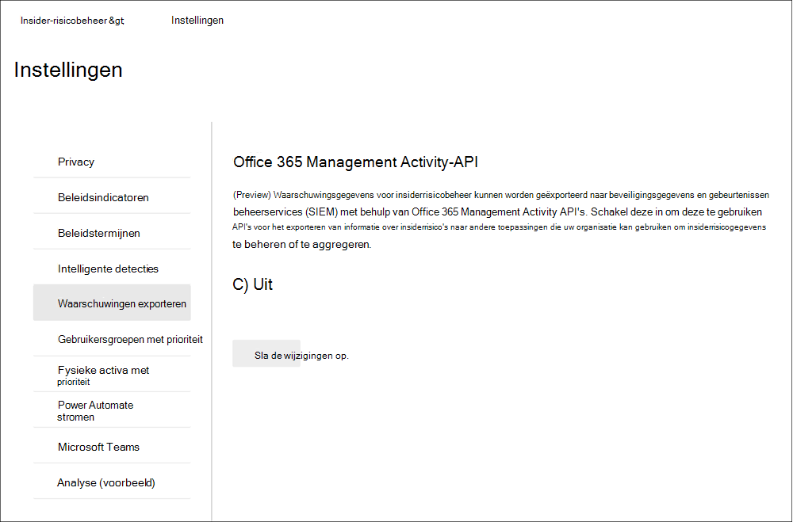

Waarschuwingsgegevens bevatten informatie uit het beveiligings- en compliancewaarschuwingsschema en het algemene schema Office 365 Management Activity API.

De volgende velden en waarden worden geëxporteerd voor waarschuwingen voor insiderrisicobeheer voor het beveiligings- & compliancewaarschuwingsschema:

| **Waarschuwingsparameter** | **Beschrijving** |
|:------------------|:----------------|
| AlertType | Het type waarschuwing is *Aangepast.*  |
| AlertId | De GUID van de waarschuwing. Insider-waarschuwingen voor risicobeheer kunnen worden gedempt. Als de status van de waarschuwing wordt gewijzigd, wordt een nieuw logboek met dezelfde Waarschuwings-informatie gegenereerd. Deze Waarschuwings-informatie kan worden gebruikt om updates voor een waarschuwing te correleren. |
| Categorie | De categorie van de waarschuwing is *InsiderRiskManagement*. Deze categorie kan worden gebruikt om onderscheid te maken tussen deze waarschuwingen en andere beveiligingswaarschuwingen & compliancewaarschuwingen. |
| Opmerkingen | Standaard opmerkingen voor de waarschuwing. Waarden zijn *Nieuwe waarschuwing* (geregistreerd wanneer een waarschuwing wordt gemaakt) en *Waarschuwing bijgewerkt* (aangemeld wanneer er een update voor een waarschuwing is). Gebruik de Waarschuwings-informatie om updates voor een waarschuwing te correleren. |
| Data | De gegevens voor de waarschuwing bevatten de unieke gebruikers-id, de gebruikersnaam en de datum en tijd (UTC) wanneer de gebruiker is geactiveerd in een beleid. |
| Naam | Beleidsnaam voor insiderrisicobeheerbeleid dat de waarschuwing heeft gegenereerd. |
| PolicyId | De GUID van het beleid voor insiderrisicobeheer dat de waarschuwing heeft geactiveerd. |
| Ernst | De ernst van de waarschuwing. Waarden zijn *Hoog,* *Gemiddeld* of *Laag.* |
| Source | De bron van de waarschuwing. De waarde is *Office 365 Beveiligings- & Compliance*. |
| Status | De status van de waarschuwing. Waarden zijn *Actief* *(Needs Review* in insider risk), *Investigating* *(Confirmed* in insider risk), *Resolved* *(Resolved* in insider risk), *Dismissed* *(Dismissed* in insider risk). |
| Versie | De versie van het beveiligings- en compliancewaarschuwingsschema. |

De volgende velden en waarden worden geëxporteerd voor waarschuwingen voor insiderrisicobeheer voor het algemene schema [Office 365 Management Activity API](/office/office-365-management-api/office-365-management-activity-api-schema#common-schema).

- UserID
- Id
- RecordType
- CreationTime
- Bewerking
- OrganizationId
- UserType
- UserKey

## Gebruikersgroepen met prioriteit (voorbeeld)

Gebruikers in uw organisatie kunnen verschillende risiconiveaus hebben, afhankelijk van hun positie, toegangsniveau tot gevoelige informatie of risicogeschiedenis. Als u prioriteit geeft aan het onderzoek en de score van de activiteiten van deze gebruikers, kunt u worden gewaarschuwd voor mogelijke risico's die hogere gevolgen kunnen hebben voor uw organisatie. Gebruikersgroepen met prioriteit in insider-risicobeheer helpen bij het definiëren van de gebruikers in uw organisatie die meer controle en gevoeligere risicoscores nodig hebben. In combinatie met de schendingen van het beveiligingsbeleid door *prioriteitsgebruikers* en gegevenslekken door beleidssjablonen voor *prioriteitsgebruikers,* hebben gebruikers die zijn toegevoegd aan een gebruikersgroep met prioriteit een grotere kans op waarschuwingen voor insiderrisico's en waarschuwingen met hogere ernst.

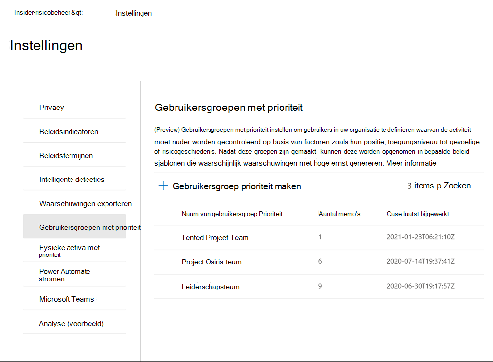

U moet zich bijvoorbeeld beschermen tegen gegevenslekken voor een zeer vertrouwelijk project waarbij gebruikers toegang hebben tot gevoelige informatie. U kiest ervoor om *vertrouwelijke Project* *gebruikersgroep prioriteit* te maken voor gebruikers in uw organisatie die aan dit project werken. Met de beleidswizard en de beleidssjabloon Gegevenslekken door *prioriteitsgebruikers* maakt u een nieuw beleid en wijst u de groep Vertrouwelijke *Project gebruikers* prioriteit aan het beleid toe. Activiteiten die worden onderzocht door het beleid voor leden van de gebruikersgroep Vertrouwelijke *Project* Gebruikers met prioriteit zijn gevoeliger voor risico's en activiteiten van deze gebruikers zullen waarschijnlijk een waarschuwing genereren en waarschuwingen hebben met hogere ernstniveaus.

### Een gebruikersgroep met prioriteit maken

Als u een nieuwe gebruikersgroep met prioriteit wilt maken, gebruikt u instellingsbesturingselementen in de **Insider-oplossing** voor risicobeheer in het Microsoft 365 compliancecentrum. Als u een gebruikersgroep met prioriteit wilt maken, moet u lid zijn van de rollengroep *Insider Risk Management* of Insider Risk Management *Admin.*

Volg de volgende stappen om een gebruikersgroep met prioriteit te maken:

1. Ga in [Microsoft 365 compliancecentrum](https://compliance.microsoft.com)naar **Insider-risicobeheer** en selecteer **Insider-risico-instellingen.**
2. Het tabblad **Prioriteit gebruikersgroepen** selecteren
3. Selecteer op **het tabblad Prioriteit gebruikersgroepen** de optie **Prioriteitsgebruikersgroep maken** om de wizard Groep maken te starten.
4. Vul op **de pagina Groep** definiëren de volgende velden in:
    - **Naam (vereist)**: Voer een vriendelijke naam in voor de gebruikersgroep met prioriteit. U kunt de naam van de gebruikersgroep met prioriteit niet wijzigen nadat u de wizard hebt voltooid.
    - **Beschrijving (optioneel)**: Voer een beschrijving in voor de gebruikersgroep met prioriteit.
5. Selecteer **Volgende om** door te gaan.
6. Selecteer **op** de pagina  Leden kiezen de optie Leden kiezen om te zoeken en  selecteer welke gebruikersaccounts met e-mail zijn opgenomen in de groep of schakel het selectievakje Alles selecteren in om alle gebruikers in uw organisatie toe te voegen aan de groep. Selecteer **Toevoegen om** door te gaan of Annuleren **om** te sluiten zonder gebruikers toe te voegen aan de groep.
7. Selecteer **Volgende om** door te gaan.
8. Bekijk op **de** pagina Controleren de instellingen die u hebt gekozen voor de gebruikersgroep met prioriteit. Selecteer **Bewerken** om een van de groepswaarden te wijzigen of selecteer **Verzenden** om de gebruikersgroep met prioriteit te maken en te activeren.
9. Selecteer op de bevestigingspagina **Klaar om** de wizard te sluiten.

### Een gebruikersgroep met prioriteit bijwerken

Als u een bestaande gebruikersgroep met prioriteit wilt bijwerken, gebruikt u instellingsbesturingselementen in de **Insider-oplossing** voor risicobeheer in het Microsoft 365 compliancecentrum. Als u een gebruikersgroep met prioriteit wilt bijwerken, moet u lid zijn van de rollengroep *Insider Risk Management* of Insider Risk Management *Admin.*

Volg de volgende stappen om een gebruikersgroep met prioriteit te bewerken:

1. Ga in [Microsoft 365 compliancecentrum](https://compliance.microsoft.com)naar **Insider-risicobeheer** en selecteer **Insider-risico-instellingen.**
2. Het tabblad **Prioriteit gebruikersgroepen** selecteren
3. Selecteer de gebruikersgroep met prioriteit die u wilt bewerken en selecteer **Groep bewerken.**
4. Werk op **de pagina Groep** definiëren het veld Beschrijving zo nodig bij. U kunt de naam van de gebruikersgroep met prioriteit niet bijwerken. Selecteer **Volgende om** door te gaan.
5. Voeg op **de pagina Leden** kiezen nieuwe leden toe aan de groep met het **besturingselement Leden** kiezen. Als u een gebruiker uit de groep wilt verwijderen, selecteert u de 'X' naast de gebruiker die u wilt verwijderen. Selecteer **Volgende om** door te gaan.
6. Bekijk op **de** pagina Controleren de update-instellingen die u hebt gekozen voor de gebruikersgroep met prioriteit. Selecteer **Bewerken om** een van de groepswaarden te wijzigen of selecteer Verzenden **om** de gebruikersgroep met prioriteit bij te werken.
7. Selecteer op de bevestigingspagina **Klaar om** de wizard te sluiten.

### Een gebruikersgroep met prioriteit verwijderen

Als u een bestaande gebruikersgroep met prioriteit wilt verwijderen, gebruikt u instellingsbesturingselementen in de **Insider-oplossing** voor risicobeheer in het Microsoft 365 compliancecentrum. Als u een gebruikersgroep met prioriteit wilt verwijderen, moet u lid zijn van de rollengroep *Insider Risk Management* of Insider Risk Management *Admin.*

>[!IMPORTANT]
>Als u een gebruikersgroep met prioriteit verwijdert, wordt deze verwijderd uit een actief beleid waaraan deze is toegewezen. Als u een gebruikersgroep met prioriteit verwijdert die is toegewezen aan een actief beleid, bevat het beleid geen gebruikers binnen het bereik en wordt het inactief en worden er geen waarschuwingen gemaakt.

Volg de volgende stappen om een gebruikersgroep met prioriteit te verwijderen:

1. Ga in [Microsoft 365 compliancecentrum](https://compliance.microsoft.com)naar **Insider-risicobeheer** en selecteer **Insider-risico-instellingen.**
2. Het tabblad **Prioriteit gebruikersgroepen** selecteren
3. Selecteer de gebruikersgroep met prioriteit die u wilt bewerken en selecteer **Verwijderen** in het dashboardmenu.
4. Selecteer in **het** dialoogvenster Verwijderen **Ja** om de gebruikersgroep met prioriteit te verwijderen of selecteer **Annuleren om** terug te keren naar het dashboard.

## Fysieke activa met prioriteit (voorbeeld)

Het identificeren van de toegang tot prioritaire fysieke activa en het correleren van toegangsactiviteit tot gebruikersgebeurtenissen is een belangrijk onderdeel van uw compliance-infrastructuur. Deze fysieke activa vertegenwoordigen prioriteitslocaties in uw organisatie, zoals bedrijfsgebouwen, datacenters of serverruimten. Activiteiten met insiderrisico's kunnen worden gekoppeld aan gebruikers die ongebruikelijke uren werken, proberen toegang te krijgen tot deze niet-geautoriseerde gevoelige of veilige gebieden en verzoeken om toegang tot gebieden op hoog niveau zonder legitieme behoeften.

Wanneer fysieke activa met  prioriteit zijn ingeschakeld en de connector voor fysieke foutgegevens is geconfigureerd, worden signalen van uw fysieke controle en toegangssystemen geïntegreerd met andere activiteiten op het gebied van gebruikersrisico's. Door patronen van gedrag in fysieke toegangssystemen te onderzoeken en deze activiteiten te correeren met andere insiderrisicogebeurtenissen, kan insider risk management complianceonderzoekers en analisten helpen bij het nemen van beter geïnformeerde antwoordbeslissingen voor waarschuwingen. Toegang tot prioritaire fysieke activa wordt in inzichten anders dan toegang tot niet-prioritaire activa gescored en geïdentificeerd.

Uw organisatie beschikt bijvoorbeeld over een systeem voor badging voor gebruikers die fysieke toegang tot normale werk- en gevoelige projectgebieden monitoren en goedkeuren. U hebt verschillende gebruikers die aan een gevoelig project werken en deze gebruikers keren terug naar andere gebieden van uw organisatie wanneer het project is voltooid. Als het gevoelige project bijna is voltooid, wilt u ervoor zorgen dat het projectwerk vertrouwelijk blijft en dat de toegang tot de projectgebieden goed wordt gecontroleerd.

U kiest ervoor om de fysieke verbindingslijn voor slechtgingsgegevens in Microsoft 365 toegangsgegevens te importeren uit uw fysieke systeem voor slechte risico's en prioritaire fysieke activa op te geven in insider risk management. Door gegevens uit uw systeem voor slechte toegang te importeren en fysieke toegangsgegevens te correveren met andere risicoactiviteiten die zijn geïdentificeerd in insider risk management, ziet u dat een van de gebruikers in het project toegang heeft tot de projectkantoren na normale werkuren en ook grote hoeveelheden gegevens exporteert naar een persoonlijke cloudopslagservice vanuit hun normale werkgebied. Deze fysieke toegangsactiviteit die is gekoppeld aan de onlineactiviteit kan wijzen op mogelijke gegevensdiefstal en complianceonderzoekers en -analisten kunnen passende acties ondernemen, zoals bepaald door de omstandigheden voor deze gebruiker.

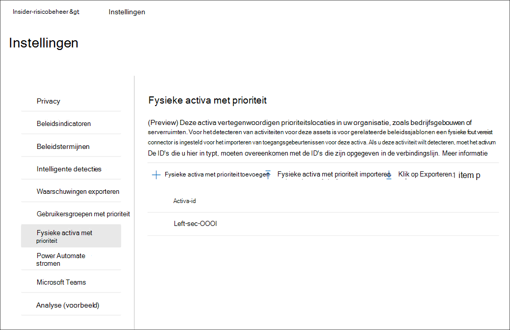

### Fysieke activa met prioriteit configureren

Als u fysieke activa met prioriteit wilt configureren, configureert u de connector Voor fysieke problemen en gebruikt u instellingsbesturingselementen in de **Insider-oplossing** voor risicobeheer in het Microsoft 365 compliancecentrum. Als u fysieke activa met prioriteit wilt configureren, moet u lid zijn van de rollengroep *Insider Risk Management* of Insider Risk Management *Admin.*

Volg de volgende stappen om fysieke activa met prioriteit te configureren:

1. Volg de configuratiestappen voor insider risk management in [het artikel Aan de slag met insider risk management.](insider-risk-management-configure.md) Zorg er in stap 3 voor dat u de connector Voor fysieke problemen configureert.

    >[!IMPORTANT]
    >Voor beleidsregels voor insiderrisicobeheer om signaalgegevens met betrekking tot vertrekkende en beëindigde gebruikers te gebruiken en te correleren met gebeurtenisgegevens van uw fysieke beheer- en toegangsplatformen, moet u ook de Microsoft 365 HR-connector configureren. Als u de connector Voor fysieke problemen inschakelen zonder de Microsoft 365 HR-connector in te stellen, worden met beleid voor insiderrisicobeheer alleen gebeurtenissen verwerkt voor fysieke toegangsactiviteiten voor gebruikers in uw organisatie.

2. Ga in [Microsoft 365 compliancecentrum](https://compliance.microsoft.com)naar **Insider-risicobeheer** en selecteer **Insider-risico-instellingen**  >  **Prioriteit fysieke activa**.
3. Op  de pagina Fysieke activa prioriteit kunt u handmatig de fysieke activa-id's toevoegen die u wilt controleren op de activagebeurtenissen die zijn geïmporteerd door de fysieke verbindingslijn voor slechte bes, of een .csv-bestand importeren van alle fysieke activa-id's die zijn geïmporteerd door de fysieke verbindingslijn voor slechtheid: a) Als u handmatig fysieke activa-id's wilt toevoegen, kiest u Prioriteit fysieke activa **toevoegen,** voert u een fysieke activa-id in en selecteert u Vervolgens **Toevoegen**. Voer andere fysieke activa-ID's in en selecteer vervolgens Fysieke activa met prioriteit **toevoegen om** alle ingevoerde activa op te slaan.
    b) Als u een lijst met fysieke activa-ID's wilt toevoegen uit een .csv bestand, kiest **u Prioritaire fysieke** activa importeren . Selecteer in het dialoogvenster Verkenner het .csv bestand dat u wilt importeren en selecteer **vervolgens Openen.** De fysieke activa-ID's uit de .csv bestanden worden toegevoegd aan de lijst.
4. Ga naar het **tabblad Beleidsindicatoren** in Instellingen.
5. Ga op **de pagina** Beleidsindicatoren naar de sectie Fysieke toegangsindicatoren en schakel het selectievakje voor Fysieke toegang na beëindiging of mislukte toegang tot gevoelige activa **in.** 
6. Selecteer **Opslaan om** te configureren en af te sluiten.

### Een fysiek activum met prioriteit verwijderen

Als u een bestaand fysiek activum met prioriteit wilt verwijderen, gebruikt u instellingsbesturingselementen in de Insider-oplossing voor risicobeheer in het Microsoft 365 compliancecentrum. Als u een prioritair fysiek activum wilt verwijderen, moet u lid zijn van de rollengroep Insider Risk Management of Insider Risk Management Admin.

>[!IMPORTANT]
>Als u een prioritair activum verwijdert, wordt het verwijderd uit onderzoek door een actief beleid waaraan het eerder is toegevoegd. Waarschuwingen die worden gegenereerd door activiteiten die zijn gekoppeld aan het prioritaire fysieke activum, worden niet verwijderd.

Volg de volgende stappen om een fysiek activum met prioriteit te verwijderen:

1. Ga in [Microsoft 365 compliancecentrum](https://compliance.microsoft.com)naar **Insider-risicobeheer** en selecteer **Insider-risico-instellingen**  >  **Prioriteit fysieke activa**.
2. Selecteer op **de pagina** Prioriteit fysieke activa het activum dat u wilt verwijderen.
3. Selecteer **Verwijderen** in het actiemenu om het activum te verwijderen.

## Power Automate stromen (voorbeeld)

[Microsoft Power Automate](/power-automate/getting-started) is een werkstroomservice die acties in verschillende toepassingen en services automatiseert. Door stromen van sjablonen te gebruiken of handmatig te maken, kunt u veelgebruikte taken automatiseren die aan deze toepassingen en services zijn gekoppeld. Wanneer u de Power Automate voor insiderrisicobeheer inschakelen, kunt u belangrijke taken voor zaken en gebruikers automatiseren. U kunt Power Automate-stromen configureren om gebruikers-, waarschuwings- en casegegevens op te halen en deze informatie te delen met belanghebbenden en andere toepassingen, en acties in insider risk management te automatiseren, zoals het posten naar case notes. Power Automate stromen zijn van toepassing voor zaken en elke gebruiker binnen het bereik van een beleid.

Klanten met Microsoft 365 met insider risk management hebben geen extra Power Automate nodig om de aanbevolen insider risk management-sjablonen Power Automate gebruiken. Deze sjablonen kunnen worden aangepast om uw organisatie te ondersteunen en de belangrijkste scenario's voor insiderrisicobeheer te bespreken. Als u premium Power Automate-functies in deze sjablonen wilt gebruiken, maakt u een aangepaste sjabloon met de Microsoft 365-complianceconnector of gebruikt u Power Automate-sjablonen voor andere compliancegebieden in Microsoft 365, hebt u mogelijk meer Power Automate-licenties nodig.

De volgende Power Automate klanten ter ondersteuning van procesautomatisering voor gebruikers van insiderrisicobeheer en -cases:

- **Gebruikers op** de hoogte stellen wanneer ze worden toegevoegd aan een insiderrisicobeleid: Deze sjabloon is voor organisaties met interne beleidsregels, privacy of wettelijke vereisten dat gebruikers moeten worden geïnformeerd wanneer ze onderhevig zijn aan beleid voor insiderrisicobeheer. Wanneer deze stroom is geconfigureerd en geselecteerd voor een gebruiker op de gebruikerspagina, ontvangen gebruikers en hun managers een e-mailbericht wanneer de gebruiker wordt toegevoegd aan een beleid voor insiderrisicobeheer. Deze sjabloon ondersteunt ook het bijwerken van een SharePoint die wordt gehost op een SharePoint site om informatie over meldingen, zoals datum/tijd en de geadresseerde van het bericht, bij te houden. Als u ervoor hebt gekozen om gebruikers te anonimiseren in privacy-instellingen, werken stromen die zijn gemaakt op basis van deze sjabloon niet zoals bedoeld, zodat de privacy van gebruikers wordt gehandhaafd. Power Automate stromen met deze sjabloon zijn beschikbaar op het **dashboard Gebruikers.**
- **Informatie aanvragen** bij HR of bedrijven over een gebruiker in een insiderrisicozaak: Bij het uitvoeren van een zaak moeten insiderrisicoanalisten en -onderzoekers mogelijk overleggen met HR of andere belanghebbenden om de context van de zaakactiviteiten te begrijpen. Wanneer deze stroom is geconfigureerd en geselecteerd voor een zaak, verzenden analisten en onderzoeker een e-mailbericht naar HR- en zakelijke belanghebbenden die zijn geconfigureerd voor deze stroom. Elke geadresseerde krijgt een bericht met vooraf geconfigureerde of aanpasbare antwoordopties. Wanneer geadresseerden een antwoordoptie selecteren, wordt het antwoord opgenomen als een notitie met de geadresseerde en de datum-/tijdgegevens. Als u ervoor hebt gekozen om gebruikers te anonimiseren in privacy-instellingen, werken stromen die zijn gemaakt op basis van deze sjabloon niet zoals bedoeld, zodat de privacy van gebruikers wordt gehandhaafd. Power Automate stromen met deze sjabloon zijn beschikbaar op het **dashboard Cases.**
- **Meldingsmanager wanneer een gebruiker een insiderrisicowaarschuwing** heeft: Sommige organisaties moeten mogelijk onmiddellijk een melding van het beheer hebben wanneer een gebruiker een waarschuwing voor insiderrisicobeheer heeft. Wanneer deze stroom is geconfigureerd en geselecteerd, ontvangt de manager voor de casegebruiker een e-mailbericht met de volgende informatie over alle hoofdzakenwaarschuwingen:
    - Toepasselijk beleid voor de waarschuwing
    - Datum/tijd van de waarschuwing
    - Ernst van de waarschuwing

    De stroom werkt automatisch de opmerkingen bij dat het bericht is verzonden en dat de stroom is geactiveerd. Als u ervoor hebt gekozen om gebruikers te anonimiseren in privacy-instellingen, werken stromen die zijn gemaakt op basis van deze sjabloon niet zoals bedoeld, zodat de privacy van gebruikers wordt gehandhaafd. Power Automate stromen met deze sjabloon zijn beschikbaar op het **dashboard Cases.**
- **Record maken voor insider risk case in ServiceNow:** Deze sjabloon is voor organisaties die hun ServiceNow-oplossing willen gebruiken om gevallen van insiderrisicobeheer bij te houden.  In een geval kunnen insiderrisicoanalisten en -onderzoekers een record voor de zaak maken in ServiceNow. U kunt deze sjabloon aanpassen om geselecteerde velden in ServiceNow in te vullen op basis van de vereisten van uw organisatie. Power Automate stromen met deze sjabloon zijn beschikbaar op het **dashboard Cases.** Zie het verwijzingsartikel [ServiceNow Connector](/connectors/service-now/) voor meer informatie over beschikbare ServiceNow-velden.

### Een stroom Power Automate maken op basis van een insider-sjabloon voor risicobeheer

Als u een Power Automate-stroom wilt maken op basis van een aanbevolen sjabloon voor insiderrisicobeheer, gebruikt u de instellingenbesturingselementen in de  **Insider-oplossing** voor risicobeheer  in het Microsoft 365-compliancecentrum of de optie **Power Automate-stromen** beheren vanuit het besturingselement Automatiseren wanneer u rechtstreeks in de **dashboards** Cases of Gebruikers werkt.

Als u een Power Automate wilt maken in het instellingengebied, moet u lid zijn van de rollengroep *Insider Risk Management* of Insider Risk Management *Admin.* Als u een Power Automate wilt  maken met de optie Power Automate stromen beheren, moet u lid zijn van ten minste één rollengroep voor insiderrisicobeheer.

Volg de volgende stappen om een Power Automate te maken op basis van een aanbevolen sjabloon voor insiderrisicobeheer:

1. Ga in [Microsoft 365 compliancecentrum](https://compliance.microsoft.com/)naar **Insider-risicobeheer** en selecteer **Insider-risico-instellingen**  >  **Power Automate stromen.** U kunt ook toegang krijgen vanaf de **pagina's Cases** of **Gebruikersdashboards** door **Te** automatiseren  >  **Power Automate stromen.**
2. Selecteer op **Power Automate pagina met stromen** een aanbevolen sjabloon in de **insider-sjablonen** voor risicobeheer die u mogelijk leuk vindt op de pagina.
3. In de stroom worden de ingesloten verbindingen vermeld die nodig zijn voor de stroom en wordt vermeld of de verbindingsstatussen beschikbaar zijn. Werk indien nodig eventuele verbindingen bij die niet als beschikbaar worden weergegeven. Selecteer **Doorgaan**.
4. Standaard zijn de aanbevolen stromen vooraf geconfigureerd met het aanbevolen insiderrisicobeheer en Microsoft 365 servicegegevensvelden die nodig zijn om de toegewezen taak voor de stroom te voltooien. Pas indien nodig de stroomonderdelen aan met behulp van **het** besturingselement Geavanceerde opties weergeven en de beschikbare eigenschappen voor het stroomonderdeel configureren.
5. Voeg indien nodig andere stappen toe aan de stroom door de knop **Nieuwe stap te** selecteren. In de meeste gevallen is dit niet nodig voor de aanbevolen standaardsjablonen.
6. Selecteer **Concept opslaan om** de stroom op te slaan voor verdere configuratie of selecteer **Opslaan** om de configuratie voor de stroom te voltooien.
7. Selecteer **Sluiten om** terug te keren naar de Power Automate **stroompagina.** De nieuwe sjabloon wordt weergegeven als een stroom op de tabbladen  Mijn **stromen** en is automatisch beschikbaar via de vervolgkeuzelijst Automatiseren wanneer u werkt met cases voor insiderrisicobeheer voor de gebruiker die de stroom maakt.

>[!IMPORTANT]
>Als andere gebruikers in uw organisatie toegang tot de stroom nodig hebben, moet de stroom worden gedeeld.

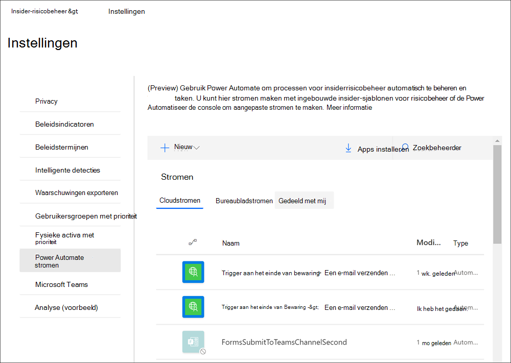

### Een aangepaste stroom Power Automate voor insiderrisicobeheer

Sommige processen en werkstromen voor uw organisatie kunnen buiten de aanbevolen stroomsjablonen voor insiderrisicobeheer staan en mogelijk moet u aangepaste Power Automate maken voor insiderrisicobeheergebieden. Power Automate zijn flexibel en ondersteunen uitgebreide aanpassingen, maar er moeten stappen worden ondernomen om te integreren met insider-functies voor risicobeheer.

Volg de volgende stappen om een aangepaste sjabloon Power Automate maken voor insiderrisicobeheer:

1. **Controleer uw Power Automate stroomlicentie:** als u aangepaste Power Automate wilt maken die gebruikmaken van triggers voor insiderrisicobeheer, hebt u een Power Automate nodig. De aanbevolen stroomsjablonen voor insiderrisicobeheer vereisen geen extra licenties en worden opgenomen als onderdeel van uw insider-licentie voor risicobeheer.
2. **Een geautomatiseerde stroom maken:** maak een stroom die een of meer taken uitvoert nadat deze is geactiveerd door een insiderrisicobeheergebeurtenis. Zie Een stroom maken in Power Automate voor meer informatie over het maken van een [geautomatiseerde stroom.](/power-automate/get-started-logic-flow)
3. **Selecteer de Microsoft 365 verbindingslijn voor naleving:** Zoek naar de verbindingslijn voor Microsoft 365 compliance. Met deze connector kunnen triggers en acties voor insiderrisicobeheer worden gebruikt. Zie het overzichtsartikel Connectorverwijzing voor [meer](/connectors/connector-reference/) informatie over verbindingslijnen.
4. **Kies triggers voor insiderrisicobeheer voor uw stroom:** Insider-risicobeheer heeft twee triggers beschikbaar voor aangepaste Power Automate stromen:
    - **Voor een geselecteerde insider risk management case:** Flows with this trigger can be selected from the insider risk management Cases dashboard page.
    - **Voor een geselecteerde gebruiker van insiderrisicobeheer:** Stromen met deze trigger kunnen worden geselecteerd op de dashboardpagina Gebruikers met insiderrisicobeheer.
5. Kies insider-risicobeheeracties voor uw stroom: U kunt kiezen uit verschillende acties voor insiderrisicobeheer die u wilt opnemen in uw aangepaste stroom:
    - Waarschuwing voor insiderrisicobeheer ontvangen
    - Case voor insiderrisicobeheer
    - Gebruiker van insiderrisicobeheer
    - Waarschuwingen voor insider-risicobeheer voor een zaak ontvangen
    - Notitie voor insiderrisicobeheer toevoegen

### Een stroom Power Automate delen

Standaard zijn Power Automate die door een gebruiker zijn gemaakt, alleen beschikbaar voor die gebruiker. Als andere insiderrisicobeheergebruikers toegang hebben tot en een stroom gebruiken, moet de stroom worden gedeeld door de maker van de stroom. Als u een stroom wilt delen, gebruikt u de instellingenbesturingselementen in de **Insider-oplossing** voor risicobeheer in het Microsoft 365-compliancecentrum  of de optie **Power Automate-stromen** beheren vanuit het besturingselement Automatiseren wanneer u rechtstreeks op de dashboardpagina's Cases of **Gebruikers** werkt. Nadat u een stroom hebt gedeeld, heeft iedereen met wie  deze is gedeeld toegang tot de stroom in de vervolgkeuze van besturingselement Automatiseren in de dashboards Case **en** **Gebruiker.**

Als u een Power Automate wilt delen in het instellingengebied, moet u lid zijn van de rollengroep *Insider Risk Management* of Insider Risk Management *Admin.* Als u een Power Automate wilt  delen met de optie Power Automate stromen beheren, moet u lid zijn van ten minste één rollengroep voor insiderrisicobeheer.

Volg de volgende stappen om een stroom Power Automate delen:

1. Ga in [Microsoft 365 compliancecentrum](https://compliance.microsoft.com)naar **Insider-risicobeheer** en selecteer **Insider-risico-instellingen**  >  **Power Automate stromen.** U kunt ook toegang krijgen vanaf de **pagina's Cases** of **Gebruikersdashboards** door **Te** automatiseren  >  **Power Automate stromen.**
2. Selecteer op **Power Automate pagina Mijn** stromen  of **Teamstromen het** tabblad Mijn stromen.
3. Selecteer de stroom die u wilt delen en selecteer **vervolgens Delen** in het menu stroomopties.
4. Voer op de pagina stroom delen de naam in van de gebruiker of groep die u als eigenaar voor de stroom wilt toevoegen.
5. Selecteer ok **in het** dialoogvenster Verbinding gebruikt om **te** bevestigen dat de toegevoegde gebruiker of groep volledige toegang tot de stroom heeft.

### Een stroom Power Automate bewerken

Als u een stroom wilt bewerken, gebruikt u de instellingenbesturingselementen in de **Insider-oplossing** voor risicobeheer  in het Microsoft 365-compliancecentrum  of de optie **Power Automate-stromen** beheren vanuit het besturingselement Automatiseren wanneer u rechtstreeks in de **dashboards** Cases of Gebruikers werkt.

Als u een Power Automate wilt bewerken in het instellingengebied, moet u lid zijn van de rollengroep *Insider Risk Management* of Insider Risk Management *Admin.* Als u een Power Automate wilt  bewerken met de optie Power Automate beheren, moet u lid zijn van ten minste één rollengroep voor insiderrisicobeheer.

Volg de volgende stappen om een stroom Power Automate bewerken:

1. Ga in [Microsoft 365 compliancecentrum](https://compliance.microsoft.com)naar **Insider-risicobeheer** en selecteer **Insider-risico-instellingen**  >  **Power Automate stromen.** U kunt ook toegang krijgen vanaf de **pagina's Cases** of **Gebruikersdashboards** door **Te** automatiseren  >  **Power Automate stromen.**
2. Selecteer op **Power Automate pagina stroomstromen** een stroom die u wilt bewerken en selecteer **Bewerken** in het menu Stroombesturingselement.
3. Selecteer het **beletselteken Instellingen** als u de instelling van een stroomcomponent of beletselteken Verwijderen wilt wijzigen om  >     >   een stroomcomponent te verwijderen.
4. Selecteer **Opslaan en** vervolgens Sluiten **om** het bewerken van de stroom te voltooien.

### Een stroom Power Automate verwijderen

Als u een stroom wilt verwijderen, gebruikt u de instellingenbesturingselementen in de **Insider-oplossing** voor risicobeheer  in het Microsoft 365-compliancecentrum  of de optie **Power Automate-stromen** beheren vanuit het besturingselement Automatiseren wanneer u rechtstreeks in de **dashboards** Cases of Gebruikers werkt. Wanneer een stroom wordt verwijderd, wordt deze verwijderd als een optie voor alle gebruikers.

Als u een Power Automate wilt verwijderen in het instellingengebied, moet u lid zijn van de rollengroep *Insider Risk Management* of Insider Risk Management *Admin.* Als u een Power Automate wilt  verwijderen met de optie Power Automate beheren, moet u lid zijn van ten minste één rollengroep voor insiderrisicobeheer.

Volg de volgende stappen om een stroom Power Automate verwijderen:

1. Ga in [Microsoft 365 compliancecentrum](https://compliance.microsoft.com)naar **Insider-risicobeheer** en selecteer **Insider-risico-instellingen**  >  **Power Automate stromen.** U kunt ook toegang krijgen vanaf de **pagina's Cases** of **Gebruikersdashboards** door **Te** automatiseren  >  **Power Automate stromen.**
2. Selecteer op **Power Automate pagina stroomstromen** een stroom die u wilt verwijderen en selecteer **Verwijderen** in het menu Stroombesturingselement.
3. Selecteer verwijderen in het  bevestigingsdialoogvenster verwijderen om de stroom te verwijderen of selecteer **Annuleren om** de verwijderingsactie te sluiten.

## Microsoft Teams (voorbeeld)

Complianceanalisten en -onderzoeker kunnen eenvoudig Microsoft Teams voor samenwerking bij cases met insiderrisicobeheer. Ze kunnen coördineren en communiceren met andere belanghebbenden in Microsoft Teams:

- Reactieactiviteiten coördineren en controleren voor gevallen in Teams kanalen
- Bestanden en bewijs met betrekking tot afzonderlijke zaken veilig delen en opslaan
- Reactieactiviteiten bijhouden en controleren door analisten en onderzoekers

Nadat Microsoft Teams is ingeschakeld voor insiderrisicobeheer, wordt er een speciaal Microsoft Teams team gemaakt telkens wanneer een waarschuwing wordt bevestigd en er een zaak wordt gemaakt. Standaard bevat het team automatisch alle leden van de rollengroepen *Insider Risk Management*, Insider Risk Management *Analysts* en Insider *Risk Management Investigators* (maximaal 100 eerste gebruikers). Extra medewerkers van de organisatie kunnen worden toegevoegd aan het team nadat het is gemaakt en zo nodig. Voor bestaande gevallen die zijn gemaakt voordat Microsoft Teams, kunnen analisten en onderzoekers ervoor kiezen om een nieuw Microsoft Teams te maken wanneer ze in een zaak werken als dat nodig is.  Wanneer u het bijbehorende geval in insider risk management hebt opgelost, wordt het team automatisch gearchiveerd (verplaatst naar verborgen en alleen-lezen).

Zie Overzicht van teams en kanalen in Microsoft Teams voor meer informatie over het gebruik van teams en [kanalen in Microsoft Teams.](/MicrosoftTeams/teams-channels-overview)

Het inschakelen Microsoft Teams ondersteuning voor cases is snel en eenvoudig te configureren. Als u een Microsoft Teams voor insider-risicobeheer wilt inschakelen, moet u de volgende stappen volgen:

1. Ga in [Microsoft 365 compliancecentrum](https://compliance.microsoft.com)naar **Insider risk management** Insider risk  >  **settings**.
2. Selecteer het **Microsoft Teams** tabblad.
3. Schakel Microsoft Teams integratie in voor insiderrisicobeheer.
4. Selecteer **Opslaan om** te configureren en af te sluiten.

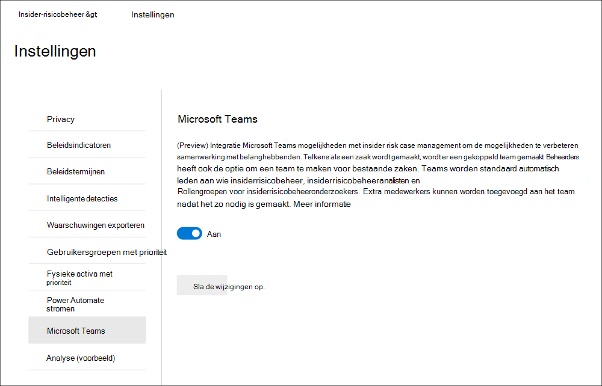

### Een team Microsoft Teams maken voor bestaande zaken

Als u ondersteuning Microsoft Teams voor insider risk management inschakelen nadat u bestaande zaken hebt, moet u indien nodig handmatig een team voor elk geval maken. Nadat u Microsoft Teams ondersteuning in insider-instellingen voor risicobeheer inschakelen, wordt er automatisch een nieuw team Microsoft Teams nieuwe cases.

Gebruikers hebben machtigingen nodig om groepen Microsoft 365 maken in uw organisatie om een team Microsoft Teams een case te maken. Zie Beheren wie Microsoft 365 groepen kunnen maken voor meer informatie over het beheren van machtigingen Microsoft 365 [groepen.](../solutions/manage-creation-of-groups.md)

Als u een team voor een zaak wilt maken, gebruikt u het besturingselement Microsoft-team maken wanneer u rechtstreeks in een bestaand geval werkt. Volg de volgende stappen om een nieuw team te maken:

1. Ga in [Microsoft 365 compliancecentrum](https://compliance.microsoft.com)naar **Insider-risicobeheerzaken**  >   en selecteer een bestaand geval.
2. Selecteer Microsoft Team maken in het actiemenu Voor **de zaak.**
3. Voer in **het veld Teamnaam** een naam in voor het nieuwe Microsoft Teams team.
4. Selecteer **Microsoft-team maken** en selecteer **vervolgens Sluiten.**

Afhankelijk van het aantal gebruikers dat is toegewezen aan rollengroepen voor insiderrisicobeheer, kan het 15 minuten duren voordat alle onderzoekers en analisten voor een zaak aan het Microsoft Teams-team worden toegevoegd.

## Analyse (voorbeeld)

Met insider risk analytics kunt u een evaluatie uitvoeren van potentiële insiderrisico's in uw organisatie zonder dat u beleidsregels voor insiderrisico's configureert. Deze evaluatie kan uw organisatie helpen bij het identificeren van mogelijke gebieden met een hoger gebruikersrisico en het bepalen van het type en het bereik van beleidsregels voor insiderrisicobeheer dat u mogelijk wilt configureren. Analysescans bieden de volgende voordelen voor uw organisatie:

- Eenvoudig te configureren: Als u aan de slag wilt met analysescans, selecteert u Scan uitvoeren wanneer u daarom wordt gevraagd door de analyseaanbeveling of gaat u naar Insider-risico-instellingen > tabblad Analyse en analytics inschakelen.
- Minimale privacyvereisten: Scanresultaten en inzichten worden geretourneerd als geanonimiseerde gebruikersactiviteit, afzonderlijke gebruikersnamen kunnen niet worden geïdentificeerd door revisoren.
- Inzicht in mogelijke risico's door samengevoegde inzichten: Met scanresultaten kunt u snel potentiële risicogebieden voor uw gebruikers identificeren en welk beleid het beste is om deze risico's te beperken.

Bekijk de [video Insider Risk Management Analytics](https://www.youtube.com/watch?v=5c0P5MCXNXk) om te begrijpen hoe analyses de identificatie van potentiële insiderrisico's kunnen versnellen en u kunnen helpen om snel actie te ondernemen.

Analyse scant risicoactiviteitsgebeurtenissen uit verschillende bronnen om inzicht te krijgen in mogelijke risicogebieden. Afhankelijk van uw huidige configuratie, wordt in de analyse op de volgende gebieden naar in aanmerking komende risicoactiviteiten ge zoekd:

- **Microsoft 365 auditlogboeken:** Dit is de primaire bron voor het identificeren van de meeste potentieel risicovolle activiteiten.
- **Exchange Online:** In alle scans kunt u Exchange Online activiteiten identificeren waarbij gegevens in bijlagen worden gemaild naar externe contactpersonen of services.
- **Azure Active Directory:** Opgenomen in alle scans, Azure Active Directory helpt bij het identificeren van risicovolle activiteiten die zijn gekoppeld aan gebruikers met verwijderde gebruikersaccounts.
- **Microsoft 365 HR-gegevensconnector:** Als deze is geconfigureerd, helpen HR-connectorgebeurtenissen bij het identificeren van risicovolle activiteiten die zijn gekoppeld aan gebruikers met een afzeggingsdatum of een aankomende beëindigingsdatum.

Analyseinzichten van scans zijn gebaseerd op dezelfde risicoactiviteitssignalen die worden gebruikt door beleidsregels voor insiderrisicobeheer en rapportresultaten op basis van zowel enkele als opeenvolgende gebruikersactiviteiten. De risicoscore voor analyses is echter gebaseerd op maximaal 30 dagen activiteit, terwijl insiderrisicobeleid dagelijkse activiteiten gebruikt voor inzichten. Wanneer u analyses voor het eerst in uw organisatie in- en uit te voeren, ziet u de scanresultaten voor één dag. Als u analyse ingeschakeld laat, ziet u de resultaten van elke dagelijkse scan die wordt toegevoegd aan de inzichtenrapporten voor een maximumbereik van de afgelopen 30 dagen van de activiteit.

### Analyses inschakelen en de scan starten

Als u insiderrisicoanalyse wilt inschakelen, moet u lid zijn van de rollengroep Insider Risk Management, Insider Risk Management of Microsoft 365 Global Admin.
Volg de volgende stappen om insider risk analytics in teschakelen:

1. Ga in [Microsoft 365 compliancecentrum](https://compliance.microsoft.com)naar **Insider-risicobeheer.**
2. Selecteer **Scan uitvoeren** op de scan voor **insiderrisico's in uw organisatiekaart** op het tabblad Overzicht van insiderrisicobeheer.  Hiermee schakelt u het scannen van analyses voor uw organisatie in. U kunt scannen in uw organisatie ook inschakelen door te navigeren naar Insider-risico-instellingen Analytics en de gebruikersactiviteit van uw tenant scannen in te stellen om mogelijke  >   **insiderrisico's te identificeren.**
3. Selecteer in **het detailvenster Analyse** **de optie Scan uitvoeren om** de scan voor uw organisatie te starten. Het kan tot 24 uur duren voordat inzichten beschikbaar zijn als rapporten om te worden beoordeeld.

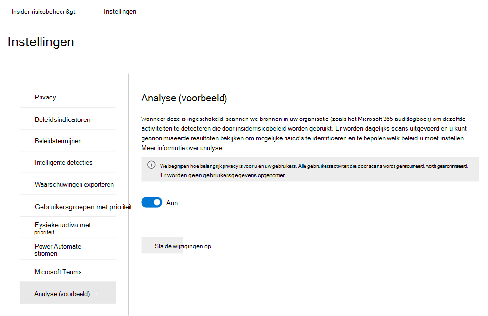

### Inzichten in analyses weergeven en nieuw beleid maken

Nadat de eerste analysescan voor uw organisatie is voltooid, kunt u de inzichten en aanbevelingen voor potentieel risicovolle activiteiten van uw gebruikers bekijken. Dagelijkse scans worden voortgezet, tenzij u analyses voor uw organisatie uit zet. Als u potentiële risico's voor  uw organisatie wilt bekijken, gaat u naar het tabblad Overzicht en **selecteert** u Resultaten weergeven op de **kaart Insider Risk Analytics (preview).** Als de scan voor uw organisatie niet is voltooid, ziet u een bericht dat de scan nog steeds actief is.

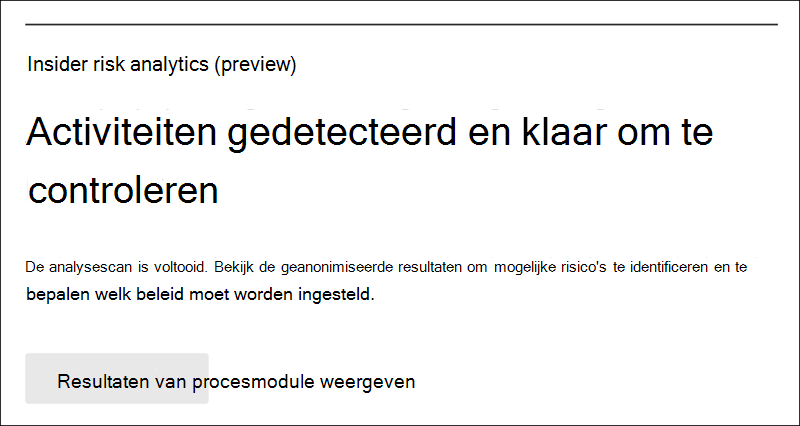

Voor voltooide scans ziet u de mogelijke risico's die in uw organisatie zijn ontdekt, en ziet u inzichten en aanbevelingen om deze risico's aan te pakken. Geïdentificeerde risico's en specifieke inzichten worden opgenomen in rapporten gegroepeerd per gebied, het totale aantal gebruikers met geïdentificeerde risico's, het percentage van deze gebruikers met potentieel risicovolle activiteiten en een aanbevolen insiderrisicobeleid om deze risico's te beperken. De rapporten bevatten:

- **Inzichten in** gegevenslekken: Activiteiten voor alle gebruikers die onbedoelde oversharing van gegevens buiten uw organisatie omvatten of gegevenslekken door gebruikers met kwaadaardige bedoelingen.
- **Inzichten in** gegevensdiefstal: Activiteiten voor vertrekkende gebruikers of gebruikers met verwijderde Azure Active Directory-accounts die risicovolle delen van gegevens buiten uw organisatie kunnen omvatten of gegevensdiefstal door gebruikers met kwaadaardige bedoelingen.
- **Top exfiltration insights**: Activiteiten van alle gebruikers die gegevens kunnen delen buiten uw organisatie.

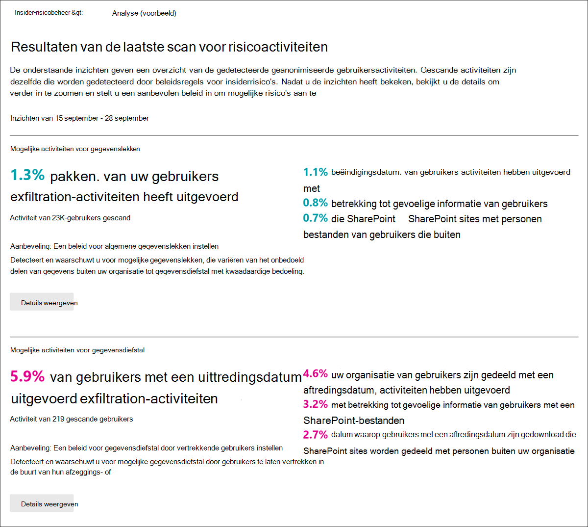

Als u meer informatie wilt weergeven voor een inzicht, **selecteert** u Details weergeven om het detailvenster weer te geven voor het inzicht. Het detailvenster bevat de volledige inzichten, een aanbeveling  voor insiderrisicobeleid en de knop Beleid maken om snel het aanbevolen beleid te maken. Als u Beleid maken selecteert, gaat u naar de beleidswizard en selecteert u automatisch de aanbevolen beleidssjabloon met betrekking tot het inzicht. Als het analyse-inzicht bijvoorbeeld  is voor  gegevenslekkenactiviteit, wordt de beleidssjabloon Algemene gegevenslekken vooraf geselecteerd in de beleidswizard voor u.

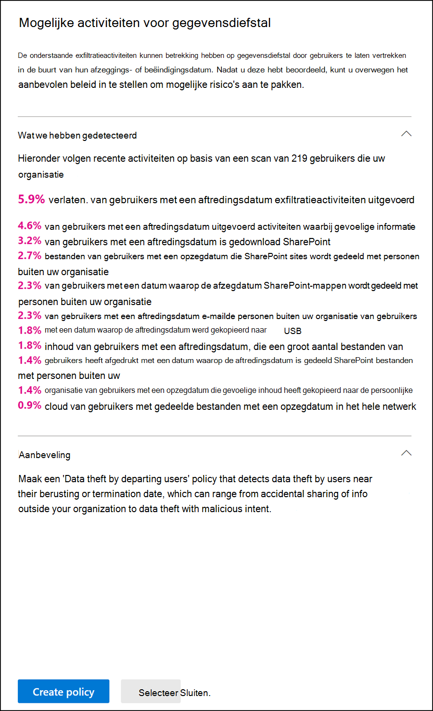

### Analyse uitschakelen

Als u insiderrisicoanalyse wilt uitschakelen, moet u lid zijn van de rollengroep *Insider Risk Management,* *Insider Risk Management* of Microsoft 365 Global *Admin.* Nadat u analyses hebt uitgeschakeld, blijven analyseinzichtrapporten statisch en worden ze niet bijgewerkt voor nieuwe risico's.

Volg de volgende stappen om insider risk analytics uit te schakelen:

1. Ga in [Microsoft 365 compliancecentrum](https://compliance.microsoft.com)naar **Insider-risicobeheer.**
2. Selecteer **de pagina Insider-risico-instellingen**  >  **Analytics.**
3. Schakel op **de pagina Analyse** de gebruikersactiviteit van uw tenant scannen uit om mogelijke **insiderrisico's te identificeren.**