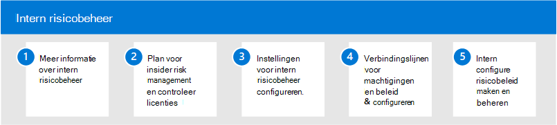

# Insider-risicobeheer in Microsoft 365Insider risk management in Microsoft 365

Werknemers hebben steeds meer toegang tot het maken, beheren en delen van gegevens in een breed spectrum van platforms en services.Increasingly, employees have more access to create, manage, and share data across a broad spectrum of platforms and services. In de meeste gevallen beschikken organisaties over beperkte resources en hulpmiddelen om risico's in de hele organisatie te identificeren en te beperken, terwijl ze ook voldoen aan nalevingsvereisten en privacystandaarden voor werknemers.In most cases, organizations have limited resources and tools to identify and mitigate organization-wide risks while also meeting compliance requirements and employee privacy standards. Deze risico's kunnen gegevensdiefstal zijn door vertrekkende werknemers en gegevenslekken van informatie buiten uw organisatie door onbedoelde oversharing of schadelijke bedoelingen.These risks may include data theft by departing employees and data leaks of information outside your organization by accidental oversharing or malicious intent.

Insider risk management in Microsoft 365 gebruikt de volledige breedte van service- en externe indicatoren om u te helpen snel risicovolle gebruikersactiviteit te identificeren, te triagen en te handelen.Insider risk management in Microsoft 365 uses the full breadth of service and 3rd-party indicators to help you quickly identify, triage, and act on risky user activity. Met behulp van logboeken van Microsoft 365 en Microsoft Graph kunt u met insiderrisicobeheer specifieke beleidsregels definiëren om risico-indicatoren te identificeren en actie te ondernemen om deze risico's te beperken.By using logs from Microsoft 365 and Microsoft Graph, insider risk management allows you to define specific policies to identify risk indicators and to take action to mitigate these risks.

## Insider-risicobeheer configureren voor Microsoft 365Configure insider risk management for Microsoft 365

Gebruik de volgende stappen om insider risk management voor uw organisatie te configureren:Use the following steps to configure insider risk management for your organization:

1. Meer informatie over [insider risk management](insider-risk-management.md) in Microsoft 365Learn about [insider risk management](insider-risk-management.md) in Microsoft 365
2. Plan voor [insider risk management en controleer licenties](insider-risk-management-plan.md)Plan for [insider risk management and verify licensing](insider-risk-management-plan.md)
3. Instellingen [voor insiderrisicobeheer configureren](insider-risk-management-settings.md)Configure [insider risk management settings](insider-risk-management-settings.md)
4. Machtigingen [en](insider-risk-management-configure.md#step-1-enable-permissions-for-insider-risk-management) [beleidsvoorwaardes configureren & connectors](insider-risk-management-configure.md#step-4-configure-prerequisites-for-policies)Configure [permissions](insider-risk-management-configure.md#step-1-enable-permissions-for-insider-risk-management) and [policy prerequisites & connectors](insider-risk-management-configure.md#step-4-configure-prerequisites-for-policies)
5. Beleidsregels voor [insiderrisicobeheer maken en configureren](insider-risk-management-configure.md#step-6-create-an-insider-risk-management-policy)Create and configure [insider risk management policies](insider-risk-management-configure.md#step-6-create-an-insider-risk-management-policy)

## Meer informatie over insider risk managementMore information about insider risk management

- [Beleidsregels voor insiderrisico's beherenManage insider risk policies](insider-risk-management-policies.md)
- [Waarschuwingen voor insider-risico onderzoekenInvestigate insider risk alerts](insider-risk-management-alerts.md)
- [Handelen in gevallen met insiderrisico'sAct on insider risk cases](insider-risk-management-cases.md)