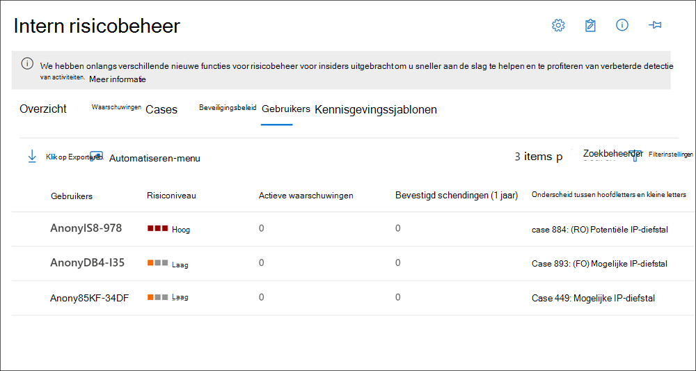

# Insider risk management Users dashboardInsider risk management Users dashboard

Het **gebruikersdashboard** is een belangrijk hulpmiddel in de insider-werkstroom voor risicobeheer en helpt onderzoekers en analisten een vollediger inzicht te krijgen in risicoactiviteiten.The **Users dashboard** is an important tool in the insider risk management workflow and helps investigators and analysts have a more complete understanding of risk activities. Dit dashboard biedt weergaven en beheerfuncties om te voldoen aan de administratieve behoeften tussen het maken van insider-beleid voor risicobeheer en het beheren van gevallen van insiderrisicobeheer.This dashboard offers views and management features to meet administrative needs between the creating insider risk management policies and managing insider risk management cases.

Nadat gebruikers zijn toegevoegd aan beleidsregels voor insiderrisicobeheer, worden achtergrondprocessen automatisch gebruikersactiviteiten voor [triggeringindicatoren evalueren.](insider-risk-management-settings.md#indicators)After users are added to insider risk management policies, background processes are automatically evaluating user activities for [triggering indicators](insider-risk-management-settings.md#indicators). Nadat triggering indicators aanwezig zijn, worden aan gebruikersactiviteiten risicoscores toegewezen.After triggering indicators are present, user activities are assigned risk scores. Sommige van deze activiteiten kunnen leiden tot een insiderrisicowaarschuwing, maar sommige activiteiten voldoen mogelijk niet aan een minimumrisicoscoreniveau en er wordt geen insiderrisicowaarschuwing gemaakt.Some of these activities may result in an insider risk alert, but some activities may not meet a minimum risk score level and an insider risk alert won't be created. Met **het dashboard** Gebruikers kunt u gebruikers weergeven met dit type indicatoren en risicoscores, evenals gebruikers met actieve insiderrisicowaarschuwingen.The **Users dashboard** allows you to view users with these types of indicators and risk scores, as well users that have active insider risk alerts.

Meer informatie over hoe gebruikers in het dashboard Gebruikers in de volgende scenario's worden weergegeven:Learn more about how the Users dashboard displays users in the following scenarios:

- Gebruikers met waarschuwingen voor actief insiderrisicobeleidUsers with active insider risk policy alerts
- Gebruikers met triggering-gebeurtenissenUsers with triggering events
- Gebruikers die tijdelijk zijn toegevoegd aan beleidsregelsUsers added temporarily to policies

## Gebruikers met waarschuwingen voor actief insiderrisicobeleidUsers with active insider risk policy alerts

In **het dashboard Gebruikers** worden automatisch alle gebruikers weergegeven met waarschuwingen voor actief insiderrisicobeleid.The **Users dashboard** automatically displays all users with active insider risk policy alerts. Deze gebruikers met waarschuwingen hebben zowel een triggering indicator als een activiteitsrisicoscore die voldoet aan de vereisten voor het maken van een insiderrisicowaarschuwing.These users with alerts have both a triggering indicator and an activity risk score that meets the requirements for creating an insider risk alert. Activiteiten voor deze gebruikers worden weergegeven door de gebruiker te selecteren in het **dashboard** Gebruikers en naar het tabblad **Gebruikersactiviteit te** navigeren.Activities for these users are viewed by selecting the user in the **Users dashboard** and navigating to the **User activity** tab.

## Gebruikers met triggering-gebeurtenissenUsers with triggering events

In **het dashboard** Gebruikers worden automatisch alle gebruikers weergegeven met triggeringgebeurtenissen, maar die geen activiteitsrisicoscore hebben die een insiderrisicowaarschuwing zou maken.The **Users dashboard** automatically displays all users with triggering events, but that don't have an activity risk score that would create an insider risk alert. Een gebruiker met een gerapporteerde aftredingsdatum wordt bijvoorbeeld weergegeven omdat deze activiteit een triggeringgebeurtenis is, maar geen activiteit is met een risicoscore.For example, a user with a reported resignation date is displayed because this activity is a triggering event but isn't an activity that has a risk score. Activiteiten voor deze gebruikers worden weergegeven door de gebruiker te selecteren in het **dashboard** Gebruikers en naar het tabblad **Gebruikersactiviteit te** navigeren.Activities for these users are viewed by selecting the user in the **Users dashboard** and navigating to the **User activity** tab.

## Gebruikers die tijdelijk zijn toegevoegd aan beleidsregelsUsers added temporarily to policies

Het **dashboard Gebruikers** bevat gebruikers die zijn toegevoegd aan beleid voor insiderrisicobeheer na een ongebruikelijke gebeurtenis buiten de insider-werkstroom voor risicobeheer.The **Users dashboard** includes users added to insider risk management policies after an unusual event outside of the insider risk management workflow. Het tijdelijk toevoegen van gebruikers (vanuit het dashboard Beleid) is ook een manier om gebruikersactiviteit te gaan noteren voor een beleid voor insiderrisicobeheer voor het testen van het beleid, zelfs als een vereiste connector niet is geconfigureerd.Temporarily adding users (from the Policies dashboard) is also a way to start scoring user activity for an insider risk management policy for testing the policy, even if a required connector isn't configured.

Wanneer een gebruiker handmatig wordt toegevoegd aan een beleid, worden de gebruikersactiviteiten van de afgelopen 90 dagen gescored en toegevoegd aan de tijdlijn **gebruikersactiviteit.**When a user is manually added to a policy, the user activities for the previous 90 days are scored and added to the **User activity** timeline. U hebt bijvoorbeeld een gebruiker die momenteel geen risicoscores heeft toegewezen voor een insiderrisicobeleid en de gebruiker heeft activiteiten met gegevenslekken gerapporteerd bij de juridische afdeling in uw organisatie.For example, you have a user not currently being assigned risk scores for an insider risk policy and the user has data leak activities reported to the legal department in your organization. De juridische afdeling raadt u aan om nieuwe vereisten voor korte termijncontrole voor de gebruiker te configureren.The legal department recommends that you configure new short-term monitoring requirements for the user. U kunt de gebruiker tijdelijk toewijzen aan uw beleid voor gegevenslekken voor een bepaalde periode *(activeringsvenster).*You can temporarily assign the user to your *Data leaks* policy for a designated length of time (activation window). Alle gebruikers die tijdelijk zijn toegevoegd, worden weergegeven in het **dashboard Gebruikers,** omdat triggeringgebeurtenisvereisten worden opgehefd.All users added temporarily are displayed in the **Users dashboard** because triggering event requirements are waived.

>[!NOTE]
>Het kan enkele uren duren voordat nieuwe gebruikers die handmatig zijn toegevoegd, worden weergegeven in het **dashboard Gebruikers.**It may take several hours for new manually-added users to appear in the **Users dashboard**. Het kan tot 24 uur duren voordat de activiteiten van de afgelopen 90 dagen voor deze gebruikers worden weergegeven.Activities for the previous 90 days for these users may take up to 24 hours to display. Als u activiteiten wilt weergeven voor handmatig toegevoegde gebruikers, selecteert u de gebruiker op het **dashboard** Gebruikers en opent u het tabblad **Gebruikersactiviteit** in het detailvenster.To view activities for manually added users, select the user on the **Users dashboard** and open the **User activity** tab on the details pane.

De gebruiker wordt automatisch verwijderd uit het **gebruikersdashboard** en de score wordt gestopt wanneer de tijd die is gedefinieerd in het activeringsvenster **verloopt** als:The user is automatically removed from the **Users dashboard** and scoring stops when the time defined in the **Activation window** expires if:

- de gebruiker geen extra triggeringgebeurtenissen of waarschuwingen voor insiderrisicobeleid heeft, enthe user doesn't have any additional triggering events or insider risk policy alerts, and
- als de handmatig gedefinieerde **duur van het activeringsvenster** langer is dan de duur van het globale beleid **activeringsvenster.**if the manually defined **Activation window** duration is longer than the global policy **Activation window** duration.

De **instelling activeringsvenster** met de langste  duur overschrijven altijd de instelling van het activeringsvenster met een kortere duur.The **Activation window** setting with the longest duration always overrides the **Activation window** setting with a shorter duration. U hebt bijvoorbeeld het venster  Activering geconfigureerd  op het tabblad Globale beleidstermijnen in de algemene instellingen voor insiderrisicobeheer voor 15 dagen, die automatisch worden toegepast op al uw insiderrisicobeleid.For example, you've configured the **Activation window** on the global **Policy timeframes** tab in the insider risk management global settings for 15 days, which is automatically applied to all your insider risk policies. 

U voegt tijdelijk een gebruiker toe aan uw insiderrisicobeleid voor *gegevenslekken* en definieert 30 dagen als het **activeringsvenster** voor deze gebruiker.You temporarily add a user to your *Data leaks* insider risk policy and define 30 days as the **Activation window** for this user. De globale **activeringsvensterinstelling** van 15 dagen wordt  overgenomen door de instelling activeringsvenster van 30 dagen voor de tijdelijk toegevoegde gebruiker te definiëren.The global **Activation window** setting of 15 days is overridden by defining the **Activation window** setting of 30 days for the temporarily added user. De tijdelijk toegevoegde gebruiker blijft in het **dashboard Gebruikers en** blijft 30 dagen binnen het bereik van het beleid.The temporarily added user will remain in the **Users dashboard** and be in-scope for the policy for 30 days.

In het tegenovergestelde  scenario waarin de instelling  voor het globale activeringsvenster langer is dan de instelling  activeringsvenster die is gedefinieerd voor een tijdelijk toegevoegde gebruiker, wordt de instelling voor het activeringsvenster voor de tijdelijk toegevoegde gebruiker vervangen door de algemene instelling activeringsvenster. In the opposite scenario where the global **Activation window** setting is longer than the **Activation window** setting defined for a temporarily added user, the global **Activation window** setting would override the **Activation window** setting for the temporarily added user. De tijdelijk toegevoegde gebruiker blijft in het dashboard Gebruikers **en** is binnen bereik voor het beleid voor het aantal dagen dat is gedefinieerd in de globale **instellingen van het activeringsvenster.**The temporarily added user will remain in the **Users dashboard** and be in-scope for the policy for the number of days defined in the global **Activation window** settings.

## Gebruikersgegevens weergeven op het dashboard GebruikersView user information on the Users dashboard

Elke gebruiker die wordt weergegeven in het **dashboard Gebruikers** heeft de volgende informatie:Each user displayed in the **Users dashboard** has the following information:

- **Gebruikers:** De gebruikersnaam voor een gebruiker.**Users**: The username for a user. Dit veld wordt geanonimiseerd als de algemene anonimisatie-instelling voor insiderrisicobeheer is ingeschakeld.This field is anonymized if the global anonymization setting for insider risk management is enabled.
- **Risiconiveau:** Het huidige berekende risiconiveau van de gebruiker.**Risk level**: The current calculated risk level of the user. Deze score wordt elke 24 uur berekend en gebruikt de waarschuwingsrisicoscores van alle actieve waarschuwingen die aan de gebruiker zijn gekoppeld.This score is calculated every 24 hours and uses the alert risk scores from all active alerts associated to the user. Voor gebruikers met alleen triggering indicators is het risiconiveau nul.For users with only triggering indicators, the risk level is zero.
- **Actieve waarschuwingen:** het aantal actieve waarschuwingen voor alle beleidsregels.**Active alerts**: The number of active alerts for all policies.
- **Bevestigd schendingen:** Het aantal gevallen dat is opgelost als *bevestigd beleidsovertreding* voor de gebruiker.**Confirmed violations**: The number of cases resolved as *confirmed policy violation* for the user.
- **Case:** De huidige actieve case voor de gebruiker.**Case**: The current active case for the user.

>[!NOTE]
>Het aantal gebruikers dat wordt weergegeven op het **dashboard** Gebruikers kan in sommige gevallen worden beperkt, afhankelijk van het aantal actieve waarschuwingen en overeenkomende beleidsregels.The number of users displayed on the **Users dashboard** may be limited in some instances, depending on the volume of active alerts and matching policies. Gebruikers met actieve waarschuwingen worden weergegeven op het **dashboard** Gebruikers terwijl de waarschuwingen worden gegenereerd en er kunnen zeldzame gevallen zijn wanneer het maximum aantal weergegeven gebruikers wordt bereikt.Users with active alerts are displayed on the **Users dashboard** as the alerts are generated, and there may be rare cases when the maximum number of displayed users is reached. Als deze limiet wordt bereikt, worden gebruikers met actieve waarschuwingen  die niet worden weergegeven, toegevoegd aan het gebruikersdashboard, omdat bestaande gebruikerswaarschuwingen drie keer worden weergegeven.If this limit happens, users with active alerts who aren't displayed will be added to the **Users dashboard** as existing user alerts are triaged.

## Gebruikersgegevens weergevenView user details

Als u meer informatie wilt over risicoactiviteit voor een gebruiker, opent u het deelvenster gebruikersdetails door te dubbelklikken op een gebruiker in het **gebruikersdashboard.**To view more details about risk activity for a user, open the user details pane by double-clicking a user in the **Users dashboard**. In het detailvenster kunt u de volgende informatie bekijken:On the details pane, you can view the following information:

- **Tabblad Gebruikersprofiel****User profile** tab
    - **Naam en titel:** De naam en positietitel voor de gebruiker van Azure Active Directory.**Name and title**: The name and position title for the user from Azure Active Directory. Deze gebruikersvelden worden geanonimiseerd of leeg als de algemene anonimisatie-instelling voor insiderrisicobeheer is ingeschakeld.These user fields will be anonymized or empty if the global anonymization setting for insider risk management is enabled.
    - **Gebruikers-e-mail:** Het e-mailadres voor de gebruiker.**User email**: The email address for the user.
    - **Alias:** De netwerkalias voor de gebruiker.**Alias**: The network alias for the user.
    - **Organisatie of afdeling**: De organisatie of afdeling voor de gebruiker.**Organization or department**: The organization or department for the user.

- **Tabblad Gebruikersactiviteit****User activity** tab
    - **Geschiedenis van recente gebruikersactiviteit:** hiermee worden zowel triggerindicatoren als insiderrisico-indicatoren voor gebruikersactiviteiten tot de laatste 180 dagen vermeld.**History of recent user activity**: Lists both triggering indicators and insider risk indicators for user activities up to the last 180 days. Alle activiteiten die relevant zijn voor insiderrisicoindicatoren, worden ook gescored, hoewel de activiteiten al dan niet een insiderrisicowaarschuwing hebben gegenereerd.All activities pertinent to insider risk indicators are also scored, though the activities may or may not have generated an insider risk alert. Triggering indicator examples may be a aftreding date or the last scheduled date of work for the user.Triggering indicator examples may be a resignation date or the last scheduled date of work for the user. Insiderrisicoindicatoren zijn activiteiten die worden bepaald als een element van risico en worden gedefinieerd in beleidsregels waarin de gebruiker is opgenomen.Insider risk indicators are activities determined to have an element of risk and are defined in policies that the user is included in. Gebeurtenis- en risicoactiviteiten worden vermeld met het meest recente item dat als eerste wordt vermeld.Event and risk activities are listed with the most recent item listed first.

## Gebruikers verwijderen uit in-scopetoewijzing aan beleidRemove users from in-scope assignment to policies

Er kunnen scenario's zijn waarin u moet stoppen met het toewijzen van risicoscores aan de activiteit van een gebruiker in beleidsregels voor insiderrisicobeheer.There may be scenarios where you need to stop assigning risk scores to a user's activity in insider risk management policies. Gebruik **Gebruikers verwijderen op** de pagina **Gebruikersdashboard** om te stoppen met het toewijzen van risicoscores voor een of meer gebruikers van alle beleidsregels voor insiderrisicobeheer waar ze momenteel onder vallen.Use **Remove users** on the **Users dashboard** page to stop assigning risk scores for one or more users from all insider risk management policies that they are currently in-scope for. Met deze actie worden gebruikers niet verwijderd uit de algemene beleidstoewijzing (wanneer u gebruikers of groepen toevoegt aan een beleidsconfiguratie), maar worden de gebruikers gewoon verwijderd uit actieve verwerking door beleid na de huidige triggeringgebeurtenissen.This action does not remove users from the overall policy assignment (when you add users or groups to a policy configuration), but simply removes the users from active processing by policies after current triggering events. Als de gebruikers in de toekomst nog een triggeringgebeurtenis hebben, worden risicoscores van beleid automatisch opnieuw aan de gebruikers toegewezen.If the users have another triggering event in the future, risk scores from policies will automatically begin to be assigned to the users again. Bestaande waarschuwingen of gevallen voor deze gebruiker worden niet verwijderd.Any existing alerts or cases for this user will not be removed.

>[!NOTE]
>Het kan enkele minuten duren voordat u een gebruiker uit een beleid verwijdert.Removing a user from a policy may take several minutes to complete. Wanneer deze is voltooid, wordt de gebruiker niet meer weergegeven op de pagina Gebruikers.Once complete, the user will no longer be listed on the Users page. Als de verwijderde gebruiker actieve waarschuwingen of gevallen heeft, blijft de gebruiker op de pagina Gebruikers staan en wordt in de details voor de gebruiker weergegeven dat deze niet langer binnen het bereik van een beleid valt.If the removed user has active alerts or cases, then the user will remain on the Users page and the details for the user will show that they are no longer in-scope for a policy.

Als u gebruikers handmatig wilt verwijderen uit de status binnen het bereik in alle beleidsregels voor insiderrisicobeheer, gaat u als volgt te werk:To manually remove users from in-scope status in all insider risk management policies, complete the following steps:

1. Ga in [Microsoft 365 compliancecentrum](https://compliance.microsoft.com)naar **Insider-risicobeheer** en selecteer het **tabblad Gebruikers.**In the [Microsoft 365 compliance center](https://compliance.microsoft.com), go to **Insider risk management** and select the **Users** tab.
2. Selecteer in **het dashboard Gebruikers** de gebruiker of gebruikers die u wilt verwijderen uit het beleid voor insiderrisicobeheer.On the **Users dashboard**, select the user or users you want to remove from being in-scope in insider risk management policies.
3. Selecteer **Gebruikers verwijderen.**Select **Remove users**.
4. Selecteer verwijderen of Annuleren  in **het deelvenster** Gebruiker verwijderen **om** de wijzigingen te verwijderen en het dialoogvenster te sluiten.On the **Remove user** pane, Select **Remove** or **Cancel** to discard the changes and close the dialog.
5. Selecteer **Verwijderen** in het bevestigingsvenster om de gebruiker te verwijderen.Select **Remove** on the confirmation pane to remove the user.

## Geautomatiseerde taken uitvoeren met Power Automate stromen voor een gebruikerRun automated tasks with Power Automate flows for a user

Met aanbevolen Power Automate kunnen risicoonderzoekers en analisten snel actie ondernemen om:Using recommended Power Automate flows, risk investigators and analysts can quickly take action to:

- Gebruikers op de hoogte stellen wanneer ze worden toegevoegd aan een insiderrisicobeleidNotify users when they're added to an insider risk policy

Voer, beheer of maak deze Power Automate voor een insider risicobeheergebruiker:To run, manage, or create Power Automate flows for an insider risk management user:

1. Selecteer **Automatiseren** op de werkbalk gebruikersactie.Select **Automate** on the user action toolbar.
2. Kies de Power Automate stroom die u wilt uitvoeren en selecteer **vervolgens Stroom uitvoeren.**Choose the Power Automate flow to run, then select **Run flow**.
3. Nadat de stroom is voltooid, selecteert u **Gereed**.After the flow has completed, select **Done**.

Zie Aan de slag met instellingen voor insider-risicobeheer voor meer Power Automate voor [insiderrisicobeheer.](insider-risk-management-settings.md#power-automate-flows-preview)To learn more about Power Automate flows for insider risk management, see [Getting started with insider risk management settings](insider-risk-management-settings.md#power-automate-flows-preview).
