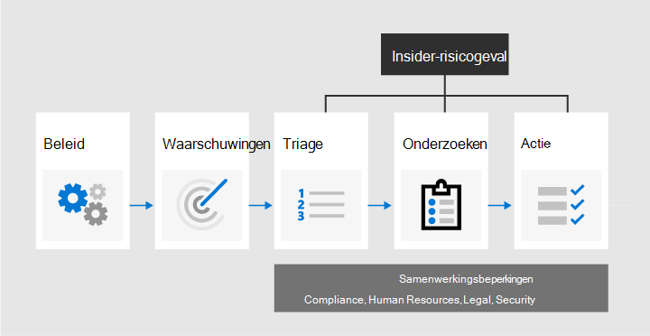
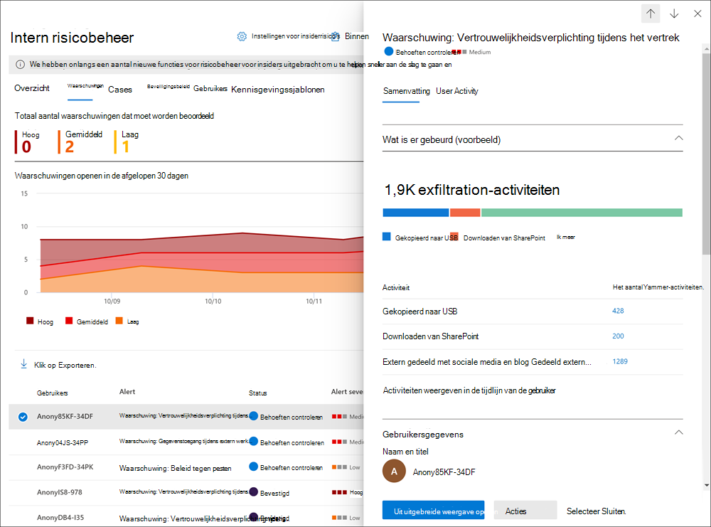
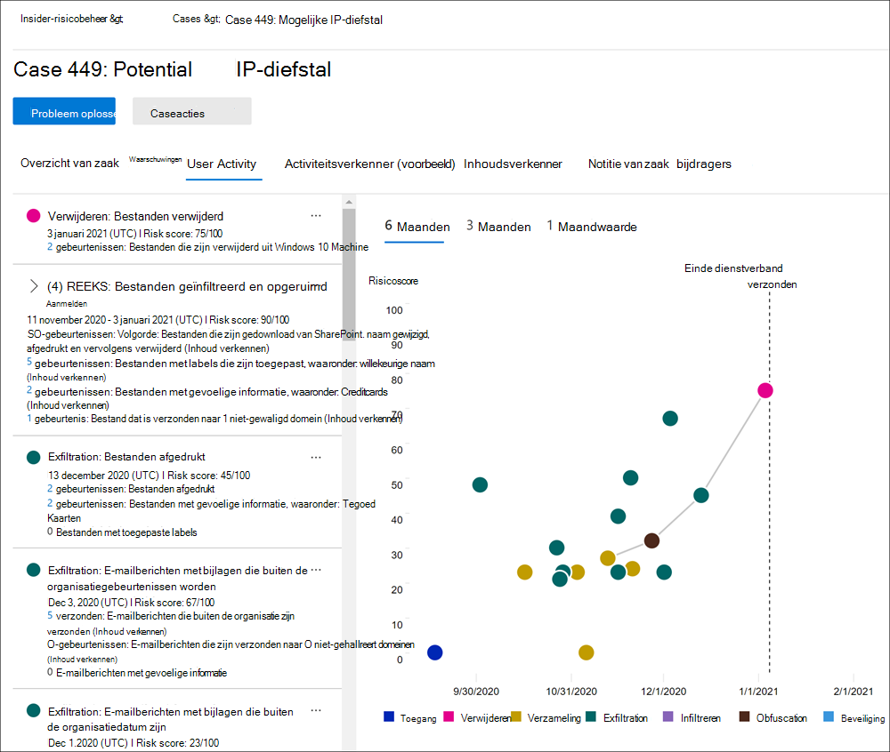

# Meer informatie over insider risk management in Microsoft 365

Insider risk management is een complianceoplossing in Microsoft 365 waarmee interne risico's worden geminimaliseerd doordat u schadelijke en onbedoelde activiteiten in uw organisatie kunt opsporen, onderzoeken en erop kunt reageren. Met beleidsregels voor insiderrisico's kunt u de soorten risico's definiëren die u in uw organisatie kunt identificeren en detecteren, inclusief het handelen in zaken en het escaleren van zaken naar Microsoft Advanced eDiscovery indien nodig. Risicoanalisten in uw organisatie kunnen snel passende acties uitvoeren om ervoor te zorgen dat gebruikers voldoen aan de nalevingsstandaarden van uw organisatie.

Bekijk de onderstaande video's om te leren hoe insiderrisicobeheer uw organisatie kan helpen bij het voorkomen, detecteren en bevatten van risico's, terwijl u prioriteit geeft aan de waarden, cultuur en gebruikerservaring van uw organisatie:
 
 

**Insider-oplossing voor risicobeheer & ontwikkeling:**
>[!VIDEO https://www.microsoft.com/videoplayer/embed/RE4j9CN]
 

**Insider-werkstroom voor risicobeheer:**
>[!VIDEO https://www.microsoft.com/videoplayer/embed/RE4OUXB]

## Moderne risicopijnpunten

Het beheren en minimaliseren van risico's in uw organisatie begint met het begrijpen van de soorten risico's op de moderne werkplek. Sommige risico's worden veroorzaakt door externe gebeurtenissen en factoren die buiten de directe controle liggen. Andere risico's worden veroorzaakt door interne gebeurtenissen en gebruikersactiviteiten die kunnen worden geminimaliseerd en vermeden. Enkele voorbeelden zijn risico's van illegaal, ongepast, ongeautoriseerd of onethisch gedrag en acties van gebruikers in uw organisatie. Deze gedragingen omvatten een breed scala aan interne risico's van gebruikers:

- Lekken van gevoelige gegevens en gegevenslekken
- Schendingen van vertrouwelijkheid
- Diefstal van intellectuele eigendom (IP)
- Fraude
- Handel met voorkennis
- Overtredingen van naleving van regelgeving

Gebruikers op de moderne werkplek hebben toegang tot het maken, beheren en delen van gegevens in een breed spectrum van platforms en services. In de meeste gevallen beschikken organisaties over beperkte resources en hulpmiddelen om risico's in de hele organisatie te identificeren en te beperken, terwijl ze ook voldoen aan de privacystandaarden van gebruikers.

Insider risk management gebruikt de volledige breedte van service- en externe indicatoren om u te helpen risicoactiviteit snel te identificeren, te triagen en te handelen. Door logboeken van Microsoft 365 en Microsoft-Graph gebruiken, kunt u met insiderrisicobeheer specifieke beleidsregels definiëren om risico-indicatoren te identificeren. Met dit beleid kunt u risicovolle activiteiten identificeren en deze risico's beperken.

Insider risk management is gecentreerd rond de volgende principes:

- **Transparantie:** Balanceer de privacy van gebruikers en organisatierisico's met privacy-by-designarchitectuur.
- **Configureerbaar:** Configureerbare beleidsregels op basis van branche-, geografische en zakelijke groepen.
- **Geïntegreerd:** geïntegreerde werkstroom voor Microsoft 365 complianceoplossingen.
- **Actiebaar:** biedt inzichten voor het inschakelen van revisormeldingen, gegevensonderzoeken en gebruikersonderzoeken.

## Potentiële risico's identificeren met analyse (voorbeeld)

Met risicoanalyses voor insiders kunt u een evaluatie uitvoeren van potentiële interne risico's in uw organisatie zonder dat u een intern risicobeleid configureert. Aan de hand van deze evaluatie kan uw organisatie potentiële gebieden met een hoger gebruikersrisico identificeren en bepalen welk type en bereik van het beleid voor intern risicobeheer u wilt configureren. Deze evaluatie kan u ook helpen bij het bepalen van de behoeften voor aanvullende licenties of toekomstige optimalisatie van bestaande beleidsregels voor insiderrisico's.

Zie Insider-instellingen voor risicobeheer voor meer informatie over [insiderrisicoanalyses: Analytics.](insider-risk-management-settings.md#analytics-preview)

## Werkstroom

Met de insider-werkstroom voor risicobeheer kunt u interne risico's in uw organisatie identificeren, onderzoeken en ondernemen. Met gerichte beleidssjablonen, uitgebreide activiteitssignalering in de Microsoft 365-service en hulpprogramma's voor waarschuwings- en casebeheer kunt u actiegerichte inzichten gebruiken om snel risicovol gedrag te identificeren en erop te reageren.

Voor het identificeren en oplossen van interne risicoactiviteiten en complianceproblemen met insider risk management in Microsoft 365 wordt de volgende werkstroom gebruikt:

### Beleid

[Insider-beleid voor risicobeheer](insider-risk-management-policies.md) wordt gemaakt met vooraf gedefinieerde sjablonen en beleidsvoorwaarden die bepalen welke triggeringgebeurtenissen en risico-indicatoren worden onderzocht in uw organisatie. Deze voorwaarden omvatten de manier waarop risico-indicatoren worden gebruikt voor waarschuwingen, welke gebruikers zijn opgenomen in het beleid, welke services prioriteit krijgen en de controleperiode.

U kunt kiezen uit de volgende beleidssjablonen om snel aan de slag te gaan met insiderrisicobeheer:

- [Gegevensdiefstal door vertrekkende gebruikers](insider-risk-management-policies.md#data-theft-by-departing-users)
- [Algemene gegevenslekken](insider-risk-management-policies.md#general-data-leaks)
- [Gegevenslekken door prioriteitsgebruikers (voorbeeld)](insider-risk-management-policies.md#data-leaks-by-priority-users-preview)
- [Gegevenslekken door ontevreden gebruikers (voorbeeld)](insider-risk-management-policies.md#data-leaks-by-disgruntled-users-preview)
- [Algemene schendingen van het beveiligingsbeleid (voorbeeld)](insider-risk-management-policies.md#general-security-policy-violations-preview)
- [Schendingen van beveiligingsbeleid door vertrekkende werknemers (voorbeeld)](insider-risk-management-policies.md#security-policy-violations-by-departing-users-preview)
- [Schendingen van het beveiligingsbeleid door prioriteitsgebruikers (voorbeeld)](insider-risk-management-policies.md#security-policy-violations-by-priority-users-preview)
- [Schendingen van beveiligingsbeleid door ontevreden gebruikers (voorbeeld)](insider-risk-management-policies.md#security-policy-violations-by-disgruntled-users-preview)

### Waarschuwingen

Waarschuwingen worden automatisch gegenereerd door risico-indicatoren die overeenkomen met de beleidsvoorwaarden en worden weergegeven in het [dashboard Waarschuwingen.](insider-risk-management-activities.md#alert-dashboard) Dit dashboard biedt een snelle weergave van alle waarschuwingen die moeten worden bekeken, waarschuwingen in de tijd en waarschuwingsstatistieken voor uw organisatie. Alle beleidswaarschuwingen worden weergegeven met de volgende informatie om u te helpen snel de status van bestaande waarschuwingen en nieuwe waarschuwingen te identificeren die actie moeten ondernemen:

- Status
- Ernst
- Tijd gedetecteerd
- Case
- Status van zaak

### Triage

Nieuwe gebruikersactiviteiten die onderzoek nodig hebben, genereren automatisch waarschuwingen die zijn toegewezen aan de status *Behoeften controleren.* Revisoren kunnen deze waarschuwingen snel identificeren en controleren, evalueren en triagen.

Waarschuwingen worden opgelost door een nieuwe zaak te openen, de waarschuwing toe te wijzen aan een bestaand geval of de waarschuwing te afwijzen. Met behulp van waarschuwingsfilters kunt u snel waarschuwingen identificeren op basis van status, ernst of tijd die is gedetecteerd. Als onderdeel van het triageproces kunnen revisoren waarschuwingsdetails bekijken voor de activiteiten die zijn geïdentificeerd door het beleid, gebruikersactiviteit weergeven die is gekoppeld aan de beleidsmatch, de ernst van de waarschuwing bekijken en gebruikersprofielgegevens bekijken.

### Onderzoeken

Snel alle activiteiten voor een geselecteerde gebruiker onderzoeken met [gebruikersactiviteitsrapporten (voorbeeld)](insider-risk-management-activities.md#user-activity-reports-preview). Met deze rapporten kunnen onderzoekers in uw organisatie activiteiten voor specifieke gebruikers voor een bepaalde periode bekijken zonder deze tijdelijk of expliciet toe te wijzen aan een beleid voor insiderrisicobeheer. Na het onderzoeken van activiteiten voor een gebruiker, kunnen de onderzoekers afzonderlijke activiteiten als goedaardig afdoen, een koppeling naar het rapport delen of e-mailen met andere onderzoeker, of ervoor kiezen om de gebruiker tijdelijk of expliciet toe te wijzen aan een beleid voor insiderrisicobeheer.

[Er](insider-risk-management-cases.md) worden gevallen gemaakt voor waarschuwingen waarvoor een diepere controle en onderzoek van de activiteitendetails en -omstandigheden rond het beleid nodig zijn. Het **dashboard Hoofdzaken** biedt een overzicht van alle actieve zaken, openstaande zaken in de tijd en casestatistieken voor uw organisatie. Revisoren kunnen snel zaken filteren op status, de datum waarop de zaak is geopend en de datum waarop de zaak het laatst is bijgewerkt.

Als u een zaak selecteert op het dashboard van de zaak, wordt de zaak geopend voor onderzoek en controle. Deze stap is het hart van de insider-werkstroom voor risicobeheer. In dit gebied worden risicoactiviteiten, beleidsvoorwaarden, waarschuwingendetails en gebruikersgegevens gesynthetiseerd in een geïntegreerde weergave voor revisoren. De primaire onderzoekshulpmiddelen in dit gebied zijn:

- **Gebruikersactiviteit:** Gebruikersactiviteit wordt automatisch weergegeven in een interactieve grafiek waarin activiteiten in de tijd en op risiconiveau worden weergegeven voor huidige of eerdere risicoactiviteiten. Revisoren kunnen snel de volledige risicogeschiedenis voor de gebruiker filteren en bekijken en inzoomen op specifieke activiteiten voor meer informatie.
- **Inhoudsverkenner:** Alle gegevensbestanden en e-mailberichten die zijn gekoppeld aan waarschuwingsactiviteiten, worden automatisch vastgelegd en weergegeven in de Inhoudsverkenner. Revisoren kunnen bestanden en berichten filteren en weergeven op gegevensbron, bestandstype, tags, gesprekken en nog veel meer kenmerken.
- **Case notes**: Revisoren kunnen notities voor een zaak in de sectie Case Notes geven. Deze lijst bevat alle notities in een centrale weergave en bevat revisor- en datumgegevens.

Bovendien kunt u met het nieuwe [auditlogboek (preview)](insider-risk-management-audit-log.md) op de hoogte blijven van de acties die zijn uitgevoerd met functies voor insiderrisicobeheer. Met deze resource kunt u de acties van gebruikers die zijn toegewezen aan een of meer rollengroepen voor insiderrisicobeheer onafhankelijk bekijken.

### Actie

Nadat zaken zijn onderzocht, kunnen revisoren snel actie ondernemen om de zaak op te lossen of samen te werken met andere belanghebbenden met risico's in uw organisatie. Als gebruikers per ongeluk of per ongeluk beleidsvoorwaarden schenden, kan een eenvoudige herinneringsbericht worden verzonden naar de gebruiker via kennisgevingssjablonen die u voor uw organisatie kunt aanpassen. Deze kennisgevingen kunnen fungeren als eenvoudige herinneringen of kunnen de gebruiker leiden tot bijscholing of richtlijnen om toekomstig risicovol gedrag te voorkomen. Zie Kennisgevingssjablonen voor [insiderrisicobeheer voor meer informatie.](insider-risk-management-notices.md)

In de ernstigere situaties moet u mogelijk de case-informatie over insiderrisicobeheer delen met andere revisoren of services in uw organisatie. Insider-risicobeheer is nauw geïntegreerd met andere Microsoft 365 oplossingen voor compliance om u te helpen bij het oplossen van end-to-endrisico's.

- **Advanced eDiscovery:** Als u een zaak voor onderzoek escaleert, kunt u gegevens en het beheer van de zaak overbrengen naar Advanced eDiscovery in Microsoft 365. Advanced eDiscovery biedt een end-to-end werkstroom voor het bewaren, verzamelen, controleren, analyseren en exporteren van inhoud die reageert op interne en externe onderzoeken van uw organisatie. Hiermee kunnen juridische teams de volledige werkstroom voor meldingen in juridische wacht houden beheren. Zie Overzicht van Advanced eDiscovery in Microsoft 365 voor meer informatie over Advanced eDiscovery [gevallen.](overview-ediscovery-20.md)
- **Office 365 Management API's-integratie (preview)**: Insider risk management ondersteunt het exporteren van waarschuwingsgegevens naar siem-services (Security Information and Event Management) via de Office 365 Management API's. Als u toegang hebt tot waarschuwingsgegevens op het platform, past dit het beste bij de risicoprocessen van uw organisatie, waardoor u meer flexibiliteit hebt bij het uitvoeren van risicoactiviteiten. Zie Waarschuwingen exporteren voor meer informatie over het exporteren van waarschuwingsgegevens Office 365 [beheer-API's.](insider-risk-management-settings.md#export-alerts-preview)

> [!NOTE]
> Bedankt voor uw feedback en ondersteuning tijdens het voorbeeld van de ServiceNow-connector. We hebben besloten om de preview van ServiceNow-connector te beëindigen en de ondersteuning voor insiderrisicobeheer te beëindigen op 30 november 2020. We evalueren actief alternatieve methoden om klanten serviceNow-integratie te bieden in insider risk management.

## Scenario's

Insider-risicobeheer kan u helpen bij het opsporen, onderzoeken en ondernemen van acties om interne risico's in uw organisatie in verschillende veelvoorkomende scenario's te beperken:

### Gegevensdiefstal door vertrekkende gebruikers

Wanneer gebruikers een organisatie verlaten, hetzij vrijwillig, hetzij als gevolg van beëindiging, zijn er vaak legitieme zorgen dat bedrijfs-, klant- en gebruikersgegevens in gevaar komen. Gebruikers kunnen ervan uitgaan dat projectgegevens niet eigendom zijn of dat ze geneigd zijn bedrijfsgegevens te nemen voor persoonlijk gewin en in strijd met het bedrijfsbeleid en wettelijke standaarden. Insider-beleid voor risicobeheer dat de gegevensdiefstal gebruikt [door de](insider-risk-management-policies.md#policy-templates) beleidssjabloon voor vertrekkende gebruikers, detecteert automatisch activiteiten die gewoonlijk aan dit type diefstal zijn gekoppeld. Met dit beleid ontvangt u automatisch waarschuwingen voor verdachte activiteiten die zijn gekoppeld aan gegevensdiefstal door vertrekkende gebruikers, zodat u passende onderzoeken kunt uitvoeren. Het configureren [van Microsoft 365 HR-connector](import-hr-data.md) voor uw organisatie is vereist voor deze beleidssjabloon.

### Opzettelijk of onbedoeld lekken van gevoelige of vertrouwelijke informatie

In de meeste gevallen doen gebruikers hun best om gevoelige of vertrouwelijke informatie correct te verwerken. Maar soms kunnen gebruikers fouten maken en worden gegevens per ongeluk buiten uw organisatie gedeeld of in strijd met uw beleid voor informatiebeveiliging. In andere omstandigheden kunnen gebruikers opzettelijk gevoelige en vertrouwelijke informatie met kwaadwillende bedoelingen en voor mogelijk persoonlijk gewin lekken of delen. Insider-beleid voor risicobeheer dat is gemaakt met behulp van de volgende beleidsjablonen voor gegevenslekken, detecteert automatisch activiteiten die gewoonlijk worden gekoppeld aan het delen van gevoelige of vertrouwelijke informatie:

- [Algemene gegevenslekken](insider-risk-management-policies.md#general-data-leaks)
- [Gegevenslekken door prioriteitsgebruikers (voorbeeld)](insider-risk-management-policies.md#data-leaks-by-priority-users-preview)
- [Gegevenslekken door ontevreden gebruikers (voorbeeld)](insider-risk-management-policies.md#data-leaks-by-disgruntled-users-preview)

## Opzettelijke of onbedoelde schendingen van het beveiligingsbeleid (voorbeeld)

Gebruikers hebben meestal een grote mate van controle bij het beheren van hun apparaten op de moderne werkplek. Dit besturingselement kan machtigingen bevatten voor het installeren of verwijderen van toepassingen die nodig zijn voor de uitvoering van hun taken of de mogelijkheid om beveiligingsfuncties van apparaten tijdelijk uit te schakelen. Of deze activiteit per ongeluk, per ongeluk of schadelijk is, dit gedrag kan risico's opleveren voor uw organisatie en is belangrijk om te identificeren en te handelen om dit te minimaliseren. Om deze risicovolle beveiligingsactiviteiten identiteit te geven, worden in de volgende sjablonen voor beveiligingsbeleidsovertredingen van insiders beveiligingsrisico's beoordeeld en worden Microsoft Defender voor eindpuntwaarschuwingen gebruikt om inzichten te geven voor beveiligingsgerelateerde activiteiten:

- [Algemene schendingen van het beveiligingsbeleid (voorbeeld)](insider-risk-management-policies.md#general-security-policy-violations-preview)
- [Schendingen van beveiligingsbeleid door vertrekkende werknemers (voorbeeld)](insider-risk-management-policies.md#security-policy-violations-by-departing-users-preview)
- [Schendingen van het beveiligingsbeleid door prioriteitsgebruikers (voorbeeld)](insider-risk-management-policies.md#security-policy-violations-by-priority-users-preview)
- [Schendingen van beveiligingsbeleid door ontevreden gebruikers (voorbeeld)](insider-risk-management-policies.md#security-policy-violations-by-disgruntled-users-preview)

## Beleid voor gebruikers op basis van positie, toegangsniveau of risicogeschiedenis (voorbeeld)

Gebruikers in uw organisatie kunnen verschillende risiconiveaus hebben, afhankelijk van hun positie, toegangsniveau tot gevoelige informatie of risicogeschiedenis. Deze structuur kan bestaan uit leden van het leidinggevend leiderschapsteam van uw organisatie, IT-beheerders met uitgebreide bevoegdheden voor gegevens- en netwerktoegang, of gebruikers met een verleden van riskante activiteiten. In deze omstandigheden zijn een nauwere controle en een agressievere risicoscore belangrijk om waarschuwingen voor onderzoek en snelle actie aan de oppervlakte te brengen. Als u risicovolle activiteiten voor deze typen gebruikers wilt identificeren, kunt u gebruikersgroepen met prioriteit maken en beleid maken op basis van de volgende beleidssjablonen:

- [Schendingen van het beveiligingsbeleid door prioriteitsgebruikers (voorbeeld)](insider-risk-management-policies.md#security-policy-violations-by-priority-users-preview)
- [Gegevenslekken door prioriteitsgebruikers (voorbeeld)](insider-risk-management-policies.md#data-leaks-by-priority-users-preview)

## Acties en gedragingen van ontevreden gebruikers (voorbeeld)

Arbeidsvoorwaarden benadrukken dat gebeurtenissen invloed kunnen hebben op het gedrag van gebruikers op verschillende manieren die betrekking hebben op insiderrisico's. Deze stressoren kunnen een slechte prestatiebeoordeling zijn, een positiedegradatie of de gebruiker die in een prestatiebeoordelingsplan wordt geplaatst. Hoewel de meeste gebruikers niet kwaadwillig reageren op deze gebeurtenissen, kan de stress van deze acties ertoe leiden dat sommige gebruikers acties uitvoeren die ze normaal gesproken niet overwegen in normale omstandigheden. Om deze typen risicovolle activiteiten te identiteiten te helpen, worden in de volgende beleidssjablonen voor insiderrisicobeheer de Microsoft 365 HR-connector gebruikt en worden risicoindicatoren voor gedragingen in de buurt van stress of gebeurtenissen in de buurt van werknemers beoordeeld:

- [Gegevenslekken door ontevreden gebruikers (voorbeeld)](insider-risk-management-policies.md#data-leaks-by-disgruntled-users-preview)
- [Schendingen van beveiligingsbeleid door ontevreden gebruikers (voorbeeld)](insider-risk-management-policies.md#security-policy-violations-by-disgruntled-users-preview)

## Klaar om aan de slag te gaan?

- Zie [Plan for insider risk management for](insider-risk-management-plan.md) how to prepare to enable insider risk management policies in your organization .
- Zie [Aan de slag met instellingen voor insiderrisicobeheer om](insider-risk-management-settings.md) globale instellingen voor insiderrisicobeleid te configureren.
- Zie [Aan de slag met insider risk management om](insider-risk-management-configure.md) vereisten te configureren, beleid te maken en waarschuwingen te ontvangen.
