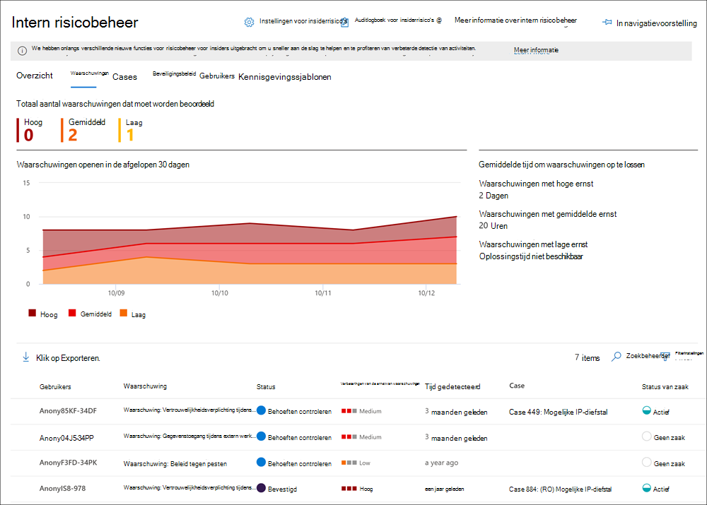

# Meer informatie over insider risk management in Microsoft 365Learn about insider risk management in Microsoft 365

Insider risk management is een complianceoplossing in Microsoft 365 waarmee interne risico's worden geminimaliseerd doordat u schadelijke en onbedoelde activiteiten in uw organisatie kunt opsporen, onderzoeken en erop kunt reageren.Insider risk management is a compliance solution in Microsoft 365 that helps minimize internal risks by enabling you to detect, investigate, and act on malicious and inadvertent activities in your organization. Met beleidsregels voor insiderrisico's kunt u de soorten risico's definiëren die u in uw organisatie kunt identificeren en detecteren, inclusief het handelen in zaken en het escaleren van zaken naar Microsoft Advanced eDiscovery indien nodig.Insider risk policies allow you to define the types of risks to identify and detect in your organization, including acting on cases and escalating cases to Microsoft Advanced eDiscovery if needed. Risicoanalisten in uw organisatie kunnen snel passende acties uitvoeren om ervoor te zorgen dat gebruikers voldoen aan de nalevingsstandaarden van uw organisatie.Risk analysts in your organization can quickly take appropriate actions to make sure users are compliant with your organization's compliance standards.

Bekijk de onderstaande video om te zien hoe insider risk management uw organisatie kan helpen bij het voorkomen, detecteren en bevatten van risico's terwijl u prioriteit geeft aan uw organisatiewaarden, cultuur en gebruikerservaring:Watch the video below to learn how insider risk management can help your organization prevent, detect, and contain risks while prioritizing your organization values, culture, and user experience:
 
 
>[!VIDEO https://www.microsoft.com/videoplayer/embed/RE4j9CN]

## Moderne risicopijnpuntenModern risk pain points

Het beheren en minimaliseren van risico's in uw organisatie begint met het begrijpen van de soorten risico's op de moderne werkplek.Managing and minimizing risk in your organization starts with understanding the types of risks found in the modern workplace. Sommige risico's worden veroorzaakt door externe gebeurtenissen en factoren die buiten de directe controle liggen.Some risks are driven by external events and factors that are outside of direct control. Andere risico's worden veroorzaakt door interne gebeurtenissen en gebruikersactiviteiten die kunnen worden geminimaliseerd en vermeden.Other risks are driven by internal events and user activities that can be minimized and avoided. Enkele voorbeelden zijn risico's van illegaal, ongepast, ongeautoriseerd of onethisch gedrag en acties van gebruikers in uw organisatie.Some examples are risks from illegal, inappropriate, unauthorized, or unethical behavior and actions by users in your organization. Deze gedragingen omvatten een breed scala aan interne risico's van gebruikers:These behaviors include a broad range of internal risks from users:

- Lekken van gevoelige gegevens en gegevenslekkenLeaks of sensitive data and data spillage
- Schendingen van vertrouwelijkheidConfidentiality violations
- Diefstal van intellectuele eigendom (IP)Intellectual property (IP) theft
- FraudeFraud
- Handel met voorkennisInsider trading
- Overtredingen van naleving van regelgevingRegulatory compliance violations

Gebruikers op de moderne werkplek hebben toegang tot het maken, beheren en delen van gegevens in een breed spectrum van platforms en services.Users in the modern workplace have access to create, manage, and share data across a broad spectrum of platforms and services. In de meeste gevallen beschikken organisaties over beperkte resources en hulpmiddelen om risico's in de hele organisatie te identificeren en te beperken, terwijl ze ook voldoen aan de privacystandaarden van gebruikers.In most cases, organizations have limited resources and tools to identify and mitigate organization-wide risks while also meeting user privacy standards.

Insider risk management gebruikt de volledige breedte van service- en externe indicatoren om u te helpen risicoactiviteit snel te identificeren, te triagen en te handelen.Insider risk management uses the full breadth of service and 3rd-party indicators to help you quickly identify, triage, and act on risk activity. Door logboeken van Microsoft 365 en Microsoft-Graph gebruiken, kunt u met insiderrisicobeheer specifieke beleidsregels definiëren om risico-indicatoren te identificeren.By using logs from Microsoft 365 and Microsoft Graph, insider risk management allows you to define specific policies to identify risk indicators. Met dit beleid kunt u risicovolle activiteiten identificeren en deze risico's beperken.These policies allow you to identify risky activities and to act to mitigate these risks.

Insider risk management is gecentreerd rond de volgende principes:Insider risk management is centered around the following principles:

- **Transparantie:** Balanceer de privacy van gebruikers en organisatierisico's met privacy-by-designarchitectuur.**Transparency**: Balance user privacy versus organization risk with privacy-by-design architecture.
- **Configureerbaar:** Configureerbare beleidsregels op basis van branche-, geografische en zakelijke groepen.**Configurable**: Configurable policies based on industry, geographical, and business groups.
- **Geïntegreerd:** geïntegreerde werkstroom voor Microsoft 365 complianceoplossingen.**Integrated**: Integrated workflow across Microsoft 365 compliance solutions.
- **Actiebaar:** biedt inzichten voor het inschakelen van revisormeldingen, gegevensonderzoeken en gebruikersonderzoeken.**Actionable**: Provides insights to enable reviewer notifications, data investigations, and user investigations.

## Potentiële risico's identificeren met analyse (voorbeeld)Identifying potential risks with analytics (preview)

Met insider risk analytics kunt u een evaluatie uitvoeren van potentiële insiderrisico's in uw organisatie zonder dat u beleidsregels voor insiderrisico's configureert.Insider risk analytics enables you to conduct an evaluation of potential insider risks in your organization without configuring any insider risk policies. Deze evaluatie kan uw organisatie helpen bij het identificeren van mogelijke gebieden met een hoger gebruikersrisico en het bepalen van het type en het bereik van beleidsregels voor insiderrisicobeheer dat u mogelijk wilt configureren.This evaluation can help your organization identify potential areas of higher user risk and help determine the type and scope of insider risk management policies you may consider configuring. Deze evaluatie kan u ook helpen bij het bepalen van de behoeften voor aanvullende licenties of toekomstige optimalisatie van bestaande beleidsregels voor insiderrisico's.This evaluation may also help you determine needs for additional licensing or future optimization of existing insider risk policies.

Zie Insider-instellingen voor risicobeheer voor meer informatie over [insiderrisicoanalyses: Analytics.](insider-risk-management-settings.md#analytics-preview)To learn more about insider risk analytics, see [Insider risk management settings: Analytics](insider-risk-management-settings.md#analytics-preview).

## WerkstroomWorkflow

Met de insider-werkstroom voor risicobeheer kunt u interne risico's in uw organisatie identificeren, onderzoeken en ondernemen.The insider risk management workflow helps you identify, investigate, and take action to address internal risks in your organization. Met gerichte beleidssjablonen, uitgebreide activiteitssignalering in de Microsoft 365-service en hulpprogramma's voor waarschuwings- en casebeheer kunt u actiegerichte inzichten gebruiken om snel risicovol gedrag te identificeren en erop te reageren.With focused policy templates, comprehensive activity signaling across the Microsoft 365 service, and alert and case management tools, you can use actionable insights to quickly identify and act on risky behavior.

Voor het identificeren en oplossen van interne risicoactiviteiten en complianceproblemen met insider risk management in Microsoft 365 wordt de volgende werkstroom gebruikt:Identifying and resolving internal risk activities and compliance issues with insider risk management in Microsoft 365 uses the following workflow:

### BeleidPolicies

[Insider-beleid voor risicobeheer](insider-risk-management-policies.md) wordt gemaakt met vooraf gedefinieerde sjablonen en beleidsvoorwaarden die bepalen welke triggeringgebeurtenissen en risico-indicatoren worden onderzocht in uw organisatie.[Insider risk management policies](insider-risk-management-policies.md) are created using pre-defined templates and policy conditions that define what triggering events and risk indicators are examined in your organization. Deze voorwaarden omvatten de manier waarop risico-indicatoren worden gebruikt voor waarschuwingen, welke gebruikers zijn opgenomen in het beleid, welke services prioriteit krijgen en de controleperiode.These conditions include how risk indicators are used for alerts, what users are included in the policy, which services are prioritized, and the monitoring time period.

U kunt kiezen uit de volgende beleidssjablonen om snel aan de slag te gaan met insiderrisicobeheer:You can select from the following policy templates to quickly get started with insider risk management:

- [Gegevensdiefstal door vertrekkende gebruikersData theft by departing users](insider-risk-management-policies.md#data-theft-by-departing-users)
- [Algemene gegevenslekkenGeneral data leaks](insider-risk-management-policies.md#general-data-leaks)
- [Gegevenslekken door prioriteitsgebruikers (voorbeeld)Data leaks by priority users (preview)](insider-risk-management-policies.md#data-leaks-by-priority-users-preview)
- [Gegevenslekken door ontevreden gebruikers (preview)Data leaks by disgruntled users (preview)](insider-risk-management-policies.md#data-leaks-by-disgruntled-users-preview)
- [Schendingen van het algemene beveiligingsbeleid (voorbeeld)General security policy violations (preview)](insider-risk-management-policies.md#general-security-policy-violations-preview)
- [Schendingen van het beveiligingsbeleid door vertrekkende gebruikers (voorbeeld)Security policy violations by departing users (preview)](insider-risk-management-policies.md#security-policy-violations-by-departing-users-preview)
- [Schendingen van beveiligingsbeleid door prioriteitsgebruikers (voorbeeld)Security policy violations by priority users (preview)](insider-risk-management-policies.md#security-policy-violations-by-priority-users-preview)
- [Schendingen van beveiligingsbeleid door ontevreden gebruikers (voorbeeld)Security policy violations by disgruntled users (preview)](insider-risk-management-policies.md#security-policy-violations-by-disgruntled-users-preview)

### WaarschuwingenAlerts

Waarschuwingen worden automatisch gegenereerd door risico-indicatoren die overeenkomen met de beleidsvoorwaarden en worden weergegeven in het [dashboard Waarschuwingen.](insider-risk-management-alerts.md)Alerts are automatically generated by risk indicators that match policy conditions and are displayed in the [Alerts dashboard](insider-risk-management-alerts.md). Dit dashboard biedt een snelle weergave van alle waarschuwingen die moeten worden bekeken, waarschuwingen in de tijd en waarschuwingsstatistieken voor uw organisatie.This dashboard enables a quick view of all alerts needing review, open alerts over time, and alert statistics for your organization. Alle beleidswaarschuwingen worden weergegeven met de volgende informatie om u te helpen snel de status van bestaande waarschuwingen en nieuwe waarschuwingen te identificeren die actie moeten ondernemen:All policy alerts are displayed with the following information to help you quickly identify the status of existing alerts and new alerts that need action:

- StatusStatus
- ErnstSeverity
- Tijd gedetecteerdTime detected
- CaseCase
- Status van zaakCase status

### TriageTriage

Nieuwe gebruikersactiviteiten die onderzoek nodig hebben, genereren automatisch waarschuwingen die zijn toegewezen aan de status *Behoeften controleren.*New user activities that need investigation automatically generate alerts that are assigned a *Needs review* status. Revisoren kunnen deze waarschuwingen snel identificeren en controleren, evalueren en triagen.Reviewers can quickly identify and review, evaluate, and triage these alerts.

Waarschuwingen worden opgelost door een nieuwe zaak te openen, de waarschuwing toe te wijzen aan een bestaand geval of de waarschuwing te afwijzen.Alerts are resolved by opening a new case, assigning the alert to an existing case, or dismissing the alert. Met behulp van waarschuwingsfilters kunt u snel waarschuwingen identificeren op basis van status, ernst of tijd die is gedetecteerd.Using alert filters, it's easy to quickly identify alerts by status, severity, or time detected. Als onderdeel van het triageproces kunnen revisoren waarschuwingsdetails bekijken voor de activiteiten die zijn geïdentificeerd door het beleid, gebruikersactiviteit weergeven die is gekoppeld aan de beleidsmatch, de ernst van de waarschuwing bekijken en gebruikersprofielgegevens bekijken.As part of the triage process, reviewers can view alert details for the activities identified by the policy, view user activity associated with the policy match, see the severity of the alert, and review user profile information.

### OnderzoekenInvestigate

[Er](insider-risk-management-cases.md) worden gevallen gemaakt voor waarschuwingen waarvoor een diepere controle en onderzoek van de activiteitendetails en -omstandigheden rond het beleid nodig zijn.[Cases](insider-risk-management-cases.md) are created for alerts that require deeper review and investigation of the activity details and circumstances around the policy match. Het **dashboard Hoofdzaken** biedt een overzicht van alle actieve zaken, openstaande zaken in de tijd en casestatistieken voor uw organisatie.The **Case dashboard** provides an all-up view of all active cases, open cases over time, and case statistics for your organization. Revisoren kunnen snel zaken filteren op status, de datum waarop de zaak is geopend en de datum waarop de zaak het laatst is bijgewerkt.Reviewers can quickly filter cases by status, the date the case was opened, and the date the case was last updated.

Als u een zaak selecteert op het dashboard van de zaak, wordt de zaak geopend voor onderzoek en controle.Selecting a case on the case dashboard opens the case for investigation and review. Deze stap is het hart van de insider-werkstroom voor risicobeheer.This step is the heart of the insider risk management workflow. In dit gebied worden risicoactiviteiten, beleidsvoorwaarden, waarschuwingendetails en gebruikersgegevens gesynthetiseerd in een geïntegreerde weergave voor revisoren.This area is where risk activities, policy conditions, alerts details, and user details are synthesized into an integrated view for reviewers. De primaire onderzoekshulpmiddelen in dit gebied zijn:The primary investigation tools in this area are:

- **Gebruikersactiviteit:** Gebruikersactiviteit wordt automatisch weergegeven in een interactieve grafiek waarin activiteiten in de tijd en op risiconiveau worden weergegeven voor huidige of eerdere risicoactiviteiten.**User activity**: User activity is automatically displayed in an interactive chart that plots activities over time and by risk level for current or past risk activities. Revisoren kunnen snel de volledige risicogeschiedenis voor de gebruiker filteren en bekijken en inzoomen op specifieke activiteiten voor meer informatie.Reviewers can quickly filter and view the entire risk history for the user and drill into specific activities for more details.
- **Inhoudsverkenner:** Alle gegevensbestanden en e-mailberichten die zijn gekoppeld aan waarschuwingsactiviteiten, worden automatisch vastgelegd en weergegeven in de Inhoudsverkenner.**Content explorer**: All data files and email messages associated with alert activities are automatically captured and displayed in the Content explorer. Revisoren kunnen bestanden en berichten filteren en weergeven op gegevensbron, bestandstype, tags, gesprekken en nog veel meer kenmerken.Reviewers can filter and view files and messages by data source, file type, tags, conversation, and many more attributes.
- **Case notes**: Revisoren kunnen notities voor een zaak in de sectie Case Notes geven.**Case notes**: Reviewers can provide notes for a case in the Case Notes section. Deze lijst bevat alle notities in een centrale weergave en bevat revisor- en datumgegevens.This list consolidates all notes in a central view and include reviewer and date submitted information.

Bovendien kunt u met het nieuwe [auditlogboek (preview)](insider-risk-management-audit-log.md) op de hoogte blijven van de acties die zijn uitgevoerd met functies voor insiderrisicobeheer.Additionally, the new [Audit log (preview)](insider-risk-management-audit-log.md) enables you to stay informed of the actions that were taken on insider risk management features. Met deze resource kunt u de acties van gebruikers die zijn toegewezen aan een of meer rollengroepen voor insiderrisicobeheer onafhankelijk bekijken.This resource allows an independent review of the actions taken by users assigned to one or more insider risk management role groups.

### ActieAction

Nadat zaken zijn onderzocht, kunnen revisoren snel actie ondernemen om de zaak op te lossen of samen te werken met andere belanghebbenden met risico's in uw organisatie.After cases are investigated, reviewers can quickly act to resolve the case or collaborate with other risk stakeholders in your organization. Als gebruikers per ongeluk of per ongeluk beleidsvoorwaarden schenden, kan een eenvoudige herinneringsbericht worden verzonden naar de gebruiker via kennisgevingssjablonen die u voor uw organisatie kunt aanpassen.If users accidentally or inadvertently violate policy conditions, a simple reminder notice can be sent to the user from notice templates you can customize for your organization. Deze kennisgevingen kunnen fungeren als eenvoudige herinneringen of kunnen de gebruiker leiden tot bijscholing of richtlijnen om toekomstig risicovol gedrag te voorkomen.These notices may serve as simple reminders or may direct the user to refresher training or guidance to help prevent future risky behavior. Zie Kennisgevingssjablonen voor [insiderrisicobeheer voor meer informatie.](insider-risk-management-notices.md)For more information, see [Insider risk management notice templates](insider-risk-management-notices.md).

In de ernstigere situaties moet u mogelijk de case-informatie over insiderrisicobeheer delen met andere revisoren of services in uw organisatie.In the more serious situations, you may need to share the insider risk management case information with other reviewers or services in your organization. Insider-risicobeheer is nauw geïntegreerd met andere Microsoft 365 oplossingen voor compliance om u te helpen bij het oplossen van end-to-endrisico's.Insider risk management is tightly integrated with other Microsoft 365 compliance solutions to help you with end-to-end risk resolution.

- **Advanced eDiscovery:** Als u een zaak voor onderzoek escaleert, kunt u gegevens en het beheer van de zaak overbrengen naar Advanced eDiscovery in Microsoft 365.**Advanced eDiscovery**: Escalating a case for investigation allows you to transfer data and management of the case to Advanced eDiscovery in Microsoft 365. Advanced eDiscovery biedt een end-to-end werkstroom voor het bewaren, verzamelen, controleren, analyseren en exporteren van inhoud die reageert op interne en externe onderzoeken van uw organisatie.Advanced eDiscovery provides an end-to-end workflow to preserve, collect, review, analyze, and export content that's responsive to your organization's internal and external investigations. Hiermee kunnen juridische teams de volledige werkstroom voor meldingen in juridische wacht houden beheren.It allows legal teams to manage the entire legal hold notification workflow. Zie Overzicht van Advanced eDiscovery in Microsoft 365 voor meer informatie over Advanced eDiscovery [gevallen.](overview-ediscovery-20.md)To learn more about Advanced eDiscovery cases, see [Overview of Advanced eDiscovery in Microsoft 365](overview-ediscovery-20.md).
- **Office 365 Management API's-integratie (preview)**: Insider risk management ondersteunt het exporteren van waarschuwingsgegevens naar siem-services (Security Information and Event Management) via de Office 365 Management API's.**Office 365 Management APIs integration (preview)**: Insider risk management supports exporting alert information to security information and event management (SIEM) services via the Office 365 Management APIs. Als u toegang hebt tot waarschuwingsgegevens op het platform, past dit het beste bij de risicoprocessen van uw organisatie, waardoor u meer flexibiliteit hebt bij het uitvoeren van risicoactiviteiten.Having access to alert information in the platform the best fits your organization's risk processes gives you more flexibility in how to act on risk activities. Zie Waarschuwingen exporteren voor meer informatie over het exporteren van waarschuwingsgegevens Office 365 [beheer-API's.](insider-risk-management-settings.md#export-alerts-preview)To learn more about exporting alert information with Office 365 Management APIs, see [Export alerts](insider-risk-management-settings.md#export-alerts-preview).

>[!NOTE]
>Bedankt voor uw feedback en ondersteuning tijdens het voorbeeld van de ServiceNow-connector.Thank you for your feedback and support during the preview of the ServiceNow connector. We hebben besloten om de preview van ServiceNow-connector te beëindigen en de ondersteuning voor insiderrisicobeheer te beëindigen op 30 november 2020.We've decided to end the preview of ServiceNow connector and discontinue support in insider risk management on November 30, 2020. We evalueren actief alternatieve methoden om klanten serviceNow-integratie te bieden in insider risk management.We are actively evaluating alternative methods to provide customers with ServiceNow integration in insider risk management.

## Scenario'sScenarios

Insider-risicobeheer kan u helpen bij het opsporen, onderzoeken en ondernemen van acties om interne risico's in uw organisatie in verschillende veelvoorkomende scenario's te beperken:Insider risk management can help you detect, investigate, and take action to mitigate internal risks in your organization in several common scenarios:

### Gegevensdiefstal door vertrekkende gebruikersData theft by departing users

Wanneer gebruikers een organisatie verlaten, hetzij vrijwillig, hetzij als gevolg van beëindiging, zijn er vaak legitieme zorgen dat bedrijfs-, klant- en gebruikersgegevens in gevaar komen.When users leave an organization, either voluntarily or as the result of termination, there is often legitimate concerns that company, customer, and user data are at risk. Gebruikers kunnen ervan uitgaan dat projectgegevens niet eigendom zijn of dat ze geneigd zijn bedrijfsgegevens te nemen voor persoonlijk gewin en in strijd met het bedrijfsbeleid en wettelijke standaarden.Users may innocently assume that project data isn't proprietary, or they may be tempted to take company data for personal gain and in violation of company policy and legal standards. Insider-beleid voor risicobeheer dat de gegevensdiefstal gebruikt [door de](insider-risk-management-policies.md#policy-templates) beleidssjabloon voor vertrekkende gebruikers, detecteert automatisch activiteiten die gewoonlijk aan dit type diefstal zijn gekoppeld.Insider risk management policies that use the [Data theft by departing users](insider-risk-management-policies.md#policy-templates) policy template automatically detect activities typically associated with this type of theft. Met dit beleid ontvangt u automatisch waarschuwingen voor verdachte activiteiten die zijn gekoppeld aan gegevensdiefstal door vertrekkende gebruikers, zodat u passende onderzoeken kunt uitvoeren.With this policy, you'll automatically receive alerts for suspicious activities associated with data theft by departing users so you can take appropriate investigative actions. Het configureren [van Microsoft 365 HR-connector](import-hr-data.md) voor uw organisatie is vereist voor deze beleidssjabloon.Configuring a [Microsoft 365 HR connector](import-hr-data.md) for your organization is required for this policy template.

### Opzettelijk of onbedoeld lekken van gevoelige of vertrouwelijke informatieIntentional or unintentional leak of sensitive or confidential information

In de meeste gevallen doen gebruikers hun best om gevoelige of vertrouwelijke informatie correct te verwerken.In most cases, users try their best to properly handle sensitive or confidential information. Maar soms kunnen gebruikers fouten maken en worden gegevens per ongeluk buiten uw organisatie gedeeld of in strijd met uw beleid voor informatiebeveiliging.But occasionally users may make mistakes and information is accidentally shared outside your organization or in violation of your information protection policies. In andere omstandigheden kunnen gebruikers opzettelijk gevoelige en vertrouwelijke informatie met kwaadwillende bedoelingen en voor mogelijk persoonlijk gewin lekken of delen.In other circumstances, users may intentionally leak or share sensitive and confidential information with malicious intent and for potential personal gain. Insider-beleid voor risicobeheer dat is gemaakt met behulp van de volgende beleidsjablonen voor gegevenslekken, detecteert automatisch activiteiten die gewoonlijk worden gekoppeld aan het delen van gevoelige of vertrouwelijke informatie:Insider risk management policies created using the following Data leaks policy templates automatically detect activities typically associated with sharing sensitive or confidential information:

- [Algemene gegevenslekkenGeneral data leaks](insider-risk-management-policies.md#general-data-leaks)
- [Gegevenslekken door prioriteitsgebruikers (voorbeeld)Data leaks by priority users (preview)](insider-risk-management-policies.md#data-leaks-by-priority-users-preview)
- [Gegevenslekken door ontevreden gebruikers (preview)Data leaks by disgruntled users (preview)](insider-risk-management-policies.md#data-leaks-by-disgruntled-users-preview)

## Opzettelijke of onbedoelde schendingen van het beveiligingsbeleid (voorbeeld)Intentional or unintentional security policy violations (preview)

Gebruikers hebben meestal een grote mate van controle bij het beheren van hun apparaten op de moderne werkplek.Users typically have a large degree of control when managing their devices in the modern workplace. Dit besturingselement kan machtigingen bevatten voor het installeren of verwijderen van toepassingen die nodig zijn voor de uitvoering van hun taken of de mogelijkheid om beveiligingsfuncties van apparaten tijdelijk uit te schakelen.This control may include permissions to install or uninstall applications needed in the performance of their duties or the ability to temporarily disable device security features. Of deze activiteit per ongeluk, per ongeluk of schadelijk is, dit gedrag kan risico's opleveren voor uw organisatie en is belangrijk om te identificeren en te handelen om dit te minimaliseren.Whether this activity is inadvertent, accidental, or malicious, this conduct can pose risk to your organization and is important to identify and act to minimize. Om deze risicovolle beveiligingsactiviteiten identiteit te geven, worden in de volgende sjablonen voor beveiligingsbeleidsovertredingen van insiders beveiligingsrisico's beoordeeld en worden Microsoft Defender voor eindpuntwaarschuwingen gebruikt om inzichten te geven voor beveiligingsgerelateerde activiteiten:To help identity these risky security activities, the following insider risk management security policy violation templates scores security risk indicators and uses Microsoft Defender for Endpoint alerts to provide insights for security-related activities:

- [Schendingen van het algemene beveiligingsbeleid (voorbeeld)General security policy violations (preview)](insider-risk-management-policies.md#general-security-policy-violations-preview)
- [Schendingen van het beveiligingsbeleid door vertrekkende gebruikers (voorbeeld)Security policy violations by departing users (preview)](insider-risk-management-policies.md#security-policy-violations-by-departing-users-preview)
- [Schendingen van beveiligingsbeleid door prioriteitsgebruikers (voorbeeld)Security policy violations by priority users (preview)](insider-risk-management-policies.md#security-policy-violations-by-priority-users-preview)
- [Schendingen van beveiligingsbeleid door ontevreden gebruikers (voorbeeld)Security policy violations by disgruntled users (preview)](insider-risk-management-policies.md#security-policy-violations-by-disgruntled-users-preview)

## Beleid voor gebruikers op basis van positie, toegangsniveau of risicogeschiedenis (voorbeeld)Policies for users based on position, access level, or risk history (preview)

Gebruikers in uw organisatie kunnen verschillende risiconiveaus hebben, afhankelijk van hun positie, toegangsniveau tot gevoelige informatie of risicogeschiedenis.Users in your organization may have different levels of risk depending on their position, level of access to sensitive information, or risk history. Deze structuur kan bestaan uit leden van het leidinggevend leiderschapsteam van uw organisatie, IT-beheerders met uitgebreide bevoegdheden voor gegevens- en netwerktoegang, of gebruikers met een verleden van riskante activiteiten.This structure may include members of your organization's executive leadership team, IT administrators that have extensive data and network access privileges, or users with a past history of risky activities. In deze omstandigheden zijn een nauwere controle en een agressievere risicoscore belangrijk om waarschuwingen voor onderzoek en snelle actie aan de oppervlakte te brengen.In these circumstances, closer inspection and more aggressive risk scoring are important to help surface alerts for investigation and quick action. Als u risicovolle activiteiten voor deze typen gebruikers wilt identificeren, kunt u gebruikersgroepen met prioriteit maken en beleid maken op basis van de volgende beleidssjablonen:To help identify risky activities for these types of users, you can create priority user groups and create policies from the following policy templates:

- [Schendingen van beveiligingsbeleid door prioriteitsgebruikers (voorbeeld)Security policy violations by priority users (preview)](insider-risk-management-policies.md#security-policy-violations-by-priority-users-preview)
- [Gegevenslekken door prioriteitsgebruikers (voorbeeld)Data leaks by priority users (preview)](insider-risk-management-policies.md#data-leaks-by-priority-users-preview)

## Acties en gedragingen van ontevreden gebruikers (voorbeeld)Actions and behaviors by disgruntled users (preview)

Arbeidsvoorwaarden benadrukken dat gebeurtenissen invloed kunnen hebben op het gedrag van gebruikers op verschillende manieren die betrekking hebben op insiderrisico's.Employment stresses events can impact user behavior in several ways that relate to insider risks. Deze stressoren kunnen een slechte prestatiebeoordeling zijn, een positiedegradatie of de gebruiker die in een prestatiebeoordelingsplan wordt geplaatst.These stressors may be a poor performance review, a position demotion, or the user being placement on a performance review plan. Hoewel de meeste gebruikers niet kwaadwillig reageren op deze gebeurtenissen, kan de stress van deze acties ertoe leiden dat sommige gebruikers acties uitvoeren die ze normaal gesproken niet overwegen in normale omstandigheden.Though most users do not respond maliciously to these events, the stress of these actions may result in some users to take actions they may not normally consider during normal circumstances. Om deze typen risicovolle activiteiten te identiteiten te helpen, worden in de volgende beleidssjablonen voor insiderrisicobeheer de Microsoft 365 HR-connector gebruikt en worden risicoindicatoren voor gedragingen in de buurt van stress of gebeurtenissen in de buurt van werknemers beoordeeld:To help identity these types risky activities, the following insider risk management policy templates use the Microsoft 365 HR connector and starts scoring risk indicators relating to behaviors that may occur near employment stressor events:

- [Gegevenslekken door ontevreden gebruikers (preview)Data leaks by disgruntled users (preview)](insider-risk-management-policies.md#data-leaks-by-disgruntled-users-preview)
- [Schendingen van beveiligingsbeleid door ontevreden gebruikers (voorbeeld)Security policy violations by disgruntled users (preview)](insider-risk-management-policies.md#security-policy-violations-by-disgruntled-users-preview)

## Klaar om aan de slag te gaan?Ready to get started?

- Zie [Plan for insider risk management for](insider-risk-management-plan.md) how to prepare to enable insider risk management policies in your organization .See [Plan for insider risk management](insider-risk-management-plan.md) for how to prepare to enable insider risk management policies in your organization.
- Zie [Aan de slag met instellingen voor insiderrisicobeheer om](insider-risk-management-settings.md) globale instellingen voor insiderrisicobeleid te configureren.See [Get started with insider risk management settings](insider-risk-management-settings.md) to configure global settings for insider risk policies.
- Zie [Aan de slag met insider risk management om](insider-risk-management-configure.md) vereisten te configureren, beleid te maken en waarschuwingen te ontvangen.See [Get started with insider risk management](insider-risk-management-configure.md) to configure prerequisites, create policies, and start receiving alerts.
