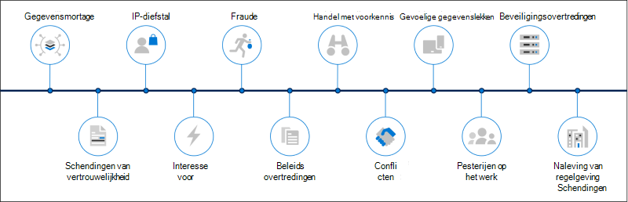
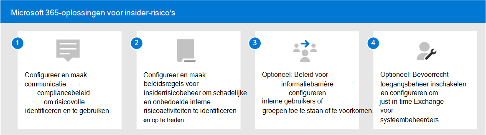

# Oplossingen voor insider-risico's in Microsoft 365

Insiderrisico's zijn een van de belangrijkste zorgen van beveiligings- en complianceprofessionals op de moderne werkplek. Uit industriestudies is gebleken dat insiderrisico's vaak worden gekoppeld aan specifieke gebruikersgebeurtenissen of -activiteiten. Het kan lastig zijn om uw organisatie tegen deze risico's te beschermen en moeilijk te beperken. Insiderrisico's zijn beveiligingslekken op verschillende gebieden en kunnen grote problemen veroorzaken voor uw organisatie, variërend van het verlies van intellectueel eigendom tot pesterijen op het werk en meer. In de volgende afbeelding worden veelvoorkomende insiderrisico's beschreven:

Microsoft 365 functies voor risicopreventie zijn ontworpen en ingebouwd in onze producten en oplossingen voor insiderrisico's. Deze oplossingen werken samen en gebruiken geavanceerde service- en externe indicatoren om u te helpen risicoactiviteit snel te identificeren, te triageeren en te handelen. De meeste oplossingen bieden een uitgebreide detectie-, waarschuwings- en herstelwerkstroom waarmee uw gegevensanalisten en -onderzoeker snel actie kunnen ondernemen en deze risico's kunnen minimaliseren.

| Pictogram Risico | Risico's | Communicatiecompliance | Beheer van insider-risico's | Informatiebelemmeringen | Privileged Access Management |
| :---- | :-------- | :--------------------------- | :-------------------------- |:-------------------------| :--------------------------------|
| | Gegevensmortage |  |  |  |  |
| | Schendingen van vertrouwelijkheid |  |  |  |  |
| | IP-diefstal |  |  |  |  |
| | Geweld op de werkplek |  |  |  |  |
| | Fraude |  |  |  |  |
| | Beleidsovertredingen |  |  |  |  |
| | Handel met voorkennis |  |  |  |  |
| | Conflicten |  |  |  |  |
| | Gevoelige gegevenslekken |  |  |  |  |
| | Pesterijen op het werk |  |  |  |  |
| | Beveiligingsovertredingen |  |  |  |  |
| | Overtredingen van naleving van regelgeving |  |  |  |  |

## Microsoft 365-oplossingen voor insider-risico‘s

Als u uw organisatie wilt beschermen tegen insiderrisico's, gebruikt u deze Microsoft 365 mogelijkheden en functies.

### Communicatiecompliance

Communicatie compliance helpt communicatierisico's te minimaliseren door u te helpen ongepaste berichten in uw organisatie op te sporen, vast te leggen en te handelen. Communicatie compliance is beschikbaar in de volgende abonnementen:

- Microsoft 365 E5 (betaalde of proefversie)
- Microsoft 365 E3 +de Microsoft 365 E5 Compliance-invoegvoegvoeging
- Microsoft 365 E3 abonnement + de Microsoft 365 E5 Insider Risk Management-invoegvoegvoeging
- Microsoft 365 A5-abonnement (betaalde versie of proefversie)
- Microsoft 365 A3-abonnement + de Microsoft 365 A5 Compliance-invoegvoegvoeging
- Microsoft 365 A3-abonnement + de Microsoft 365 A5 Insider Risk Management-invoegvoegvoeging
- Microsoft 365 G5-abonnement (betaalde versie of proefversie)
- Microsoft 365 G5-abonnement + de Microsoft 365 G5 Compliance-invoegvoegvoeging
- Microsoft 365 G5-abonnement + de Microsoft 365 G5 Insider Risk Management-invoegvoegvoeging
- Office 365 Enterprise E5-abonnement (betaalde of proefversie)
- Office 365 A5 (betaalde of proefversie)
- Office 365 Enterprise E3-abonnement + de invoegtoepassing Office 365 Advanced Compliance (niet meer beschikbaar voor nieuwe abonnementen)

### Intern risicobeheer

Insider-risicobeheer helpt interne risico's te minimaliseren door u in staat te stellen schadelijke en onbedoelde activiteiten in uw organisatie op te sporen, te onderzoeken en op te treden.

Insider risk management is beschikbaar in de volgende abonnementen:

- Microsoft 365 E5 (betaalde of proefversie)
- Microsoft 365 E3 +de Microsoft 365 E5 Compliance-invoegvoegvoeging
- Microsoft 365 E3 abonnement + de Microsoft 365 E5 Insider Risk Management-invoegvoegvoeging
- Microsoft 365 A5-abonnement (betaalde versie of proefversie)
- Microsoft 365 A3-abonnement + de Microsoft 365 A5 Compliance-invoegvoegvoeging
- Microsoft 365 A3-abonnement + de Microsoft 365 A5 Insider Risk Management-invoegvoegvoeging
- Microsoft 365 G5-abonnement (betaalde versie of proefversie)
- Microsoft 365 G3 +de Microsoft 365 G5 Compliance-invoegvoegvoeging
- Microsoft 365 G3 +de Microsoft 365 G5 Insider Risk Management add-on
- Office 365 E3-abonnement + Enterprise Mobility and Security E3 + Microsoft 365 E5 Compliance add-on

### Informatiebelemmeringen

Met informatiebarrières kunt u de communicatie en samenwerking tussen twee interne groepen beperken om te voorkomen dat er conflicten optreden in uw organisatie.

Informatiebarrières zijn beschikbaar in de volgende abonnementen:

- Microsoft 365 E5 (betaalde of proefversie)
- Microsoft 365 A5-abonnement (betaalde versie of proefversie)
- Office 365 Enterprise E5-abonnement (betaalde of proefversie)
- Office 365 A5 (betaalde of proefversie)
- Office 365 Advanced Compliance invoegabonnement (niet meer beschikbaar voor nieuwe abonnementen)
- Microsoft 365 E3 +de Microsoft 365 E5 Compliance-invoegvoegvoeging
- Microsoft 365 E3 abonnement + de Microsoft 365 E5 Insider Risk Management-invoegvoegvoeging
- Microsoft 365 A3-abonnement + de Microsoft 365 A5 Compliance-invoegvoegvoeging
- Microsoft 365 A3-abonnement + de Microsoft 365 A5 Insider Risk Management-invoegvoegvoeging

### Privileged Access Management

Met bevoorrecht toegangsbeheer kunt u gedetailleerde toegangscontrole uitvoeren op bevoorrechte Exchange Online beheerderstaken in Office 365. Het kan uw organisatie helpen beschermen tegen inbreuken die gebruikmaken van bestaande bevoorrechte beheerdersaccounts met permanente toegang tot gevoelige gegevens of toegang tot kritieke configuratie-instellingen.

Bevoorrecht toegangsbeheer is beschikbaar in de volgende abonnementen:

- Microsoft 365 E5 (betaalde of proefversie)
- Microsoft 365 A5-abonnement (betaalde versie of proefversie)
- Office 365 Enterprise E5-abonnement (betaalde of proefversie)
- Office 365 A5 (betaalde of proefversie)
- Microsoft 365 E3 +de Microsoft 365 E5 Compliance-invoegvoegvoeging
- Microsoft 365 E3+de Microsoft 365 E5-invoeging Voor Informatiebescherming en Beheer
- Microsoft 365 A3-abonnement + de Microsoft 365 A5 Compliance-invoegvoegvoeging
- Microsoft 365 A3-abonnement + de Microsoft 365 A5 Information Protection and Governance add-on

## Oplossingen Microsoft 365 insiderrisico implementeren

Als u uw organisatie wilt beschermen tegen insiderrisico's, stelt u de volgende oplossingen Microsoft 365 implementeren:

1. Communicatie-compliancebeleid [configureren en maken.](communication-compliance-solution-overview.md)
2. Beleid voor [insiderrisicobeheer configureren en maken.](insider-risk-management-solution-overview.md)
3. Optioneel: Beleidsregels voor [informatiebarrière configureren en maken.](information-barriers-solution-overview.md)
4. Optioneel: Bevoorrecht [toegangsbeheer inschakelen en configureren.](privileged-access-management-solution-overview.md)

## Illustraties met voorbeelden

Als u een geïntegreerde strategie wilt plannen voor het implementeren  van Microsoft 365 mogelijkheden voor insiderrisico's, downloadt u de set illustraties Microsoft 365 informatiebeveiligings- en compliancemogelijkheden. Zie de architectuurillustratiepagina's 5-7 voor mogelijkheden voor insiderrisico's. U kunt deze illustraties aan uw eigen wensen aanpassen.

| Item | Beschrijving |
|:-----|:------------|
|   [Downloaden als PDF](https://download.microsoft.com/download/3/a/6/3a6ab1a3-feb0-4ee2-8e77-62415a772e53/m365-compliance-illustrations.pdf) \| [Downloaden als een Visio](https://download.microsoft.com/download/3/a/6/3a6ab1a3-feb0-4ee2-8e77-62415a772e53/m365-compliance-illustrations.vsdx)     Bijgewerkt in oktober 2020|Omvat: <ul><li>  Microsoft informatiebescherming en preventie van gegevensverlies</li><li>Bewaarbeleid en retentielabels </li><li>Informatiebelemmeringen</li><li>Communicatiecompliance</li><li>Beheer van insider-risico's</li><li>Gegevens ingestie van derden</li>|

## Training

Het trainen van uw beheerders en complianceteam in de basisbeginselen voor elke insiderrisicooplossing kan uw organisatie helpen sneller aan de slag te gaan met uw implementatie- en implementatieinspanningen. 

Microsoft 365 bevat de volgende bronnen om deze gebruikers in uw organisatie te informeren en op te leiden:

| Oplossing/gebied | Resources |
|:------------------|:--------------|
| Insiderrisico's beheren in Microsoft 365 |[Leerpad voltooien](/learn/paths/m365-compliance-insider)   Dit leerpad bevat alle afzonderlijke oplossingsmodules voor communicatie compliance, insider risk management, informatiebarrières en privileged access management. Selecteer dit leerpad om alle modules te voltooien. |
| Communicatiecompliance | [Leermodule: Communicatie compliance voorbereiden in Microsoft 365](/learn/modules/m365-compliance-insider-prepare-communication-compliance)   Met deze module leert u de basisbeginselen over het identificeren en corrigeren van beleidsovertredingen met betrekking tot gedragscodes met communicatie compliance, de vereiste vereisten voor het maken van communicatie compliancebeleid en meer informatie over de typen ingebouwde, vooraf gedefinieerde beleidssjablonen in communicatie compliance. |
| Intern risicobeheer | [Leermodule: Insider risk management in Microsoft 365](/learn/modules/m365-compliance-insider-manage-insider-risk)   Met deze module leert u hoe insiderrisicobeheer in Microsoft 365 interne risico's in een organisatie kan helpen voorkomen, detecteren en bevatten, meer informatie over de typen ingebouwde, vooraf gedefinieerde beleidssjablonen, de basisvoorwaarden begrijpt die nodig zijn voordat u beleidsregels voor insiderrisico's maakt en de typen acties die u kunt uitvoeren op gevallen van insiderrisicobeheer. |
| Informatiebelemmeringen | [Leermodule: Informatiebarrières plannen](/learn/modules/m365-compliance-insider-plan-information-barriers)   Met deze module leert u hoe beleidsregels voor informatiebarrières uw organisatie kunnen helpen de naleving van relevante industriestandaarden en -voorschriften te handhaven, worden de typen situaties vermeld waarin informatiebarrières van toepassing zijn, wordt uitgelegd hoe een beleid voor informatiebarrières wordt gemaakt en hoe u onverwachte problemen kunt oplossen nadat er informatiebarrières zijn. |
| Privileged Access Management | [Leermodule: Bevoorrecht toegangsbeheer implementeren](/learn/modules/m365-compliance-insider-implement-privileged-access-management)   Met deze module begrijpt u het verschil tussen bevoorrecht toegangsbeheer en geprivilegieerd identiteitsbeheer, begrijpt u de processtroom voor geprivilegieerde toegangsbeheer en begrijpt u de basisbeginselen van het configureren en inschakelen van bevoorrecht toegangsbeheer. |
