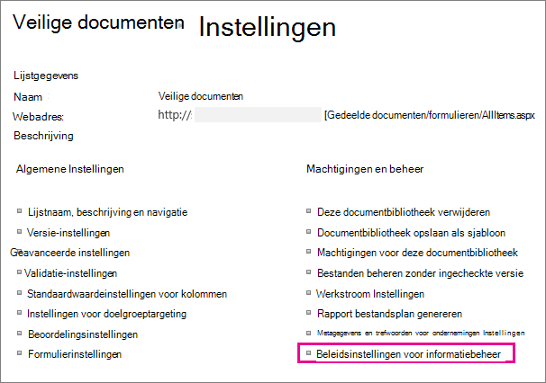

# Inleiding tot informatiebeheerbeleidIntroduction to information management policies

Een informatiebeheerbeleid is een set regels voor een type inhoud.An information management policy is a set of rules for a type of content. Met beleidsregels voor informatiebeheer kunnen organisaties zaken beheren en bijhouden, zoals hoe lang inhoud wordt bewaard of welke acties gebruikers met die inhoud kunnen uitvoeren.Information management policies enable organizations to control and track things like how long content is retained or what actions users can take with that content. Informatiebeheerbeleid kan organisaties helpen om te voldoen aan wettelijke of overheidsvoorschriften, of ze kunnen interne bedrijfsprocessen gewoon afdwingen.Information management policies can help organizations comply with legal or governmental regulations, or they can simply enforce internal business processes. 
  
Een organisatie die zich bijvoorbeeld moet houden aan overheidsvoorschriften die vereisen dat ze 'adequate controles' van hun financiële overzichten aantonen, kan een of meer informatiebeheerbeleidsregels maken die specifieke acties in het ontwerp- en goedkeuringsproces controleren voor alle documenten met betrekking tot financiële archivering.For example, an organization that must follow government regulations requiring that they demonstrate "adequate controls" of their financial statements might create one or more information management policies that audit specific actions in the authoring and approval process for all documents related to financial filings.
  
Zie Beleidsregels voor informatiebeheer maken [en toepassen](create-info-mgmt-policies.md)voor informatie.For how-to information, see [Create and apply information management policies](create-info-mgmt-policies.md).
  
## Functies van informatiebeheerbeleidFeatures of information management policies

Er zijn vier basiscategorieën met vooraf gedefinieerde beleidsfuncties die organisaties afzonderlijk of in combinatie kunnen gebruiken om inhoud en processen te beheren.There are four basic categories of predefined policy features that organizations can use individually or in combination to manage content and processes. 
  

  
Met de functie Controlebeleid kunnen organisaties analyseren hoe hun inhoudsbeheersystemen worden gebruikt door gebeurtenissen en bewerkingen te registreren die worden uitgevoerd op documenten en lijstitems.The Auditing policy feature helps organizations analyze how their content management systems are used by logging events and operations that are performed on documents and list items. U kunt de functie Controlebeleid zo configureren dat gebeurtenissen worden bijgehouden, zoals wanneer een document of item wordt bewerkt, bekeken, ingecheckt, uitgecheckt, verwijderd of de machtigingen zijn gewijzigd.You can configure the Auditing policy feature to log events such as when a document or item is edited, viewed, checked in, checked out, deleted, or has its permissions changed. Alle controlegegevens worden opgeslagen in één auditlogboek op de server en sitebeheerders kunnen er rapporten op uitvoeren.All of the audit information is stored in a single audit log on the server, and site administrators can run reports on it. 
  
Met de functie Verloopbeleid kunnen organisaties op een consistente, bij te houden manier verouderd inhoud van hun sites verwijderen of verwijderen.The Expiration policy feature helps organizations delete or remove out-of-date content from their sites in a consistent, trackable way. Op deze manier kunt u de kosten en risico's beheren die samenhangen met het behouden van verouderd materiaal.This helps you manage both the cost and risk associated with retaining out-of-date content. U kunt een verloopbeleid zo configureren dat bepaalde soorten inhoud verlopen op een bepaalde datum of binnen een periode nadat het document is gemaakt of voor het laatst is gewijzigd.You can configure an Expiration policy to specify that certain types of content expire on a particular date or within a period of time after the document was created or last modified.
  
Organisaties kunnen ook aangepaste beleidsfuncties maken en implementeren om aan specifieke behoeften te voldoen.Organizations can also create and deploy custom policy features to meet specific needs. Een productieorganisatie wil bijvoorbeeld een informatiebeheerbeleid definiëren voor alle conceptdocumenten met productontwerpspecificaties die gebruikers verbieden kopieën van deze documenten af te drukken op niet-secureprinters.For example, a manufacturing organization might want to define an information management policy for all draft product-design specification documents that prohibits users from printing copies of these documents on nonsecure printers. Als u dit soort informatiebeheerbeleid wilt definiëren, kunt u een beleidsfunctie afdrukbeperking maken en implementeren die kan worden toegevoegd aan het relevante informatiebeheerbeleid voor het inhoudstype productontwerpspecificatie.To define this kind of information management policy, you can create and deploy a Printing Restriction policy feature that can be added to the relevant information management policy for the product design specification content type.
  
## Locaties voor het gebruik van een informatiebeheerbeleidLocations to use an information management policy

Als u een informatiebeheerbeleid wilt implementeren, moet u dit toevoegen aan een lijst, bibliotheek of inhoudstype op een site.To implement an information management policy, you must add it to a list, library, or content type in a site. De locatie waar u een informatiebeheerbeleid maakt of toevoegt, is van invloed op de manier waarop het beleid breed wordt toegepast of hoe breed het beleid kan worden gebruikt.The location where you create or add an information management policy affects how broadly the policy applies or how broadly it can be used. U kunt:You can:
  
 **Een siteverzamelingsbeleid maken en dit beleid vervolgens toevoegen aan een inhoudstype, lijst of bibliotheek** U kunt een siteverzamelingsbeleid maken in de lijst Beleid op de site op het hoogste niveau van een siteverzameling.**Create a site collection policy and then add this policy to a content type, list, or library** You can create a site collection policy in the Policies list in the top-level site of a site collection. Nadat u een siteverzamelingsbeleid hebt gemaakt, kunt u het exporteren, zodat beheerders van andere siteverzamelingen het kunnen importeren in de lijst Beleid.After you create a site collection policy, you can export it so that administrators of other site collections can import it into their Policies list. Als u een exporteerbaar siteverzamelingsbeleid maakt, kunt u het informatiebeheerbeleid standaardiseren op de sites in uw organisatie.Creating an exportable site collection policy enables you to standardize the information management policies across the sites in your organization. 
  
Wanneer u een siteverzamelingsbeleid toevoegt aan een site-inhoudstype en een exemplaar van dat site-inhoudstype wordt toegevoegd aan een lijst of bibliotheek, kan de eigenaar van die lijst of bibliotheek het siteverzamelingsbeleid voor de lijst of bibliotheek niet wijzigen.When you add a site collection policy to a site content type, and an instance of that site content type is added to a list or library, the owner of that list or library cannot modify the site collection policy for the list or library. Het toevoegen van een siteverzamelingsbeleid aan een site-inhoudstype is een goede manier om ervoor te zorgen dat siteverzamelingsbeleid wordt afgedwongen op elk niveau van uw sitehiërarchie.Adding a site collection policy to a site content type is a good way to ensure that site collection policies are enforced at each level of your site hierarchy.
  

  
 Een informatiebeheerbeleid maken voor een site-inhoudstype in de galerie **Site-inhoudstype** van de site op het hoogste niveau en dit inhoudstype toevoegen aan een of meer lijsten of bibliotheken U kunt ook rechtstreeks een informatiebeheerbeleid maken voor een site-inhoudstype en vervolgens een exemplaar van dat site-inhoudstype koppelen aan meerdere lijsten of bibliotheken.**Create an information management policy for a site content type in the top-level site's Site Content Type Gallery, and then add that content type to one or more lists or libraries** You can also create an information management policy directly for a site content type and then associate an instance of that site content type with multiple lists or libraries. Als u op deze manier een informatiebeheerbeleid maakt, heeft elk item in de siteverzameling van dat inhoudstype of een inhoudstype dat van dat inhoudstype wordt overgenomen, het beleid.If you create an information management policy this way, every item in the site collection of that content type or a content type that inherits from that content type has the policy. Als u echter rechtstreeks een informatiebeheerbeleid maakt voor een site-inhoudstype, is het moeilijker om dit informatiebeheerbeleid opnieuw te gebruiken in andere siteverzamelingen, omdat beleidsregels die op deze manier worden gemaakt, niet kunnen worden geëxporteerd.However, if you create an information management policy directly for a site content type, it is more difficult to reuse this information management policy in other site collections, because policies that are created this way cannot be exported. 
  

  

  
Opmerking Als u wilt bepalen welk beleid wordt gebruikt in een siteverzameling, kunnen beheerders van siteverzamelingen de mogelijkheid uitschakelen om beleidsfuncties rechtstreeks op een inhoudstype in te stellen.Note To control which policies are used in a site collection, site collection administrators can disable the ability to set policy features directly on a content type. Wanneer deze beperking van kracht is, kunnen gebruikers die inhoudstypen maken, alleen beleid selecteren in de lijst Beleidsregels voor siteverzamelingen.When this restriction is in effect, users who create content types are limited to selecting policies from the site collection Policies list.
  
 **Een informatiebeheerbeleid maken voor een lijst of bibliotheek** Als uw organisatie een specifiek informatiebeheerbeleid moet toepassen op een zeer beperkte set inhoud, kunt u een informatiebeheerbeleid maken dat alleen van toepassing is op een afzonderlijke lijst of bibliotheek.**Create an information management policy for a list or library** If your organization needs to apply a specific information management policy to a very limited set of content, you can create an information management policy that applies only to an individual list or library. Deze methode voor het maken van een informatiebeheerbeleid is het minst flexibel, omdat het beleid slechts op één locatie van toepassing is en het niet kan worden geëxporteerd of hergebruikt voor andere locaties.This method of creating an information management policy is the least flexible, because the policy applies only to one location, and it cannot be exported or reused for other locations. Soms moet u echter unieke informatiebeheerbeleidsregels maken met beperkte toepassingsmogelijkheden om specifieke situaties aan te pakken.However, sometimes you may need to create unique information management policies with limited applicability to address specific situations. 
  

  
OpmerkingenNotes 
  
U kunt alleen een informatiebeheerbeleid voor een lijst of bibliotheek maken als deze lijst of bibliotheek niet meerdere inhoudstypen ondersteunt.You can create an information management policy for a list or library only if that list or library does not support multiple content types. Als een lijst of bibliotheek meerdere inhoudstypen ondersteunt, moet u een informatiebeheerbeleid definiëren voor elk afzonderlijk lijstinhoudstype dat is gekoppeld aan die lijst of bibliotheek.If a list or library supports multiple content types, you need to define an information management policy for each individual list content type that is associated with that list or library. (Exemplaren van een site-inhoudstype dat is gekoppeld aan een specifieke lijst of bibliotheek, worden lijstinhoudstypen genoemd.)(Instances of a site content type that are associated with a specific list or library are known as list content types.)
  
Als u wilt bepalen welk beleid wordt gebruikt in een siteverzameling, kunnen beheerders van siteverzamelingen de mogelijkheid uitschakelen om beleidsfuncties rechtstreeks op een lijst of bibliotheek in te stellen.To control which policies are used in a site collection, site collection administrators can disable the ability to set policy features directly on a list or library. Wanneer deze beperking van kracht is, kunnen gebruikers die lijsten of bibliotheken beheren, alleen beleid selecteren in de lijst Beleidsregels voor siteverzamelingen.When this restriction is in effect, users who manage lists or libraries are limited to selecting policies from the site collection Policies list.
  
[Een informatiebeheerbeleid is een set regels voor een type inhoud. Met beleidsregels voor informatiebeheer kunnen organisaties zaken beheren en bijhouden, zoals hoe lang inhoud wordt bewaard of welke acties gebruikers met die inhoud kunnen uitvoeren. Informatiebeheerbeleid kan organisaties helpen om te voldoen aan wettelijke of overheidsvoorschriften, of ze kunnen interne bedrijfsprocessen gewoon afdwingen. Een organisatie die zich bijvoorbeeld moet houden aan overheidsvoorschriften die vereisen dat ze 'adequate controles' van hun financiële overzichten aantonen, kan een of meer informatiebeheerbeleidsregels maken die specifieke acties in het ontwerp- en goedkeuringsproces controleren voor alle documenten met betrekking tot financiële archivering. Zie Beleidsregels voor informatiebeheer maken en toepassen voor informatie.An information management policy is a set of rules for a type of content. Information management policies enable organizations to control and track things like how long content is retained or what actions users can take with that content. Information management policies can help organizations comply with legal or governmental regulations, or they can simply enforce internal business processes. For example, an organization that must follow government regulations requiring that they demonstrate "adequate controls" of their financial statements might create one or more information management policies that audit specific actions in the authoring and approval process for all documents related to financial filings.For how-to information, see Create and apply information management policies.](intro-to-info-mgmt-policies.md#__top)
  

