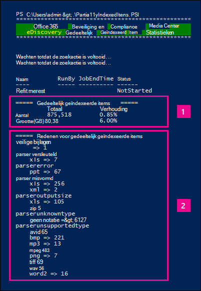

# <a name="investigating-partially-indexed-items-in-ediscovery"></a>Gedeeltelijk geïndexeerde items in eDiscovery onderzoeken

Een eDiscovery-zoekopdracht die u vanuit het Microsoft 365 compliancecentrum hebt uitgevoerd, bevat automatisch gedeeltelijk geïndexeerde items in de geschatte zoekresultaten wanneer u een zoekopdracht uit te voeren. Gedeeltelijk geïndexeerde items Exchange postvakitems en documenten op SharePoint en OneDrive voor Bedrijven sites die om een of andere reden niet volledig zijn geïndexeerd voor zoeken. De meeste e-mailberichten en sitedocumenten worden geïndexeerd omdat ze binnen de [indexeringslimieten voor e-mailberichten vallen.](limits-for-content-search.md#indexing-limits-for-email-messages) Sommige items kunnen deze indexeringslimieten echter overschrijden en worden gedeeltelijk geïndexeerd. Hier volgen andere redenen waarom items niet kunnen worden geïndexeerd voor zoeken en worden geretourneerd als gedeeltelijk geïndexeerde items wanneer u een eDiscovery-zoekopdracht uit te voeren:
  
- E-mailberichten hebben een bijgevoegd bestand zonder een geldige handler, zoals afbeeldingsbestanden; Dit is de meest voorkomende oorzaak van gedeeltelijk geïndexeerde e-mailitems.

- Te veel bestanden die zijn gekoppeld aan een e-mailbericht.

- Een bestand dat aan een e-mailbericht is gekoppeld, is te groot.

- Het bestandstype wordt ondersteund voor indexering, maar er is een indexeringsfout opgetreden voor een specifiek bestand.

Hoewel de inhoud verschilt, hebben de meeste organisaties minder dan 1% van de inhoud per volume en minder dan 12% van de inhoud per grootte die gedeeltelijk is geïndexeerd. De reden voor het verschil tussen het volume en de grootte is dat grotere bestanden een hogere kans hebben om inhoud te bevatten die niet volledig kan worden geïndexeerd.
  
## <a name="why-does-the-partially-indexed-item-count-change-for-a-search"></a>Waarom verandert het gedeeltelijk geïndexeerde aantal items voor een zoekopdracht?

Nadat u een eDiscovery-zoekopdracht hebt uitgevoerd, worden het totale aantal en de grootte van gedeeltelijk geïndexeerde items op de gezochte locaties weergegeven in de zoekresultaatstatistieken die worden weergegeven in de gedetailleerde statistieken voor de zoekopdracht. Let op: dit worden  *niet-geïndexeerde items*  genoemd in de zoekstatistieken. Hier volgen enkele zaken die van invloed zijn op het aantal gedeeltelijk geïndexeerde items dat wordt geretourneerd in de zoekresultaten:
  
- Als een item gedeeltelijk is geïndexeerd en overeenkomt met de zoekquery, wordt dit opgenomen in zowel het aantal (en de grootte) van zoekresultaatitems als gedeeltelijk geïndexeerde items. Wanneer de resultaten van dezelfde zoekopdracht echter worden geëxporteerd, wordt het item alleen opgenomen met een set zoekresultaten. het is niet opgenomen als een gedeeltelijk geïndexeerd item.

- Gedeeltelijk geïndexeerde items op SharePoint- en *OneDrive-sites* worden niet opgenomen in de schatting van gedeeltelijk geïndexeerde items die worden weergegeven in de gedetailleerde statistieken voor de zoekopdracht. Gedeeltelijk geïndexeerde items kunnen echter worden geëxporteerd wanneer u de resultaten van een eDiscovery-zoekopdracht exporteert. Als u bijvoorbeeld alleen op sites zoekt, is het geschatte aantal gedeeltelijk geïndexeerde items nul.
  
## <a name="calculating-the-ratio-of-partially-indexed-items-in-your-organization"></a>De verhouding van gedeeltelijk geïndexeerde items in uw organisatie berekenen

Als u de blootstelling van uw organisatie aan gedeeltelijk geïndexeerde items wilt begrijpen, kunt u zoeken naar alle inhoud in alle postvakken (met behulp van een lege trefwoordquery). In het volgende voorbeeld zijn er 1.629.904 (146,46 GB) volledig geïndexeerde items en 10.025 (10,27 GB) gedeeltelijk geïndexeerde items.
  

  
U kunt het percentage gedeeltelijk geïndexeerde items bepalen met behulp van de volgende berekeningen.
  
 **De verhouding van gedeeltelijk geïndexeerde items in uw organisatie berekenen:**

`(Total number of partially indexed items/Total number of items) x 100`

`(10025/1629904) x 100 = 0.62%`

Door de zoekresultaten uit het vorige voorbeeld te gebruiken, wordt 0,62% van alle postvakken gedeeltelijk geïndexeerd.
  
 **Het percentage van de grootte van gedeeltelijk geïndexeerde items in uw organisatie berekenen:**

`(Size of all partially indexed items/Size of all items) x 100`

`(10.27 GB/146.46 MB) x 100 = 7.0%`

In het vorige voorbeeld is 7% van de totale grootte van postvakitems afkomstig van gedeeltelijk geïndexeerde items. Zoals eerder vermeld hebben de meeste organisaties minder dan 1% van de inhoud per volume en minder dan 12% van de inhoud per grootte die gedeeltelijk is geïndexeerd.

## <a name="working-with-partially-indexed-items"></a>Werken met gedeeltelijk geïndexeerde items

In gevallen waarin u items gedeeltelijk moet onderzoeken om te controleren of [](export-a-content-search-report.md) deze geen relevante informatie bevatten, kunt u een inhoudszoekrapport exporteren dat informatie bevat over gedeeltelijk geïndexeerde items. Wanneer u een inhoudszoekrapport exporteert, moet u een van de exportopties kiezen die gedeeltelijk geïndexeerde items bevat.
  

  
Wanneer u eDiscovery-zoekresultaten of een zoekrapport exporteert met een van deze opties, bevat de export een rapport met de naam Niet-geïndexeerde Items.csv. Dit rapport bevat de meeste van dezelfde informatie als het ResultsLog.csv bestand. Het niet-geïndexeerde Items.csv bevat echter ook twee velden die betrekking hebben op gedeeltelijk geïndexeerde items: **Foutlabels** en **fouteigenschappen.** Deze velden bevatten informatie over de indexeringsfout voor elk gedeeltelijk geïndexeerd item. Als u de gegevens in deze twee velden gebruikt, kunt u bepalen of de indexeringsfout voor een bepaald effect heeft op uw onderzoek. Als dat zo is, kunt u een gerichte zoekopdracht uitvoeren en specifieke e-mailberichten en SharePoint- of OneDrive-documenten ophalen en exporteren, zodat u ze kunt onderzoeken om te bepalen of ze relevant zijn voor uw onderzoek. Zie Een [CSV-bestand](csv-file-for-an-id-list-content-search.md)voorbereiden voor een gerichte zoekopdracht in Office 365.

> [!NOTE]
> Het niet-geïndexeerde Items.csv bevat ook velden met de naam **Fouttype** en **Foutbericht.** Dit zijn oudere velden die informatie bevatten die  lijkt  op de informatie in de velden Foutlabels en Fouteigenschappen, maar met minder gedetailleerde informatie. U kunt deze oudere velden veilig negeren.
  
## <a name="errors-related-to-partially-indexed-items"></a>Fouten met betrekking tot gedeeltelijk geïndexeerde items

Foutlabels zijn gemaakt uit twee gegevens, de fout en het bestandstype. In dit fout-/bestandstypepaar bijvoorbeeld:

```text
 parseroutputsize_xls
```

 `parseroutputsize` is de fout en `xls` is het bestandstype van het bestand waar de fout is opgetreden. In gevallen waarin het bestandstype niet is herkend of het bestandstype niet van toepassing is op de fout, ziet u de waarde in plaats van `noformat` het bestandstype.
  
Hieronder volgt een lijst met indexeringsfouten en een beschrijving van de mogelijke oorzaak van de fout.
  
| Foutlabel | Beschrijving |
|:-----|:-----|
| `attachmentcount` <br/> |Een e-mailbericht had te veel bijlagen en sommige van deze bijlagen zijn niet verwerkt.  <br/> |
| `attachmentdepth` <br/> |In de inhoudsherhaal- en documentparser zijn te veel niveaus met bijlagen gevonden die zijn genest in andere bijlagen. Sommige van deze bijlagen zijn niet verwerkt.  <br/> |
| `attachmentrms` <br/> |De decoderen van een bijlage is mislukt omdat deze RMS-beveiligd was.  <br/> |
| `attachmentsize` <br/> |Een bestand dat aan een e-mailbericht is gekoppeld, was te groot en kon niet worden verwerkt.  <br/> |
| `indexingtruncated` <br/> |Bij het schrijven van het verwerkte e-mailbericht naar de index was een van de indexeerbare eigenschappen te groot en werd afgekapt. De afgekapte eigenschappen worden weergegeven in het veld Fouteigenschappen.  <br/> |
| `invalidunicode` <br/> |Een e-mailbericht bevatte tekst die niet kon worden verwerkt als geldige Unicode. Indexering voor dit item kan onvolledig zijn.  <br/> |
| `parserencrypted` <br/> |De inhoud van bijlage of e-mailbericht is versleuteld en Microsoft 365 de inhoud niet kan decoderen.  <br/> |
| `parsererror` <br/> |Er is een onbekende fout opgetreden tijdens het parseren. Dit is meestal het gevolg van een software bug of een servicestoring.  <br/> |
| `parserinputsize` <br/> |Een bijlage was te groot om de parser te verwerken en de parsing van die bijlage is niet of niet voltooid.  <br/> |
| `parsermalformed` <br/> |Een bijlage is verkeerd vervormd en kan niet worden verwerkt door de parser. Dit resultaat kan worden veroorzaakt door oude bestandsindelingen, bestanden die zijn gemaakt door incompatibele software of virussen die zich voordoen als iets anders dan geclaimd.  <br/> |
| `parseroutputsize` <br/> |De uitvoer van de parsing van een bijlage was te groot en moest worden afgekapt.  <br/> |
| `parserunknowntype` <br/> |Een bijlage had een bestandstype dat Microsoft 365 niet kon detecteren.  <br/> |
| `parserunsupportedtype` <br/> |Een bijlage had een bestandstype dat Office 365 kon detecteren, maar het parseren van dat bestandstype wordt niet ondersteund.  <br/> |
| `propertytoobig` <br/> |De waarde van een e-mail eigenschap in Exchange Store was te groot om te worden opgehaald en het bericht kon niet worden verwerkt. Dit gebeurt meestal alleen met de body-eigenschap van een e-mailbericht.  <br/> |
| `retrieverrms` <br/> |De inhoudsherhaaler kan een met RMS beveiligd bericht niet decoderen.  <br/> |
| `wordbreakertruncated` <br/> |Er zijn te veel woorden in het document geïdentificeerd tijdens indexering. De verwerking van de eigenschap is gestopt wanneer de limiet wordt bereikt en de eigenschap wordt afgekapt.  <br/> |

Foutvelden beschrijven welke velden worden beïnvloed door de verwerkingsfout die wordt weergegeven in het veld Foutlabels. Als u een eigenschap zoekt, zoals of , hebben fouten in de hoofdbeslag van het bericht geen invloed op de  `subject`  `participants` resultaten van uw zoekopdracht. Dit kan handig zijn bij het bepalen van precies welke gedeeltelijk geïndexeerde items u mogelijk verder moet onderzoeken.
  
## <a name="using-a-powershell-script-to-determine-your-organizations-exposure-to-partially-indexed-email-items"></a>Een PowerShell-script gebruiken om de blootstelling van uw organisatie aan gedeeltelijk geïndexeerde e-mailitems te bepalen

In de volgende stappen ziet u hoe u een PowerShell-script kunt uitvoeren dat zoekt naar alle items in alle Exchange-postvakken en vervolgens een rapport genereert over de verhouding van uw organisatie van gedeeltelijk geïndexeerde e-mailitems (op aantal en grootte) en het aantal items (en het bestandstype) voor elke indexeringsfout die optreedt. Gebruik de foutcodebeschrijvingen in de vorige sectie om de indexeringsfout te identificeren.
  
1. Sla de volgende tekst op in een Windows PowerShell scriptbestand met behulp van een achtervoegsel voor bestandsnaam van .ps1; `PartiallyIndexedItems.ps1`bijvoorbeeld.

   ```powershell
     write-host "**************************************************"
     write-host "     Security & Compliance Center      " -foregroundColor yellow -backgroundcolor darkgreen
     write-host "   eDiscovery Partially Indexed Item Statistics   " -foregroundColor yellow -backgroundcolor darkgreen
     write-host "**************************************************"
     " " 
     # Create a search with Error Tags Refinders enabled
     Remove-ComplianceSearch "RefinerTest" -Confirm:$false -ErrorAction 'SilentlyContinue'
     New-ComplianceSearch -Name "RefinerTest" -ContentMatchQuery "size>0" -RefinerNames ErrorTags -ExchangeLocation ALL
     Start-ComplianceSearch "RefinerTest"
     # Loop while search is in progress
     do{
         Write-host "Waiting for search to complete..."
         Start-Sleep -s 5
         $complianceSearch = Get-ComplianceSearch "RefinerTest"
     }while ($complianceSearch.Status -ne 'Completed')
     $refiners = $complianceSearch.Refiners | ConvertFrom-Json
     $errorTagProperties = $refiners.Entries | Get-Member -MemberType NoteProperty
     $partiallyIndexedRatio = $complianceSearch.UnindexedItems / $complianceSearch.Items
     $partiallyIndexedSizeRatio = $complianceSearch.UnindexedSize / $complianceSearch.Size
     " "
     "===== Partially indexed items ====="
     "         Total          Ratio"
     "Count    {0:N0}{1:P2}" -f $complianceSearch.Items.ToString("N0").PadRight(15, " "), $partiallyIndexedRatio
     "Size(GB) {0:N2}{1:P2}" -f ($complianceSearch.Size / 1GB).ToString("N2").PadRight(15, " "), $partiallyIndexedSizeRatio
     " "
     Write-Host ===== Reasons for partially indexed items =====
     foreach($errorTagProperty in $errorTagProperties)
     {
         $name = $refiners.Entries.($errorTagProperty.Name).Name
         $count = $refiners.Entries.($errorTagProperty.Name).TotalCount
         $frag = $name.Split("{_}")
         $errorTag = $frag[0]
         $fileType = $frag[1]
         if ($errorTag -ne $lastErrorTag)
         {
             $errorTag
         }
         "    " + $fileType + " => " + $count
         $lastErrorTag = $errorTag
     }
   ```

2. [Verbinding maken met Beveiligings- en compliancecentrum van Powershell](/powershell/exchange/exchange-online-powershell).

3. Ga in & PowerShell naar de map waar u het script hebt opgeslagen in stap 1 en voer het script uit. bijvoorbeeld:

   ```powershell
   .\PartiallyIndexedItems.ps1
   ```

Hier is een voorbeeld van de uitvoer die door het script wordt geretourneerd.
  


> [!NOTE]
> Noteer het volgende:
>  
> - Het totale aantal en de grootte van e-mailitems en de verhouding van uw organisatie van gedeeltelijk geïndexeerde e-mailitems (per aantal en per grootte).
> 
> - Een lijstfoutlabels en de bijbehorende bestandstypen waarvoor de fout is opgetreden.
  
## <a name="see-also"></a>Zie ook

[Gedeeltelijk geïndexeerde items in eDiscovery](partially-indexed-items-in-content-search.md)