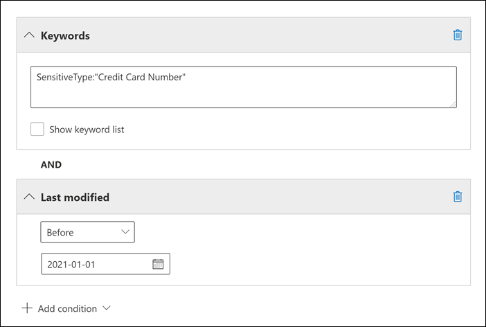

# <a name="keyword-queries-and-search-conditions-for-ediscovery"></a>Trefwoordquery's en zoekvoorwaarden voor eDiscovery

In dit onderwerp worden de e-mail- en documenteigenschappen beschreven die u kunt zoeken in e-mailitems en Microsoft Teams-chatgesprekken in Exchange Online, en documenten die zijn opgeslagen op SharePoint- en OneDrive voor Bedrijven-sites met behulp van de eDiscovery-zoekhulpmiddelen in het Microsoft 365-compliancecentrum. Dit omvat Inhoud zoeken, Core eDiscovery en Advanced eDiscovery (eDiscovery-zoekopdrachten in Advanced eDiscovery worden verzamelingen *genoemd).* U kunt ook de **\* cmdlets -ComplianceSearch** in Security & Compliance Center PowerShell gebruiken om naar deze eigenschappen te zoeken. In het onderwerp wordt ook beschreven:
  
- Gebruik Booleaanse zoekoperatoren, zoekvoorwaarden en andere zoekquerytechnieken om uw zoekresultaten te verfijnen.

- Zoeken naar gevoelige gegevenstypen en aangepaste gevoelige gegevenstypen in SharePoint en OneDrive voor Bedrijven.

- Zoeken naar site-inhoud die wordt gedeeld met gebruikers buiten uw organisatie

Zie voor stapsgewijs instructies over het maken van verschillende eDiscovery-zoekopdrachten:

- [Inhoud zoeken](content-search.md)

- [Zoeken naar inhoud in Core eDiscovery](search-for-content-in-core-ediscovery.md)

- [Een conceptverzameling maken in Advanced eDiscovery](create-draft-collection.md)

> [!NOTE]
> eDiscovery zoekt in het Microsoft 365-compliancecentrum en de bijbehorende **\* cmdlets ComplianceSearch** in Security & Compliance Center PowerShell gebruiken de Keyword Query Language (KQL). Zie Verwijzing naar de syntaxis [van de trefwoordquerytaal voor](/sharepoint/dev/general-development/keyword-query-language-kql-syntax-reference)meer informatie.
  
## <a name="searchable-email-properties"></a>Doorzoekbare e-maileigenschappen

In de volgende tabel ziet u eigenschappen van e-mailberichten die kunnen worden doorzocht met behulp van de eDiscovery-zoekhulpmiddelen in het Microsoft 365-compliancecentrum of met behulp van de **cmdlet New-ComplianceSearch** of **de cmdlet Set-ComplianceSearch.** De tabel bevat een voorbeeld van de  _syntaxis van eigenschap:waarde_ voor elke eigenschap en een beschrijving van de zoekresultaten die door de voorbeelden worden geretourneerd. U kunt deze paren typen in het  `property:value` vak Trefwoorden voor een eDiscovery-zoekopdracht. 

> [!NOTE]
> Bij het zoeken naar e-maileigenschappen is het niet mogelijk om te zoeken naar items waarin de opgegeven eigenschap leeg of leeg is. Als u bijvoorbeeld het *eigenschap:waardepaar* **onderwerp:""** gebruikt om te zoeken naar e-mailberichten met een lege onderwerpregel, resulteert dit in nul resultaten. Dit geldt ook voor het zoeken naar site- en contacteigenschappen.
  
| Eigenschap | Beschrijving van eigenschap | Voorbeelden | Zoekresultaten die door de voorbeelden worden geretourneerd |
|:-----|:-----|:-----|:-----|
|Bijlagenamen|De namen van bestanden die aan een e-mailbericht zijn gekoppeld.|`attachmentnames:annualreport.ppt`  <br/> `attachmentnames:annual*` <br/> `attachmentnames:.pptx` |Berichten met een bijgevoegd bestand met de naam annualreport.ppt. In het tweede voorbeeld retourneert u met het jokerteken berichten met het woord 'jaarlijks' in de bestandsnaam van een bijlage. Het derde voorbeeld retourneert alle bijlagen met de pptx-bestandsextensie.|
|BCC|Het veld BCC van een e-mailbericht. <sup>1</sup>|`bcc:pilarp@contoso.com`  <br/> `bcc:pilarp`  <br/> `bcc:"Pilar Pinilla"`|Alle voorbeelden retourneren berichten met Pilar Pinilla in het veld BCC.|
|Categorie| De categorieën die u wilt zoeken. Categorieën kunnen worden gedefinieerd door gebruikers met behulp van Outlook of de webversie van Outlook (voorheen Bekend als Outlook Web App). Mogelijke waarden zijn:  <br/><br/>  blauw  <br/>  groen  <br/>  oranje  <br/>  paars  <br/>  rood  <br/>  geel|`category:"Red Category"`|Berichten die de rode categorie in de bronpostvakken hebben gekregen.|
|CC|Het veld CC van een e-mailbericht. <sup>1</sup>|`cc:pilarp@contoso.com`  <br/> `cc:"Pilar Pinilla"`|In beide voorbeelden worden berichten met Pilar Pinilla opgegeven in het veld CC.|
|Mapid|De map-id (GUID) van een specifieke postvakmap. Als u deze eigenschap gebruikt, moet u zoeken in het postvak waarin de opgegeven map zich bevindt. Alleen de opgegeven map wordt doorzocht. Eventuele submappen in de map worden niet doorzocht. Als u submappen wilt zoeken, moet u de eigenschap Mapid gebruiken voor de submap die u wilt zoeken.  <br/> Zie Inhoud zoeken voor gerichte verzamelingen gebruiken voor meer informatie over het zoeken naar de eigenschap Mapid en het gebruik van een script voor het verkrijgen van de map-ID's voor [een specifiek postvak.](use-content-search-for-targeted-collections.md)|`folderid:4D6DD7F943C29041A65787E30F02AD1F00000000013A0000`  <br/> `folderid:2370FB455F82FC44BE31397F47B632A70000000001160000 AND participants:garthf@contoso.com`|Het eerste voorbeeld retourneert alle items in de opgegeven postvakmap. Het tweede voorbeeld retourneert alle items in de opgegeven postvakmap die zijn verzonden of ontvangen door garthf@contoso.com.|
|Van|De afzender van een e-mailbericht. <sup>1</sup>|`from:pilarp@contoso.com`  <br/> `from:contoso.com`|Berichten die zijn verzonden door de opgegeven gebruiker of verzonden vanuit een opgegeven domein.|
|HasAttachment|Geeft aan of een bericht een bijlage heeft. Gebruik de waarden **waar** of **onwaar.**|`from:pilar@contoso.com AND hasattachment:true`|Berichten die zijn verzonden door de opgegeven gebruiker met bijlagen.|
|Belang|Het belang van een e-mailbericht, dat een afzender kan opgeven bij het verzenden van een bericht. Berichten worden standaard verzonden met een normaal belang, tenzij de afzender het belang als **hoog** of laag **in stelt.**|`importance:high`  <br/> `importance:medium`  <br/> `importance:low`|Berichten die zijn gemarkeerd als hoog belang, gemiddeld belang of lage betekenis.|
|IsRead|Geeft aan of berichten zijn gelezen. Gebruik de waarden **waar** of **onwaar.**|`isread:true`  <br/> `isread:false`|Het eerste voorbeeld retourneert berichten met de eigenschap IsRead die is ingesteld op **Waar.** Het tweede voorbeeld retourneert berichten met de eigenschap IsRead ingesteld op **Onwaar.**|
|Itemclass|Gebruik deze eigenschap om te zoeken naar specifieke gegevenstypen van derden die uw organisatie in Office 365 heeft geïmporteerd. Gebruik de volgende syntaxis voor deze eigenschap:  `itemclass:ipm.externaldata.<third-party data type>*`|`itemclass:ipm.externaldata.Facebook* AND subject:contoso`  <br/> `itemclass:ipm.externaldata.Twitter* AND from:"Ann Beebe" AND "Northwind Traders"`|Het eerste voorbeeld retourneert Facebook-items met het woord 'contoso' in de eigenschap Onderwerp. Het tweede voorbeeld retourneert Twitter-items die zijn gepost door Ann Beebe en die de trefwoordzin 'Northwind Traders' bevatten.  <br/> Zie Inhoud zoeken gebruiken om te zoeken naar gegevens van derden die zijn geïmporteerd in [Office 365](use-content-search-to-search-third-party-data-that-was-imported.md)voor een volledige lijst met waarden die u wilt gebruiken voor gegevenstypen van derden voor de eigenschap ItemClass.|
|Soort| Het type e-mailbericht dat u wilt zoeken. Mogelijke waarden:  <br/>  contactpersonen  <br/>  docs  <br/>  e-mail  <br/>  externe gegevens  <br/>  faxen  <br/>  im  <br/>  dagboeken  <br/>  vergaderingen  <br/>  microsoftteams (retourneert items uit chats, vergaderingen en oproepen in Microsoft Teams)  <br/>  notities  <br/>  berichten  <br/>  rssfeeds  <br/>  taken  <br/>  voicemail|`kind:email`  <br/> `kind:email OR kind:im OR kind:voicemail`  <br/> `kind:externaldata`|Het eerste voorbeeld retourneert e-mailberichten die voldoen aan de zoekcriteria. Het tweede voorbeeld retourneert e-mailberichten, chatgesprekken (inclusief Skype voor Bedrijven-gesprekken en chats in Microsoft Teams) en spraakberichten die voldoen aan de zoekcriteria. Het derde voorbeeld retourneert items die zijn geïmporteerd in postvakken in Microsoft 365 uit gegevensbronnen van derden, zoals Twitter, Facebook en Cisco Jabber, die voldoen aan de zoekcriteria. Zie Gegevens van derden archiveren [in Office 365](https://www.microsoft.com/?ref=go)voor meer informatie.|
|Deelnemers|Alle personenvelden in een e-mailbericht. Deze velden zijn Van, Aan, CC en BCC.<sup>1</sup>|`participants:garthf@contoso.com`  <br/> `participants:contoso.com`|Berichten die zijn verzonden door of verzonden naar garthf@contoso.com. Het tweede voorbeeld retourneert alle berichten die zijn verzonden door of verzonden naar een gebruiker in het contoso.com domein.|
|Ontvangen|De datum waarop een e-mailbericht is ontvangen door een geadresseerde.|`received:04/15/2016`  <br/> `received>=01/01/2016 AND received<=03/31/2016`|Berichten die zijn ontvangen op 15 april 2016. Het tweede voorbeeld retourneert alle berichten die zijn ontvangen tussen 1 januari 2016 en 31 maart 2016.|
|Geadresseerden|Alle geadresseerdevelden in een e-mailbericht. Deze velden zijn Aan, CC en BCC.<sup>1</sup>|`recipients:garthf@contoso.com`  <br/> `recipients:contoso.com`|Berichten die naar garthf@contoso.com. Het tweede voorbeeld retourneert berichten die zijn verzonden naar een geadresseerde in contoso.com domein.|
|Verzonden|De datum waarop een e-mailbericht is verzonden door de afzender.|`sent:07/01/2016`  <br/> `sent>=06/01/2016 AND sent<=07/01/2016`|Berichten die op de opgegeven datum zijn verzonden of binnen het opgegeven datumbereik zijn verzonden.|
|Grootte|De grootte van een item, in bytes.|`size>26214400`  <br/> `size:1..1048567`|Berichten groter dan 25 MB. Het tweede voorbeeld retourneert berichten van 1 tot en met 1.048.567 bytes (1 MB) in grootte.|
|Onderwerp|De tekst in de onderwerpregel van een e-mailbericht.  <br/> **Opmerking:** Wanneer u de eigenschap Onderwerp in een query gebruikt, retourneert de zoekopdracht alle berichten waarin de onderwerpregel de tekst bevat die u zoekt. Met andere woorden, de query geeft niet alleen de berichten weer die exact overeenkomen. Als u bijvoorbeeld zoekt naar , bevatten uw resultaten berichten met het  `subject:"Quarterly Financials"` onderwerp 'Kwartaalcijfers 2018'.|`subject:"Quarterly Financials"`  <br/> `subject:northwind`|Berichten met de zin 'Kwartaalcijfers' ergens in de tekst van de onderwerpregel. Het tweede voorbeeld retourneert alle berichten die het woord noordenwind in de onderwerpregel bevatten.|
|Naar|Het veld Aan van een e-mailbericht. <sup>1</sup>|`to:annb@contoso.com`  <br/> `to:annb ` <br/> `to:"Ann Beebe"`|Alle voorbeelden retourneren berichten waarin Ann Beebe is opgegeven in de regel Aan: .|
|||||
   
> [!NOTE]
> <sup>1</sup> Voor de waarde van een geadresseerde-eigenschap  kunt u e-mailadres (ook wel gebruikersnaam of UPN), weergavenaam of alias gebruiken om een gebruiker op te geven. U kunt bijvoorbeeld een annb@contoso.com, annb of Ann Beebe gebruiken om de gebruiker Ann Beebe op te geven.

### <a name="recipient-expansion"></a>Uitbreiding geadresseerde

Wanneer u een van de eigenschappen van de geadresseerde zoekt (Van, Aan, CC, BCC, Deelnemers en Geadresseerden), probeert Microsoft 365 de identiteit van elke gebruiker uit te breiden door deze op te zoeken in Azure Active Directory (Azure AD).  Als de gebruiker wordt gevonden in Azure AD, wordt de query uitgebreid met het e-mailadres (of UPN), alias, weergavenaam en LegacyExchangeDN van de gebruiker. Een query zoals bijvoorbeeld wordt `participants:ronnie@contoso.com` uitgebreid naar `participants:ronnie@contoso.com OR participants:ronnie OR participants:"Ronald Nelson" OR participants:"<LegacyExchangeDN>"` .

Als u uitbreiding van geadresseerden wilt voorkomen, voegt u een jokerteken (sterretje) toe aan het einde van het e-mailadres en gebruikt u een beperkte domeinnaam. Zorg er bijvoorbeeld `participants:"ronnie@contoso*"` voor dat u het e-mailadres omringt met dubbele aanhalingstekens.

Let er echter op dat het voorkomen van uitbreiding van geadresseerden in de zoekquery ertoe kan leiden dat relevante items niet worden geretourneerd in de zoekresultaten. E-mailberichten in Exchange kunnen worden opgeslagen met verschillende tekstindelingen in de geadresseerdevelden. Uitbreiding van geadresseerden is bedoeld om dit feit te beperken door berichten te retourneren die verschillende tekstindelingen kunnen bevatten. Het voorkomen van uitbreiding van geadresseerden kan er dus toe leiden dat de zoekquery niet alle items retournt die relevant kunnen zijn voor uw onderzoek.

> [!NOTE]
> Als u de items die door een zoekquery als gevolg van de uitbreiding van de geadresseerde worden geretourneerd, wilt controleren of beperken, kunt u geavanceerde eDiscovery gebruiken. U kunt zoeken naar berichten (gebruikmakend van de uitbreiding van geadresseerden), deze toevoegen aan een revisieset en vervolgens query's of filters voor revisiesets gebruiken om de resultaten te bekijken of te beperken. Zie Gegevens voor een zaak [verzamelen en](collecting-data-for-ediscovery.md) De gegevens in een revisieset opvragen voor [meer informatie.](review-set-search.md)

## <a name="searchable-site-properties"></a>Doorzoekbare site-eigenschappen

In de volgende tabel vindt u een aantal eigenschappen van SharePoint en OneDrive voor Bedrijven die kunnen worden doorzocht met behulp van de zoekhulpprogramma's voor eDiscovery in het Microsoft 365-compliancecentrum of met de cmdlet **Nieuw complianceonderzoek** of de **cmdlet Set-ComplianceSearch.** De tabel bevat een voorbeeld van de  _syntaxis van eigenschap:waarde_ voor elke eigenschap en een beschrijving van de zoekresultaten die door de voorbeelden worden geretourneerd. 
  
Zie Overzicht van verkende en beheerde eigenschappen in SharePoint voor een volledige lijst met [SharePoint-eigenschappen](/SharePoint/technical-reference/crawled-and-managed-properties-overview)die kunnen worden doorzocht. Eigenschappen die zijn gemarkeerd met **een Ja** in de **kolom Queryable,** kunnen worden doorzocht.
  
| Eigenschap | Beschrijving van eigenschap | Voorbeeld | Zoekresultaten die door de voorbeelden worden geretourneerd |
|:-----|:-----|:-----|:-----|
|Auteur|Het auteursveld van Office-documenten, dat blijft bestaan als een document wordt gekopieerd. Als een gebruiker bijvoorbeeld een document maakt en de e-mailberichten naar iemand anders die het vervolgens uploadt naar SharePoint, blijft de oorspronkelijke auteur behouden. Gebruik de weergavenaam van de gebruiker voor deze eigenschap.|`author:"Garth Fort"`|Alle documenten die zijn geschreven door Garth Fort.|
|ContentType|Het SharePoint-inhoudstype van een item, zoals Item, Document of Video.|`contenttype:document`|Alle documenten worden geretourneerd.|
|Gemaakt|De datum waarop een item wordt gemaakt.|`created>=06/01/2016`|Alle items die zijn gemaakt op of na 1 juni 2016.|
|CreatedBy|De persoon die een item heeft gemaakt of geüpload. Gebruik de weergavenaam van de gebruiker voor deze eigenschap.|`createdby:"Garth Fort"`|Alle items die zijn gemaakt of geüpload door Garth Fort.|
|DetectedLanguage|De taal van een item.|`detectedlanguage:english`|Alle items in het Engels.|
|DocumentLink|Het pad (URL) van een specifieke map op een SharePoint- of OneDrive voor Bedrijven-site. Als u deze eigenschap gebruikt, moet u zoeken op de site waarin de opgegeven map zich bevindt.  <br/> Als u items wilt retourneren in submappen van de map die u opgeeft voor de eigenschap documentlink, moet u /toevoegen aan de URL van de \* opgegeven map, bijvoorbeeld:  `documentlink: "https://contoso.sharepoint.com/Shared Documents/*"`  <br/> <br/>Zie Inhoud zoeken voor gerichte verzamelingen gebruiken voor meer informatie over het zoeken naar de eigenschap documentlink en het gebruik van een script om de URL's voor documentlinks voor mappen op een specifieke site [te verkrijgen.](use-content-search-for-targeted-collections.md)|`documentlink:"https://contoso-my.sharepoint.com/personal/garthf_contoso_com/Documents/Private"`  <br/> `documentlink:"https://contoso-my.sharepoint.com/personal/garthf_contoso_com/Documents/Shared with Everyone/*" AND filename:confidential`|Het eerste voorbeeld retourneert alle items in de opgegeven map OneDrive voor Bedrijven. Het tweede voorbeeld retourneert documenten in de opgegeven sitemap (en alle submappen) die het woord 'vertrouwelijk' in de bestandsnaam bevatten.|
|FileExtension|De uitbreiding van een bestand; bijvoorbeeld docx, one, pptx of xlsx.|`fileextension:xlsx`|Alle Excel-bestanden (Excel 2007 en hoger)|
|Bestandsnaam|De naam van een bestand.|`filename:"marketing plan"`  <br/> `filename:estimate`|Het eerste voorbeeld retourneert bestanden met de exacte woordgroep 'marketingplan' in de titel. Het tweede voorbeeld retourneert bestanden met het woord 'schatting' in de bestandsnaam.|
|LastModifiedTime|De datum waarop een item voor het laatst is gewijzigd.|`lastmodifiedtime>=05/01/2016`  <br/> `lastmodifiedtime>=05/10/2016 AND lastmodifiedtime<=06/1/2016`|Het eerste voorbeeld retourneert items die zijn gewijzigd op of na 1 mei 2016. Het tweede voorbeeld retourneert items die zijn gewijzigd tussen 1 mei 2016 en 1 juni 2016.|
|ModifiedBy|De persoon die een item het laatst heeft gewijzigd. Gebruik de weergavenaam van de gebruiker voor deze eigenschap.|`modifiedby:"Garth Fort"`|Alle items die voor het laatst zijn gewijzigd door Garth Fort.|
|Pad|Het pad (URL) van een specifieke site op een SharePoint- of OneDrive voor Bedrijven-site.<br/><br/>Als u alleen items van de opgegeven site wilt retourneren, moet u de trailing toevoegen aan het einde van de `/` URL, bijvoorbeeld `path: "https://contoso.sharepoint.com/sites/international/"` <br/><br/> Als u items wilt retourneren die zich bevinden in mappen op de site die u opgeeft in de eigenschap Pad, moet u toevoegen aan het einde van de `/*` URL, bijvoorbeeld:  `path: "https://contoso.sharepoint.com/Shared Documents/*"`  <br/><br/> **Opmerking:** Als u de eigenschap gebruikt om op OneDrive-locaties te zoeken, worden  `Path` mediabestanden, zoals .png, .tiff- of .wav-bestanden, niet in de zoekresultaten als resultaat gebruikt. Gebruik een andere site-eigenschap in uw zoekquery om te zoeken naar mediabestanden in OneDrive-mappen. <br/>|`path:"https://contoso-my.sharepoint.com/personal/garthf_contoso_com/"`  <br/> `path:"https://contoso-my.sharepoint.com/personal/garthf_contoso_com/*" AND filename:confidential`|Het eerste voorbeeld retourneert alle items op de opgegeven OneDrive voor Bedrijven-site. Het tweede voorbeeld retourneert documenten op de opgegeven site (en mappen op de site) die het woord 'vertrouwelijk' in de bestandsnaam bevatten.|
|SharedWithUsersOWSUser|Documenten die zijn gedeeld met de opgegeven gebruiker en worden weergegeven op de pagina Gedeeld met **mij** op de site van OneDrive voor Bedrijven van de gebruiker. Dit zijn documenten die expliciet zijn gedeeld met de opgegeven gebruiker door andere personen in uw organisatie. Wanneer u documenten exporteert die overeenkomen met een zoekquery waarin de eigenschap SharedWithUsersOWSUser wordt gebruikt, worden de documenten geëxporteerd vanaf de oorspronkelijke inhoudslocatie van de persoon die het document heeft gedeeld met de opgegeven gebruiker. Zie Zoeken naar [site-inhoud](#searching-for-site-content-shared-within-your-organization)die binnen uw organisatie wordt gedeeld voor meer informatie.|`sharedwithusersowsuser:garthf`  <br/> `sharedwithusersowsuser:"garthf@contoso.com"`|Beide voorbeelden retourneren alle interne documenten die expliciet zijn gedeeld met Garth Fort en die worden weergegeven op de pagina Gedeeld met **mij** in het OneDrive voor Bedrijven-account van Garth Fort.|
|Site|De URL van een site of groep sites in uw organisatie.|`site:"https://contoso-my.sharepoint.com"`  <br/> `site:"https://contoso.sharepoint.com/sites/teams"`|In het eerste voorbeeld worden items van de OneDrive voor Bedrijven-sites voor alle gebruikers in de organisatie als retourneert. Het tweede voorbeeld retourneert items van alle teamsites.|
|Grootte|De grootte van een item, in bytes.|`size>=1`  <br/> `size:1..10000`|Het eerste voorbeeld retourneert items die groter zijn dan 1 byte. Het tweede voorbeeld retourneert items van 1 tot en met 10.000 bytes in grootte.|
|Title|De titel van het document. De eigenschap Titel is metagegevens die zijn opgegeven in Microsoft Office-documenten. Dit verschilt van de bestandsnaam van het document.|`title:"communication plan"`|Een document met de woordgroep 'communicatieplan' in de eigenschap Titel metagegevens van een Office-document.|
|||||

## <a name="searchable-contact-properties"></a>Eigenschappen van doorzoekbare contactpersonen

De volgende tabel bevat de eigenschappen van contactpersonen die zijn geïndexeerd en die u kunt zoeken met behulp van eDiscovery-zoekhulpmiddelen. Dit zijn de eigenschappen die gebruikers kunnen configureren voor de contactpersonen (ook wel persoonlijke contactpersonen genoemd) die zich bevinden in het persoonlijke adresboek van het postvak van een gebruiker. Als u wilt zoeken naar contactpersonen, kunt u de postvakken selecteren om te zoeken en vervolgens een of meer eigenschappen van contactpersonen gebruiken in de trefwoordquery.
  
> [!TIP]
> Als u wilt zoeken naar waarden die spaties of speciale tekens bevatten, gebruikt u dubbele aanhalingstekens ("") om de woordgroep te bevatten. `businessaddress:"123 Main Street"`bijvoorbeeld.
  
|Eigenschap |Beschrijving van eigenschap |
|:-----|:-----|
|BusinessAddress|Het adres in de **eigenschap Zakelijk adres.** De eigenschap wordt ook wel het **adres Werk** op de pagina met eigenschappen van contactpersonen genoemd.|
|BusinessPhone|Het telefoonnummer in een van de eigenschappen **van het** zakelijke telefoonnummer.|
|Bedrijfsnaam|De naam in de **eigenschap Bedrijf.**|
|Department|De naam in de **eigenschap Afdeling.**|
|Weergavenaam|De weergavenaam van de contactpersoon. Dit is de naam in de **eigenschap Volledige naam** van de contactpersoon.|
|EmailAddress|Het adres voor een e-mailadres voor de contactpersoon. Gebruikers kunnen meerdere e-mailadressen voor een contactpersoon toevoegen. Als u deze eigenschap gebruikt, worden contactpersonen retourneert die overeenkomen met de e-mailadressen van de contactpersoon.|
|FileAs|De **eigenschap Bestand als.** Deze eigenschap wordt gebruikt om op te geven hoe de contactpersoon wordt weergegeven in de lijst met contactpersonen van de gebruiker. Een contactpersoon kan bijvoorbeeld worden vermeld als *Voornaam, Achternaam* of *Achternaam,Voornaam.*|
|GivenName|De naam in de **eigenschap Voornaam.**|
|HomeAddress|Het adres in een van de **eigenschappen van het startadres.**|
|HomePhone|Het telefoonnummer in een van de eigenschappen **van** het startnummer.|
|IMAddress|De eigenschap Chatadres, meestal een e-mailadres dat wordt gebruikt voor chatberichten.|
|MiddleName|De naam in de **eigenschap Middelste** naam.|
|MobilePhone|Het telefoonnummer in de **eigenschap Mobiel** telefoonnummer.|
|Bijnaam|De naam in de **eigenschap Bijnaam.**|
|OfficeLocation|De waarde in **de office-** of **Office-locatie-eigenschap.**|
|OtherAddress|De waarde voor de **eigenschap Ander** adres.|
|Achternaam|De naam in de **eigenschap Achternaam.**|
|Title|De titel in de **eigenschap Functietitel.**|
|||||

## <a name="searchable-sensitive-data-types"></a>Doorzoekbare gevoelige gegevenstypen

U kunt eDiscovery-zoekhulpmiddelen in het Microsoft 365-compliancecentrum gebruiken om te zoeken naar gevoelige gegevens, zoals creditcardnummers of socialezekerheidsnummers, die zijn opgeslagen in documenten op SharePoint- en OneDrive voor Bedrijven-sites. U kunt dit doen met de eigenschap en de naam (of id) van een type gevoelige informatie `SensitiveType` in een trefwoordquery. De query `SensitiveType:"Credit Card Number"` retourneert bijvoorbeeld documenten met een creditcardnummer. De query  `SensitiveType:"U.S. Social Security Number (SSN)"` retourneert documenten met een Amerikaans sociaal-zekerheidsnummer.

Als u een lijst wilt bekijken met de typen  gevoelige informatie die u kunt zoeken, gaat u naar Gegevensclassificaties Gevoelige \> **informatietypen** in het Microsoft 365-compliancecentrum. U kunt ook de **cmdlet Get-DlpSensitiveInformationType** in Security & Compliance Center PowerShell gebruiken om een lijst met gevoelige informatietypen weer te geven.
  
Zie Een query maken om gevoelige gegevens te zoeken die zijn opgeslagen op sites voor meer informatie over het maken van `SensitiveType` [query's met de eigenschap.](form-a-query-to-find-sensitive-data-stored-on-sites.md)

### <a name="limitations-for-searching-sensitive-data-types"></a>Beperkingen voor het zoeken naar gevoelige gegevenstypen

- Als u wilt zoeken naar aangepaste gevoelige informatietypen, moet u de id opgeven van het type gevoelige informatie in de `SensitiveType` eigenschap. Als u de naam van een aangepast type gevoelige informatie gebruikt (zoals wordt weergegeven in het voorbeeld voor ingebouwde typen gevoelige informatie in de vorige sectie), worden er geen resultaten weergegeven. Gebruik de **kolom Publisher** op de pagina **Gevoelige informatietypen** in het compliancecentrum (of de **eigenschap Publisher** in PowerShell) om onderscheid te maken tussen ingebouwde en aangepaste gevoelige informatietypen. Ingebouwde gevoelige gegevenstypen hebben een waarde voor `Microsoft Corporation` de **eigenschap Publisher.**

  Als u de naam en id wilt weergeven voor de aangepaste gevoelige gegevenstypen in uw organisatie, moet u de volgende opdracht uitvoeren in Security & Compliance Center PowerShell:

  ```powershell
  Get-DlpSensitiveInformationType | Where-Object {$_.Publisher -ne "Microsoft Corporation"} | FT Name,Id
  ```

  Vervolgens kunt u de id in de zoekfunctie gebruiken om documenten te retourneren die het aangepaste gevoelige `SensitiveType` gegevenstype bevatten, bijvoorbeeld `SensitiveType:7e13277e-6b04-3b68-94ed-1aeb9d47de37`
  
- U kunt gevoelige informatietypen en de zoekfunctie niet gebruiken om in Exchange Online-postvakken naar gevoelige gegevens te `SensitiveType` zoeken. Dit omvat 1:1 chatberichten, 1:N groepschatberichten en teamkanaalgesprekken in Microsoft Teams, omdat al deze inhoud is opgeslagen in postvakken. U kunt echter DLP-beleid (Data Loss Prevention) gebruiken om gevoelige e-mailgegevens tijdens het transport te beveiligen. Zie Meer informatie over preventie van [gegevensverlies](dlp-learn-about-dlp.md) en Zoeken naar en zoeken naar persoonlijke gegevens voor [meer informatie.](/compliance/regulatory/gdpr)
  
## <a name="search-operators"></a>Zoekoperatoren

Booleaanse zoekoperatoren, zoals **EN,** **OF** en **NIET,** helpen u bij het definiëren van nauwkeurigere zoekopdrachten door specifieke woorden in de zoekquery op te geven of uit te sluiten. Andere technieken, zoals het gebruik van eigenschapsoperatoren (zoals of ), aanhalingstekens, haakjes en jokertekens, helpen u bij het verfijnen `>=` `..` van een zoekquery. In de volgende tabel ziet u de operatoren die u kunt gebruiken om zoekresultaten te beperken of te verbreden. 
  
|Operator |Gebruik |Beschrijving |
|:-----|:-----|:-----|
|EN|trefwoord1 EN trefwoord2|Retourneert items die alle opgegeven trefwoorden of  `property:value` expressies bevatten. U kunt bijvoorbeeld alle berichten retourneren die zijn verzonden door Ann Beebe met het  `from:"Ann Beebe" AND subject:northwind` woord noordenwind in de onderwerpregel. <sup>2</sup>|
|+|keyword1 + keyword2 + keyword3|Retourneert items die een *of* `keyword2` meer items `keyword3` *bevatten* en die ook `keyword1` .   Daarom is dit voorbeeld gelijk aan de query  `(keyword2 OR keyword3) AND keyword1` .  <br/> De query `keyword1 + keyword2` (met een spatie na het symbool) is niet hetzelfde als het gebruik **+** van de operator **AND.** Deze query zou gelijk zijn aan en `"keyword1 + keyword2"` items met de exacte fase retourneren. `"keyword1 + keyword2"`|
|OF|trefwoord1 OF trefwoord2|Retourneert items die een of meer van de opgegeven trefwoorden of  `property:value` expressies bevatten. <sup>2</sup>|
|NIET|trefwoord1 NIET trefwoord2  <br/> NIET van:"Ann Beebe"  <br/> NOT kind:im|Hiermee worden items uitgesloten die zijn opgegeven door een trefwoord of  `property:value` expressie. In het tweede voorbeeld worden berichten uitgesloten die zijn verzonden door Ann Beebe. In het derde voorbeeld worden chatgesprekken uitgesloten, Skype voor Bedrijven gesprekken die zijn opgeslagen in de postvakmap Gespreksgeschiedenis. <sup>2</sup>|
|-|keyword1 -keyword2|Hetzelfde als de **OPERATOR NOT.** Deze query retourneert dus items die items  `keyword1` bevatten en die items die bevatten,  `keyword2` uitsluiten.|
|NEAR|trefwoord1 NEAR(n) trefwoord2|Retourneert items met woorden die dicht bij elkaar staan, waarbij n gelijk is aan het aantal woorden uit elkaar. Geeft bijvoorbeeld `best NEAR(5) worst` een item als resultaat waarbij het woord 'slechtste' binnen vijf woorden 'beste' staat. Als er geen getal is opgegeven, is de standaardafstand acht woorden. <sup>2</sup>|
|:|eigenschap:waarde|De dubbele punt (:) in de  `property:value` syntaxis wordt aangegeven dat de waarde van de eigenschap die wordt gezocht de opgegeven waarde bevat. `recipients:garthf@contoso.com`Retourneert bijvoorbeeld een bericht dat is verzonden naar garthf@contoso.com.|
|=|eigenschap=waarde|Hetzelfde als de **operator :**|
|\<|\<eigenschapswaarde|Hiermee wordt aangegeven dat de gezochte eigenschap kleiner is dan de opgegeven waarde. <sup>1</sup>|
|\>|\>eigenschapswaarde|Hiermee wordt aangegeven dat de gezochte eigenschap groter is dan de opgegeven waarde. <sup>1</sup>|
|\<=|eigenschap \< =waarde|Geeft aan dat de gezochte eigenschap kleiner is dan of gelijk is aan een specifieke waarde. <sup>1</sup>|
|\>=|eigenschap \> =waarde|Geeft aan dat de gezochte eigenschap groter is dan of gelijk is aan een specifieke waarde. <sup>1</sup>|
|..|eigenschap:waarde1.. waarde2|Geeft aan dat de gezochte eigenschap groter is dan of gelijk is aan waarde1 en kleiner dan of gelijk is aan waarde2. <sup>1</sup>|
|"  "|"reële waarde"  <br/> subject:"Kwartaalcijfers"|Gebruik dubbele aanhalingstekens ("") om te zoeken naar een exacte woordgroep of term in trefwoord-  `property:value` en zoekquery's.|
|\*|kat\*  <br/> onderwerp:set\*|Voorvoegsel jokertekens zoeken (waarbij het sterretje aan het einde van een woord wordt geplaatst) komen overeen met nul of meer tekens in trefwoorden of  `property:value` query's. Retourneert bijvoorbeeld documenten met de woordset, -instelling en -instelling (en andere woorden die beginnen met  `title:set*` 'set') in de documenttitel.  <br/><br/> **Opmerking:** U kunt alleen zoekopdrachten met jokertekens voor voorvoegsels gebruiken. bijvoorbeeld cat **\* *_ or _* set \* *_. Achtervoegselzoekingen_* \* (kat),** infix zoekopdrachten **(c \* t)** en subtekenzoek zoekopdrachten **\* (kat) \*** worden niet ondersteund.<br/><br/>Voeg ook een punt toe ( \. ) als u een voorvoegsel wilt zoeken, worden de resultaten die worden geretourneerd, gewijzigd. Dat komt omdat een punt wordt beschouwd als een stopwoord. Als u bijvoorbeeld zoekt naar **kat _ en zoekt naar \* *_* kat. \*** worden verschillende resultaten als resultaat gebruikt. Het is raadzaam om geen punt te gebruiken in een wildcardzoekactie voor het voorvoegsel. |
|(  )|(fair OR free) EN (van:contoso.com)  <br/> (IPO OR initial) AND (aandelen OF-aandelen)  <br/> (kwartaalcijfers)|Haakjes groepeert Booleaanse zinnen,  `property:value` items en trefwoorden. `(quarterly financials)`Retourneert bijvoorbeeld items met de woorden kwartaal en financiën.|
|||||
   
> [!NOTE]
> <sup>1</sup> Gebruik deze operator voor eigenschappen met datum- of numerieke waarden.<br/> <sup>2</sup> Booleaanse zoekoperatoren moeten hoofdletters zijn; bijvoorbeeld **AND**. Als u een kleine lettersoperator gebruikt, zoals **en**, wordt deze beschouwd als een trefwoord in de zoekquery. 
  
## <a name="search-conditions"></a>Zoekvoorwaarden

U kunt voorwaarden toevoegen aan een zoekquery om een zoekopdracht te verfijnen en een meer verfijnde set resultaten te retourneren. Elke voorwaarde voegt een component toe aan de KQL-zoekquery die wordt gemaakt en uitgevoerd wanneer u de zoekopdracht start.
  
[Voorwaarden voor algemene eigenschappen](#conditions-for-common-properties)

[Voorwaarden voor e-maileigenschappen](#conditions-for-mail-properties)

[Voorwaarden voor documenteigenschappen](#conditions-for-document-properties)

[Operatoren die worden gebruikt met voorwaarden](#operators-used-with-conditions)

[Richtlijnen voor het gebruik van voorwaarden](#guidelines-for-using-conditions)

[Voorbeelden van het gebruik van voorwaarden in zoekquery's](#examples-of-using-conditions-in-search-queries)
  
### <a name="conditions-for-common-properties"></a>Voorwaarden voor algemene eigenschappen

Maak een voorwaarde met algemene eigenschappen bij het zoeken naar postvakken en sites in dezelfde zoekopdracht. In de volgende tabel worden de beschikbare eigenschappen vermeld die u kunt gebruiken bij het toevoegen van een voorwaarde.
  
| Voorwaarde | Beschrijving |
|:-----|:-----|
|Datum|Voor e-mail is de datum waarop een bericht is ontvangen door een geadresseerde of verzonden door de afzender. Voor documenten is de datum waarop een document voor het laatst is gewijzigd.|
|Afzender/auteur|Voor e-mail, de persoon die een bericht heeft verzonden. Voor documenten, de persoon die in het auteursveld wordt geciteerd uit Office documenten. U kunt meerdere namen typen, gescheiden door komma's. Twee of meer waarden zijn logisch verbonden door de **operator OF.**|
|Grootte (in bytes)|Voor zowel e-mail als documenten, de grootte van het item (in bytes).|
|Onderwerp/titel|Voor e-mail wordt de tekst in de onderwerpregel van een bericht weergegeven. Voor documenten, de titel van het document. Zoals eerder uitgelegd, is de eigenschap Titel metagegevens die zijn opgegeven in Microsoft Office documenten. U kunt de naam van meer dan één onderwerp/titel typen, gescheiden door komma's. Twee of meer waarden zijn logisch verbonden door de **operator OF.**|
|Bewaarlabel|Voor zowel e-mail als documenten worden bewaarlabels die automatisch aan berichten en documenten zijn toegewezen door beleidsregels voor automatische etiketten of bewaarlabels die handmatig zijn toegewezen door gebruikers. Bewaarlabels worden gebruikt om e-mail en documenten te classificeren voor informatiebeheer en bewaarregels af te dwingen op basis van de instellingen die door het label zijn gedefinieerd. U kunt een deel van de naam van het bewaarlabel typen en een jokerteken gebruiken of de volledige labelnaam typen. Zie Bewaarbeleid en bewaarlabels voor meer informatie over [bewaarlabels.](retention.md)|
|||
  
### <a name="conditions-for-mail-properties"></a>Voorwaarden voor e-maileigenschappen

Maak een voorwaarde met behulp van e-maileigenschappen bij het zoeken naar postvakken of openbare mappen. De volgende tabel bevat de e-maileigenschappen die u kunt gebruiken voor een voorwaarde. Deze eigenschappen zijn een subset van de e-maileigenschappen die eerder zijn beschreven. Deze beschrijvingen worden voor uw gemak herhaald.
  
| Voorwaarde | Beschrijving |
|:-----|:-----|
|Type bericht| Het berichttype dat u wilt zoeken. Dit is dezelfde eigenschap als de eigenschap E-mail kind. Mogelijke waarden:  <br/><br/>  contactpersonen  <br/>  docs  <br/>  e-mail  <br/>  externe gegevens  <br/>  faxen  <br/>  im  <br/>  dagboeken  <br/>  vergaderingen  <br/>  microsoftteams  <br/>  notities  <br/>  berichten  <br/>  rssfeeds  <br/>  taken  <br/>  voicemail|
|Deelnemers|Alle personenvelden in een e-mailbericht. Deze velden zijn Van, Aan, CC en BCC.|
|Type|De eigenschap berichtklasse voor een e-mailitem. Dit is dezelfde eigenschap als de e-mail eigenschap ItemClass. Het is ook een voorwaarde met meerdere waarden. Als u dus meerdere berichtklassen wilt selecteren, houdt u **Ctrl** ingedrukt en klikt u vervolgens op twee of meer berichtklassen in de vervolgkeuzelijst die u aan de voorwaarde wilt toevoegen. Elke berichtklasse die u in de lijst selecteert, wordt logisch verbonden door de **operator OF** in de bijbehorende zoekquery.  <br/> Zie Itemtypen en Berichtklassen voor een lijst met de berichtklassen (en  de bijbehorende berichtklasse-id) die door Exchange worden gebruikt en die u kunt selecteren in de lijst [Berichtklassen.](/office/vba/outlook/Concepts/Forms/item-types-and-message-classes)|
|Ontvangen|De datum waarop een e-mailbericht is ontvangen door een geadresseerde. Dit is dezelfde eigenschap als de eigenschap Ontvangen e-mail.|
|Geadresseerden|Alle geadresseerdevelden in een e-mailbericht. Deze velden zijn Aan, CC en BCC.|
|Afzender|De afzender van een e-mailbericht.|
|Verzonden|De datum waarop een e-mailbericht is verzonden door de afzender. Dit is dezelfde eigenschap als de eigenschap Verzonden e-mail.|
|Onderwerp|De tekst in de onderwerpregel van een e-mailbericht.|
|Naar|De ontvanger van een e-mailbericht in het veld Aan.|
|||
  
### <a name="conditions-for-document-properties"></a>Voorwaarden voor documenteigenschappen

Maak een voorwaarde met behulp van documenteigenschappen bij het zoeken naar documenten op SharePoint- en OneDrive voor Bedrijven-sites. De volgende tabel bevat de documenteigenschappen die u kunt gebruiken voor een voorwaarde. Deze eigenschappen zijn een subset van de site-eigenschappen die eerder zijn beschreven. Deze beschrijvingen worden voor uw gemak herhaald.
  
| Voorwaarde | Beschrijving |
|:-----|:-----|
|Auteur|Het auteursveld van Office-documenten, dat blijft bestaan als een document wordt gekopieerd. Als een gebruiker bijvoorbeeld een document maakt en de e-mailberichten naar iemand anders die het vervolgens uploadt naar SharePoint, blijft de oorspronkelijke auteur behouden.|
|Title|De titel van het document. De eigenschap Titel is metagegevens die zijn opgegeven in Office-documenten. Deze is anders dan de bestandsnaam van het document.|
|Gemaakt|De datum waarop een document wordt gemaakt.|
|Laatst gewijzigd|De datum waarop een document voor het laatst is gewijzigd.|
|Bestandstype|De uitbreiding van een bestand; bijvoorbeeld docx, one, pptx of xlsx. Dit is dezelfde eigenschap als de site-eigenschap FileExtension.|
|||
  
### <a name="operators-used-with-conditions"></a>Operatoren die worden gebruikt met voorwaarden

Wanneer u een voorwaarde toevoegt, kunt u een operator selecteren die relevant is voor het type eigenschap voor de voorwaarde. In de volgende tabel worden de operatoren beschreven die worden gebruikt met voorwaarden en wordt het equivalent vermeld dat wordt gebruikt in de zoekquery.
  
| Operator | Query-equivalent | Beschrijving |
|:-----|:-----|:-----|
|Na|`property>date`|Gebruikt met datumvoorwaarden. Retourneert items die na de opgegeven datum zijn verzonden, ontvangen of gewijzigd.|
|Vóór|`property<date`|Gebruikt met datumvoorwaarden. Retourneert items die vóór de opgegeven datum zijn verzonden, ontvangen of gewijzigd.|
|Between|`date..date`|Gebruik met datum- en groottevoorwaarden. Wanneer deze worden gebruikt met een datumvoorwaarde, retourneert u items die er zijn verzonden, ontvangen of gewijzigd binnen het opgegeven datumbereik. Bij gebruik met een groottevoorwaarde retourneert u items waarvan de grootte binnen het opgegeven bereik valt.|
|Bevat een van de|`(property:value) OR (property:value)`|Gebruikt met voorwaarden voor eigenschappen die een tekenreekswaarde opgeven. Retourneert items die een deel van een of meer opgegeven tekenreekswaarden bevatten.|
|Bevat geen van de|`-property:value`  <br/> `NOT property:value`|Gebruikt met voorwaarden voor eigenschappen die een tekenreekswaarde opgeven. Retourneert items die geen deel uitmaken van de opgegeven tekenreekswaarde.|
|Is niet gelijk aan een van de|`-property=value`  <br/> `NOT property=value`|Gebruikt met voorwaarden voor eigenschappen die een tekenreekswaarde opgeven. Retourneert items die de specifieke tekenreeks niet bevatten.|
|Is gelijk aan|`size=value`|Retourneert items die gelijk zijn aan de opgegeven grootte. <sup>1</sup>|
|Is gelijk aan een van de|`(property=value) OR (property=value)`|Gebruikt met voorwaarden voor eigenschappen die een tekenreekswaarde opgeven. Retourneert items die exact overeenkomen met een of meer opgegeven tekenreekswaarden.|
|Groter|`size>value`|Retourneert items waarbij de opgegeven eigenschap groter is dan de opgegeven waarde. <sup>1</sup>|
|Groter of gelijk|`size>=value`|Retourneert items waarbij de opgegeven eigenschap groter is dan of gelijk is aan de opgegeven waarde. <sup>1</sup>|
|Minder|`size<value`|Retourneert items die groter zijn dan of gelijk zijn aan de specifieke waarde. <sup>1</sup>|
|Kleiner of gelijk|`size<=value`|Retourneert items die groter zijn dan of gelijk zijn aan de specifieke waarde. <sup>1</sup>|
|Niet gelijk|`size<>value`|Retourneert items die niet gelijk zijn aan de opgegeven grootte. <sup>1</sup>|
|||
   
> [!NOTE]
> <sup>1</sup> Deze operator is alleen beschikbaar voor voorwaarden die gebruikmaken van de eigenschap Grootte. 
  
### <a name="guidelines-for-using-conditions"></a>Richtlijnen voor het gebruik van voorwaarden

Houd rekening met het volgende bij het gebruik van zoekvoorwaarden.
  
- Een voorwaarde is logisch verbonden met de trefwoordquery (opgegeven in het trefwoordvak) door de **operator AND.** Dit betekent dat items moeten voldoen aan zowel de trefwoordquery als de voorwaarde die in de resultaten moet worden opgenomen. Dit is de manier waarop voorwaarden helpen om uw resultaten te beperken. 
    
- Als u twee of meer unieke voorwaarden toevoegt aan een zoekquery (voorwaarden die verschillende eigenschappen opgeven), worden deze voorwaarden logisch verbonden door de **operator AND.** Dat betekent dat alleen items die voldoen aan alle voorwaarden (naast een trefwoordquery) worden geretourneerd. 
    
- Als u meer dan één voorwaarde toevoegt voor dezelfde eigenschap, worden deze voorwaarden logisch verbonden door de **operator OF.** Dit betekent dat items die voldoen aan de trefwoordquery en een van de voorwaarden worden geretourneerd. Groepen met dezelfde voorwaarden worden dus met elkaar verbonden door de **operator OF** en vervolgens worden sets met unieke voorwaarden verbonden door de **operator AND.** 
    
- Als u meerdere waarden (gescheiden door komma's of puntma's) toevoegt aan één voorwaarde, worden deze waarden verbonden door de **operator OF.** Dit betekent dat items worden geretourneerd als ze een van de opgegeven waarden voor de eigenschap in de voorwaarde bevatten. 
    
- De zoekquery die wordt gemaakt met behulp van het  vak trefwoorden en de voorwaarden, wordt weergegeven op de pagina Zoeken, in het detailvenster voor de geselecteerde zoekopdracht. In een query geeft alles rechts van de notatie voorwaarden aan  `(c:c)` die aan de query worden toegevoegd. 
    
- Voorwaarden voegen alleen eigenschappen toe aan de zoekquery. de operatoren niet toevoegen. Daarom worden in de query die in het detailvenster wordt weergegeven, geen operatoren rechts van de  `(c:c)` notatie weergegeven. KQL voegt de logische operatoren toe (volgens de eerder uitgelegde regels) wanneer de query wordt uitgevoerd. 
    
- U kunt het besturingselement Slepen en neerzetten gebruiken om de volgorde van de voorwaarden te herstellen. Klik op het besturingselement voor een voorwaarde en verplaats het naar boven of omlaag.
    
- Zoals eerder is uitgelegd, kunt u met bepaalde eigenschappen van de voorwaarde meerdere waarden typen (gescheiden door punt-dubbele punt). Elke waarde is logisch verbonden door de **operator OF** en resulteert in de `(filetype:docx) OR (filetype:pptx) OR (filetype:xlsx)` query. In de volgende afbeelding ziet u een voorbeeld van een voorwaarde met meerdere waarden.

    
  
  > [!NOTE]
  > U kunt niet meerdere voorwaarden toevoegen (door op **Voorwaarde toevoegen** voor dezelfde eigenschap te klikken. In plaats daarvan moet u meerdere waarden voor de voorwaarde (gescheiden door punt-dubbele punt) geven, zoals wordt weergegeven in het vorige voorbeeld.
  
### <a name="examples-of-using-conditions-in-search-queries"></a>Voorbeelden van het gebruik van voorwaarden in zoekquery's

In de volgende voorbeelden worden de GUI-versie van een zoekquery met voorwaarden weergegeven, de syntaxis van de zoekquery die wordt weergegeven in het detailvenster van de geselecteerde zoekopdracht (die ook wordt geretourneerd door de **cmdlet Get-ComplianceSearch)** en de logica van de bijbehorende KQL-query.
  
#### <a name="example-1"></a>Voorbeeld 1

In dit voorbeeld worden documenten SharePoint en OneDrive voor Bedrijven sites die een creditcardnummer bevatten en die voor het laatst zijn gewijzigd vóór 1 januari 2021.
  
 **GUI**
  

  
 **Syntaxis van zoekquery**
  
 `SensitiveType:"Credit Card Number"(c:c)(lastmodifiedtime<2021-01-01)`
  
 **Zoekquerylogica**
  
 `SensitiveType:"Credit Card Number" AND (lastmodifiedtime<2021-01-01)`
  
In de vorige schermafbeelding ziet u dat de zoek-gebruikersinterface de trefwoordquery en -voorwaarde door de **operator AND heeft** verbonden.

#### <a name="example-2"></a>Voorbeeld 2

Dit voorbeeld retourneert e-mailitems of documenten met het trefwoord 'rapport', dat vóór 1 april 2021 is verzonden of gemaakt en die het woord 'noordenwind' bevatten in het onderwerpveld van e-mailberichten of in de titel-eigenschap van documenten. De query sluit webpagina's uit die voldoen aan de andere zoekcriteria.
  
 **GUI**
  

  
 **Syntaxis van zoekquery**
  
 `report(c:c)(date<2021-04-01)(subjecttitle:"northwind")(-filetype:aspx)`
  
 **Zoekquerylogica**
  
 `report AND (date<2021-04-01) AND (subjecttitle:"northwind") NOT (filetype:aspx)`
  
#### <a name="example-3"></a>Voorbeeld 3

Dit voorbeeld retourneert e-mailberichten of agendavergaderingen die zijn verzonden tussen 12-1-2019 en 30-11-2020 en die woorden bevatten die beginnen met 'telefoon' of 'smartphone'.
  
 **GUI**
  

  
 **Syntaxis van zoekquery**
  
 `phone* OR smartphone*(c:c)(sent=2019-12-01..2020-11-30)(kind="email")(kind="meetings")`
  
 **Zoekquerylogica**
  
 `phone* OR smartphone* AND (sent=2029-12-01..2020-11-30) AND ((kind="email") OR (kind="meetings"))`
  
## <a name="special-characters"></a>Speciale tekens

Sommige speciale tekens zijn niet opgenomen in de zoekindex en zijn daarom niet doorzoekbaar. Dit omvat ook de speciale tekens die zoekoperatoren in de zoekquery vertegenwoordigen. Hier volgt een lijst met speciale tekens die worden vervangen door een lege spatie in de werkelijke zoekquery of een zoekfout veroorzaken.

`+ - = : ! @ # % ^ & ; _ / ? ( ) [ ] { }`

## <a name="searching-for-site-content-shared-with-external-users"></a>Zoeken naar site-inhoud die is gedeeld met externe gebruikers

U kunt ook eDiscovery-zoekhulpmiddelen gebruiken in het compliancecentrum om te zoeken naar documenten die zijn opgeslagen op SharePoint- en OneDrive voor Bedrijven-sites die zijn gedeeld met personen buiten uw organisatie. Hiermee kunt u gevoelige of eigendomsgegevens identificeren die buiten uw organisatie worden gedeeld. U kunt dit doen door de eigenschap  `ViewableByExternalUsers` in een trefwoordquery te gebruiken. Deze eigenschap retourneert documenten of sites die zijn gedeeld met externe gebruikers met behulp van een van de volgende methoden voor delen: 
  
- Een uitnodiging voor delen waarin gebruikers zich moeten aanmelden bij uw organisatie als geverifieerde gebruiker.

- Een anonieme gastkoppeling, waarmee iedereen met deze koppeling toegang heeft tot de resource zonder te worden geverifieerd.

Dit zijn enkele voorbeelden:
  
- De query retourneert alle items die zijn gedeeld met personen buiten uw organisatie  `ViewableByExternalUsers:true AND SensitiveType:"Credit Card Number"` en die een creditcardnummer bevatten.
  
- De query  `ViewableByExternalUsers:true AND ContentType:document AND site:"https://contoso.sharepoint.com/Sites/Teams"` retourneert een lijst met documenten op alle teamsites in de organisatie die zijn gedeeld met externe gebruikers.

> [!TIP]
> Een zoekquery zoals  `ViewableByExternalUsers:true AND ContentType:document` kan een groot aantal .aspx-bestanden in de zoekresultaten retourneren. Als u deze (of andere typen bestanden) wilt verwijderen, kunt u de eigenschap gebruiken om specifieke bestandstypen uit  `FileExtension` te sluiten,  `ViewableByExternalUsers:true AND ContentType:document NOT FileExtension:aspx` bijvoorbeeld.
  
Wat wordt beschouwd als inhoud die wordt gedeeld met personen buiten uw organisatie? Documenten in de SharePoint en OneDrive voor Bedrijven van uw organisatie die worden gedeeld door een uitnodiging voor delen te verzenden of die worden gedeeld op openbare locaties. De volgende gebruikersactiviteiten resulteren bijvoorbeeld in inhoud die kan worden bekeken door externe gebruikers:
  
- Een gebruiker deelt een bestand of map met een persoon buiten uw organisatie.
  
- Een gebruiker maakt en verzendt een koppeling naar een gedeeld bestand naar een persoon buiten uw organisatie. Met deze koppeling kan de externe gebruiker het bestand bekijken (of bewerken).
  
- Een gebruiker stuurt een uitnodiging voor delen of een gastkoppeling naar een persoon buiten uw organisatie om een gedeeld bestand te bekijken (of te bewerken).
  
### <a name="issues-using-the-viewablebyexternalusers-property"></a>Problemen met de eigenschap ViewableByExternalUsers

Hoewel de eigenschap de status vertegenwoordigt van het delen van een document of site met externe gebruikers, zijn er enkele voorbehouden aan wat deze eigenschap doet en niet  `ViewableByExternalUsers` weerspiegelt. In de volgende scenario's wordt de waarde van de eigenschap niet bijgewerkt en kunnen de resultaten van een zoekquery waarin deze eigenschap wordt  `ViewableByExternalUsers` gebruikt, onjuist zijn. 
  
- Wijzigingen in het beleid voor delen, zoals het uitschakelen van extern delen voor een site of voor de organisatie. De eigenschap toont nog steeds eerder gedeelde documenten als extern toegankelijk, ook al is externe toegang mogelijk ingetrokken.
    
- Wijzigingen in groepslidmaatschap, zoals het toevoegen of verwijderen van externe gebruikers aan Microsoft 365 groepen of Microsoft 365 beveiligingsgroepen. De eigenschap wordt niet automatisch bijgewerkt voor items waar de groep toegang toe heeft.
    
- Het verzenden van uitnodigingen voor delen naar externe gebruikers waarbij de geadresseerde de uitnodiging niet heeft geaccepteerd en dus nog geen toegang heeft tot de inhoud.
    
In deze scenario's geeft de eigenschap de huidige status voor delen pas weer als de site- of  `ViewableByExternalUsers` documentbibliotheek is gereraweerd en opnieuw geïndexeerd. 

## <a name="searching-for-site-content-shared-within-your-organization"></a>Zoeken naar site-inhoud die binnen uw organisatie wordt gedeeld

Zoals eerder uitgelegd, kunt u de eigenschap gebruiken, zodat u kunt zoeken naar documenten die zijn  `SharedWithUsersOWSUser` gedeeld tussen personen in uw organisatie. Wanneer een persoon een bestand (of map) deelt met een andere gebruiker binnen uw organisatie, wordt er een koppeling naar het gedeelde bestand weergegeven op de pagina Gedeeld met **mij** in het OneDrive voor Bedrijven-account van de persoon met wie het bestand is gedeeld. Als u bijvoorbeeld wilt zoeken naar de documenten die zijn gedeeld met Sara Davis, kunt u de query  `SharedWithUsersOWSUser:"sarad@contoso.com"` gebruiken. Als u de resultaten van deze zoekopdracht exporteert, worden de oorspronkelijke documenten (op de inhoudslocatie van de persoon die de documenten met Sara heeft gedeeld) gedownload.
  
Documenten moeten expliciet worden gedeeld met een specifieke gebruiker om in zoekresultaten te worden geretourneerd wanneer u de eigenschap  `SharedWithUsersOWSUser` gebruikt. Wanneer een persoon bijvoorbeeld een document deelt in zijn of haar OneDrive-account, kan deze persoon het delen met iedereen (binnen of buiten de organisatie), het alleen delen met personen binnen de organisatie of delen met een bepaalde persoon. Hier ziet u een schermafbeelding van **het** venster Delen in OneDrive, waarin de drie opties voor delen worden weergegeven. 
  

  
Alleen documenten die worden gedeeld met behulp van de derde optie (gedeeld met specifieke **personen)** worden geretourneerd door een zoekquery die de eigenschap  `SharedWithUsersOWSUser` gebruikt. 

## <a name="searching-for-skype-for-business-conversations"></a>Zoeken naar Skype voor Bedrijven-gesprekken

U kunt de volgende trefwoordquery gebruiken om specifiek te zoeken naar inhoud in Skype voor Bedrijven-gesprekken:

```powershell
kind:im
```

De vorige zoekquery retourneert ook chats van Microsoft Teams. U kunt dit voorkomen door de zoekresultaten te beperken tot alleen Skype voor Bedrijven-gesprekken met behulp van de volgende trefwoordquery:

```powershell
kind:im AND subject:conversation
```

De vorige trefwoordquery sluit chats in Microsoft Teams uit omdat Skype voor Bedrijven-gesprekken worden opgeslagen als e-mailberichten met een onderwerpregel die begint met het woord 'Gesprek'.

Gebruik de volgende trefwoordquery om te zoeken naar Skype voor Bedrijven-gesprekken die plaatsvonden binnen een bepaald datumbereik:

```powershell
kind:im AND subject:conversation AND (received=startdate..enddate)
```

## <a name="character-limits-for-searches"></a>Tekenlimieten voor zoekopdrachten

Er is een limiet van 4.000 tekens voor zoekquery's bij het zoeken naar inhoud in SharePoint-sites en OneDrive-accounts.  
Hier wordt het totale aantal tekens in de zoekquery berekend:

- De tekens in trefwoordzoekquery (inclusief zowel gebruikers- als filtervelden) tellen mee voor deze limiet.

- De tekens in een locatie-eigenschap (zoals de URL's voor alle SharePoint-sites of OneDrive-locaties die worden doorzocht) tellen mee voor deze limiet.

- De tekens in alle zoekmachtigingenfilters die worden toegepast op de gebruiker die het aantal zoekopdrachten ten opzichte van de limiet gebruikt.

Zie [eDiscovery-zoeklimieten](limits-for-content-search.md#search-limits)voor meer informatie over tekenlimieten.

> [!NOTE]
> De limiet van 4.000 tekens is van toepassing op inhoud zoeken, Core eDiscovery en Advanced eDiscovery.

## <a name="search-tips-and-tricks"></a>Tips en trucs zoeken

- Trefwoordzoektermen zijn niet case-sensitive. Kat en  **KAT** geven bijvoorbeeld dezelfde resultaten als resultaat.

- De Booleaanse **operatoren AND**, **OR**, **NOT**, en **NEAR** moeten hoofdletters zijn. 

- Een spatie tussen twee trefwoorden of twee expressies is hetzelfde als het gebruik `property:value` van **AND.** Retourneert  `from:"Sara Davis" subject:reorganization` bijvoorbeeld alle berichten die zijn verzonden door Sara Davis die het woord reorganiseren in de onderwerpregel bevatten. 

- Gebruik de syntaxis die overeenkomt met de `property:value` notatie. Waarden zijn niet case-sensitive en kunnen geen spatie achter de operator hebben. Als er een spatie is, is de beoogde waarde een zoekactie met volledige tekst. Zo wordt bijvoorbeeld gezocht naar 'pilarp' als trefwoord, in plaats van naar berichten `to: pilarp` die naar pilarp zijn verzonden. 

- Wanneer u een geadresseerde-eigenschap zoekt, zoals Aan, Van, CC of Geadresseerden, kunt u een SMTP-adres, alias of weergavenaam gebruiken om een geadresseerde aan te duiden. U kunt bijvoorbeeld pilarp@contoso.com, pilarp of 'Pilar Pinilla' gebruiken.

- U kunt alleen zoekopdrachten met jokertekens voor voorvoegsels gebruiken. bijvoorbeeld cat **\* *_ or _* set \* *_. Achtervoegselzoekingen_* \* (kat),** infix zoekopdrachten **(c \* t)** en subtekenzoek zoekopdrachten **\* (kat) \*** worden niet ondersteund.

- Gebruik bij het zoeken naar een eigenschap dubbele aanhalingstekens ("") als de zoekwaarde uit meerdere woorden bestaat. Retourneert bijvoorbeeld berichten die budget bevatten in de onderwerpregel en die Q1 ergens in het bericht `subject:budget Q1` of in een van de berichteigenschappen bevatten.   Met `subject:"budget Q1"` behulp van retourneert alle berichten die **budget Q1** ergens in de onderwerpregel bevatten.

- Als u inhoud wilt uitsluiten die is gemarkeerd met een bepaalde eigenschapswaarde in uw zoekresultaten, zet u een minteken (-) vóór de naam van de eigenschap. Sluit bijvoorbeeld `-from:"Sara Davis"` berichten uit die zijn verzonden door Sara Davis.

- U kunt items exporteren op basis van het berichttype. Als u bijvoorbeeld Skype-gesprekken en chats wilt exporteren in Microsoft Teams, gebruikt u de syntaxis `kind:im` . Als u alleen e-mailberichten wilt retourneren, gebruikt u `kind:email` . Als u chats, vergaderingen en oproepen wilt retourneren in Microsoft Teams, gebruikt u `kind:microsoftteams` .

- Zoals eerder is uitgelegd, moet u bij het zoeken van sites de trailing toevoegen aan het einde van de URL wanneer u de eigenschap gebruikt om alleen items in een `/` `path` opgegeven site te retourneren. Als u de trailing niet op neemt, worden ook items van een site met een vergelijkbare padnaam `/` geretourneerd. Als u bijvoorbeeld items gebruikt `path:sites/HelloWorld` van sites met een naam of die ook worden `sites/HelloWorld_East` `sites/HelloWorld_West` geretourneerd. Als u alleen items van de HelloWorld-site wilt retourneren, moet u `path:sites/HelloWorld/` .
