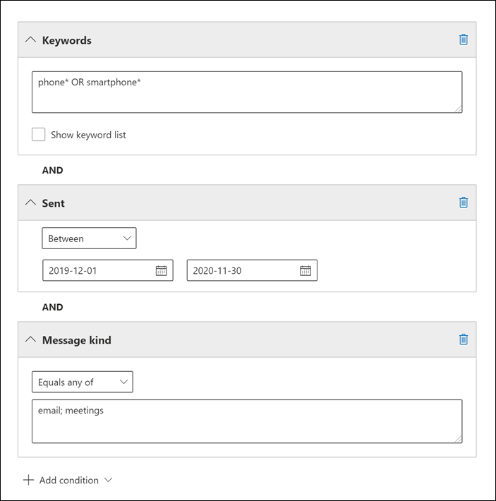

# <a name="keyword-queries-and-search-conditions-for-ediscovery"></a><span data-ttu-id="f0a5c-103">Trefwoordquery's en zoekvoorwaarden voor eDiscovery</span><span class="sxs-lookup"><span data-stu-id="f0a5c-103">Keyword queries and search conditions for eDiscovery</span></span>

<span data-ttu-id="f0a5c-104">In dit onderwerp worden de e-mail- en documenteigenschappen beschreven die u kunt zoeken in e-mailitems en Microsoft Teams chatgesprekken in Exchange Online, en documenten die zijn opgeslagen op SharePoint- en OneDrive voor Bedrijven-sites met behulp van de eDiscovery-zoekhulpmiddelen in de Microsoft 365-compliancecentrum.</span><span class="sxs-lookup"><span data-stu-id="f0a5c-104">This topic describes the email and document properties that you can search for in email items and Microsoft Teams chat conversations in Exchange Online, and documents stored on SharePoint and OneDrive for Business sites using the eDiscovery search tools in the Microsoft 365 compliance center.</span></span> <span data-ttu-id="f0a5c-105">Dit omvat inhoud zoeken, Core eDiscovery en Advanced eDiscovery (eDiscovery-zoekopdrachten in Advanced eDiscovery worden verzamelingen *genoemd).*</span><span class="sxs-lookup"><span data-stu-id="f0a5c-105">This includes Content search, Core eDiscovery, and Advanced eDiscovery (eDiscovery searches in Advanced eDiscovery are called *collections*).</span></span> <span data-ttu-id="f0a5c-106">U kunt ook de **\* cmdlets -ComplianceSearch** in Security & Compliance Center PowerShell gebruiken om naar deze eigenschappen te zoeken.</span><span class="sxs-lookup"><span data-stu-id="f0a5c-106">You can also use the **\*-ComplianceSearch** cmdlets in Security & Compliance Center PowerShell to search for these properties.</span></span> <span data-ttu-id="f0a5c-107">In het onderwerp wordt ook beschreven:</span><span class="sxs-lookup"><span data-stu-id="f0a5c-107">The topic also describes:</span></span>
  
- <span data-ttu-id="f0a5c-108">Gebruik Booleaanse zoekoperatoren, zoekvoorwaarden en andere zoekquerytechnieken om uw zoekresultaten te verfijnen.</span><span class="sxs-lookup"><span data-stu-id="f0a5c-108">Using Boolean search operators, search conditions, and other search query techniques to refine your search results.</span></span>

- <span data-ttu-id="f0a5c-109">Zoeken naar gevoelige gegevenstypen en aangepaste gevoelige gegevenstypen in SharePoint en OneDrive voor Bedrijven.</span><span class="sxs-lookup"><span data-stu-id="f0a5c-109">Searching for sensitive data types and custom sensitive data types in SharePoint and OneDrive for Business.</span></span>

- <span data-ttu-id="f0a5c-110">Zoeken naar site-inhoud die wordt gedeeld met gebruikers buiten uw organisatie</span><span class="sxs-lookup"><span data-stu-id="f0a5c-110">Searching for site content that's shared with users outside of your organization</span></span>

<span data-ttu-id="f0a5c-111">Zie voor stapsgewijs instructies over het maken van verschillende eDiscovery-zoekopdrachten:</span><span class="sxs-lookup"><span data-stu-id="f0a5c-111">For step-by-step instructions on how to create different eDiscovery searches, see:</span></span>

- [<span data-ttu-id="f0a5c-112">Inhoud zoeken</span><span class="sxs-lookup"><span data-stu-id="f0a5c-112">Content search</span></span>](content-search.md)

- [<span data-ttu-id="f0a5c-113">Zoeken naar inhoud in Core eDiscovery</span><span class="sxs-lookup"><span data-stu-id="f0a5c-113">Search for content in Core eDiscovery</span></span>](search-for-content-in-core-ediscovery.md)

- [<span data-ttu-id="f0a5c-114">Een conceptverzameling maken in Advanced eDiscovery</span><span class="sxs-lookup"><span data-stu-id="f0a5c-114">Create a draft collection in Advanced eDiscovery</span></span>](create-draft-collection.md)

> [!NOTE]
> <span data-ttu-id="f0a5c-115">eDiscovery zoekt in de Microsoft 365-compliancecentrum en de bijbehorende **\* -ComplianceSearch-cmdlets** in Security & Compliance Center PowerShell gebruiken de Keyword Query Language (KQL).</span><span class="sxs-lookup"><span data-stu-id="f0a5c-115">eDiscovery searches in the Microsoft 365 compliance center and the corresponding **\*-ComplianceSearch** cmdlets in Security & Compliance Center PowerShell use the Keyword Query Language (KQL).</span></span> <span data-ttu-id="f0a5c-116">Zie Verwijzing naar de syntaxis [van de trefwoordquerytaal voor](/sharepoint/dev/general-development/keyword-query-language-kql-syntax-reference)meer informatie.</span><span class="sxs-lookup"><span data-stu-id="f0a5c-116">For more detailed information, see [Keyword Query Language syntax reference](/sharepoint/dev/general-development/keyword-query-language-kql-syntax-reference).</span></span>
  
## <a name="searchable-email-properties"></a><span data-ttu-id="f0a5c-117">Doorzoekbare e-maileigenschappen</span><span class="sxs-lookup"><span data-stu-id="f0a5c-117">Searchable email properties</span></span>

<span data-ttu-id="f0a5c-118">De volgende tabel bevat eigenschappen van **e-mailberichten** die kunnen worden doorzocht met behulp van de eDiscovery-zoekhulpmiddelen in de Microsoft 365-compliancecentrum of met de cmdlet Nieuw complianceonderzoek of de cmdlet **Set-ComplianceSearch.**</span><span class="sxs-lookup"><span data-stu-id="f0a5c-118">The following table lists email message properties that can be searched by using the eDiscovery search tools in the Microsoft 365 compliance center or by using the **New-ComplianceSearch** or the **Set-ComplianceSearch** cmdlet.</span></span> <span data-ttu-id="f0a5c-119">De tabel bevat een voorbeeld van de  _syntaxis van eigenschap:waarde_ voor elke eigenschap en een beschrijving van de zoekresultaten die door de voorbeelden worden geretourneerd.</span><span class="sxs-lookup"><span data-stu-id="f0a5c-119">The table includes an example of the  _property:value_ syntax for each property and a description of the search results returned by the examples.</span></span> <span data-ttu-id="f0a5c-120">U kunt deze paren typen in het  `property:value` vak Trefwoorden voor een eDiscovery-zoekopdracht.</span><span class="sxs-lookup"><span data-stu-id="f0a5c-120">You can type these  `property:value` pairs in the keywords box for an eDiscovery search.</span></span> 

> [!NOTE]
> <span data-ttu-id="f0a5c-121">Bij het zoeken naar e-maileigenschappen is het niet mogelijk om te zoeken naar items waarin de opgegeven eigenschap leeg of leeg is.</span><span class="sxs-lookup"><span data-stu-id="f0a5c-121">When searching email properties, it's not possible to search for items in which the specified property is empty or blank.</span></span> <span data-ttu-id="f0a5c-122">Als u bijvoorbeeld het *eigenschap:waardepaar* **onderwerp:""** gebruikt om te zoeken naar e-mailberichten met een lege onderwerpregel, resulteert dit in nul resultaten.</span><span class="sxs-lookup"><span data-stu-id="f0a5c-122">For example, using the *property:value* pair of **subject:""** to search for email messages with an empty subject line will return zero results.</span></span> <span data-ttu-id="f0a5c-123">Dit geldt ook voor het zoeken naar site- en contacteigenschappen.</span><span class="sxs-lookup"><span data-stu-id="f0a5c-123">This also applies when searching site and contact properties.</span></span>
  
| <span data-ttu-id="f0a5c-124">Eigenschap</span><span class="sxs-lookup"><span data-stu-id="f0a5c-124">Property</span></span> | <span data-ttu-id="f0a5c-125">Beschrijving van eigenschap</span><span class="sxs-lookup"><span data-stu-id="f0a5c-125">Property description</span></span> | <span data-ttu-id="f0a5c-126">Voorbeelden</span><span class="sxs-lookup"><span data-stu-id="f0a5c-126">Examples</span></span> | <span data-ttu-id="f0a5c-127">Zoekresultaten die door de voorbeelden worden geretourneerd</span><span class="sxs-lookup"><span data-stu-id="f0a5c-127">Search results returned by the examples</span></span> |
|:-----|:-----|:-----|:-----|
|<span data-ttu-id="f0a5c-128">Bijlagenamen</span><span class="sxs-lookup"><span data-stu-id="f0a5c-128">AttachmentNames</span></span>|<span data-ttu-id="f0a5c-129">De namen van bestanden die aan een e-mailbericht zijn gekoppeld.</span><span class="sxs-lookup"><span data-stu-id="f0a5c-129">The names of files attached to an email message.</span></span>|`attachmentnames:annualreport.ppt`  <br/> `attachmentnames:annual*` <br/> `attachmentnames:.pptx` |<span data-ttu-id="f0a5c-130">Berichten met een bijgevoegd bestand met de naam annualreport.ppt.</span><span class="sxs-lookup"><span data-stu-id="f0a5c-130">Messages that have an attached file named annualreport.ppt.</span></span> <span data-ttu-id="f0a5c-131">In het tweede voorbeeld retourneert u met het jokerteken ( \* ) berichten met het woord 'jaarlijks' in de bestandsnaam van een bijlage.</span><span class="sxs-lookup"><span data-stu-id="f0a5c-131">In the second example, using the wildcard character ( \* ) returns messages with the word "annual" in the file name of an attachment.</span></span> <span data-ttu-id="f0a5c-132">Het derde voorbeeld retourneert alle bijlagen met de pptx-bestandsextensie.</span><span class="sxs-lookup"><span data-stu-id="f0a5c-132">The third example returns all attachments with the pptx file extension.</span></span>|
|<span data-ttu-id="f0a5c-133">BCC</span><span class="sxs-lookup"><span data-stu-id="f0a5c-133">Bcc</span></span>|<span data-ttu-id="f0a5c-134">Het veld BCC van een e-mailbericht. <sup>1</sup></span><span class="sxs-lookup"><span data-stu-id="f0a5c-134">The Bcc field of an email message.<sup>1</sup></span></span>|`bcc:pilarp@contoso.com`  <br/> `bcc:pilarp`  <br/> `bcc:"Pilar Pinilla"`|<span data-ttu-id="f0a5c-135">Alle voorbeelden retourneren berichten met Pilar Pinilla in het veld BCC.</span><span class="sxs-lookup"><span data-stu-id="f0a5c-135">All examples return messages with Pilar Pinilla included in the Bcc field.</span></span>|
|<span data-ttu-id="f0a5c-136">Categorie</span><span class="sxs-lookup"><span data-stu-id="f0a5c-136">Category</span></span>| <span data-ttu-id="f0a5c-137">De categorieën die u wilt zoeken.</span><span class="sxs-lookup"><span data-stu-id="f0a5c-137">The categories to search.</span></span> <span data-ttu-id="f0a5c-138">Categorieën kunnen door gebruikers worden gedefinieerd met Outlook of webversie van Outlook (voorheen bekend als Outlook Web App).</span><span class="sxs-lookup"><span data-stu-id="f0a5c-138">Categories can be defined by users by using Outlook or Outlook on the web (formerly known as Outlook Web App).</span></span> <span data-ttu-id="f0a5c-139">Mogelijke waarden zijn:</span><span class="sxs-lookup"><span data-stu-id="f0a5c-139">The possible values are:</span></span>  <br/><br/>  <span data-ttu-id="f0a5c-140">blauw</span><span class="sxs-lookup"><span data-stu-id="f0a5c-140">blue</span></span>  <br/>  <span data-ttu-id="f0a5c-141">groen</span><span class="sxs-lookup"><span data-stu-id="f0a5c-141">green</span></span>  <br/>  <span data-ttu-id="f0a5c-142">oranje</span><span class="sxs-lookup"><span data-stu-id="f0a5c-142">orange</span></span>  <br/>  <span data-ttu-id="f0a5c-143">paars</span><span class="sxs-lookup"><span data-stu-id="f0a5c-143">purple</span></span>  <br/>  <span data-ttu-id="f0a5c-144">rood</span><span class="sxs-lookup"><span data-stu-id="f0a5c-144">red</span></span>  <br/>  <span data-ttu-id="f0a5c-145">geel</span><span class="sxs-lookup"><span data-stu-id="f0a5c-145">yellow</span></span>|`category:"Red Category"`|<span data-ttu-id="f0a5c-146">Berichten die de rode categorie in de bronpostvakken hebben gekregen.</span><span class="sxs-lookup"><span data-stu-id="f0a5c-146">Messages that have been assigned the red category in the source mailboxes.</span></span>|
|<span data-ttu-id="f0a5c-147">CC</span><span class="sxs-lookup"><span data-stu-id="f0a5c-147">Cc</span></span>|<span data-ttu-id="f0a5c-148">Het veld CC van een e-mailbericht. <sup>1</sup></span><span class="sxs-lookup"><span data-stu-id="f0a5c-148">The Cc field of an email message.<sup>1</sup></span></span>|`cc:pilarp@contoso.com`  <br/> `cc:"Pilar Pinilla"`|<span data-ttu-id="f0a5c-149">In beide voorbeelden worden berichten met Pilar Pinilla opgegeven in het veld CC.</span><span class="sxs-lookup"><span data-stu-id="f0a5c-149">In both examples, messages with Pilar Pinilla specified in the Cc field.</span></span>|
|<span data-ttu-id="f0a5c-150">Mapid</span><span class="sxs-lookup"><span data-stu-id="f0a5c-150">Folderid</span></span>|<span data-ttu-id="f0a5c-151">De map-id (GUID) van een specifieke postvakmap.</span><span class="sxs-lookup"><span data-stu-id="f0a5c-151">The folder ID (GUID) of a specific mailbox folder.</span></span> <span data-ttu-id="f0a5c-152">Als u deze eigenschap gebruikt, moet u zoeken in het postvak waarin de opgegeven map zich bevindt.</span><span class="sxs-lookup"><span data-stu-id="f0a5c-152">If you use this property, be sure to search the mailbox that the specified folder is located in.</span></span> <span data-ttu-id="f0a5c-153">Alleen de opgegeven map wordt doorzocht.</span><span class="sxs-lookup"><span data-stu-id="f0a5c-153">Only the specified folder will be searched.</span></span> <span data-ttu-id="f0a5c-154">Eventuele submappen in de map worden niet doorzocht.</span><span class="sxs-lookup"><span data-stu-id="f0a5c-154">Any subfolders in the folder won't be searched.</span></span> <span data-ttu-id="f0a5c-155">Als u submappen wilt zoeken, moet u de eigenschap Mapid gebruiken voor de submap die u wilt zoeken.</span><span class="sxs-lookup"><span data-stu-id="f0a5c-155">To search subfolders, you need to use the Folderid property for the subfolder you want to search.</span></span>  <br/> <span data-ttu-id="f0a5c-156">Zie Inhoud zoeken voor gerichte verzamelingen gebruiken voor meer informatie over het zoeken naar de eigenschap Mapid en het gebruik van een script voor het verkrijgen van de map-ID's voor [een specifiek postvak.](use-content-search-for-targeted-collections.md)</span><span class="sxs-lookup"><span data-stu-id="f0a5c-156">For more information about searching for the Folderid property and using a script to obtain the folder IDs for a specific mailbox, see [Use Content search for targeted collections](use-content-search-for-targeted-collections.md).</span></span>|`folderid:4D6DD7F943C29041A65787E30F02AD1F00000000013A0000`  <br/> `folderid:2370FB455F82FC44BE31397F47B632A70000000001160000 AND participants:garthf@contoso.com`|<span data-ttu-id="f0a5c-157">Het eerste voorbeeld retourneert alle items in de opgegeven postvakmap.</span><span class="sxs-lookup"><span data-stu-id="f0a5c-157">The first example returns all items in the specified mailbox folder.</span></span> <span data-ttu-id="f0a5c-158">Het tweede voorbeeld retourneert alle items in de opgegeven postvakmap die zijn verzonden of ontvangen door garthf@contoso.com.</span><span class="sxs-lookup"><span data-stu-id="f0a5c-158">The second example returns all items in the specified mailbox folder that were sent or received by garthf@contoso.com.</span></span>|
|<span data-ttu-id="f0a5c-159">Van</span><span class="sxs-lookup"><span data-stu-id="f0a5c-159">From</span></span>|<span data-ttu-id="f0a5c-160">De afzender van een e-mailbericht. <sup>1</sup></span><span class="sxs-lookup"><span data-stu-id="f0a5c-160">The sender of an email message.<sup>1</sup></span></span>|`from:pilarp@contoso.com`  <br/> `from:contoso.com`|<span data-ttu-id="f0a5c-161">Berichten die zijn verzonden door de opgegeven gebruiker of verzonden vanuit een opgegeven domein.</span><span class="sxs-lookup"><span data-stu-id="f0a5c-161">Messages sent by the specified user or sent from a specified domain.</span></span>|
|<span data-ttu-id="f0a5c-162">HasAttachment</span><span class="sxs-lookup"><span data-stu-id="f0a5c-162">HasAttachment</span></span>|<span data-ttu-id="f0a5c-163">Geeft aan of een bericht een bijlage heeft.</span><span class="sxs-lookup"><span data-stu-id="f0a5c-163">Indicates whether a message has an attachment.</span></span> <span data-ttu-id="f0a5c-164">Gebruik de waarden **waar** of **onwaar.**</span><span class="sxs-lookup"><span data-stu-id="f0a5c-164">Use the values **true** or **false**.</span></span>|`from:pilar@contoso.com AND hasattachment:true`|<span data-ttu-id="f0a5c-165">Berichten die zijn verzonden door de opgegeven gebruiker met bijlagen.</span><span class="sxs-lookup"><span data-stu-id="f0a5c-165">Messages sent by the specified user that have attachments.</span></span>|
|<span data-ttu-id="f0a5c-166">Belang</span><span class="sxs-lookup"><span data-stu-id="f0a5c-166">Importance</span></span>|<span data-ttu-id="f0a5c-167">Het belang van een e-mailbericht, dat een afzender kan opgeven bij het verzenden van een bericht.</span><span class="sxs-lookup"><span data-stu-id="f0a5c-167">The importance of an email message, which a sender can specify when sending a message.</span></span> <span data-ttu-id="f0a5c-168">Berichten worden standaard verzonden met een normaal belang, tenzij de afzender het belang als **hoog** of laag **in stelt.**</span><span class="sxs-lookup"><span data-stu-id="f0a5c-168">By default, messages are sent with normal importance, unless the sender sets the importance as **high** or **low**.</span></span>|`importance:high`  <br/> `importance:medium`  <br/> `importance:low`|<span data-ttu-id="f0a5c-169">Berichten die zijn gemarkeerd als hoog belang, gemiddeld belang of lage betekenis.</span><span class="sxs-lookup"><span data-stu-id="f0a5c-169">Messages that are marked as high importance, medium importance, or low importance.</span></span>|
|<span data-ttu-id="f0a5c-170">IsRead</span><span class="sxs-lookup"><span data-stu-id="f0a5c-170">IsRead</span></span>|<span data-ttu-id="f0a5c-171">Geeft aan of berichten zijn gelezen.</span><span class="sxs-lookup"><span data-stu-id="f0a5c-171">Indicates whether messages have been read.</span></span> <span data-ttu-id="f0a5c-172">Gebruik de waarden **waar** of **onwaar.**</span><span class="sxs-lookup"><span data-stu-id="f0a5c-172">Use the values **true** or **false**.</span></span>|`isread:true`  <br/> `isread:false`|<span data-ttu-id="f0a5c-173">Het eerste voorbeeld retourneert berichten met de eigenschap IsRead die is ingesteld op **Waar.**</span><span class="sxs-lookup"><span data-stu-id="f0a5c-173">The first example returns messages with the IsRead property set to **True**.</span></span> <span data-ttu-id="f0a5c-174">Het tweede voorbeeld retourneert berichten met de eigenschap IsRead ingesteld op **Onwaar.**</span><span class="sxs-lookup"><span data-stu-id="f0a5c-174">The second example returns messages with the IsRead property set to **False**.</span></span>|
|<span data-ttu-id="f0a5c-175">Itemclass</span><span class="sxs-lookup"><span data-stu-id="f0a5c-175">ItemClass</span></span>|<span data-ttu-id="f0a5c-176">Gebruik deze eigenschap om te zoeken naar specifieke gegevenstypen van derden die uw organisatie heeft geïmporteerd om Office 365.</span><span class="sxs-lookup"><span data-stu-id="f0a5c-176">Use this property to search specific third-party data types that your organization imported to Office 365.</span></span> <span data-ttu-id="f0a5c-177">Gebruik de volgende syntaxis voor deze eigenschap:  `itemclass:ipm.externaldata.<third-party data type>*`</span><span class="sxs-lookup"><span data-stu-id="f0a5c-177">Use the following syntax for this property:  `itemclass:ipm.externaldata.<third-party data type>*`</span></span>|`itemclass:ipm.externaldata.Facebook* AND subject:contoso`  <br/> `itemclass:ipm.externaldata.Twitter* AND from:"Ann Beebe" AND "Northwind Traders"`|<span data-ttu-id="f0a5c-178">Het eerste voorbeeld retourneert Facebook-items met het woord 'contoso' in de eigenschap Onderwerp.</span><span class="sxs-lookup"><span data-stu-id="f0a5c-178">The first example returns Facebook items that contain the word "contoso" in the Subject property.</span></span> <span data-ttu-id="f0a5c-179">Het tweede voorbeeld retourneert Twitter-items die zijn gepost door Ann Beebe en die de trefwoordzin 'Northwind Traders' bevatten.</span><span class="sxs-lookup"><span data-stu-id="f0a5c-179">The second example returns Twitter items that were posted by Ann Beebe and that contain the keyword phrase "Northwind Traders".</span></span>  <br/> <span data-ttu-id="f0a5c-180">Zie Inhoud zoeken gebruiken om te zoeken naar gegevens van derden die zijn geïmporteerd in Office 365 [voor](use-content-search-to-search-third-party-data-that-was-imported.md)een volledige lijst met waarden die u wilt gebruiken voor gegevenstypen van derden voor de eigenschap ItemClass.</span><span class="sxs-lookup"><span data-stu-id="f0a5c-180">For a complete list of values to use for third-party data types for the ItemClass property, see [Use Content search to search third-party data that was imported to Office 365](use-content-search-to-search-third-party-data-that-was-imported.md).</span></span>|
|<span data-ttu-id="f0a5c-181">Soort</span><span class="sxs-lookup"><span data-stu-id="f0a5c-181">Kind</span></span>| <span data-ttu-id="f0a5c-182">Het type e-mailbericht dat u wilt zoeken.</span><span class="sxs-lookup"><span data-stu-id="f0a5c-182">The type of email message to search for.</span></span> <span data-ttu-id="f0a5c-183">Mogelijke waarden:</span><span class="sxs-lookup"><span data-stu-id="f0a5c-183">Possible values:</span></span>  <br/>  <span data-ttu-id="f0a5c-184">contactpersonen</span><span class="sxs-lookup"><span data-stu-id="f0a5c-184">contacts</span></span>  <br/>  <span data-ttu-id="f0a5c-185">docs</span><span class="sxs-lookup"><span data-stu-id="f0a5c-185">docs</span></span>  <br/>  <span data-ttu-id="f0a5c-186">e-mail</span><span class="sxs-lookup"><span data-stu-id="f0a5c-186">email</span></span>  <br/>  <span data-ttu-id="f0a5c-187">externe gegevens</span><span class="sxs-lookup"><span data-stu-id="f0a5c-187">externaldata</span></span>  <br/>  <span data-ttu-id="f0a5c-188">faxen</span><span class="sxs-lookup"><span data-stu-id="f0a5c-188">faxes</span></span>  <br/>  <span data-ttu-id="f0a5c-189">im</span><span class="sxs-lookup"><span data-stu-id="f0a5c-189">im</span></span>  <br/>  <span data-ttu-id="f0a5c-190">dagboeken</span><span class="sxs-lookup"><span data-stu-id="f0a5c-190">journals</span></span>  <br/>  <span data-ttu-id="f0a5c-191">vergaderingen</span><span class="sxs-lookup"><span data-stu-id="f0a5c-191">meetings</span></span>  <br/>  <span data-ttu-id="f0a5c-192">microsoftteams (retourneert items uit chats, vergaderingen en oproepen in Microsoft Teams)</span><span class="sxs-lookup"><span data-stu-id="f0a5c-192">microsoftteams (returns items from chats, meetings, and calls in Microsoft Teams)</span></span>  <br/>  <span data-ttu-id="f0a5c-193">notities</span><span class="sxs-lookup"><span data-stu-id="f0a5c-193">notes</span></span>  <br/>  <span data-ttu-id="f0a5c-194">berichten</span><span class="sxs-lookup"><span data-stu-id="f0a5c-194">posts</span></span>  <br/>  <span data-ttu-id="f0a5c-195">rssfeeds</span><span class="sxs-lookup"><span data-stu-id="f0a5c-195">rssfeeds</span></span>  <br/>  <span data-ttu-id="f0a5c-196">taken</span><span class="sxs-lookup"><span data-stu-id="f0a5c-196">tasks</span></span>  <br/>  <span data-ttu-id="f0a5c-197">voicemail</span><span class="sxs-lookup"><span data-stu-id="f0a5c-197">voicemail</span></span>|`kind:email`  <br/> `kind:email OR kind:im OR kind:voicemail`  <br/> `kind:externaldata`|<span data-ttu-id="f0a5c-198">Het eerste voorbeeld retourneert e-mailberichten die voldoen aan de zoekcriteria.</span><span class="sxs-lookup"><span data-stu-id="f0a5c-198">The first example returns email messages that meet the search criteria.</span></span> <span data-ttu-id="f0a5c-199">Het tweede voorbeeld retourneert e-mailberichten, chatgesprekken (Skype voor Bedrijven gesprekken en chats in Microsoft Teams) en spraakberichten die voldoen aan de zoekcriteria.</span><span class="sxs-lookup"><span data-stu-id="f0a5c-199">The second example returns email messages, instant messaging conversations (including Skype for Business conversations and chats in Microsoft Teams), and voice messages that meet the search criteria.</span></span> <span data-ttu-id="f0a5c-200">Het derde voorbeeld retourneert items die zijn geïmporteerd in postvakken in Microsoft 365 uit gegevensbronnen van derden, zoals Twitter, Facebook en Cisco Jabber, die voldoen aan de zoekcriteria.</span><span class="sxs-lookup"><span data-stu-id="f0a5c-200">The third example returns items that were imported to mailboxes in Microsoft 365 from third-party data sources, such as Twitter, Facebook, and Cisco Jabber, that meet the search criteria.</span></span> <span data-ttu-id="f0a5c-201">Zie Gegevens van derden archiveren [in](https://www.microsoft.com/?ref=go)Office 365.</span><span class="sxs-lookup"><span data-stu-id="f0a5c-201">For more information, see [Archiving third-party data in Office 365](https://www.microsoft.com/?ref=go).</span></span>|
|<span data-ttu-id="f0a5c-202">Deelnemers</span><span class="sxs-lookup"><span data-stu-id="f0a5c-202">Participants</span></span>|<span data-ttu-id="f0a5c-203">Alle personenvelden in een e-mailbericht.</span><span class="sxs-lookup"><span data-stu-id="f0a5c-203">All the people fields in an email message.</span></span> <span data-ttu-id="f0a5c-204">Deze velden zijn Van, Aan, CC en BCC.<sup>1</sup></span><span class="sxs-lookup"><span data-stu-id="f0a5c-204">These fields are From, To, Cc, and Bcc.<sup>1</sup></span></span>|`participants:garthf@contoso.com`  <br/> `participants:contoso.com`|<span data-ttu-id="f0a5c-205">Berichten die zijn verzonden door of verzonden naar garthf@contoso.com.</span><span class="sxs-lookup"><span data-stu-id="f0a5c-205">Messages sent by or sent to garthf@contoso.com.</span></span> <span data-ttu-id="f0a5c-206">Het tweede voorbeeld retourneert alle berichten die zijn verzonden door of verzonden naar een gebruiker in het contoso.com domein.</span><span class="sxs-lookup"><span data-stu-id="f0a5c-206">The second example returns all messages sent by or sent to a user in the contoso.com domain.</span></span>|
|<span data-ttu-id="f0a5c-207">Ontvangen</span><span class="sxs-lookup"><span data-stu-id="f0a5c-207">Received</span></span>|<span data-ttu-id="f0a5c-208">De datum waarop een e-mailbericht is ontvangen door een geadresseerde.</span><span class="sxs-lookup"><span data-stu-id="f0a5c-208">The date that an email message was received by a recipient.</span></span>|`received:04/15/2016`  <br/> `received>=01/01/2016 AND received<=03/31/2016`|<span data-ttu-id="f0a5c-209">Berichten die zijn ontvangen op 15 april 2016.</span><span class="sxs-lookup"><span data-stu-id="f0a5c-209">Messages that were received on April 15, 2016.</span></span> <span data-ttu-id="f0a5c-210">Het tweede voorbeeld retourneert alle berichten die zijn ontvangen tussen 1 januari 2016 en 31 maart 2016.</span><span class="sxs-lookup"><span data-stu-id="f0a5c-210">The second example returns all messages received between January 1, 2016 and March 31, 2016.</span></span>|
|<span data-ttu-id="f0a5c-211">Geadresseerden</span><span class="sxs-lookup"><span data-stu-id="f0a5c-211">Recipients</span></span>|<span data-ttu-id="f0a5c-212">Alle geadresseerdevelden in een e-mailbericht.</span><span class="sxs-lookup"><span data-stu-id="f0a5c-212">All recipient fields in an email message.</span></span> <span data-ttu-id="f0a5c-213">Deze velden zijn Aan, CC en BCC.<sup>1</sup></span><span class="sxs-lookup"><span data-stu-id="f0a5c-213">These fields are To, Cc, and Bcc.<sup>1</sup></span></span>|`recipients:garthf@contoso.com`  <br/> `recipients:contoso.com`|<span data-ttu-id="f0a5c-214">Berichten die naar garthf@contoso.com.</span><span class="sxs-lookup"><span data-stu-id="f0a5c-214">Messages sent to garthf@contoso.com.</span></span> <span data-ttu-id="f0a5c-215">Het tweede voorbeeld retourneert berichten die zijn verzonden naar een geadresseerde in contoso.com domein.</span><span class="sxs-lookup"><span data-stu-id="f0a5c-215">The second example returns messages sent to any recipient in the contoso.com domain.</span></span>|
|<span data-ttu-id="f0a5c-216">Verzonden</span><span class="sxs-lookup"><span data-stu-id="f0a5c-216">Sent</span></span>|<span data-ttu-id="f0a5c-217">De datum waarop een e-mailbericht is verzonden door de afzender.</span><span class="sxs-lookup"><span data-stu-id="f0a5c-217">The date that an email message was sent by the sender.</span></span>|`sent:07/01/2016`  <br/> `sent>=06/01/2016 AND sent<=07/01/2016`|<span data-ttu-id="f0a5c-218">Berichten die op de opgegeven datum zijn verzonden of binnen het opgegeven datumbereik zijn verzonden.</span><span class="sxs-lookup"><span data-stu-id="f0a5c-218">Messages that were sent on the specified date or sent within the specified date range.</span></span>|
|<span data-ttu-id="f0a5c-219">Grootte</span><span class="sxs-lookup"><span data-stu-id="f0a5c-219">Size</span></span>|<span data-ttu-id="f0a5c-220">De grootte van een item, in bytes.</span><span class="sxs-lookup"><span data-stu-id="f0a5c-220">The size of an item, in bytes.</span></span>|`size>26214400`  <br/> `size:1..1048567`|<span data-ttu-id="f0a5c-221">Berichten groter dan 25 MB.</span><span class="sxs-lookup"><span data-stu-id="f0a5c-221">Messages larger than 25 MB.</span></span> <span data-ttu-id="f0a5c-222">Het tweede voorbeeld retourneert berichten van 1 tot en met 1.048.567 bytes (1 MB) in grootte.</span><span class="sxs-lookup"><span data-stu-id="f0a5c-222">The second example returns messages from 1 through 1,048,567 bytes (1 MB) in size.</span></span>|
|<span data-ttu-id="f0a5c-223">Onderwerp</span><span class="sxs-lookup"><span data-stu-id="f0a5c-223">Subject</span></span>|<span data-ttu-id="f0a5c-224">De tekst in de onderwerpregel van een e-mailbericht.</span><span class="sxs-lookup"><span data-stu-id="f0a5c-224">The text in the subject line of an email message.</span></span>  <br/> <span data-ttu-id="f0a5c-225">**Opmerking:** Wanneer u de eigenschap Onderwerp in een query gebruikt, retourneert de zoekopdracht alle berichten waarin de onderwerpregel de tekst bevat die u zoekt.</span><span class="sxs-lookup"><span data-stu-id="f0a5c-225">**Note:** When you use the Subject property in a query, the search returns all messages in which the subject line contains the text you're searching for.</span></span> <span data-ttu-id="f0a5c-226">Met andere woorden, de query geeft niet alleen de berichten weer die exact overeenkomen.</span><span class="sxs-lookup"><span data-stu-id="f0a5c-226">In other words, the query doesn't return only those messages that have an exact match.</span></span> <span data-ttu-id="f0a5c-227">Als u bijvoorbeeld zoekt naar , bevatten uw resultaten berichten met het  `subject:"Quarterly Financials"` onderwerp 'Kwartaalcijfers 2018'.</span><span class="sxs-lookup"><span data-stu-id="f0a5c-227">For example, if you search for  `subject:"Quarterly Financials"`, your results will include messages with the subject "Quarterly Financials 2018".</span></span>|`subject:"Quarterly Financials"`  <br/> `subject:northwind`|<span data-ttu-id="f0a5c-228">Berichten met de zin 'Kwartaalcijfers' ergens in de tekst van de onderwerpregel.</span><span class="sxs-lookup"><span data-stu-id="f0a5c-228">Messages that contain the phrase "Quarterly Financials" anywhere in the text of the subject line.</span></span> <span data-ttu-id="f0a5c-229">Het tweede voorbeeld retourneert alle berichten die het woord noordenwind in de onderwerpregel bevatten.</span><span class="sxs-lookup"><span data-stu-id="f0a5c-229">The second example returns all messages that contain the word northwind in the subject line.</span></span>|
|<span data-ttu-id="f0a5c-230">Naar</span><span class="sxs-lookup"><span data-stu-id="f0a5c-230">To</span></span>|<span data-ttu-id="f0a5c-231">Het veld Aan van een e-mailbericht. <sup>1</sup></span><span class="sxs-lookup"><span data-stu-id="f0a5c-231">The To field of an email message.<sup>1</sup></span></span>|`to:annb@contoso.com`  <br/> `to:annb ` <br/> `to:"Ann Beebe"`|<span data-ttu-id="f0a5c-232">Alle voorbeelden retourneren berichten waarin Ann Beebe is opgegeven in de regel Aan: .</span><span class="sxs-lookup"><span data-stu-id="f0a5c-232">All examples return messages where Ann Beebe is specified in the To: line.</span></span>|
|||||
   
> [!NOTE]
> <span data-ttu-id="f0a5c-233"><sup>1</sup> Voor de waarde van een geadresseerde-eigenschap  kunt u e-mailadres (ook wel gebruikersnaam of UPN), weergavenaam of alias gebruiken om een gebruiker op te geven.</span><span class="sxs-lookup"><span data-stu-id="f0a5c-233"><sup>1</sup> For the value of a recipient property, you can use email address (also called *user principal name* or UPN), display name, or alias to specify a user.</span></span> <span data-ttu-id="f0a5c-234">U kunt bijvoorbeeld een annb@contoso.com, annb of Ann Beebe gebruiken om de gebruiker Ann Beebe op te geven.</span><span class="sxs-lookup"><span data-stu-id="f0a5c-234">For example, you can use annb@contoso.com, annb, or "Ann Beebe" to specify the user Ann Beebe.</span></span>

### <a name="recipient-expansion"></a><span data-ttu-id="f0a5c-235">Uitbreiding geadresseerde</span><span class="sxs-lookup"><span data-stu-id="f0a5c-235">Recipient expansion</span></span>

<span data-ttu-id="f0a5c-236">Bij het zoeken naar een van de eigenschappen van de geadresseerden (Van, Aan, CC, BCC, Deelnemers en Geadresseerden) probeert Microsoft 365 de identiteit van elke gebruiker uit te breiden door ze op te zoeken in Azure Active Directory (Azure AD).</span><span class="sxs-lookup"><span data-stu-id="f0a5c-236">When searching any of the recipient properties (From, To, Cc, Bcc, Participants, and Recipients), Microsoft 365 attempts to expand the identity of each user by looking them up in Azure Active Directory (Azure AD).</span></span>  <span data-ttu-id="f0a5c-237">Als de gebruiker wordt gevonden in Azure AD, wordt de query uitgebreid met het e-mailadres (of UPN), alias, weergavenaam en LegacyExchangeDN van de gebruiker.</span><span class="sxs-lookup"><span data-stu-id="f0a5c-237">If the user is found in Azure AD, the query is expanded to include the user's email address (or UPN), alias, display name, and LegacyExchangeDN.</span></span> <span data-ttu-id="f0a5c-238">Een query zoals bijvoorbeeld wordt `participants:ronnie@contoso.com` uitgebreid naar `participants:ronnie@contoso.com OR participants:ronnie OR participants:"Ronald Nelson" OR participants:"<LegacyExchangeDN>"` .</span><span class="sxs-lookup"><span data-stu-id="f0a5c-238">For example, a query such as `participants:ronnie@contoso.com` expands to `participants:ronnie@contoso.com OR participants:ronnie OR participants:"Ronald Nelson" OR participants:"<LegacyExchangeDN>"`.</span></span>

<span data-ttu-id="f0a5c-239">Als u uitbreiding van geadresseerden wilt voorkomen, voegt u een jokerteken (sterretje) toe aan het einde van het e-mailadres en gebruikt u een beperkte domeinnaam. Zorg er bijvoorbeeld `participants:"ronnie@contoso*"` voor dat u het e-mailadres omringt met dubbele aanhalingstekens.</span><span class="sxs-lookup"><span data-stu-id="f0a5c-239">To prevent recipient expansion, add a wild card character (asterisk) to the end of the email address and use a reduced domain name; for example, `participants:"ronnie@contoso*"` Be sure to surround the email address with double quotation marks.</span></span>

<span data-ttu-id="f0a5c-240">Let er echter op dat het voorkomen van uitbreiding van geadresseerden in de zoekquery ertoe kan leiden dat relevante items niet worden geretourneerd in de zoekresultaten.</span><span class="sxs-lookup"><span data-stu-id="f0a5c-240">However, be aware that preventing recipient expansion in the search query may result in relevant items not being returned in the search results.</span></span> <span data-ttu-id="f0a5c-241">E-mailberichten in Exchange kunnen worden opgeslagen met verschillende tekstindelingen in de geadresseerdevelden.</span><span class="sxs-lookup"><span data-stu-id="f0a5c-241">Email messages in Exchange can be saved with different text formats in the recipient fields.</span></span> <span data-ttu-id="f0a5c-242">Uitbreiding van geadresseerden is bedoeld om dit feit te beperken door berichten te retourneren die verschillende tekstindelingen kunnen bevatten.</span><span class="sxs-lookup"><span data-stu-id="f0a5c-242">Recipient expansion is intended to help mitigate this fact by returning messages that may contain different text formats.</span></span> <span data-ttu-id="f0a5c-243">Het voorkomen van uitbreiding van geadresseerden kan er dus toe leiden dat de zoekquery niet alle items retournt die relevant kunnen zijn voor uw onderzoek.</span><span class="sxs-lookup"><span data-stu-id="f0a5c-243">So preventing recipient expansion may result in the search query not returning all items that may be relevant to your investigation.</span></span>

> [!NOTE]
> <span data-ttu-id="f0a5c-244">Als u de items die door een zoekquery als gevolg van de uitbreiding van de geadresseerde worden geretourneerd, wilt controleren of beperken, kunt u overwegen om de Advanced eDiscovery.</span><span class="sxs-lookup"><span data-stu-id="f0a5c-244">If you need to review or reduce the items returned by a search query due to recipient expansion, consider using Advanced eDiscovery.</span></span> <span data-ttu-id="f0a5c-245">U kunt zoeken naar berichten (gebruikmakend van de uitbreiding van geadresseerden), deze toevoegen aan een revisieset en vervolgens query's of filters voor revisiesets gebruiken om de resultaten te bekijken of te beperken.</span><span class="sxs-lookup"><span data-stu-id="f0a5c-245">You can search for messages (taking advantage of recipient expansion), add them to a review set, and then use review set queries or filters to review or narrow the results.</span></span> <span data-ttu-id="f0a5c-246">Zie Gegevens voor een zaak [verzamelen en](collecting-data-for-ediscovery.md) De gegevens in een revisieset opvragen voor [meer informatie.](review-set-search.md)</span><span class="sxs-lookup"><span data-stu-id="f0a5c-246">For more information, see [Collect data for a case](collecting-data-for-ediscovery.md) and [Query the data in a review set](review-set-search.md).</span></span>

## <a name="searchable-site-properties"></a><span data-ttu-id="f0a5c-247">Doorzoekbare site-eigenschappen</span><span class="sxs-lookup"><span data-stu-id="f0a5c-247">Searchable site properties</span></span>

<span data-ttu-id="f0a5c-248">De volgende tabel bevat enkele van de eigenschappen SharePoint en OneDrive voor Bedrijven die kunnen worden doorzocht met behulp van de eDiscovery-zoekhulpmiddelen in het compliancecentrum van Microsoft 365 of met de cmdlet **Nieuw-complianceonderzoek** of de **cmdlet Set-ComplianceSearch.**</span><span class="sxs-lookup"><span data-stu-id="f0a5c-248">The following table lists some of the SharePoint and OneDrive for Business properties that can be searched by using the eDiscovery search tools in the Microsoft 365 compliance Center or by using the **New-ComplianceSearch** or the **Set-ComplianceSearch** cmdlet.</span></span> <span data-ttu-id="f0a5c-249">De tabel bevat een voorbeeld van de  _syntaxis van eigenschap:waarde_ voor elke eigenschap en een beschrijving van de zoekresultaten die door de voorbeelden worden geretourneerd.</span><span class="sxs-lookup"><span data-stu-id="f0a5c-249">The table includes an example of the  _property:value_ syntax for each property and a description of the search results returned by the examples.</span></span> 
  
<span data-ttu-id="f0a5c-250">Zie Overzicht van verkende en beheerde eigenschappen in SharePoint voor een volledige lijst met SharePoint eigenschappen die kunnen worden [doorzocht.](/SharePoint/technical-reference/crawled-and-managed-properties-overview)</span><span class="sxs-lookup"><span data-stu-id="f0a5c-250">For a complete list of SharePoint properties that can be searched, see [Overview of crawled and managed properties in SharePoint](/SharePoint/technical-reference/crawled-and-managed-properties-overview).</span></span> <span data-ttu-id="f0a5c-251">Eigenschappen die zijn gemarkeerd met **een Ja** in de **kolom Queryable,** kunnen worden doorzocht.</span><span class="sxs-lookup"><span data-stu-id="f0a5c-251">Properties marked with a **Yes** in the **Queryable** column can be searched.</span></span>
  
| <span data-ttu-id="f0a5c-252">Eigenschap</span><span class="sxs-lookup"><span data-stu-id="f0a5c-252">Property</span></span> | <span data-ttu-id="f0a5c-253">Beschrijving van eigenschap</span><span class="sxs-lookup"><span data-stu-id="f0a5c-253">Property description</span></span> | <span data-ttu-id="f0a5c-254">Voorbeeld</span><span class="sxs-lookup"><span data-stu-id="f0a5c-254">Example</span></span> | <span data-ttu-id="f0a5c-255">Zoekresultaten die door de voorbeelden worden geretourneerd</span><span class="sxs-lookup"><span data-stu-id="f0a5c-255">Search results returned by the examples</span></span> |
|:-----|:-----|:-----|:-----|
|<span data-ttu-id="f0a5c-256">Auteur</span><span class="sxs-lookup"><span data-stu-id="f0a5c-256">Author</span></span>|<span data-ttu-id="f0a5c-257">Het auteursveld van Office documenten, dat blijft bestaan als een document wordt gekopieerd.</span><span class="sxs-lookup"><span data-stu-id="f0a5c-257">The author field from Office documents, which persists if a document is copied.</span></span> <span data-ttu-id="f0a5c-258">Als een gebruiker bijvoorbeeld een document maakt en de e-mailberichten naar iemand anders die het vervolgens uploadt naar SharePoint, blijft de oorspronkelijke auteur behouden.</span><span class="sxs-lookup"><span data-stu-id="f0a5c-258">For example, if a user creates a document and the emails it to someone else who then uploads it to SharePoint, the document will still retain the original author.</span></span> <span data-ttu-id="f0a5c-259">Gebruik de weergavenaam van de gebruiker voor deze eigenschap.</span><span class="sxs-lookup"><span data-stu-id="f0a5c-259">Be sure to use the user's display name for this property.</span></span>|`author:"Garth Fort"`|<span data-ttu-id="f0a5c-260">Alle documenten die zijn geschreven door Garth Fort.</span><span class="sxs-lookup"><span data-stu-id="f0a5c-260">All documents that are authored by Garth Fort.</span></span>|
|<span data-ttu-id="f0a5c-261">ContentType</span><span class="sxs-lookup"><span data-stu-id="f0a5c-261">ContentType</span></span>|<span data-ttu-id="f0a5c-262">Het SharePoint inhoudstype van een item, zoals Item, Document of Video.</span><span class="sxs-lookup"><span data-stu-id="f0a5c-262">The SharePoint content type of an item, such as Item, Document, or Video.</span></span>|`contenttype:document`|<span data-ttu-id="f0a5c-263">Alle documenten worden geretourneerd.</span><span class="sxs-lookup"><span data-stu-id="f0a5c-263">All documents would be returned.</span></span>|
|<span data-ttu-id="f0a5c-264">Gemaakt</span><span class="sxs-lookup"><span data-stu-id="f0a5c-264">Created</span></span>|<span data-ttu-id="f0a5c-265">De datum waarop een item wordt gemaakt.</span><span class="sxs-lookup"><span data-stu-id="f0a5c-265">The date that an item is created.</span></span>|`created>=06/01/2016`|<span data-ttu-id="f0a5c-266">Alle items die zijn gemaakt op of na 1 juni 2016.</span><span class="sxs-lookup"><span data-stu-id="f0a5c-266">All items created on or after June 1, 2016.</span></span>|
|<span data-ttu-id="f0a5c-267">CreatedBy</span><span class="sxs-lookup"><span data-stu-id="f0a5c-267">CreatedBy</span></span>|<span data-ttu-id="f0a5c-268">De persoon die een item heeft gemaakt of geüpload.</span><span class="sxs-lookup"><span data-stu-id="f0a5c-268">The person that created or uploaded an item.</span></span> <span data-ttu-id="f0a5c-269">Gebruik de weergavenaam van de gebruiker voor deze eigenschap.</span><span class="sxs-lookup"><span data-stu-id="f0a5c-269">Be sure to use the user's display name for this property.</span></span>|`createdby:"Garth Fort"`|<span data-ttu-id="f0a5c-270">Alle items die zijn gemaakt of geüpload door Garth Fort.</span><span class="sxs-lookup"><span data-stu-id="f0a5c-270">All items created or uploaded by Garth Fort.</span></span>|
|<span data-ttu-id="f0a5c-271">DetectedLanguage</span><span class="sxs-lookup"><span data-stu-id="f0a5c-271">DetectedLanguage</span></span>|<span data-ttu-id="f0a5c-272">De taal van een item.</span><span class="sxs-lookup"><span data-stu-id="f0a5c-272">The language of an item.</span></span>|`detectedlanguage:english`|<span data-ttu-id="f0a5c-273">Alle items in het Engels.</span><span class="sxs-lookup"><span data-stu-id="f0a5c-273">All items in English.</span></span>|
|<span data-ttu-id="f0a5c-274">DocumentLink</span><span class="sxs-lookup"><span data-stu-id="f0a5c-274">DocumentLink</span></span>|<span data-ttu-id="f0a5c-275">Het pad (URL) van een specifieke map op een SharePoint of OneDrive voor Bedrijven site.</span><span class="sxs-lookup"><span data-stu-id="f0a5c-275">The path (URL) of a specific folder on a SharePoint or OneDrive for Business site.</span></span> <span data-ttu-id="f0a5c-276">Als u deze eigenschap gebruikt, moet u zoeken op de site waarin de opgegeven map zich bevindt.</span><span class="sxs-lookup"><span data-stu-id="f0a5c-276">If you use this property, be sure to search the site that the specified folder is located in.</span></span>  <br/> <span data-ttu-id="f0a5c-277">Als u items wilt retourneren in submappen van de map die u opgeeft voor de eigenschap documentlink, moet u /toevoegen aan de URL van de \* opgegeven map, bijvoorbeeld:  `documentlink: "https://contoso.sharepoint.com/Shared Documents/*"`</span><span class="sxs-lookup"><span data-stu-id="f0a5c-277">To return items located in subfolders of the folder that you specify for the documentlink property, you have to add /\* to the URL of the specified folder; for example,  `documentlink: "https://contoso.sharepoint.com/Shared Documents/*"`</span></span>  <br/> <br/><span data-ttu-id="f0a5c-278">Zie Inhoud zoeken voor gerichte verzamelingen gebruiken voor meer informatie over het zoeken naar de eigenschap documentlink en het gebruik van een script om de URL's voor documentlinks voor mappen op een specifieke site [te verkrijgen.](use-content-search-for-targeted-collections.md)</span><span class="sxs-lookup"><span data-stu-id="f0a5c-278">For more information about searching for the documentlink property and using a script to obtain the documentlink URLs for folders on a specific site, see [Use Content search for targeted collections](use-content-search-for-targeted-collections.md).</span></span>|`documentlink:"https://contoso-my.sharepoint.com/personal/garthf_contoso_com/Documents/Private"`  <br/> `documentlink:"https://contoso-my.sharepoint.com/personal/garthf_contoso_com/Documents/Shared with Everyone/*" AND filename:confidential`|<span data-ttu-id="f0a5c-279">Het eerste voorbeeld retourneert alle items in de opgegeven OneDrive voor Bedrijven map.</span><span class="sxs-lookup"><span data-stu-id="f0a5c-279">The first example returns all items in the specified OneDrive for Business folder.</span></span> <span data-ttu-id="f0a5c-280">Het tweede voorbeeld retourneert documenten in de opgegeven sitemap (en alle submappen) die het woord 'vertrouwelijk' in de bestandsnaam bevatten.</span><span class="sxs-lookup"><span data-stu-id="f0a5c-280">The second example returns documents in the specified site folder (and all subfolders) that contain the word "confidential" in the file name.</span></span>|
|<span data-ttu-id="f0a5c-281">FileExtension</span><span class="sxs-lookup"><span data-stu-id="f0a5c-281">FileExtension</span></span>|<span data-ttu-id="f0a5c-282">De uitbreiding van een bestand; bijvoorbeeld docx, one, pptx of xlsx.</span><span class="sxs-lookup"><span data-stu-id="f0a5c-282">The extension of a file; for example, docx, one, pptx, or xlsx.</span></span>|`fileextension:xlsx`|<span data-ttu-id="f0a5c-283">Alle Excel bestanden (Excel 2007 en hoger)</span><span class="sxs-lookup"><span data-stu-id="f0a5c-283">All Excel files (Excel 2007 and later)</span></span>|
|<span data-ttu-id="f0a5c-284">Bestandsnaam</span><span class="sxs-lookup"><span data-stu-id="f0a5c-284">FileName</span></span>|<span data-ttu-id="f0a5c-285">De naam van een bestand.</span><span class="sxs-lookup"><span data-stu-id="f0a5c-285">The name of a file.</span></span>|`filename:"marketing plan"`  <br/> `filename:estimate`|<span data-ttu-id="f0a5c-286">Het eerste voorbeeld retourneert bestanden met de exacte woordgroep 'marketingplan' in de titel.</span><span class="sxs-lookup"><span data-stu-id="f0a5c-286">The first example returns files with the exact phrase "marketing plan" in the title.</span></span> <span data-ttu-id="f0a5c-287">Het tweede voorbeeld retourneert bestanden met het woord 'schatting' in de bestandsnaam.</span><span class="sxs-lookup"><span data-stu-id="f0a5c-287">The second example returns files with the word "estimate" in the file name.</span></span>|
|<span data-ttu-id="f0a5c-288">LastModifiedTime</span><span class="sxs-lookup"><span data-stu-id="f0a5c-288">LastModifiedTime</span></span>|<span data-ttu-id="f0a5c-289">De datum waarop een item voor het laatst is gewijzigd.</span><span class="sxs-lookup"><span data-stu-id="f0a5c-289">The date that an item was last changed.</span></span>|`lastmodifiedtime>=05/01/2016`  <br/> `lastmodifiedtime>=05/10/2016 AND lastmodifiedtime<=06/1/2016`|<span data-ttu-id="f0a5c-290">Het eerste voorbeeld retourneert items die zijn gewijzigd op of na 1 mei 2016.</span><span class="sxs-lookup"><span data-stu-id="f0a5c-290">The first example returns items that were changed on or after May 1, 2016.</span></span> <span data-ttu-id="f0a5c-291">Het tweede voorbeeld retourneert items die zijn gewijzigd tussen 1 mei 2016 en 1 juni 2016.</span><span class="sxs-lookup"><span data-stu-id="f0a5c-291">The second example returns items changed between May 1, 2016 and June 1, 2016.</span></span>|
|<span data-ttu-id="f0a5c-292">ModifiedBy</span><span class="sxs-lookup"><span data-stu-id="f0a5c-292">ModifiedBy</span></span>|<span data-ttu-id="f0a5c-293">De persoon die een item het laatst heeft gewijzigd.</span><span class="sxs-lookup"><span data-stu-id="f0a5c-293">The person who last changed an item.</span></span> <span data-ttu-id="f0a5c-294">Gebruik de weergavenaam van de gebruiker voor deze eigenschap.</span><span class="sxs-lookup"><span data-stu-id="f0a5c-294">Be sure to use the user's display name for this property.</span></span>|`modifiedby:"Garth Fort"`|<span data-ttu-id="f0a5c-295">Alle items die voor het laatst zijn gewijzigd door Garth Fort.</span><span class="sxs-lookup"><span data-stu-id="f0a5c-295">All items that were last changed by Garth Fort.</span></span>|
|<span data-ttu-id="f0a5c-296">Pad</span><span class="sxs-lookup"><span data-stu-id="f0a5c-296">Path</span></span>|<span data-ttu-id="f0a5c-297">Het pad (URL) van een specifieke site in een SharePoint of OneDrive voor Bedrijven site.</span><span class="sxs-lookup"><span data-stu-id="f0a5c-297">The path (URL) of a specific site in a SharePoint or OneDrive for Business site.</span></span><br/><br/><span data-ttu-id="f0a5c-298">Als u alleen items van de opgegeven site wilt retourneren, moet u de trailing toevoegen aan het einde van de `/` URL, bijvoorbeeld `path: "https://contoso.sharepoint.com/sites/international/"`</span><span class="sxs-lookup"><span data-stu-id="f0a5c-298">To return items only from the specified site, you have to add the trailing `/` to the end of the URL; for example, `path: "https://contoso.sharepoint.com/sites/international/"`</span></span> <br/><br/> <span data-ttu-id="f0a5c-299">Als u items wilt retourneren die zich bevinden in mappen op de site die u opgeeft in de eigenschap Pad, moet u toevoegen aan het einde van de `/*` URL, bijvoorbeeld:  `path: "https://contoso.sharepoint.com/Shared Documents/*"`</span><span class="sxs-lookup"><span data-stu-id="f0a5c-299">To return items located in folders in the site that you specify in the path property, you have to add `/*` to the end of the URL; for example,  `path: "https://contoso.sharepoint.com/Shared Documents/*"`</span></span>  <br/><br/> <span data-ttu-id="f0a5c-300">**Opmerking:** Als u de eigenschap gebruikt om op OneDrive locaties te zoeken, worden `Path` mediabestanden, zoals .png, .tiff- of .wav-bestanden, niet in de zoekresultaten als resultaat gebruikt.</span><span class="sxs-lookup"><span data-stu-id="f0a5c-300">**Note:** Using the  `Path` property to search OneDrive locations won't return media files, such as .png, .tiff, or .wav files, in the search results.</span></span> <span data-ttu-id="f0a5c-301">Gebruik een andere site-eigenschap in uw zoekquery om te zoeken naar mediabestanden in OneDrive mappen.</span><span class="sxs-lookup"><span data-stu-id="f0a5c-301">Use a different site property in your search query to search for media files in OneDrive folders.</span></span> <br/>|`path:"https://contoso-my.sharepoint.com/personal/garthf_contoso_com/"`  <br/> `path:"https://contoso-my.sharepoint.com/personal/garthf_contoso_com/*" AND filename:confidential`|<span data-ttu-id="f0a5c-302">Het eerste voorbeeld retourneert alle items in de opgegeven OneDrive voor Bedrijven site.</span><span class="sxs-lookup"><span data-stu-id="f0a5c-302">The first example returns all items in the specified OneDrive for Business site.</span></span> <span data-ttu-id="f0a5c-303">Het tweede voorbeeld retourneert documenten op de opgegeven site (en mappen op de site) die het woord 'vertrouwelijk' in de bestandsnaam bevatten.</span><span class="sxs-lookup"><span data-stu-id="f0a5c-303">The second example returns documents in the specified site (and folders in the site) that contain the word "confidential" in the file name.</span></span>|
|<span data-ttu-id="f0a5c-304">SharedWithUsersOWSUser</span><span class="sxs-lookup"><span data-stu-id="f0a5c-304">SharedWithUsersOWSUser</span></span>|<span data-ttu-id="f0a5c-305">Documenten die zijn gedeeld met de opgegeven gebruiker  en worden weergegeven op de pagina Gedeeld met mij op de site van de gebruiker OneDrive voor Bedrijven site.</span><span class="sxs-lookup"><span data-stu-id="f0a5c-305">Documents that have been shared with the specified user and displayed on the **Shared with me** page in the user's OneDrive for Business site.</span></span> <span data-ttu-id="f0a5c-306">Dit zijn documenten die expliciet zijn gedeeld met de opgegeven gebruiker door andere personen in uw organisatie.</span><span class="sxs-lookup"><span data-stu-id="f0a5c-306">These are documents that have been explicitly shared with the specified user by other people in your organization.</span></span> <span data-ttu-id="f0a5c-307">Wanneer u documenten exporteert die overeenkomen met een zoekquery waarin de eigenschap SharedWithUsersOWSUser wordt gebruikt, worden de documenten geëxporteerd vanaf de oorspronkelijke inhoudslocatie van de persoon die het document heeft gedeeld met de opgegeven gebruiker.</span><span class="sxs-lookup"><span data-stu-id="f0a5c-307">When you export documents that match a search query that uses the SharedWithUsersOWSUser property, the documents are exported from the original content location of the person who shared the document with the specified user.</span></span> <span data-ttu-id="f0a5c-308">Zie Zoeken naar [site-inhoud](#searching-for-site-content-shared-within-your-organization)die binnen uw organisatie wordt gedeeld voor meer informatie.</span><span class="sxs-lookup"><span data-stu-id="f0a5c-308">For more information, see [Searching for site content shared within your organization](#searching-for-site-content-shared-within-your-organization).</span></span>|`sharedwithusersowsuser:garthf`  <br/> `sharedwithusersowsuser:"garthf@contoso.com"`|<span data-ttu-id="f0a5c-309">Beide voorbeelden retourneren alle interne documenten die expliciet zijn gedeeld  met Garth Fort en die worden weergegeven op de pagina Gedeeld met mij in het OneDrive voor Bedrijven van Garth Fort.</span><span class="sxs-lookup"><span data-stu-id="f0a5c-309">Both examples return all internal documents that have been explicitly shared with Garth Fort and that appear on the **Shared with me** page in Garth Fort's OneDrive for Business account.</span></span>|
|<span data-ttu-id="f0a5c-310">Site</span><span class="sxs-lookup"><span data-stu-id="f0a5c-310">Site</span></span>|<span data-ttu-id="f0a5c-311">De URL van een site of groep sites in uw organisatie.</span><span class="sxs-lookup"><span data-stu-id="f0a5c-311">The URL of a site or group of sites in your organization.</span></span>|`site:"https://contoso-my.sharepoint.com"`  <br/> `site:"https://contoso.sharepoint.com/sites/teams"`|<span data-ttu-id="f0a5c-312">Het eerste voorbeeld retourneert items van de OneDrive voor Bedrijven sites voor alle gebruikers in de organisatie.</span><span class="sxs-lookup"><span data-stu-id="f0a5c-312">The first example returns items from the OneDrive for Business sites for all users in the organization.</span></span> <span data-ttu-id="f0a5c-313">Het tweede voorbeeld retourneert items van alle teamsites.</span><span class="sxs-lookup"><span data-stu-id="f0a5c-313">The second example returns items from all team sites.</span></span>|
|<span data-ttu-id="f0a5c-314">Grootte</span><span class="sxs-lookup"><span data-stu-id="f0a5c-314">Size</span></span>|<span data-ttu-id="f0a5c-315">De grootte van een item, in bytes.</span><span class="sxs-lookup"><span data-stu-id="f0a5c-315">The size of an item, in bytes.</span></span>|`size>=1`  <br/> `size:1..10000`|<span data-ttu-id="f0a5c-316">Het eerste voorbeeld retourneert items die groter zijn dan 1 byte.</span><span class="sxs-lookup"><span data-stu-id="f0a5c-316">The first example returns items larger than 1 byte.</span></span> <span data-ttu-id="f0a5c-317">Het tweede voorbeeld retourneert items van 1 tot en met 10.000 bytes in grootte.</span><span class="sxs-lookup"><span data-stu-id="f0a5c-317">The second example returns items from 1 through 10,000 bytes in size.</span></span>|
|<span data-ttu-id="f0a5c-318">Title</span><span class="sxs-lookup"><span data-stu-id="f0a5c-318">Title</span></span>|<span data-ttu-id="f0a5c-319">De titel van het document.</span><span class="sxs-lookup"><span data-stu-id="f0a5c-319">The title of the document.</span></span> <span data-ttu-id="f0a5c-320">De eigenschap Titel is metagegevens die zijn opgegeven in Microsoft Office documenten.</span><span class="sxs-lookup"><span data-stu-id="f0a5c-320">The Title property is metadata that's specified in Microsoft Office documents.</span></span> <span data-ttu-id="f0a5c-321">Dit verschilt van de bestandsnaam van het document.</span><span class="sxs-lookup"><span data-stu-id="f0a5c-321">It's different from the file name of the document.</span></span>|`title:"communication plan"`|<span data-ttu-id="f0a5c-322">Elk document met de woordgroep 'communicatieplan' in de eigenschap Titel metagegevens van een Office document.</span><span class="sxs-lookup"><span data-stu-id="f0a5c-322">Any document that contains the phrase "communication plan" in the Title metadata property of an Office document.</span></span>|
|||||

## <a name="searchable-contact-properties"></a><span data-ttu-id="f0a5c-323">Eigenschappen van doorzoekbare contactpersonen</span><span class="sxs-lookup"><span data-stu-id="f0a5c-323">Searchable contact properties</span></span>

<span data-ttu-id="f0a5c-324">De volgende tabel bevat de eigenschappen van contactpersonen die zijn geïndexeerd en die u kunt zoeken met behulp van eDiscovery-zoekhulpmiddelen.</span><span class="sxs-lookup"><span data-stu-id="f0a5c-324">The following table lists the contact properties that are indexed and that you can search for using eDiscovery search tools.</span></span> <span data-ttu-id="f0a5c-325">Dit zijn de eigenschappen die gebruikers kunnen configureren voor de contactpersonen (ook wel persoonlijke contactpersonen genoemd) die zich bevinden in het persoonlijke adresboek van het postvak van een gebruiker.</span><span class="sxs-lookup"><span data-stu-id="f0a5c-325">These are the properties that are available for users to configure for the contacts (also called personal contacts) that are located in the personal address book of a user's mailbox.</span></span> <span data-ttu-id="f0a5c-326">Als u wilt zoeken naar contactpersonen, kunt u de postvakken selecteren om te zoeken en vervolgens een of meer eigenschappen van contactpersonen gebruiken in de trefwoordquery.</span><span class="sxs-lookup"><span data-stu-id="f0a5c-326">To search for contacts, you can select the mailboxes to search and then use one or more contact properties in the keyword query.</span></span>
  
> [!TIP]
> <span data-ttu-id="f0a5c-327">Als u wilt zoeken naar waarden die spaties of speciale tekens bevatten, gebruikt u dubbele aanhalingstekens ("") om de woordgroep te bevatten. `businessaddress:"123 Main Street"`bijvoorbeeld.</span><span class="sxs-lookup"><span data-stu-id="f0a5c-327">To search for values that contain spaces or special characters, use double quotation marks ("  ") to contain the phrase; for example, `businessaddress:"123 Main Street"`.</span></span>
  
|<span data-ttu-id="f0a5c-328">Eigenschap</span><span class="sxs-lookup"><span data-stu-id="f0a5c-328">Property</span></span> |<span data-ttu-id="f0a5c-329">Beschrijving van eigenschap</span><span class="sxs-lookup"><span data-stu-id="f0a5c-329">Property description</span></span> |
|:-----|:-----|
|<span data-ttu-id="f0a5c-330">BusinessAddress</span><span class="sxs-lookup"><span data-stu-id="f0a5c-330">BusinessAddress</span></span>|<span data-ttu-id="f0a5c-331">Het adres in de **eigenschap Zakelijk adres.**</span><span class="sxs-lookup"><span data-stu-id="f0a5c-331">The address in the **Business Address** property.</span></span> <span data-ttu-id="f0a5c-332">De eigenschap wordt ook wel het **adres Werk** op de pagina met eigenschappen van contactpersonen genoemd.</span><span class="sxs-lookup"><span data-stu-id="f0a5c-332">The property is also called the **Work** address on the contact properties page.</span></span>|
|<span data-ttu-id="f0a5c-333">BusinessPhone</span><span class="sxs-lookup"><span data-stu-id="f0a5c-333">BusinessPhone</span></span>|<span data-ttu-id="f0a5c-334">Het telefoonnummer in een van de eigenschappen **Telefoon** zakelijk nummer.</span><span class="sxs-lookup"><span data-stu-id="f0a5c-334">The phone number in any of the **Business Phone** number properties.</span></span>|
|<span data-ttu-id="f0a5c-335">Bedrijfsnaam</span><span class="sxs-lookup"><span data-stu-id="f0a5c-335">CompanyName</span></span>|<span data-ttu-id="f0a5c-336">De naam in de **eigenschap Bedrijf.**</span><span class="sxs-lookup"><span data-stu-id="f0a5c-336">The name in the **Company** property.</span></span>|
|<span data-ttu-id="f0a5c-337">Department</span><span class="sxs-lookup"><span data-stu-id="f0a5c-337">Department</span></span>|<span data-ttu-id="f0a5c-338">De naam in de **eigenschap Afdeling.**</span><span class="sxs-lookup"><span data-stu-id="f0a5c-338">The name in the **Department** property.</span></span>|
|<span data-ttu-id="f0a5c-339">Weergavenaam</span><span class="sxs-lookup"><span data-stu-id="f0a5c-339">DisplayName</span></span>|<span data-ttu-id="f0a5c-340">De weergavenaam van de contactpersoon.</span><span class="sxs-lookup"><span data-stu-id="f0a5c-340">The display name of the contact.</span></span> <span data-ttu-id="f0a5c-341">Dit is de naam in de **eigenschap Volledige naam** van de contactpersoon.</span><span class="sxs-lookup"><span data-stu-id="f0a5c-341">This is the name in the **Full Name** property of the contact.</span></span>|
|<span data-ttu-id="f0a5c-342">EmailAddress</span><span class="sxs-lookup"><span data-stu-id="f0a5c-342">EmailAddress</span></span>|<span data-ttu-id="f0a5c-343">Het adres voor een e-mailadres voor de contactpersoon.</span><span class="sxs-lookup"><span data-stu-id="f0a5c-343">The address for any email address property for the contact.</span></span> <span data-ttu-id="f0a5c-344">Gebruikers kunnen meerdere e-mailadressen voor een contactpersoon toevoegen.</span><span class="sxs-lookup"><span data-stu-id="f0a5c-344">Users can add multiple email addresses for a contact.</span></span> <span data-ttu-id="f0a5c-345">Als u deze eigenschap gebruikt, worden contactpersonen retourneert die overeenkomen met de e-mailadressen van de contactpersoon.</span><span class="sxs-lookup"><span data-stu-id="f0a5c-345">Using this property would return contacts that match any of the contact's email addresses.</span></span>|
|<span data-ttu-id="f0a5c-346">FileAs</span><span class="sxs-lookup"><span data-stu-id="f0a5c-346">FileAs</span></span>|<span data-ttu-id="f0a5c-347">De **eigenschap Bestand als.**</span><span class="sxs-lookup"><span data-stu-id="f0a5c-347">The **File as** property.</span></span> <span data-ttu-id="f0a5c-348">Deze eigenschap wordt gebruikt om op te geven hoe de contactpersoon wordt weergegeven in de lijst met contactpersonen van de gebruiker.</span><span class="sxs-lookup"><span data-stu-id="f0a5c-348">This property is used to specify how the contact is listed in the user's contact list.</span></span> <span data-ttu-id="f0a5c-349">Een contactpersoon kan bijvoorbeeld worden vermeld als *Voornaam, Achternaam* of *Achternaam,Voornaam.*</span><span class="sxs-lookup"><span data-stu-id="f0a5c-349">For example, a contact could be listed as  *FirstName,LastName*  or  *LastName,FirstName*.</span></span>|
|<span data-ttu-id="f0a5c-350">GivenName</span><span class="sxs-lookup"><span data-stu-id="f0a5c-350">GivenName</span></span>|<span data-ttu-id="f0a5c-351">De naam in de **eigenschap Voornaam.**</span><span class="sxs-lookup"><span data-stu-id="f0a5c-351">The name in the **First Name** property.</span></span>|
|<span data-ttu-id="f0a5c-352">HomeAddress</span><span class="sxs-lookup"><span data-stu-id="f0a5c-352">HomeAddress</span></span>|<span data-ttu-id="f0a5c-353">Het adres in een van de **eigenschappen van het startadres.**</span><span class="sxs-lookup"><span data-stu-id="f0a5c-353">The address in any of the **Home** address properties.</span></span>|
|<span data-ttu-id="f0a5c-354">HomePhone</span><span class="sxs-lookup"><span data-stu-id="f0a5c-354">HomePhone</span></span>|<span data-ttu-id="f0a5c-355">Het telefoonnummer in een van de eigenschappen **van** het startnummer.</span><span class="sxs-lookup"><span data-stu-id="f0a5c-355">The phone number in any of the **Home** phone number properties.</span></span>|
|<span data-ttu-id="f0a5c-356">IMAddress</span><span class="sxs-lookup"><span data-stu-id="f0a5c-356">IMAddress</span></span>|<span data-ttu-id="f0a5c-357">De eigenschap Chatadres, meestal een e-mailadres dat wordt gebruikt voor chatberichten.</span><span class="sxs-lookup"><span data-stu-id="f0a5c-357">The IM address property, which is typically an email address used for instant messaging.</span></span>|
|<span data-ttu-id="f0a5c-358">MiddleName</span><span class="sxs-lookup"><span data-stu-id="f0a5c-358">MiddleName</span></span>|<span data-ttu-id="f0a5c-359">De naam in de **eigenschap Middelste** naam.</span><span class="sxs-lookup"><span data-stu-id="f0a5c-359">The name in the **Middle** name property.</span></span>|
|<span data-ttu-id="f0a5c-360">MobilePhone</span><span class="sxs-lookup"><span data-stu-id="f0a5c-360">MobilePhone</span></span>|<span data-ttu-id="f0a5c-361">Het telefoonnummer in de **eigenschap Mobiel** telefoonnummer.</span><span class="sxs-lookup"><span data-stu-id="f0a5c-361">The phone number in the **Mobile** phone number property.</span></span>|
|<span data-ttu-id="f0a5c-362">Bijnaam</span><span class="sxs-lookup"><span data-stu-id="f0a5c-362">Nickname</span></span>|<span data-ttu-id="f0a5c-363">De naam in de **eigenschap Bijnaam.**</span><span class="sxs-lookup"><span data-stu-id="f0a5c-363">The name in the **Nickname** property.</span></span>|
|<span data-ttu-id="f0a5c-364">OfficeLocation</span><span class="sxs-lookup"><span data-stu-id="f0a5c-364">OfficeLocation</span></span>|<span data-ttu-id="f0a5c-365">De waarde in **Office** of **Office locatie.**</span><span class="sxs-lookup"><span data-stu-id="f0a5c-365">The value in **Office** or **Office location** property.</span></span>|
|<span data-ttu-id="f0a5c-366">OtherAddress</span><span class="sxs-lookup"><span data-stu-id="f0a5c-366">OtherAddress</span></span>|<span data-ttu-id="f0a5c-367">De waarde voor de **eigenschap Ander** adres.</span><span class="sxs-lookup"><span data-stu-id="f0a5c-367">The value for the **Other** address property.</span></span>|
|<span data-ttu-id="f0a5c-368">Achternaam</span><span class="sxs-lookup"><span data-stu-id="f0a5c-368">Surname</span></span>|<span data-ttu-id="f0a5c-369">De naam in de **eigenschap Achternaam.**</span><span class="sxs-lookup"><span data-stu-id="f0a5c-369">The name in the **Last** name property.</span></span>|
|<span data-ttu-id="f0a5c-370">Title</span><span class="sxs-lookup"><span data-stu-id="f0a5c-370">Title</span></span>|<span data-ttu-id="f0a5c-371">De titel in de **eigenschap Functietitel.**</span><span class="sxs-lookup"><span data-stu-id="f0a5c-371">The title in the **Job title** property.</span></span>|
|||||

## <a name="searchable-sensitive-data-types"></a><span data-ttu-id="f0a5c-372">Doorzoekbare gevoelige gegevenstypen</span><span class="sxs-lookup"><span data-stu-id="f0a5c-372">Searchable sensitive data types</span></span>

<span data-ttu-id="f0a5c-373">U kunt eDiscovery-zoekhulpmiddelen in de Microsoft 365-compliancecentrum gebruiken om te zoeken naar gevoelige gegevens, zoals creditcardnummers of socialezekerheidsnummers, die zijn opgeslagen in documenten op SharePoint en OneDrive voor Bedrijven sites.</span><span class="sxs-lookup"><span data-stu-id="f0a5c-373">You can use eDiscovery search tools in the Microsoft 365 compliance center to search for sensitive data, such as credit card numbers or social security numbers, that is stored in documents on SharePoint and OneDrive for Business sites.</span></span> <span data-ttu-id="f0a5c-374">U kunt dit doen met de eigenschap en de naam (of id) van een type gevoelige informatie `SensitiveType` in een trefwoordquery.</span><span class="sxs-lookup"><span data-stu-id="f0a5c-374">You can do this by using the `SensitiveType` property and the name (or ID) of a sensitive information type in a keyword query.</span></span> <span data-ttu-id="f0a5c-375">De query `SensitiveType:"Credit Card Number"` retourneert bijvoorbeeld documenten met een creditcardnummer.</span><span class="sxs-lookup"><span data-stu-id="f0a5c-375">For example, the query `SensitiveType:"Credit Card Number"` returns documents that contain a credit card number.</span></span> <span data-ttu-id="f0a5c-376">De query  `SensitiveType:"U.S. Social Security Number (SSN)"` retourneert documenten met een Amerikaans sociaal-zekerheidsnummer.</span><span class="sxs-lookup"><span data-stu-id="f0a5c-376">The query  `SensitiveType:"U.S. Social Security Number (SSN)"` returns documents that contain a U.S. social security number.</span></span>

<span data-ttu-id="f0a5c-377">Als u een lijst wilt zien met de typen  gevoelige informatie die u kunt zoeken, gaat u naar Gegevensclassificaties \> **Gevoelige informatietypen** in de Microsoft 365-compliancecentrum.</span><span class="sxs-lookup"><span data-stu-id="f0a5c-377">To see a list of the sensitive information types that you can search for, go to **Data classifications** \> **Sensitive info types** in the Microsoft 365 compliance center.</span></span> <span data-ttu-id="f0a5c-378">U kunt ook de **cmdlet Get-DlpSensitiveInformationType** in Security & Compliance Center PowerShell gebruiken om een lijst met gevoelige informatietypen weer te geven.</span><span class="sxs-lookup"><span data-stu-id="f0a5c-378">Or you can use the **Get-DlpSensitiveInformationType** cmdlet in Security & Compliance Center PowerShell to display a list of sensitive information types.</span></span>
  
<span data-ttu-id="f0a5c-379">Zie Een query maken om gevoelige gegevens te zoeken die zijn opgeslagen op sites voor meer informatie over het maken van `SensitiveType` [query's met de eigenschap.](form-a-query-to-find-sensitive-data-stored-on-sites.md)</span><span class="sxs-lookup"><span data-stu-id="f0a5c-379">For more information about creating queries using the `SensitiveType` property, see [Form a query to find sensitive data stored on sites](form-a-query-to-find-sensitive-data-stored-on-sites.md).</span></span>

### <a name="limitations-for-searching-sensitive-data-types"></a><span data-ttu-id="f0a5c-380">Beperkingen voor het zoeken naar gevoelige gegevenstypen</span><span class="sxs-lookup"><span data-stu-id="f0a5c-380">Limitations for searching sensitive data types</span></span>

- <span data-ttu-id="f0a5c-381">Als u wilt zoeken naar aangepaste gevoelige informatietypen, moet u de id opgeven van het type gevoelige informatie in de `SensitiveType` eigenschap.</span><span class="sxs-lookup"><span data-stu-id="f0a5c-381">To search for custom sensitive information types, you have to specify the ID of the sensitive information type in the `SensitiveType` property.</span></span> <span data-ttu-id="f0a5c-382">Als u de naam van een aangepast type gevoelige informatie gebruikt (zoals wordt weergegeven in het voorbeeld voor ingebouwde typen gevoelige informatie in de vorige sectie), worden er geen resultaten weergegeven.</span><span class="sxs-lookup"><span data-stu-id="f0a5c-382">Using the name of a custom sensitive information type (as shown in the example for built-in sensitive information types in the previous section) will return no results.</span></span> <span data-ttu-id="f0a5c-383">Gebruik de **Publisher** op de pagina Gevoelige **infotypen** in het compliancecentrum **(of** de eigenschap Publisher in PowerShell) om onderscheid te maken tussen ingebouwde en aangepaste gevoelige informatietypen.</span><span class="sxs-lookup"><span data-stu-id="f0a5c-383">Use the **Publisher** column on the **Sensitive info types** page in the compliance center (or the **Publisher** property in PowerShell) to differentiate between built-in and custom sensitive information types.</span></span> <span data-ttu-id="f0a5c-384">Ingebouwde gevoelige gegevenstypen hebben een waarde van `Microsoft Corporation` voor de **Publisher** eigenschap.</span><span class="sxs-lookup"><span data-stu-id="f0a5c-384">Built-in sensitive data types have a value of `Microsoft Corporation` for the **Publisher** property.</span></span>

  <span data-ttu-id="f0a5c-385">Als u de naam en id wilt weergeven voor de aangepaste gevoelige gegevenstypen in uw organisatie, moet u de volgende opdracht uitvoeren in Security & Compliance Center PowerShell:</span><span class="sxs-lookup"><span data-stu-id="f0a5c-385">To display the name and ID for the custom sensitive data types in your organization, run the following command in Security & Compliance Center PowerShell:</span></span>

  ```powershell
  Get-DlpSensitiveInformationType | Where-Object {$_.Publisher -ne "Microsoft Corporation"} | FT Name,Id
  ```

  <span data-ttu-id="f0a5c-386">Vervolgens kunt u de id in de zoekfunctie gebruiken om documenten te retourneren die het aangepaste gevoelige `SensitiveType` gegevenstype bevatten, bijvoorbeeld `SensitiveType:7e13277e-6b04-3b68-94ed-1aeb9d47de37`</span><span class="sxs-lookup"><span data-stu-id="f0a5c-386">Then you can use the ID in the `SensitiveType` search property to return documents that contain the custom sensitive data type; for example, `SensitiveType:7e13277e-6b04-3b68-94ed-1aeb9d47de37`</span></span>
  
- <span data-ttu-id="f0a5c-387">U kunt gevoelige informatietypen en de zoekfunctie niet gebruiken om te zoeken naar gevoelige gegevens in Exchange Online `SensitiveType` postvakken.</span><span class="sxs-lookup"><span data-stu-id="f0a5c-387">You can't use sensitive information types and the `SensitiveType` search property to search for sensitive data at-rest in Exchange Online mailboxes.</span></span> <span data-ttu-id="f0a5c-388">Dit omvat 1:1 chatberichten, 1:N groepschatberichten en teamkanaalgesprekken in Microsoft Teams, omdat al deze inhoud is opgeslagen in postvakken.</span><span class="sxs-lookup"><span data-stu-id="f0a5c-388">This includes 1:1 chat messages, 1:N group chat messages, and team channel conversations in Microsoft teams because all of this content is stored in mailboxes.</span></span> <span data-ttu-id="f0a5c-389">U kunt echter DLP-beleid (Data Loss Prevention) gebruiken om gevoelige e-mailgegevens tijdens het transport te beveiligen.</span><span class="sxs-lookup"><span data-stu-id="f0a5c-389">However, you can use data loss prevention (DLP) policies to protect sensitive email data in transit.</span></span> <span data-ttu-id="f0a5c-390">Zie Meer informatie over preventie van [gegevensverlies](dlp-learn-about-dlp.md) en Zoeken naar en zoeken naar persoonlijke gegevens voor [meer informatie.](/compliance/regulatory/gdpr)</span><span class="sxs-lookup"><span data-stu-id="f0a5c-390">For more information, see [Learn about data loss prevention](dlp-learn-about-dlp.md) and [Search for and find personal data](/compliance/regulatory/gdpr).</span></span>
  
## <a name="search-operators"></a><span data-ttu-id="f0a5c-391">Zoekoperatoren</span><span class="sxs-lookup"><span data-stu-id="f0a5c-391">Search operators</span></span>

<span data-ttu-id="f0a5c-392">Booleaanse zoekoperatoren, zoals **EN,** **OF** en **NIET,** helpen u bij het definiëren van nauwkeurigere zoekopdrachten door specifieke woorden in de zoekquery op te geven of uit te sluiten.</span><span class="sxs-lookup"><span data-stu-id="f0a5c-392">Boolean search operators, such as **AND**, **OR**, and **NOT**, help you define more-precise searches by including or excluding specific words in the search query.</span></span> <span data-ttu-id="f0a5c-393">Andere technieken, zoals het gebruik van eigenschapsoperatoren (zoals of ), aanhalingstekens, haakjes en jokertekens, helpen u bij het verfijnen `>=` `..` van een zoekquery.</span><span class="sxs-lookup"><span data-stu-id="f0a5c-393">Other techniques, such as using property operators (such as `>=` or `..`), quotation marks, parentheses, and wildcards, help you refine a search query.</span></span> <span data-ttu-id="f0a5c-394">In de volgende tabel ziet u de operatoren die u kunt gebruiken om zoekresultaten te beperken of te verbreden.</span><span class="sxs-lookup"><span data-stu-id="f0a5c-394">The following table lists the operators that you can use to narrow or broaden search results.</span></span> 
  
|<span data-ttu-id="f0a5c-395">Operator</span><span class="sxs-lookup"><span data-stu-id="f0a5c-395">Operator</span></span> |<span data-ttu-id="f0a5c-396">Gebruik</span><span class="sxs-lookup"><span data-stu-id="f0a5c-396">Usage</span></span> |<span data-ttu-id="f0a5c-397">Omschrijving</span><span class="sxs-lookup"><span data-stu-id="f0a5c-397">Description</span></span> |
|:-----|:-----|:-----|
|<span data-ttu-id="f0a5c-398">EN</span><span class="sxs-lookup"><span data-stu-id="f0a5c-398">AND</span></span>|<span data-ttu-id="f0a5c-399">trefwoord1 EN trefwoord2</span><span class="sxs-lookup"><span data-stu-id="f0a5c-399">keyword1 AND keyword2</span></span>|<span data-ttu-id="f0a5c-400">Retourneert items die alle opgegeven trefwoorden of  `property:value` expressies bevatten.</span><span class="sxs-lookup"><span data-stu-id="f0a5c-400">Returns items that include all of the specified keywords or  `property:value` expressions.</span></span> <span data-ttu-id="f0a5c-401">U kunt bijvoorbeeld alle berichten retourneren die zijn verzonden door Ann Beebe met het  `from:"Ann Beebe" AND subject:northwind` woord noordenwind in de onderwerpregel.</span><span class="sxs-lookup"><span data-stu-id="f0a5c-401">For example,  `from:"Ann Beebe" AND subject:northwind` would return all messages sent by Ann Beebe that contained the word northwind in the subject line.</span></span> <span data-ttu-id="f0a5c-402"><sup>2</sup></span><span class="sxs-lookup"><span data-stu-id="f0a5c-402"><sup>2</sup></span></span>|
|+|<span data-ttu-id="f0a5c-403">keyword1 + keyword2 + keyword3</span><span class="sxs-lookup"><span data-stu-id="f0a5c-403">keyword1 + keyword2 + keyword3</span></span>|<span data-ttu-id="f0a5c-404">Retourneert items die een *of* `keyword2` meer items `keyword3` *bevatten* en die ook `keyword1` .  </span><span class="sxs-lookup"><span data-stu-id="f0a5c-404">Returns items that contain  *either*  `keyword2` or  `keyword3` *and*  that also contain  `keyword1`.</span></span> <span data-ttu-id="f0a5c-405">Daarom is dit voorbeeld gelijk aan de query  `(keyword2 OR keyword3) AND keyword1` .</span><span class="sxs-lookup"><span data-stu-id="f0a5c-405">Therefore, this example is equivalent to the query  `(keyword2 OR keyword3) AND keyword1`.</span></span>  <br/> <span data-ttu-id="f0a5c-406">De query `keyword1 + keyword2` (met een spatie na het symbool) is niet hetzelfde als het gebruik **+** van de operator **AND.**</span><span class="sxs-lookup"><span data-stu-id="f0a5c-406">The query  `keyword1 + keyword2` (with a space after the **+** symbol) isn't the same as using the **AND** operator.</span></span> <span data-ttu-id="f0a5c-407">Deze query zou gelijk zijn aan en `"keyword1 + keyword2"` items met de exacte fase retourneren. `"keyword1 + keyword2"`</span><span class="sxs-lookup"><span data-stu-id="f0a5c-407">This query would be equivalent to  `"keyword1 + keyword2"` and return items with the exact phase  `"keyword1 + keyword2"`.</span></span>|
|<span data-ttu-id="f0a5c-408">OF</span><span class="sxs-lookup"><span data-stu-id="f0a5c-408">OR</span></span>|<span data-ttu-id="f0a5c-409">trefwoord1 OF trefwoord2</span><span class="sxs-lookup"><span data-stu-id="f0a5c-409">keyword1 OR keyword2</span></span>|<span data-ttu-id="f0a5c-410">Retourneert items die een of meer van de opgegeven trefwoorden of  `property:value` expressies bevatten.</span><span class="sxs-lookup"><span data-stu-id="f0a5c-410">Returns items that include one or more of the specified keywords or  `property:value` expressions.</span></span> <span data-ttu-id="f0a5c-411"><sup>2</sup></span><span class="sxs-lookup"><span data-stu-id="f0a5c-411"><sup>2</sup></span></span>|
|<span data-ttu-id="f0a5c-412">NIET</span><span class="sxs-lookup"><span data-stu-id="f0a5c-412">NOT</span></span>|<span data-ttu-id="f0a5c-413">trefwoord1 NIET trefwoord2</span><span class="sxs-lookup"><span data-stu-id="f0a5c-413">keyword1 NOT keyword2</span></span>  <br/> <span data-ttu-id="f0a5c-414">NIET van:"Ann Beebe"</span><span class="sxs-lookup"><span data-stu-id="f0a5c-414">NOT from:"Ann Beebe"</span></span>  <br/> <span data-ttu-id="f0a5c-415">NOT kind:im</span><span class="sxs-lookup"><span data-stu-id="f0a5c-415">NOT kind:im</span></span>|<span data-ttu-id="f0a5c-416">Hiermee worden items uitgesloten die zijn opgegeven door een trefwoord of  `property:value` expressie.</span><span class="sxs-lookup"><span data-stu-id="f0a5c-416">Excludes items specified by a keyword or a  `property:value` expression.</span></span> <span data-ttu-id="f0a5c-417">In het tweede voorbeeld worden berichten uitgesloten die zijn verzonden door Ann Beebe.</span><span class="sxs-lookup"><span data-stu-id="f0a5c-417">In the second example excludes messages sent by Ann Beebe.</span></span> <span data-ttu-id="f0a5c-418">In het derde voorbeeld worden chatgesprekken uitgesloten, Skype voor Bedrijven gesprekken die zijn opgeslagen in de postvakmap Gespreksgeschiedenis.</span><span class="sxs-lookup"><span data-stu-id="f0a5c-418">The third example excludes any instant messaging conversations, such as Skype for Business conversations that are saved to the Conversation History mailbox folder.</span></span> <span data-ttu-id="f0a5c-419"><sup>2</sup></span><span class="sxs-lookup"><span data-stu-id="f0a5c-419"><sup>2</sup></span></span>|
|-|<span data-ttu-id="f0a5c-420">keyword1 -keyword2</span><span class="sxs-lookup"><span data-stu-id="f0a5c-420">keyword1 -keyword2</span></span>|<span data-ttu-id="f0a5c-421">Hetzelfde als de **OPERATOR NOT.**</span><span class="sxs-lookup"><span data-stu-id="f0a5c-421">The same as the **NOT** operator.</span></span> <span data-ttu-id="f0a5c-422">Deze query retourneert dus items die items  `keyword1` bevatten en die items die bevatten,  `keyword2` uitsluiten.</span><span class="sxs-lookup"><span data-stu-id="f0a5c-422">So this query returns items that contain  `keyword1` and would exclude items that contain  `keyword2`.</span></span>|
|<span data-ttu-id="f0a5c-423">NEAR</span><span class="sxs-lookup"><span data-stu-id="f0a5c-423">NEAR</span></span>|<span data-ttu-id="f0a5c-424">trefwoord1 NEAR(n) trefwoord2</span><span class="sxs-lookup"><span data-stu-id="f0a5c-424">keyword1 NEAR(n) keyword2</span></span>|<span data-ttu-id="f0a5c-425">Retourneert items met woorden die dicht bij elkaar staan, waarbij n gelijk is aan het aantal woorden uit elkaar.</span><span class="sxs-lookup"><span data-stu-id="f0a5c-425">Returns items with words that are near each other, where n equals the number of words apart.</span></span> <span data-ttu-id="f0a5c-426">Geeft bijvoorbeeld `best NEAR(5) worst` een item als resultaat waarbij het woord 'slechtste' binnen vijf woorden 'beste' staat.</span><span class="sxs-lookup"><span data-stu-id="f0a5c-426">For example, `best NEAR(5) worst` returns any item where the word "worst" is within five words of "best".</span></span> <span data-ttu-id="f0a5c-427">Als er geen getal is opgegeven, is de standaardafstand acht woorden.</span><span class="sxs-lookup"><span data-stu-id="f0a5c-427">If no number is specified, the default distance is eight words.</span></span> <span data-ttu-id="f0a5c-428"><sup>2</sup></span><span class="sxs-lookup"><span data-stu-id="f0a5c-428"><sup>2</sup></span></span>|
|<span data-ttu-id="f0a5c-429">:</span><span class="sxs-lookup"><span data-stu-id="f0a5c-429">:</span></span>|<span data-ttu-id="f0a5c-430">eigenschap:waarde</span><span class="sxs-lookup"><span data-stu-id="f0a5c-430">property:value</span></span>|<span data-ttu-id="f0a5c-431">De dubbele punt (:) in de  `property:value` syntaxis wordt aangegeven dat de waarde van de eigenschap die wordt gezocht de opgegeven waarde bevat.</span><span class="sxs-lookup"><span data-stu-id="f0a5c-431">The colon (:) in the  `property:value` syntax specifies that the value of the property being searched for contains the specified value.</span></span> <span data-ttu-id="f0a5c-432">`recipients:garthf@contoso.com`Retourneert bijvoorbeeld een bericht dat is verzonden naar garthf@contoso.com.</span><span class="sxs-lookup"><span data-stu-id="f0a5c-432">For example,  `recipients:garthf@contoso.com` returns any message sent to garthf@contoso.com.</span></span>|
|=|<span data-ttu-id="f0a5c-433">eigenschap=waarde</span><span class="sxs-lookup"><span data-stu-id="f0a5c-433">property=value</span></span>|<span data-ttu-id="f0a5c-434">Hetzelfde als de **operator :**</span><span class="sxs-lookup"><span data-stu-id="f0a5c-434">The same as the **:** operator.</span></span>|
|\<|<span data-ttu-id="f0a5c-435">\<eigenschapswaarde</span><span class="sxs-lookup"><span data-stu-id="f0a5c-435">property\<value</span></span>|<span data-ttu-id="f0a5c-436">Hiermee wordt aangegeven dat de gezochte eigenschap kleiner is dan de opgegeven waarde.</span><span class="sxs-lookup"><span data-stu-id="f0a5c-436">Denotes that the property being searched is less than the specified value.</span></span> <span data-ttu-id="f0a5c-437"><sup>1</sup></span><span class="sxs-lookup"><span data-stu-id="f0a5c-437"><sup>1</sup></span></span>|
|\>|<span data-ttu-id="f0a5c-438">\>eigenschapswaarde</span><span class="sxs-lookup"><span data-stu-id="f0a5c-438">property\>value</span></span>|<span data-ttu-id="f0a5c-439">Hiermee wordt aangegeven dat de gezochte eigenschap groter is dan de opgegeven waarde. <sup>1</sup></span><span class="sxs-lookup"><span data-stu-id="f0a5c-439">Denotes that the property being searched is greater than the specified value.<sup>1</sup></span></span>|
|\<=|<span data-ttu-id="f0a5c-440">eigenschap \< =waarde</span><span class="sxs-lookup"><span data-stu-id="f0a5c-440">property\<=value</span></span>|<span data-ttu-id="f0a5c-441">Geeft aan dat de gezochte eigenschap kleiner is dan of gelijk is aan een specifieke waarde. <sup>1</sup></span><span class="sxs-lookup"><span data-stu-id="f0a5c-441">Denotes that the property being searched is less than or equal to a specific value.<sup>1</sup></span></span>|
|\>=|<span data-ttu-id="f0a5c-442">eigenschap \> =waarde</span><span class="sxs-lookup"><span data-stu-id="f0a5c-442">property\>=value</span></span>|<span data-ttu-id="f0a5c-443">Geeft aan dat de gezochte eigenschap groter is dan of gelijk is aan een specifieke waarde. <sup>1</sup></span><span class="sxs-lookup"><span data-stu-id="f0a5c-443">Denotes that the property being searched is greater than or equal to a specific value.<sup>1</sup></span></span>|
|<span data-ttu-id="f0a5c-444">..</span><span class="sxs-lookup"><span data-stu-id="f0a5c-444">..</span></span>|<span data-ttu-id="f0a5c-445">eigenschap:waarde1.. waarde2</span><span class="sxs-lookup"><span data-stu-id="f0a5c-445">property:value1..value2</span></span>|<span data-ttu-id="f0a5c-446">Geeft aan dat de gezochte eigenschap groter is dan of gelijk is aan waarde1 en kleiner dan of gelijk is aan waarde2. <sup>1</sup></span><span class="sxs-lookup"><span data-stu-id="f0a5c-446">Denotes that the property being searched is greater than or equal to value1 and less than or equal to value2.<sup>1</sup></span></span>|
|<span data-ttu-id="f0a5c-447">"  "</span><span class="sxs-lookup"><span data-stu-id="f0a5c-447">"  "</span></span>|<span data-ttu-id="f0a5c-448">"reële waarde"</span><span class="sxs-lookup"><span data-stu-id="f0a5c-448">"fair value"</span></span>  <br/> <span data-ttu-id="f0a5c-449">subject:"Kwartaalcijfers"</span><span class="sxs-lookup"><span data-stu-id="f0a5c-449">subject:"Quarterly Financials"</span></span>|<span data-ttu-id="f0a5c-450">Gebruik dubbele aanhalingstekens ("") om te zoeken naar een exacte woordgroep of term in trefwoord-  `property:value` en zoekquery's.</span><span class="sxs-lookup"><span data-stu-id="f0a5c-450">Use double quotation marks ("  ") to search for an exact phrase or term in keyword and  `property:value` search queries.</span></span>|
|\*|<span data-ttu-id="f0a5c-451">kat\*</span><span class="sxs-lookup"><span data-stu-id="f0a5c-451">cat\*</span></span>  <br/> <span data-ttu-id="f0a5c-452">onderwerp:set\*</span><span class="sxs-lookup"><span data-stu-id="f0a5c-452">subject:set\*</span></span>|<span data-ttu-id="f0a5c-453">Voorvoegselzoeksels (ook wel voorvoegselmatching genoemd) waarbij een jokerteken ( \* ) aan het einde van een woord wordt geplaatst in trefwoorden of  `property:value` query's.</span><span class="sxs-lookup"><span data-stu-id="f0a5c-453">Prefix searches (also called *prefix matching*) where a wildcard character ( \* ) is placed at the end of a word in keywords or `property:value` queries.</span></span> <span data-ttu-id="f0a5c-454">In zoekopdrachten met voorvoegsels retourneert de zoekopdracht resultaten met termen die het woord bevatten, gevolgd door nul of meer tekens.</span><span class="sxs-lookup"><span data-stu-id="f0a5c-454">In prefix searches, the search returns results with terms that contain the word followed by zero or more characters.</span></span> <span data-ttu-id="f0a5c-455">Retourneert bijvoorbeeld documenten met het woord 'set', 'setup' en 'instelling' (en andere woorden die beginnen met `title:set*` 'set') in de documenttitel.</span><span class="sxs-lookup"><span data-stu-id="f0a5c-455">For example, `title:set*` returns documents that contain the word "set", "setup", and "setting" (and other words that start with "set") in the document title.</span></span>  <br/><br/> <span data-ttu-id="f0a5c-456">**Opmerking:** U kunt alleen zoekopdrachten voor voorvoegsels gebruiken. bijvoorbeeld cat **\* *_ or _* set \* *_. Achtervoegselzoekingen_* \* (kat),** infix zoekopdrachten **(c \* t)** en subtekenzoek zoekopdrachten **\* (kat) \*** worden niet ondersteund.</span><span class="sxs-lookup"><span data-stu-id="f0a5c-456">**Note:** You can use only prefix searches; for example, **cat\**_ or _\* set\**_. Suffix searches (_\*\*cat**), infix searches (**c\*t**), and substring searches (**\*cat\*\*\*) are not supported.</span></span><br/><br/><span data-ttu-id="f0a5c-457">Voeg ook een punt toe ( \.</span><span class="sxs-lookup"><span data-stu-id="f0a5c-457">Also, adding a period ( \.</span></span> <span data-ttu-id="f0a5c-458">) als u een voorvoegsel zoekt, worden de resultaten die worden geretourneerd, gewijzigd.</span><span class="sxs-lookup"><span data-stu-id="f0a5c-458">) to a prefix search will change the results that are returned.</span></span> <span data-ttu-id="f0a5c-459">Dat komt omdat een punt wordt beschouwd als een stopwoord.</span><span class="sxs-lookup"><span data-stu-id="f0a5c-459">That's because a period is treated as a stop word.</span></span> <span data-ttu-id="f0a5c-460">Als u bijvoorbeeld zoekt naar **kat _ en zoekt naar \* *_* kat. \*** worden verschillende resultaten als resultaat gebruikt.</span><span class="sxs-lookup"><span data-stu-id="f0a5c-460">For example, searching for **cat\**_ and searching for _\* cat.\**\* will return different results.</span></span> <span data-ttu-id="f0a5c-461">Het is raadzaam om geen punt in een voorvoegselzoekactie te gebruiken.</span><span class="sxs-lookup"><span data-stu-id="f0a5c-461">We recommend not using a period in a prefix search.</span></span> |
|<span data-ttu-id="f0a5c-462">(  )</span><span class="sxs-lookup"><span data-stu-id="f0a5c-462">(  )</span></span>|<span data-ttu-id="f0a5c-463">(fair OR free) EN (van:contoso.com)</span><span class="sxs-lookup"><span data-stu-id="f0a5c-463">(fair OR free) AND (from:contoso.com)</span></span>  <br/> <span data-ttu-id="f0a5c-464">(IPO OR initial) AND (aandelen OF-aandelen)</span><span class="sxs-lookup"><span data-stu-id="f0a5c-464">(IPO OR initial) AND (stock OR shares)</span></span>  <br/> <span data-ttu-id="f0a5c-465">(kwartaalcijfers)</span><span class="sxs-lookup"><span data-stu-id="f0a5c-465">(quarterly financials)</span></span>|<span data-ttu-id="f0a5c-466">Haakjes groepeert Booleaanse zinnen,  `property:value` items en trefwoorden.</span><span class="sxs-lookup"><span data-stu-id="f0a5c-466">Parentheses group together Boolean phrases,  `property:value` items, and keywords.</span></span> <span data-ttu-id="f0a5c-467">`(quarterly financials)`Retourneert bijvoorbeeld items met de woorden kwartaal en financiën.</span><span class="sxs-lookup"><span data-stu-id="f0a5c-467">For example,  `(quarterly financials)` returns items that contain the words quarterly and financials.</span></span>|
|||||
   
> [!NOTE]
> <span data-ttu-id="f0a5c-468"><sup>1</sup> Gebruik deze operator voor eigenschappen met datum- of numerieke waarden.</span><span class="sxs-lookup"><span data-stu-id="f0a5c-468"><sup>1</sup> Use this operator for properties that have date or numeric values.</span></span><br/> <span data-ttu-id="f0a5c-469"><sup>2</sup> Booleaanse zoekoperatoren moeten hoofdletters zijn; bijvoorbeeld **AND**.</span><span class="sxs-lookup"><span data-stu-id="f0a5c-469"><sup>2</sup> Boolean search operators must be uppercase; for example, **AND**.</span></span> <span data-ttu-id="f0a5c-470">Als u een kleine lettersoperator gebruikt, zoals **en**, wordt deze beschouwd als een trefwoord in de zoekquery.</span><span class="sxs-lookup"><span data-stu-id="f0a5c-470">If you use a lowercase operator, such as **and**, it will be treated as a keyword in the search query.</span></span> 
  
## <a name="search-conditions"></a><span data-ttu-id="f0a5c-471">Zoekvoorwaarden</span><span class="sxs-lookup"><span data-stu-id="f0a5c-471">Search conditions</span></span>

<span data-ttu-id="f0a5c-472">U kunt voorwaarden toevoegen aan een zoekquery om een zoekopdracht te verfijnen en een meer verfijnde set resultaten te retourneren.</span><span class="sxs-lookup"><span data-stu-id="f0a5c-472">You can add conditions to a search query to narrow a search and return a more refined set of results.</span></span> <span data-ttu-id="f0a5c-473">Elke voorwaarde voegt een component toe aan de KQL-zoekquery die wordt gemaakt en uitgevoerd wanneer u de zoekopdracht start.</span><span class="sxs-lookup"><span data-stu-id="f0a5c-473">Each condition adds a clause to the KQL search query that is created and run when you start the search.</span></span>
  
[<span data-ttu-id="f0a5c-474">Voorwaarden voor algemene eigenschappen</span><span class="sxs-lookup"><span data-stu-id="f0a5c-474">Conditions for common properties</span></span>](#conditions-for-common-properties)

[<span data-ttu-id="f0a5c-475">Voorwaarden voor e-maileigenschappen</span><span class="sxs-lookup"><span data-stu-id="f0a5c-475">Conditions for mail properties</span></span>](#conditions-for-mail-properties)

[<span data-ttu-id="f0a5c-476">Voorwaarden voor documenteigenschappen</span><span class="sxs-lookup"><span data-stu-id="f0a5c-476">Conditions for document properties</span></span>](#conditions-for-document-properties)

[<span data-ttu-id="f0a5c-477">Operatoren die worden gebruikt met voorwaarden</span><span class="sxs-lookup"><span data-stu-id="f0a5c-477">Operators used with conditions</span></span>](#operators-used-with-conditions)

[<span data-ttu-id="f0a5c-478">Richtlijnen voor het gebruik van voorwaarden</span><span class="sxs-lookup"><span data-stu-id="f0a5c-478">Guidelines for using conditions</span></span>](#guidelines-for-using-conditions)

[<span data-ttu-id="f0a5c-479">Voorbeelden van het gebruik van voorwaarden in zoekquery's</span><span class="sxs-lookup"><span data-stu-id="f0a5c-479">Examples of using conditions in search queries</span></span>](#examples-of-using-conditions-in-search-queries)
  
### <a name="conditions-for-common-properties"></a><span data-ttu-id="f0a5c-480">Voorwaarden voor algemene eigenschappen</span><span class="sxs-lookup"><span data-stu-id="f0a5c-480">Conditions for common properties</span></span>

<span data-ttu-id="f0a5c-481">Maak een voorwaarde met algemene eigenschappen bij het zoeken naar postvakken en sites in dezelfde zoekopdracht.</span><span class="sxs-lookup"><span data-stu-id="f0a5c-481">Create a condition using common properties when searching mailboxes and sites in the same search.</span></span> <span data-ttu-id="f0a5c-482">In de volgende tabel worden de beschikbare eigenschappen vermeld die u kunt gebruiken bij het toevoegen van een voorwaarde.</span><span class="sxs-lookup"><span data-stu-id="f0a5c-482">The following table lists the available properties to use when adding a condition.</span></span>
  
| <span data-ttu-id="f0a5c-483">Voorwaarde</span><span class="sxs-lookup"><span data-stu-id="f0a5c-483">Condition</span></span> | <span data-ttu-id="f0a5c-484">Omschrijving</span><span class="sxs-lookup"><span data-stu-id="f0a5c-484">Description</span></span> |
|:-----|:-----|
|<span data-ttu-id="f0a5c-485">Datum</span><span class="sxs-lookup"><span data-stu-id="f0a5c-485">Date</span></span>|<span data-ttu-id="f0a5c-486">Voor e-mail is de datum waarop een bericht is ontvangen door een geadresseerde of verzonden door de afzender.</span><span class="sxs-lookup"><span data-stu-id="f0a5c-486">For email, the date a message was received by a recipient or sent by the sender.</span></span> <span data-ttu-id="f0a5c-487">Voor documenten is de datum waarop een document voor het laatst is gewijzigd.</span><span class="sxs-lookup"><span data-stu-id="f0a5c-487">For documents, the date a document was last modified.</span></span>|
|<span data-ttu-id="f0a5c-488">Afzender/auteur</span><span class="sxs-lookup"><span data-stu-id="f0a5c-488">Sender/Author</span></span>|<span data-ttu-id="f0a5c-489">Voor e-mail, de persoon die een bericht heeft verzonden.</span><span class="sxs-lookup"><span data-stu-id="f0a5c-489">For email, the person who sent a message.</span></span> <span data-ttu-id="f0a5c-490">Voor documenten, de persoon die in het auteursveld wordt geciteerd uit Office documenten.</span><span class="sxs-lookup"><span data-stu-id="f0a5c-490">For documents, the person cited in the author field from Office documents.</span></span> <span data-ttu-id="f0a5c-491">U kunt meerdere namen typen, gescheiden door komma's.</span><span class="sxs-lookup"><span data-stu-id="f0a5c-491">You can type more than one name, separated by commas.</span></span> <span data-ttu-id="f0a5c-492">Twee of meer waarden zijn logisch verbonden door de **operator OF.**</span><span class="sxs-lookup"><span data-stu-id="f0a5c-492">Two or more values are logically connected by the **OR** operator.</span></span>|
|<span data-ttu-id="f0a5c-493">Grootte (in bytes)</span><span class="sxs-lookup"><span data-stu-id="f0a5c-493">Size (in bytes)</span></span>|<span data-ttu-id="f0a5c-494">Voor zowel e-mail als documenten, de grootte van het item (in bytes).</span><span class="sxs-lookup"><span data-stu-id="f0a5c-494">For both email and documents, the size of the item (in bytes).</span></span>|
|<span data-ttu-id="f0a5c-495">Onderwerp/titel</span><span class="sxs-lookup"><span data-stu-id="f0a5c-495">Subject/Title</span></span>|<span data-ttu-id="f0a5c-496">Voor e-mail wordt de tekst in de onderwerpregel van een bericht weergegeven.</span><span class="sxs-lookup"><span data-stu-id="f0a5c-496">For email, the text in the subject line of a message.</span></span> <span data-ttu-id="f0a5c-497">Voor documenten, de titel van het document.</span><span class="sxs-lookup"><span data-stu-id="f0a5c-497">For documents, the title of the document.</span></span> <span data-ttu-id="f0a5c-498">Zoals eerder uitgelegd, is de eigenschap Titel metagegevens die zijn opgegeven in Microsoft Office documenten.</span><span class="sxs-lookup"><span data-stu-id="f0a5c-498">As previously explained, the Title property is metadata specified in Microsoft Office documents.</span></span> <span data-ttu-id="f0a5c-499">U kunt de naam van meer dan één onderwerp/titel typen, gescheiden door komma's.</span><span class="sxs-lookup"><span data-stu-id="f0a5c-499">You can type the name of more than one subject/title, separated by commas.</span></span> <span data-ttu-id="f0a5c-500">Twee of meer waarden zijn logisch verbonden door de **operator OF.**</span><span class="sxs-lookup"><span data-stu-id="f0a5c-500">Two or more values are logically connected by the **OR** operator.</span></span>|
|<span data-ttu-id="f0a5c-501">Retentielabel</span><span class="sxs-lookup"><span data-stu-id="f0a5c-501">Retention label</span></span>|<span data-ttu-id="f0a5c-502">Voor zowel e-mail als documenten worden bewaarlabels die automatisch aan berichten en documenten zijn toegewezen door beleidsregels voor automatische etiketten of bewaarlabels die handmatig zijn toegewezen door gebruikers.</span><span class="sxs-lookup"><span data-stu-id="f0a5c-502">For both email and documents, retention labels that have been assigned to messages and documents automatically by auto-label policies or retention labels that have been manually assigned by users.</span></span> <span data-ttu-id="f0a5c-503">Bewaarlabels worden gebruikt om e-mail en documenten te classificeren voor informatiebeheer en bewaarregels af te dwingen op basis van de instellingen die door het label zijn gedefinieerd.</span><span class="sxs-lookup"><span data-stu-id="f0a5c-503">Retention labels are used to classify email and documents for information governance and enforce retention rules based on the settings defined by the label.</span></span> <span data-ttu-id="f0a5c-504">U kunt een deel van de naam van het bewaarlabel typen en een jokerteken gebruiken of de volledige labelnaam typen.</span><span class="sxs-lookup"><span data-stu-id="f0a5c-504">You can type part of the retention label name and use a wildcard or type the complete label name.</span></span> <span data-ttu-id="f0a5c-505">Zie Bewaarbeleid en bewaarlabels voor meer informatie over [bewaarlabels.](retention.md)</span><span class="sxs-lookup"><span data-stu-id="f0a5c-505">For more information about retention labels, see [Learn about retention policies and retention labels](retention.md).</span></span>|
|||
  
### <a name="conditions-for-mail-properties"></a><span data-ttu-id="f0a5c-506">Voorwaarden voor e-maileigenschappen</span><span class="sxs-lookup"><span data-stu-id="f0a5c-506">Conditions for mail properties</span></span>

<span data-ttu-id="f0a5c-507">Maak een voorwaarde met behulp van e-maileigenschappen bij het zoeken naar postvakken of openbare mappen.</span><span class="sxs-lookup"><span data-stu-id="f0a5c-507">Create a condition using mail properties when searching mailboxes or public folders.</span></span> <span data-ttu-id="f0a5c-508">De volgende tabel bevat de e-maileigenschappen die u kunt gebruiken voor een voorwaarde.</span><span class="sxs-lookup"><span data-stu-id="f0a5c-508">The following table lists the email properties that you can use for a condition.</span></span> <span data-ttu-id="f0a5c-509">Deze eigenschappen zijn een subset van de e-maileigenschappen die eerder zijn beschreven.</span><span class="sxs-lookup"><span data-stu-id="f0a5c-509">These properties are a subset of the email properties that were previously described.</span></span> <span data-ttu-id="f0a5c-510">Deze beschrijvingen worden voor uw gemak herhaald.</span><span class="sxs-lookup"><span data-stu-id="f0a5c-510">These descriptions are repeated for your convenience.</span></span>
  
| <span data-ttu-id="f0a5c-511">Voorwaarde</span><span class="sxs-lookup"><span data-stu-id="f0a5c-511">Condition</span></span> | <span data-ttu-id="f0a5c-512">Omschrijving</span><span class="sxs-lookup"><span data-stu-id="f0a5c-512">Description</span></span> |
|:-----|:-----|
|<span data-ttu-id="f0a5c-513">Type bericht</span><span class="sxs-lookup"><span data-stu-id="f0a5c-513">Message kind</span></span>| <span data-ttu-id="f0a5c-514">Het berichttype dat u wilt zoeken.</span><span class="sxs-lookup"><span data-stu-id="f0a5c-514">The message type to search.</span></span> <span data-ttu-id="f0a5c-515">Dit is dezelfde eigenschap als de eigenschap E-mail kind.</span><span class="sxs-lookup"><span data-stu-id="f0a5c-515">This is the same property as the Kind email property.</span></span> <span data-ttu-id="f0a5c-516">Mogelijke waarden:</span><span class="sxs-lookup"><span data-stu-id="f0a5c-516">Possible values:</span></span>  <br/><br/>  <span data-ttu-id="f0a5c-517">contactpersonen</span><span class="sxs-lookup"><span data-stu-id="f0a5c-517">contacts</span></span>  <br/>  <span data-ttu-id="f0a5c-518">docs</span><span class="sxs-lookup"><span data-stu-id="f0a5c-518">docs</span></span>  <br/>  <span data-ttu-id="f0a5c-519">e-mail</span><span class="sxs-lookup"><span data-stu-id="f0a5c-519">email</span></span>  <br/>  <span data-ttu-id="f0a5c-520">externe gegevens</span><span class="sxs-lookup"><span data-stu-id="f0a5c-520">externaldata</span></span>  <br/>  <span data-ttu-id="f0a5c-521">faxen</span><span class="sxs-lookup"><span data-stu-id="f0a5c-521">faxes</span></span>  <br/>  <span data-ttu-id="f0a5c-522">im</span><span class="sxs-lookup"><span data-stu-id="f0a5c-522">im</span></span>  <br/>  <span data-ttu-id="f0a5c-523">dagboeken</span><span class="sxs-lookup"><span data-stu-id="f0a5c-523">journals</span></span>  <br/>  <span data-ttu-id="f0a5c-524">vergaderingen</span><span class="sxs-lookup"><span data-stu-id="f0a5c-524">meetings</span></span>  <br/>  <span data-ttu-id="f0a5c-525">microsoftteams</span><span class="sxs-lookup"><span data-stu-id="f0a5c-525">microsoftteams</span></span>  <br/>  <span data-ttu-id="f0a5c-526">notities</span><span class="sxs-lookup"><span data-stu-id="f0a5c-526">notes</span></span>  <br/>  <span data-ttu-id="f0a5c-527">berichten</span><span class="sxs-lookup"><span data-stu-id="f0a5c-527">posts</span></span>  <br/>  <span data-ttu-id="f0a5c-528">rssfeeds</span><span class="sxs-lookup"><span data-stu-id="f0a5c-528">rssfeeds</span></span>  <br/>  <span data-ttu-id="f0a5c-529">taken</span><span class="sxs-lookup"><span data-stu-id="f0a5c-529">tasks</span></span>  <br/>  <span data-ttu-id="f0a5c-530">voicemail</span><span class="sxs-lookup"><span data-stu-id="f0a5c-530">voicemail</span></span>|
|<span data-ttu-id="f0a5c-531">Deelnemers</span><span class="sxs-lookup"><span data-stu-id="f0a5c-531">Participants</span></span>|<span data-ttu-id="f0a5c-532">Alle personenvelden in een e-mailbericht.</span><span class="sxs-lookup"><span data-stu-id="f0a5c-532">All the people fields in an email message.</span></span> <span data-ttu-id="f0a5c-533">Deze velden zijn Van, Aan, CC en BCC.</span><span class="sxs-lookup"><span data-stu-id="f0a5c-533">These fields are From, To, Cc, and Bcc.</span></span>|
|<span data-ttu-id="f0a5c-534">Type</span><span class="sxs-lookup"><span data-stu-id="f0a5c-534">Type</span></span>|<span data-ttu-id="f0a5c-535">De eigenschap berichtklasse voor een e-mailitem.</span><span class="sxs-lookup"><span data-stu-id="f0a5c-535">The message class property for an email item.</span></span> <span data-ttu-id="f0a5c-536">Dit is dezelfde eigenschap als de e-mail eigenschap ItemClass.</span><span class="sxs-lookup"><span data-stu-id="f0a5c-536">This is the same property as the ItemClass email property.</span></span> <span data-ttu-id="f0a5c-537">Het is ook een voorwaarde met meerdere waarden.</span><span class="sxs-lookup"><span data-stu-id="f0a5c-537">It's also a multi-value condition.</span></span> <span data-ttu-id="f0a5c-538">Als u dus meerdere berichtklassen wilt selecteren, houdt u **Ctrl** ingedrukt en klikt u vervolgens op twee of meer berichtklassen in de vervolgkeuzelijst die u aan de voorwaarde wilt toevoegen.</span><span class="sxs-lookup"><span data-stu-id="f0a5c-538">So to select multiple message classes, hold the **CTRL** key and then click two or more message classes in the drop-down list that you want to add to the condition.</span></span> <span data-ttu-id="f0a5c-539">Elke berichtklasse die u in de lijst selecteert, wordt logisch verbonden door de **operator OF** in de bijbehorende zoekquery.</span><span class="sxs-lookup"><span data-stu-id="f0a5c-539">Each message class that you select in the list will be logically connected by the **OR** operator in the corresponding search query.</span></span>  <br/> <span data-ttu-id="f0a5c-540">Zie Itemtypen en Berichtklassen voor een lijst met de berichtklassen (en de bijbehorende berichtklasse-id) die door Exchange worden gebruikt en die u kunt selecteren in de lijst [](/office/vba/outlook/Concepts/Forms/item-types-and-message-classes) **Berichtklassen.**</span><span class="sxs-lookup"><span data-stu-id="f0a5c-540">For a list of the message classes (and their corresponding message class ID) that are used by Exchange and that you can select in the **Message class** list, see [Item Types and Message Classes](/office/vba/outlook/Concepts/Forms/item-types-and-message-classes).</span></span>|
|<span data-ttu-id="f0a5c-541">Ontvangen</span><span class="sxs-lookup"><span data-stu-id="f0a5c-541">Received</span></span>|<span data-ttu-id="f0a5c-542">De datum waarop een e-mailbericht is ontvangen door een geadresseerde.</span><span class="sxs-lookup"><span data-stu-id="f0a5c-542">The date that an email message was received by a recipient.</span></span> <span data-ttu-id="f0a5c-543">Dit is dezelfde eigenschap als de eigenschap Ontvangen e-mail.</span><span class="sxs-lookup"><span data-stu-id="f0a5c-543">This is the same property as the Received email property.</span></span>|
|<span data-ttu-id="f0a5c-544">Geadresseerden</span><span class="sxs-lookup"><span data-stu-id="f0a5c-544">Recipients</span></span>|<span data-ttu-id="f0a5c-545">Alle geadresseerdevelden in een e-mailbericht.</span><span class="sxs-lookup"><span data-stu-id="f0a5c-545">All recipient fields in an email message.</span></span> <span data-ttu-id="f0a5c-546">Deze velden zijn Aan, CC en BCC.</span><span class="sxs-lookup"><span data-stu-id="f0a5c-546">These fields are To, Cc, and Bcc.</span></span>|
|<span data-ttu-id="f0a5c-547">Afzender</span><span class="sxs-lookup"><span data-stu-id="f0a5c-547">Sender</span></span>|<span data-ttu-id="f0a5c-548">De afzender van een e-mailbericht.</span><span class="sxs-lookup"><span data-stu-id="f0a5c-548">The sender of an email message.</span></span>|
|<span data-ttu-id="f0a5c-549">Verzonden</span><span class="sxs-lookup"><span data-stu-id="f0a5c-549">Sent</span></span>|<span data-ttu-id="f0a5c-550">De datum waarop een e-mailbericht is verzonden door de afzender.</span><span class="sxs-lookup"><span data-stu-id="f0a5c-550">The date that an email message was sent by the sender.</span></span> <span data-ttu-id="f0a5c-551">Dit is dezelfde eigenschap als de eigenschap Verzonden e-mail.</span><span class="sxs-lookup"><span data-stu-id="f0a5c-551">This is the same property as the Sent email property.</span></span>|
|<span data-ttu-id="f0a5c-552">Onderwerp</span><span class="sxs-lookup"><span data-stu-id="f0a5c-552">Subject</span></span>|<span data-ttu-id="f0a5c-553">De tekst in de onderwerpregel van een e-mailbericht.</span><span class="sxs-lookup"><span data-stu-id="f0a5c-553">The text in the subject line of an email message.</span></span>|
|<span data-ttu-id="f0a5c-554">Naar</span><span class="sxs-lookup"><span data-stu-id="f0a5c-554">To</span></span>|<span data-ttu-id="f0a5c-555">De ontvanger van een e-mailbericht in het veld Aan.</span><span class="sxs-lookup"><span data-stu-id="f0a5c-555">The recipient of an email message in the To field.</span></span>|
|||
  
### <a name="conditions-for-document-properties"></a><span data-ttu-id="f0a5c-556">Voorwaarden voor documenteigenschappen</span><span class="sxs-lookup"><span data-stu-id="f0a5c-556">Conditions for document properties</span></span>

<span data-ttu-id="f0a5c-557">Maak een voorwaarde met behulp van documenteigenschappen bij het zoeken naar documenten op SharePoint en OneDrive voor Bedrijven sites.</span><span class="sxs-lookup"><span data-stu-id="f0a5c-557">Create a condition using document properties when searching for documents on SharePoint and OneDrive for Business sites.</span></span> <span data-ttu-id="f0a5c-558">De volgende tabel bevat de documenteigenschappen die u kunt gebruiken voor een voorwaarde.</span><span class="sxs-lookup"><span data-stu-id="f0a5c-558">The following table lists the document properties that you can use for a condition.</span></span> <span data-ttu-id="f0a5c-559">Deze eigenschappen zijn een subset van de site-eigenschappen die eerder zijn beschreven.</span><span class="sxs-lookup"><span data-stu-id="f0a5c-559">These properties are a subset of the site properties that were previously described.</span></span> <span data-ttu-id="f0a5c-560">Deze beschrijvingen worden voor uw gemak herhaald.</span><span class="sxs-lookup"><span data-stu-id="f0a5c-560">These descriptions are repeated for your convenience.</span></span>
  
| <span data-ttu-id="f0a5c-561">Voorwaarde</span><span class="sxs-lookup"><span data-stu-id="f0a5c-561">Condition</span></span> | <span data-ttu-id="f0a5c-562">Omschrijving</span><span class="sxs-lookup"><span data-stu-id="f0a5c-562">Description</span></span> |
|:-----|:-----|
|<span data-ttu-id="f0a5c-563">Auteur</span><span class="sxs-lookup"><span data-stu-id="f0a5c-563">Author</span></span>|<span data-ttu-id="f0a5c-564">Het auteursveld van Office documenten, dat blijft bestaan als een document wordt gekopieerd.</span><span class="sxs-lookup"><span data-stu-id="f0a5c-564">The author field from Office documents, which persists if a document is copied.</span></span> <span data-ttu-id="f0a5c-565">Als een gebruiker bijvoorbeeld een document maakt en de e-mailberichten naar iemand anders die het vervolgens uploadt naar SharePoint, blijft de oorspronkelijke auteur behouden.</span><span class="sxs-lookup"><span data-stu-id="f0a5c-565">For example, if a user creates a document and the emails it to someone else who then uploads it to SharePoint, the document will still retain the original author.</span></span>|
|<span data-ttu-id="f0a5c-566">Title</span><span class="sxs-lookup"><span data-stu-id="f0a5c-566">Title</span></span>|<span data-ttu-id="f0a5c-567">De titel van het document.</span><span class="sxs-lookup"><span data-stu-id="f0a5c-567">The title of the document.</span></span> <span data-ttu-id="f0a5c-568">De eigenschap Titel is metagegevens die zijn opgegeven in Office documenten.</span><span class="sxs-lookup"><span data-stu-id="f0a5c-568">The Title property is metadata that's specified in Office documents.</span></span> <span data-ttu-id="f0a5c-569">Deze is anders dan de bestandsnaam van het document.</span><span class="sxs-lookup"><span data-stu-id="f0a5c-569">It's different than the file name of the document.</span></span>|
|<span data-ttu-id="f0a5c-570">Gemaakt</span><span class="sxs-lookup"><span data-stu-id="f0a5c-570">Created</span></span>|<span data-ttu-id="f0a5c-571">De datum waarop een document wordt gemaakt.</span><span class="sxs-lookup"><span data-stu-id="f0a5c-571">The date that a document is created.</span></span>|
|<span data-ttu-id="f0a5c-572">Laatst gewijzigd</span><span class="sxs-lookup"><span data-stu-id="f0a5c-572">Last modified</span></span>|<span data-ttu-id="f0a5c-573">De datum waarop een document voor het laatst is gewijzigd.</span><span class="sxs-lookup"><span data-stu-id="f0a5c-573">The date that a document was last changed.</span></span>|
|<span data-ttu-id="f0a5c-574">Bestandstype</span><span class="sxs-lookup"><span data-stu-id="f0a5c-574">File type</span></span>|<span data-ttu-id="f0a5c-575">De uitbreiding van een bestand; bijvoorbeeld docx, one, pptx of xlsx.</span><span class="sxs-lookup"><span data-stu-id="f0a5c-575">The extension of a file; for example, docx, one, pptx, or xlsx.</span></span> <span data-ttu-id="f0a5c-576">Dit is dezelfde eigenschap als de site-eigenschap FileExtension.</span><span class="sxs-lookup"><span data-stu-id="f0a5c-576">This is the same property as the FileExtension site property.</span></span> <br/><br/> <span data-ttu-id="f0a5c-577">**Opmerking:** Als u een voorwaarde bestandstype op neemt met behulp van de operator Gelijk aan **of** Gelijk aan een operator in een zoekquery, kunt u geen voorvoegsel zoeken (door het jokerteken ( \* ) aan het einde van het bestandstype op te nemen) om alle versies van een bestandstype te retourneren. </span><span class="sxs-lookup"><span data-stu-id="f0a5c-577">**Note:** If you include a File type condition using the **Equals** or **Equals any of** operator in a search query, you can't use a prefix search (by including the wildcard character ( \* ) at the end of the file type) to return all versions of a file type.</span></span> <span data-ttu-id="f0a5c-578">Als u dit doet, wordt het jokerteken genegeerd.</span><span class="sxs-lookup"><span data-stu-id="f0a5c-578">If you do, the wildcard will be ignored.</span></span> <span data-ttu-id="f0a5c-579">Als u bijvoorbeeld de voorwaarde op `Equals any of doc*` neemt, worden alleen bestanden met een extensie van `.doc` geretourneerd.</span><span class="sxs-lookup"><span data-stu-id="f0a5c-579">For example if you include the condition `Equals any of doc*`, only files with an extension of `.doc` will be returned.</span></span> <span data-ttu-id="f0a5c-580">Bestanden met een extensie van `.docx` worden niet geretourneerd.</span><span class="sxs-lookup"><span data-stu-id="f0a5c-580">Files with an extension of `.docx` will not be returned.</span></span> <span data-ttu-id="f0a5c-581">Als u alle versies van een bestandstype wilt retourneren, gebruikt u het *eigenschap:waardepaar* in een trefwoordquery. `filetype:doc*`bijvoorbeeld.</span><span class="sxs-lookup"><span data-stu-id="f0a5c-581">To return all versions of a file type, used the *property:value* pair in a keyword query; for example, `filetype:doc*`.</span></span>|
|||
  
### <a name="operators-used-with-conditions"></a><span data-ttu-id="f0a5c-582">Operatoren die worden gebruikt met voorwaarden</span><span class="sxs-lookup"><span data-stu-id="f0a5c-582">Operators used with conditions</span></span>

<span data-ttu-id="f0a5c-583">Wanneer u een voorwaarde toevoegt, kunt u een operator selecteren die relevant is voor het type eigenschap voor de voorwaarde.</span><span class="sxs-lookup"><span data-stu-id="f0a5c-583">When you add a condition, you can select an operator that is relevant to type of property for the condition.</span></span> <span data-ttu-id="f0a5c-584">In de volgende tabel worden de operatoren beschreven die worden gebruikt met voorwaarden en wordt het equivalent vermeld dat wordt gebruikt in de zoekquery.</span><span class="sxs-lookup"><span data-stu-id="f0a5c-584">The following table describes the operators that are used with conditions and lists the equivalent that is used in the search query.</span></span>
  
| <span data-ttu-id="f0a5c-585">Operator</span><span class="sxs-lookup"><span data-stu-id="f0a5c-585">Operator</span></span> | <span data-ttu-id="f0a5c-586">Query-equivalent</span><span class="sxs-lookup"><span data-stu-id="f0a5c-586">Query equivalent</span></span> | <span data-ttu-id="f0a5c-587">Omschrijving</span><span class="sxs-lookup"><span data-stu-id="f0a5c-587">Description</span></span> |
|:-----|:-----|:-----|
|<span data-ttu-id="f0a5c-588">Na</span><span class="sxs-lookup"><span data-stu-id="f0a5c-588">After</span></span>|`property>date`|<span data-ttu-id="f0a5c-589">Gebruikt met datumvoorwaarden.</span><span class="sxs-lookup"><span data-stu-id="f0a5c-589">Used with date conditions.</span></span> <span data-ttu-id="f0a5c-590">Retourneert items die na de opgegeven datum zijn verzonden, ontvangen of gewijzigd.</span><span class="sxs-lookup"><span data-stu-id="f0a5c-590">Returns items that were sent, received, or modified after the specified date.</span></span>|
|<span data-ttu-id="f0a5c-591">Vóór</span><span class="sxs-lookup"><span data-stu-id="f0a5c-591">Before</span></span>|`property<date`|<span data-ttu-id="f0a5c-592">Gebruikt met datumvoorwaarden.</span><span class="sxs-lookup"><span data-stu-id="f0a5c-592">Used with date conditions.</span></span> <span data-ttu-id="f0a5c-593">Retourneert items die vóór de opgegeven datum zijn verzonden, ontvangen of gewijzigd.</span><span class="sxs-lookup"><span data-stu-id="f0a5c-593">Returns items that were sent, received, or modified before the specified date.</span></span>|
|<span data-ttu-id="f0a5c-594">Between</span><span class="sxs-lookup"><span data-stu-id="f0a5c-594">Between</span></span>|`date..date`|<span data-ttu-id="f0a5c-595">Gebruik met datum- en groottevoorwaarden.</span><span class="sxs-lookup"><span data-stu-id="f0a5c-595">Use with date and size conditions.</span></span> <span data-ttu-id="f0a5c-596">Wanneer deze worden gebruikt met een datumvoorwaarde, retourneert u items die er zijn verzonden, ontvangen of gewijzigd binnen het opgegeven datumbereik.</span><span class="sxs-lookup"><span data-stu-id="f0a5c-596">When used with a date condition, returns items there were sent, received, or modified within the specified date range.</span></span> <span data-ttu-id="f0a5c-597">Bij gebruik met een groottevoorwaarde retourneert u items waarvan de grootte binnen het opgegeven bereik valt.</span><span class="sxs-lookup"><span data-stu-id="f0a5c-597">When used with a size condition, returns items whose size is within the specified range.</span></span>|
|<span data-ttu-id="f0a5c-598">Bevat een van de</span><span class="sxs-lookup"><span data-stu-id="f0a5c-598">Contains any of</span></span>|`(property:value) OR (property:value)`|<span data-ttu-id="f0a5c-599">Gebruikt met voorwaarden voor eigenschappen die een tekenreekswaarde opgeven.</span><span class="sxs-lookup"><span data-stu-id="f0a5c-599">Used with conditions for properties that specify a string value.</span></span> <span data-ttu-id="f0a5c-600">Retourneert items die een deel van een of meer opgegeven tekenreekswaarden bevatten.</span><span class="sxs-lookup"><span data-stu-id="f0a5c-600">Returns items that contain any part of one or more specified string values.</span></span>|
|<span data-ttu-id="f0a5c-601">Bevat geen van de</span><span class="sxs-lookup"><span data-stu-id="f0a5c-601">Doesn't contain any of</span></span>|`-property:value`  <br/> `NOT property:value`|<span data-ttu-id="f0a5c-602">Gebruikt met voorwaarden voor eigenschappen die een tekenreekswaarde opgeven.</span><span class="sxs-lookup"><span data-stu-id="f0a5c-602">Used with conditions for properties that specify a string value.</span></span> <span data-ttu-id="f0a5c-603">Retourneert items die geen deel uitmaken van de opgegeven tekenreekswaarde.</span><span class="sxs-lookup"><span data-stu-id="f0a5c-603">Returns items that don't contain any part of the specified string value.</span></span>|
|<span data-ttu-id="f0a5c-604">Is niet gelijk aan een van de</span><span class="sxs-lookup"><span data-stu-id="f0a5c-604">Doesn't equal any of</span></span>|`-property=value`  <br/> `NOT property=value`|<span data-ttu-id="f0a5c-605">Gebruikt met voorwaarden voor eigenschappen die een tekenreekswaarde opgeven.</span><span class="sxs-lookup"><span data-stu-id="f0a5c-605">Used with conditions for properties that specify a string value.</span></span> <span data-ttu-id="f0a5c-606">Retourneert items die de specifieke tekenreeks niet bevatten.</span><span class="sxs-lookup"><span data-stu-id="f0a5c-606">Returns items that don't contain the specific string.</span></span>|
|<span data-ttu-id="f0a5c-607">Is gelijk aan</span><span class="sxs-lookup"><span data-stu-id="f0a5c-607">Equals</span></span>|`size=value`|<span data-ttu-id="f0a5c-608">Retourneert items die gelijk zijn aan de opgegeven grootte. <sup>1</sup></span><span class="sxs-lookup"><span data-stu-id="f0a5c-608">Returns items that are equal to the specified size.<sup>1</sup></span></span>|
|<span data-ttu-id="f0a5c-609">Is gelijk aan een van de</span><span class="sxs-lookup"><span data-stu-id="f0a5c-609">Equals any of</span></span>|`(property=value) OR (property=value)`|<span data-ttu-id="f0a5c-610">Gebruikt met voorwaarden voor eigenschappen die een tekenreekswaarde opgeven.</span><span class="sxs-lookup"><span data-stu-id="f0a5c-610">Used with conditions for properties that specify a string value.</span></span> <span data-ttu-id="f0a5c-611">Retourneert items die exact overeenkomen met een of meer opgegeven tekenreekswaarden.</span><span class="sxs-lookup"><span data-stu-id="f0a5c-611">Returns items that are an exact match of one or more specified string values.</span></span>|
|<span data-ttu-id="f0a5c-612">Groter</span><span class="sxs-lookup"><span data-stu-id="f0a5c-612">Greater</span></span>|`size>value`|<span data-ttu-id="f0a5c-613">Retourneert items waarbij de opgegeven eigenschap groter is dan de opgegeven waarde. <sup>1</sup></span><span class="sxs-lookup"><span data-stu-id="f0a5c-613">Returns items where the specified property is greater than the specified value.<sup>1</sup></span></span>|
|<span data-ttu-id="f0a5c-614">Groter of gelijk</span><span class="sxs-lookup"><span data-stu-id="f0a5c-614">Greater or equal</span></span>|`size>=value`|<span data-ttu-id="f0a5c-615">Retourneert items waarbij de opgegeven eigenschap groter is dan of gelijk is aan de opgegeven waarde. <sup>1</sup></span><span class="sxs-lookup"><span data-stu-id="f0a5c-615">Returns items where the specified property is greater than or equal to the specified value.<sup>1</sup></span></span>|
|<span data-ttu-id="f0a5c-616">Minder</span><span class="sxs-lookup"><span data-stu-id="f0a5c-616">Less</span></span>|`size<value`|<span data-ttu-id="f0a5c-617">Retourneert items die groter zijn dan of gelijk zijn aan de specifieke waarde. <sup>1</sup></span><span class="sxs-lookup"><span data-stu-id="f0a5c-617">Returns items that are greater than or equal to the specific value.<sup>1</sup></span></span>|
|<span data-ttu-id="f0a5c-618">Kleiner of gelijk</span><span class="sxs-lookup"><span data-stu-id="f0a5c-618">Less or equal</span></span>|`size<=value`|<span data-ttu-id="f0a5c-619">Retourneert items die groter zijn dan of gelijk zijn aan de specifieke waarde. <sup>1</sup></span><span class="sxs-lookup"><span data-stu-id="f0a5c-619">Returns items that are greater than or equal to the specific value.<sup>1</sup></span></span>|
|<span data-ttu-id="f0a5c-620">Niet gelijk</span><span class="sxs-lookup"><span data-stu-id="f0a5c-620">Not equal</span></span>|`size<>value`|<span data-ttu-id="f0a5c-621">Retourneert items die niet gelijk zijn aan de opgegeven grootte. <sup>1</sup></span><span class="sxs-lookup"><span data-stu-id="f0a5c-621">Returns items that don't equal the specified size.<sup>1</sup></span></span>|
|||
   
> [!NOTE]
> <span data-ttu-id="f0a5c-622"><sup>1</sup> Deze operator is alleen beschikbaar voor voorwaarden die gebruikmaken van de eigenschap Grootte.</span><span class="sxs-lookup"><span data-stu-id="f0a5c-622"><sup>1</sup> This operator is available only for conditions that use the Size property.</span></span> 
  
### <a name="guidelines-for-using-conditions"></a><span data-ttu-id="f0a5c-623">Richtlijnen voor het gebruik van voorwaarden</span><span class="sxs-lookup"><span data-stu-id="f0a5c-623">Guidelines for using conditions</span></span>

<span data-ttu-id="f0a5c-624">Houd rekening met het volgende bij het gebruik van zoekvoorwaarden.</span><span class="sxs-lookup"><span data-stu-id="f0a5c-624">Keep the following in mind when using search conditions.</span></span>
  
- <span data-ttu-id="f0a5c-625">Een voorwaarde is logisch verbonden met de trefwoordquery (opgegeven in het trefwoordvak) door de **operator AND.**</span><span class="sxs-lookup"><span data-stu-id="f0a5c-625">A condition is logically connected to the keyword query (specified in the keyword box) by the **AND** operator.</span></span> <span data-ttu-id="f0a5c-626">Dit betekent dat items moeten voldoen aan zowel de trefwoordquery als de voorwaarde die in de resultaten moet worden opgenomen.</span><span class="sxs-lookup"><span data-stu-id="f0a5c-626">That means that items have to satisfy both the keyword query and the condition to be included in the results.</span></span> <span data-ttu-id="f0a5c-627">Op die manier kunt u door middel van voorwaarden de resultaten beperken.</span><span class="sxs-lookup"><span data-stu-id="f0a5c-627">This is how conditions help to narrow your results.</span></span>
  
- <span data-ttu-id="f0a5c-628">Als u twee of meer unieke voorwaarden toevoegt aan een zoekquery (voorwaarden die verschillende eigenschappen opgeven), worden deze voorwaarden logisch verbonden door de **operator AND.**</span><span class="sxs-lookup"><span data-stu-id="f0a5c-628">If you add two or more unique conditions to a search query (conditions that specify different properties), those conditions are logically connected by the **AND** operator.</span></span> <span data-ttu-id="f0a5c-629">Dat betekent dat alleen items die voldoen aan alle voorwaarden (naast een trefwoordquery) worden geretourneerd.</span><span class="sxs-lookup"><span data-stu-id="f0a5c-629">That means only items that satisfy all the conditions (in addition to any keyword query) are returned.</span></span>
  
- <span data-ttu-id="f0a5c-630">Als u meer dan één voorwaarde toevoegt voor dezelfde eigenschap, worden deze voorwaarden logisch verbonden door de **operator OF.**</span><span class="sxs-lookup"><span data-stu-id="f0a5c-630">If you add more than one condition for the same property, those conditions are logically connected by the **OR** operator.</span></span> <span data-ttu-id="f0a5c-631">Dit betekent dat items die voldoen aan de trefwoordquery en een van de voorwaarden worden geretourneerd.</span><span class="sxs-lookup"><span data-stu-id="f0a5c-631">That means items that satisfy the keyword query and any one of the conditions are returned.</span></span> <span data-ttu-id="f0a5c-632">Groepen met dezelfde voorwaarden worden dus met elkaar verbonden door de **operator OF** en vervolgens worden sets met unieke voorwaarden verbonden door de **operator AND.**</span><span class="sxs-lookup"><span data-stu-id="f0a5c-632">So, groups of the same conditions are connected to each other by the **OR** operator and then sets of unique conditions are connected by the **AND** operator.</span></span> 
  
- <span data-ttu-id="f0a5c-633">Als u meerdere waarden (gescheiden door komma's of puntma's) toevoegt aan één voorwaarde, worden deze waarden verbonden door de **operator OF.**</span><span class="sxs-lookup"><span data-stu-id="f0a5c-633">If you add multiple values (separated by commas or semi-colons) to a single condition, those values are connected by the **OR** operator.</span></span> <span data-ttu-id="f0a5c-634">Dit betekent dat items worden geretourneerd als ze een van de opgegeven waarden voor de eigenschap in de voorwaarde bevatten.</span><span class="sxs-lookup"><span data-stu-id="f0a5c-634">That means items are returned if they contain any of the specified values for the property in the condition.</span></span> 
  
- <span data-ttu-id="f0a5c-635">De zoekquery die wordt gemaakt met behulp van het  vak trefwoorden en de voorwaarden, wordt weergegeven op de pagina Zoeken, in het detailvenster voor de geselecteerde zoekopdracht.</span><span class="sxs-lookup"><span data-stu-id="f0a5c-635">The search query that is created by using the keywords box and conditions is displayed on the **Search** page, in the details pane for the selected search.</span></span> <span data-ttu-id="f0a5c-636">In een query geeft alles rechts van de notatie voorwaarden aan  `(c:c)` die aan de query worden toegevoegd.</span><span class="sxs-lookup"><span data-stu-id="f0a5c-636">In a query, everything to the right of the notation  `(c:c)` indicates conditions that are added to the query.</span></span>
  
- <span data-ttu-id="f0a5c-637">Voorwaarden voegen alleen eigenschappen toe aan de zoekquery. de operatoren niet toevoegen.</span><span class="sxs-lookup"><span data-stu-id="f0a5c-637">Conditions only add properties to the search query; the don't add operators.</span></span> <span data-ttu-id="f0a5c-638">Daarom worden in de query die in het detailvenster wordt weergegeven, geen operatoren rechts van de  `(c:c)` notatie weergegeven.</span><span class="sxs-lookup"><span data-stu-id="f0a5c-638">This is why the query displayed in the detail pane doesn't show operators to the right of the  `(c:c)` notation.</span></span> <span data-ttu-id="f0a5c-639">KQL voegt de logische operatoren toe (volgens de eerder uitgelegde regels) wanneer de query wordt uitgevoerd.</span><span class="sxs-lookup"><span data-stu-id="f0a5c-639">KQL adds the logical operators (according to the previously explained rules) when the executing the query.</span></span>
  
- <span data-ttu-id="f0a5c-640">U kunt het besturingselement Slepen en neerzetten gebruiken om de volgorde van de voorwaarden te herstellen.</span><span class="sxs-lookup"><span data-stu-id="f0a5c-640">You can use the drag and drop control to resequence the order of conditions.</span></span> <span data-ttu-id="f0a5c-641">Klik op het besturingselement voor een voorwaarde en verplaats het naar boven of omlaag.</span><span class="sxs-lookup"><span data-stu-id="f0a5c-641">Click on the control for a condition and move it up or down.</span></span>
  
- <span data-ttu-id="f0a5c-642">Zoals eerder is uitgelegd, kunt u met bepaalde eigenschappen van de voorwaarde meerdere waarden typen (gescheiden door punt-dubbele punt).</span><span class="sxs-lookup"><span data-stu-id="f0a5c-642">As previously explained, some condition properties allow you to type multiple values (separated by semi-colons).</span></span> <span data-ttu-id="f0a5c-643">Elke waarde is logisch verbonden door de **operator OF** en resulteert in de `(filetype=docx) OR (filetype=pptx) OR (filetype=xlsx)` query.</span><span class="sxs-lookup"><span data-stu-id="f0a5c-643">Each value is logically connected by the **OR** operator, and results in the query `(filetype=docx) OR (filetype=pptx) OR (filetype=xlsx)`.</span></span> <span data-ttu-id="f0a5c-644">In de volgende afbeelding ziet u een voorbeeld van een voorwaarde met meerdere waarden.</span><span class="sxs-lookup"><span data-stu-id="f0a5c-644">The following illustration shows an example of a condition with multiple values.</span></span>

    
  
  > [!NOTE]
  > <span data-ttu-id="f0a5c-646">U kunt niet meerdere voorwaarden toevoegen (door op **Voorwaarde toevoegen** voor dezelfde eigenschap te klikken.</span><span class="sxs-lookup"><span data-stu-id="f0a5c-646">You can't add multiple conditions (by clicking **Add condition** for the same property.</span></span> <span data-ttu-id="f0a5c-647">In plaats daarvan moet u meerdere waarden voor de voorwaarde (gescheiden door punt-dubbele punt) geven, zoals wordt weergegeven in het vorige voorbeeld.</span><span class="sxs-lookup"><span data-stu-id="f0a5c-647">Instead, you have to provide multiple values for the condition (separated by semi-colons), as shown in the previous example.</span></span>
  
### <a name="examples-of-using-conditions-in-search-queries"></a><span data-ttu-id="f0a5c-648">Voorbeelden van het gebruik van voorwaarden in zoekquery's</span><span class="sxs-lookup"><span data-stu-id="f0a5c-648">Examples of using conditions in search queries</span></span>

<span data-ttu-id="f0a5c-649">In de volgende voorbeelden worden de GUI-versie van een zoekquery met voorwaarden weergegeven, de syntaxis van de zoekquery die wordt weergegeven in het detailvenster van de geselecteerde zoekopdracht (die ook wordt geretourneerd door de **cmdlet Get-ComplianceSearch)** en de logica van de bijbehorende KQL-query.</span><span class="sxs-lookup"><span data-stu-id="f0a5c-649">The following examples show the GUI-based version of a search query with conditions, the search query syntax that is displayed in the details pane of the selected search (which is also returned by the **Get-ComplianceSearch** cmdlet), and the logic of the corresponding KQL query.</span></span>
  
#### <a name="example-1"></a><span data-ttu-id="f0a5c-650">Voorbeeld 1</span><span class="sxs-lookup"><span data-stu-id="f0a5c-650">Example 1</span></span>

<span data-ttu-id="f0a5c-651">In dit voorbeeld worden documenten SharePoint en OneDrive voor Bedrijven sites die een creditcardnummer bevatten en die voor het laatst zijn gewijzigd vóór 1 januari 2021.</span><span class="sxs-lookup"><span data-stu-id="f0a5c-651">This example returns documents on SharePoint and OneDrive for Business sites that contain a credit card number and were last modified before January 1, 2021.</span></span>
  
 <span data-ttu-id="f0a5c-652">**GUI**</span><span class="sxs-lookup"><span data-stu-id="f0a5c-652">**GUI**</span></span>
  

  
 <span data-ttu-id="f0a5c-654">**Syntaxis van zoekquery**</span><span class="sxs-lookup"><span data-stu-id="f0a5c-654">**Search query syntax**</span></span>
  
 `SensitiveType:"Credit Card Number"(c:c)(lastmodifiedtime<2021-01-01)`
  
 <span data-ttu-id="f0a5c-655">**Zoekquerylogica**</span><span class="sxs-lookup"><span data-stu-id="f0a5c-655">**Search query logic**</span></span>
  
 `SensitiveType:"Credit Card Number" AND (lastmodifiedtime<2021-01-01)`
  
<span data-ttu-id="f0a5c-656">In de vorige schermafbeelding ziet u dat de zoek-gebruikersinterface de trefwoordquery en -voorwaarde door de **operator AND heeft** verbonden.</span><span class="sxs-lookup"><span data-stu-id="f0a5c-656">Notice in the previous screenshot that the search UI reinforces that the keyword query and condition are connected by the **AND** operator.</span></span>

#### <a name="example-2"></a><span data-ttu-id="f0a5c-657">Voorbeeld 2</span><span class="sxs-lookup"><span data-stu-id="f0a5c-657">Example 2</span></span>

<span data-ttu-id="f0a5c-658">Dit voorbeeld retourneert e-mailitems of documenten met het trefwoord 'rapport', dat vóór 1 april 2021 is verzonden of gemaakt en die het woord 'noordenwind' bevatten in het onderwerpveld van e-mailberichten of in de titel-eigenschap van documenten.</span><span class="sxs-lookup"><span data-stu-id="f0a5c-658">This example returns email items or documents that contain the keyword "report", that were sent or created before April 1, 2021, and that contain the word "northwind" in the subject field of email messages or in the title property of documents.</span></span> <span data-ttu-id="f0a5c-659">De query sluit webpagina's uit die voldoen aan de andere zoekcriteria.</span><span class="sxs-lookup"><span data-stu-id="f0a5c-659">The query excludes Web pages that meet the other search criteria.</span></span>
  
 <span data-ttu-id="f0a5c-660">**GUI**</span><span class="sxs-lookup"><span data-stu-id="f0a5c-660">**GUI**</span></span>
  

  
 <span data-ttu-id="f0a5c-662">**Syntaxis van zoekquery**</span><span class="sxs-lookup"><span data-stu-id="f0a5c-662">**Search query syntax**</span></span>
  
 `report(c:c)(date<2021-04-01)(subjecttitle:"northwind")(-filetype:aspx)`
  
 <span data-ttu-id="f0a5c-663">**Zoekquerylogica**</span><span class="sxs-lookup"><span data-stu-id="f0a5c-663">**Search query logic**</span></span>
  
 `report AND (date<2021-04-01) AND (subjecttitle:"northwind") NOT (filetype:aspx)`
  
#### <a name="example-3"></a><span data-ttu-id="f0a5c-664">Voorbeeld 3</span><span class="sxs-lookup"><span data-stu-id="f0a5c-664">Example 3</span></span>

<span data-ttu-id="f0a5c-665">Dit voorbeeld retourneert e-mailberichten of agendavergaderingen die zijn verzonden tussen 12-1-2019 en 30-11-2020 en die woorden bevatten die beginnen met 'telefoon' of 'smartphone'.</span><span class="sxs-lookup"><span data-stu-id="f0a5c-665">This example returns email messages or calendar meetings that were sent between 12/1/2019 and 11/30/2020 and that contain words that start with "phone" or "smartphone".</span></span>
  
 <span data-ttu-id="f0a5c-666">**GUI**</span><span class="sxs-lookup"><span data-stu-id="f0a5c-666">**GUI**</span></span>
  

  
 <span data-ttu-id="f0a5c-668">**Syntaxis van zoekquery**</span><span class="sxs-lookup"><span data-stu-id="f0a5c-668">**Search query syntax**</span></span>
  
 `phone* OR smartphone*(c:c)(sent=2019-12-01..2020-11-30)(kind="email")(kind="meetings")`
  
 <span data-ttu-id="f0a5c-669">**Zoekquerylogica**</span><span class="sxs-lookup"><span data-stu-id="f0a5c-669">**Search query logic**</span></span>
  
 `phone* OR smartphone* AND (sent=2029-12-01..2020-11-30) AND ((kind="email") OR (kind="meetings"))`
  
## <a name="special-characters"></a><span data-ttu-id="f0a5c-670">Speciale tekens</span><span class="sxs-lookup"><span data-stu-id="f0a5c-670">Special characters</span></span>

<span data-ttu-id="f0a5c-671">Sommige speciale tekens zijn niet opgenomen in de zoekindex en zijn daarom niet doorzoekbaar.</span><span class="sxs-lookup"><span data-stu-id="f0a5c-671">Some special characters are not included in the search index and therefore are not searchable.</span></span> <span data-ttu-id="f0a5c-672">Dit omvat ook de speciale tekens die zoekoperatoren in de zoekquery vertegenwoordigen.</span><span class="sxs-lookup"><span data-stu-id="f0a5c-672">This also includes the special characters that represent search operators in the search query.</span></span> <span data-ttu-id="f0a5c-673">Hier volgt een lijst met speciale tekens die worden vervangen door een lege spatie in de werkelijke zoekquery of een zoekfout veroorzaken.</span><span class="sxs-lookup"><span data-stu-id="f0a5c-673">Here's a list of special characters that are either replaced by a blank space in the actual search query or cause a search error.</span></span>

`+ - = : ! @ # % ^ & ; _ / ? ( ) [ ] { }`

## <a name="searching-for-site-content-shared-with-external-users"></a><span data-ttu-id="f0a5c-674">Zoeken naar site-inhoud die is gedeeld met externe gebruikers</span><span class="sxs-lookup"><span data-stu-id="f0a5c-674">Searching for site content shared with external users</span></span>

<span data-ttu-id="f0a5c-675">U kunt ook eDiscovery-zoekhulpmiddelen gebruiken in het compliancecentrum om te zoeken naar documenten die zijn opgeslagen op SharePoint- en OneDrive voor Bedrijven-sites die zijn gedeeld met personen buiten uw organisatie.</span><span class="sxs-lookup"><span data-stu-id="f0a5c-675">You can also use eDiscovery search tools in the compliance center to search for documents stored on SharePoint and OneDrive for Business sites that have been shared with people outside of your organization.</span></span> <span data-ttu-id="f0a5c-676">Hiermee kunt u gevoelige of eigendomsgegevens identificeren die buiten uw organisatie worden gedeeld.</span><span class="sxs-lookup"><span data-stu-id="f0a5c-676">This can help you identify sensitive or proprietary information that's being shared outside your organization.</span></span> <span data-ttu-id="f0a5c-677">U kunt dit doen door de eigenschap  `ViewableByExternalUsers` in een trefwoordquery te gebruiken.</span><span class="sxs-lookup"><span data-stu-id="f0a5c-677">You can do this by using the  `ViewableByExternalUsers` property in a keyword query.</span></span> <span data-ttu-id="f0a5c-678">Deze eigenschap retourneert documenten of sites die zijn gedeeld met externe gebruikers met behulp van een van de volgende methoden voor delen:</span><span class="sxs-lookup"><span data-stu-id="f0a5c-678">This property returns documents or sites that have been shared with external users by using one of the following sharing methods:</span></span> 
  
- <span data-ttu-id="f0a5c-679">Een uitnodiging voor delen waarin gebruikers zich moeten aanmelden bij uw organisatie als geverifieerde gebruiker.</span><span class="sxs-lookup"><span data-stu-id="f0a5c-679">A sharing invitation that requires users to sign in to your organization as an authenticated user.</span></span>

- <span data-ttu-id="f0a5c-680">Een anonieme gastkoppeling, waarmee iedereen met deze koppeling toegang heeft tot de resource zonder te worden geverifieerd.</span><span class="sxs-lookup"><span data-stu-id="f0a5c-680">An anonymous guest link, which allows anyone with this link to access the resource without having to be authenticated.</span></span>

<span data-ttu-id="f0a5c-681">Dit zijn enkele voorbeelden:</span><span class="sxs-lookup"><span data-stu-id="f0a5c-681">Here are some examples:</span></span>
  
- <span data-ttu-id="f0a5c-682">De query retourneert alle items die zijn gedeeld met personen buiten uw organisatie  `ViewableByExternalUsers:true AND SensitiveType:"Credit Card Number"` en die een creditcardnummer bevatten.</span><span class="sxs-lookup"><span data-stu-id="f0a5c-682">The query  `ViewableByExternalUsers:true AND SensitiveType:"Credit Card Number"` returns all items that have been shared with people outside your organization and contain a credit card number.</span></span>
  
- <span data-ttu-id="f0a5c-683">De query  `ViewableByExternalUsers:true AND ContentType:document AND site:"https://contoso.sharepoint.com/Sites/Teams"` retourneert een lijst met documenten op alle teamsites in de organisatie die zijn gedeeld met externe gebruikers.</span><span class="sxs-lookup"><span data-stu-id="f0a5c-683">The query  `ViewableByExternalUsers:true AND ContentType:document AND site:"https://contoso.sharepoint.com/Sites/Teams"` returns a list of documents on all team sites in the organization that have been shared with external users.</span></span>

> [!TIP]
> <span data-ttu-id="f0a5c-684">Een zoekquery zoals  `ViewableByExternalUsers:true AND ContentType:document` kan een groot aantal .aspx-bestanden in de zoekresultaten retourneren.</span><span class="sxs-lookup"><span data-stu-id="f0a5c-684">A search query such as  `ViewableByExternalUsers:true AND ContentType:document` might return a lot of .aspx files in the search results.</span></span> <span data-ttu-id="f0a5c-685">Als u deze (of andere typen bestanden) wilt verwijderen, kunt u de eigenschap gebruiken om specifieke bestandstypen uit  `FileExtension` te sluiten,  `ViewableByExternalUsers:true AND ContentType:document NOT FileExtension:aspx` bijvoorbeeld.</span><span class="sxs-lookup"><span data-stu-id="f0a5c-685">To eliminate these (or other types of files), you can use the  `FileExtension` property to exclude specific file types; for example  `ViewableByExternalUsers:true AND ContentType:document NOT FileExtension:aspx`.</span></span>
  
<span data-ttu-id="f0a5c-686">Wat wordt beschouwd als inhoud die wordt gedeeld met personen buiten uw organisatie?</span><span class="sxs-lookup"><span data-stu-id="f0a5c-686">What is considered content that is shared with people outside your organization?</span></span> <span data-ttu-id="f0a5c-687">Documenten in de SharePoint en OneDrive voor Bedrijven van uw organisatie die worden gedeeld door een uitnodiging voor delen te verzenden of die worden gedeeld op openbare locaties.</span><span class="sxs-lookup"><span data-stu-id="f0a5c-687">Documents in your organization's SharePoint and OneDrive for Business sites that are shared by sending a sharing invitation or that are shared in public locations.</span></span> <span data-ttu-id="f0a5c-688">De volgende gebruikersactiviteiten resulteren bijvoorbeeld in inhoud die kan worden bekeken door externe gebruikers:</span><span class="sxs-lookup"><span data-stu-id="f0a5c-688">For example, the following user activities result in content that is viewable by external users:</span></span>
  
- <span data-ttu-id="f0a5c-689">Een gebruiker deelt een bestand of map met een persoon buiten uw organisatie.</span><span class="sxs-lookup"><span data-stu-id="f0a5c-689">A user shares a file or folder with a person outside your organization.</span></span>
  
- <span data-ttu-id="f0a5c-690">Een gebruiker maakt en verzendt een koppeling naar een gedeeld bestand naar een persoon buiten uw organisatie.</span><span class="sxs-lookup"><span data-stu-id="f0a5c-690">A user creates and sends a link to a shared file to a person outside your organization.</span></span> <span data-ttu-id="f0a5c-691">Met deze koppeling kan de externe gebruiker het bestand bekijken (of bewerken).</span><span class="sxs-lookup"><span data-stu-id="f0a5c-691">This link allows the external user to view (or edit) the file.</span></span>
  
- <span data-ttu-id="f0a5c-692">Een gebruiker stuurt een uitnodiging voor delen of een gastkoppeling naar een persoon buiten uw organisatie om een gedeeld bestand te bekijken (of te bewerken).</span><span class="sxs-lookup"><span data-stu-id="f0a5c-692">A user sends a sharing invitation or a guest link to a person outside your organization to view (or edit) a shared file.</span></span>
  
### <a name="issues-using-the-viewablebyexternalusers-property"></a><span data-ttu-id="f0a5c-693">Problemen met de eigenschap ViewableByExternalUsers</span><span class="sxs-lookup"><span data-stu-id="f0a5c-693">Issues using the ViewableByExternalUsers property</span></span>

<span data-ttu-id="f0a5c-694">Hoewel de eigenschap de status vertegenwoordigt van het delen van een document of site met externe gebruikers, zijn er enkele voorbehouden aan wat deze eigenschap doet en niet  `ViewableByExternalUsers` weerspiegelt.</span><span class="sxs-lookup"><span data-stu-id="f0a5c-694">While the  `ViewableByExternalUsers` property represents the status of whether a document or site is shared with external users, there are some caveats to what this property does and doesn't reflect.</span></span> <span data-ttu-id="f0a5c-695">In de volgende scenario's wordt de waarde van de eigenschap niet bijgewerkt en kunnen de resultaten van een zoekquery waarin deze eigenschap wordt  `ViewableByExternalUsers` gebruikt, onjuist zijn.</span><span class="sxs-lookup"><span data-stu-id="f0a5c-695">In the following scenarios, the value of the  `ViewableByExternalUsers` property won't be updated, and the results of a search query that uses this property may be inaccurate.</span></span> 
  
- <span data-ttu-id="f0a5c-696">Wijzigingen in het beleid voor delen, zoals het uitschakelen van extern delen voor een site of voor de organisatie.</span><span class="sxs-lookup"><span data-stu-id="f0a5c-696">Changes to sharing policy, such as turning off external sharing for a site or for the organization.</span></span> <span data-ttu-id="f0a5c-697">De eigenschap toont nog steeds eerder gedeelde documenten als extern toegankelijk, ook al is externe toegang mogelijk ingetrokken.</span><span class="sxs-lookup"><span data-stu-id="f0a5c-697">The property will still show previously shared documents as being externally accessible even though external access might have been revoked.</span></span>
    
- <span data-ttu-id="f0a5c-698">Wijzigingen in groepslidmaatschap, zoals het toevoegen of verwijderen van externe gebruikers aan Microsoft 365 groepen of Microsoft 365 beveiligingsgroepen.</span><span class="sxs-lookup"><span data-stu-id="f0a5c-698">Changes to group membership, such as adding or removing external users to Microsoft 365 Groups or Microsoft 365 security groups.</span></span> <span data-ttu-id="f0a5c-699">De eigenschap wordt niet automatisch bijgewerkt voor items waar de groep toegang toe heeft.</span><span class="sxs-lookup"><span data-stu-id="f0a5c-699">The property won't automatically be updated for items the group has access to.</span></span>
    
- <span data-ttu-id="f0a5c-700">Het verzenden van uitnodigingen voor delen naar externe gebruikers waarbij de geadresseerde de uitnodiging niet heeft geaccepteerd en dus nog geen toegang heeft tot de inhoud.</span><span class="sxs-lookup"><span data-stu-id="f0a5c-700">Sending sharing invitations to external users where the recipient hasn't accepted the invitation, and therefore doesn't yet have access to the content.</span></span>
    
<span data-ttu-id="f0a5c-701">In deze scenario's geeft de eigenschap de huidige status voor delen pas weer als de site- of  `ViewableByExternalUsers` documentbibliotheek is gereraweerd en opnieuw geïndexeerd.</span><span class="sxs-lookup"><span data-stu-id="f0a5c-701">In these scenarios, the  `ViewableByExternalUsers` property won't reflect the current sharing status until the site or document library is recrawled and reindexed.</span></span> 

## <a name="searching-for-site-content-shared-within-your-organization"></a><span data-ttu-id="f0a5c-702">Zoeken naar site-inhoud die binnen uw organisatie wordt gedeeld</span><span class="sxs-lookup"><span data-stu-id="f0a5c-702">Searching for site content shared within your organization</span></span>

<span data-ttu-id="f0a5c-703">Zoals eerder uitgelegd, kunt u de eigenschap gebruiken, zodat u kunt zoeken naar documenten die zijn  `SharedWithUsersOWSUser` gedeeld tussen personen in uw organisatie.</span><span class="sxs-lookup"><span data-stu-id="f0a5c-703">As previously explained, you can use the  `SharedWithUsersOWSUser` property so search for documents that have been shared between people in your organization.</span></span> <span data-ttu-id="f0a5c-704">Wanneer een persoon een bestand (of map) deelt met een andere gebruiker binnen uw organisatie, wordt er een koppeling naar het gedeelde bestand weergegeven op de pagina Gedeeld met **mij** in het OneDrive voor Bedrijven-account van de persoon met wie het bestand is gedeeld.</span><span class="sxs-lookup"><span data-stu-id="f0a5c-704">When a person shares a file (or folder) with another user inside your organization, a link to the shared file appears on the **Shared with me** page in the OneDrive for Business account of the person who the file was shared with.</span></span> <span data-ttu-id="f0a5c-705">Als u bijvoorbeeld wilt zoeken naar de documenten die zijn gedeeld met Sara Davis, kunt u de query  `SharedWithUsersOWSUser:"sarad@contoso.com"` gebruiken.</span><span class="sxs-lookup"><span data-stu-id="f0a5c-705">For example, to search for the documents that have been shared with Sara Davis, you can use the query  `SharedWithUsersOWSUser:"sarad@contoso.com"`.</span></span> <span data-ttu-id="f0a5c-706">Als u de resultaten van deze zoekopdracht exporteert, worden de oorspronkelijke documenten (op de inhoudslocatie van de persoon die de documenten met Sara heeft gedeeld) gedownload.</span><span class="sxs-lookup"><span data-stu-id="f0a5c-706">If you export the results of this search, the original documents (located in the content location of the person who shared the documents with Sara) will be downloaded.</span></span>
  
<span data-ttu-id="f0a5c-707">Documenten moeten expliciet worden gedeeld met een specifieke gebruiker om in zoekresultaten te worden geretourneerd wanneer u de eigenschap  `SharedWithUsersOWSUser` gebruikt.</span><span class="sxs-lookup"><span data-stu-id="f0a5c-707">Documents must be explicitly shared with a specific user to be returned in search results when using the  `SharedWithUsersOWSUser` property.</span></span> <span data-ttu-id="f0a5c-708">Wanneer een persoon bijvoorbeeld een document deelt in zijn of haar OneDrive-account, kan deze persoon het delen met iedereen (binnen of buiten de organisatie), het alleen delen met personen binnen de organisatie of delen met een bepaalde persoon.</span><span class="sxs-lookup"><span data-stu-id="f0a5c-708">For example, when a person shares a document in their OneDrive account, they have the option to share it with anyone (inside or outside the organization), share it only with people inside the organization, or share it with a specific person.</span></span> <span data-ttu-id="f0a5c-709">Hier ziet u een schermafbeelding van **het** venster Delen in OneDrive, waarin de drie opties voor delen worden weergegeven.</span><span class="sxs-lookup"><span data-stu-id="f0a5c-709">Here's a screenshot of the **Share** window in OneDrive, that shows the three sharing options.</span></span> 
  

  
<span data-ttu-id="f0a5c-711">Alleen documenten die worden gedeeld met behulp van de derde optie (gedeeld met specifieke **personen)** worden geretourneerd door een zoekquery die de eigenschap  `SharedWithUsersOWSUser` gebruikt.</span><span class="sxs-lookup"><span data-stu-id="f0a5c-711">Only documents that are shared by using the third option (shared with **Specific people**) will be returned by a search query that uses the  `SharedWithUsersOWSUser` property.</span></span> 

## <a name="searching-for-skype-for-business-conversations"></a><span data-ttu-id="f0a5c-712">Zoeken naar Skype voor Bedrijven gesprekken</span><span class="sxs-lookup"><span data-stu-id="f0a5c-712">Searching for Skype for Business conversations</span></span>

<span data-ttu-id="f0a5c-713">U kunt de volgende trefwoordquery gebruiken om specifiek te zoeken naar inhoud in Skype voor Bedrijven gesprekken:</span><span class="sxs-lookup"><span data-stu-id="f0a5c-713">You can use the following keyword query to specifically search for content in Skype for Business conversations:</span></span>

```powershell
kind:im
```

<span data-ttu-id="f0a5c-714">De vorige zoekquery retourneert ook chats van Microsoft Teams.</span><span class="sxs-lookup"><span data-stu-id="f0a5c-714">The previous search query also returns chats from Microsoft Teams.</span></span> <span data-ttu-id="f0a5c-715">U kunt dit voorkomen door de zoekresultaten te beperken tot alleen Skype voor Bedrijven gesprekken met behulp van de volgende trefwoordquery:</span><span class="sxs-lookup"><span data-stu-id="f0a5c-715">To prevent this, you can narrow the search results to include only Skype for Business conversations by using the following keyword query:</span></span>

```powershell
kind:im AND subject:conversation
```

<span data-ttu-id="f0a5c-716">De vorige trefwoordquery sluit chats in Microsoft Teams omdat Skype voor Bedrijven gesprekken worden opgeslagen als e-mailberichten met een onderwerpregel die begint met het woord 'Gesprek'.</span><span class="sxs-lookup"><span data-stu-id="f0a5c-716">The previous keyword query excludes chats in Microsoft Teams because Skype for Business conversations are saved as email messages with a Subject line that starts with the word "Conversation".</span></span>

<span data-ttu-id="f0a5c-717">Als u wilt zoeken Skype voor Bedrijven gesprekken die binnen een bepaald datumbereik hebben plaatsgevonden, gebruikt u de volgende trefwoordquery:</span><span class="sxs-lookup"><span data-stu-id="f0a5c-717">To search for Skype for Business conversations that occurred within a specific date range, use the following keyword query:</span></span>

```powershell
kind:im AND subject:conversation AND (received=startdate..enddate)
```

## <a name="character-limits-for-searches"></a><span data-ttu-id="f0a5c-718">Tekenlimieten voor zoekopdrachten</span><span class="sxs-lookup"><span data-stu-id="f0a5c-718">Character limits for searches</span></span>

<span data-ttu-id="f0a5c-719">Er is een limiet van 4.000 tekens voor zoekquery's bij het zoeken naar inhoud in SharePoint sites en OneDrive accounts.</span><span class="sxs-lookup"><span data-stu-id="f0a5c-719">There is a 4,000 character limit for search queries when searching for content in SharePoint sites and OneDrive accounts.</span></span>  
<span data-ttu-id="f0a5c-720">Hier wordt het totale aantal tekens in de zoekquery berekend:</span><span class="sxs-lookup"><span data-stu-id="f0a5c-720">Here is how the total number of characters in the search query are calculated:</span></span>

- <span data-ttu-id="f0a5c-721">De tekens in trefwoordzoekquery (inclusief zowel gebruikers- als filtervelden) tellen mee voor deze limiet.</span><span class="sxs-lookup"><span data-stu-id="f0a5c-721">The characters in keyword search query (including both user and filter fields) count against this limit.</span></span>

- <span data-ttu-id="f0a5c-722">De tekens in een locatie-eigenschap (zoals de URL's voor alle SharePoint sites of OneDrive locaties die worden doorzocht) tellen mee voor deze limiet.</span><span class="sxs-lookup"><span data-stu-id="f0a5c-722">The characters in any location property (such as the URLs for all the SharePoint sites or OneDrive locations being searched) count against this limit.</span></span>

- <span data-ttu-id="f0a5c-723">De tekens in alle zoekmachtigingenfilters die worden toegepast op de gebruiker die het aantal zoekopdrachten ten opzichte van de limiet gebruikt.</span><span class="sxs-lookup"><span data-stu-id="f0a5c-723">The characters in all the search permissions filters that are applied to the user running the search count against the limit.</span></span>

<span data-ttu-id="f0a5c-724">Zie [eDiscovery-zoeklimieten](limits-for-content-search.md#search-limits)voor meer informatie over tekenlimieten.</span><span class="sxs-lookup"><span data-stu-id="f0a5c-724">For more information about character limits, see [eDiscovery search limits](limits-for-content-search.md#search-limits).</span></span>

> [!NOTE]
> <span data-ttu-id="f0a5c-725">De limiet van 4.000 tekens is van toepassing op zoeken naar inhoud, Core eDiscovery en Advanced eDiscovery.</span><span class="sxs-lookup"><span data-stu-id="f0a5c-725">The 4,000 character limit applies to Content search, Core eDiscovery, and Advanced eDiscovery.</span></span>

## <a name="search-tips-and-tricks"></a><span data-ttu-id="f0a5c-726">Tips en trucs zoeken</span><span class="sxs-lookup"><span data-stu-id="f0a5c-726">Search tips and tricks</span></span>

- <span data-ttu-id="f0a5c-727">Trefwoordzoektermen zijn niet case-sensitive.</span><span class="sxs-lookup"><span data-stu-id="f0a5c-727">Keyword searches are not case-sensitive.</span></span> <span data-ttu-id="f0a5c-728">Kat en  **KAT** geven bijvoorbeeld dezelfde resultaten als resultaat.</span><span class="sxs-lookup"><span data-stu-id="f0a5c-728">For example, **cat** and **CAT** return the same results.</span></span>

- <span data-ttu-id="f0a5c-729">De Booleaanse **operatoren AND**, **OR**, **NOT**, en **NEAR** moeten hoofdletters zijn.</span><span class="sxs-lookup"><span data-stu-id="f0a5c-729">The Boolean operators **AND**, **OR**, **NOT**, and **NEAR** must be uppercase.</span></span> 

- <span data-ttu-id="f0a5c-730">Een spatie tussen twee trefwoorden of twee expressies is hetzelfde als het gebruik `property:value` van **AND.**</span><span class="sxs-lookup"><span data-stu-id="f0a5c-730">A space between two keywords or two  `property:value` expressions is the same as using **AND**.</span></span> <span data-ttu-id="f0a5c-731">Retourneert  `from:"Sara Davis" subject:reorganization` bijvoorbeeld alle berichten die zijn verzonden door Sara Davis die het woord reorganiseren in de onderwerpregel bevatten.</span><span class="sxs-lookup"><span data-stu-id="f0a5c-731">For example,  `from:"Sara Davis" subject:reorganization` returns all messages sent by Sara Davis that contain the word reorganization in the subject line.</span></span> 

- <span data-ttu-id="f0a5c-732">Gebruik de syntaxis die overeenkomt met de `property:value` notatie.</span><span class="sxs-lookup"><span data-stu-id="f0a5c-732">Use syntax that matches the `property:value` format.</span></span> <span data-ttu-id="f0a5c-733">Waarden zijn niet case-sensitive en kunnen geen spatie achter de operator hebben.</span><span class="sxs-lookup"><span data-stu-id="f0a5c-733">Values are not case-sensitive, and they can't have a space after the operator.</span></span> <span data-ttu-id="f0a5c-734">Als er een spatie is, is de beoogde waarde een zoekactie met volledige tekst.</span><span class="sxs-lookup"><span data-stu-id="f0a5c-734">If there is a space, your intended value will be a full-text search.</span></span> <span data-ttu-id="f0a5c-735">Zo wordt bijvoorbeeld gezocht naar 'pilarp' als trefwoord, in plaats van naar berichten `to: pilarp` die naar pilarp zijn verzonden.</span><span class="sxs-lookup"><span data-stu-id="f0a5c-735">For example `to: pilarp` searches for "pilarp" as a keyword, rather than for messages that were sent to pilarp.</span></span> 

- <span data-ttu-id="f0a5c-736">Wanneer u een geadresseerde-eigenschap zoekt, zoals Aan, Van, CC of Geadresseerden, kunt u een SMTP-adres, alias of weergavenaam gebruiken om een geadresseerde aan te duiden.</span><span class="sxs-lookup"><span data-stu-id="f0a5c-736">When searching a recipient property, such as To, From, Cc, or Recipients, you can use an SMTP address, alias, or display name to denote a recipient.</span></span> <span data-ttu-id="f0a5c-737">U kunt bijvoorbeeld pilarp@contoso.com, pilarp of 'Pilar Pinilla' gebruiken.</span><span class="sxs-lookup"><span data-stu-id="f0a5c-737">For example, you can use pilarp@contoso.com, pilarp, or "Pilar Pinilla".</span></span>

- <span data-ttu-id="f0a5c-738">U kunt alleen zoekopdrachten voor voorvoegsels gebruiken. bijvoorbeeld cat **\* *_ or _* set \* *_. Achtervoegselzoekingen_* \* (kat),** infix zoekopdrachten **(c \* t)** en subtekenzoek zoekopdrachten **\* (kat) \*** worden niet ondersteund.</span><span class="sxs-lookup"><span data-stu-id="f0a5c-738">You can use only prefix searches; for example, **cat\**_ or _\* set\**_. Suffix searches (_\*\*cat**), infix searches (**c\*t**), and substring searches (**\*cat\*\*\*) are not supported.</span></span>

- <span data-ttu-id="f0a5c-739">Gebruik bij het zoeken naar een eigenschap dubbele aanhalingstekens ("") als de zoekwaarde uit meerdere woorden bestaat.</span><span class="sxs-lookup"><span data-stu-id="f0a5c-739">When searching a property, use double quotation marks ("  ") if the search value consists of multiple words.</span></span> <span data-ttu-id="f0a5c-740">Retourneert bijvoorbeeld berichten die budget bevatten in de onderwerpregel en die Q1 ergens in het bericht `subject:budget Q1` of in een van de berichteigenschappen bevatten.  </span><span class="sxs-lookup"><span data-stu-id="f0a5c-740">For example `subject:budget Q1` returns messages that contain **budget** in the subject line and that contain **Q1** anywhere in the message or in any of the message properties.</span></span> <span data-ttu-id="f0a5c-741">Met `subject:"budget Q1"` behulp van retourneert alle berichten die **budget Q1** ergens in de onderwerpregel bevatten.</span><span class="sxs-lookup"><span data-stu-id="f0a5c-741">Using `subject:"budget Q1"` returns all messages that contain **budget Q1** anywhere in the subject line.</span></span>

- <span data-ttu-id="f0a5c-742">Als u inhoud wilt uitsluiten die is gemarkeerd met een bepaalde eigenschapswaarde in uw zoekresultaten, zet u een minteken (-) vóór de naam van de eigenschap.</span><span class="sxs-lookup"><span data-stu-id="f0a5c-742">To exclude content marked with a certain property value from your search results, place a minus sign (-) before the name of the property.</span></span> <span data-ttu-id="f0a5c-743">Sluit bijvoorbeeld `-from:"Sara Davis"` berichten uit die zijn verzonden door Sara Davis.</span><span class="sxs-lookup"><span data-stu-id="f0a5c-743">For example, `-from:"Sara Davis"` excludes any messages sent by Sara Davis.</span></span>

- <span data-ttu-id="f0a5c-744">U kunt items exporteren op basis van het berichttype.</span><span class="sxs-lookup"><span data-stu-id="f0a5c-744">You can export items based on message type.</span></span> <span data-ttu-id="f0a5c-745">Als u bijvoorbeeld Skype gesprekken en chats in Microsoft Teams wilt exporteren, gebruikt u de `kind:im` syntaxis.</span><span class="sxs-lookup"><span data-stu-id="f0a5c-745">For example, to export Skype conversations and chats in Microsoft Teams, use the syntax `kind:im`.</span></span> <span data-ttu-id="f0a5c-746">Als u alleen e-mailberichten wilt retourneren, gebruikt u `kind:email` .</span><span class="sxs-lookup"><span data-stu-id="f0a5c-746">To return only email messages, you would use `kind:email`.</span></span> <span data-ttu-id="f0a5c-747">Als u chats, vergaderingen en oproepen in Microsoft Teams wilt retourneren, gebruikt u `kind:microsoftteams` .</span><span class="sxs-lookup"><span data-stu-id="f0a5c-747">To return chats, meetings, and calls in Microsoft Teams, use `kind:microsoftteams`.</span></span>

- <span data-ttu-id="f0a5c-748">Zoals eerder is uitgelegd, moet u bij het zoeken van sites de trailing toevoegen aan het einde van de URL wanneer u de eigenschap gebruikt om alleen items in een `/` `path` opgegeven site te retourneren.</span><span class="sxs-lookup"><span data-stu-id="f0a5c-748">As previously explained, when searching sites you have to add the trailing `/` to the end of the URL when using the `path` property to return only items in a specified site.</span></span> <span data-ttu-id="f0a5c-749">Als u de trailing niet op neemt, worden ook items van een site met een vergelijkbare padnaam `/` geretourneerd.</span><span class="sxs-lookup"><span data-stu-id="f0a5c-749">If you don't include the trailing `/`, items from a site with a similar path name will also be returned.</span></span> <span data-ttu-id="f0a5c-750">Als u bijvoorbeeld items gebruikt `path:sites/HelloWorld` van sites met een naam of die ook worden `sites/HelloWorld_East` `sites/HelloWorld_West` geretourneerd.</span><span class="sxs-lookup"><span data-stu-id="f0a5c-750">For example, if you use `path:sites/HelloWorld` then items from sites named `sites/HelloWorld_East` or `sites/HelloWorld_West` would also be returned.</span></span> <span data-ttu-id="f0a5c-751">Als u alleen items van de HelloWorld-site wilt retourneren, moet u `path:sites/HelloWorld/` .</span><span class="sxs-lookup"><span data-stu-id="f0a5c-751">To return items only from the HelloWorld site, you have to use `path:sites/HelloWorld/`.</span></span>
