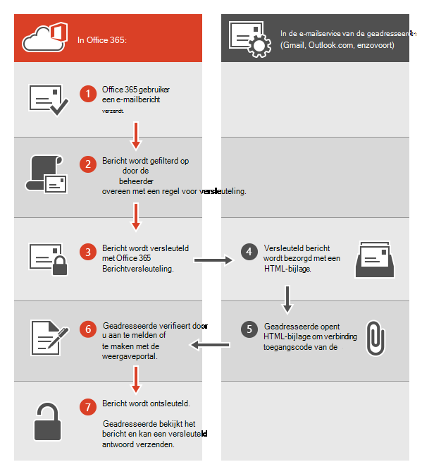
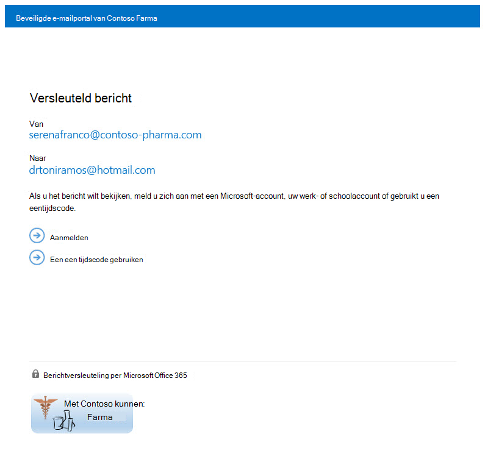

# <a name="legacy-information-for-office-365-message-encryption"></a>Verouderde informatie voor Office 365-berichtversleuteling

Als u uw organisatie nog niet hebt verplaatst naar de nieuwe OME-mogelijkheden, maar u OME al hebt geïmplementeerd, is de informatie in dit artikel van toepassing op uw organisatie. Microsoft raadt u aan een plan te maken om over te gaan naar de nieuwe OME-mogelijkheden zodra dit redelijk is voor uw organisatie. Zie Nieuwe functies Office 365-berichtversleuteling Azure Information Protection instellen voor [instructies.](set-up-new-message-encryption-capabilities.md) Als u eerst wilt weten hoe de nieuwe mogelijkheden werken, bekijkt [u Office 365-berichtversleuteling.](ome.md) De rest van dit artikel verwijst naar OME-gedrag vóór de release van de nieuwe OME-mogelijkheden.
  
Met Office 365-berichtversleuteling kan uw organisatie versleutelde e-mailberichten verzenden en ontvangen tussen personen binnen en buiten uw organisatie. Office 365-berichtversleuteling werkt met Outlook.com, Yahoo, Gmail en andere e-mailservices. Versleuteling van e-mailberichten helpt ervoor te zorgen dat alleen beoogde geadresseerden berichtinhoud kunnen bekijken.
  
Dit zijn enkele voorbeelden:
  
- Een bankmedewerker stuurt creditcardafschriften naar klanten

- Een vertegenwoordiger van een verzekeringsmaatschappij verstrekt polisgegevens aan klanten

- Een hypotheekmakelaar vraagt financiële gegevens op van een klant voor een leningsaanvraag

- Een zorgprovider stuurt zorggegevens naar patiënten

- Een advocaat stuurt vertrouwelijke informatie naar een klant of een andere advocaat

## <a name="how-office-365-message-encryption-works-without-the-new-capabilities"></a>Hoe Office 365-berichtversleuteling werkt zonder de nieuwe mogelijkheden

Office 365-berichtversleuteling is een onlineservice die is gebaseerd op Microsoft Azure Rights Management (Azure RMS). Met Azure RMS kunnen beheerders regels voor e-mailstroom definiëren om de voorwaarden voor versleuteling te bepalen. Een regel kan bijvoorbeeld de versleuteling vereisen van alle berichten die zijn geadresseerd aan een specifieke geadresseerde.
  
Wanneer iemand een e-mailbericht verzendt in Exchange Online die overeenkomt met een versleutelingsregel, wordt het bericht verzonden met een HTML-bijlage. De ontvanger opent de HTML-bijlage en volgt instructies voor het weergeven van het versleutelde bericht in de Office 365-berichtversleuteling portal. De geadresseerde kan ervoor kiezen om het bericht te bekijken door u aan te melden met een Microsoft-account of een werk of school die is gekoppeld aan Office 365, of door een een-time pass code te gebruiken. Beide opties helpen ervoor te zorgen dat alleen de beoogde geadresseerde het versleutelde bericht kan bekijken. Dit proces is heel anders voor de nieuwe OME-mogelijkheden.
  
In het volgende diagram wordt de passage van een e-mailbericht door het versleutelings- en ontsleutelingsproces samengevat.
  

  
Zie Servicegegevens voor oudere Office 365-berichtversleuteling vóór de release van de [nieuwe OME-mogelijkheden](legacy-information-for-message-encryption.md#LegacyServiceInfo)voor meer informatie.
  
## <a name="defining-mail-flow-rules-for-office-365-message-encryption-that-dont-use-the-new-ome-capabilities"></a>E-mailstroomregels definiëren voor Office 365-berichtversleuteling die geen gebruik maken van de nieuwe OME-mogelijkheden

Als u Office 365-berichtversleuteling wilt inschakelen zonder de nieuwe mogelijkheden, definiëren Exchange Online en Exchange Online Protection beheerders Exchange regels voor e-mailstroom. Deze regels bepalen onder welke voorwaarden e-mailberichten moeten worden versleuteld, evenals voorwaarden voor het verwijderen van berichtversleuteling. Wanneer een versleutelingsactie is ingesteld voor een regel, voert de service de actie uit op berichten die voldoen aan de regelvoorwaarden voordat u de berichten verstuurt.

E-mailstroomregels zijn flexibel, zodat u voorwaarden kunt combineren, zodat u in één regel aan specifieke beveiligingsvereisten kunt voldoen. U kunt bijvoorbeeld een regel maken om alle berichten te versleutelen die opgegeven trefwoorden bevatten en die zijn geadresseerd aan externe geadresseerden. Office 365-berichtversleuteling versleutelt ook antwoorden van geadresseerden van versleutelde e-mail en u kunt een regel maken die deze antwoorden ontsleutelt als een gemak voor uw e-mailgebruikers. Op die manier hoeft u zich niet aan te melden bij de versleutelingsportal om antwoorden weer te geven.
  
Zie Regels definiëren voor Office 365-berichtversleuteling voor meer informatie over het maken van Exchange [e-mailstroomregels.](define-mail-flow-rules-to-encrypt-email.md)
  
### <a name="use-the-eac-to-create-a-mail-flow-rule-for-encrypting-email-messages-without-the-new-ome-capabilities"></a>Gebruik de EAC om een e-mailstroomregel te maken voor het versleutelen van e-mailberichten zonder de nieuwe OME-mogelijkheden

1. Meld u in een webbrowser met behulp van een werk- of schoolaccount dat globale beheerdersmachtigingen is verleend, [aan bij Office 365.](https://support.office.com/article/b9582171-fd1f-4284-9846-bdd72bb28426#ID0EAABAAA=Web_browser)

2. Kies de **tegel** Beheerder.

3. Kies in Microsoft 365 beheercentrum de optie **Beheercentra** \> **Exchange.**

4. Ga in het EAC naar **E-mailstroomregels** \>  en selecteer **Nieuw** nieuw pictogram Een nieuwe  \> **maken.** Zie voor meer informatie over het gebruik van het EAC [Exchange beheercentrum in Exchange Online.](/exchange/exchange-admin-center)

5. Typ **in Naam** een naam voor de regel, zoals E-mail versleutelen voor DrToniRamos@hotmail.com.

6. Selecteer **in Deze regel toepassen als** u een voorwaarde selecteert en voer zo nodig een waarde in. Als u bijvoorbeeld berichten wilt versleutelen die naar DrToniRamos@hotmail.com:

   1. Selecteer **in Deze regel toepassen als**, selecteer de **geadresseerde is**.

   2. Selecteer een bestaande naam in de lijst met contactpersonen of typ een nieuw e-mailadres in **het selectievakje Namen.**

      - Als u een bestaande naam wilt selecteren, selecteert u deze in de lijst en klikt u vervolgens op **OK.**

      - Als u een nieuwe naam wilt invoeren, typt u een e-mailadres in het **selectievakje** Namen en selecteert u **namen controleren** \> **OK.**

7. Als u meer voorwaarden wilt toevoegen, kiest u **Meer opties** en **selecteert u voorwaarde toevoegen** en selecteert u in de lijst.

   Als u de regel bijvoorbeeld alleen wilt toepassen als de geadresseerde zich buiten uw organisatie, selecteert u **voorwaarde** toevoegen en selecteert u Vervolgens De geadresseerde **is extern/intern** \> **Buiten de organisatie** \> **OK.**

8. Als u versleuteling wilt inschakelen zonder de nieuwe  OME-mogelijkheden te gebruiken, selecteert u **in** Het volgende doen de optie Berichtbeveiliging wijzigen De vorige versie van OME toepassen en vervolgens \>  **Opslaan kiezen.**

   Als u een foutmelding ontvangt dat IRM-licenties niet zijn ingeschakeld, gebruikt u geen oudere OME.

9. (Optioneel) Kies **Actie toevoegen om** een andere actie op te geven.

### <a name="use-exchange-online-powershell-to-create-a-mail-flow-rule-for-encrypting-email-messages-without-the-new-ome-capabilities"></a>Gebruik Exchange Online PowerShell om een e-mailstroomregel te maken voor het versleutelen van e-mailberichten zonder de nieuwe OME-mogelijkheden

1. Verbinding maken met Exchange Online PowerShell. Zie powerShell Verbinding maken [Exchange Online voor meer informatie.](/powershell/exchange/connect-to-exchange-online-powershell)

2. Maak een regel met de **cmdlet New-TransportRule** en stel de _parameter ApplyOME_ in op `$true` .

   In dit voorbeeld moeten alle e-mailberichten die naar DrToniRamos@hotmail.com worden verzonden, worden versleuteld.

   ```powershell
   New-TransportRule -Name "Encrypt rule for Dr Toni Ramos" -SentTo "DrToniRamos@hotmail.com" -SentToScope "NotinOrganization" -ApplyOME $true
   ```

   Waar,

   - De unieke naam van de nieuwe regel is 'Versleutelingsregel voor Dr. Toni Ramos'.
   - De _parameter SentTo_ geeft de geadresseerden van het bericht aan (geïdentificeerd op naam, e-mailadres, onderscheiden naam, enzovoort). In dit voorbeeld wordt de geadresseerde geïdentificeerd met het e-mailadres 'DrToniRamos@hotmail.com'.
   - De _parameter SentToScope_ geeft de locatie aan van de geadresseerden van het bericht. In dit voorbeeld is het postvak van de geadresseerde in hotmail en maakt geen deel uit van de organisatie, dus wordt de `NotInOrganization` waarde gebruikt.

   Zie [Nieuwe-Transportregel](/powershell/module/exchange/New-TransportRule) voor gedetailleerde syntaxis- en parameterinformatie.

### <a name="remove-encryption-from-email-replies-encrypted-without-the-new-ome-capabilities"></a>Versleuteling verwijderen uit e-mailantwoorden die zijn versleuteld zonder de nieuwe OME-mogelijkheden

Wanneer uw e-mailgebruikers versleutelde berichten verzenden, kunnen geadresseerden van deze berichten reageren met versleutelde antwoorden. U kunt regels voor e-mailstroom maken om versleuteling automatisch te verwijderen uit antwoorden, zodat e-mailgebruikers in uw organisatie zich niet hoeven aan te melden bij de versleutelingsportal om ze te bekijken. U kunt de EAC- of Windows PowerShell cmdlets gebruiken om deze regels te definiëren. U kunt berichten ontsleutelen die vanuit uw organisatie worden verzonden of berichten die antwoorden zijn op berichten die vanuit uw organisatie zijn verzonden. U kunt versleutelde berichten die afkomstig zijn van buiten uw organisatie, niet ontsleutelen.

#### <a name="use-the-eac-to-create-a-rule-for-removing-encryption-from-email-replies-encrypted-without-the-new-ome-capabilities"></a>Gebruik het EAC om een regel te maken voor het verwijderen van versleuteling uit e-mailantwoorden die zijn versleuteld zonder de nieuwe MOGELIJKHEDEN voor OME

1. Meld u in een webbrowser met behulp van een werk- of schoolaccount dat is verleend aan beheerdersmachtigingen, [aan bij Office 365.](https://support.office.com/article/b9582171-fd1f-4284-9846-bdd72bb28426#ID0EAABAAA=Web_browser)

2. Kies de **tegel** Beheerder.

3. Kies in Microsoft 365 beheercentrum de optie **Beheercentra** \> **Exchange.**

4. Ga in het EAC naar **E-mailstroomregels** \>  en selecteer **Nieuw** nieuw pictogram Een nieuwe  \> **maken.** Zie voor meer informatie over het gebruik van het EAC [Exchange beheercentrum in Exchange Online.](/exchange/exchange-admin-center)

5. Typ **in Naam** een naam voor de regel, zoals Versleuteling verwijderen uit inkomende e-mail.

6. Selecteer **in Deze regel toepassen als** u de voorwaarden selecteert waarop versleuteling moet worden verwijderd uit berichten, zoals De geadresseerde **bevindt** zich binnen \> **de organisatie.**

7. Selecteer **in Ga als volgt** te werk en selecteer De **berichtbeveiliging wijzigen** De vorige versie van \> **OME verwijderen.**

8. Klik op **Opslaan**.

#### <a name="use-exchange-online-powershell-to-create-a-rule-to-remove-encryption-from-email-replies-encrypted-without-the-new-ome-capabilities"></a>Gebruik Exchange Online PowerShell om een regel te maken om versleuteling te verwijderen uit e-mailantwoorden die zijn versleuteld zonder de nieuwe OME-mogelijkheden

1. Verbinding maken met Exchange Online PowerShell. Zie powerShell Verbinding maken [Exchange Online voor meer informatie.](/powershell/exchange/connect-to-exchange-online-powershell)

2. Maak een regel met de **cmdlet New-TransportRule** en stel de parameter _RemoveOME_ in op `$true` .

   In dit voorbeeld wordt de versleuteling verwijderd uit alle e-mail die naar geadresseerden in de organisatie is verzonden.

   ```powershell
   New-TransportRule -Name "Remove encryption from incoming mail" -SentToScope "InOrganization" -RemoveOME $true
   ```

   Waar,

   - De unieke naam van de nieuwe regel is 'Versleuteling verwijderen uit inkomende e-mail'.
   - De _parameter SentToScope_ geeft de locatie aan van de geadresseerden van het bericht. In dit voorbeeld wordt de `InOrganization` waardewaarde gebruikt, wat een van de volgende gegevens aangeeft:
     - De geadresseerde is een postvak, e-mailgebruiker, groep of openbare map met e-mail in uw organisatie.
     - Het e-mailadres van de geadresseerde is een geaccepteerd domein dat is geconfigureerd als een gezaghebbend domein of een intern relaydomein in uw organisatie _en_ het bericht is verzonden of ontvangen via een geverifieerde verbinding.

Zie [Nieuwe-Transportregel](/powershell/module/exchange/New-TransportRule) voor gedetailleerde syntaxis- en parameterinformatie.

## <a name="sending-viewing-and-replying-to-messages-encrypted-without-the-new-capabilities"></a>Berichten verzenden, weergeven en beantwoorden die zijn versleuteld zonder de nieuwe mogelijkheden

Met Office 365-berichtversleuteling worden e-mailberichten automatisch versleuteld op basis van door de beheerder gedefinieerde regels. Een e-mailbericht met een versleuteld bericht komt binnen in het Postvak IN van de geadresseerde met een HTML-bestand als bijlage.
  
Geadresseerden volgen instructies in het bericht om de bijlage te openen en te verifiëren met behulp van een Microsoft-account of een werk of school die is gekoppeld aan Office 365. Als geadresseerden geen van beide account hebben, worden ze doorgestuurd naar het maken van een Microsoft-account, zodat ze zich kunnen aanmelden om het versleutelde bericht te bekijken. Geadresseerden kunnen er ook voor kiezen om een een time pass code te krijgen om het bericht te bekijken. Nadat ze zich hebben aanmelden of een-tijdspascode hebben gebruikt, kunnen geadresseerden het ontsleutelde bericht bekijken en een versleuteld antwoord verzenden.
  
## <a name="customize-encrypted-messages-with-office-365-message-encryption"></a>Versleutelde berichten aanpassen met Office 365-berichtversleuteling

Als beheerder Exchange Online en Exchange Online Protection kunt u uw versleutelde berichten aanpassen. U kunt bijvoorbeeld het merk en logo van uw bedrijf toevoegen, een inleiding opgeven en vrijwaringstekst toevoegen in versleutelde berichten en in de portal waar geadresseerden uw versleutelde berichten bekijken. Met Windows PowerShell cmdlets kunt u de volgende aspecten van de weergave-ervaring aanpassen voor geadresseerden van versleutelde e-mailberichten:

- Inleidende tekst van het e-mailbericht met het versleutelde bericht

- Vrijwaringstekst van het e-mailbericht met het versleutelde bericht

- Portaltekst die wordt weergegeven in de portal voor het weergeven van berichten

- Logo dat wordt weergegeven in het e-mailbericht en de weergaveportal

U kunt ook op elk moment terugkeren naar het standaard-uiterlijk.
  
In het volgende voorbeeld ziet u een aangepast logo voor ContosoPharma in de e-mailbijlage:

> [!div class="mx-imgBorder"]
> 
  
**Versleutelings-e-mailberichten en de versleutelingsportal aanpassen met het merk van uw organisatie**
  
1. Verbinding maken om Exchange Online externe PowerShell te gebruiken, zoals wordt beschreven in Verbinding maken [om Exchange Online Remote PowerShell te gebruiken.](/powershell/exchange/connect-to-exchange-online-powershell)

2. Gebruik de Set-OMEConfiguration cmdlet zoals hier wordt beschreven: [Set-OMEConfiguration](/powershell/module/exchange/set-omeconfiguration) of gebruik de volgende tabel voor richtlijnen.

   **Versleutelingsopties**

   | Deze functie van de versleutelingservaring aanpassen | Gebruik deze Windows PowerShell opdrachten |
   |:-----|:-----|
   |Standaardtekst die versleutelde e-mailberichten begeleidt  <br/> De standaardtekst wordt weergegeven boven de instructies voor het weergeven van versleutelde berichten  <br/> | `Set-OMEConfiguration -Identity <OMEConfigurationIdParameter> -EmailText "<string of up to 1024 characters>"` <br/> **Voorbeeld:**`Set-OMEConfiguration -Identity "OME Configuration" -EmailText "Encrypted message from ContosoPharma secure messaging system"` <br/> |
   |Vrijwaringsverklaring in het e-mailbericht met het versleutelde bericht  <br/> | `Set-OMEConfiguration -Identity <OMEConfigurationIdParameter> DisclaimerText "<your disclaimer statement, string of up to 1024 characters>"` <br/> **Voorbeeld:**`Set-OMEConfiguration -Identity "OME Configuration" -DisclaimerText "This message is confidential for the use of the addressee only"` <br/> |
   |Tekst die boven aan de portal voor het weergeven van versleutelde e-mail wordt weergegeven  <br/> | `Set-OMEConfiguration -Identity <OMEConfigurationIdParameter> -PortalText "<text for your portal, string of up to 128 characters>"` <br/> **Voorbeeld:**`Set-OMEConfiguration -Identity "OME Configuration" -PortalText "ContosoPharma secure email portal"` <br/> |
   |Logo  <br/> | `Set-OMEConfiguration -Identity <OMEConfigurationIdParameter> -Image <Byte[]>` <br/> **Voorbeeld:**`Set-OMEConfiguration -Identity "OME configuration" -Image (Get-Content "C:\Temp\contosologo.png" -Encoding byte)` <br/> Ondersteunde bestandsindelingen: .png, .jpg, .bmp of .tiff  <br/> Optimale grootte van het logobestand: minder dan 40 KB  <br/> Optimale grootte van de afbeelding van het logo: 170x70 pixels  <br/> |

**Merkaanpassingen verwijderen uit versleutelings-e-mailberichten en de versleutelingsportal**
  
1. Verbinding maken om Exchange Online externe PowerShell te gebruiken, zoals wordt beschreven in Verbinding maken [om Exchange Online Remote PowerShell te gebruiken.](/powershell/exchange/connect-to-exchange-online-powershell)

2. Gebruik de Set-OMEConfiguration cmdlet zoals hier wordt beschreven: [Set-OMEConfiguration](/powershell/module/exchange/set-omeconfiguration). Als u de merkaanpassingen van uw organisatie wilt verwijderen uit de waarden DisclaimerTekst, E-mailtekst en PortalTekst, stelt u de waarde in op een lege  `""` tekenreeks, . Voor alle afbeeldingswaarden, zoals Logo, stelt u de waarde in op  `"$null"` .

   **Versleutelingsopties**

   | Deze functie van de versleutelingservaring terugdraaien naar de standaardtekst en afbeelding | Gebruik deze Windows PowerShell opdrachten |
   |:-----|:-----|
   |Standaardtekst die versleutelde e-mailberichten begeleidt  <br/> De standaardtekst wordt weergegeven boven de instructies voor het weergeven van versleutelde berichten  <br/> | `Set-OMEConfiguration -Identity <OMEConfigurationIdParameter> -EmailText "<empty string>"` <br/> **Voorbeeld:**`Set-OMEConfiguration -Identity "OME Configuration" -EmailText ""` <br/> |
   |Vrijwaringsverklaring in het e-mailbericht met het versleutelde bericht  <br/> | `Set-OMEConfiguration -Identity <OMEConfigurationIdParameter> DisclaimerText "<empty string>"` <br/> **Voorbeeld:**`Set-OMEConfiguration -Identity "OME Configuration" -DisclaimerText ""` <br/> |
   |Tekst die boven aan de portal voor het weergeven van versleutelde e-mail wordt weergegeven  <br/> | `Set-OMEConfiguration -Identity <OMEConfigurationIdParameter> -PortalText "<empty string>"` <br/> **Voorbeeld om terug te keren naar standaard:**`Set-OMEConfiguration -Identity "OME Configuration" -PortalText ""` <br/> |
   |Logo  <br/> | `Set-OMEConfiguration -Identity <OMEConfigurationIdParameter> -Image <"$null">` <br/> **Voorbeeld om terug te keren naar standaard:**`Set-OMEConfiguration -Identity "OME configuration" -Image $null` <br/> |

## <a name="service-information-for-legacy-office-365-message-encryption-prior-to-the-release-of-the-new-ome-capabilities"></a>Servicegegevens voor oudere Office 365-berichtversleuteling vóór de release van de nieuwe OME-mogelijkheden
<a name="LegacyServiceInfo"> </a>

De volgende tabel bevat technische details voor de Office 365-berichtversleuteling service vóór de release van de nieuwe OME-mogelijkheden.
  
| Servicedetails | Beschrijving |
|:-----|:-----|
|Vereisten voor clientapparaat  <br/> |Versleutelde berichten kunnen worden weergegeven op elk clientapparaat, zolang de HTML-bijlage kan worden geopend in een moderne browser die Formulierpost ondersteunt.  <br/> |
|Versleutelingsalgoritme en fips-compliance (Federal Information Processing Standards)  <br/> |Office 365-berichtversleuteling gebruikt dezelfde versleutelingssleutels als Windows Azure Information Rights Management (IRM) en ondersteunt Cryptographic Mode 2 (2K-toets voor RSA en 256 bitstoets voor SHA-1-systemen). Zie [AD RMS-cryptografische modi](/previous-versions/windows/it-pro/windows-server-2008-R2-and-2008/hh867439(v=ws.10))voor meer informatie over de onderliggende IRM-cryptografische modi.  <br/> |
|Ondersteunde berichtentypen  <br/> |Office 365-berichtversleuteling wordt alleen ondersteund voor items met een berichtklasse-id van **IPM. Opmerking**. Zie Itemtypen en [berichtklassen voor meer informatie.](/office/vba/outlook/Concepts/Forms/item-types-and-message-classes)  <br/> |
|Limieten voor berichtgrootte  <br/> |Office 365-berichtversleuteling kunt berichten van maximaal 25 megabyte versleutelen. Zie voor meer informatie over limieten voor [berichtgrootte Exchange Online Limieten.](/office365/servicedescriptions/exchange-online-service-description/exchange-online-limits)  <br/> |
|Exchange Online e-mailretentiebeleid  <br/> |Exchange Online worden de versleutelde berichten niet opgeslagen.  <br/> |
|Taalondersteuning voor Office 365-berichtversleuteling  <br/> | Office 365 Berichtversleuteling ondersteunt Microsoft 365 talen, als volgt:  <br/>  Inkomende e-mailberichten en bijgevoegde HTML-bestanden worden gelokaliseerd op basis van de taalinstellingen van de afzender.  <br/>  De weergaveportal is gelokaliseerd op basis van de browserinstellingen van de ontvanger.  <br/>  De body (inhoud) van het versleutelde bericht is niet gelokaliseerd.  <br/> |
|Privacygegevens voor OME Portal en OME Viewer App  <br/> |De [Office 365 privacyverklaring voor berichtenversleutelingsportal](https://privacy.microsoft.com/privacystatement) bevat gedetailleerde informatie over wat Microsoft wel en niet doet met uw persoonlijke gegevens.  <br/> |

## <a name="frequently-asked-questions-about-legacy-ome"></a>Veelgestelde vragen over oudere OME
<a name="LegacyServiceInfo"> </a>

Hebt u vragen over Office 365-berichtversleuteling? Hier vindt u enkele antwoorden. Als u niet kunt vinden wat u nodig hebt, raadpleegt u de [Microsoft Tech Community-forums voor Office 365.](https://techcommunity.microsoft.com/t5/Office-365/ct-p/Office365)
  
 **V. Mijn gebruikers verzenden versleutelde e-mailberichten naar geadresseerden buiten onze organisatie. Is er iets dat externe geadresseerden moeten doen om e-mailberichten te lezen en te beantwoorden die zijn versleuteld met Office 365-berichtversleuteling?**
  
Geadresseerden buiten uw organisatie die Microsoft 365 versleutelde berichten ontvangen, kunnen deze op twee manieren bekijken:
  
- Door u aan te melden met een Microsoft-account of een werk- of schoolaccount dat is gekoppeld aan Office 365.

- Met behulp van een een-time pass code.

 **V. Worden Microsoft 365 versleutelde berichten opgeslagen in de cloud of op Microsoft-servers?**
  
Nee, de versleutelde berichten worden bewaard in het e-mailsysteem van de geadresseerde en wanneer de geadresseerde het bericht opent, wordt het tijdelijk gepost voor weergave op Microsoft-servers. De berichten worden daar niet opgeslagen.
  
 **V. Kan ik versleutelde e-mailberichten aanpassen met mijn merk?**
  
Ja. U kunt Windows PowerShell cmdlets gebruiken om de standaardtekst aan te passen die boven aan versleutelde e-mailberichten, de vrijwaringstekst en het logo wordt weergegeven dat u wilt gebruiken voor het e-mailbericht en de versleutelingsportal. Deze functie is nu beschikbaar in OMEv2. Zie Huisstijl [toevoegen aan versleutelde berichten voor meer informatie.](add-your-organization-brand-to-encrypted-messages.md)
  
 **V. Is voor de service een licentie vereist voor elke gebruiker in mijn organisatie?**
  
Een licentie is vereist voor elke gebruiker in de organisatie die versleutelde e-mail verzendt.
  
 **V. Hebben externe geadresseerden abonnementen nodig?**
  
Nee, externe geadresseerden hebben geen abonnement nodig om versleutelde berichten te lezen of te beantwoorden.
  
 **V. Hoe verschilt Office 365-berichtversleuteling van Rights Management Services (RMS)?**
  
RMS biedt informatierechtenbeschermingsmogelijkheden voor interne e-mailberichten van een organisatie door ingebouwde sjablonen te bieden, zoals: Niet doorsturen en Vertrouwelijk bedrijf. Office 365-berichtversleuteling ondersteunt versleuteling van e-mailberichten voor berichten die naar externe geadresseerden en interne geadresseerden worden verzonden.
  
 **V. Hoe verschilt Office 365-berichtversleuteling van S/MIME?**
  
S/MIME is in feite een clientversleutelingstechnologie en vereist een ingewikkelde infrastructuur voor certificaatbeheer en publicatie. Office 365-berichtversleuteling gebruikt e-mailstroomregels (ook wel transportregels genoemd) en is niet afhankelijk van het publiceren van certificaten.
  
 **V. Kan ik de versleutelde berichten lezen via mobiele apparaten?**
  
Ja, u kunt berichten bekijken op Android en iOS door de OME Viewer-apps te downloaden vanuit de Google Play Store en de Apple App Store. Open de HTML-bijlage in de APP OME Viewer en volg de instructies om het versleutelde bericht te openen. Voor andere mobiele apparaten kunt u de HTML-bijlage openen zolang uw e-mailclient Formulierpost ondersteunt.
  
 **V. Zijn antwoorden en doorgestuurde berichten versleuteld?**
  
Ja. Antwoorden worden nog steeds versleuteld gedurende de duur van de thread.
  
 **V. Biedt Office 365-berichtversleuteling lokalisatie?**
  
Inkomende e-mail en HTML-inhoud is gelokaliseerd op basis van e-mailinstellingen van afzenders. De weergaveportal is gelokaliseerd op basis van de browserinstellingen van de ontvanger. De werkelijke inhoud van het versleutelde bericht is echter niet gelokaliseerd.
  
 **V. Welke versleutelingsmethode wordt gebruikt voor Office 365-berichtversleuteling?**
  
Office 365-berichtversleuteling Rights Management Services (RMS) gebruikt als versleutelingsinfrastructuur. De gebruikte versleutelingsmethode is afhankelijk van waar u de RMS-sleutels verkrijgt die worden gebruikt om berichten te versleutelen en te ontsleutelen.
  
- Als u de Microsoft Azure rms gebruikt om de toetsen te verkrijgen, wordt cryptografische modus 2 gebruikt. Cryptografische modus 2 is een bijgewerkte en verbeterde AD RMS-cryptografische implementatie. Het ondersteunt RSA 2048 voor handtekening en versleuteling en ondersteunt SHA-256 voor handtekening.

- Als u ACTIVE Directory (AD) RMS gebruikt om de toetsen te verkrijgen, wordt cryptografische modus 1 of Cryptografische modus 2 gebruikt. De gebruikte methode is afhankelijk van uw on-premises AD RMS-implementatie. Cryptografische modus 1 is de oorspronkelijke AD RMS-cryptografische implementatie. Het ondersteunt RSA 1024 voor handtekening en versleuteling en ondersteunt SHA-1 voor handtekening. Deze modus wordt nog steeds ondersteund door alle huidige versies van RMS.

Zie [AD RMS-cryptografische modi](/previous-versions/windows/it-pro/windows-server-2008-R2-and-2008/hh867439(v=ws.10))voor meer informatie.
  
**V. Waarom zeggen sommige versleutelde berichten dat ze afkomstig** zijn van Office365@messaging.microsoft.com?
  
Wanneer een versleuteld antwoord wordt verzonden vanuit de versleutelingsportal of via de APP OME Viewer, wordt het verzendende e-mailadres ingesteld op Office365@messaging.microsoft.com omdat het versleutelde bericht wordt verzonden via een Microsoft-eindpunt. Hiermee voorkomt u dat versleutelde berichten worden gemarkeerd als spam. De weergegeven naam in het e-mailbericht en het adres in de versleutelingsportal worden niet gewijzigd vanwege deze labeling. Deze labeling is ook alleen van toepassing op berichten die via de portal worden verzonden, niet via een andere e-mailclient.
  
 **V. Ik ben een Exchange hosted encryption (EHE) abonnee. Waar kan ik meer informatie vinden over de upgrade naar Office 365-berichtversleuteling?**
  
Alle EHE-klanten zijn geüpgraded naar Office 365-berichtversleuteling. Ga voor meer informatie naar [het Exchange Hosted Encryption Upgrade Center](../security/defender-365-security/exchange-online-protection-overview.md).
  
 **V. Moet ik URL's, IP-adressen of poorten in de firewall van mijn organisatie openen ter ondersteuning van Office 365-berichtversleuteling?**
  
Ja. U moet URL's voor Exchange Online toevoegen aan de lijst toestaan voor uw organisatie om verificatie in te schakelen voor berichten die zijn versleuteld door Office 365-berichtversleuteling. Zie url's Exchange Online [URL's en IP-adresbereiken Microsoft 365 voor een](../enterprise/urls-and-ip-address-ranges.md)lijst met Exchange Online URL's.
  
 **V. Naar hoeveel geadresseerden kan ik een Microsoft 365 verzenden?**
  
De geadresseerdelimiet is 500 geadresseerden per bericht, of, wanneer dit wordt gecombineerd na de  uitbreiding van de distributielijst, 11.980 tekens in het veld Aan van het bericht, wat het eerst komt.
  
 **V. Is het mogelijk om een bericht in te trekken dat naar een bepaalde geadresseerde is verzonden?**
  
Nee. U kunt een bericht naar een bepaalde persoon niet intrekken nadat het is verzonden.
  
 **V. Kan ik een rapport bekijken van versleutelde berichten die zijn ontvangen en gelezen?**
  
Er is geen rapport waarin wordt weergegeven of een versleuteld bericht is bekeken, maar er zijn Microsoft 365-rapporten beschikbaar die u kunt gebruiken om het aantal berichten te bepalen dat is afgestemd op een specifieke regel voor de e-mailstroom (ook wel een transportregel genoemd).
  
 **V. Wat doet Microsoft met de informatie die ik geef via de OME Portal en de APP OME Viewer?**
  
De [Office 365 privacyverklaring voor berichtenversleutelingsportal](https://privacy.microsoft.com/privacystatement) bevat gedetailleerde informatie over wat Microsoft wel en niet doet met uw persoonlijke gegevens.

**V. Wat moet ik doen als ik de een time pass-code niet ontvang nadat ik deze heb aangevraagd?**

Controleer eerst de map ongewenste e-mail of spam in uw e-mailclient. DKIM- en DMARC-instellingen voor uw organisatie kunnen ervoor zorgen dat deze e-mailberichten worden gefilterd als spam.

Controleer vervolgens de quarantaine in het Beveiligings- & Compliancecentrum. Vaak eindigen berichten met een een-tijdspascode, met name de eerste berichten die uw organisatie ontvangt, in quarantaine.